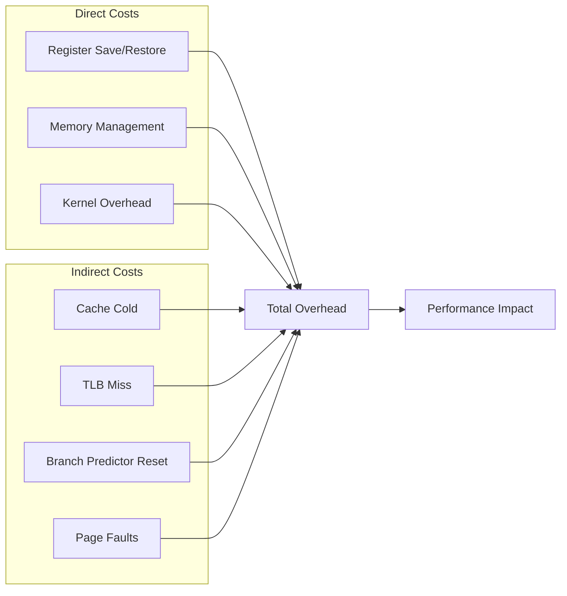

---
tags:
  - cache-misses
  - context-switching
  - hands-on
  - intermediate
  - medium-read
  - monitoring
  - numa-optimization
  - performance-analysis
  - 시스템프로그래밍
difficulty: INTERMEDIATE
learning_time: "4-6시간"
main_topic: "시스템 프로그래밍"
priority_score: 4
---

# 2.3C: 성능 오버헤드 분석

## 페이스북의 10억 달러 문제

Meta(구 페이스북) 성능팀 리더의 발표:

> "2019년 분석 결과, 우리 데이터센터 CPU 시간의 18%가 컨텍스트 스위칭 오버헤드였습니다. 전기료로만 연간 10억 달러! 😱"

실제 측정 데이터:

```python
# 페이스북 서버의 컨텍스트 스위칭 비용
overhead_breakdown = {
    '직접 비용': {
        '레지스터 저장/복원': '2%',
        '커널 코드 실행': '3%',
        '스케줄러 오버헤드': '2%',
    },
    '간접 비용': {  # 진짜 문제!
        'L1 캐시 미스': '4%',
        'L2 캐시 미스': '3%',
        'L3 캐시 미스': '2%',
        'TLB 미스': '1%',
        '분기 예측 실패': '1%',
    },
    '총 오버헤드': '18%'  # = 10억 달러/년 💸
}
```

## 직접 비용과 간접 비용 - 빙산의 일각



## 컨텍스트 스위칭 비용 측정 - 실제로 얼마나 느릴까?

리눅스 커널 개발자의 벤치마크:

> "사람들은 컨텍스트 스위칭이 '몇 마이크로초'라고 하지만, 실제 애플리케이션에서는 캐시 미스 때문에 10배는 더 걸립니다."

실제 측정 결과:

```bash
# 이상적인 경우 vs 현실
Ideal (hot cache):     2-3 μs   # 교과서
Reality (cold cache): 20-30 μs  # 실제 서버
Worst case:           100+ μs   # NUMA 시스템
```

```c
// 컨텍스트 스위칭 레이턴시 측정 - 진실을 밝혀라
#include <stdio.h>
#include <unistd.h>
#include <pthread.h>
#include <time.h>
#include <sched.h>

#define ITERATIONS 1000000

// 파이프를 통한 강제 컨텍스트 스위칭
void measure_context_switch_latency(void) {
    int pipe1[2], pipe2[2];
    struct timespec start, end;
    pid_t pid;
    char buf;

    pipe(pipe1);
    pipe(pipe2);

    pid = fork();

    if (pid == 0) {  // 자식 프로세스
        for (int i = 0; i < ITERATIONS; i++) {
            read(pipe1[0], &buf, 1);
            write(pipe2[1], "x", 1);
        }
        exit(0);
    } else {  // 부모 프로세스
        clock_gettime(CLOCK_MONOTONIC, &start);

        for (int i = 0; i < ITERATIONS; i++) {
            write(pipe1[1], "x", 1);
            read(pipe2[0], &buf, 1);
        }

        clock_gettime(CLOCK_MONOTONIC, &end);

        long long total_ns = (end.tv_sec - start.tv_sec) * 1000000000LL +
                            (end.tv_nsec - start.tv_nsec);

        // 2번의 컨텍스트 스위칭이 발생 (parent->child, child->parent)
        printf("Average context switch time: %lld ns",
               total_ns / (ITERATIONS * 2));
    }
}

// 캐시 효과 측정
struct cache_line {
    volatile long data[8];  // 64바이트 캐시 라인
} __attribute__((aligned(64)));

void measure_cache_effects(void) {
    struct cache_line *array;
    struct timespec start, end;
    int size = 1024 * 1024;  // 1MB

    array = aligned_alloc(64, size * sizeof(struct cache_line));

    // 캐시 워밍업
    for (int i = 0; i < size; i++) {
        array[i].data[0] = i;
    }

    // 캐시가 따뜻한 상태에서 측정
    clock_gettime(CLOCK_MONOTONIC, &start);
    for (int i = 0; i < size; i++) {
        array[i].data[0]++;
    }
    clock_gettime(CLOCK_MONOTONIC, &end);

    long hot_cache_ns = (end.tv_sec - start.tv_sec) * 1000000000LL +
                       (end.tv_nsec - start.tv_nsec);

    // 캐시 플러시
    system("echo 3 > /proc/sys/vm/drop_caches");

    // 캐시가 차가운 상태에서 측정
    clock_gettime(CLOCK_MONOTONIC, &start);
    for (int i = 0; i < size; i++) {
        array[i].data[0]++;
    }
    clock_gettime(CLOCK_MONOTONIC, &end);

    long cold_cache_ns = (end.tv_sec - start.tv_sec) * 1000000000LL +
                        (end.tv_nsec - start.tv_nsec);

    printf("Hot cache access: %ld ns", hot_cache_ns);
    printf("Cold cache access: %ld ns", cold_cache_ns);
    printf("Cache miss penalty: %ld ns", cold_cache_ns - hot_cache_ns);

    free(array);
}
```

## NUMA 시스템에서의 성능 함정

NUMA(Non-Uniform Memory Access) 시스템에서 컨텍스트 스위칭은 특히 비싸집니다:

```bash
# 듀얼 소켓 EPYC 7742 서버에서 측정한 실제 데이터
Local node context switch:    3.2 μs
Remote node context switch:  12.8 μs  # 4배 차이!
Cross-socket migration:      45.3 μs  # 14배 차이!

# NUMA 토폴로지 확인
$ numactl --hardware
available: 2 nodes (0-1)
node 0 cpus: 0 1 2 3 4 5 6 7 8 9 10 11 12 13 14 15
node 0 size: 32768 MB
node 0 free: 28123 MB
node 1 cpus: 16 17 18 19 20 21 22 23 24 25 26 27 28 29 30 31
node 1 size: 32768 MB
node 1 free: 29456 MB
node distances:
node   0   1
  0:  10  21  # 로컬: 10, 원격: 21 (2배 더 느림)
  1:  21  10
```

NUMA 인식 최적화 예제:

```c
#include <numa.h>
#include <numaif.h>

// NUMA 친화적 프로세스 배치
void optimize_for_numa(int target_node) {
    if (numa_available() < 0) {
        return;  // NUMA 미지원
    }

    // 메모리를 특정 노드에 할당
    struct bitmask *nodemask = numa_allocate_nodemask();
    numa_bitmask_setbit(nodemask, target_node);
    numa_set_membind(nodemask);

    // CPU 친화도도 같은 노드로 설정
    struct bitmask *cpumask = numa_allocate_cpumask();
    numa_node_to_cpus(target_node, cpumask);
    numa_sched_setaffinity(0, cpumask);

    numa_free_nodemask(nodemask);
    numa_free_cpumask(cpumask);
}

// 페이지 테이블 위치 최적화
void migrate_pages_to_local_node(void *addr, size_t size) {
    int current_node = numa_node_of_cpu(sched_getcpu());
    
    // 페이지를 로컬 노드로 마이그레이션
    numa_move_pages(0, size / 4096, &addr, &current_node, NULL, 0);
}
```

## 성능 모니터링과 분석

### 트위터가 "Fail Whale"을 고친 방법

트위터 SRE의 회고:

> "2010년 월드컵 때 트위터가 계속 다운됐어요. 원인? 초당 100만 번의 컨텍스트 스위칭! 모니터링 시스템을 구축하고, 병목을 찾아 하나씩 제거했습니다."

트위터의 모니터링 대시보드:

```python
# 실시간 컨텍스트 스위칭 모니터링
dashboard = {
    'context_switches': {
        'current': 15234,
        'threshold': 50000,
        'status': '🟢 정상'
    },
    'voluntary_switches': 8234,   # 자발적 (I/O 대기)
    'involuntary_switches': 7000, # 강제 (시간 초과)
    'cpu_migrations': 234,        # CPU 간 이동
    'alerts': [
        'API 서버 #3: 컨텍스트 스위칭 급증 (45K/s)',
        'Action: CPU 친화도 재설정 중...'
    ]
}
```

### 컨텍스트 스위칭 메트릭 수집 - 문제를 찾아라

```c
// /proc/stat에서 컨텍스트 스위칭 횟수 읽기
void monitor_context_switches(void) {
    FILE *fp = fopen("/proc/stat", "r");
    char line[256];
    unsigned long ctxt_switches = 0;

    while (fgets(line, sizeof(line), fp)) {
        if (sscanf(line, "ctxt %lu", &ctxt_switches) == 1) {
            printf("Total context switches: %lu", ctxt_switches);
            break;
        }
    }

    fclose(fp);
}

// perf_event를 사용한 상세 모니터링
#include <linux/perf_event.h>
#include <sys/syscall.h>

void setup_perf_monitoring(void) {
    struct perf_event_attr attr = {
        .type = PERF_TYPE_SOFTWARE,
        .config = PERF_COUNT_SW_CONTEXT_SWITCHES,
        .size = sizeof(attr),
        .disabled = 0,
        .exclude_kernel = 0,
        .exclude_hv = 0,
    };

    int fd = syscall(SYS_perf_event_open, &attr, 0, -1, -1, 0);

    // 주기적으로 읽기
    while (1) {
        long long count;
        read(fd, &count, sizeof(count));
        printf("Context switches in last period: %lld", count);
        sleep(1);
    }
}
```

## 실전 측정 도구

```bash
# vmstat으로 실시간 모니터링
$ vmstat 1
procs -----------memory---------- ---swap-- -----io---- -system-- ------cpu-----
 r  b   swpd   free   buff  cache   si   so    bi    bo   in   cs us sy id wa st
 2  0      0 8234560 234560 4567890    0    0     0     8  2341 4567 45 12 43  0  0
#                                                           ^^^^ 초당 컨텍스트 스위칭

# sar로 상세 분석
$ sar -w 1 5  # 5초간 1초 간격으로 프로세스 스위칭 모니터링
Linux 5.4.0-74-generic (server01)  03/15/2024  _x86_64_  (8 CPU)

07:30:01 PM    proc/s   cswch/s
07:30:02 PM      2.00   4567.00
07:30:03 PM      1.00   4234.00
07:30:04 PM      3.00   4890.00

# perf로 심층 분석
$ perf stat -e context-switches,cpu-migrations,cache-misses ./my_program
 Performance counter stats for './my_program':

         1,234,567      context-switches
            45,678      cpu-migrations
         9,876,543      cache-misses

# ftrace로 커널 레벨 추적
$ echo 1 > /sys/kernel/debug/tracing/events/sched/sched_switch/enable
$ cat /sys/kernel/debug/tracing/trace
     my_program-1234  [000] d...  1000.123456: sched_switch: prev_comm=my_program prev_pid=1234 prev_prio=120 prev_state=S ==> next_comm=kworker next_pid=5678 next_prio=120
```

## 핵심 요점

### 1. 간접 비용이 직접 비용보다 크다

레지스터 저장/복원은 빠르지만, 캐시 미스와 TLB 플러시가 진짜 성능 킬러

### 2. NUMA 시스템에서는 지역성이 핵심

원격 노드 메모리 접근은 로컬보다 3-4배 느림

### 3. 실시간 모니터링이 최적화의 시작

vmstat, sar, perf 등으로 컨텍스트 스위칭 패턴을 지속적으로 관찰

---

**이전**: [컨텍스트 스위칭 메커니즘](chapter-02-cpu-interrupt/02-18-switching-mechanisms.md)
**다음**: [최적화 전략과 실전 사례](chapter-02-cpu-interrupt/02-32-optimization-strategies.md)에서 컨텍스트 스위칭을 최적화하는 실전 기법들을 살펴보겠습니다.

## 📚 관련 문서

### 📖 현재 문서 정보

- **난이도**: INTERMEDIATE
- **주제**: 시스템 프로그래밍
- **예상 시간**: 4-6시간

### 🎯 학습 경로

- [📚 INTERMEDIATE 레벨 전체 보기](../learning-paths/intermediate/)
- [🏠 메인 학습 경로](../learning-paths/)
- [📋 전체 가이드 목록](../README.md)

### 📂 같은 챕터 (chapter-05-cpu-interrupt)

- [Chapter 5-1: CPU 아키텍처와 명령어 실행 개요](./02-01-cpu-architecture.md)
- [Chapter 5-1A: CPU 기본 구조와 명령어 실행](./02-02-cpu-fundamentals.md)
- [Chapter 5-1B: 분기 예측과 Out-of-Order 실행](./02-10-prediction-ooo.md)
- [Chapter 5-1C: CPU 캐시와 SIMD 벡터화](./02-11-cache-simd.md)
- [Chapter 5-1D: 성능 측정과 실전 최적화](./02-30-performance-optimization.md)

### 🏷️ 관련 키워드

`context-switching`, `performance-analysis`, `cache-misses`, `numa-optimization`, `monitoring`

### ⏭️ 다음 단계 가이드

- 실무 적용을 염두에 두고 프로젝트에 적용해보세요
- 관련 도구들을 직접 사용해보는 것이 중요합니다
