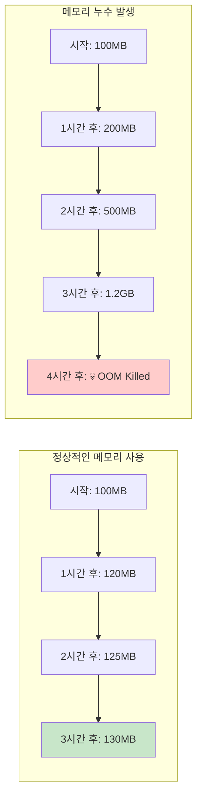
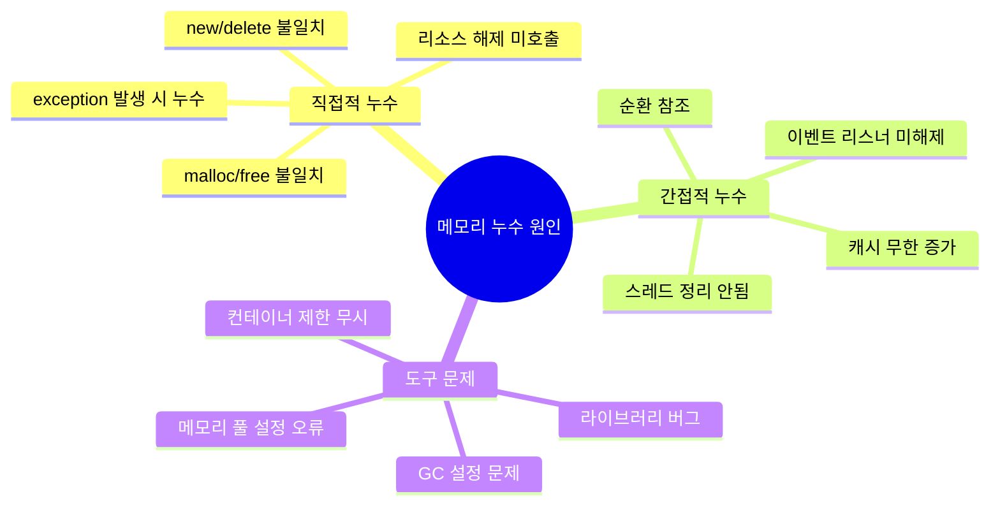
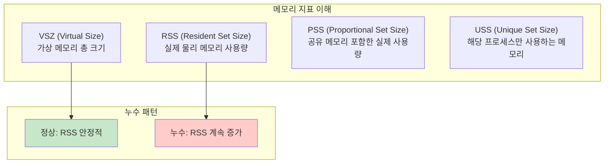
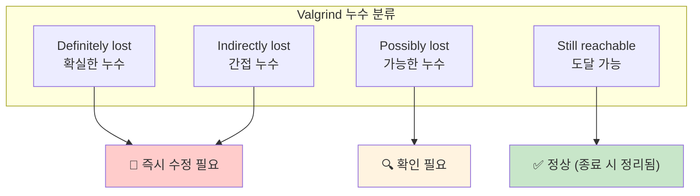
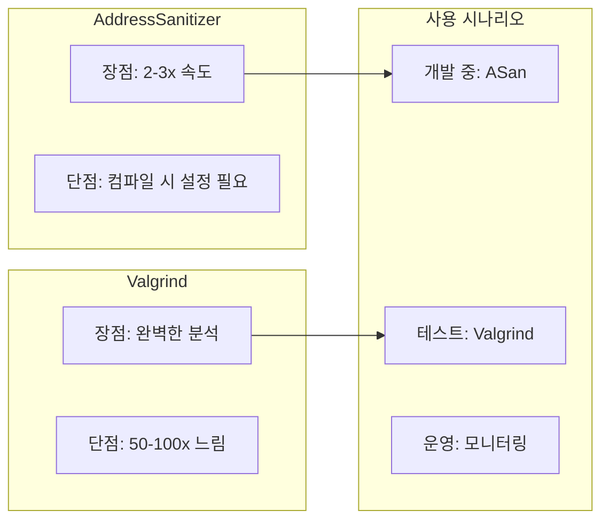
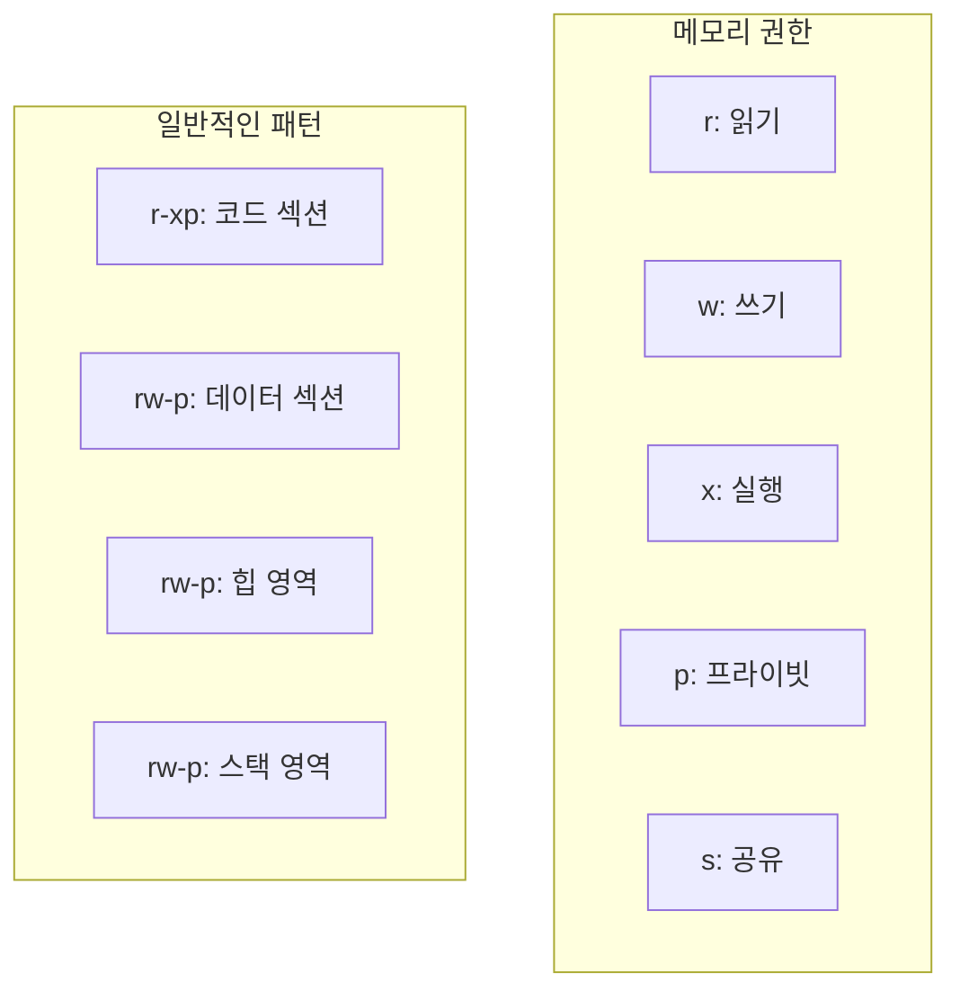
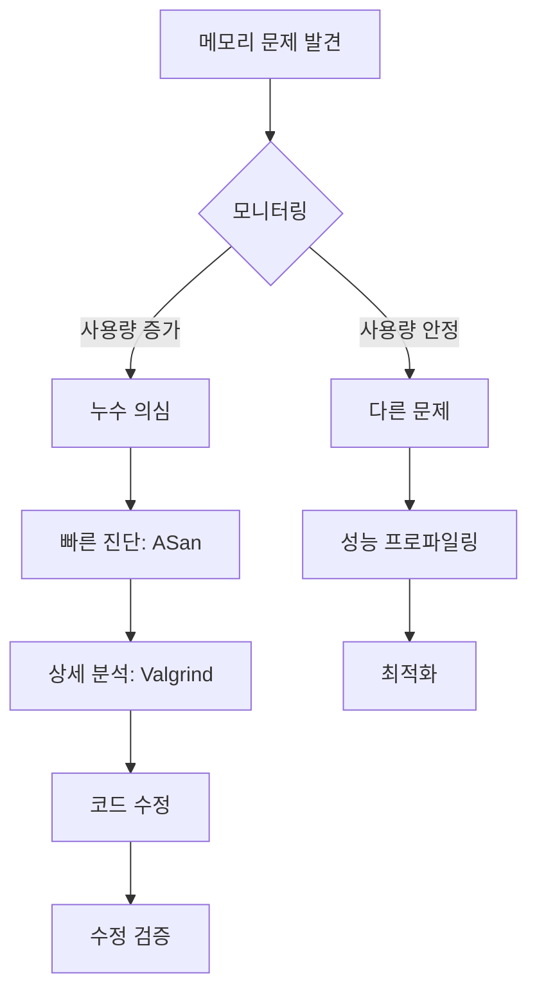

---
tags:
  - Memory
  - Debugging
  - Valgrind
  - AddressSanitizer
  - Profiling
  - Leak
---

# 2-5: 메모리 누수 디버깅 - "메모리가 계속 증가해요"

## 이 문서를 읽으면 답할 수 있는 질문들

- 메모리가 계속 증가하는 이유를 어떻게 찾나요?
- Valgrind와 AddressSanitizer 중 언제 무엇을 써야 하나요?
- /proc/[pid]/maps와 smaps를 어떻게 해석하나요?
- 메모리 프로파일링으로 무엇을 알 수 있나요?
- 메모리 누수 없이 프로그램을 작성하는 방법은?

## 들어가며: 메모리 누수의 공포

서버를 운영하다 보면 이런 경험이 있을 거예요:

"처음엔 잘 돌아가던 서비스가 시간이 지나면서 점점 느려지더니, 결국 OOM(Out of Memory)으로 죽어버렸어요..."



메모리 누수는 **조용한 살인자**입니다. 처음엔 별 문제 없어 보이다가 시간이 지나면서 서서히 시스템을 죽입니다.

### 메모리 누수가 생기는 이유



각각을 체계적으로 찾고 해결하는 방법을 배워보겠습니다.

## 1. 메모리 누수 진단 프로세스

### 1.1 첫 번째 단계: 누수 여부 확인

메모리 누수가 정말 있는지부터 확인해야 합니다:

```bash
# 1. 프로세스 메모리 사용량 실시간 모니터링
$ watch -n 1 'ps -p <PID> -o pid,vsz,rss,pmem,cmd'

# 2. 시스템 전체 메모리 상황
$ watch -n 1 'free -h && echo "---" && ps aux --sort=-rss | head -10'

# 3. 특정 프로세스의 상세 메모리 정보
$ watch -n 1 'cat /proc/<PID>/status | grep -E "(VmSize|VmRSS|VmHWM|VmData)"'
```

**메모리 지표 해석**:



### 1.2 메모리 사용 패턴 분석

```bash
# 메모리 사용 패턴 로그 생성
#!/bin/bash
# memory_monitor.sh
while true; do
    echo "$(date): $(ps -p $1 -o pid,vsz,rss --no-headers)" >> memory_usage.log
    sleep 60
done
```

**패턴 분석 예시**:

```bash
# 로그 분석
$ tail -f memory_usage.log
2024-01-01 10:00: 1234  52000 45000
2024-01-01 10:01: 1234  52100 45100   # 100KB 증가
2024-01-01 10:02: 1234  52200 45200   # 계속 증가 중 (누수 의심!)
2024-01-01 10:03: 1234  52150 45150   # 약간 감소 (정상 변동)
```

## 2. Valgrind로 메모리 누수 잡기

### 2.1 Valgrind 기본 사용법

Valgrind는 메모리 디버깅의 **황금 표준**입니다:

```bash
# 기본 메모리 누수 검사
$ valgrind --leak-check=full --show-leak-kinds=all ./program

# 상세 분석 옵션
$ valgrind \
    --leak-check=full \
    --show-leak-kinds=all \
    --track-origins=yes \
    --verbose \
    --log-file=valgrind.log \
    ./program
```

**Valgrind 출력 해석**:



### 2.2 실제 누수 사례와 해결

**사례 1: 단순 malloc 누수**

```c
// 누수 코드
void process_data() {
    char *buffer = malloc(1024);
    if (some_error_condition) {
        return;  // malloc된 메모리 누수!
    }
    process(buffer);
    free(buffer);
}
```

Valgrind 출력:

```bash
==1234== 1,024 bytes in 1 blocks are definitely lost
==1234==    at malloc (vg_replace_malloc.c:309)
==1234==    by process_data (leak.c:5)
==1234==    by main (leak.c:15)
```

**해결책**:

```c
// 수정된 코드
void process_data() {
    char *buffer = malloc(1024);
    if (some_error_condition) {
        free(buffer);  // 에러 경로에서도 정리
        return;
    }
    process(buffer);
    free(buffer);
}
```

**사례 2: C++ 순환 참조 누수**

```cpp
// 누수 코드
class Node {
public:
    std::shared_ptr<Node> next;
    std::weak_ptr<Node> parent;  // 이게 shared_ptr이면 순환 참조!
};

void create_cycle() {
    auto a = std::make_shared<Node>();
    auto b = std::make_shared<Node>();
    a->next = b;
    b->parent = a;  // weak_ptr이므로 순환 참조 방지됨
}
```

### 2.3 Valgrind 고급 기법

```bash
# 특정 함수만 추적
$ valgrind --trace-malloc=yes --demangle=yes ./program

# 메모리 사용량 프로파일링
$ valgrind --tool=massif ./program
$ ms_print massif.out.1234

# 캐시 미스 분석 (성능 관련)
$ valgrind --tool=cachegrind ./program
$ cg_annotate cachegrind.out.1234
```

## 3. AddressSanitizer (ASan) 활용

### 3.1 ASan vs Valgrind 비교



### 3.2 ASan 사용법

```bash
# 컴파일 시 ASan 활성화
$ gcc -fsanitize=address -g -o program program.c

# 런타임 옵션 설정
$ export ASAN_OPTIONS="detect_leaks=1:abort_on_error=1:detect_stack_use_after_return=1"
$ ./program
```

**ASan 출력 예시**:

```bash
=================================================================
==1234==ERROR: LeakSanitizer: detected memory leaks

Direct leak of 1024 byte(s) in 1 object(s) allocated from:
    #0 0x4c2db8 in __interceptor_malloc
    #1 0x4007f6 in process_data program.c:5
    #2 0x400856 in main program.c:15

SUMMARY: AddressSanitizer: 1024 byte(s) leaked in 1 allocation(s).
```

## 4. 시스템 레벨 메모리 분석

### 4.1 /proc/[pid]/maps 해석

```bash
# 프로세스 메모리 맵 확인
$ cat /proc/1234/maps
```

**출력 해석**:

```bash
주소 범위                 권한 오프셋   디바이스  inode 경로
7f8b4c000000-7f8b4c021000 r-xp 00000000 08:01 131 /lib64/ld-linux-x86-64.so.2
```



### 4.2 /proc/[pid]/smaps 상세 분석

```bash
# 상세 메모리 정보
$ cat /proc/1234/smaps | head -20

# 힙 영역만 추출
$ cat /proc/1234/smaps | grep -A 15 "\[heap\]"
```

**중요한 지표들**:

```bash
Size:               1024 kB  # 가상 메모리 크기
Rss:                 512 kB  # 실제 물리 메모리
Pss:                 256 kB  # 비례 할당된 메모리
Shared_Clean:         64 kB  # 공유된 깨끗한 페이지
Shared_Dirty:         32 kB  # 공유된 더러운 페이지
Private_Clean:       128 kB  # 프라이빗 깨끗한 페이지
Private_Dirty:       288 kB  # 프라이빗 더러운 페이지
```

## 5. 실무 메모리 디버깅 워크플로우

### 5.1 체계적 접근법



### 5.2 메모리 누수 방지 체크리스트

**코딩 단계**:

- [ ] 모든 malloc/new에 대응하는 free/delete 확인
- [ ] 예외 처리 경로에서도 메모리 정리
- [ ] RAII 패턴 사용 (C++)
- [ ] 스마트 포인터 적절한 사용
- [ ] 순환 참조 회피

**테스트 단계**:

- [ ] ASan으로 개발 중 상시 검사
- [ ] CI/CD에 Valgrind 검사 포함
- [ ] 장기 실행 테스트 수행
- [ ] 다양한 에러 상황 테스트

**운영 단계**:

- [ ] 메모리 사용량 모니터링 설정
- [ ] 임계치 초과 시 알림 설정
- [ ] 주기적인 메모리 프로파일링
- [ ] 코어 덤프 분석 체계 구축

## 6. 고급 메모리 디버깅 기법

### 6.1 커스텀 메모리 할당자 디버깅

```c
// 디버깅용 malloc 래퍼
#ifdef DEBUG_MALLOC
static size_t allocated_bytes = 0;
static int allocation_count = 0;

void* debug_malloc(size_t size) {
    void* ptr = malloc(size + sizeof(size_t));
    if (ptr) {
        *(size_t*)ptr = size;
        allocated_bytes += size;
        allocation_count++;
        printf("ALLOC: %zu bytes at %p (total: %zu bytes, count: %d)\n", 
               size, (char*)ptr + sizeof(size_t), allocated_bytes, allocation_count);
        return (char*)ptr + sizeof(size_t);
    }
    return NULL;
}

void debug_free(void* ptr) {
    if (ptr) {
        char* real_ptr = (char*)ptr - sizeof(size_t);
        size_t size = *(size_t*)real_ptr;
        allocated_bytes -= size;
        allocation_count--;
        printf("FREE: %zu bytes at %p (total: %zu bytes, count: %d)\n", 
               size, ptr, allocated_bytes, allocation_count);
        free(real_ptr);
    }
}

#define malloc(size) debug_malloc(size)
#define free(ptr) debug_free(ptr)
#endif
```

### 6.2 메모리 사용 패턴 시각화

```python
#!/usr/bin/env python3
# memory_visualizer.py
import matplotlib.pyplot as plt
import re
import sys

def parse_memory_log(filename):
    timestamps = []
    rss_values = []
    
    with open(filename) as f:
        for line in f:
            match = re.search(r'(\d{4}-\d{2}-\d{2} \d{2}:\d{2}:\d{2}).*rss:(\d+)', line)
            if match:
                timestamps.append(match.group(1))
                rss_values.append(int(match.group(2)))
    
    return timestamps, rss_values

def plot_memory_usage(timestamps, rss_values):
    plt.figure(figsize=(12, 6))
    plt.plot(range(len(rss_values)), rss_values, 'b-', linewidth=2)
    plt.title('Memory Usage Over Time')
    plt.xlabel('Time')
    plt.ylabel('RSS (KB)')
    plt.grid(True)
    
    # 누수 패턴 감지
    if len(rss_values) > 10:
        trend = (rss_values[-1] - rss_values[0]) / len(rss_values)
        if trend > 100:  # 시간당 100KB 이상 증가
            plt.text(0.02, 0.98, f'POTENTIAL LEAK: +{trend:.1f}KB/sample', 
                    transform=plt.gca().transAxes, 
                    bbox=dict(boxstyle="round,pad=0.3", facecolor="red", alpha=0.7),
                    color='white', fontweight='bold')
    
    plt.show()

if __name__ == '__main__':
    if len(sys.argv) != 2:
        print("Usage: python memory_visualizer.py <memory_log_file>")
        sys.exit(1)
    
    timestamps, rss_values = parse_memory_log(sys.argv[1])
    plot_memory_usage(timestamps, rss_values)
```

## 7. 정리와 다음 단계

메모리 누수는 예방이 최선입니다. 체계적인 디버깅 프로세스와 적절한 도구를 사용하면, 대부분의 누수는 개발 단계에서 잡을 수 있습니다.

**핵심 기억사항**:

- 🔍 **조기 발견**: ASan을 개발 중 상시 사용
- 🛠️ **정확한 진단**: Valgrind로 상세 분석
- 📊 **지속적 모니터링**: 운영 중 메모리 사용량 추적
- 🔄 **체계적 접근**: 문제 → 진단 → 수정 → 검증

다음 섹션 [2-6: 메모리 할당자 선택과 최적화](06-memory-allocator.md)에서는 malloc이 느릴 때의 해결책을 다뤄보겠습니다.

메모리 누수 없는 안정적인 서비스를 만들어봅시다! 🚀
