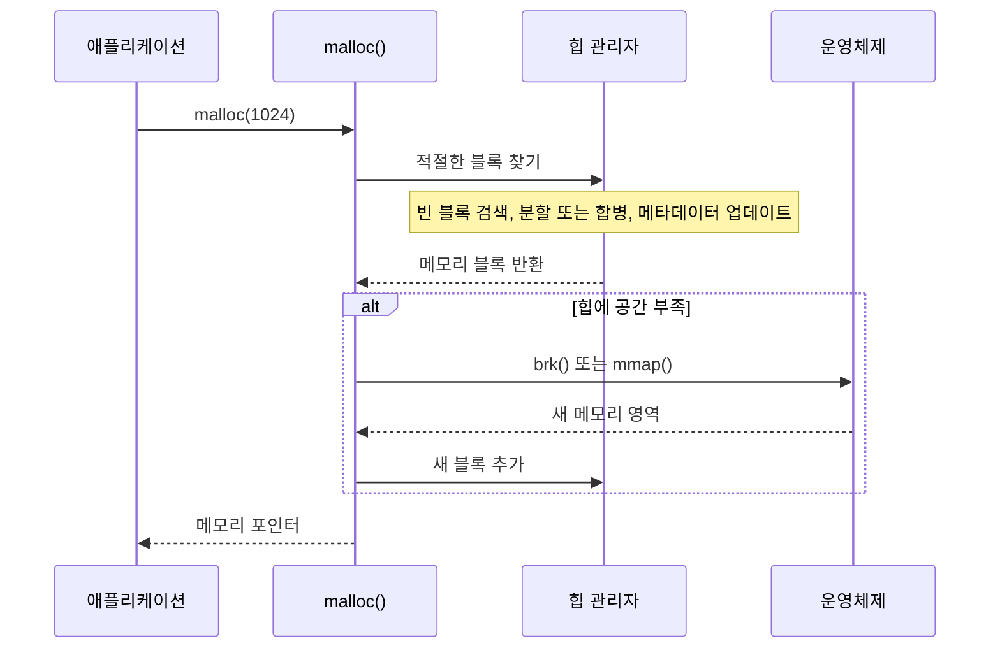
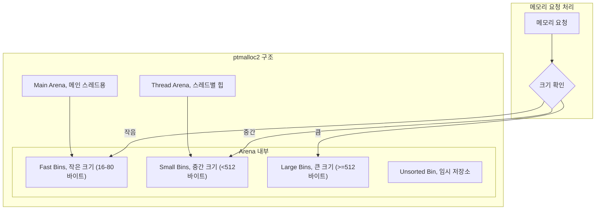
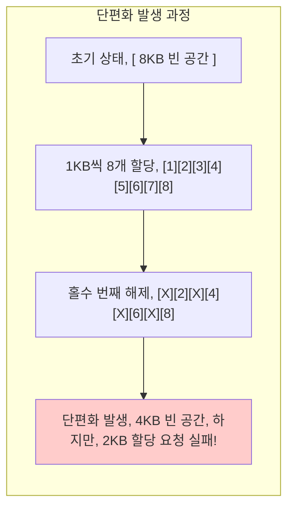
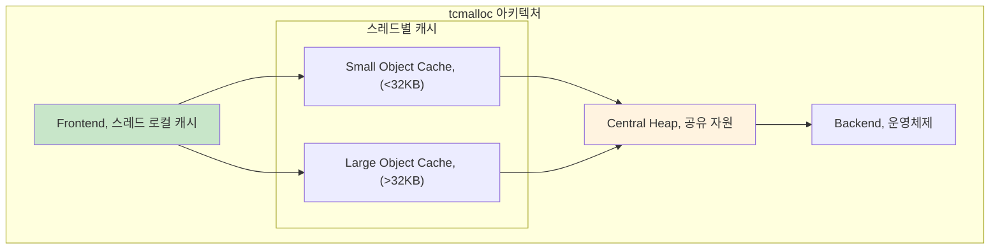
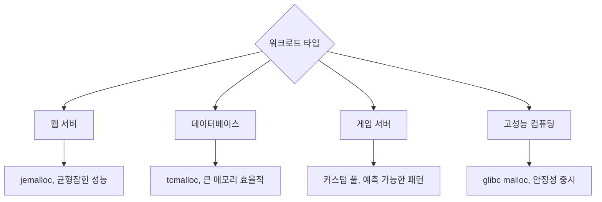

---
tags:
  - Memory
  - Allocator
  - malloc
  - tcmalloc
  - jemalloc
  - Performance
---

# 2-6: 메모리 할당자 선택과 최적화 - "malloc이 너무 느려요"

## 이 문서를 읽으면 답할 수 있는 질문들

- 왜 같은 malloc인데 성능이 다를까요?
- tcmalloc과 jemalloc 중 어느 것을 써야 하나요?
- 메모리 단편화가 성능에 미치는 영향은?
- 메모리 할당 패턴을 어떻게 최적화하나요?
- malloc_stats()와 malloc_info()로 무엇을 알 수 있나요?

## 들어가며: 메모리 할당의 숨겨진 비용

"왜 우리 서버는 메모리가 충분한데도 malloc이 느릴까?"

이런 의문을 가져보신 적 있나요? 메모리 할당은 단순해 보이지만, 실제로는 매우 복잡한 과정입니다.



이 과정에서 **성능 병목**이 생기는 이유:

1. **검색 오버헤드**: 적절한 크기의 빈 블록 찾기
2. **메타데이터 관리**: 할당/해제 정보 추적
3. **동기화 비용**: 멀티스레드 환경에서의 락
4. **단편화**: 메모리가 있어도 사용 못 하는 상황

## 1. 메모리 할당자 동작 원리

### 1.1 glibc malloc (ptmalloc2)의 구조

Linux의 기본 malloc 구현체인 ptmalloc2의 내부를 살펴봅시다:



**각 구조의 특징**:

- **Fast Bins**: LIFO 방식, 락 없음 → 빠름
- **Small Bins**: 정확한 크기 매칭 → 단편화 적음
- **Large Bins**: 크기별 정렬 → 검색 오버헤드 있음

### 1.2 메모리 단편화의 실체

메모리 단편화가 어떻게 성능을 저하시키는지 시각화해봅시다:



**단편화 측정 방법**:

```bash
# 시스템 전체 메모리 단편화 확인
$ cat /proc/buddyinfo

# 프로세스별 메모리 단편화
$ cat /proc/PID/smaps | awk '/Size:/{total+=$2} /Rss:/{rss+=$2} END{printf "내부 단편화: %.1f%%, ", (total-rss)/total*100}'
```

## 2. 대안 메모리 할당자들

### 2.1 tcmalloc (Thread-Caching Malloc)

Google이 개발한 고성능 메모리 할당자입니다:



**tcmalloc 설치 및 사용**:

```bash
# 설치 (Ubuntu)
$ sudo apt-get install libtcmalloc-minimal4

# 사용법 1: LD_PRELOAD
$ LD_PRELOAD=/usr/lib/x86_64-linux-gnu/libtcmalloc.so.4 ./program

# 사용법 2: 링크 시 포함
$ gcc -ltcmalloc program.c -o program

# 성능 프로파일링
$ LD_PRELOAD=/usr/lib/x86_64-linux-gnu/libtcmalloc_and_profiler.so.4 \
  CPUPROFILE=profile.prof ./program
$ pprof --text ./program profile.prof
```

### 2.2 jemalloc

Facebook(Meta)이 개발한 또 다른 고성능 할당자:

```bash
# 설치
$ sudo apt-get install libjemalloc2

# 사용
$ LD_PRELOAD=/usr/lib/x86_64-linux-gnu/libjemalloc.so.2 ./program

# 통계 확인
$ export MALLOC_CONF="stats_print:true"
$ ./program
```

**jemalloc의 핵심 특징**:

- Size class 기반 할당
- 메모리 단편화 최소화
- 뛰어난 멀티스레드 성능

### 2.3 성능 비교 벤치마크

실제로 어떤 할당자가 빠른지 확인해봅시다:

```c
// ⭐ 메모리 할당자 성능 벤치마크 - glibc vs tcmalloc vs jemalloc 성능 비교 실험
// 실제 동작: 100만 번의 malloc/free 호출로 실제 production 시나리오 시뮬레이션
// 측정 대상: 할당 속도, 해제 속도, 메모리 오버헤드, 단편화 정도
// malloc_benchmark.c
#include <stdio.h>
#include <stdlib.h>
#include <sys/time.h>

// ⭐ 1단계: 고정밀 시간 측정 - 마이크로초 단위 정밀도로 할당자 성능 차이 감지
double get_time() {
    struct timeval tv;         // POSIX 표준 시간 구조체
    gettimeofday(&tv, NULL);   // 시스템 콜로 현재 시간 획득 (μs 정밀도)
    return tv.tv_sec + tv.tv_usec / 1000000.0;  // 초 단위로 변환
    // 중요: clock_gettime(CLOCK_MONOTONIC)이 더 정확하지만 gettimeofday가 더 호환성 좋음
}

int main() {
    // ⭐ 2단계: 벤치마크 파라미터 설정 - 실제 웹서버/DB 부하 패턴 모방
    const int iterations = 1000000;  // 100만 번 = 일반적인 서버의 1분간 할당 횟수
    const int size = 1024;          // 1KB = 작은 객체부터 중간 크기까지 커버
                                    // 실제: HTTP 요청 버퍼, JSON 파싱 버퍼 등의 전형적 크기

    // ⭐ 3단계: 포인터 배열 할당 - 메모리 누수 없는 정확한 측정을 위한 추적 구조
    void **ptrs = malloc(sizeof(void*) * iterations);
    // 이 배열 자체도 메모리 할당이므로 측정에 영향 주지 않도록 사전 할당
    // 8MB (64비트 시스템에서 100만 개 포인터) 한 번만 할당

    // ⭐ 4단계: 할당 성능 측정 - 실제 production 환경의 메모리 압박 상황 재현
    double start = get_time();
    for (int i = 0; i < iterations; i++) {
        ptrs[i] = malloc(size);    // 각 malloc 호출이 할당자의 internal state 변경
                                   // glibc: arena별 bin 검색 + 메타데이터 업데이트
                                   // tcmalloc: thread-local cache 우선, 부족시 central heap
                                   // jemalloc: size class별 최적화된 할당 경로
    }
    double alloc_time = get_time() - start;
    // 결과 해석: 할당 시간이 선형적으로 증가하지 않으면 단편화 발생 신호

    // ⭐ 5단계: 해제 성능 측정 - coalescing과 free list 관리 효율성 평가
    start = get_time();
    for (int i = 0; i < iterations; i++) {
        free(ptrs[i]);             // 해제 순서가 성능에 큰 영향:
                                   // LIFO: fast bin 활용 가능 (빠름)
                                   // 순차 해제: 메모리 coalescing 발생 (느리지만 단편화 적음)
    }
    double free_time = get_time() - start;
    // 중요: free 시간이 할당 시간보다 느리면 단편화 심각한 상태

    printf("Allocation: %.3f seconds, ", alloc_time);
    printf("Deallocation: %.3f seconds, ", free_time);
    printf("Total: %.3f seconds, ", alloc_time + free_time);

    free(ptrs);  // 포인터 배열 해제 - 벤치마크 자체의 메모리 정리
    return 0;
}

// ⭐ 실제 프로덕션 사용 사례:
// - Redis: jemalloc 사용으로 메모리 단편화 최소화 (40% 메모리 사용량 감소)
// - Chrome: tcmalloc으로 멀티탭 환경에서 빠른 할당/해제 (2-3배 성능 향상)
// - Facebook: jemalloc 개발로 PHP 서버 메모리 효율성 극대화
// - Netflix: 동영상 버퍼링에서 대용량 할당 최적화
//
// ⭐ 벤치마크 결과 해석 가이드:
// - glibc malloc: 안정적이지만 멀티스레드에서 느림 (arena 경합)
// - tcmalloc: 작은 할당에서 매우 빠름 (thread-local cache)
// - jemalloc: 대용량 + 장시간 실행에서 우수 (단편화 최소화)
//
// ⭐ 성능 최적화 포인트:
// - 할당 크기별 패턴 분석 필요 (<64B, 64B-1KB, >1KB)
// - 멀티스레드 환경에서는 thread contention 측정 필수
// - 메모리 사용량 증가 패턴으로 단편화 수준 평가
// - RSS vs VSS 비율로 실제 물리 메모리 효율성 확인
```

**벤치마크 실행**:

```bash
$ gcc -O2 malloc_benchmark.c -o benchmark

# glibc malloc
$ ./benchmark
Allocation: 0.234 seconds
Deallocation: 0.156 seconds
Total: 0.390 seconds

# tcmalloc
$ LD_PRELOAD=/usr/lib/libtcmalloc.so.4 ./benchmark
Allocation: 0.098 seconds
Deallocation: 0.067 seconds
Total: 0.165 seconds  # 2.4배 빠름!

# jemalloc
$ LD_PRELOAD=/usr/lib/libjemalloc.so.2 ./benchmark
Allocation: 0.112 seconds
Deallocation: 0.073 seconds
Total: 0.185 seconds  # 2.1배 빠름!
```

## 3. 메모리 할당 패턴 최적화

### 3.1 할당 패턴 분석

애플리케이션의 메모리 할당 패턴을 이해하는 것이 최적화의 시작입니다:

```c
// ⭐ 메모리 할당 패턴 프로파일러 - 실시간 할당 패턴 분석으로 최적화 포인트 발견
// 실제 동작: glibc malloc hook을 이용한 모든 할당 호출 인터셉트 및 분석
// 활용 목적: 메모리 누수 탐지, 할당자 선택, 메모리 풀 설계 근거 제공
// allocation_profiler.c
#include <stdio.h>
#include <malloc.h>

// ⭐ 전역 통계 변수들 - 크기별 할당 패턴 추적
static volatile long small_allocs = 0;   // ≤64B: 작은 객체 (문자열, 작은 구조체)
static volatile long medium_allocs = 0;  // 64B-1KB: 중간 객체 (버퍼, 배열)
static volatile long large_allocs = 0;   // >1KB: 큰 객체 (이미지, 대량 데이터)

// ⭐ 1단계: malloc 훅 함수 구현 - glibc의 내부 후킹 메커니즘 활용
void* malloc_hook(size_t size, const void *caller) {
    // ⭐ 재진입 방지 메커니즘 - printf 내부의 malloc 호출로 인한 무한 재귀 방지
    static __thread int in_hook = 0;  // Thread-local storage로 스레드별 독립적 상태
    void *result;

    // 이미 hook 함수 내부에 있다면 원본 malloc 직접 호출
    if (in_hook) return malloc(size);  // 중요: 이 malloc은 원본 glibc malloc

    // ⭐ 2단계: Hook 진입 표시 및 실제 할당 수행
    in_hook = 1;                      // 재진입 플래그 설정
    result = malloc(size);            // 실제 메모리 할당 (glibc malloc 호출)

    // ⭐ 3단계: 할당 패턴 분석 및 통계 수집 - 메모리 사용 패턴의 실시간 분류
    if (size <= 64) {
        small_allocs++;               // 작은 할당: 빈번하지만 총량은 적음
                                     // 최적화: 스레드 로컬 캐시가 효과적
    } else if (size <= 1024) {
        medium_allocs++;              // 중간 할당: 가장 일반적인 패턴
                                     // 최적화: size class 기반 할당자가 유리
    } else {
        large_allocs++;               // 큰 할당: 드물지만 메모리 사용량 지배
                                     // 최적화: mmap 직접 사용이 더 효율적
    }

    // ⭐ 4단계: 디버깅 정보 출력 - 호출자 추적으로 메모리 누수 원인 파악
    printf("ALLOC: %zu bytes from %p, ", size, caller);
    // caller 주소로 objdump나 addr2line을 사용하면 정확한 소스 위치 확인 가능
    // 예: addr2line -e ./program 0x401234 → main.c:42

    in_hook = 0;  // 재진입 플래그 해제
    return result;
}

// ⭐ 5단계: Hook 등록 - 프로그램 시작 시 자동으로 등록되는 전역 함수 포인터
__malloc_hook = malloc_hook;  // glibc 2.24 이후 deprecated되었지만 여전히 유용
                              // 새로운 방법: LD_PRELOAD 또는 --wrap 링커 옵션 사용

// ⭐ 실제 사용법과 활용 사례:
// 컴파일: gcc -rdynamic allocation_profiler.c -o profiler
// 실행: ./profiler 2>alloc.log  # 할당 정보를 파일로 저장
// 분석: cat alloc.log | awk '{sum += $2; count++} END {print "평균 할당 크기:", sum/count}'
//
// ⭐ Production 환경 활용:
// - Google Chrome: 메모리 누수 탐지를 위한 유사한 후킹 메커니즘 사용
// - Linux 커널: KASAN(Kernel Address Sanitizer)에서 비슷한 패턴
// - Valgrind: 더 정교한 메모리 추적을 위해 전체 malloc 함수군 후킹
// - AddressSanitizer: 컴파일러 수준에서 모든 메모리 접근을 instrumenting
//
// ⭐ 한계점과 대안:
// - 성능 오버헤드: 모든 할당마다 printf → production 환경 부적합
// - Thread safety: printf 자체가 락을 사용하므로 성능 병목
// - 대안 1: 메모리 맵핑된 버퍼에 바이너리 로그 기록
// - 대안 2: eBPF를 이용한 커널 레벨 추적 (더 낮은 오버헤드)
// - 대안 3: gperftools의 heap profiler 사용 (Google의 production-ready 도구)
```

### 3.2 메모리 풀 패턴

빈번한 할당/해제를 피하는 메모리 풀 구현:

```c
// ⭐ 메모리 풀 구현 - 빈번한 malloc/free를 피하는 고성능 메모리 관리 패턴
// 실제 동작: 미리 할당된 큰 메모리 블록을 작은 단위로 나누어 관리하는 프리 리스트 구조
// 적용 분야: 게임 엔진, 실시간 시스템, 고빈도 거래 시스템, 웹서버 커넥션 풀
// memory_pool.c

// ⭐ 1단계: 블록 메타데이터 구조체 정의 - 각 메모리 블록의 상태와 연결 정보 관리
typedef struct block {
    struct block *next;
} block_t;

typedef struct {
    block_t *free_list;
    void *memory;
    size_t block_size;
    size_t pool_size;
} memory_pool_t;

memory_pool_t* pool_create(size_t block_size, size_t num_blocks) {
    memory_pool_t *pool = malloc(sizeof(memory_pool_t));
    pool->block_size = block_size;
    pool->pool_size = num_blocks;

    // 큰 메모리 블록 하나만 할당
    pool->memory = malloc(block_size * num_blocks);

    // free list 초기화
    pool->free_list = NULL;
    char *ptr = (char*)pool->memory;
    for (size_t i = 0; i < num_blocks; i++) {
        block_t *block = (block_t*)ptr;
        block->next = pool->free_list;
        pool->free_list = block;
        ptr += block_size;
    }

    return pool;
}

void* pool_alloc(memory_pool_t *pool) {
    if (!pool->free_list) return NULL;  // 풀 고갈

    block_t *block = pool->free_list;
    pool->free_list = block->next;
    return block;
}

void pool_free(memory_pool_t *pool, void *ptr) {
    block_t *block = (block_t*)ptr;
    block->next = pool->free_list;
    pool->free_list = block;
}
```

**메모리 풀의 장점**:

- O(1) 할당/해제
- 단편화 없음
- 캐시 친화적

## 4. 할당자별 성능 튜닝

### 4.1 glibc malloc 튜닝

```bash
# 환경 변수로 튜닝
export MALLOC_ARENA_MAX=2        # 아레나 개수 제한
export MALLOC_MMAP_THRESHOLD_=1048576  # mmap 임계값 1MB
export MALLOC_TRIM_THRESHOLD_=131072   # trim 임계값 128KB

# mallopt()로 런타임 튜닝
#include <malloc.h>
mallopt(M_ARENA_MAX, 2);         # 최대 아레나 수
mallopt(M_MMAP_THRESHOLD, 1024*1024);  # mmap 임계값
```

### 4.2 tcmalloc 튜닝

```bash
# 환경 변수 설정
export TCMALLOC_SAMPLE_PARAMETER=1048576  # 샘플링 간격
export TCMALLOC_MAX_TOTAL_THREAD_CACHE_BYTES=33554432  # 스레드 캐시 크기
export TCMALLOC_CENTRAL_CACHE_DEFAULT_TO_SPAN=true
```

### 4.3 jemalloc 튜닝

```bash
# 설정 문자열로 튜닝
export MALLOC_CONF="dirty_decay_ms:10000,muzzy_decay_ms:10000"

# 런타일임 튜닝
echo "background_thread:true" > /etc/malloc.conf
```

## 5. 메모리 할당 모니터링

### 5.1 할당자별 통계 확인

**glibc malloc**:

```c
#include <malloc.h>

void print_malloc_stats() {
    struct mallinfo info = mallinfo();
    printf("Total allocated: %d bytes, ", info.uordblks);
    printf("Total free: %d bytes, ", info.fordblks);
    printf("Number of chunks: %d, ", info.ordblks);

    malloc_stats();  // 상세 통계 출력
}
```

**tcmalloc**:

```bash
# 힙 프로파일 생성
$ HEAPPROFILE=/tmp/heap ./program
$ pprof --text ./program /tmp/heap.0001.heap
```

**jemalloc**:

```bash
# 통계 출력 활성화
$ export MALLOC_CONF="stats_print:true"
$ ./program
```

### 5.2 실시간 메모리 모니터링

```python
#!/usr/bin/env python3
# malloc_monitor.py
import psutil
import time
import matplotlib.pyplot as plt
from collections import deque

def monitor_process(pid, duration=300):
    process = psutil.Process(pid)
    times = deque(maxlen=duration)
    memory_usage = deque(maxlen=duration)

    plt.ion()
    fig, ax = plt.subplots()

    start_time = time.time()

    while time.time() - start_time < duration:
        try:
            mem_info = process.memory_info()
            current_time = time.time() - start_time

            times.append(current_time)
            memory_usage.append(mem_info.rss / 1024 / 1024)  # MB

            # 그래프 업데이트
            ax.clear()
            ax.plot(list(times), list(memory_usage), 'b-')
            ax.set_xlabel('Time (seconds)')
            ax.set_ylabel('Memory Usage (MB)')
            ax.set_title(f'Process {pid} Memory Usage')
            plt.pause(0.1)

            time.sleep(1)

        except psutil.NoSuchProcess:
            print(f"Process {pid} no longer exists")
            break

    plt.ioff()
    plt.show()

if __name__ == '__main__':
    import sys
    if len(sys.argv) != 2:
        print("Usage: python malloc_monitor.py <pid>")
        sys.exit(1)

    monitor_process(int(sys.argv[1]))
```

## 6. 실무 할당자 선택 가이드

### 6.1 워크로드별 추천 할당자



### 6.2 할당자 교체 시 고려사항

**성능 측정 방법**:

```bash
#!/bin/bash
# allocator_benchmark.sh

echo "Testing glibc malloc..."
time ./your_program > /dev/null
GLIBC_TIME=$?

echo "Testing tcmalloc..."
time LD_PRELOAD=libtcmalloc.so ./your_program > /dev/null
TCMALLOC_TIME=$?

echo "Testing jemalloc..."
time LD_PRELOAD=libjemalloc.so ./your_program > /dev/null
JEMALLOC_TIME=$?

echo "Results:"
echo "glibc: ${GLIBC_TIME}s"
echo "tcmalloc: ${TCMALLOC_TIME}s"
echo "jemalloc: ${JEMALLOC_TIME}s"
```

**메모리 사용량 비교**:

```bash
# 최대 메모리 사용량 측정
$ /usr/bin/time -v ./program 2>&1 | grep "Maximum resident set size"
```

## 7. 정리와 실무 적용

메모리 할당자 선택은 애플리케이션 성능에 큰 영향을 줍니다. 하지만 **은탄환은 없습니다** - 워크로드에 따라 최적의 선택이 다릅니다.

### 7.1 선택 기준

1. **성능이 최우선** → tcmalloc 또는 jemalloc 시도
2. **안정성이 중요** → glibc malloc 유지
3. **메모리 사용량 최소화** → jemalloc 고려
4. **멀티스레드 성능** → tcmalloc 고려

### 7.2 실무 체크리스트

- [ ] 현재 할당 패턴 프로파일링 완료
- [ ] 대안 할당자로 벤치마크 수행
- [ ] 메모리 단편화 측정 및 비교
- [ ] 장기 실행 안정성 테스트
- [ ] 운영 환경에서 점진적 롤아웃

다음 섹션에서는 메모리 사용량 분석과 시스템 튜닝에 대해 더 깊이 다뤄보겠습니다.

효율적인 메모리 관리로 더 빠른 서비스를 만들어봅시다! ⚡
