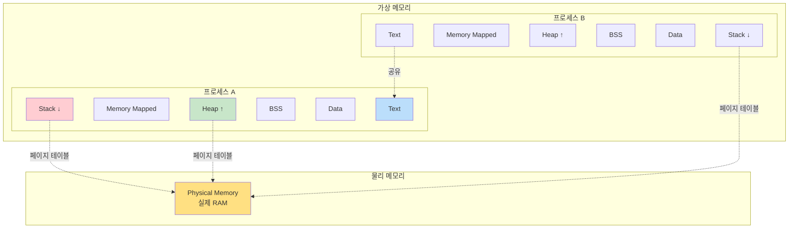
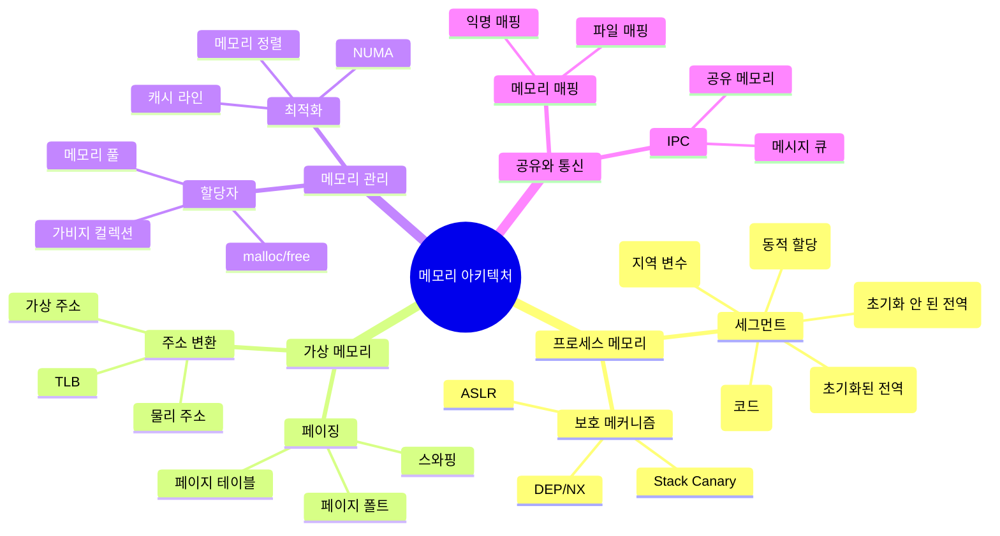
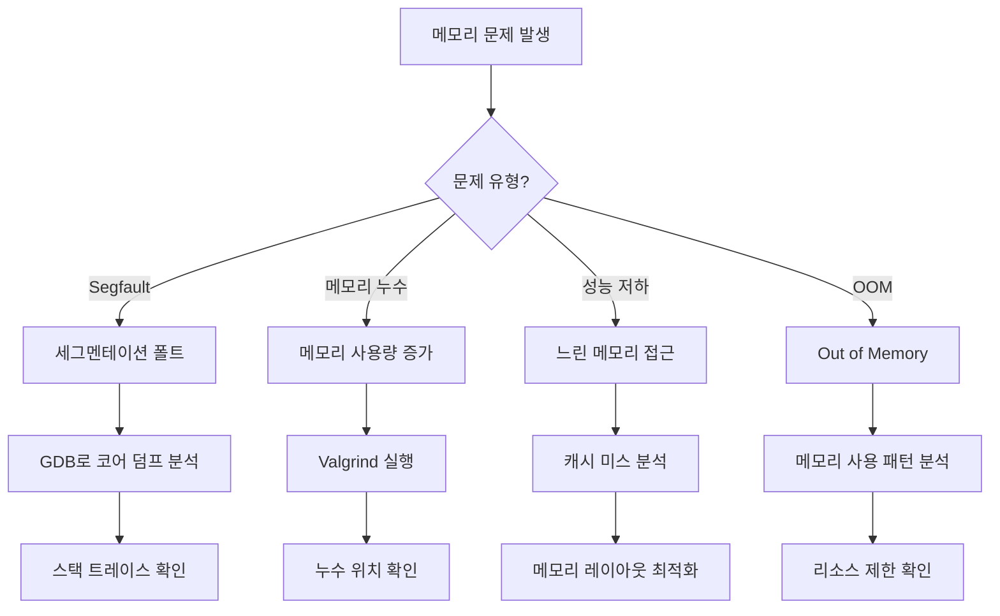

---
tags:
  - Memory
  - Process
  - Guide
  - SystemProgramming
  - VirtualMemory
---

# Chapter 2: 메모리 아키텍처 - 프로그램의 집

## 이 장에서 다루는 내용

프로그램이 실행되면 메모리라는 '집'에 살게 됩니다. 

이 집은 어떻게 설계되어 있을까요? 왜 스택과 힙이라는 별도의 공간이 필요할까요? 가상 메모리는 왜 필요하며, 모든 프로그램이 같은 주소를 사용해도 어떻게 충돌하지 않을까요?

이 장에서는 프로그램이 메모리를 사용하는 방식을 깊이 있게 탐구합니다. 메모리 구조를 이해하면, 더 효율적이고 안전한 프로그램을 작성할 수 있습니다.

## 왜 이것을 알아야 하는가?

### 실무에서 마주치는 메모리 문제들

다음과 같은 상황을 경험해보셨나요?

- 💥 **Segmentation Fault**: 갑자기 프로그램이 죽는 미스터리
- 💧 **메모리 누수**: 점점 느려지다가 결국 OOM(Out of Memory)
- 🐌 **캐시 미스**: 같은 연산인데 100배 느린 이유
- 🔒 **버퍼 오버플로우**: 해킹의 시작점
- 🎲 **힙 단편화**: malloc은 실패하는데 메모리는 충분한 상황

이런 문제들의 근본 원인은 메모리 아키텍처에 대한 이해 부족입니다. 이 장을 마스터하면, 메모리 관련 버그를 예방하고 해결할 수 있습니다.

## 메모리 계층 구조 한눈에 보기



## 이 장의 구성

### [2-1: 프로세스 메모리 구조](01-process-memory.md)

**"프로그램의 집 구조 이해하기"**

- 📦 **메모리 세그먼트**: Text, Data, BSS, Heap, Stack의 역할
- 🏗️ **메모리 레이아웃**: 64비트 시스템의 주소 공간 구성
- 🔍 **실제 메모리 관찰**: /proc/[pid]/maps로 메모리 구조 확인
- 💡 **각 영역의 특징**: 권한, 크기, 성장 방향의 이유

### [2-2: 스택과 힙의 내부 동작](02-stack-heap.md)

**"동적 메모리의 두 주역"**

- 📚 **스택 프레임**: 함수 호출 규약과 스택 프레임 구조
- 🎯 **힙 할당자**: malloc의 내부 구현과 메모리 할당 전략
- ⚡ **성능 차이**: 스택 vs 힙 할당 속도 비교
- 🐛 **메모리 버그**: 스택 오버플로우, 메모리 누수, Use-After-Free

### [2-3: 가상 메모리와 페이징](03-virtual-memory.md)

**"메모리의 마법 - 가상에서 실제로"**

- 🗺️ **가상 주소 공간**: 왜 모든 프로그램이 같은 주소를 사용할 수 있는가?
- 📄 **페이지 테이블**: 가상 주소를 물리 주소로 변환하는 메커니즘
- 💾 **페이지 폴트**: 메모리가 부족할 때 일어나는 일
- 🚀 **TLB**: 주소 변환을 빠르게 하는 캐시

### [2-4: 메모리 매핑과 공유 메모리](04-memory-mapping.md)

**"효율적인 메모리 활용 기법"**

- 📁 **파일 매핑**: mmap으로 파일을 메모리처럼 사용하기
- 🔗 **공유 라이브러리**: 여러 프로세스가 코드를 공유하는 방법
- 🤝 **IPC**: 공유 메모리를 통한 프로세스 간 통신
- ⚡ **Zero-Copy**: 데이터 복사 없이 효율적으로 전송하기

## 실습 환경 준비

이 장의 예제를 직접 실행해보려면 다음 도구가 필요합니다:

```bash
# Linux 메모리 분석 도구
$ cat /proc/self/maps     # 프로세스 메모리 맵
$ pmap <pid>              # 프로세스 메모리 사용량
$ vmstat                  # 가상 메모리 통계
$ free -h                 # 시스템 메모리 상태

# 디버깅 도구
$ valgrind ./program      # 메모리 누수 검사
$ gdb ./program          # 메모리 디버깅
$ strace ./program       # 시스템 콜 추적

# 컴파일 옵션
$ gcc -g -fsanitize=address  # AddressSanitizer
$ gcc -fstack-protector       # 스택 보호
$ gcc -fPIC                   # Position Independent Code
```

## 이 장을 읽고 나면

✅ **메모리 구조 이해**: 프로그램 메모리가 어떻게 구성되는지 완벽히 이해  
✅ **메모리 버그 해결**: Segfault, 메모리 누수 등을 디버깅할 수 있음  
✅ **성능 최적화**: 캐시 친화적인 코드를 작성할 수 있음  
✅ **보안 강화**: 버퍼 오버플로우 등 메모리 취약점을 방어할 수 있음  
✅ **시스템 프로그래밍**: mmap, 공유 메모리 등 고급 기법을 활용할 수 있음  

## 핵심 개념 미리보기



## 메모리 문제 진단 플로우차트



## 다음 단계

이제 [2-1: 프로세스 메모리 구조](01-process-memory.md)부터 시작하여, 프로그램이 메모리를 어떻게 사용하는지 깊이 있게 탐구해봅시다.

메모리는 단순한 저장 공간이 아닙니다. 프로그램의 성능, 안정성, 보안을 결정하는 핵심 요소입니다. 이 여정을 통해 메모리의 비밀을 하나씩 밝혀나가겠습니다.