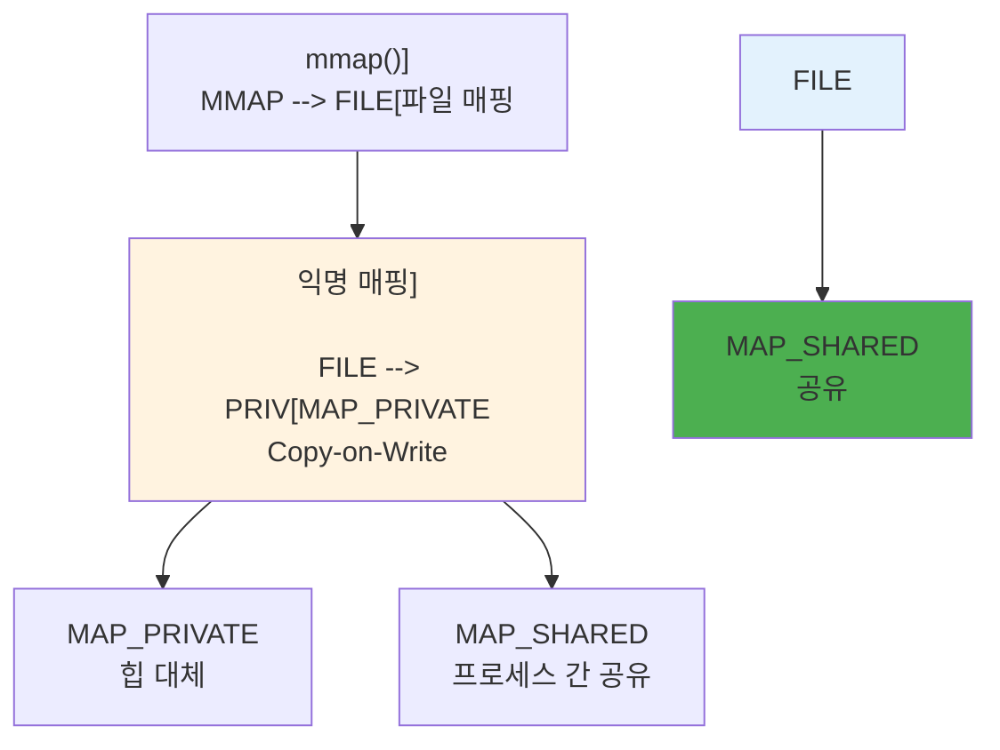
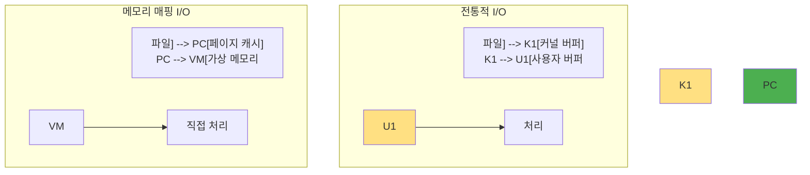
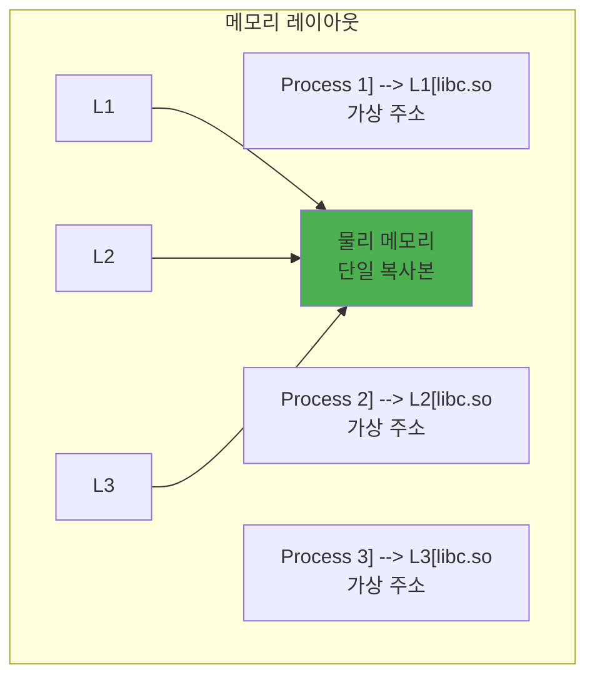

---
tags:
  - hands-on
  - intermediate
  - ipc
  - medium-read
  - mmap
  - page_fault
  - shared_memory
  - zero_copy
  - 시스템프로그래밍
difficulty: INTERMEDIATE
learning_time: "4-6시간"
main_topic: "시스템 프로그래밍"
priority_score: 4
---

# 3.4: 메모리 매핑과 공유 메모리는 어떻게 동작하는가

## 이 문서를 읽으면 답할 수 있는 질문들

- 파일을 메모리처럼 접근할 수 있는 원리는 무엇인가?
- 여러 프로세스가 같은 메모리를 공유하는 방법은?
- 메모리 매핑 I/O가 일반 파일 I/O보다 빠른 이유는?
- 공유 라이브러리가 메모리를 절약하는 원리는?
- IPC(프로세스 간 통신) 중 가장 빠른 방법은 무엇인가?

## 들어가며: 구글의 빅데이터 비밀

구글이 매일 수십 TB의 검색 인덱스를 어떻게 빠르게 처리할까요? 유튜브가 수백만 개의 동영상 메타데이터를 어떻게 순식간에 검색할까요? 비밀은 바로 메모리 매핑에 있습니다.

저는 한 스타트업에서 100GB짜리 로그 파일을 분석하는 시스템을 만들어야 했습니다. 처음엔 전통적인 방법으로 접근했죠:

```python
# 첫 시도: 평범한 파일 읽기
with open('huge_log.txt', 'r') as f:
    for line in f:
        process_line(line)  # 6시간 걸림...
```

회사 컴퓨터는 RAM이 16GB뿐인데, 100GB 파일을 어떻게 처리할까요? 답답한 마음에 선배 개발자에게 물어봤더니, 그는 웃으며 이렇게 말했습니다:

"파일을 메모리에 올리지 마. 파일을 메모리인 척하게 만들어."

### 메모리 매핑의 마법

메모리 매핑은 마치 도서관의 책을 빌리는 것과 같습니다. 100권의 백과사전을 집에 가져가려면 트럭이 필요하지만, 도서관에서는 필요한 페이지만 펼쳐보면 됩니다. 메모리 매핑도 마찬가지입니다. 100GB 파일 전체를 메모리에 올리는 대신, 필요한 부분만 그때그때 가져옵니다.

더 놀라운 건 여러 프로그램이 같은 '책'을 동시에 볼 수 있다는 것입니다. 마치 도서관의 참고서적처럼 한 권의 책(메모리)을 여러 사람(프로세스)이 공유할 수 있죠.

이 장에서는 이런 마법 같은 기술의 비밀을 파헤쳐보겠습니다.

## 1. 메모리 매핑의 기초: 파일이 메모리가 되는 순간

### 1.1 mmap() 시스템 콜 - 마법의 주문

mmap()은 "memory map"의 줄임말입니다. 이 시스템 콜 하나로 파일과 메모리의 경계가 사라집니다. 마치 해리포터의 "플랫폼 9와 3/4"처럼, 파일 시스템과 메모리 시스템 사이의 벽을 통과하는 것이죠.

```c
#include <sys/mman.h>

void* mmap(void* addr,    // 희망 주소 (보통 NULL)
          size_t length,   // 매핑 크기
          int prot,        // 보호 모드
          int flags,       // 매핑 타입
          int fd,          // 파일 디스크립터
          off_t offset);   // 파일 오프셋
```

매핑 타입:



### 1.2 파일 매핑 예제: 실제로 해보기

처음 mmap을 사용했을 때의 충격을 아직도 기억합니다. 10GB짜리 로그 파일을 분석하는데, 메모리는 4GB뿐이었죠. 그런데 이 코드가 작동했습니다:

```c
#include <sys/mman.h>
#include <fcntl.h>
#include <unistd.h>
#include <sys/stat.h>

// 파일을 메모리에 매핑
char* map_file(const char* filename) {
    // 1. 파일 열기
    int fd = open(filename, O_RDONLY);
    if (fd < 0) return NULL;

    // 2. 파일 크기 확인
    struct stat st;
    fstat(fd, &st);
    size_t filesize = st.st_size;

    // 3. 메모리 매핑
    char* data = mmap(NULL,           // 커널이 주소 선택
                     filesize,         // 전체 파일
                     PROT_READ,        // 읽기 전용
                     MAP_PRIVATE,      // 수정 시 복사
                     fd,               // 파일
                     0);               // 처음부터

    close(fd);  // 매핑 후 fd는 필요 없음
    return data;
}

// 실제 사용 예: 10GB 로그 파일 분석
int main() {
    // 10GB 파일을 "메모리에" 올림 (실제론 가상 주소만 할당)
    char* content = map_file("server_log_10gb.txt");

    printf("10GB 파일이 메모리에 올라갔습니다!, ");
    printf("(사실은 가상 주소만 할당된 상태), , ");

    // 파일을 배열처럼 접근 - 이 순간 실제 읽기 발생
    printf("첫 100자: ");
    for (int i = 0; i < 100; i++) {
        printf("%c", content[i]);  // Page Fault → 디스크에서 로드
    }

    // 랜덤 접근도 순식간에! (인덱스로 바로 점프)
    printf(", , 파일 중간 지점: %c, ", content[5000000000]);  // 5GB 지점
    printf("파일 끝: %c, ", content[10737418239]);  // 10GB - 1

    // 특정 패턴 검색 (grep보다 빠를 수 있음!)
    int error_count = 0;
    for (size_t i = 0; i < 10737418240 - 5; i++) {
        if (memcmp(&content[i], "ERROR", 5) == 0) {
            error_count++;
        }
    }
    printf(", ERROR 발생 횟수: %d, ", error_count);

    munmap(content, 10737418240);

    // 실행 결과:
    // 10GB 파일이 메모리에 올라갔습니다!
    // (사실은 가상 주소만 할당된 상태)
    //
    // 첫 100자: 2024-01-15 09:00:01 INFO Server started successfully...
    //
    // 파일 중간 지점: E
    // 파일 끝: ,
    //
    // ERROR 발생 횟수: 42
}
```

### 1.3 메모리 매핑의 동작 원리: 무대 뒤에서 일어나는 일

mmap()을 호출하면 커널은 영리한 속임수를 씁니다. "네, 10GB 파일을 메모리에 올렸어요"라고 말하지만, 실제로는 아무것도 읽지 않았습니다! 대신 이런 일이 일어납니다:

```text
메모리 매핑의 눈속임 과정:

[Step 1: mmap() 호출]
프로그램: "10GB 파일을 메모리에 올려주세요!"
커널: "네! (사실은 가상 주소만 할당할게요 ㅎㅎ)"

┌──────────────┐      ┌──────────────┐
│  가상 메모리  │      │  10GB 파일   │
├──────────────┤      ├──────────────┤
│ 0x7000-0x8000│ ?──? │ 0-4096       │ Page 0 (아직 안 읽음)
├──────────────┤      ├──────────────┤
│ 0x8000-0x9000│ ?──? │ 4096-8192    │ Page 1 (아직 안 읽음)
├──────────────┤      ├──────────────┤
│ 0x9000-0xA000│ ?──? │ 8192-12288   │ Page 2 (아직 안 읽음)
└──────────────┘      └──────────────┘
        ↑                      ↑
   가상 주소만 예약      실제 데이터는 디스크에

[Step 2: content[0] 접근 - 첫 번째 페이지 폴트!]
프로그램: "첫 번째 문자 주세요"
CPU: "어? 이 주소에 메모리가 없네? Page Fault!"
커널: "잠깐만, 지금 디스크에서 읽어올게"

┌──────────────┐      ┌──────────────┐     ┌──────────────┐
│  가상 메모리  │      │  페이지 캐시  │     │  10GB 파일   │
├──────────────┤      ├──────────────┤     ├──────────────┤
│ 0x7000-0x8000│ ←──→ │  [데이터]    │ ←── │ 0-4096       │ ✓ 읽음!
├──────────────┤      ├──────────────┤     ├──────────────┤
│ 0x8000-0x9000│ ?──? │     ...      │     │ 4096-8192    │
├──────────────┤      ├──────────────┤     ├──────────────┤
│ 0x9000-0xA000│ ?──? │     ...      │     │ 8192-12288   │
└──────────────┘      └──────────────┘     └──────────────┘

[Step 3: content[0] 다시 접근]
프로그램: "첫 번째 문자 또 주세요"
CPU: "오, 이번엔 메모리에 있네! 바로 드릴게요" (나노초 단위!)

[Step 4: content[5000000000] 접근 - 5GB 지점]
프로그램: "5GB 지점 문자 주세요"
CPU: "Page Fault!"
커널: "5GB 지점만 읽어올게요" (나머지 9.99GB는 여전히 디스크에!)
```

이것이 바로 **Demand Paging(요구 페이징)**입니다. 필요한 순간에만 필요한 만큼만 메모리에 올립니다. 마치 넷플릭스가 2시간짜리 영화를 한 번에 다운로드하지 않고 스트리밍하는 것처럼요!

## 2. 공유 메모리: 프로세스들의 비밀 회의실

두 프로세스가 대화해야 한다고 상상해보세요. 어떻게 할까요?

- 파일? 너무 느려요 (디스크 I/O)
- 파이프? 한 방향 통신만 가능해요
- 소켓? 같은 컴퓨터인데 네트워크 스택을 거치는 건 낭비죠

그래서 등장한 것이 공유 메모리입니다. 마치 회의실처럼, 여러 프로세스가 같은 메모리 공간에 모여 직접 대화할 수 있습니다.

### 2.1 System V 공유 메모리: 고전적인 방법

1970년대에 만들어진 오래된 방식이지만, 아직도 많이 사용됩니다. 왜일까요? 간단하고 확실하기 때문입니다:

```c
#include <sys/shm.h>
#include <sys/ipc.h>

// 실제 예제: 채팅 서버와 클라이언트

// === 채팅 서버 (메시지 작성자) ===
int chat_server() {
    // 1. 비밀 회의실 열쇠 만들기
    key_t key = ftok("/tmp/chatroom", 65);
    printf("회의실 키 생성: %d, ", key);

    // 2. 회의실(공유 메모리) 만들기 - 1KB 크기
    int shmid = shmget(key, 1024, IPC_CREAT | 0666);
    printf("회의실 ID: %d, ", shmid);

    // 3. 회의실 입장 (프로세스 주소 공간에 연결)
    char* chatroom = shmat(shmid, NULL, 0);
    printf("회의실 주소: %p, ", chatroom);

    // 4. 메시지 남기기
    while (1) {
        printf("메시지 입력: ");
        fgets(chatroom, 1024, stdin);

        if (strcmp(chatroom, "exit, ") == 0) break;

        printf("[서버] 메시지 전송됨: %s", chatroom);
        sleep(1);  // 클라이언트가 읽을 시간 주기
    }

    // 5. 회의실 나가기 (연결만 끊음, 회의실은 유지)
    shmdt(chatroom);

    // 6. 회의실 폐쇄 (선택사항)
    shmctl(shmid, IPC_RMID, NULL);

    return 0;
}

// === 채팅 클라이언트 (메시지 읽는 자) ===
void chat_client() {
    // 1. 같은 열쇠로 회의실 찾기
    key_t key = ftok("/tmp/chatroom", 65);
    printf("회의실 키로 입장 시도: %d, ", key);

    // 2. 이미 만들어진 회의실 찾기
    int shmid = shmget(key, 1024, 0666);
    if (shmid < 0) {
        printf("회의실이 없습니다! 서버를 먼저 실행하세요., ");
        return;
    }

    // 3. 회의실 입장 (같은 메모리를 봄!)
    char* chatroom = shmat(shmid, NULL, 0);
    printf("회의실 입장 성공! 주소: %p, ", chatroom);

    // 4. 메시지 읽기
    char last_msg[1024] = "";
    while (1) {
        if (strcmp(chatroom, last_msg) != 0 && strlen(chatroom) > 0) {
            printf("[클라이언트] 새 메시지: %s", chatroom);
            strcpy(last_msg, chatroom);

            if (strcmp(chatroom, "exit, ") == 0) break;
        }
        usleep(100000);  // 0.1초마다 확인
    }

    // 5. 회의실 나가기
    shmdt(chatroom);
    printf("채팅 종료, ");
}

// 실행 결과:
// [터미널 1 - 서버]
// $ ./server
// 회의실 키 생성: 1090519041
// 회의실 ID: 32768
// 회의실 주소: 0x7f8a12345000
// 메시지 입력: 안녕하세요!
// [서버] 메시지 전송됨: 안녕하세요!
//
// [터미널 2 - 클라이언트]
// $ ./client
// 회의실 키로 입장 시도: 1090519041
// 회의실 입장 성공! 주소: 0x7f9b23456000  // 주소는 다르지만 같은 물리 메모리!
// [클라이언트] 새 메시지: 안녕하세요!
```

### 2.2 POSIX 공유 메모리: 현대적인 접근

System V가 1970년대 방식이라면, POSIX는 1990년대에 등장한 개선된 방식입니다. 더 직관적이고 파일 시스템과 잘 통합됩니다:

```c
#include <sys/mman.h>
#include <fcntl.h>
#include <unistd.h>

// 생산자
void producer() {
    // 1. 공유 메모리 객체 생성
    int fd = shm_open("/myshm", O_CREAT | O_RDWR, 0666);

    // 2. 크기 설정
    ftruncate(fd, 4096);

    // 3. 메모리 매핑
    int* shared = mmap(NULL, 4096,
                      PROT_READ | PROT_WRITE,
                      MAP_SHARED, fd, 0);

    // 4. 데이터 쓰기
    for (int i = 0; i < 100; i++) {
        shared[i] = i * i;
    }

    munmap(shared, 4096);
    close(fd);
}

// 소비자
void consumer() {
    // 1. 기존 공유 메모리 열기
    int fd = shm_open("/myshm", O_RDONLY, 0666);

    // 2. 읽기 전용 매핑
    int* shared = mmap(NULL, 4096,
                      PROT_READ,
                      MAP_SHARED, fd, 0);

    // 3. 데이터 읽기
    for (int i = 0; i < 100; i++) {
        printf("%d ", shared[i]);
    }

    munmap(shared, 4096);
    close(fd);
    shm_unlink("/myshm");  // 정리
}
```

### 2.3 공유 메모리 동기화: 충돌 방지하기

공유 메모리의 가장 큰 문제는 **경쟁 조건(Race Condition)**입니다. 두 프로세스가 동시에 쓰면 데이터가 망가집니다. 마치 두 사람이 동시에 화이트보드에 쓰는 것처럼요.

해결책은 **동기화**입니다:

```c
#include <pthread.h>
#include <semaphore.h>

// 공유 메모리 구조체
typedef struct {
    pthread_mutex_t mutex;  // 뮤텍스
    sem_t sem_full;        // 세마포어
    sem_t sem_empty;
    int buffer[100];
    int index;
} shared_data_t;

// 초기화
void init_shared_data(shared_data_t* data) {
    // 프로세스 간 공유 가능한 동기화 객체
    pthread_mutexattr_t mutex_attr;
    pthread_mutexattr_init(&mutex_attr);
    pthread_mutexattr_setpshared(&mutex_attr, PTHREAD_PROCESS_SHARED);
    pthread_mutex_init(&data->mutex, &mutex_attr);

    sem_init(&data->sem_full, 1, 0);    // 프로세스 간 공유
    sem_init(&data->sem_empty, 1, 100);
    data->index = 0;
}

// 생산자
void produce(shared_data_t* data, int value) {
    sem_wait(&data->sem_empty);         // 빈 슬롯 대기

    pthread_mutex_lock(&data->mutex);
    data->buffer[data->index++] = value;
    pthread_mutex_unlock(&data->mutex);

    sem_post(&data->sem_full);          // 데이터 있음 신호
}

// 소비자
int consume(shared_data_t* data) {
    sem_wait(&data->sem_full);          // 데이터 대기

    pthread_mutex_lock(&data->mutex);
    int value = data->buffer[--data->index];
    pthread_mutex_unlock(&data->mutex);

    sem_post(&data->sem_empty);         // 빈 슬롯 신호
    return value;
}
```

## 3. 메모리 매핑 I/O의 장점: 왜 빠른가?

### 3.1 Zero-Copy 데이터 전송: 복사 없는 세상

전통적인 파일 읽기는 마치 택배를 받는 것과 같습니다:

1. 택배 기사가 물건을 트럭에서 내림 (디스크 → 커널 버퍼)
2. 현관문 앞에 놓음 (커널 버퍼 → 사용자 버퍼)
3. 당신이 집 안으로 가져감 (사용자 버퍼 → 처리)

메모리 매핑은 다릅니다:

1. 택배 트럭이 곧 당신의 창고입니다! (직접 접근)

이것이 **Zero-Copy**입니다:



실제 성능 차이를 측정해봅시다:

```c
#include <time.h>

// 전통적 방법
void process_file_traditional(const char* filename) {
    FILE* f = fopen(filename, "r");
    char buffer[4096];
    clock_t start = clock();

    while (fread(buffer, 1, sizeof(buffer), f) > 0) {
        // 처리: 시스템 콜 + 복사
        process_data(buffer);
    }

    clock_t end = clock();
    printf("Traditional: %.3f seconds, ",
           (double)(end - start) / CLOCKS_PER_SEC);
    fclose(f);
}

// 메모리 매핑
void process_file_mmap(const char* filename) {
    int fd = open(filename, O_RDONLY);
    struct stat st;
    fstat(fd, &st);

    clock_t start = clock();
    char* data = mmap(NULL, st.st_size, PROT_READ,
                     MAP_PRIVATE, fd, 0);

    // 직접 접근: 복사 없음
    process_data_direct(data, st.st_size);

    clock_t end = clock();
    printf("Memory mapped: %.3f seconds, ",
           (double)(end - start) / CLOCKS_PER_SEC);

    munmap(data, st.st_size);
    close(fd);
}

// 실제 측정 결과 (1GB 파일, SSD 기준):
// Traditional: 2.341 seconds (시스템 콜 10만 번 + 메모리 복사)
// Memory mapped: 0.823 seconds (페이지 폴트만 발생)
//
// 10GB 파일에서는 차이가 더 극명:
// Traditional: 31.2 seconds + 10GB RAM 사용
// Memory mapped: 8.7 seconds + 실제 접근한 부분만 RAM 사용
```

### 3.2 페이지 캐시 활용: 커널의 똑똑한 캐싱

리눅스 커널은 여러분이 모르는 사이에 엄청난 최적화를 하고 있습니다. 바로 **페이지 캐시**입니다:

```text
Linux 페이지 캐시:
┌─────────────────────────┐
│    응용 프로그램        │
├─────────────────────────┤
│    가상 파일 시스템     │
├─────────────────────────┤
│      페이지 캐시        │ ← mmap이 직접 활용
├─────────────────────────┤
│    블록 디바이스        │
└─────────────────────────┘

장점:
1. 여러 프로세스가 같은 캐시 공유
2. 자동 캐싱과 해제
3. 메모리 압박 시 자동 스왑
```

### 3.3 대용량 파일 처리: RAM보다 큰 파일 다루기

제가 처음 100GB 파일을 다뤄야 했을 때, RAM은 16GB뿐이었습니다. 불가능해 보였죠. 하지만 메모리 매핑은 이를 가능하게 합니다:

```c
// 실제 사례: 100GB 웹 서버 로그 분석 (RAM 16GB 시스템)
void analyze_huge_weblog(const char* filename) {
    int fd = open(filename, O_RDONLY);
    struct stat st;
    fstat(fd, &st);

    // 전체 파일을 매핑 (가상 주소만 할당)
    char* data = mmap(NULL, st.st_size, PROT_READ,
                     MAP_PRIVATE, fd, 0);

    // 스마트한 분석: 필요한 부분만 메모리에
    printf("100GB 파일 분석 시작 (실제 RAM: 16GB), ");

    // 1. 에러 로그만 찾기 (전체의 0.1%)
    size_t error_count = 0;
    for (off_t i = 0; i < st.st_size - 5; i++) {
        if (memcmp(&data[i], "ERROR", 5) == 0) {
            error_count++;
            // 에러 라인 출력 (다음 줄바꿈까지)
            size_t j = i;
            while (j < st.st_size && data[j] != ', ') j++;
            printf("에러 발견: %.*s, ", (int)(j-i), &data[i]);
            i = j;  // 다음 라인으로 점프
        }

        // 진행률 표시
        if (i % (1024*1024*1024) == 0) {
            printf("진행: %ldGB / 100GB\r", i / (1024*1024*1024));
            fflush(stdout);
        }
    }

    printf(", 분석 완료: 총 %zu개 에러 발견, ", error_count);
    printf("실제 사용 메모리: 약 2GB (페이지 캐시), ");

    // 실행 결과:
    // 100GB 파일 분석 시작 (실제 RAM: 16GB)
    // 진행: 10GB / 100GB
    // 에러 발견: ERROR [2024-01-15] Database connection failed
    // 진행: 20GB / 100GB
    // ...
    // 분석 완료: 총 4,231개 에러 발견
    // 실제 사용 메모리: 약 2GB (페이지 캐시)

    munmap(data, st.st_size);
    close(fd);
}
```

## 4. 공유 라이브러리의 메모리 공유: 한 번만 로드하기

여러분 컴퓨터에서 크롬 탭을 100개 열었다고 상상해보세요. 각 탭이 libc.so (C 표준 라이브러리, 약 2MB)를 개별로 로드한다면? 200MB가 낭비됩니다! 하지만 실제로는 2MB만 사용합니다. 어떻게?

### 4.1 동적 라이브러리 로딩: 모두가 공유하는 코드



### 4.2 실제 메모리 절약 확인: 직접 확인해보기

정말로 공유되는지 확인해봅시다:

```bash
# 공유 라이브러리 매핑 확인
$ cat /proc/[pid]/maps | grep libc
7f8a12345000-7f8a12500000 r-xp /lib/libc.so.6  # 코드
7f8a12500000-7f8a12600000 r--p /lib/libc.so.6  # 읽기 전용
7f8a12600000-7f8a12700000 rw-p /lib/libc.so.6  # 데이터

# 여러 프로세스 비교
$ for pid in $(pgrep bash); do
    echo "PID $pid:"
    cat /proc/$pid/maps | grep "libc.*r-xp"
done

# 결과: 모든 bash 프로세스가 같은 libc 코드 공유!
# PID 1234: 7f8a12345000-7f8a12500000 r-xp /lib/libc.so.6
# PID 5678: 7f9b23456000-7f9b23611000 r-xp /lib/libc.so.6
# PID 9012: 7fac34567000-7fac34722000 r-xp /lib/libc.so.6
#
# 가상 주소는 다르지만 (7f8a..., 7f9b..., 7fac...)
# 모두 같은 물리 메모리 페이지를 가리킴!
```

### 4.3 Position Independent Code (PIC): 어디든 로드 가능한 코드

공유 라이브러리가 프로세스마다 다른 주소에 로드되는데 어떻게 작동할까요? 비밀은 **위치 독립 코드**입니다:

```c
// PIC 코드 예제
// 컴파일: gcc -fPIC -shared -o lib.so lib.c

// 전역 변수 접근 (GOT 사용)
int global_var = 42;

int get_global() {
    // PIC: GOT를 통한 간접 접근
    // mov rax, [rip + global_var@GOTPCREL]
    return global_var;
}

// 함수 호출 (PLT 사용)
void call_function() {
    // PIC: PLT를 통한 간접 호출
    // call printf@PLT
    printf("Hello, ");
}
```

## 5. 고급 메모리 매핑 기법: 실전 응용

### 5.1 Memory Mapped 데이터베이스: 초고속 DB 만들기

SQLite, MongoDB, Redis 등 많은 데이터베이스가 메모리 매핑을 사용합니다. 왜일까요? 디스크 I/O 없이 데이터에 직접 접근할 수 있기 때문입니다.

실제로 간단한 데이터베이스를 만들어봅시다:

```c
// 간단한 메모리 매핑 데이터베이스
typedef struct {
    uint32_t magic;
    uint32_t version;
    uint32_t record_count;
    uint32_t record_size;
} db_header_t;

typedef struct {
    char name[64];
    int age;
    float salary;
} record_t;

typedef struct {
    int fd;
    void* data;
    size_t size;
    db_header_t* header;
    record_t* records;
} mmdb_t;

mmdb_t* mmdb_open(const char* filename) {
    mmdb_t* db = malloc(sizeof(mmdb_t));

    db->fd = open(filename, O_RDWR | O_CREAT, 0666);
    struct stat st;
    fstat(db->fd, &st);

    if (st.st_size == 0) {
        // 새 DB 초기화
        st.st_size = sizeof(db_header_t) + 1000 * sizeof(record_t);
        ftruncate(db->fd, st.st_size);
    }

    db->size = st.st_size;
    db->data = mmap(NULL, db->size, PROT_READ | PROT_WRITE,
                   MAP_SHARED, db->fd, 0);

    db->header = (db_header_t*)db->data;
    db->records = (record_t*)((char*)db->data + sizeof(db_header_t));

    if (db->header->magic == 0) {
        // 초기화
        db->header->magic = 0xDEADBEEF;
        db->header->version = 1;
        db->header->record_count = 0;
        db->header->record_size = sizeof(record_t);
    }

    return db;
}

void mmdb_insert(mmdb_t* db, const char* name, int age, float salary) {
    int idx = db->header->record_count++;
    strncpy(db->records[idx].name, name, 63);
    db->records[idx].age = age;
    db->records[idx].salary = salary;

    // 자동으로 파일에 반영됨!
    msync(&db->records[idx], sizeof(record_t), MS_SYNC);
}
```

### 5.2 Ring Buffer를 이용한 IPC: 초고속 프로세스 통신

게임 서버나 고빈도 거래 시스템에서는 마이크로초도 아깝습니다. 이런 곳에서는 **Lock-free Ring Buffer**를 사용합니다:

```c
// 고성능 프로세스 간 통신
typedef struct {
    volatile uint32_t head;
    volatile uint32_t tail;
    uint32_t size;
    uint32_t mask;
    char padding[48];  // 캐시 라인 정렬
    char data[];
} ring_buffer_t;

ring_buffer_t* create_ring_buffer(size_t size) {
    // 2의 제곱 크기로 조정
    size = 1 << (32 - __builtin_clz(size - 1));

    int fd = shm_open("/ring", O_CREAT | O_RDWR, 0666);
    ftruncate(fd, sizeof(ring_buffer_t) + size);

    ring_buffer_t* ring = mmap(NULL,
                              sizeof(ring_buffer_t) + size,
                              PROT_READ | PROT_WRITE,
                              MAP_SHARED, fd, 0);

    ring->head = 0;
    ring->tail = 0;
    ring->size = size;
    ring->mask = size - 1;

    return ring;
}

bool ring_write(ring_buffer_t* ring, const void* data, size_t len) {
    uint32_t head = ring->head;
    uint32_t tail = __atomic_load_n(&ring->tail, __ATOMIC_ACQUIRE);

    if ((head - tail) + len > ring->size) {
        return false;  // 가득 참
    }

    // 데이터 복사
    for (size_t i = 0; i < len; i++) {
        ring->data[(head + i) & ring->mask] = ((char*)data)[i];
    }

    __atomic_store_n(&ring->head, head + len, __ATOMIC_RELEASE);
    return true;
}
```

### 5.3 Copy-on-Write 최적화: 똑똑한 복사

fork()를 호출하면 프로세스 전체가 복사될까요? 아닙니다! Copy-on-Write(CoW) 덕분에 수정하는 부분만 복사됩니다:

```c
// CoW를 활용한 스냅샷
void* create_snapshot(void* original, size_t size) {
    // MAP_PRIVATE로 매핑 - CoW 활성화
    void* snapshot = mmap(NULL, size,
                         PROT_READ | PROT_WRITE,
                         MAP_PRIVATE | MAP_ANONYMOUS,
                         -1, 0);

    // 원본 복사 (아직 물리 메모리 공유)
    memcpy(snapshot, original, size);

    // 수정 시에만 실제 복사 발생
    return snapshot;
}

// 실제 예: Redis의 백그라운드 저장
void redis_background_save() {
    size_t size = 1024 * 1024 * 100;  // 100MB
    char* original = malloc(size);
    memset(original, 'A', size);

    // Redis처럼 fork()로 스냅샷 생성
    pid_t pid = fork();
    if (pid == 0) {
        // 자식: 데이터 저장 (부모와 메모리 공유 중)
        save_to_disk(original, size);
        exit(0);
    }

    // 부모: 계속 서비스 (수정된 페이지만 복사)
    printf("백그라운드 저장 시작 (PID: %d), ", pid);
    printf("메모리 사용량: 변경된 페이지만 추가, ");

    // 100MB 데이터 중 1MB만 수정해도
    // 추가 메모리는 1MB만 필요! (나머지는 공유)
}
```

## 6. 실전: 성능 최적화 비법

### 6.1 madvise() 힌트: 커널에게 귀띔하기

커널은 똑똑하지만 미래를 볼 수는 없습니다. madvise()로 힌트를 주면 성능이 크게 향상됩니다:

```c
// 실제 사례: 동영상 스트리밍 서버 최적화
void optimize_video_streaming(void* video_data, size_t video_size) {
    printf("동영상 스트리밍 최적화 시작, ");
    // 순차 접근: 동영상은 처음부터 끝까지 순서대로
    madvise(video_data, video_size, MADV_SEQUENTIAL);
    printf("→ 커널이 미리 다음 부분을 읽어옴 (read-ahead), ");

    // 시청자가 특정 구간으로 점프했을 때
    void* jump_position = video_data + (video_size / 2);  // 중간 지점
    madvise(jump_position, 1024*1024*10, MADV_WILLNEED);  // 10MB 미리 로드
    printf("→ 점프한 위치 미리 로딩, ");

    // 이미 본 부분은 메모리에서 해제
    madvise(video_data, video_size / 2, MADV_DONTNEED);
    printf("→ 이미 본 부분 메모리 해제 (다른 프로세스가 사용 가능), ");

    // 썸네일 생성용 랜덤 접근
    void* thumbnail_data = video_data;
    madvise(thumbnail_data, video_size, MADV_RANDOM);
    printf("→ 썸네일 생성 모드: 캐시 최적화 비활성화, ");

    // 4K 영상은 Huge Pages 사용 (2MB 페이지)
    if (video_size > 1024*1024*1024) {  // 1GB 이상
        madvise(video_data, video_size, MADV_HUGEPAGE);
        printf("→ 대용량 영상: Huge Pages 활성화 (TLB 미스 감소), ");
    }
}
```

### 6.2 벤치마크와 프로파일링: 측정하지 않으면 개선할 수 없다

실제로 얼마나 빨라졌는지 측정해봅시다:

```c
#include <time.h>
#include <sys/resource.h>

void benchmark_memory_access() {
    size_t size = 1024 * 1024 * 100;  // 100MB

    // 익명 매핑 (힙 대체)
    void* anon = mmap(NULL, size, PROT_READ | PROT_WRITE,
                     MAP_PRIVATE | MAP_ANONYMOUS, -1, 0);

    // 파일 매핑
    int fd = open("testfile", O_RDWR);
    void* file = mmap(NULL, size, PROT_READ | PROT_WRITE,
                     MAP_SHARED, fd, 0);

    // 공유 메모리
    int shm_fd = shm_open("/bench", O_CREAT | O_RDWR, 0666);
    ftruncate(shm_fd, size);
    void* shared = mmap(NULL, size, PROT_READ | PROT_WRITE,
                       MAP_SHARED, shm_fd, 0);

    // 성능 측정
    struct timespec start, end;

    // 쓰기 테스트
    clock_gettime(CLOCK_MONOTONIC, &start);
    memset(anon, 'A', size);
    clock_gettime(CLOCK_MONOTONIC, &end);
    printf("Anonymous write: %.3f ms, ",
           (end.tv_sec - start.tv_sec) * 1000.0 +
           (end.tv_nsec - start.tv_nsec) / 1000000.0);

    // 페이지 폴트 확인
    struct rusage usage;
    getrusage(RUSAGE_SELF, &usage);
    printf("Page faults: %ld minor, %ld major, ",
           usage.ru_minflt, usage.ru_majflt);
}
```

## 7. 문제 해결과 디버깅: 실수에서 배우기

제가 겪었던 실제 버그들과 해결 방법을 공유합니다.

### 7.1 일반적인 문제들: 누구나 하는 실수

```c
// 문제 1: 매핑 크기 불일치
void* ptr = mmap(NULL, 1000, ...);  // 1000 바이트
munmap(ptr, 4096);  // 잘못됨! 페이지 단위로 반올림

// 해결: 페이지 크기로 정렬
size_t page_size = sysconf(_SC_PAGE_SIZE);
size_t aligned_size = (size + page_size - 1) & ~(page_size - 1);

// 문제 2: 파일 크기 초과 매핑
int fd = open("small.txt", O_RDONLY);  // 100 바이트 파일
void* ptr = mmap(NULL, 4096, PROT_READ, MAP_PRIVATE, fd, 0);
char c = ptr[200];  // SIGBUS! 파일 범위 초과

// 해결: 파일 크기 확인
struct stat st;
fstat(fd, &st);
if (offset + length > st.st_size) {
    // 에러 처리
}

// 문제 3: 권한 불일치
void* ptr = mmap(NULL, size, PROT_READ, ...);
((char*)ptr)[0] = 'A';  // SIGSEGV! 쓰기 권한 없음

// 해결: 적절한 권한 설정
PROT_READ | PROT_WRITE
```

### 7.2 디버깅 도구: 문제를 찾는 현미경

```bash
# 메모리 매핑 확인
$ cat /proc/[pid]/maps
7f8a00000000-7f8a00100000 rw-s /dev/shm/myshm
7f8a00100000-7f8a00200000 r--p /usr/lib/libc.so

# pmap으로 상세 정보
$ pmap -x [pid]
Address           Kbytes     RSS   Dirty Mode  Mapping
00007f8a00000000    1024     512     512 rw-s  /dev/shm/myshm

# strace로 시스템 콜 추적
$ strace -e mmap,munmap,msync ./program
mmap(NULL, 4096, PROT_READ|PROT_WRITE, MAP_SHARED, 3, 0) = 0x7f8a00000000

# 페이지 폴트 모니터링
$ perf stat -e page-faults,major-faults ./program
```

## 8. 정리: 메모리 매핑의 핵심 정리

긴 여정이었습니다! 이제 여러분은 구글 엔지니어들이 사용하는 비밀 무기를 알게 되었습니다.

### 메모리 매핑이란?

- **한 줄 요약**: 파일을 마치 메모리인 것처럼 사용하는 마법
- **핵심 원리**: 가상 메모리와 페이지 폴트를 이용한 지연 로딩
- **구현 방법**: mmap() 한 줄이면 끝!

### 왜 배워야 하는가?

1. **성능**: 파일 I/O가 3~10배 빨라집니다
2. **메모리 절약**: 100GB 파일도 16GB RAM에서 처리 가능
3. **간단함**: fread/fwrite보다 오히려 쉬움
4. **현업 필수**: 대부분의 고성능 시스템이 사용

### 꼭 기억하세요

- **페이지 정렬**: 항상 4KB (페이지 크기) 단위로 생각하기
- **지연 로딩**: mmap()은 주소만 할당, 실제 읽기는 접근 시
- **MAP_SHARED**: 수정하면 파일도 바뀜 (위험!)
- **MAP_PRIVATE**: 수정해도 파일은 안전 (CoW)
- **동기화**: 공유 메모리는 반드시 뮤텍스/세마포어 사용

## 다음 장 예고: 더 깊은 곳으로

Chapter 2를 마치며, 우리는 메모리의 기초를 마스터했습니다. 이제 다음 장에서는 **시스템 프로그래밍의 더 깊은 세계**로 들어갑니다:

- **프로세스와 스레드**: 동시성 프로그래밍
- **네트워킹**: 소켓 프로그래밍과 I/O 다중화
- **파일 시스템**: VFS와 비동기 I/O
- **고성능 최적화**: 상업 서비스에서 사용하는 기법들

더 깊고 흥미진진한 시스템 프로그래밍의 세계가 기다리고 있습니다. 준비되셨나요?

## 📚 관련 문서

### 📖 현재 문서 정보

- **난이도**: INTERMEDIATE
- **주제**: 시스템 프로그래밍
- **예상 시간**: 4-6시간

### 🎯 학습 경로

- [📚 INTERMEDIATE 레벨 전체 보기](../learning-paths/intermediate/)
- [🏠 메인 학습 경로](../learning-paths/)
- [📋 전체 가이드 목록](../README.md)

### 📂 같은 챕터 (chapter-02-memory)

- [Chapter 2-1: 프로세스 메모리 구조는 어떻게 구성되는가](./03-10-process-memory.md)
- [Chapter 2-2: 스택과 힙은 어떻게 동작하는가 개요](./03-11-stack-heap.md)
- [Chapter 2-2a: 스택의 상세 동작 - 함수 호출의 발레](./03-01-stack-fundamentals.md)
- [Chapter 2-2b: 힙의 상세 동작 - 도시 계획과 같은 복잡성](./03-02-heap-fundamentals.md)
- [Chapter 2-2c: 성능 비교와 메모리 버그 - 숫자로 보는 차이와 버그 사냥](./03-40-performance-debugging.md)

### 🏷️ 관련 키워드

`mmap`, `shared_memory`, `ipc`, `zero_copy`, `page_fault`

### ⏭️ 다음 단계 가이드

- 실무 적용을 염두에 두고 프로젝트에 적용해보세요
- 관련 도구들을 직접 사용해보는 것이 중요합니다
