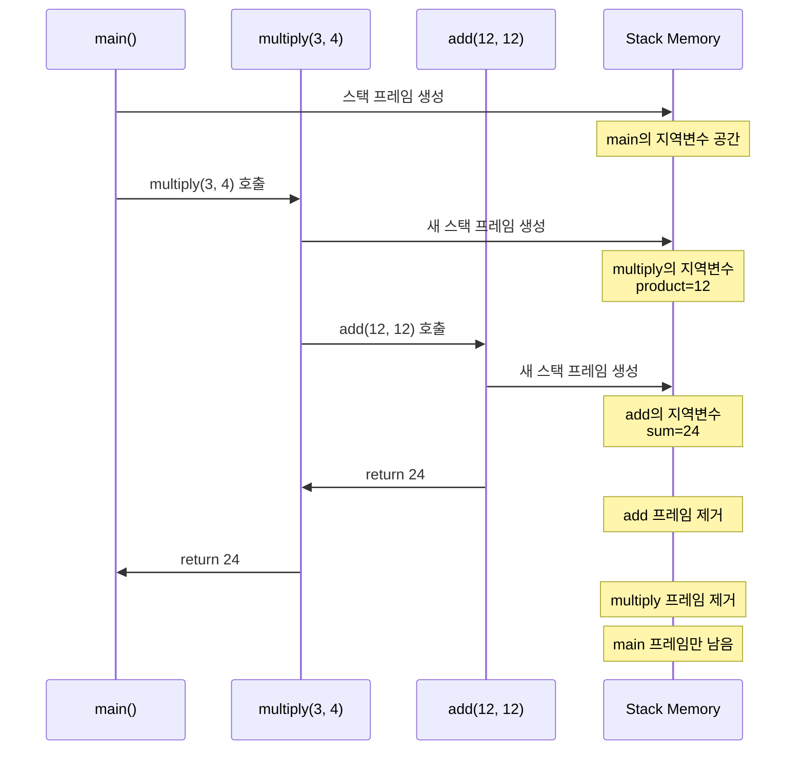

---
tags:
  - balanced
  - calling_convention
  - function_call
  - fundamentals
  - memory_layout
  - quick-read
  - stack
  - stack_frame
  - 시스템프로그래밍
difficulty: FUNDAMENTALS
learning_time: "0-0시간"
main_topic: "시스템 프로그래밍"
priority_score: 0
---

# 3.1.1: 스택 메모리 기초

## 스택의 아름다운 춤사위를 관찰하다

함수 호출은 마치 잘 짜인 안무와 같습니다. 각 함수는 무대(스택)에 올라와 자신의 공연을 하고, 끝나면 깔끔하게 퇴장합니다. 다음 함수가 정확히 같은 자리를 사용할 수 있도록 말이죠.

## 1. 함수 호출은 춤과 같다

실제 예제를 통해 이 춤사위를 관찰해봅시다:

```c
// stack_dance.c
#include <stdio.h>

int add(int a, int b) {
    int sum = a + b;
    printf("add: a=%d, b=%d, sum=%d, ", a, b, sum);
    printf("     &a=%p, &b=%p, &sum=%p, ", &a, &b, &sum);
    return sum;
}

int multiply(int x, int y) {
    int product = x * y;
    int doubled = add(product, product);  // add 호출
    printf("multiply: product=%d, doubled=%d, ", product, doubled);
    return doubled;
}

int main() {
    printf("=== 함수 호출의 춤 ===, ");
    int result = multiply(3, 4);
    printf("Final result: %d, ", result);
    return 0;
}
```

실행하면 무엇을 볼 수 있을까요?

```text
=== 함수 호출의 춤 ===
add: a=12, b=12, sum=24
     &a=0x7ffe5c3b7a2c, &b=0x7ffe5c3b7a28, &sum=0x7ffe5c3b7a24
multiply: product=12, doubled=24
Final result: 24
```

주소를 보세요! `add` 함수의 지역 변수들이 낮은 주소에 있습니다. 이것은 스택이 높은 주소에서 낮은 주소로 "자라기" 때문입니다.

## 🎭 함수 호출 시퀀스 다이어그램



## 2. 스택 프레임: 함수의 무대

각 함수가 호출될 때 스택에는 '스택 프레임'이라는 무대가 만들어집니다. 이 무대에는 함수가 필요한 모든 것이 준비됩니다:

```text
multiply(3, 4) 호출 시 스택 상태:

높은 주소 (스택의 바닥)
┌─────────────────────────┐
│  main의 리턴 주소       │ ← 운영체제로 돌아갈 주소
├─────────────────────────┤
│  main의 이전 rbp        │ ← main 이전의 베이스 포인터
├─────────────────────────┤ ← rbp (main의 베이스)
│  result (미정)          │
├─────────────────────────┤
│  multiply 리턴 주소     │ ← main으로 돌아갈 주소
├─────────────────────────┤
│  main의 rbp 백업        │
├─────────────────────────┤ ← rbp (multiply의 베이스)
│  x = 3                  │ [rbp+16] 첫 번째 인자
├─────────────────────────┤
│  y = 4                  │ [rbp+24] 두 번째 인자
├─────────────────────────┤
│  product = 12           │ [rbp-8] 지역 변수
├─────────────────────────┤
│  doubled (미정)         │ [rbp-16] 지역 변수
├─────────────────────────┤ ← rsp (현재 스택 꼭대기)
│  (미사용 공간)          │
↓                         ↓
낮은 주소 (스택이 자라는 방향)
```

이 구조의 천재성은 무엇일까요? **rbp(Base Pointer)**를 기준으로 모든 변수의 위치를 알 수 있다는 것입니다!

- 인자는 rbp보다 높은 주소에 (양수 오프셋)
- 지역 변수는 rbp보다 낮은 주소에 (음수 오프셋)

## 📊 스택 메모리 레이아웃 상세


## 3. 함수 호출 규약: 국제 표준 같은 약속

함수 호출에는 엄격한 규칙이 있습니다. 마치 국제 우편 시스템처럼, 모든 참여자가 같은 규칙을 따라야 합니다.

x86-64 Linux에서는 이런 규칙을 따릅니다:

```c
// calling_convention.c
#include <stdio.h>

// 6개 이하의 인자: 레지스터 사용
int test_registers(int a, int b, int c, int d, int e, int f) {
    // a는 RDI에, b는 RSI에, c는 RDX에
    // d는 RCX에, e는 R8에, f는 R9에 전달됨
    return a + b + c + d + e + f;
}

// 7개 이상의 인자: 나머지는 스택 사용
int test_stack(int a, int b, int c, int d, int e, int f, int g, int h) {
    // 처음 6개는 레지스터, g와 h는 스택에 전달됨
    return a + b + c + d + e + f + g + h;
}

// 어셈블리로 직접 확인
void examine_assembly() {
    __asm__ volatile(
        "mov $1, %%edi, "    // 첫 번째 인자
        "mov $2, %%esi, "    // 두 번째 인자
        "mov $3, %%edx, "    // 세 번째 인자
        "mov $4, %%ecx, "    // 네 번째 인자
        "mov $5, %%r8d, "    // 다섯 번째 인자
        "mov $6, %%r9d, "    // 여섯 번째 인자
        ::: "edi", "esi", "edx", "ecx", "r8", "r9"
    );
}
```

왜 이렇게 복잡한 규칙이 필요할까요? 바로 **성능** 때문입니다! 레지스터는 메모리보다 100배 이상 빠릅니다. 자주 사용되는 처음 몇 개의 인자를 레지스터에 전달하면 성능이 크게 향상됩니다.

## 🔄 x86-64 함수 호출 규약


## 4. 스택의 놀라운 속도 비밀

스택이 왜 그렇게 빠른지 실험해봅시다:

```c
// stack_speed_secret.c
#include <stdio.h>
#include <time.h>

#define ITERATIONS 100000000

// 스택 할당 테스트
void stack_allocation_test() {
    clock_t start = clock();

    for (long i = 0; i < ITERATIONS; i++) {
        int array[10];  // 스택 할당 - 단 1개 명령어!
        array[0] = i;   // 사용
        // 자동 해제 - 0개 명령어!
    }

    clock_t end = clock();
    double time_spent = ((double)(end - start)) / CLOCKS_PER_SEC;
    printf("스택 할당: %.3f초 (%.0f ns/할당), ",
           time_spent, time_spent * 1e9 / ITERATIONS);
}

// 어셈블리로 보는 스택 할당
void show_stack_assembly() {
    // 이 함수의 어셈블리를 보면:
    // sub rsp, 40    ; 40바이트 할당 (int[10])
    // ... 사용 ...
    // add rsp, 40    ; 40바이트 해제
    // ret

    int array[10];
    array[0] = 42;
}
```

스택 할당이 빠른 이유:

1. **단순한 포인터 연산**: `rsp -= size` 한 줄이면 끝!
2. **메타데이터 없음**: 크기나 상태를 기록할 필요 없음
3. **단편화 없음**: 항상 연속된 공간 사용
4. **캐시 친화적**: 최근 사용한 메모리 근처를 계속 사용

## ⚡ 스택 vs 힙 할당 속도 비교


## 5. 스택 관련 버그들

스택에서 발생하는 대표적인 버그들을 살펴봅시다:

```c
// stack_bugs.c
#include <stdio.h>
#include <string.h>

// 버그 1: 스택 오버플로우
int factorial(int n) {
    // 재귀 깊이 체크 없음!
    if (n <= 1) return 1;
    return n * factorial(n - 1);
}

// 버그 2: 스택 버퍼 오버플로우
void buffer_overflow_demo() {
    char password[16] = "secret";
    char input[16];
    int authorized = 0;

    printf("Password: ");
    gets(input);  // 절대 사용 금지! 길이 체크 없음

    if (strcmp(password, input) == 0) {
        authorized = 1;
    }

    // 공격자가 16자 이상 입력하면?
    // input 오버플로우 → authorized 덮어쓰기 가능!
    if (authorized) {
        printf("Access granted!, ");
    }
}

// 버그 3: 댕글링 포인터 (스택 버전)
int* get_local_pointer() {
    int local_var = 42;
    return &local_var;  // 경고! 지역 변수 주소 반환
}

void use_dangling_pointer() {
    int* ptr = get_local_pointer();
    // ptr은 이미 해제된 스택 메모리를 가리킴
    printf("Value: %d, ", *ptr);  // 정의되지 않은 동작!

    // 다른 함수 호출로 스택 덮어쓰기
    int other_function();
    other_function();

    printf("Value now: %d, ", *ptr);  // 완전히 다른 값!
}
```

## 핵심 요점

### 1. 스택의 LIFO 구조

스택은 Last In, First Out 구조로 함수 호출의 자연스러운 중첩을 지원합니다.

### 2. 자동 메모리 관리

함수가 종료되면 스택 프레임이 자동으로 정리되어 메모리 누수가 없습니다.

### 3. 극도로 빠른 할당

단순한 포인터 조작만으로 메모리 할당/해제가 이루어집니다.

### 4. 크기 제한 주의

스택 크기는 제한적이므로 큰 데이터나 깊은 재귀는 피해야 합니다.

---

**이전**: [Chapter 3 메모리 시스템 개요](./index.md)  
**다음**: [Chapter 3.1.2: 힙 메모리 기초](./03-01-02-heap-fundamentals.md)에서 malloc의 복잡한 여정을 탐구합니다.

## 📚 관련 문서

### 📖 현재 문서 정보

- **난이도**: FUNDAMENTALS
- **주제**: 시스템 프로그래밍
- **예상 시간**: 0-0시간

### 🎯 학습 경로

- [📚 FUNDAMENTALS 레벨 전체 보기](../learning-paths/fundamentals/)
- [🏠 메인 학습 경로](../learning-paths/)
- [📋 전체 가이드 목록](../README.md)

### 📂 같은 챕터 (chapter-03-memory-system)

- [Chapter 3.1.4: 프로세스 메모리 구조](./03-01-04-process-memory.md)
- [Chapter 3.1.1: 스택 메모리 기초](./03-01-01-stack-fundamentals.md)
- [Chapter 3.1.2: 힙 메모리 기초](./03-01-02-heap-fundamentals.md)
- [Chapter 3.7.1: 성능 디버깅](./03-07-01-performance-debugging.md)
- [Chapter 3.4.4: 고급 메모리 관리 기법](./03-04-04-advanced-techniques.md)

### 🏷️ 관련 키워드

`stack`, `function_call`, `memory_layout`, `stack_frame`, `calling_convention`

### ⏭️ 다음 단계 가이드

- 기초 개념을 충분히 이해한 후 INTERMEDIATE 레벨로 진행하세요
- 실습 위주의 학습을 권장합니다
