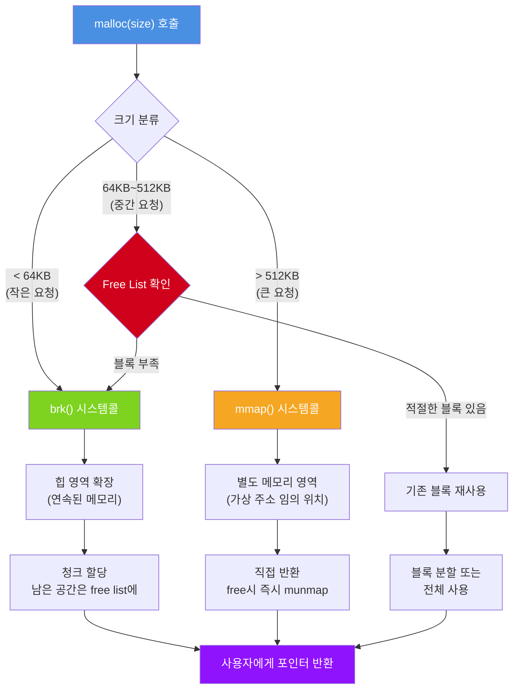
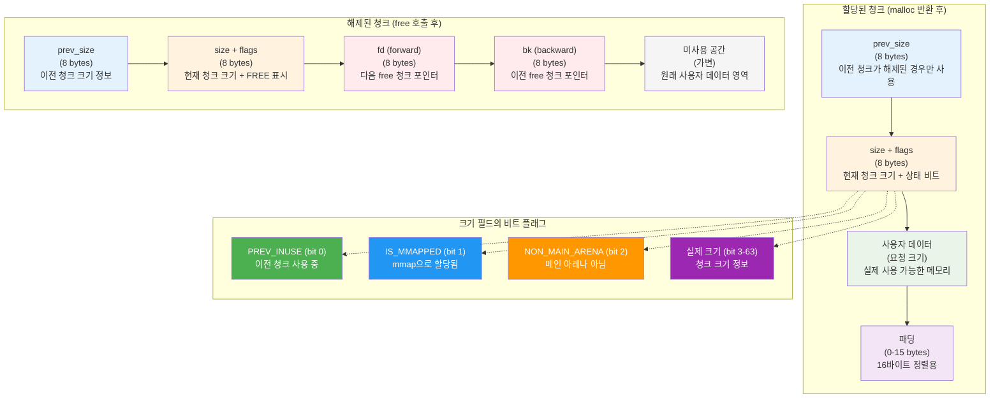
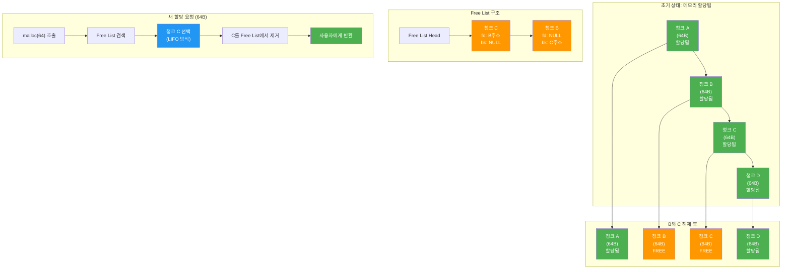

---
tags:
  - balanced
  - fragmentation
  - free-list
  - fundamentals
  - heap
  - malloc
  - medium-read
  - memory-allocation
  - 시스템프로그래밍
difficulty: FUNDAMENTALS
learning_time: "2-3시간"
main_topic: "시스템 프로그래밍"
priority_score: 4
---

# 3.1.2: 힙 메모리 기초

## 힙: 메모리의 창고 관리자

힙은 스택과는 완전히 다른 철학으로 동작합니다. 스택이 자판기라면, 힙은 거대한 창고입니다. 원하는 크기의 공간을 찾아주지만, 그만큼 복잡한 관리가 필요합니다.

## 1. malloc의 여정: 메모리를 찾아서

`malloc(100)`을 호출하면 무슨 일이 벌어질까요? 단순해 보이는 이 함수 뒤에는 복잡한 여정이 숨어있습니다:

```c
// malloc_journey.c
#include <stdio.h>
#include <stdlib.h>
#include <unistd.h>

void trace_malloc_journey() {
    printf("=== malloc의 여정 ===, ");

    // 1단계: 작은 할당
    printf(", 1. 작은 메모리 요청 (100 bytes), ");
    void* initial_brk = sbrk(0);
    printf("   힙 끝 주소: %p, ", initial_brk);

    char* small = malloc(100);
    printf("   할당된 주소: %p, ", small);

    void* new_brk = sbrk(0);
    printf("   새 힙 끝: %p, ", new_brk);
    printf("   힙 증가량: %ld bytes, ", (char*)new_brk - (char*)initial_brk);

    // 2단계: 또 다른 작은 할당
    printf(", 2. 또 다른 작은 요청 (200 bytes), ");
    char* small2 = malloc(200);
    printf("   할당된 주소: %p, ", small2);
    printf("   이전 할당과의 거리: %ld bytes, ", small2 - small);

    void* brk_after_second = sbrk(0);
    if (brk_after_second == new_brk) {
        printf("   힙 끝 변화 없음 - 기존 공간 재사용!, ");
    }

    // 3단계: 큰 할당
    printf(", 3. 큰 메모리 요청 (10MB), ");
    char* large = malloc(10 * 1024 * 1024);
    printf("   할당된 주소: %p, ", large);

    void* brk_after_large = sbrk(0);
    if (brk_after_large == brk_after_second) {
        printf("   힙 끝 변화 없음 - mmap 사용!, ");
        printf("   주소 차이: %ld MB, ",
               labs((long)large - (long)small2) / (1024*1024));
    }

    free(small);
    free(small2);
    free(large);
}
```

실행 결과:

```text
=== malloc의 여정 ===

1. 작은 메모리 요청 (100 bytes)
   힙 끝 주소: 0x55f4a9c2b000
   할당된 주소: 0x55f4a9c2b2a0
   새 힙 끝: 0x55f4a9c4c000
   힙 증가량: 135168 bytes

2. 또 다른 작은 요청 (200 bytes)
   할당된 주소: 0x55f4a9c2b310
   이전 할당과의 거리: 112 bytes
   힙 끝 변화 없음 - 기존 공간 재사용!

3. 큰 메모리 요청 (10MB)
   할당된 주소: 0x7f8a12345000
   힙 끝 변화 없음 - mmap 사용!
   주소 차이: 32156 MB
```

놀랍지 않나요? malloc은:

1. 작은 요청에는**brk**로 힙을 확장합니다
2. 하지만 실제 요청보다**훨씬 많이**확장합니다 (135KB!)
3. 큰 요청에는**mmap**으로 완전히 다른 영역을 사용합니다

## 🗺️ malloc의 메모리 할당 전략



## 2. 메모리 청크: 힙의 레고 블록

힙 메모리는 '청크(chunk)'라는 블록으로 관리됩니다. 각 청크는 레고 블록처럼 헤더를 가지고 있습니다:

```c
// chunk_structure.c
#include <stdio.h>
#include <stdlib.h>
#include <stdint.h>

// glibc malloc 청크 구조 (간략화)
struct malloc_chunk {
    size_t prev_size;  // 이전 청크 크기 (해제된 경우만)
    size_t size;       // 현재 청크 크기 + 플래그

    // 할당된 청크: 여기부터 사용자 데이터
    // 해제된 청크: 여기에 free list 포인터들
    union {
        struct {
            struct malloc_chunk* fd;  // forward pointer
            struct malloc_chunk* bk;  // backward pointer
        } free;
        char user_data[0];  // 사용자 데이터 시작
    };
};

void examine_chunk() {
    printf("=== 메모리 청크 해부 ===, ");

    // 할당
    int* ptr = malloc(sizeof(int) * 10);  // 40 bytes 요청

    // 청크 헤더 접근 (위험! 실제로는 하지 마세요)
    size_t* chunk = (size_t*)((char*)ptr - sizeof(size_t) * 2);

    printf("요청한 크기: 40 bytes, ");
    printf("청크 헤더 주소: %p, ", chunk);
    printf("사용자 포인터: %p, ", ptr);
    printf("실제 청크 크기: %zu bytes, ", chunk[1] & ~0x7);

    // 왜 요청한 것보다 클까?
    printf(", 왜 크기가 다를까?, ");
    printf("1. 헤더 오버헤드: 16 bytes, ");
    printf("2. 정렬 요구사항: 16 bytes 단위, ");
    printf("3. 최소 크기: 32 bytes, ");

    free(ptr);
}
```

청크 구조의 영리함:

-**할당된 청크**: 헤더 + 사용자 데이터
-**해제된 청크**: 헤더 + Free List 포인터 (사용자 데이터 영역 재활용!)
-**크기 필드의 하위 3비트**: 플래그로 사용 (PREV_INUSE, IS_MMAPPED, NON_MAIN_ARENA)

## 🧱 메모리 청크 구조 분석



## 3. Free List: 빈 메모리의 연결 리스트

해제된 메모리는 버려지는 것이 아니라 '재활용 대기소'에 들어갑니다:

```c
// free_list_visualization.c
#include <stdio.h>
#include <stdlib.h>

void visualize_free_list() {
    printf("=== Free List 시각화 ===, , ");

    // 1. 여러 블록 할당
    printf("1단계: 4개 블록 할당, ");
    void* a = malloc(64);
    void* b = malloc(64);
    void* c = malloc(64);
    void* d = malloc(64);

    printf("A: %p, B: %p, C: %p, D: %p, ", a, b, c, d);
    printf("메모리 상태: [A][B][C][D], , ");

    // 2. 중간 블록들 해제
    printf("2단계: B와 C 해제, ");
    free(b);
    free(c);
    printf("메모리 상태: [A][빈][빈][D], ");
    printf("Free List: C -> B -> NULL, , ");

    // 3. 새로운 할당 요청
    printf("3단계: 64 bytes 요청, ");
    void* e = malloc(64);
    printf("E: %p (", e);
    if (e == c) printf("C 자리 재사용!), ");
    else if (e == b) printf("B 자리 재사용!), ");
    printf("Free List: B -> NULL, , ");

    // 4. 작은 할당 요청
    printf("4단계: 32 bytes 요청, ");
    void* f = malloc(32);
    printf("F: %p, ", f);
    printf("남은 Free List의 64 bytes 블록을 분할했을 수 있음, ");

    free(a); free(d); free(e); free(f);
}
```

Free List의 전략들:

**1. First Fit (첫 번째 맞는 것)**

```text
Free List: [100B] -> [50B] -> [200B] -> [80B]
60B 요청 → [100B] 선택 (첫 번째로 충분한 크기)
```

**2. Best Fit (가장 적합한 것)**

```text
Free List: [100B] -> [50B] -> [200B] -> [80B]
60B 요청 → [80B] 선택 (가장 낭비가 적음)
```

**3. Worst Fit (가장 큰 것)**

```text
Free List: [100B] -> [50B] -> [200B] -> [80B]
60B 요청 → [200B] 선택 (큰 블록 유지)
```

## 🔗 Free List 동작 과정



## 4. 메모리 단편화: 힙의 고질병

단편화는 힙 메모리의 암과 같습니다. 천천히 퍼져서 시스템을 마비시킬 수 있습니다:

```c
// fragmentation_demo.c
#include <stdio.h>
#include <stdlib.h>
#include <string.h>

void demonstrate_fragmentation() {
    printf("=== 메모리 단편화 시연 ===, , ");

    // 시나리오: 채팅 서버의 메시지 버퍼
    typedef struct {
        char* buffer;
        size_t size;
    } Message;

    #define NUM_MESSAGES 1000
    Message messages[NUM_MESSAGES];

    printf("1. 다양한 크기의 메시지 할당, ");
    for (int i = 0; i < NUM_MESSAGES; i++) {
        // 10 ~ 1000 bytes의 랜덤 크기
        size_t size = 10 + (rand() % 991);
        messages[i].buffer = malloc(size);
        messages[i].size = size;
    }
    printf("   %d개 메시지 할당 완료, , ", NUM_MESSAGES);

    printf("2. 홀수 번째 메시지 해제 (체크보드 패턴), ");
    for (int i = 1; i < NUM_MESSAGES; i += 2) {
        free(messages[i].buffer);
        messages[i].buffer = NULL;
    }
    printf("   500개 메시지 해제, ");
    printf("   현재 메모리: [사용][빈][사용][빈]..., , ");

    printf("3. 큰 메시지 할당 시도, ");
    char* large_msg = malloc(5000);  // 5KB
    if (large_msg) {
        printf("   성공! 하지만 새로운 영역에 할당되었을 것, ");
        printf("   기존의 작은 빈 공간들은 사용 불가, ");
        free(large_msg);
    }

    // 정리
    for (int i = 0; i < NUM_MESSAGES; i += 2) {
        free(messages[i].buffer);
    }

    printf(", 교훈: 단편화는 메모리가 있어도 사용할 수 없게 만듭니다!, ");
}
```

## 💔 메모리 단편화 시각화

```mermaid
graph TD
    subgraph "1단계: 초기 상태 (1000개 메시지 할당)"
        S1_1["메시지 1
(랜덤 크기)"]
        S1_2["메시지 2
(랜덤 크기)"]
        S1_3["메시지 3
(랜덤 크기)"]
        S1_4["..."]
        S1_5["메시지 1000
(랜덤 크기)"]
    end
    
    subgraph "2단계: 홀수 메시지 해제 (체크보드 패턴)"
        S2_1["메시지 1
✅ 사용중"]
        S2_2["메시지 2
❌ 해제됨"]
        S2_3["메시지 3
✅ 사용중"]
        S2_4["메시지 4
❌ 해제됨"]
        S2_5["..."]
    end
    
    subgraph "3단계: 큰 메시지 할당 시도 (5KB)"
        S3_PROB["문제 발생!"]
        S3_SMALL1["50B 빈공간"]
        S3_SMALL2["120B 빈공간"]
        S3_SMALL3["80B 빈공간"]
        S3_SMALL4["300B 빈공간"]
        S3_NEED["5KB 필요"]
        S3_SOLUTION["새 영역에
할당해야 함"]
    end
    
    subgraph "메모리 상태 비교"
        BEFORE["사용 가능:
총 2.5KB의 빈 공간"]
        AFTER["실제 사용 불가:
최대 300B 블록뿐"]
        WASTE["낭비: 2.2KB
사용할 수 없음"]
    end
    
    S1_1 --> S1_2 --> S1_3 --> S1_4 --> S1_5
    S2_1 --> S2_2 --> S2_3 --> S2_4 --> S2_5
    
    S3_SMALL1 --> S3_SMALL2 --> S3_SMALL3 --> S3_SMALL4
    S3_NEED --> S3_SOLUTION
    
    BEFORE --> AFTER --> WASTE
    
    style S1_1 fill:#4caf50,color:#fff
    style S1_2 fill:#4caf50,color:#fff
    style S1_3 fill:#4caf50,color:#fff
    style S1_5 fill:#4caf50,color:#fff
    
    style S2_1 fill:#4caf50,color:#fff
    style S2_2 fill:#ff9800,color:#fff
    style S2_3 fill:#4caf50,color:#fff
    style S2_4 fill:#ff9800,color:#fff
    
    style S3_PROB fill:#f44336,color:#fff
    style S3_SMALL1 fill:#ff9800,color:#fff
    style S3_SMALL2 fill:#ff9800,color:#fff
    style S3_SMALL3 fill:#ff9800,color:#fff
    style S3_SMALL4 fill:#ff9800,color:#fff
    style S3_NEED fill:#2196f3,color:#fff
    style S3_SOLUTION fill:#9c27b0,color:#fff
    
    style BEFORE fill:#4caf50,color:#fff
    style AFTER fill:#ff9800,color:#fff
    style WASTE fill:#f44336,color:#fff
```



## 5. 힙 관리 전략

### 작은 할당 vs 큰 할당

glibc malloc은 크기에 따라 다른 전략을 사용합니다:

```c
// size_based_strategy.c
void demonstrate_size_strategies() {
    printf("=== 크기별 할당 전략 ===, ");

    // 매우 작은 할당 (< 64 bytes): Fastbin
    printf("1. Fastbin 영역 (< 64 bytes), ");
    for (int i = 0; i < 10; i++) {
        void* small = malloc(32);
        printf("   %p (빠른 할당), ", small);
    }

    // 일반 할당 (64 ~ 512KB): Smallbin/Largebin
    printf(", 2. 일반 영역 (64 bytes ~ 512KB), ");
    void* medium = malloc(1024);
    printf("   %p (Free List 검색), ", medium);

    // 큰 할당 (> 512KB): mmap
    printf(", 3. 큰 영역 (> 512KB), ");
    void* large = malloc(1024 * 1024);  // 1MB
    printf("   %p (mmap 사용), ", large);

    // 정리는 생략...
}
```

### 단편화를 줄이는 방법

1.**메모리 풀**: 같은 크기 객체는 전용 풀에서 할당
2.**아레나**: 관련 할당을 그룹화  
3.**적절한 할당자 선택**: jemalloc, tcmalloc 등

## 핵심 요점

### 1. 복잡한 내부 구조

힙은 청크, Free List, 아레나 등 복잡한 데이터 구조로 관리됩니다.

### 2. 크기별 최적화

작은 할당과 큰 할당에 대해 서로 다른 전략을 사용합니다.

### 3. 단편화 문제

사용 패턴에 따라 메모리 단편화가 발생할 수 있습니다.

### 4. 수동 관리 필요

malloc으로 할당한 메모리는 반드시 free로 해제해야 합니다.

---

**이전**: [Chapter 3.1.1: 스택 메모리 기초](./03-01-01-stack-fundamentals.md)  
**다음**: [Chapter 3.1.3: 가상 메모리 개념](./03-01-03-virtual-memory-basics.md)에서 가상 메모리의 동작 원리를 탐구합니다.

## 📚 관련 문서

### 📖 현재 문서 정보

-**난이도**: FUNDAMENTALS
-**주제**: 시스템 프로그래밍
-**예상 시간**: 2-3시간

### 🎯 학습 경로

- [📚 FUNDAMENTALS 레벨 전체 보기](../learning-paths/fundamentals/)
- [🏠 메인 학습 경로](../learning-paths/)
- [📋 전체 가이드 목록](../README.md)

### 📂 같은 챕터 (chapter-03-memory-system)

- [Chapter 3.1.4: 프로세스 메모리 구조](./03-01-04-process-memory.md)
- [Chapter 3.1.1: 스택 메모리 기초](./03-01-01-stack-fundamentals.md)
- [Chapter 3.1.3: 가상 메모리 개념](./03-01-03-virtual-memory-basics.md)
- [Chapter 3.7.1: 성능 디버깅](./03-07-01-performance-debugging.md)
- [Chapter 3.4.4: 고급 메모리 관리 기법](./03-04-04-advanced-techniques.md)

### 🏷️ 관련 키워드

`heap`, `malloc`, `memory-allocation`, `fragmentation`, `free-list`

### ⏭️ 다음 단계 가이드

- 기초 개념을 충분히 이해한 후 INTERMEDIATE 레벨로 진행하세요
- 실습 위주의 학습을 권장합니다
