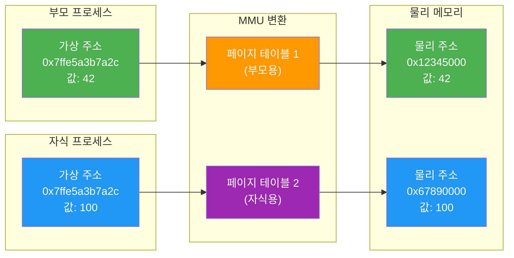
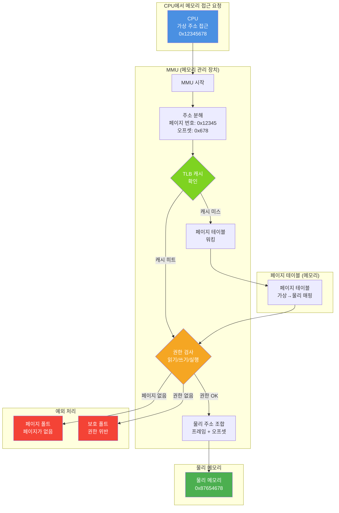
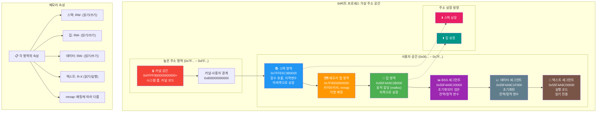

---
tags:
  - address-translation
  - balanced
  - fundamentals
  - medium-read
  - memory-mapping
  - mmu
  - process-isolation
  - virtual-memory
  - 시스템프로그래밍
difficulty: FUNDAMENTALS
learning_time: "3-5시간"
main_topic: "시스템 프로그래밍"
priority_score: 4
---

# 3.1.3: 가상 메모리 개념

## 1. 가상 메모리: 환상의 세계

### 1.1 두 개의 세계: 가상과 현실

프로그램이 사는 세계와 실제 하드웨어의 세계는 다릅니다:

```c
// virtual_vs_physical.c
#include <stdio.h>
#include <unistd.h>
#include <sys/wait.h>

int main() {
    int shared_value = 42;
    printf("부모: shared_value의 주소 = %p, 값 = %d\n",
           &shared_value, shared_value);

    pid_t pid = fork();

    if (pid == 0) {  // 자식 프로세스
        printf("자식: shared_value의 주소 = %p, 값 = %d\n",
               &shared_value, shared_value);

        shared_value = 100;
        printf("자식: 값을 100으로 변경\n");
        printf("자식: shared_value의 주소 = %p, 값 = %d\n",
               &shared_value, shared_value);
    } else {  // 부모 프로세스
        wait(NULL);
        printf("부모: shared_value의 주소 = %p, 값 = %d\n",
               &shared_value, shared_value);
    }

    return 0;
}
```

실행 결과:

```text
부모: shared_value의 주소 = 0x7ffe5a3b7a2c, 값 = 42
자식: shared_value의 주소 = 0x7ffe5a3b7a2c, 값 = 42  # 같은 주소!
자식: 값을 100으로 변경
자식: shared_value의 주소 = 0x7ffe5a3b7a2c, 값 = 100
부모: shared_value의 주소 = 0x7ffe5a3b7a2c, 값 = 42  # 같은 주소인데 다른 값!
```

놀랍지 않나요? 부모와 자식이**같은 주소**를 가지고 있는데**다른 값**을 보고 있습니다! 이것이 가상 메모리의 마법입니다.

## 🎭 가상 메모리의 마법: 같은 주소, 다른 값



### 1.2 가상 메모리가 해결하는 문제들

가상 메모리가 없던 시절을 상상해봅시다:

**문제 1: 메모리 충돌**

```text
프로그램 A: 0x1000번지에 중요한 데이터 저장
프로그램 B: 0x1000번지에 자신의 데이터 저장
→ 충돌! 프로그램 A의 데이터가 파괴됨
```

**문제 2: 메모리 단편화**

```text
8KB RAM 상황:
[프로그램A: 2KB][빈공간: 1KB][프로그램B: 3KB][빈공간: 2KB]
→ 3KB 프로그램 C를 실행하려면?
→ 빈 공간은 총 3KB이지만 연속되지 않아 실행 불가!
```

**문제 3: 보안 없음**

```c
// 악의적인 프로그램
int* steal_password = (int*)0x2000;  // 다른 프로그램의 메모리
printf("훔친 비밀번호: %s\n", steal_password);  // 😱
```

가상 메모리는 이 모든 문제를 우아하게 해결합니다!

### 1.3 주소 공간의 크기: 상상력의 한계

```c
// address_space_size.c
#include <stdio.h>
#include <stdint.h>

void explore_address_space() {
    printf("=== 주소 공간 탐험 ===\n\n");

    // 포인터 크기 확인
    printf("포인터 크기: %zu bytes = %zu bits\n",
           sizeof(void*), sizeof(void*) * 8);

    // 32비트 시스템
    if (sizeof(void*) == 4) {
        uint32_t max_addr = UINT32_MAX;
        printf("32비트 시스템:\n");
        printf("  최대 주소: 0x%08X\n", max_addr);
        printf("  주소 공간: %.1f GB\n", max_addr / (1024.0 * 1024 * 1024));
    }

    // 64비트 시스템
    if (sizeof(void*) == 8) {
        printf("64비트 시스템:\n");
        printf("  이론적 최대: 2^64 = 16 EB (엑사바이트)\n");
        printf("  실제 사용 (x86-64): 2^48 = 256 TB\n");
        printf("  일반적 제한: 128 TB (사용자) + 128 TB (커널)\n");

        // 실제 주소 확인
        void* stack_addr = &max_addr;
        void* heap_addr = malloc(100);

        printf("\n실제 주소 예시:\n");
        printf("  스택: %p (상위 비트가 0x7F...)\n", stack_addr);
        printf("  힙:  %p (중간 영역)\n", heap_addr);

        free(heap_addr);
    }
}
```

생각해보세요. 64비트 시스템의 이론적 주소 공간은 16 엑사바이트입니다. 이는:

- 현재 전 세계 데이터 총량보다 많습니다
- 1초에 1바이트씩 쓴다면 5억년이 걸립니다
- 1mm 두께 종이에 인쇄하면 지구에서 태양까지 100번 왕복!

## 2. 주소 변환의 메커니즘

### 2.1 가상 주소에서 물리 주소로

가상 메모리 시스템의 핵심은 주소 변환입니다:

```c
// address_translation_demo.c
#include <stdio.h>
#include <sys/mman.h>
#include <fcntl.h>
#include <unistd.h>

void show_virtual_to_physical_mapping() {
    printf("=== 가상-물리 주소 매핑 탐색 ===\n\n");

    // 메모리 할당
    void* virtual_addr = malloc(4096);  // 한 페이지
    printf("할당된 가상 주소: %p\n", virtual_addr);

    // /proc/self/maps에서 메모리 맵 확인
    printf("\n현재 프로세스의 메모리 맵:\n");
    system("cat /proc/self/maps | head -10");

    // /proc/self/pagemap으로 물리 주소 확인 (root 권한 필요)
    printf("\n페이지맵 정보 (개념적):\n");
    printf("가상 주소 %p는 다음과 같이 분해됩니다:\n", virtual_addr);

    uintptr_t addr = (uintptr_t)virtual_addr;
    uintptr_t page_num = addr >> 12;     // 상위 비트: 페이지 번호
    uintptr_t offset = addr & 0xFFF;     // 하위 12비트: 페이지 내 오프셋

    printf("  페이지 번호: 0x%lX\n", page_num);
    printf("  페이지 내 오프셋: 0x%lX (%ld bytes)\n", offset, offset);

    free(virtual_addr);
}

int main() {
    show_virtual_to_physical_mapping();
    return 0;
}
```

### 2.2 메모리 관리 단위(MMU)의 역할

MMU는 하드웨어 장치로 모든 메모리 접근을 중재합니다:

```c
// mmu_simulation.c
#include <stdio.h>
#include <stdint.h>

// MMU 동작 시뮬레이션
typedef struct {
    uint64_t virtual_page_number;
    uint64_t physical_frame_number;
    int present;      // 메모리에 있는가?
    int writable;     // 쓰기 가능한가?
    int user_access;  // 사용자 모드 접근 가능한가?
} PageTableEntry;

uint64_t mmu_translate(uint64_t virtual_address, PageTableEntry* page_table) {
    printf("=== MMU 주소 변환 과정 ===\n");

    // 1. 가상 주소 분해
    uint64_t page_number = virtual_address >> 12;  // 상위 비트
    uint64_t offset = virtual_address & 0xFFF;     // 하위 12비트

    printf("1. 가상 주소 분해:\n");
    printf("   가상 주소: 0x%lX\n", virtual_address);
    printf("   페이지 번호: %ld\n", page_number);
    printf("   오프셋: 0x%lX\n", offset);

    // 2. 페이지 테이블 조회
    printf("\n2. 페이지 테이블 조회:\n");
    PageTableEntry entry = page_table[page_number];

    if (!entry.present) {
        printf("   → 페이지 폴트 발생! (페이지가 메모리에 없음)\n");
        return 0;
    }

    printf("   → 페이지 발견\n");
    printf("   → 물리 프레임: %ld\n", entry.physical_frame_number);
    printf("   → 권한 확인: ");
    if (entry.writable) printf("쓰기가능 ");
    if (entry.user_access) printf("사용자접근 ");
    printf("\n");

    // 3. 물리 주소 계산
    uint64_t physical_address = (entry.physical_frame_number << 12) | offset;

    printf("\n3. 물리 주소 계산:\n");
    printf("   → 물리 주소: 0x%lX\n", physical_address);
    printf("   → (프레임 %ld + 오프셋 0x%lX)\n",
           entry.physical_frame_number, offset);

    return physical_address;
}

int main() {
    // 간단한 페이지 테이블 설정
    PageTableEntry page_table[10] = {0};

    // 페이지 0 설정: 가상 페이지 0 → 물리 프레임 5
    page_table[0] = (PageTableEntry){
        .virtual_page_number = 0,
        .physical_frame_number = 5,
        .present = 1,
        .writable = 1,
        .user_access = 1
    };

    // 주소 변환 테스트
    uint64_t virtual_addr = 0x0100;  // 페이지 0, 오프셋 0x100
    uint64_t physical_addr = mmu_translate(virtual_addr, page_table);

    if (physical_addr) {
        printf("\n✅ 변환 성공: 0x%lX → 0x%lX\n", virtual_addr, physical_addr);
    }

    return 0;
}
```

## 🔄 MMU 주소 변환 과정 상세



## 3. 프로세스별 독립된 주소 공간

### 3.1 주소 공간 격리의 실제

```c
// address_space_isolation.c
#include <stdio.h>
#include <unistd.h>
#include <sys/wait.h>
#include <string.h>

void demonstrate_isolation() {
    printf("=== 프로세스 주소 공간 격리 실증 ===\n\n");

    // 동일한 가상 주소에 서로 다른 데이터 저장
    char* shared_location = (char*)0x10000000;  // 가상 주소
    char data[100];

    sprintf(data, "부모 프로세스의 비밀 데이터: %d", getpid());
    strcpy(shared_location, data);

    printf("부모 (%d): 주소 %p에 데이터 저장\n", getpid(), shared_location);
    printf("부모 데이터: %s\n\n", shared_location);

    pid_t pid = fork();

    if (pid == 0) {  // 자식 프로세스
        printf("자식 (%d): 같은 주소 %p 확인\n", getpid(), shared_location);
        printf("자식이 보는 데이터: %s\n", shared_location);

        // 자식이 데이터 변경
        sprintf(data, "자식 프로세스의 새로운 데이터: %d", getpid());
        strcpy(shared_location, data);
        printf("자식이 데이터 변경: %s\n\n", shared_location);

        // 메모리 맵 확인
        printf("자식의 메모리 맵:\n");
        char cmd[100];
        sprintf(cmd, "cat /proc/%d/maps | grep -E '(heap|stack)' | head -3", getpid());
        system(cmd);

    } else {  // 부모 프로세스
        wait(NULL);
        printf("\n부모 (%d): 자식 종료 후 데이터 확인\n", getpid());
        printf("부모가 보는 데이터: %s\n", shared_location);
        printf("→ 격리됨! 서로 영향 없음\n\n");

        printf("부모의 메모리 맵:\n");
        char cmd[100];
        sprintf(cmd, "cat /proc/%d/maps | grep -E '(heap|stack)' | head -3", getpid());
        system(cmd);
    }
}

int main() {
    demonstrate_isolation();
    return 0;
}
```

### 3.2 주소 공간 레이아웃

각 프로세스는 표준화된 메모리 레이아웃을 가집니다:

```c
// address_space_layout.c
#include <stdio.h>
#include <stdlib.h>
#include <unistd.h>

// 전역 변수 (데이터 세그먼트)
int global_var = 42;
int uninitialized_global;

// 문자열 리터럴 (텍스트 세그먼트)
const char* string_literal = "Hello, Virtual Memory!";

void analyze_memory_layout() {
    // 지역 변수 (스택)
    int stack_var = 100;

    // 동적 할당 (힙)
    int* heap_var = malloc(sizeof(int));
    *heap_var = 200;

    printf("=== 프로세스 메모리 레이아웃 분석 ===\n\n");

    printf("메모리 영역별 주소 (높은 주소 → 낮은 주소):\n\n");

    // 스택 (높은 주소)
    printf("📚 스택 영역:\n");
    printf("  지역 변수 (stack_var):     %p\n", &stack_var);
    printf("  함수 매개변수 예상 위치:    %p (근사)\n", &stack_var - 10);

    printf("\n🧱 힙 영역:\n");
    printf("  동적 할당 (heap_var):      %p\n", heap_var);

    printf("\n📊 데이터 영역:\n");
    printf("  초기화된 전역변수:         %p\n", &global_var);
    printf("  초기화 안된 전역변수 (BSS): %p\n", &uninitialized_global);

    printf("\n📖 텍스트 영역:\n");
    printf("  문자열 리터럴:             %p\n", string_literal);
    printf("  함수 코드 (main):          %p\n", &main);

    printf("\n메모리 맵 상세 정보:\n");
    char cmd[100];
    sprintf(cmd, "cat /proc/%d/maps", getpid());
    system(cmd);

    free(heap_var);
}

int main() {
    analyze_memory_layout();
    return 0;
}
```

## 🏗️ 프로세스 메모리 레이아웃 구조



## 핵심 요점

### 1. 가상 메모리의 마법

- 각 프로세스가 독립된 완전한 주소 공간을 가진다는 착각 제공
- 실제로는 MMU가 가상 주소를 물리 주소로 동적 변환
- 프로세스 간 완벽한 격리와 보안 달성

### 2. 주소 변환의 핵심

- 가상 주소 = 페이지 번호 + 페이지 내 오프셋
- MMU가 하드웨어 레벨에서 모든 메모리 접근 중재
- 권한 검사와 주소 변환을 원자적으로 수행

### 3. 프로세스별 독립성

- 같은 가상 주소라도 서로 다른 물리 위치 매핑 가능
- Copy-on-Write로 효율적인 프로세스 생성
- 표준화된 메모리 레이아웃으로 일관된 프로그래밍 환경

---

**이전**: [Chapter 3.1.2: 힙 메모리 기초](./03-01-02-heap-fundamentals.md)  
**다음**: [Chapter 3.1.4: 프로세스 메모리 구조](./03-01-04-process-memory.md)에서 프로세스에서 메모리가 어떻게 구성되는지 학습합니다.

## 📚 관련 문서

### 📖 현재 문서 정보

-**난이도**: FUNDAMENTALS
-**주제**: 시스템 프로그래밍
-**예상 시간**: 3-5시간

### 🎯 학습 경로

- [📚 FUNDAMENTALS 레벨 전체 보기](../learning-paths/fundamentals/)
- [🏠 메인 학습 경로](../learning-paths/)
- [📋 전체 가이드 목록](../README.md)

### 📂 같은 챕터 (chapter-03-memory-system)

- [Chapter 3.1.4: 프로세스 메모리 구조](./03-01-04-process-memory.md)
- [Chapter 3.1.1: 스택 메모리 기초](./03-01-01-stack-fundamentals.md)
- [Chapter 3.1.2: 힙 메모리 기초](./03-01-02-heap-fundamentals.md)
- [Chapter 3.7.1: 성능 디버깅](./03-07-01-performance-debugging.md)

### 🏷️ 관련 키워드

`virtual-memory`, `address-translation`, `mmu`, `process-isolation`, `memory-mapping`

### ⏭️ 다음 단계 가이드

- 기초 개념을 충분히 이해한 후 INTERMEDIATE 레벨로 진행하세요
- 실습 위주의 학습을 권장합니다
