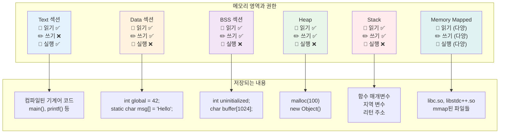
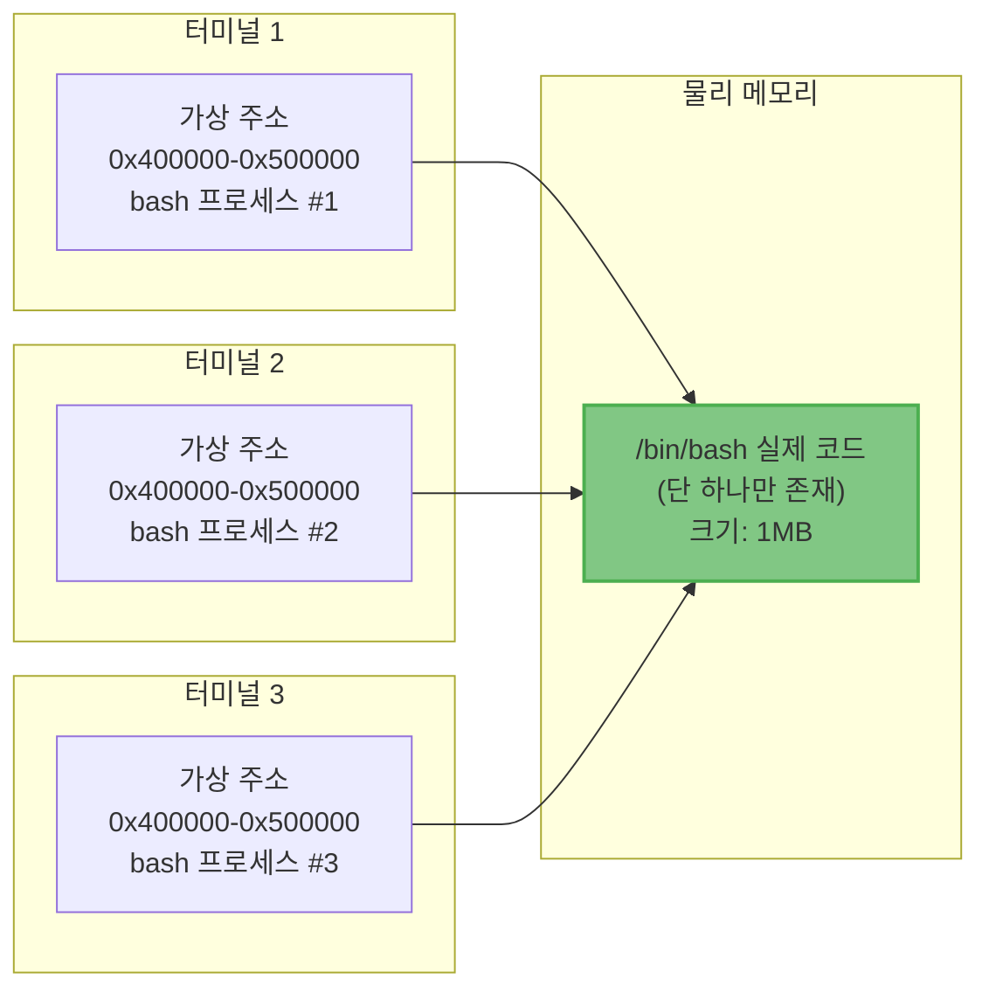
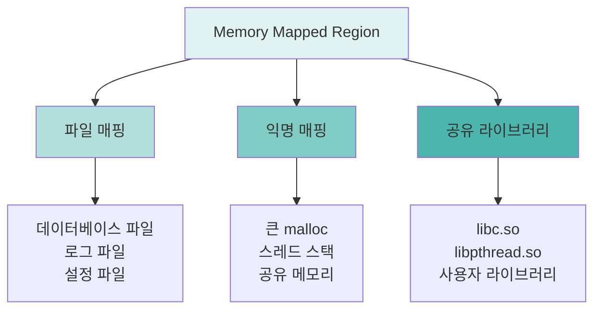

---
tags:
  - balanced
  - deep-study
  - fundamentals
  - heap
  - memory-layout
  - process-memory
  - stack
  - virtual-memory
  - 시스템프로그래밍
difficulty: FUNDAMENTALS
learning_time: "6-8시간"
main_topic: "시스템 프로그래밍"
priority_score: 4
---

# 3.1.4: 프로세스 메모리 구조

## 이 문서를 읽으면 답할 수 있는 질문들

- 프로그램이 실행될 때 메모리는 어떻게 구성되는가?
- 전역 변수와 지역 변수는 메모리 어디에 저장되는가?
- 스택 오버플로우는 왜 발생하는가?
- malloc()으로 할당한 메모리는 어디에 있는가?
- 왜 메모리를 텍스트, 데이터, 스택, 힙으로 나누는가?

## 들어가며: 한 개발자의 디버깅 이야기

신입 개발자 김 씨는 오늘도 야근 중입니다. 분명히 잘 작동하던 프로그램이 갑자기 "Segmentation Fault"를 뱉으며 죽어버렸습니다. 더 이상한 것은, 같은 코드인데도 실행할 때마다 에러가 나는 위치가 달라진다는 것입니다. 전역 변수를 하나 추가했더니 갑자기 작동하기 시작했다가, 함수를 하나 더 만들었더니 또 죽습니다.

이런 미스터리한 버그들의 원인은 대부분 메모리 구조를 제대로 이해하지 못했기 때문입니다. 프로그램이 실행될 때 메모리가 어떻게 구성되는지, 각 변수가 어디에 저장되는지, 왜 스택 오버플로우가 발생하는지를 이해한다면, 이런 버그들을 예방하고 해결할 수 있습니다.

## 1. 프로세스 주소 공간: 프로그램의 집 구조

### 1.1 프로그램이 메모리에 적재되는 순간

여러분이 터미널에서 `./myprogram`을 입력하고 엔터를 누르는 순간, 무슨 일이 일어날까요?

운영체제는 마치 부동산 중개인처럼 프로그램을 위한 '집'을 마련합니다. 이 집은 가상 주소 공간(Virtual Address Space)이라고 부르며, 64비트 시스템에서는 이론적으로 2^64 바이트(약 1800경 바이트)라는 어마어마한 크기를 가집니다. 물론 실제로 이 모든 공간을 사용하는 것은 아닙니다. 마치 서울시 전체를 내 집이라고 주장할 수는 있지만, 실제로 사는 곳은 그 중 작은 아파트 한 채인 것과 같습니다.

이 거대한 가상 공간을 운영체제는 체계적으로 구역별로 나눕니다:

```text
높은 주소 (0xFFFFFFFFFFFFFFFF)
┌─────────────────────┐
│    커널 공간        │ ← 운영체제의 성역, 일반 프로그램은 접근 불가
├─────────────────────┤ 0xFFFF800000000000
│                     │
│    사용 안 함       │ ← 정식 주소 공간의 구멍 (canonical hole)
│                     │   왜 있을까? CPU 설계상의 이유!
├─────────────────────┤ 0x00007FFFFFFFFFFF
│    스택 (Stack)     │ ↓ 높은 주소에서 낮은 주소로 성장
├─────────────────────┤
│                     │
│    Memory Mapped    │ ← 공유 라이브러리들의 거주지
│    Region           │ ← mmap으로 만든 특별한 공간
│                     │
├─────────────────────┤
│                     │
│    힙 (Heap)        │ ↑ 낮은 주소에서 높은 주소로 성장
├─────────────────────┤ brk (프로그램 break)
│    BSS 섹션         │ ← 0으로 초기화되는 전역 변수들
├─────────────────────┤
│    Data 섹션        │ ← 초기값이 있는 전역 변수들
├─────────────────────┤
│    Text 섹션        │ ← 우리가 작성한 코드가 기계어로 변환되어 있는 곳
└─────────────────────┘ 0x0000000000400000
낮은 주소 (0x0000000000000000)
```

### 1.2 왜 이렇게 복잡하게 나누는가?

처음 컴퓨터가 만들어졌을 때는 메모리가 이렇게 복잡하지 않았습니다. 모든 것이 한 덩어리였죠. 하지만 프로그램이 복잡해지면서 여러 문제가 발생했습니다:

**문제 1: 코드와 데이터가 섞여 있으면?**

```c
// 만약 코드와 데이터가 구분 없이 섞여 있다면...
int data = 42;
void function() { /* ... */ }
int another_data = 100;
void another_function() { /* ... */ }
```

해커가 `data` 변수를 조작해서 악성 코드를 넣고, 프로그램이 이를 실행하게 만들 수 있습니다. 이것이 바로 코드 인젝션 공격입니다.

**문제 2: 스택과 힙이 구분되지 않으면?**

함수가 호출될 때마다 필요한 공간(스택 프레임)과 동적으로 할당하는 공간(malloc)이 서로 충돌할 수 있습니다. 마치 한 방에서 요리도 하고, 잠도 자고, 공부도 하면 서로 방해가 되는 것과 같습니다.

**문제 3: 여러 프로세스가 같은 프로그램을 실행하면?**

Chrome 브라우저를 10개 탭으로 열었다고 생각해보세요. 각 탭이 Chrome의 코드를 복사해서 메모리에 10번 올린다면? 엄청난 낭비입니다. 코드는 읽기 전용이니 공유할 수 있어야 합니다.

### 1.3 각 영역의 특징과 권한

메모리의 각 영역은 마치 건물의 각 층처럼 서로 다른 용도와 규칙을 가집니다:



이제 각 영역을 자세히 살펴보겠습니다.

## 2. Text 섹션: 프로그램의 두뇌

### 2.1 코드가 살아있는 곳

Text 섹션은 우리가 작성한 C 코드가 컴파일되어 기계어로 변환된 후 저장되는 곳입니다. 이곳은 프로그램의 '두뇌'라고 할 수 있습니다. CPU는 이곳의 명령어를 하나씩 읽어서 실행합니다.

```c
// example.c - 우리가 작성한 코드
#include <stdio.h>

void greet(const char* name) {
    printf("Hello, %s!, ", name);
}

int main() {
    greet("World");
    return 0;
}
```

이 코드를 컴파일하면 어떻게 될까요? `objdump` 명령어로 살펴봅시다:

```bash
$ gcc -o example example.c
$ objdump -d example | grep -A10 "<greet>:"

0000000000401126 <greet>:
  401126: 55                    push   %rbp        # 스택 프레임 설정
  401127: 48 89 e5              mov    %rsp,%rbp   # 베이스 포인터 설정
  40112a: 48 83 ec 10           sub    $0x10,%rsp  # 지역 변수 공간 확보
  40112e: 48 89 7d f8           mov    %rdi,-0x8(%rbp)  # 매개변수 저장
  401132: 48 8b 45 f8           mov    -0x8(%rbp),%rax
  401136: 48 89 c6              mov    %rax,%rsi
  401139: 48 8d 3d c4 0e 00 00  lea    0xec4(%rip),%rdi  # "Hello, %s!, " 주소
  401140: b8 00 00 00 00        mov    $0x0,%eax
  401145: e8 e6 fe ff ff        call   401030 <printf@plt>
  40114a: 90                    nop
  40114b: c9                    leave
  40114c: c3                    ret
```

우리가 작성한 간단한 `greet` 함수가 13개의 기계어 명령어로 변환되었습니다! 각 명령어는 Text 섹션의 특정 주소(0x401126부터)에 저장됩니다.

### 2.2 왜 Text 섹션은 읽기 전용일까?

Text 섹션을 쓰기 가능하게 만들면 어떤 일이 일어날까요? 다음 시나리오를 상상해보세요:

```c
// 만약 코드를 수정할 수 있다면... (실제로는 불가능)
void malicious_function() {
    // greet 함수의 첫 바이트를 ret(0xc3)으로 바꾸기
    unsigned char* greet_addr = (unsigned char*)greet;
    greet_addr[0] = 0xc3;  // Segmentation Fault!
}
```

만약 이것이 가능하다면:

1. **자기 수정 코드(Self-modifying code)**: 실행 중에 자신을 변경하는 코드가 가능해집니다. 디버깅이 지옥이 됩니다.
2. **보안 취약점**: 버퍼 오버플로우 등으로 코드를 덮어쓸 수 있게 됩니다.
3. **최적화 불가능**: CPU 캐시가 코드를 안전하게 캐싱할 수 없습니다.

### 2.3 코드 공유의 마법

리눅스의 똑똑한 점 중 하나는 여러 프로세스가 같은 프로그램을 실행할 때 Text 섹션을 공유한다는 것입니다:



세 개의 터미널을 열었을 때, bash의 코드는 물리 메모리에 단 한 번만 로드됩니다! 각 프로세스는 자신만의 가상 주소를 가지지만, 실제로는 같은 물리 메모리를 가리킵니다. 이것이 Copy-on-Write(COW)의 기본 원리입니다.

## 3. Data와 BSS: 전역 변수들의 거주지

### 3.1 Data 섹션: 초기값이 있는 전역 변수

Data 섹션은 프로그램이 시작할 때부터 특정 값을 가져야 하는 전역 변수들이 사는 곳입니다.

```c
// 이 변수들은 모두 Data 섹션에 저장됩니다
int important_number = 42;           // 전역, 초기화됨
static double pi = 3.14159;         // 정적 전역, 초기화됨
const char* greeting = "Hello";      // 포인터는 Data, 문자열은 Rodata

void calculate() {
    static int counter = 100;        // 정적 지역 변수도 Data 섹션!
    counter++;
    // counter는 함수가 끝나도 사라지지 않습니다
}
```

왜 `static int counter`가 스택이 아닌 Data 섹션에 저장될까요? `static` 키워드는 "이 변수를 프로그램이 끝날 때까지 유지하라"는 의미입니다. 함수가 끝나면 스택 프레임은 사라지므로, 영구적인 저장소가 필요합니다.

### 3.2 BSS 섹션: 0으로 초기화되는 변수들의 효율적인 저장

BSS는 "Block Started by Symbol"의 약자입니다. 이상한 이름이죠? 이것은 1950년대 IBM 어셈블러에서 유래한 역사적인 이름입니다.

BSS의 천재적인 아이디어를 이해하기 위해 다음 두 프로그램을 비교해봅시다:

```c
// program_a.c
int huge_array[1000000] = {1, 2, 3};  // 나머지는 0으로 초기화

// program_b.c
int huge_array[1000000];              // 모두 0으로 초기화
```

두 프로그램을 컴파일하고 크기를 비교하면:

```bash
$ gcc program_a.c -o program_a
$ gcc program_b.c -o program_b
$ ls -lh program_*
-rwxr-xr-x 1 user user 4.0M program_a  # 4MB!
-rwxr-xr-x 1 user user 8.5K program_b  # 8.5KB!
```

왜 이런 차이가 날까요?

**program_a의 경우**: 컴파일러는 배열의 모든 요소(1, 2, 3, 0, 0, 0, ...)를 실행 파일에 저장해야 합니다. 100만 개의 정수 = 4MB.

**program_b의 경우**: 컴파일러는 단지 "100만 개 크기의 배열이 필요하고, 모두 0으로 초기화하라"는 메타데이터만 저장합니다. 실제 0들은 프로그램이 실행될 때 운영체제가 만들어줍니다.

이것은 마치 이사갈 때 빈 박스 1000개를 실제로 트럭에 싣는 것과, "빈 박스 1000개 필요"라고 메모만 하는 것의 차이입니다.

### 3.3 실제 메모리에서 확인하기

```c
// memory_sections.c
#include <stdio.h>

int initialized = 123;        // Data 섹션
int uninitialized;           // BSS 섹션
const int constant = 456;    // Rodata 섹션

int main() {
    static int static_init = 789;    // Data 섹션
    static int static_uninit;        // BSS 섹션

    printf("Data section:, ");
    printf("  initialized at %p = %d, ", &initialized, initialized);
    printf("  static_init at %p = %d, ", &static_init, static_init);

    printf(", BSS section:, ");
    printf("  uninitialized at %p = %d, ", &uninitialized, uninitialized);
    printf("  static_uninit at %p = %d, ", &static_uninit, static_uninit);

    printf(", Rodata section:, ");
    printf("  constant at %p = %d, ", &constant, constant);

    return 0;
}
```

실행하면 주소를 통해 각 섹션의 위치를 확인할 수 있습니다:

```text
Data section:
  initialized at 0x404030 = 123
  static_init at 0x404034 = 789

BSS section:
  uninitialized at 0x404040 = 0
  static_uninit at 0x404044 = 0

Rodata section:
  constant at 0x402008 = 456
```

주소를 보면 Rodata(0x402xxx) < Data(0x404030-0x404037) < BSS(0x404040-) 순서로 배치되어 있음을 알 수 있습니다.

## 4. Stack: 함수 호출의 무대

### 4.1 스택의 본질: LIFO 구조의 이유

스택은 함수 호출을 관리하는 메모리 영역입니다. 왜 하필 LIFO(Last In First Out) 구조일까요?

함수 호출을 생각해보세요:

```c
void c() { printf("C, "); }
void b() { c(); }
void a() { b(); }
int main() { a(); return 0; }
```

실행 순서는 main → a → b → c지만, 리턴 순서는 정확히 반대입니다: c → b → a → main. 마지막에 호출된 함수가 가장 먼저 끝나야 합니다. 이것이 바로 스택 구조가 완벽한 이유입니다!

### 4.2 스택 프레임의 상세 구조

함수가 호출될 때마다 스택에는 '스택 프레임'이라는 구조가 만들어집니다. 실제로 어떻게 생겼는지 봅시다:

```c
// stack_frame.c
#include <stdio.h>

int calculate(int a, int b) {
    int result = a + b;
    int temp = result * 2;
    return temp;
}

int main() {
    int x = 10;
    int y = 20;
    int z = calculate(x, y);
    printf("Result: %d, ", z);
    return 0;
}
```

`calculate(10, 20)`이 호출되는 순간의 스택:

```text
높은 주소
┌─────────────────────┐
│  main의 리턴 주소   │ ← main이 끝나면 어디로 갈지
├─────────────────────┤
│  main의 rbp         │ ← 이전 베이스 포인터 백업
├─────────────────────┤ ← rbp (main의 베이스)
│  x = 10             │
│  y = 20             │
│  z = ?              │ ← 아직 값이 없음
├─────────────────────┤
│  calculate로의      │
│  리턴 주소          │ ← calculate가 끝나면 main의 어디로 돌아갈지
├─────────────────────┤
│  main의 rbp 백업    │
├─────────────────────┤ ← rbp (calculate의 베이스)
│  a = 10 (매개변수)  │
│  b = 20 (매개변수)  │
│  result = 30        │
│  temp = 60          │
├─────────────────────┤ ← rsp (현재 스택 꼭대기)
│  (사용 가능 공간)   │
↓                     ↓
낮은 주소
```

각 함수는 자신만의 '방'(스택 프레임)을 가지며, 그 안에 지역 변수와 매개변수를 저장합니다. 함수가 끝나면 이 방은 완전히 사라집니다.

### 4.3 스택 오버플로우: 재귀의 함정

스택 오버플로우는 어떻게 발생할까요? 실제 예제를 봅시다:

```c
// stack_overflow.c
#include <stdio.h>
#include <string.h>

// 위험: 무한 재귀
void infinite_recursion(int depth) {
    char local_array[1024];  // 1KB 스택 사용
    printf("Depth: %d, Stack address: %p, ", depth, &local_array);
    infinite_recursion(depth + 1);  // 재귀 호출
}

// 위험: 큰 지역 변수
void huge_local_variable() {
    int huge_array[2000000];  // 8MB, 대부분의 스택 한계 초과
    huge_array[0] = 1;  // Segmentation Fault!
}

int main() {
    // 현재 스택 크기 확인
    printf("Starting recursion..., ");
    infinite_recursion(0);
    // 약 8000번 후 크래시 (8MB / 1KB = 8192)
    return 0;
}
```

실행 결과:

```text
Starting recursion...
Depth: 0, Stack address: 0x7ffd5a7c6340
Depth: 1, Stack address: 0x7ffd5a7c5f30
Depth: 2, Stack address: 0x7ffd5a7c5b20
...
Depth: 8189, Stack address: 0x7ffd5a5c6340
Depth: 8190, Stack address: 0x7ffd5a5c5f30
Segmentation fault (core dumped)
```

주소가 점점 낮아지다가(스택은 아래로 자람) 한계에 도달하면 크래시가 발생합니다!

### 4.4 스택 보안: 카나리와 보호 메커니즘

스택은 보안 공격의 주요 타겟입니다. 특히 버퍼 오버플로우 공격이 위험합니다:

```c
// vulnerable.c - 취약한 코드
void vulnerable_function(char* input) {
    char buffer[64];
    strcpy(buffer, input);  // 위험! 크기 검사 없음
}
```

만약 공격자가 64바이트보다 긴 입력을 주면?

```text
정상적인 스택:
┌─────────────────┐
│  리턴 주소      │ ← 함수가 끝나면 여기로
├─────────────────┤
│  이전 rbp       │
├─────────────────┤
│  buffer[64]     │
└─────────────────┘

공격 후 스택:
┌─────────────────┐
│  해커의 주소    │ ← 리턴 주소가 덮어써짐!
├─────────────────┤
│  AAAAAAAAAA     │ ← 이전 rbp도 망가짐
├─────────────────┤
│  AAAAAAA...     │ ← 오버플로우된 데이터
└─────────────────┘
```

이를 방지하기 위해 현대 컴파일러는 **Stack Canary**를 사용합니다:

```c
// 컴파일러가 자동으로 추가하는 보호 코드
void vulnerable_function_protected(char* input) {
    long canary = __stack_chk_guard;  // 랜덤한 '카나리' 값
    char buffer[64];

    strcpy(buffer, input);

    if (canary != __stack_chk_guard) {  // 카나리가 죽었나?
        __stack_chk_fail();  // 스택이 손상됨! 프로그램 중단
    }
}
```

카나리(canary)라는 이름은 탄광에서 유독가스를 감지하기 위해 카나리아 새를 데려갔던 것에서 유래했습니다. 카나리아가 죽으면 위험을 알 수 있듯이, 스택 카나리 값이 변경되면 스택 오버플로우를 감지할 수 있습니다.

## 5. Heap: 동적 메모리의 왕국

### 5.1 힙이 필요한 이유

스택은 편리하지만 한계가 있습니다:

1. **크기가 컴파일 타임에 결정되어야 함**: `int arr[n]`처럼 변수 크기 배열은 C99 이전에는 불가능
2. **함수가 끝나면 사라짐**: 함수에서 만든 데이터를 반환하기 어려움
3. **크기 제한**: 보통 8MB 정도로 제한됨

이런 한계를 극복하기 위해 힙이 존재합니다:

```c
// 왜 힙이 필요한가?
#include <stdlib.h>
#include <string.h>

// 문제 1: 크기를 미리 모를 때
char* read_file(const char* filename) {
    FILE* f = fopen(filename, "r");
    fseek(f, 0, SEEK_END);
    long size = ftell(f);  // 런타임에 크기 결정

    char* buffer = malloc(size + 1);  // 힙에 할당
    fseek(f, 0, SEEK_SET);
    fread(buffer, 1, size, f);
    buffer[size] = '\0';
    fclose(f);

    return buffer;  // 힙 메모리는 함수가 끝나도 유지
}

// 문제 2: 큰 데이터 구조
typedef struct {
    int width, height;
    unsigned char* pixels;  // 수 MB가 될 수 있음
} Image;

Image* create_image(int w, int h) {
    Image* img = malloc(sizeof(Image));
    img->width = w;
    img->height = h;
    img->pixels = malloc(w * h * 3);  // RGB
    return img;
}
```

### 5.2 힙의 성장: brk와 mmap

힙은 어떻게 커지까요? 다음 두 가지 방법이 있습니다:

**1. brk/sbrk 시스템 콜**: 작은 할당에 사용

```c
// 힙이 어떻게 자라는지 관찰
#include <unistd.h>

void observe_heap_growth() {
    void* initial_brk = sbrk(0);
    printf("Initial heap end: %p, ", initial_brk);

    char* small1 = malloc(100);
    printf("After malloc(100): %p, ", sbrk(0));
    // brk가 조금 증가 (실제로는 더 많이 할당)

    char* small2 = malloc(100);
    printf("After another malloc(100): %p, ", sbrk(0));
    // brk 변화 없음 (이미 할당된 공간 재사용)

    free(small1);
    free(small2);
}
```

**2. mmap 시스템 콜**: 큰 할당에 사용

```c
void large_allocation() {
    void* initial_brk = sbrk(0);

    // 큰 메모리 할당
    char* huge = malloc(10 * 1024 * 1024);  // 10MB

    void* after_brk = sbrk(0);
    if (initial_brk == after_brk) {
        printf("brk didn't change - used mmap!, ");
    }

    // /proc/self/maps를 보면 별도 영역에 할당됨
    system("cat /proc/self/maps | grep heap");
    system("cat /proc/self/maps | tail -5");
}
```

일반적으로 128KB(시스템마다 다름)를 기준으로:

- **작은 할당**: brk로 힙 확장
- **큰 할당**: mmap으로 별도 영역 할당

### 5.3 메모리 단편화: 힙의 고질병

힙의 가장 큰 문제는 단편화(fragmentation)입니다:

```c
// 단편화 시연
void demonstrate_fragmentation() {
    // 1. 여러 블록 할당
    char* block1 = malloc(1000);  // 1KB
    char* block2 = malloc(1000);  // 1KB
    char* block3 = malloc(1000);  // 1KB
    char* block4 = malloc(1000);  // 1KB

    printf("Allocated 4 blocks, ");
    printf("block1: %p, ", block1);
    printf("block2: %p, ", block2);
    printf("block3: %p, ", block3);
    printf("block4: %p, ", block4);

    // 2. 중간 블록들 해제
    free(block2);
    free(block3);

    printf(", Freed block2 and block3, ");

    // 3. 큰 블록 할당 시도
    char* big = malloc(2000);  // 2KB
    printf("Big block: %p, ", big);
    // block2와 block3 자리에는 못 들어감 (불연속)
    // 새로운 위치에 할당됨
}
```

힙의 상태:

```text
초기: [block1][block2][block3][block4]
해제: [block1][빈공간][빈공간][block4]
        1KB     1KB     1KB     1KB

2KB 요청 → 연속된 2KB가 없음!
결과: [block1][빈공간][빈공간][block4]............[big_block]
                                                      2KB
```

이것이 바로 **외부 단편화**입니다. 전체 빈 공간은 2KB지만 연속되지 않아 사용할 수 없습니다.

### 5.4 메모리 할당자의 전략

malloc은 어떻게 메모리를 관리할까요? 여러 전략이 있습니다:

```c
// 간단한 메모리 할당자 구현
typedef struct block {
    size_t size;
    struct block* next;
    int free;
} block_t;

static block_t* heap_start = NULL;

void* my_malloc(size_t size) {
    block_t* current = heap_start;

    // First Fit: 첫 번째로 맞는 블록 사용
    while (current) {
        if (current->free && current->size >= size) {
            current->free = 0;
            return (char*)current + sizeof(block_t);
        }
        current = current->next;
    }

    // 맞는 블록이 없으면 새로 할당
    size_t total_size = sizeof(block_t) + size;
    block_t* new_block = sbrk(total_size);
    new_block->size = size;
    new_block->next = NULL;
    new_block->free = 0;

    // 리스트에 추가
    if (!heap_start) {
        heap_start = new_block;
    } else {
        current = heap_start;
        while (current->next) current = current->next;
        current->next = new_block;
    }

    return (char*)new_block + sizeof(block_t);
}
```

실제 할당자들은 훨씬 복잡한 전략을 사용합니다:

- **dlmalloc**: Doug Lea's malloc, 전통적인 구현
- **ptmalloc**: glibc의 기본 할당자, 멀티스레드 최적화
- **jemalloc**: Facebook이 사용, 단편화 최소화
- **tcmalloc**: Google이 개발, Thread-Caching malloc

## 6. Memory Mapped Region: 특별한 용도의 공간

### 6.1 mmap의 다양한 얼굴

Memory Mapped Region은 다목적 공간입니다. 여기에는 공유 라이브러리, 파일 매핑, 대용량 할당 등이 위치합니다:



### 6.2 파일을 메모리처럼 사용하기

mmap의 가장 강력한 기능 중 하나는 파일을 메모리처럼 다룰 수 있다는 것입니다:

```c
// 10GB 파일을 메모리처럼 사용
#include <sys/mman.h>
#include <fcntl.h>

void process_huge_file(const char* filename) {
    int fd = open(filename, O_RDONLY);
    struct stat st;
    fstat(fd, &st);

    // 10GB 파일을 메모리에 매핑
    // 실제로 10GB를 읽지는 않음!
    char* file_content = mmap(NULL, st.st_size,
                             PROT_READ, MAP_PRIVATE,
                             fd, 0);

    // 파일을 배열처럼 사용
    for (size_t i = 0; i < st.st_size; i++) {
        if (file_content[i] == 'X') {
            printf("Found X at position %zu, ", i);
        }
    }

    // 실제로는 접근하는 페지만 메모리에 로드됨
    // (Demand Paging)

    munmap(file_content, st.st_size);
    close(fd);
}
```

이 코드의 놀라운 점:

1. 10GB 파일지만 10GB RAM이 필요하지 않음
2. 필요한 부분만 자동으로 메모리에 로드 (Lazy Loading)
3. 여러 프로세스가 같은 파일을 매핑하면 자동으로 공유

### 6.3 프로세스 간 통신: 공유 메모리

mmap은 프로세스 간 가장 빠른 통신 방법을 제공합니다:

```c
// 생산자 프로세스
void producer() {
    // 공유 메모리 생성
    int fd = shm_open("/myshm", O_CREAT | O_RDWR, 0666);
    ftruncate(fd, 4096);

    int* shared_data = mmap(NULL, 4096,
                           PROT_READ | PROT_WRITE,
                           MAP_SHARED, fd, 0);

    // 데이터 쓰기
    for (int i = 0; i < 1000; i++) {
        shared_data[i] = i * i;
    }
}

// 소비자 프로세스
void consumer() {
    // 같은 공유 메모리 열기
    int fd = shm_open("/myshm", O_RDONLY, 0666);

    int* shared_data = mmap(NULL, 4096,
                           PROT_READ,
                           MAP_SHARED, fd, 0);

    // 데이터 읽기 - 복사 없이 직접 접근!
    for (int i = 0; i < 1000; i++) {
        printf("%d ", shared_data[i]);
    }
}
```

파이프나 소켓과 달리 데이터 복사가 없어 매우 빠릅니다!

## 7. 실전: 메모리 디버깅과 분석

### 7.1 메모리 레이아웃 직접 확인하기

실제 프로그램의 메모리 구조를 확인해봅시다:

```c
// memory_explorer.c
#include <stdio.h>
#include <stdlib.h>
#include <unistd.h>

int global_init = 42;
int global_uninit;

void print_maps() {
    char command[256];
    sprintf(command, "cat /proc/%d/maps", getpid());
    system(command);
}

int main() {
    int stack_var = 100;
    int* heap_var = malloc(sizeof(int));
    *heap_var = 200;

    printf("=== Memory Layout ===, ");
    printf("Code  (main)      : %p, ", main);
    printf("Data  (global)    : %p, ", &global_init);
    printf("BSS   (uninit)    : %p, ", &global_uninit);
    printf("Heap  (malloc)    : %p, ", heap_var);
    printf("Stack (local)     : %p, ", &stack_var);

    printf(", === Process Memory Map ===, ");
    print_maps();

    free(heap_var);
    return 0;
}
```

### 7.2 메모리 누수 찾기

Valgrind를 사용한 메모리 누수 탐지:

```c
// memory_leak.c
#include <stdlib.h>

typedef struct Node {
    int data;
    struct Node* next;
} Node;

void leaky_function() {
    Node* head = malloc(sizeof(Node));  // 할당
    head->data = 42;
    head->next = malloc(sizeof(Node));  // 또 할당
    head->next->data = 84;

    // free(head->next);  // 잊어버림!
    // free(head);        // 이것도 잊어버림!
}

int main() {
    for (int i = 0; i < 10; i++) {
        leaky_function();
    }
    return 0;
}
```

Valgrind로 검사:

```bash
$ gcc -g memory_leak.c -o memory_leak
$ valgrind --leak-check=full ./memory_leak

==12345== HEAP SUMMARY:
==12345==     in use at exit: 320 bytes in 20 blocks
==12345==   total heap usage: 20 allocs, 0 frees, 320 bytes allocated
==12345==
==12345== 320 bytes in 20 blocks are definitely lost
==12345==    at 0x4C2FB0F: malloc (in /usr/lib/valgrind/...)
==12345==    by 0x4005B2: leaky_function (memory_leak.c:9)
==12345==    by 0x4005F8: main (memory_leak.c:18)
```

### 7.3 스택 오버플로우 디버깅

GDB로 스택 오버플로우 원인 찾기:

```bash
$ gdb ./stack_overflow
(gdb) run
Starting program: ./stack_overflow
...
Program received signal SIGSEGV, Segmentation fault.

(gdb) bt
#0  infinite_recursion (depth=8191) at stack_overflow.c:7
#1  infinite_recursion (depth=8190) at stack_overflow.c:9
#2  infinite_recursion (depth=8189) at stack_overflow.c:9
...
#8190 infinite_recursion (depth=1) at stack_overflow.c:9
#8191 main () at stack_overflow.c:14

(gdb) info frame
Stack level 0, frame at 0x7fffff5ff8:
 rip = 0x400567 in infinite_recursion; saved rip = 0x400589
 called by frame at 0x7fffff6408
 Arglist at 0x7fffff5fe8, args: depth=8191
```

## 8. 메모리 보안: 현대적 방어 기법

### 8.1 ASLR: 주소 무작위화

ASLR(Address Space Layout Randomization)은 매번 프로그램을 실행할 때마다 메모리 주소를 무작위로 배치합니다:

**프로덕션 환경에서의 보안 강화:**

```bash
# ASLR 설정 확인 및 변경
$ cat /proc/sys/kernel/randomize_va_space
2  # 0: 비활성화, 1: 부분, 2: 완전

# 컨테이너 환경에서의 보안 설정
$ docker run --security-opt no-new-privileges:true \
             --cap-drop ALL \
             --cap-add SYS_PTRACE \  # 디버깅 시에만
             myapp

# 메모리 보호 상태 확인
$ cat /proc/[pid]/personality
$ grep -E "(NX|DEP)" /proc/cpuinfo
```

**Intel CET (Control-flow Enforcement Technology) 지원:**

```c
// 최신 프로세서의 고급 보안 기능
#ifdef __CET__
#include <immintrin.h>

void protected_function() {
    _mm_lfence();  // Load fence
    // 중요한 작업
    _mm_sfence();  // Store fence
}
#endif
```

```c
// aslr_demo.c
int main() {
    int stack_var;
    void* heap_var = malloc(100);

    printf("Stack: %p, ", &stack_var);
    printf("Heap:  %p, ", heap_var);
    printf("Code:  %p, ", main);

    free(heap_var);
    return 0;
}
```

ASLR 효과:

```bash
$ ./aslr_demo
Stack: 0x7ffd8b4c5a2c
Heap:  0x5621a9c402a0
Code:  0x5621a8426149

$ ./aslr_demo  # 다시 실행
Stack: 0x7ffe3d9b167c  # 다른 주소!
Heap:  0x55f5c9b262a0  # 다른 주소!
Code:  0x55f5c88e7149  # 다른 주소!
```

이렇게 하면 공격자가 특정 주소를 알고 있어야 하는 공격(Return-to-libc, ROP 등)을 어렵게 만듭니다.

### 8.2 DEP/NX: 실행 불가능한 데이터

DEP(Data Execution Prevention) 또는 NX(No-eXecute) 비트는 데이터 영역에서 코드 실행을 방지합니다:

```c
// dep_test.c
#include <string.h>
#include <sys/mman.h>

void test_dep() {
    // 스택에 기계어 코드 작성 (ret 명령)
    unsigned char code[] = {0xc3};  // x86-64 ret instruction

    // 스택에서 실행 시도
    void (*func)() = (void(*)())code;
    func();  // Segmentation fault! (DEP 때문)

    // 실행 가능한 메모리 할당
    void* exec_mem = mmap(NULL, 4096,
                         PROT_READ | PROT_WRITE | PROT_EXEC,
                         MAP_PRIVATE | MAP_ANONYMOUS,
                         -1, 0);

    memcpy(exec_mem, code, sizeof(code));
    func = exec_mem;
    func();  // 이제는 작동! (PROT_EXEC 때문)
}
```

## 9. 정리: 메모리 구조 마스터하기

### 9.1 핵심 개념 정리

우리는 프로세스 메모리 구조의 여행을 마쳤습니다. 핵심을 정리하면:

**Text 섹션**

- 실행 코드가 저장되는 읽기 전용 영역
- 여러 프로세스가 공유 가능
- 보안을 위해 쓰기 금지

**Data/BSS 섹션**

- 전역 변수와 정적 변수의 거주지
- BSS는 0으로 초기화되는 변수를 효율적으로 저장
- 프로그램 시작부터 끝까지 유지

**Stack**

- 함수 호출 정보를 LIFO로 관리
- 지역 변수와 매개변수 저장
- 제한된 크기, 오버플로우 주의

**Heap**

- 동적 메모리 할당 영역
- malloc/free로 관리
- 단편화 문제 존재

**Memory Mapped Region**

- 공유 라이브러리와 파일 매핑
- mmap으로 큰 메모리 할당
- 프로세스 간 공유 가능

### 9.2 실무에서 기억해야 할 것들

1. **스택 오버플로우 방지**
   - 재귀 깊이 제한
   - 큰 지역 변수 피하기
   - 스택 크기 모니터링

2. **메모리 누수 방지**
   - malloc/free 짝 맞추기
   - Valgrind로 정기적 검사
   - 스마트 포인터 사용 고려

3. **보안 고려사항**
   - 버퍼 오버플로우 검사
   - ASLR 활성화 확인
   - 스택 카나리 사용

4. **성능 최적화**
   - 캐시 라인 고려한 데이터 배치
   - 메모리 단편화 최소화
   - 적절한 메모리 할당자 선택

### 9.3 더 깊이 공부하기

메모리 구조를 마스터했다면, 다음 주제들을 탐구해보세요:

- 가상 메모리와 페이징 메커니즘
- 메모리 할당자 구현
- 커널 메모리 관리
- NUMA 아키텍처
- 메모리 보안 기법

## 다음 섹션 예고

다음 섹션([2-2: 스택과 힙은 어떻게 동작하는가](./03-01-01-stack-fundamentals.md))에서는 **스택과 힙의 내부 동작**을 더 깊이 파헤칩니다:

- 스택 프레임의 정확한 구조와 함수 호출 규약
- x86-64 아키텍처에서의 레지스터 사용법
- malloc의 내부 구현과 메모리 할당 알고리즘
- 메모리 단편화 해결 전략
- 가비지 컬렉터의 기본 원리

메모리의 두 주역이 어떻게 협력하여 프로그램의 동적인 부분을 담당하는지, 그리고 시스템 프로그래머가 알아야 할 저수준 세부사항들을 살펴보겠습니다.

## 📚 관련 문서

### 📖 현재 문서 정보

- **난이도**: FUNDAMENTALS
- **주제**: 시스템 프로그래밍
- **예상 시간**: 6-8시간

### 🎯 학습 경로

- [📚 FUNDAMENTALS 레벨 전체 보기](../learning-paths/fundamentals/)
- [🏠 메인 학습 경로](../learning-paths/)
- [📋 전체 가이드 목록](../README.md)

### 📂 같은 챕터 (chapter-03-memory-system)

- [Chapter 3-1-1: 스택과 힙은 어떻게 동작하는가 개요](./03-01-01-stack-fundamentals.md)
- [Chapter 3-1-1: 스택의 상세 동작 - 함수 호출의 발레](./03-01-01-stack-fundamentals.md)
- [Chapter 3-1-2: 힙의 상세 동작 - 도시 계획과 같은 복잡성](./03-01-02-heap-fundamentals.md)
- [Chapter 3-7-1: 성능 비교와 메모리 버그 - 숫자로 보는 차이와 버그 사냥](./03-07-01-performance-debugging.md)
- [Chapter 3-4-4: 고급 메모리 관리 기법 - 성능을 극대화하는 전략들](./03-04-04-advanced-techniques.md)

### 🏷️ 관련 키워드

`process-memory`, `memory-layout`, `stack`, `heap`, `virtual-memory`

### ⏭️ 다음 단계 가이드

- 기초 개념을 충분히 이해한 후 INTERMEDIATE 레벨로 진행하세요
- 실습 위주의 학습을 권장합니다
