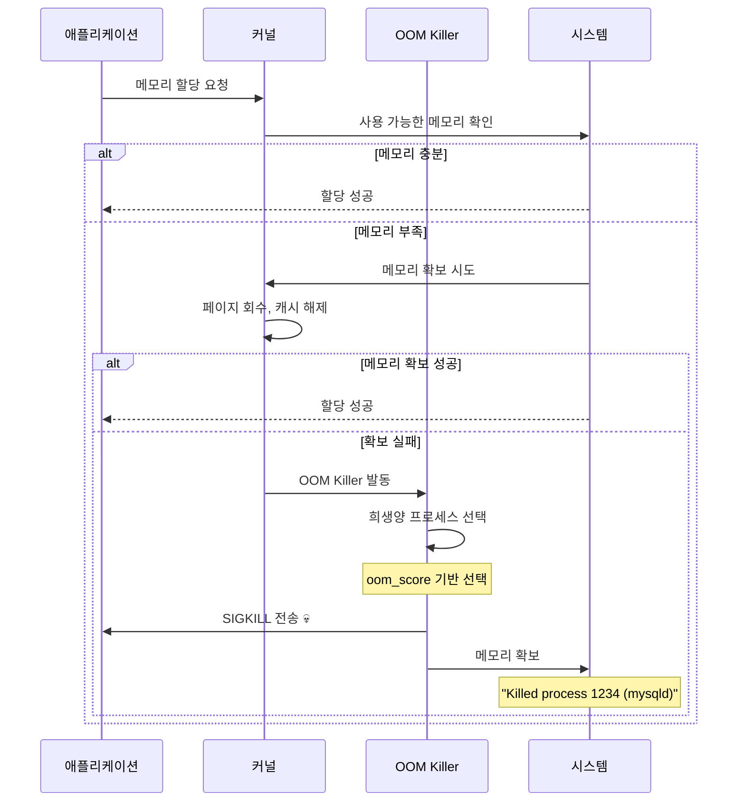
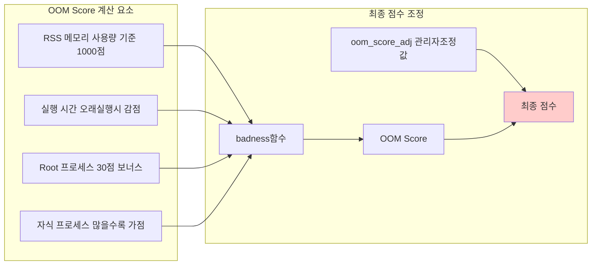

---
tags:
  - Linux커널
  - OOM
  - hands-on
  - intermediate
  - medium-read
  - 메모리관리
  - 시스템디버깅
  - 시스템프로그래밍
  - 프로세스관리
difficulty: INTERMEDIATE
learning_time: "2-3시간"
main_topic: "시스템 프로그래밍"
priority_score: 4
---

# 3-8A: OOM Killer 동작 원리 - "누구를 희생양으로 선택할까?"

## 들어가며: 예고 없는 프로세스 종료

"갑자기 데이터베이스가 죽었는데 로그에는 아무것도 없어요..."

OOM(Out of Memory)는 시스템의 **마지막 방어선**이지만, 예측하기 어렵고 치명적인 결과를 낳을 수 있습니다.



### OOM의 근본 원인들

```mermaid
mindmap
  root((OOM 발생 원인))
    메모리 누수
      애플리케이션 버그
      라이브러리 문제
      가비지 컬렉션 실패
    잘못된 설정
      과도한 버퍼 크기
      부적절한 캐시 설정
      메모리 제한 미설정
    시스템 한계
      하드웨어 제약
      커널 메모리 부족
      단편화 문제
    부하 증가
      트래픽 급증
      대용량 데이터 처리
      동시 접속 증가
```



## OOM Killer 동작 원리

### OOM Score 계산 메커니즘

Linux OOM Killer는 각 프로세스에 점수를 매겨 희생양을 선택합니다:



**OOM Score 확인 방법**:

```bash
# 모든 프로세스의 OOM Score 확인
$ for pid in $(ps -eo pid --no-headers); do
    if [ -f /proc/$pid/oom_score ]; then
        score=$(cat /proc/$pid/oom_score 2>/dev/null || echo "0")
        adj=$(cat /proc/$pid/oom_score_adj 2>/dev/null || echo "0")
        comm=$(cat /proc/$pid/comm 2>/dev/null || echo "unknown")
        echo "$score $adj $pid $comm"
    fi
done | sort -rn | head -10

# 결과 예시:
# 987   0  1234 mysqld        # 높은 점수 = 위험
# 756   0  5678 java
# 543   0  9012 nginx
# 234 -17  1    systemd       # 시스템 프로세스는 보호
```

### 실시간 OOM Score 모니터링

```python
#!/usr/bin/env python3
# oom_score_monitor.py
import os
import time
import psutil
from collections import defaultdict

class OOMScoreMonitor:
    def __init__(self):
        self.previous_scores = {}

    def get_process_oom_info(self, pid):
        try:
            with open(f'/proc/{pid}/oom_score') as f:
                oom_score = int(f.read().strip())

            with open(f'/proc/{pid}/oom_score_adj') as f:
                oom_score_adj = int(f.read().strip())

            proc = psutil.Process(pid)
            return {
                'pid': pid,
                'name': proc.name(),
                'oom_score': oom_score,
                'oom_score_adj': oom_score_adj,
                'memory_mb': proc.memory_info().rss / 1024 / 1024
            }
        except (FileNotFoundError, psutil.NoSuchProcess, ValueError):
            return None

    def get_high_risk_processes(self, threshold=100):
        """OOM 위험이 높은 프로세스 찾기"""
        high_risk = []

        for proc in psutil.process_iter(['pid']):
            try:
                oom_info = self.get_process_oom_info(proc.info['pid'])
                if oom_info and oom_info['oom_score'] > threshold:
                    high_risk.append(oom_info)
            except:
                continue

        return sorted(high_risk, key=lambda x: x['oom_score'], reverse=True)

    def monitor_oom_risk(self, duration=300, interval=10):
        """OOM 위험도 모니터링"""
        print(f"OOM 위험도 모니터링 시작 ({duration}초간, {interval}초 간격)")
        print("=" * 80)

        start_time = time.time()

        while time.time() - start_time < duration:
            print(f", [{time.strftime('%H:%M:%S')}] OOM 위험 프로세스 TOP 10:")
            print(f"{'PID':>6} {'Name':15} {'OOM Score':>10} {'Adj':>5} {'Memory(MB)':>12}")
            print("-" * 65)

            high_risk = self.get_high_risk_processes(threshold=50)

            for i, proc in enumerate(high_risk[:10]):
                # 점수 변화 표시
                change = ""
                if proc['pid'] in self.previous_scores:
                    diff = proc['oom_score'] - self.previous_scores[proc['pid']]
                    if diff > 0:
                        change = f" (+{diff})"
                    elif diff < 0:
                        change = f" ({diff})"

                # 위험도에 따른 경고 표시
                warning = ""
                if proc['oom_score'] > 800:
                    warning = " 🚨"
                elif proc['oom_score'] > 500:
                    warning = " ⚠️ "

                print(f"{proc['pid']:6d} {proc['name']:15s} "
                      f"{proc['oom_score']:10d}{change:8s} "
                      f"{proc['oom_score_adj']:5d} "
                      f"{proc['memory_mb']:11.1f}{warning}")

                self.previous_scores[proc['pid']] = proc['oom_score']

            # 시스템 메모리 상태
            mem = psutil.virtual_memory()
            print(f", 시스템 메모리: {mem.percent:.1f}% 사용 "
                  f"(사용 가능: {mem.available / 1024 / 1024 / 1024:.1f}GB)")

            if mem.percent > 90:
                print("🚨 메모리 부족 위험!")
            elif mem.percent > 80:
                print("⚠️  메모리 사용량 주의")

            time.sleep(interval)

if __name__ == "__main__":
    monitor = OOMScoreMonitor()
    try:
        monitor.monitor_oom_risk(duration=600, interval=15)  # 10분간 모니터링
    except KeyboardInterrupt:
        print(", 모니터링 중단됨")
```

### OOM Score 조정 전략

중요한 프로세스를 OOM으로부터 보호하거나, 우선적으로 종료되도록 설정할 수 있습니다:

```bash
#!/bin/bash
# oom_protection.sh - OOM으로부터 중요한 프로세스 보호 및 위험 프로세스 우선 순위 설정 도구

echo "=== OOM 보호 설정 도구 ==="

# 중요한 시스템 프로세스 보호 - oom_score_adj를 음수로 설정하여 OOM Killer로부터 보호
protect_critical_processes() {
    echo "중요한 프로세스 보호 설정 중..."

    # SSH 데몬 보호 - 시스템 접근을 위해 가장 중요 (-17: 매우 높은 보호 수준)
    for pid in $(pgrep sshd); do
        echo -17 > /proc/$pid/oom_score_adj
        echo "sshd (PID $pid) 보호 설정 완료 (oom_score_adj: -17)"
    done

    # 데이터베이스 보호 - 데이터 무결성을 위해 높은 보호 수준 (-10)
    for service in mysqld postgres mongod; do
        for pid in $(pgrep $service); do
            echo -10 > /proc/$pid/oom_score_adj
            echo "$service (PID $pid) 보호 설정 완료 (oom_score_adj: -10)"
        done
    done

    # 웹 서버 보호 - 서비스 가용성을 위해 중간 보호 수준 (-5)
    for service in nginx apache2 httpd; do
        for pid in $(pgrep $service); do
            echo -5 > /proc/$pid/oom_score_adj
            echo "$service (PID $pid) 보호 설정 완료 (oom_score_adj: -5)"
        done
    done
}

# 메모리 집약적 프로세스를 우선 종료 대상으로 설정
deprioritize_memory_hogs() {
    echo "메모리 집약적 프로세스 우선 종료 설정..."

    # 브라우저 프로세스 - 메모리를 많이 사용하는 비필수 프로세스 (+10)
    for service in chrome firefox; do
        for pid in $(pgrep $service); do
            echo 10 > /proc/$pid/oom_score_adj
            echo "$service (PID $pid) 우선 종료 설정 완료 (oom_score_adj: +10)"
        done
    done

    # 개발 도구 - 메모리 사용량이 높은 개발 환경 도구들 (+5)
    for service in code idea pycharm; do
        for pid in $(pgrep $service); do
            echo 5 > /proc/$pid/oom_score_adj
            echo "$service (PID $pid) 우선 종료 설정 완료 (oom_score_adj: +5)"
        done
    done
}

# systemd 서비스에 대한 OOM 정책 설정
configure_systemd_oom() {
    echo "systemd 서비스 OOM 설정..."

    # systemd override 디렉토리 생성
    mkdir -p /etc/systemd/system/mysql.service.d/

    # MySQL 서비스 OOM 설정 예시
    # OOMScoreAdjust: OOM Score 조정값
    # OOMPolicy: OOM 발생시 정책 (continue: 서비스 유지, stop: 서비스 중단)
    cat > /etc/systemd/system/mysql.service.d/oom.conf << 'EOF'
[Service]
OOMScoreAdjust=-10
OOMPolicy=continue
EOF

    echo "systemd OOM 설정 완료 (서비스 재시작 필요)"
    echo "적용 명령어: systemctl daemon-reload && systemctl restart mysql"
}

# 메뉴
echo "1) 중요 프로세스 보호"
echo "2) 메모리 집약적 프로세스 우선 종료"
echo "3) systemd 서비스 OOM 설정"
echo "4) 전체 적용"
echo "5) 종료"

read -p "선택하세요 (1-5): " choice

case $choice in
    1) protect_critical_processes ;;
    2) deprioritize_memory_hogs ;;
    3) configure_systemd_oom ;;
    4)
        protect_critical_processes
        deprioritize_memory_hogs
        configure_systemd_oom
        ;;
    5) echo "종료합니다." ;;
    *) echo "잘못된 선택입니다." ;;
esac
```

## 핵심 요점

### 1. OOM Score 이해하기

Linux OOM Killer는 메모리 사용량, 실행 시간, 프로세스 중요도를 종합하여 희생양을 선택합니다.

### 2. 프로세스 보호 설정

중요한 시스템 프로세스는 oom_score_adj를 음수로 설정하여 보호할 수 있습니다.

### 3. 실시간 모니터링

OOM Score를 실시간으로 모니터링하여 위험한 프로세스를 사전에 식별할 수 있습니다.

---

**다음**: [03-44-dmesg-log-analysis.md](./03-44-dmesg-log-analysis.md)에서 OOM 발생 후 로그 분석 방법을 학습합니다.

## 📚 관련 문서

### 📖 현재 문서 정보

- **난이도**: INTERMEDIATE
- **주제**: 시스템 프로그래밍
- **예상 시간**: 2-3시간

### 🎯 학습 경로

- [📚 INTERMEDIATE 레벨 전체 보기](../learning-paths/intermediate/)
- [🏠 메인 학습 경로](../learning-paths/)
- [📋 전체 가이드 목록](../README.md)

### 📂 같은 챕터 (chapter-03-memory-system)

- [Chapter 3-1: 주소 변환은 어떻게 동작하는가](./03-10-address-translation.md)
- [Chapter 3-2: TLB와 캐싱은 어떻게 동작하는가](./03-11-tlb-caching.md)
- [Chapter 3-3: 페이지 폴트와 메모리 관리 개요](./03-12-page-fault.md)
- [Chapter 3-3A: 페이지 폴트 종류와 처리 메커니즘](./03-13-page-fault-types-handling.md)
- [Chapter 3-3B: Copy-on-Write (CoW) - fork()가 빠른 이유](./03-14-copy-on-write.md)

### 🏷️ 관련 키워드

`OOM`, `메모리관리`, `프로세스관리`, `시스템디버깅`, `Linux커널`

### ⏭️ 다음 단계 가이드

- 실무 적용을 염두에 두고 프로젝트에 적용해보세요
- 관련 도구들을 직접 사용해보는 것이 중요합니다
