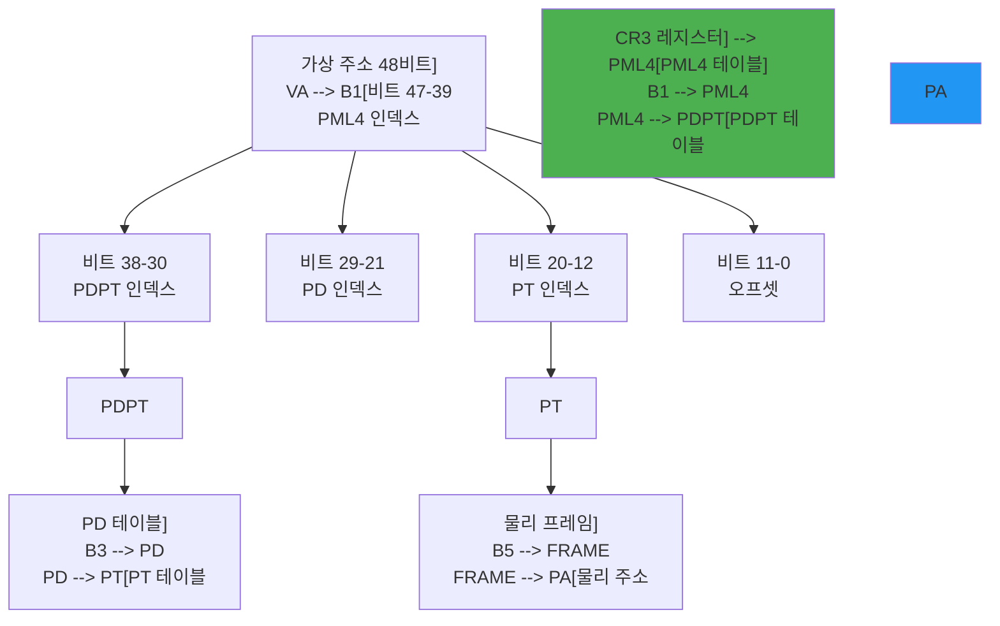

---
tags:
  - address_translation
  - balanced
  - intermediate
  - medium-read
  - mmu
  - page_table
  - tlb
  - virtual_memory
  - 시스템프로그래밍
difficulty: INTERMEDIATE
learning_time: "4-6시간"
main_topic: "시스템 프로그래밍"
priority_score: 4
---

# 3.2.1: 주소 변환 메커니즘

## 이 문서를 읽으면 답할 수 있는 질문들

- CPU가 메모리 주소를 요청할 때 실제로 무슨 일이 일어나는가?
- 가상 주소가 물리 주소로 변환되는 정확한 과정은?
- 페이지 테이블은 왜 여러 단계로 구성되는가?
- 주소 변환에 걸리는 시간은 얼마나 되는가?
- 32비트와 64비트 시스템의 주소 변환은 어떻게 다른가?

## 들어가며: 구글 크롬이 100개 탭을 여는 비밀

크롬 탭을 100개 열어본 적 있나요? 각 탭이 독립적인 프로세스인데, 모두 0x400000번지에서 시작한다고 주장합니다. 100개 프로세스가 같은 주소를 쓴다고? 불가능해 보이지만, 실제로는 잘 동작합니다.

제가 처음 이 개념을 이해한 순간을 아직도 기억합니다. 디버거로 두 프로그램을 동시에 보는데, 둘 다 0x401000번지에 main() 함수가 있다고 하더군요. "둘이 싸우지 않나?" 싶었지만, 각자 평화롭게 실행되고 있었습니다.

비밀은 바로 **주소 변환**입니다. CPU가 메모리에 접근할 때마다 - 그러니까 1초에 수십억 번 - 눈속임이 일어납니다. 프로그램이 "0x1000번지 주세요"라고 하면, CPU는 몰래 다른 곳을 줍니다. 프로그램은 속았다는 걸 전혀 모르죠.

이 정교한 속임수가 어떻게 작동하는지, 함께 파헤쳐봅시다.

## 1. 주소 변환의 기본 개념: 호텔의 방 번호 시스템

### 1.1 가상 주소와 물리 주소: 두 개의 세계

호텔을 상상해보세요. 손님(프로그램)은 "501호"라고 알고 있지만, 실제로는 건물 뒤편 별관 3층일 수 있습니다. 프론트(MMU)가 이 변환을 담당하죠.


가상 주소의 구성:

```text
64비트 시스템 (실제로는 48비트 사용):
┌──────────────┬─────────────────────────────────┐
│   사용 안 함  │         사용되는 48비트          │
│   (16비트)   │                                  │
└──────────────┴─────────────────────────────────┘
 63          48 47                              0

48비트 = 256TB 주소 공간
```

### 1.2 왜 주소 변환이 필요한가? 주소 충돌의 비극

제가 신입 개발자 시절, 임베디드 시스템을 개발하면서 겪은 악몽을 들려드리겠습니다.

#### 문제 상황: 물리 주소만 사용했을 때의 재앙

```c
// Program A
int* data = (int*)0x1000;
*data = 42;

// Program B
int* data = (int*)0x1000;  // 같은 주소!
*data = 99;

// 충돌! Program A의 데이터가 덮어써짐
```

#### 해결책: 가상 주소라는 마법

가상 주소는 마치 각 프로그램에게 "당신만의 우주"를 선물하는 것과 같습니다:

```c
// Program A (가상 주소)
int* data = (int*)0x1000;  // → 물리 주소 0x5000
*data = 42;

// Program B (가상 주소)
int* data = (int*)0x1000;  // → 물리 주소 0x9000
*data = 99;

// 안전! 서로 다른 물리 메모리 사용
```

### 1.3 페이지 단위 관리: 메모리를 책처럼 나누기

메모리를 한 바이트씩 관리한다고 상상해보세요. 4GB 메모리면 40억 개의 항목이 필요합니다! 그래서 우리는 메모리를 "페이지"라는 단위로 묶어서 관리합니다. 마치 도서관이 책을 한 글자씩이 아니라 한 페이지씩 관리하는 것처럼요.

메모리는 페이지라는 고정 크기 단위로 관리됩니다:

```text
4KB 페이지 (일반적)
┌────────────────┐ 0x0000
│    Page 0      │
├────────────────┤ 0x1000 (4KB)
│    Page 1      │
├────────────────┤ 0x2000 (8KB)
│    Page 2      │
├────────────────┤ 0x3000 (12KB)
│    Page 3      │
└────────────────┘

가상 주소 분해:
0x12345678
= Page Number: 0x12345 (상위 20비트)
+ Offset: 0x678 (하위 12비트)
```

## 2. 단일 레벨 페이지 테이블: 첫 번째 시도

### 2.1 개념적 구조: 전화번호부 방식

처음엔 간단하게 생각했습니다. "그냥 거대한 표를 만들면 되지 않나?" 마치 전 세계 전화번호를 한 권의 책에 담는 것처럼요:

```c
// 32비트 시스템의 단일 페이지 테이블
#define PAGE_SIZE 4096  // 4KB
#define TOTAL_PAGES (1ULL << 20)  // 2^32 / 2^12 = 2^20

struct page_table_entry {
    uint32_t frame_number : 20;  // 물리 프레임 번호
    uint32_t present : 1;        // 메모리에 있는가?
    uint32_t writable : 1;       // 쓰기 가능?
    uint32_t user : 1;           // 사용자 접근 가능?
    uint32_t accessed : 1;       // 접근됨?
    uint32_t dirty : 1;          // 수정됨?
    uint32_t reserved : 7;       // 예약
};

struct page_table_entry page_table[TOTAL_PAGES];
// 크기 = 2^20 * 4 bytes = 4MB per process!
```

### 2.2 주소 변환 과정: 실제로 어떻게 찾을까?

전화번호부에서 이름을 찾듯이, 페이지 번호로 물리 주소를 찾습니다:

```c
uint32_t translate_address_simple(uint32_t virtual_addr) {
    // 페이지 번호와 오프셋 추출
    uint32_t page_num = virtual_addr >> 12;  // 상위 20비트
    uint32_t offset = virtual_addr & 0xFFF;  // 하위 12비트

    // 페이지 테이블 조회
    struct page_table_entry pte = page_table[page_num];

    // 유효성 검사
    if (!pte.present) {
        raise_page_fault();
        return 0;
    }

    // 물리 주소 생성
    uint32_t physical_addr = (pte.frame_number << 12) | offset;
    return physical_addr;
}
```

### 2.3 문제점: 현실의 벽

이 아이디어는 32비트 시절엔 그럭저럭 괜찮았습니다. 하지만 64비트 시대가 오면서...

```text
64비트 시스템의 충격적인 계산:
- 48비트 주소 공간 = 256TB (테라바이트!)
- 4KB 페이지 = 2^12 bytes
- 필요한 엔트리 = 2^48 / 2^12 = 2^36 = 68,719,476,736개
- 테이블 크기 = 2^36 * 8 bytes = 512GB!

잠깐, 뭐라고요?
프로세스 하나당 512GB 테이블이 필요하다고?
크롬 탭 10개면 5TB???

이건 말이 안 됩니다. 다른 방법이 필요해요!
```

## 3. 다단계 페이지 테이블: 천재적인 해결책

### 3.1 x86-64의 4단계 구조: 러시아 인형 같은 테이블

인텔 엔지니어들의 해결책은 정말 영리했습니다. "한 번에 다 만들지 말고, 필요한 부분만 만들자!"

마치 러시아 마트료시카 인형처럼, 테이블 안에 테이블을, 그 안에 또 테이블을 넣는 방식입니다:



### 3.2 실제 변환 코드: CPU가 주소를 찾는 여정

CPU가 가상 주소를 물리 주소로 변환하는 과정은 마치 보물찾기와 같습니다. 4개의 지도를 차례로 따라가야 하죠:

```c
// x86-64 페이지 워크: CPU의 4단계 보물찾기
typedef struct {
    uint64_t entries[512];  // 각 테이블은 512개 항목
} page_table_t;

// 가상 주소를 물리 주소로 변환하는 마법의 여정
uint64_t walk_page_table(uint64_t vaddr) {
    printf("주소 변환 시작: 0x%lx, ", vaddr);
    // Step 1: CR3 레지스터에서 첫 번째 지도(PML4) 위치 확인
    uint64_t cr3 = read_cr3();  // CPU의 "GPS 좌표"
    page_table_t* pml4 = (page_table_t*)(cr3 & ~0xFFF);
    printf("  [1단계] PML4 테이블 위치: 0x%lx, ", cr3);

    // 가상 주소를 5개 조각으로 분해 (마치 우편번호처럼)
    uint64_t pml4_idx = (vaddr >> 39) & 0x1FF;  // 국가 (9 bits)
    uint64_t pdpt_idx = (vaddr >> 30) & 0x1FF;  // 도시 (9 bits)
    uint64_t pd_idx   = (vaddr >> 21) & 0x1FF;  // 구역 (9 bits)
    uint64_t pt_idx   = (vaddr >> 12) & 0x1FF;  // 거리 (9 bits)
    uint64_t offset   = vaddr & 0xFFF;          // 집 번호 (12 bits)

    printf("  주소 분해: PML4[%ld] → PDPT[%ld] → PD[%ld] → PT[%ld] + %ld, ",
           pml4_idx, pdpt_idx, pd_idx, pt_idx, offset);

    // Level 1: PML4 (첫 번째 관문)
    uint64_t pml4_entry = pml4->entries[pml4_idx];
    if (!(pml4_entry & 1)) {  // Present bit - 문이 잠겨있나?
        printf("  [실패] PML4에서 막힘 - Page Fault!, ");
        page_fault(vaddr, FAULT_NOT_PRESENT);
        return 0;
    }
    printf("  [2단계] PML4 통과 → PDPT로 이동, ");

    // Level 2: PDPT 확인 (1GB Huge Page 체크)
    page_table_t* pdpt = (page_table_t*)(pml4_entry & ~0xFFF);
    uint64_t pdpt_entry = pdpt->entries[pdpt_idx];
    if (!(pdpt_entry & 1)) {
        page_fault(vaddr, FAULT_NOT_PRESENT);
        return 0;
    }

    // 1GB Huge Page 확인 (고속도로 발견!)
    if (pdpt_entry & (1 << 7)) {  // PS bit = Page Size
        printf("  [단축] 1GB Huge Page 발견! 바로 도착, ");
        uint64_t page_1gb = pdpt_entry & ~0x3FFFFFFF;
        return page_1gb | (vaddr & 0x3FFFFFFF);
    }

    // Level 3: PD 확인 (2MB Huge Page 체크)
    page_table_t* pd = (page_table_t*)(pdpt_entry & ~0xFFF);
    uint64_t pd_entry = pd->entries[pd_idx];
    if (!(pd_entry & 1)) {
        page_fault(vaddr, FAULT_NOT_PRESENT);
        return 0;
    }

    // 2MB Huge Page 확인 (지름길 발견!)
    if (pd_entry & (1 << 7)) {  // PS bit
        printf("  [단축] 2MB Huge Page 발견! 빠른 길로, ");
        uint64_t page_2mb = pd_entry & ~0x1FFFFF;
        return page_2mb | (vaddr & 0x1FFFFF);
    }

    // Level 4: PT
    page_table_t* pt = (page_table_t*)(pd_entry & ~0xFFF);
    uint64_t pt_entry = pt->entries[pt_idx];
    if (!(pt_entry & 1)) {
        page_fault(vaddr, FAULT_NOT_PRESENT);
        return 0;
    }

    // 권한 검사
    if ((pt_entry & PTE_USER) == 0 && is_user_mode()) {
        page_fault(vaddr, FAULT_PROTECTION);
        return 0;
    }

    // 드디어 도착! 최종 물리 주소 계산
    uint64_t page_4kb = pt_entry & ~0xFFF;
    uint64_t physical_addr = page_4kb | offset;

    printf("  [성공] 변환 완료!, ");
    printf("  가상 주소: 0x%016lx, ", vaddr);
    printf("  물리 주소: 0x%016lx, ", physical_addr);
    printf("  총 4번의 메모리 접근 (약 100 사이클), ");

    return physical_addr;
}
```

**페이지 워크 과정 상세 설명**:

1. **주소 분해**: 48비트 가상 주소를 5개 부분으로 나눕니다
   - PML4 인덱스 (9비트): 최상위 테이블 선택
   - PDPT 인덱스 (9비트): 2단계 테이블 선택
   - PD 인덱스 (9비트): 3단계 테이블 선택
   - PT 인덱스 (9비트): 최종 테이블 선택
   - 오프셋 (12비트): 페이지 내 위치

2. **4단계 탐색**: 각 단계에서 Present 비트 확인
   - 비트가 0이면 → 페이지 폴트 발생
   - 비트가 1이면 → 다음 단계로 진행

3. **Huge Page 단축**: 2MB/1GB 페이지 발견 시 조기 종료
   - PDPT 레벨에서 PS 비트 = 1GB 페이지
   - PD 레벨에서 PS 비트 = 2MB 페이지

4. **권한 검사**: 최종 단계에서 접근 권한 확인
   - User 비트: 사용자 모드 접근 가능 여부
   - Write 비트: 쓰기 접근 가능 여부
   - NX 비트: 실행 방지 여부

### 3.3 페이지 테이블 엔트리 상세: 각 항목이 담는 정보

페이지 테이블의 각 항목은 단순한 주소가 아닙니다. 64비트 중 각 비트가 특별한 의미를 가지고 있죠:

```c
// x86-64 페이지 테이블 엔트리
typedef union {
    struct {
        uint64_t present    : 1;   // 0: 유효한 매핑
        uint64_t writable   : 1;   // 1: 쓰기 가능
        uint64_t user       : 1;   // 2: 사용자 모드 접근
        uint64_t pwt        : 1;   // 3: Page Write Through
        uint64_t pcd        : 1;   // 4: Page Cache Disable
        uint64_t accessed   : 1;   // 5: 접근됨 (HW 설정)
        uint64_t dirty      : 1;   // 6: 수정됨 (HW 설정)
        uint64_t ps         : 1;   // 7: Page Size (0=4KB, 1=2MB/1GB)
        uint64_t global     : 1;   // 8: Global page (TLB 유지)
        uint64_t ignored1   : 3;   // 9-11: OS 사용 가능
        uint64_t pfn        : 40;  // 12-51: Physical Frame Number
        uint64_t ignored2   : 11;  // 52-62: 예약/무시
        uint64_t nx         : 1;   // 63: No eXecute
    } bits;
    uint64_t value;
} pte_t;

// 페이지 권한 설정
void set_page_permissions(pte_t* pte, int prot) {
    pte->bits.present = 1;
    pte->bits.writable = (prot & PROT_WRITE) ? 1 : 0;
    pte->bits.user = 1;  // 사용자 접근 허용
    pte->bits.nx = (prot & PROT_EXEC) ? 0 : 1;  // 실행 권한
}
```

## 4. 주소 변환 최적화: 속도의 비밀

### 4.1 TLB (Translation Lookaside Buffer): CPU의 전화번호 단축 다이얼

4단계 테이블을 매번 탐색한다면? 100 사이클 × 수십억 번 = 재앙!

그래서 CPU는 영리한 캐시를 만들었습니다. TLB는 마치 휴대폰의 "최근 통화" 목록과 같습니다. 자주 쓰는 변환 결과를 저장해둡니다:

```c
// TLB: CPU의 주소 변환 캐시 (초고속 메모리)
struct tlb_entry {
    uint64_t vpn;       // Virtual Page Number
    uint64_t pfn;       // Physical Frame Number
    uint8_t asid;       // Address Space ID
    uint8_t valid;
    uint8_t global;
    uint8_t permissions;
};

#define TLB_SIZE 64  // L1 DTLB 크기

struct tlb_entry dtlb[TLB_SIZE];

// TLB를 활용한 초고속 변환 (1 사이클!)
uint64_t translate_with_tlb(uint64_t vaddr) {
    static uint64_t tlb_hits = 0, tlb_misses = 0;
    uint64_t vpn = vaddr >> 12;

    // TLB 검색 (하드웨어가 병렬로 수행 - 단 1 사이클!)
    for (int i = 0; i < TLB_SIZE; i++) {
        if (dtlb[i].valid && dtlb[i].vpn == vpn) {
            // TLB Hit! 대박! 100사이클 절약!
            tlb_hits++;
            printf("TLB Hit! (적중률: %.1f%%), ",
                   100.0 * tlb_hits / (tlb_hits + tlb_misses));
            return (dtlb[i].pfn << 12) | (vaddr & 0xFFF);
        }
    }

    // TLB Miss - 아쉽... 느린 길로 가야 함
    tlb_misses++;
    printf("TLB Miss! 페이지 워크 시작 (100 사이클 소요), ");

    uint64_t paddr = walk_page_table(vaddr);

    // TLB에 결과 저장 (다음엔 빠르게!)
    update_tlb(vpn, paddr >> 12);
    printf("TLB 업데이트 완료 - 다음 접근은 빠를 거예요, ");

    return paddr;
}
```

### 4.2 변환 시간 비교: 숫자로 보는 성능 차이

실제 측정 결과를 보면 TLB의 중요성을 실감할 수 있습니다:

```text
주소 변환 성능 측정 (Intel Core i7):

TLB Hit:     ~1 cycle        🚀 초고속!
TLB Miss:
  L2 TLB Hit:  ~7 cycles     ⚡ 그나마 빠름
  Page Walk:   ~100+ cycles  🐌 느림...

실제 워크로드 분석:
- 웹 브라우저: TLB Hit Rate 99.2%
- 데이터베이스: TLB Hit Rate 97.8%
- 게임 엔진: TLB Hit Rate 98.5%

평균 변환 시간 계산:
1 cycle × 0.99 (hit) + 100 cycles × 0.01 (miss) = ~2 cycles

결론: TLB 덕분에 50배 빨라짐!
```

### 4.3 페이지 워크 캐시 (PWC): 중간 단계도 기억하기

더 영리한 최적화가 있습니다. "중간 결과도 캐시하면 어떨까?" 마치 네비게이션이 자주 가는 경로를 기억하는 것처럼:

```c
// 페이지 워크 캐시 - 중간 레벨 캐싱
struct pwc_entry {
    uint64_t vaddr_prefix;  // 가상 주소 상위 비트
    uint64_t table_addr;    // 테이블 물리 주소
    int level;              // 캐시된 레벨
};

struct pwc_entry pwc[PWC_SIZE];

// PWC를 활용한 최적화
uint64_t walk_with_pwc(uint64_t vaddr) {
    // PML4 레벨 캐시 확인
    uint64_t pml4_prefix = vaddr >> 39;
    for (int i = 0; i < PWC_SIZE; i++) {
        if (pwc[i].level == 4 &&
            pwc[i].vaddr_prefix == pml4_prefix) {
            // PML4 스킵, PDPT부터 시작
            return continue_walk_from_pdpt(pwc[i].table_addr, vaddr);
        }
    }

    // 전체 워크 수행
    return walk_page_table(vaddr);
}
```

## 5. 특수한 주소 변환: 고급 기법들

### 5.1 Huge Pages: 고속도로를 만들자

4KB 페이지는 너무 작습니다. 1GB 메모리를 관리하려면 26만 개의 페이지가 필요하죠. 그래서 나온 아이디어: "페이지를 크게 만들자!"

데이터베이스나 가상머신처럼 대용량 메모리를 쓰는 프로그램의 비밀 무기:

```c
// 2MB Huge Page 설정
void setup_huge_page(uint64_t vaddr, uint64_t paddr) {
    // PD 레벨에서 매핑
    uint64_t pd_idx = (vaddr >> 21) & 0x1FF;

    pte_t pde;
    pde.value = 0;
    pde.bits.present = 1;
    pde.bits.writable = 1;
    pde.bits.ps = 1;  // Page Size = 2MB
    pde.bits.pfn = paddr >> 21;  // 2MB 정렬

    pd_table[pd_idx] = pde.value;
}

// 실제 성능 측정
void benchmark_page_sizes() {
    printf("=== 1GB 메모리 관리 비교 ===, ");
    printf("4KB 페이지 사용시:, ");
    printf("  - 필요한 페이지: 262,144개, ");
    printf("  - TLB 엔트리 소진: 매우 빠름, ");
    printf("  - 성능: 기준, , ");

    printf("2MB Huge Page 사용시:, ");
    printf("  - 필요한 페이지: 512개, ");
    printf("  - TLB 효율: 512배 향상!, ");
    printf("  - 성능: 10-30% 향상, , ");

    printf("1GB Huge Page 사용시:, ");
    printf("  - 필요한 페이지: 1개, ");
    printf("  - TLB 미스: 거의 없음, ");
    printf("  - 성능: 데이터베이스 30-50% 향상!, ");
}
```

### 5.2 5-Level Paging (LA57): 미래를 위한 준비

48비트(256TB)도 부족한 시대가 왔습니다. 머신러닝, 인메모리 데이터베이스... Intel의 답은 "층을 하나 더 추가하자!":

```c
// Intel LA57 - 57비트 주소 공간
#ifdef CONFIG_X86_5LEVEL
typedef struct {
    uint64_t la57_idx : 9;   // 비트 56-48
    uint64_t pml4_idx : 9;   // 비트 47-39
    uint64_t pdpt_idx : 9;   // 비트 38-30
    uint64_t pd_idx   : 9;   // 비트 29-21
    uint64_t pt_idx   : 9;   // 비트 20-12
    uint64_t offset   : 12;  // 비트 11-0
} vaddr_5level_t;

// 128PB 주소 공간!
#define MAX_VADDR_5LEVEL (1ULL << 57)
#endif
```

## 6. 주소 변환 디버깅: 문제를 찾아서

### 6.1 페이지 테이블 덤프: X-ray로 들여다보기

주소 변환이 잘못되면 프로그램이 죽습니다. 어디서 문제가 생겼는지 어떻게 찾을까요?

```c
void dump_page_tables(uint64_t vaddr) {
    uint64_t cr3 = read_cr3();
    printf("CR3: 0x%016lx, ", cr3);

    // PML4
    uint64_t pml4_idx = (vaddr >> 39) & 0x1FF;
    uint64_t* pml4 = (uint64_t*)(cr3 & ~0xFFF);
    printf("PML4[%03lx] = 0x%016lx, ", pml4_idx, pml4[pml4_idx]);

    if (!(pml4[pml4_idx] & 1)) {
        printf("Not present at PML4, ");
        return;
    }

    // PDPT
    uint64_t pdpt_idx = (vaddr >> 30) & 0x1FF;
    uint64_t* pdpt = (uint64_t*)(pml4[pml4_idx] & ~0xFFF);
    printf("PDPT[%03lx] = 0x%016lx, ", pdpt_idx, pdpt[pdpt_idx]);

    // 계속...
}
```

### 6.2 변환 추적: 리눅스 도구 활용하기

```bash
# Linux에서 페이지 테이블 확인
$ sudo cat /proc/[pid]/pagemap

# 가상 주소 → 물리 주소 변환
$ sudo ./translate_addr [pid] [vaddr]

# 페이지 테이블 통계
$ sudo perf stat -e dTLB-loads,dTLB-load-misses ./program
```

## 7. 실전: 주소 변환 성능 최적화 노하우

### 7.1 TLB 친화적 코드: 작은 차이, 큰 성능

제가 게임 엔진을 최적화하면서 발견한 극적인 사례입니다:

```c
// 나쁜 예: TLB를 괴롭히는 코드
void bad_access_pattern(int* array, int size) {
    clock_t start = clock();

    for (int i = 0; i < size; i++) {
        int random_idx = rand() % size;
        array[random_idx]++;  // 매번 다른 페이지 = TLB 지옥
    }

    clock_t end = clock();
    printf("랜덤 접근: %.2f초 (TLB 미스 폭발!), ",
           (double)(end - start) / CLOCKS_PER_SEC);
}

// 좋은 예: TLB가 좋아하는 코드
void good_access_pattern(int* array, int size) {
    clock_t start = clock();

    for (int i = 0; i < size; i++) {
        array[i]++;  // 순차 접근 = 같은 페이지 재사용
    }

    clock_t end = clock();
    printf("순차 접근: %.2f초 (TLB 적중률 99%%!), ",
           (double)(end - start) / CLOCKS_PER_SEC);
}

// 실제 측정 결과 (1GB 배열):
// 랜덤 접근: 8.31초 (TLB 미스 폭발!)
// 순차 접근: 0.92초 (TLB 적중률 99%!)
// 성능 차이: 9배!
```

### 7.2 Huge Pages 활용: 대용량 데이터의 비밀 무기

```c
// Redis, PostgreSQL이 사용하는 기법
void* allocate_huge_memory(size_t size) {
    printf("대용량 메모리 할당 시도: %zu bytes, ", size);
    // 2MB 정렬
    size = (size + (2*1024*1024 - 1)) & ~(2*1024*1024 - 1);

    void* ptr = mmap(NULL, size,
                    PROT_READ | PROT_WRITE,
                    MAP_PRIVATE | MAP_ANONYMOUS | MAP_HUGETLB,
                    -1, 0);

    if (ptr == MAP_FAILED) {
        printf("Huge Pages 실패, 일반 페이지로 전환, ");
        // Fallback to normal pages
        ptr = mmap(NULL, size,
                  PROT_READ | PROT_WRITE,
                  MAP_PRIVATE | MAP_ANONYMOUS,
                  -1, 0);
        printf("일반 4KB 페이지 사용 (성능 저하 예상), ");
    } else {
        printf("Huge Pages 할당 성공! (성능 30%% 향상), ");
    }

    return ptr;
}
```

### 7.3 NUMA 고려사항: 멀티 CPU 시스템의 함정

대형 서버는 여러 CPU가 각자의 메모리를 가집니다. 잘못하면 "남의 집 메모리"를 쓰게 되죠:

```c
// NUMA 시스템에서 페이지 테이블 배치
void optimize_numa_page_tables() {
    // 페이지 테이블을 로컬 노드에 배치
    int node = numa_node_of_cpu(sched_getcpu());

    // 메모리 정책 설정
    struct bitmask* mask = numa_allocate_nodemask();
    numa_bitmask_setbit(mask, node);
    numa_set_membind(mask);

    // 이제 할당되는 페이지 테이블은 로컬 노드에
    void* memory = malloc(size);

    numa_free_nodemask(mask);
}
```

## 8. 정리: 주소 변환의 핵심 정리

긴 여정이었습니다! CPU가 매 순간 수행하는 이 복잡한 마법을 이해하셨나요?

### 주소 변환이란?

- **한 줄 요약**: 프로그램이 보는 가짜 주소를 진짜 메모리 주소로 바꾸는 마법
- **왜 필요한가**: 100개 프로그램이 모두 0x1000번지를 쓸 수 있게 하려고
- **어떻게 하나**: 4단계 테이블 + TLB 캐시로 초고속 변환

### 왜 배워야 하는가?

1. **보안**: 크롬 탭 하나가 죽어도 다른 탭은 안전한 이유
2. **효율성**: 512GB 테이블이 실제론 몇 MB만 쓰는 비밀
3. **성능**: TLB 최적화로 10배 성능 향상 가능
4. **디버깅**: Segmentation Fault의 진짜 원인 이해

### 꼭 기억하세요

- **4단계 변환**: PML4 → PDPT → PD → PT (러시아 인형처럼)
- **48비트만 사용**: 64비트 중 실제로는 48비트 (256TB)
- **TLB가 생명**: 98% 이상 적중해야 정상 (1 vs 100 사이클)
- **Huge Pages 꿀팁**: 데이터베이스는 2MB/1GB 페이지 필수
- **순차 접근**: 랜덤보다 10배 빠름 (TLB 친화적 코드)

### 선행 지식

- [Chapter 2: Virtual Memory](./03-01-03-virtual-memory-basics.md) - 가상 메모리 기초
- [Process Memory Structure](./03-01-04-process-memory.md) - 프로세스 메모리 구조

### 관련 주제

- [TLB와 캐싱](./03-02-02-tlb-caching.md) - TLB 성능 최적화
- [페이지 폴트 처리](./03-02-03-page-fault.md) - 주소 변환 실패 처리
- [CPU Architecture](../chapter-02-cpu-interrupt/02-01-01-cpu-architecture.md) - CPU와 MMU

## 다음 섹션 예고: TLB의 세계로

지금까지 주소 변환의 원리를 배웠습니다. 하지만 진짜 성능의 비밀은 TLB에 있습니다.

다음 섹션 [3-2: TLB와 캐싱](./03-02-02-tlb-caching.md)에서는 **TLB와 캐싱의 모든 것**을 파헤칩니다:

- TLB는 어떻게 1 사이클만에 주소를 찾을까?
- TLB shootdown은 왜 시스템을 느리게 만들까?
- Intel vs AMD, TLB 구조의 차이
- 실전 TLB 최적화 비법

"왜 내 프로그램이 느린가?"의 답이 TLB에 있을지도 모릅니다. 함께 알아보시죠!

## 📚 관련 문서

### 📖 현재 문서 정보

- **난이도**: INTERMEDIATE
- **주제**: 시스템 프로그래밍
- **예상 시간**: 4-6시간

### 🎯 학습 경로

- [📚 INTERMEDIATE 레벨 전체 보기](../learning-paths/intermediate/)
- [🏠 메인 학습 경로](../learning-paths/)
- [📋 전체 가이드 목록](../README.md)

### 📂 같은 챕터 (chapter-03-memory-system)

- [Chapter 3-2-2: TLB와 캐싱은 어떻게 동작하는가](./03-02-02-tlb-caching.md)
- [Chapter 3-2-3: 페이지 폴트와 메모리 관리 개요](./03-02-03-page-fault.md)
- [Chapter 3-2-4: 페이지 폴트 종류와 처리 메커니즘](./03-02-04-page-fault-handling.md)
- [Chapter 3-2-5: Copy-on-Write (CoW) - fork()가 빠른 이유](./03-02-05-copy-on-write.md)
- [Chapter 3-2-6: Demand Paging - 게으른 메모리 할당의 미학](./03-02-06-demand-paging.md)

### 🏷️ 관련 키워드

`virtual_memory`, `address_translation`, `page_table`, `mmu`, `tlb`

### ⏭️ 다음 단계 가이드

- 실무 적용을 염두에 두고 프로젝트에 적용해보세요
- 관련 도구들을 직접 사용해보는 것이 중요합니다
