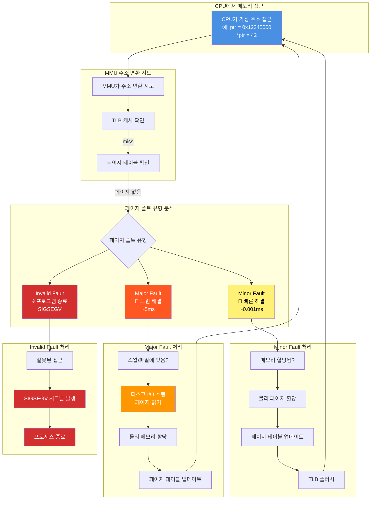
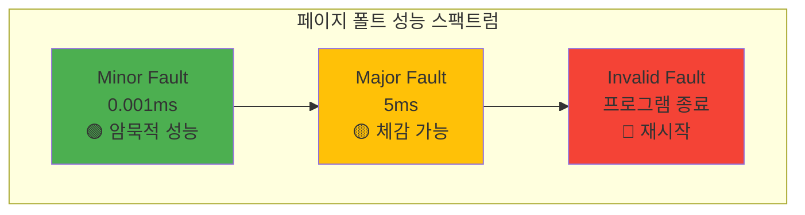
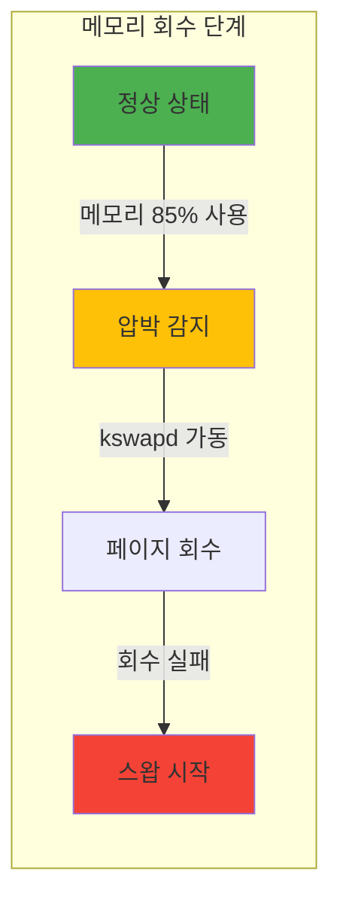
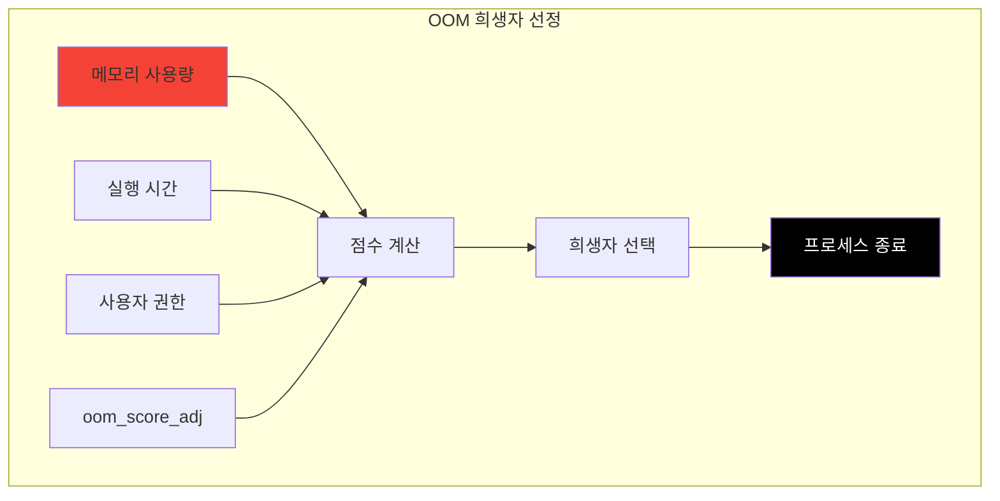

---
tags:
  - balanced
  - cow
  - demand_paging
  - intermediate
  - medium-read
  - memory_management
  - page_fault
  - swap
  - 시스템프로그래밍
difficulty: INTERMEDIATE
learning_time: "3-5시간"
main_topic: "시스템 프로그래밍"
priority_score: 4
---

# 3.2.3: 페이지 폴트 기초

## 🎯 페이지 폴트와 메모리 관리의 세계로

"누구나 이 메시지를 보고 좌절한 경험이 있을 겁니다."

"Segmentation fault (core dumped)"

그런데 놀라운 사실을 알게 되었습니다. 프로그램이 정상적으로 실행될 때도 초당 수천 번의 "폴트"가 발생한다는 것을요. 다만 이것들은 **좋은 폴트**입니다. 페이지 폴트는 버그가 아니라, 현대 운영체제의 핵심 메커니즘입니다.

더 충격적인 사실: Chrome이 10GB 메모리를 "사용"한다고 표시되어도, 실제로는 2GB만 쓰고 있을 수 있습니다. 나머지 8GB는 "약속"일 뿐이죠. 이게 가능한 이유가 바로 페이지 폴트입니다.

## 📚 학습 로드맵

이 섹션은 5개의 전문화된 문서로 구성되어 있습니다:

### 1️⃣ [페이지 폴트 종류와 처리](./03-02-04-page-fault-handling.md)

- Minor, Major, Invalid Fault의 분류와 특성
- Linux 커널의 페이지 폴트 핸들러 동작 원리
- 성능 차이의 근본 원인과 영향 분석
- Segmentation Fault의 진실과 OS 응급실 체계

### 2️⃣ [Copy-on-Write 메커니즘](./03-02-05-copy-on-write.md)

- fork()가 빠른 이유: 게으른 복사의 천재성
- Redis의 100GB 백업을 1초에 하는 비밀
- CoW 구현과 실전 활용 사례
- 이점과 한계, 최적화 전략

### 3️⃣ [Demand Paging 메커니즘](./03-02-06-demand-paging.md)

- malloc()의 거짓말: 1GB 할당 ≠ 1GB 사용
- 게으른 메모리 할당의 미학과 원리
- Prefaulting 최적화와 HugePage 활용
- 메모리 효율성과 성능 개선 기법

### 4️⃣ [스왑과 메모리 압박](./03-03-02-swap-memory-pressure.md)

- 스왑 지옥: 컴퓨터가 느려지는 이유
- RAM vs 디스크의 10,000배 성능 차이
- kswapd 데몬과 LRU 알고리즘의 일상
- Swappiness 제어와 zRAM 활용 전략

### 5️⃣ [OOM Killer와 실전 최적화](./03-06-03-oom-optimization.md)

- OOM Score 계산: 누가 죽을 것인가?
- 사형수 선정 기준과 방지 전략
- 페이지 폴트 프로파일링과 최적화 노하우
- 체크리스트: 페이지 폴트 마스터 되기

## 🎯 핵심 개념 비교표

| 개념 | Minor Fault | Major Fault | Invalid Fault |
|------|-------------|-------------|---------------|
| **처리 시간** | ~0.001ms | ~5ms | 즉시 종료 |
| **발생 원인** | 메모리 연결 필요 | 디스크 I/O 필요 | 잘못된 접근 |
| **영향도** | 무시 가능 | 성능 저하 | 프로그램 크래시 |
| **최적화** | Prefaulting | Page Cache | 코드 검토 |

## 💥 페이지 폴트 발생과 처리 과정



## 🚀 실전 활용 시나리오

### Redis 백그라운드 저장

- **문제**: 100GB 데이터베이스를 디스크에 저장하면서 서비스 중단 없이 계속 실행
- **해결**: fork() + CoW로 스냅샷 생성, 수정된 페이지만 복사
- **결과**: 1초 만에 백그라운드 저장 시작, 메모리 오버헤드 <10%

### 게임 서버 메모리 최적화  

- **문제**: 수백 MB 초기화 데이터를 여러 워커가 공유해야 함
- **해결**: 부모 프로세스에서 초기화 후 fork(), CoW로 공유
- **결과**: 메모리 사용량 1/10로 감소, 시작 시간 90% 단축

### 웹 브라우저 탭 관리

- **문제**: 각 탭이 독립적 메모리 공간이 필요하지만 공통 데이터 많음
- **해결**: Demand Paging으로 필요한 부분만 로드
- **결과**: 100개 탭 실행 시에도 실제 메모리 사용량은 10-20개 탭 수준

## 🔗 연관 학습

### 선행 학습

- [주소 변환 메커니즘](./03-02-01-address-translation.md) - MMU와 페이지 테이블 기초
- [TLB와 캐싱](./03-02-02-tlb-caching.md) - 성능 최적화 기반 지식

### 후속 학습  

- [메모리 압축과 중복 제거](./03-04-01-compression-deduplication.md) - 고급 메모리 기법
- [프로세스 생성과 관리](../chapter-01-process-thread/01-02-01-process-creation.md) - fork()와 CoW 실전

## 📊 성능 범위 비교 차트



### 성능 임계점

- **우수**: Minor Fault 초당 1000회 이하
- **보통**: Minor Fault 초당 1000-5000회
- **주의**: Major Fault 초당 10회 이상
- **심각**: Major Fault 초당 100회 이상

## 🤔 사례 연구 모음

### 성능 문제 진단 패턴

1. **"Application is slow"**
   - 검사 순서: Major Fault → Swap 사용량 → OOM Log → Memory Leak
   - 해결 순서: Page Cache → Prefaulting → Memory Optimization

2. **"System becomes unresponsive"**
   - 원인: 스왑 지옥 (10,000배 느림)
   - 방지: swappiness 조절, zRAM 도입, 사전 메모리 방지

3. **"Process suddenly terminated"**
   - OOM Score 계산에 의한 희생자 선정
   - 방지: oom_score_adj -1000, cgroup 메모리 제한

### 벤치마크 결과

- **Minor Fault**: 25,000회/초 처리 가능 (오버헤드 ~25ms/초)
- **Major Fault**: 200회/초마다 1초 대기 시간
- **CoW 효율**: 수정 비율 <5%일 때 95% 메모리 절약

## 🔧 고급 최적화 기법 미리보기

### 하드웨어 최적화

- **Huge Pages**: 4KB → 2MB/1GB 페이지로 TLB 리스 50% 전팩
- **NUMA Awareness**: CPU-메모리 지역성으로 30% 성능 향상
- **Memory Prefetching**: 하드웨어 예측으로 레이턴시 숨기기

### 커널 튜닝

```bash
# 튜닝 매개변수 예시
echo 1 > /proc/sys/vm/drop_caches        # 캐시 삭제
echo 0 > /proc/sys/vm/swappiness         # 스왑 방지
echo madvise > /sys/kernel/mm/transparent_hugepage/enabled
```

### 애플리케이션 레벨 최적화

- **Memory Pool**: malloc() 오버헤드 제거, 리수 커끝 효과
- **Object Pool**: 생성/소멸 비용 절약, GC 압박 감소
- **Copy Elimination**: 무의미한 데이터 복사 제거

### 핵심 메모리 관리 전략

각 섹션에서 다룰 핵심 전략들을 미리 살펴보겠습니다:

### 메모리 압박 시나리오 분석

| 메모리 압박 수준 | RAM 사용률 | 대응 방식 | 성능 영향 |
|----------------|------------|----------|----------|
| **정상** | <75% | 일반 할당 | 무시 가능 |
| **주의** | 75-85% | Background 회수 | 약간 느림 |
| **경고** | 85-95% | 적극적 회수 | 눈에 띄게 느림 |
| **위험** | >95% | 스왑 시작 | 10-1000배 느림 |
| **심각** | 스왑 50%+ | OOM 위험 | 시스템 정지 수준 |

### LRU 기반 메모리 회수 전략



### OOM Score 계산 방식



#### 점수 계산 기준

| 요소 | 점수 증가 | 점수 감소 | 특수 처리 |
|------|----------|----------|----------|
| **메모리 사용량** | RSS × 10 | - | 기본 점수 |
| **실행 시간** | - | 1시간+ → 1/2 | 노인 보호 |
| **Root 권한** | - | 1/4배 | VIP 대우 |
| **oom_score_adj** | +1000 → 즉시 | -1000 → 면제 | 수동 조절 |

### 최적화 전략 요약

```bash
# 페이지 폴트 분석 도구
perf stat -e page-faults,major-faults ./app  # 통계
vmstat 1                                      # 실시간 모니터링
/proc/[pid]/status | grep VmPeak             # 메모리 피크
```

#### 최적화 기법 체크리스트

- **프리폴팅**: MAP_POPULATE로 즉시 할당
- **Huge Pages**: 4KB → 2MB/1GB 페이지 사용
- **메모리 잠금**: mlock()으로 스왑 방지
- **접근 패턴**: MADV_SEQUENTIAL/RANDOM 힌트
- **프리페치**: __builtin_prefetch() 활용

## 🏆 페이지 폴트 마스터 체크리스트

### 기본 지식 ✅

- [ ] Minor/Major/Invalid Fault 구분
- [ ] CoW 메커니즘 이해
- [ ] Demand Paging 원리
- [ ] 스왑과 메모리 압박 대응
- [ ] OOM Killer 동작 방식

### 실전 기술 ✅

- [ ] perf로 페이지 폴트 분석
- [ ] mlock/MAP_POPULATE 활용
- [ ] swappiness 조절
- [ ] oom_score_adj 설정
- [ ] 메모리 사용량 모니터링

### 최적화 노하우 ✅

- [ ] Prefaulting으로 지연 시간 제거
- [ ] Huge Pages로 TLB 미스 감소
- [ ] 메모리 접근 패턴 최적화
- [ ] 캐시 친화적 알고리즘 구현
- [ ] 프로파일링 기반 튜닝

## 💡 핵심 교훈 요약

### "페이지 폴트는 친구다"

- Normal한 페이지 폴트는 현대 OS의 핵심 기능
- Minor Fault는 무시해도 되지만, Major Fault는 주의
- 성능 문제의 90%는 Major Fault에서 발생

### "메모리는 거짓말쟁이다"

- malloc(1GB) ≠ 1GB 실제 사용
- VSS(가상 메모리) vs RSS(실제 메모리) 구분 필수
- 페이지 캐시와 버퍼 캐시도 "메모리 사용량"에 포함

### "스왑은 최후의 보루다"

- 스왑 시작 = 성능 저하의 시작
- RAM이 부족하면 더 추가하는 것이 최선
- swappiness=0으로 설정해도 완전히 방지되지는 않음

---

**다음**: [메모리 압축과 중복 제거](./03-04-01-compression-deduplication.md)에서 더 고급 메모리 최적화 기법을 학습합니다.

## 📚 관련 문서

### 📖 현재 문서 정보

- **난이도**: INTERMEDIATE
- **주제**: 시스템 프로그래밍
- **예상 시간**: 3-5시간

### 🎯 학습 경로

- [📚 INTERMEDIATE 레벨 전체 보기](../learning-paths/intermediate/)
- [🏠 메인 학습 경로](../learning-paths/)
- [📋 전체 가이드 목록](../README.md)

### 📂 같은 챕터 (chapter-03-memory-system)

- [Chapter 3-2-1: 주소 변환은 어떻게 동작하는가](./03-02-01-address-translation.md)
- [Chapter 3-2-2: TLB와 캐싱은 어떻게 동작하는가](./03-02-02-tlb-caching.md)
- [Chapter 3-2-4: 페이지 폴트 종류와 처리 메커니즘](./03-02-04-page-fault-handling.md)
- [Chapter 3-2-5: Copy-on-Write (CoW) - fork()가 빠른 이유](./03-02-05-copy-on-write.md)
- [Chapter 3-2-6: Demand Paging - 게으른 메모리 할당의 미학](./03-02-06-demand-paging.md)

### 🏷️ 관련 키워드

`page_fault`, `memory_management`, `cow`, `demand_paging`, `swap`

### ⏭️ 다음 단계 가이드

- 실무 적용을 염두에 두고 프로젝트에 적용해보세요
- 관련 도구들을 직접 사용해보는 것이 중요합니다
