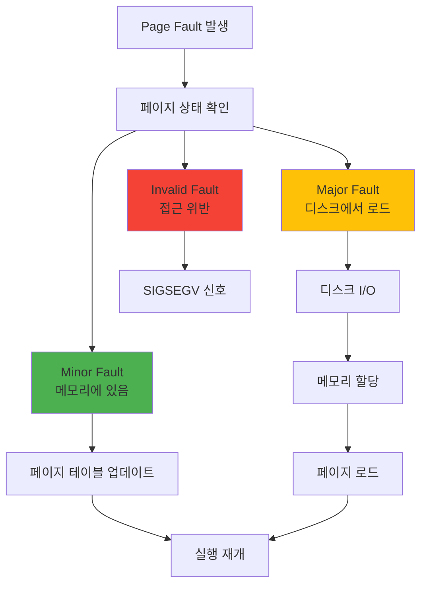

---
tags:
  - balanced
  - intermediate
  - kernel_handler
  - major_fault
  - medium-read
  - memory_management
  - minor_fault
  - page_fault
  - 시스템프로그래밍
difficulty: INTERMEDIATE
learning_time: "3-5시간"
main_topic: "시스템 프로그래밍"
priority_score: 4
---

# 3.2.4: 페이지 폴트 타입과 처리

## 들어가며: Segmentation Fault의 진실

"Segmentation fault (core dumped)"

개발자라면 누구나 이 메시지를 보고 좌절한 경험이 있을 겁니다. 제가 처음 이 에러를 만났을 때는 막막했습니다. "내 코드가 뭘 잘못했지?" "메모리를 잘못 건드렸나?"

그런데 놀라운 사실을 알게 되었습니다. 프로그램이 정상적으로 실행될 때도 초당 수천 번의 "폴트"가 발생한다는 것을요. 다만 이것들은 **좋은 폴트**입니다. 페이지 폴트는 버그가 아니라, 현대 운영체제의 핵심 메커니즘입니다.

더 충격적인 사실: Chrome이 10GB 메모리를 "사용"한다고 표시되어도, 실제로는 2GB만 쓰고 있을 수 있습니다. 나머지 8GB는 "약속"일 뿐이죠. 이게 가능한 이유가 바로 페이지 폴트입니다.

이번 섹션에서는 페이지 폴트의 종류와 처리 메커니즘을 상세히 살펴보겠습니다.

## 1. 페이지 폴트의 종류와 처리: 좋은 폴트, 나쁜 폴트, 치명적인 폴트

### 1.1 페이지 폴트 분류: 신호등처럼 단순한 분류

페이지 폴트는 신호등과 같습니다:

- 🟢 **Minor Fault**: 초록불 - 빠르게 처리되고 계속 진행
- 🟡 **Major Fault**: 노란불 - 잠시 멈추고 기다림
- 🔴 **Invalid Fault**: 빨간불 - 정지! Segmentation Fault!



### 1.2 페이지 폴트 핸들러: OS의 응급실

페이지 폴트가 발생하면, CPU는 즉시 멈추고 OS의 "응급실"로 달려갑니다:

```c
// Linux 커널의 페이지 폴트 처리: 초당 수천 번 실행되는 코드
void do_page_fault(struct pt_regs *regs, unsigned long error_code) {
    unsigned long address = read_cr2();  // "어디가 아프신가요?"
    struct mm_struct *mm = current->mm;
    struct vm_area_struct *vma;
    unsigned int flags = FAULT_FLAG_DEFAULT;

    // 1. 커널 모드에서 발생? (이건 심각한 상황)
    if (error_code & X86_PF_USER) {
        flags |= FAULT_FLAG_USER;  // 사용자 프로그램의 폴트
    } else {
        // 커널이 페이지 폴트? 이건 정말 위험!
        printf("[PANIC] 커널이 잘못된 메모리 접근!");
        if (handle_kernel_fault(address, error_code))
            return;
    }

    // 2. 이 주소가 프로그램의 영역인가?
    vma = find_vma(mm, address);
    if (!vma || vma->vm_start > address) {
        // 할당받지 않은 메모리 접근!
        printf("[SEGFAULT] 잘못된 포인터: %p", address);
        printf("당신이 가장 싫어하는 메시지를 보게 됩니다...");
        bad_area(regs, error_code, address);  // → "Segmentation fault"
        return;
    }

    // 3. 권한 확인
    if (error_code & X86_PF_WRITE) {
        if (!(vma->vm_flags & VM_WRITE)) {
            bad_area(regs, error_code, address);
            return;
        }
        flags |= FAULT_FLAG_WRITE;
    }

    // 4. 실제 폴트 처리
    fault_handler_t handler = get_fault_handler(vma);
    int ret = handler(vma, address, flags);

    if (ret & VM_FAULT_MAJOR) {
        current->maj_flt++;  // Major fault: 디스크에서 읽어옴 (느림)
        printf("[MAJOR] 디스크 I/O 발생 - %d ms 소요", io_time);
    } else {
        current->min_flt++;  // Minor fault: 메모리만 연결 (빠름)
        // 이건 너무 자주 발생해서 로그도 안 남김
    }
}
```

### 1.3 Minor vs Major Fault: 천국과 지옥의 차이

제가 실제로 경험한 사례입니다. 같은 100MB 파일을 처리하는데:

- 첫 번째 실행: 5초 (Major Fault 다발)
- 두 번째 실행: 0.1초 (Minor Fault만)

50배 차이! 무슨 일이 일어난 걸까요?

```c
#include <sys/time.h>
#include <sys/resource.h>

// Minor Fault: 빠른 폴트의 예
void demonstrate_minor_fault() {
    printf("=== Minor Fault 실험 ===");

    // 1. 메모리 할당 (이 순간은 '약속'만)
    size_t size = 100 * 1024 * 1024;  // 100MB
    char *memory = malloc(size);
    printf("100MB 할당 완료! (사실 아직 메모리 사용 안 함)");

    struct rusage before, after;
    getrusage(RUSAGE_SELF, &before);

    // 2. 첫 접근 - Minor Fault 폭풍!
    printf("메모리 접근 시작...");
    for (size_t i = 0; i < size; i += 4096) {
        memory[i] = 'A';  // 각 페이지 첫 접근 → Minor Fault!
        // 커널: "아, 이제 진짜로 메모리가 필요하구나!"
    }

    getrusage(RUSAGE_SELF, &after);

    long minor_faults = after.ru_minflt - before.ru_minflt;
    printf("\n결과:");
    printf("  Minor faults: %ld회", minor_faults);
    printf("  예상: %zu회 (100MB / 4KB 페이지)", size / 4096);
    printf("  각 폴트 처리 시간: ~0.001ms");
    printf("  총 오버헤드: ~%ldms (거의 무시 가능!)", minor_faults / 1000);

    free(memory);
}

// Major Fault: 느린 폴트의 악몽
void demonstrate_major_fault() {
    printf("\n=== Major Fault 실험 (커피 한 잔 준비하세요) ===");
    // 1. 파일 매핑
    int fd = open("large_file.dat", O_RDONLY);
    struct stat st;
    fstat(fd, &st);

    char *file_map = mmap(NULL, st.st_size, PROT_READ,
                         MAP_PRIVATE, fd, 0);

    // 2. 최악의 상황 만들기
    printf("페이지 캐시 삭제 중... (메모리를 텅 비웁니다)");
    system("echo 3 > /proc/sys/vm/drop_caches");  // 캐시 전부 삭제!
    printf("이제 모든 파일 접근이 디스크를 거쳐야 합니다...");

    struct rusage before, after;
    getrusage(RUSAGE_SELF, &before);

    // 3. 파일 접근 - Major Fault 지옥
    printf("파일 읽기 시작 (SSD라도 느립니다!)");
    volatile char sum = 0;
    for (size_t i = 0; i < st.st_size; i += 4096) {
        sum += file_map[i];  // 각 접근마다 디스크 I/O!
        if (i % (10 * 1024 * 1024) == 0) {
            printf("  %zu MB 처리... (디스크가 울고 있어요)", i / (1024*1024));
        }
    }

    getrusage(RUSAGE_SELF, &after);

    long major_faults = after.ru_majflt - before.ru_majflt;
    printf("\n충격적인 결과:");
    printf("  Major faults: %ld회", major_faults);
    printf("  각 폴트 처리 시간: ~5ms (SSD 기준)");
    printf("  총 오버헤드: ~%ldms", major_faults * 5);
    printf("  Minor Fault보다 5000배 느림!");

    munmap(file_map, st.st_size);
    close(fd);
}
```

## 핵심 요점

### 1. 페이지 폴트 분류 체계

페이지 폴트는 신호등처럼 3가지로 나뉘며, 각각 다른 처리 방식과 성능 특성을 가집니다.

### 2. 성능 차이의 극명함

Minor Fault(0.001ms)와 Major Fault(5ms)는 5000배의 성능 차이를 보이므로, 최적화 시 반드시 구분해야 합니다.

### 3. OS의 정교한 처리

커널의 페이지 폴트 핸들러는 주소 유효성, 권한 확인, 실제 처리까지 복잡한 단계를 거쳐 안전하고 효율적으로 처리합니다.

---

**이전**: [TLB와 캐싱](./03-02-02-tlb-caching.md)에서 주소 변환 성능을 학습했습니다.
**다음**: [Copy-on-Write 메커니즘](./03-02-05-copy-on-write.md)에서 fork()가 빠른 이유를 학습합니다.

## 📚 관련 문서

### 📖 현재 문서 정보

- **난이도**: INTERMEDIATE
- **주제**: 시스템 프로그래밍
- **예상 시간**: 3-5시간

### 🎯 학습 경로

- [📚 INTERMEDIATE 레벨 전체 보기](../learning-paths/intermediate/)
- [🏠 메인 학습 경로](../learning-paths/)
- [📋 전체 가이드 목록](../README.md)

### 📂 같은 챕터 (chapter-03-memory-system)

- [Chapter 3-2-1: 주소 변환은 어떻게 동작하는가](./03-02-01-address-translation.md)
- [Chapter 3-2-2: TLB와 캐싱은 어떻게 동작하는가](./03-02-02-tlb-caching.md)
- [Chapter 3-2-3: 페이지 폴트와 메모리 관리 개요](./03-02-03-page-fault.md)
- [Chapter 3-2-5: Copy-on-Write (CoW) - fork()가 빠른 이유](./03-02-05-copy-on-write.md)
- [Chapter 3-2-6: Demand Paging - 게으른 메모리 할당의 미학](./03-02-06-demand-paging.md)

### 🏷️ 관련 키워드

`page_fault`, `memory_management`, `minor_fault`, `major_fault`, `kernel_handler`

### ⏭️ 다음 단계 가이드

- 실무 적용을 염두에 두고 프로젝트에 적용해보세요
- 관련 도구들을 직접 사용해보는 것이 중요합니다
