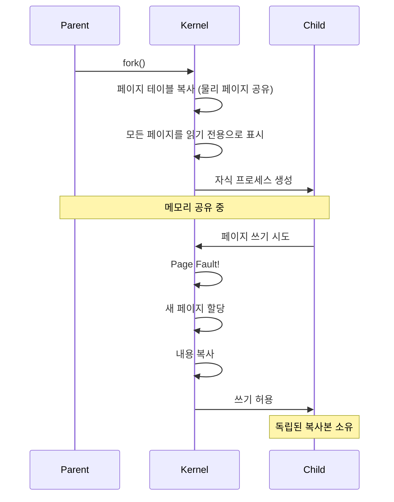

---
tags:
  - copy-on-write
  - fork
  - hands-on
  - intermediate
  - medium-read
  - memory-optimization
  - page-fault
  - redis
  - 시스템프로그래밍
difficulty: INTERMEDIATE
learning_time: "2-3시간"
main_topic: "시스템 프로그래밍"
priority_score: 4
---

# 3.2.5: Copy-on-Write 메커니즘

## CoW 메커니즘: 게으른 복사의 천재성

fork()는 프로세스를 통째로 복사합니다. 1GB 프로세스를 fork()하면 2GB가 필요할까요? 놀랍게도 아닙니다! 비밀은 Copy-on-Write에 있습니다.

제가 Redis 개발자에게 들은 이야기입니다: "우리는 100GB 데이터베이스를 fork()로 백업하는데 1초도 안 걸려요. CoW가 없었다면 Redis는 존재하지 못했을 거예요."



## CoW 구현: 마법이 일어나는 순간

CoW의 천재적인 아이디어: "복사한 척만 하고, 진짜로 수정할 때만 복사하자!"

```c
// Copy-on-Write 실험: fork()의 마법
#include <unistd.h>
#include <sys/wait.h>
#include <sys/mman.h>

void demonstrate_cow() {
    printf("=== Copy-on-Write 마법쇼 ===");

    // 1. 거대한 메모리 준비
    size_t size = 100 * 1024 * 1024;  // 100MB
    char *shared_memory = mmap(NULL, size,
                              PROT_READ | PROT_WRITE,
                              MAP_PRIVATE | MAP_ANONYMOUS,
                              -1, 0);

    // 2. 데이터로 가득 채우기
    memset(shared_memory, 'P', size);
    printf("부모: 100MB 메모리를 'P'로 채웠습니다");

    printf("부모: 메모리 주소 = %p", shared_memory);
    long rss_before = get_rss_kb();
    printf("부모: fork() 전 메모리 사용량 = %ld MB\n", rss_before / 1024);

    // 3. fork() - 여기서 마법이 시작됩니다!
    printf("🎩 fork() 호출! (100MB를 복사하는 척...)");
    pid_t pid = fork();

    if (pid == 0) {
        // 자식 프로세스
        printf("자식: 똑같은 주소 = %p (가상 주소는 동일!)", shared_memory);
        long child_rss = get_rss_kb();
        printf("자식: fork() 직후 메모리 = %ld MB", child_rss / 1024);
        printf("자식: 어? 메모리가 늘지 않았네요? (CoW 덟분!)\n");

        // 4. 일부만 수정 - 이제 진짜 복사가 일어남!
        printf("자식: 10개 페이지만 수정합니다...");
        for (int i = 0; i < 10; i++) {
            shared_memory[i * 4096] = 'C';  // 수정 → Page Fault → 복사!
            printf("  페이지 %d 수정 → CoW 발생!", i);
        }

        long child_rss_after = get_rss_kb();
        printf("\n자식: 수정 후 메모리 = %ld MB", child_rss_after / 1024);
        printf("자식: 증가량 = %ld KB (10 페이지 * 4KB = 40KB)",
               child_rss_after - child_rss);
        printf("자식: 나머지 99.96MB는 여전히 부모와 공유!");

        exit(0);
    } else {
        // 부모 프로세스
        wait(NULL);

        // 부모의 메모리는 그대로!
        printf("\n부모: 첫 글자 확인 = '%c' (여전히 'P'!)", shared_memory[0]);
        printf("부모: 자식이 수정했지만 내 메모리는 안전합니다");
        printf("부모: 메모리 사용량 = %ld MB (변화 없음)", get_rss_kb() / 1024);

        printf("\n🎉 CoW 마법 성공!");
        printf("fork()로 100MB 복사 → 실제로는 40KB만 복사");
        printf("메모리 절약: 99.96%%");
    }

    munmap(shared_memory, size);
}

// RSS (Resident Set Size) 측정
long get_rss_kb() {
    FILE *f = fopen("/proc/self/status", "r");
    char line[256];
    while (fgets(line, sizeof(line), f)) {
        if (strncmp(line, "VmRSS:", 6) == 0) {
            long rss;
            sscanf(line, "VmRSS: %ld kB", &rss);
            fclose(f);
            return rss;
        }
    }
    fclose(f);
    return 0;
}
```

## CoW의 실제 활용: 현업에서의 마법

CoW는 우리가 매일 사용하는 프로그램들의 비밀 무기입니다:

```c
// Redis의 백그라운드 저장: 100GB를 1초 만에 "복사"
void redis_bgsave_example() {
    printf("=== Redis BGSAVE: CoW의 실전 활용 ===");
    printf("현재 메모리: 100GB 데이터베이스");

    // Redis는 fork()를 사용해 스냅샷 생성

    pid_t pid = fork();

    if (pid == 0) {
        // 자식: 스냅샷 저장 (100GB를 디스크에)
        printf("[자식] 100GB 스냅샷 저장 시작");
        printf("[자식] 부모가 데이터를 수정해도 내 스냅샷은 안전!");
        save_memory_to_disk();  // 몇 분 걸림
        exit(0);
    } else {
        // 부모: 클라이언트 요청 계속 처리
        printf("[부모] fork() 완료! (1초도 안 걸림)");
        printf("[부모] 계속 서비스 중... 수정된 페이지만 복사됨");
        printf("[부모] 메모리 오버헤드: 수정된 데이터만큼만 (보통 <10%%)");
        continue_serving_requests();
    }
}

// 효율적인 프로세스 생성
void efficient_process_creation() {
    // 대량의 초기화 데이터
    size_t data_size = 500 * 1024 * 1024;  // 500MB
    void *init_data = create_initialization_data(data_size);

    // 여러 워커 프로세스 생성
    for (int i = 0; i < 10; i++) {
        if (fork() == 0) {
            // 각 워커는 필요한 부분만 수정
            // 대부분의 데이터는 공유됨
            process_worker(i, init_data);
            exit(0);
        }
    }

    // 메모리 사용량: 500MB + α (수정된 부분만)
    // CoW 없이: 500MB * 11 = 5.5GB
}
```

## CoW 전략의 이점과 한계

### 주요 이점

1. **메모리 효율성**: 수정되지 않은 데이터는 물리적으로 공유
2. **빠른 fork() 성능**: 복사 비용 없이 즉시 프로세스 생성
3. **동적 메모리 할당**: 필요한 만큼만 추가 메모리 사용

### 고려사항

1. **Write-Heavy 작업 시 오버헤드**: 많은 수정이 발생하면 오히려 비효율적
2. **페이지 폴트 비용**: 각 쓰기 시마다 페이지 폴트 오버헤드 발생
3. **메모리 파편화**: 이용 시간이 길어질수록 메모리가 늘어나는 일방향 특성

---

**이전**: [페이지 폴트 종류와 처리](./03-02-04-page-fault-handling.md)에서 기본 폴트 메커니즘을 학습했습니다.
**다음**: [Demand Paging 메커니즘](./03-02-06-demand-paging.md)에서 게으른 메모리 할당의 비밀을 학습합니다.

## 📚 관련 문서

### 📖 현재 문서 정보

- **난이도**: INTERMEDIATE
- **주제**: 시스템 프로그래밍
- **예상 시간**: 2-3시간

### 🎯 학습 경로

- [📚 INTERMEDIATE 레벨 전체 보기](../learning-paths/intermediate/)
- [🏠 메인 학습 경로](../learning-paths/)
- [📋 전체 가이드 목록](../README.md)

### 📂 같은 챕터 (chapter-03-memory-system)

- [Chapter 3-2-1: 주소 변환은 어떻게 동작하는가](./03-02-01-address-translation.md)
- [Chapter 3-2-2: TLB와 캐싱은 어떻게 동작하는가](./03-02-02-tlb-caching.md)
- [Chapter 3-2-3: 페이지 폴트와 메모리 관리 개요](./03-02-03-page-fault.md)
- [Chapter 3-2-4: 페이지 폴트 종류와 처리 메커니즘](./03-02-04-page-fault-handling.md)
- [Chapter 3-2-6: Demand Paging - 게으른 메모리 할당의 미학](./03-02-06-demand-paging.md)

### 🏷️ 관련 키워드

`copy-on-write`, `fork`, `memory-optimization`, `page-fault`, `redis`

### ⏭️ 다음 단계 가이드

- 실무 적용을 염두에 두고 프로젝트에 적용해보세요
- 관련 도구들을 직접 사용해보는 것이 중요합니다
