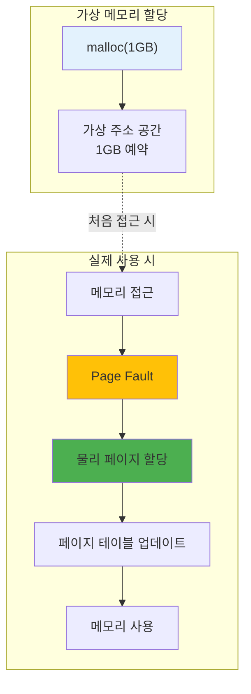

---
tags:
  - balanced
  - demand-paging
  - intermediate
  - madvise
  - medium-read
  - memory-optimization
  - mmap
  - page-fault
  - 시스템프로그래밍
difficulty: INTERMEDIATE
learning_time: "3-4시간"
main_topic: "시스템 프로그래밍"
priority_score: 4
---

# 3.2.6: Demand Paging 시스템

## Demand Paging 원리: "필요할 때까지 미루자"

대학생 시절 과제를 마감 직전까지 미뤄던 기억이 있나요? OS도 똑같습니다! malloc(1GB)를 호출해도, OS는 "알았어, 1GB 줄게"라고 거짓말하고 실제로는 한 바이트도 주지 않습니다.

진짜 메모리는 여러분이 실제로 쓸 때만 줍니다. 이게 Demand Paging입니다.



## Demand Paging 구현: 거짓말의 현장

malloc()의 거짓말을 직접 확인해봅시다:

```c
// Demand Paging 폭로: malloc()의 거짓말
#include <sys/mman.h>
#include <time.h>

void demonstrate_demand_paging() {
    printf("=== Demand Paging: OS의 거짓말 실험 ===\n\n");

    size_t size = 1ULL << 30;  // 1GB (기가바이트!)

    // 1. 1GB "할당" (거짓말의 시작)
    printf("[Step 1] 1GB 메모리 할당 요청...");
    clock_t start = clock();
    char *huge_array = mmap(NULL, size,
                           PROT_READ | PROT_WRITE,
                           MAP_PRIVATE | MAP_ANONYMOUS,
                           -1, 0);
    clock_t alloc_time = clock() - start;

    printf("✓ 할당 완료! 소요 시간: %.3f ms",
           (double)alloc_time * 1000 / CLOCKS_PER_SEC);
    printf("😏 OS: \"1GB 드렸습니다\" (사실 0 바이트)");

    long rss_after_alloc = get_rss_kb();
    printf("실제 메모리 사용량: %ld MB", rss_after_alloc / 1024);
    printf("👀 어? 메모리가 늘지 않았네요?\n\n");

    // 2. 실제 사용 (진실의 순간)
    printf("[Step 2] 이제 진짜로 메모리를 사용해봅시다...");
    start = clock();
    size_t pages_to_touch = 1000;

    for (size_t i = 0; i < pages_to_touch; i++) {
        huge_array[i * 4096] = 'A';  // 페이지 터치 → Page Fault → 진짜 할당!
        if (i % 100 == 0) {
            printf("  %zu 페이지 사용 중... (Page Fault 발생!)", i);
        }
    }
    clock_t use_time = clock() - start;

    printf("\n[Step 3] 결과 분석");
    printf("접근한 페이지: %zu개", pages_to_touch);
    printf("소요 시간: %.3f ms (Page Fault 처리 포함)",
           (double)use_time * 1000 / CLOCKS_PER_SEC);

    long rss_after_use = get_rss_kb();
    printf("\n💡 진실이 밝혀졌습니다!");
    printf("  할당 요청: 1024 MB");
    printf("  실제 사용: %ld MB", (rss_after_use - rss_after_alloc) / 1024);
    printf("  OS의 거짓말: %.1f%%",
           (1 - (double)(rss_after_use - rss_after_alloc) / (1024 * 1024)) * 100);
    printf("\n😎 이것이 Demand Paging의 마법입니다!");

    munmap(huge_array, size);
}

// 페이지 폴트 추적
void trace_page_faults() {
    struct rusage usage_before, usage_after;
    getrusage(RUSAGE_SELF, &usage_before);

    // 대량 메모리 할당 및 사용
    size_t size = 100 * 1024 * 1024;
    char *mem = calloc(1, size);  // calloc은 0으로 초기화

    getrusage(RUSAGE_SELF, &usage_after);

    printf("Page faults for %zu MB:", size / (1024*1024));
    printf("  Minor: %ld",
           usage_after.ru_minflt - usage_before.ru_minflt);
    printf("  Major: %ld",
           usage_after.ru_majflt - usage_before.ru_majflt);

    // calloc은 모든 페이지를 터치함
    // 예상: size / 4096 개의 minor fault

    free(mem);
}
```

## Prefaulting 최적화: 거짓말 없는 할당

가끔은 진짜로 메모리가 바로 필요할 때가 있습니다. 게임 로딩이나 실시간 시스템처럼요:

```c
// 페이지 프리폴팅으로 성능 향상
void optimize_with_prefaulting() {
    size_t size = 100 * 1024 * 1024;

    // 1. 일반적인 할당
    char *normal = malloc(size);
    clock_t start = clock();

    // 실제 사용 시 페이지 폴트 발생
    memset(normal, 0, size);

    clock_t normal_time = clock() - start;
    printf("Normal allocation + use: %.3f ms",
           (double)normal_time * 1000 / CLOCKS_PER_SEC);

    // 2. MAP_POPULATE로 프리폴팅
    start = clock();
    char *prefault = mmap(NULL, size,
                         PROT_READ | PROT_WRITE,
                         MAP_PRIVATE | MAP_ANONYMOUS | MAP_POPULATE,
                         -1, 0);
    clock_t prefault_alloc = clock() - start;

    // 이미 물리 메모리에 매핑됨
    start = clock();
    memset(prefault, 0, size);
    clock_t prefault_use = clock() - start;

    printf("Prefault allocation: %.3f ms",
           (double)prefault_alloc * 1000 / CLOCKS_PER_SEC);
    printf("Prefault use: %.3f ms (faster!)",
           (double)prefault_use * 1000 / CLOCKS_PER_SEC);

    free(normal);
    munmap(prefault, size);
}
```

## Demand Paging의 실용적 이점

### 1. 메모리 효율성

Demand Paging은 실제 또는 필요한 메모리만 사용하므로 전체 시스템의 메모리 활용도를 극대화합니다.

### 2. 빠른 프로그램 시작

프로그램 시작 시 malloc() 호출이 즉시 반환되미로 사용자는 빠른 반응 속도를 경험합니다.

### 3. 오버커밋 예방

가상 메모리 영역에서만 할당이 일어나므로 물리 메모리를 오버커밋하지 않고 효율적으로 나눐 사용할 수 있습니다.

## 성능 최적화 기법

### madvise()로 페이지 동작 제어

```c
// 페이지 접근 패턴 힌트 제공
void optimize_page_access() {
    size_t size = 100 * 1024 * 1024;
    char *data = malloc(size);
    
    // 순차적 접근 힌트
    madvise(data, size, MADV_SEQUENTIAL);
    
    // 예비 로드 요청  
    madvise(data, size, MADV_WILLNEED);
    
    // 무작위 접근 힌트
    madvise(data, size, MADV_RANDOM);
    
    free(data);
}
```

### HugePage 활용

```c
// 대용량 페이지로 TLB 성능 향상
void use_huge_pages() {
    size_t size = 1 << 30;  // 1GB
    
    void *huge_mem = mmap(NULL, size,
                         PROT_READ | PROT_WRITE,
                         MAP_PRIVATE | MAP_ANONYMOUS | MAP_HUGETLB,
                         -1, 0);
    
    if (huge_mem != MAP_FAILED) {
        printf("대용량 페이지 할당 성공");
        // TLB 미스 획전적 감소
    }
    
    munmap(huge_mem, size);
}
```

---

**이전**: [Copy-on-Write 메커니즘](./03-02-05-copy-on-write.md)에서 fork()의 마법을 학습했습니다.
**다음**: [스왑과 메모리 압박](./03-03-02-swap-memory-pressure.md)에서 시스템이 느려지는 이유를 학습합니다.

## 📚 관련 문서

### 📖 현재 문서 정보

- **난이도**: INTERMEDIATE
- **주제**: 시스템 프로그래밍
- **예상 시간**: 3-4시간

### 🎯 학습 경로

- [📚 INTERMEDIATE 레벨 전체 보기](../learning-paths/intermediate/)
- [🏠 메인 학습 경로](../learning-paths/)
- [📋 전체 가이드 목록](../README.md)

### 📂 같은 챕터 (chapter-03-memory-system)

- [Chapter 3-1: 주소 변환은 어떻게 동작하는가](./03-02-01-address-translation.md)
- [Chapter 3-2: TLB와 캐싱은 어떻게 동작하는가](./03-02-02-tlb-caching.md)
- [Chapter 3-3: 페이지 폴트와 메모리 관리 개요](./03-02-03-page-fault.md)
- [Chapter 3-2-4: 페이지 폴트 종류와 처리 메커니즘](./03-02-04-page-fault-handling.md)
- [Chapter 3-2-5: Copy-on-Write (CoW) - fork()가 빠른 이유](./03-02-05-copy-on-write.md)

### 🏷️ 관련 키워드

`demand-paging`, `page-fault`, `memory-optimization`, `mmap`, `madvise`

### ⏭️ 다음 단계 가이드

- 실무 적용을 염두에 두고 프로젝트에 적용해보세요
- 관련 도구들을 직접 사용해보는 것이 중요합니다
