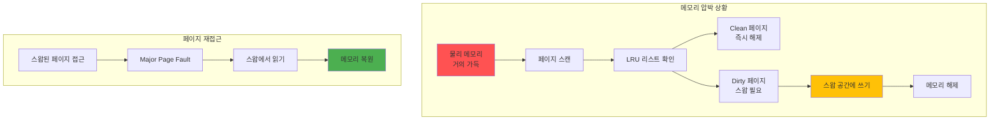
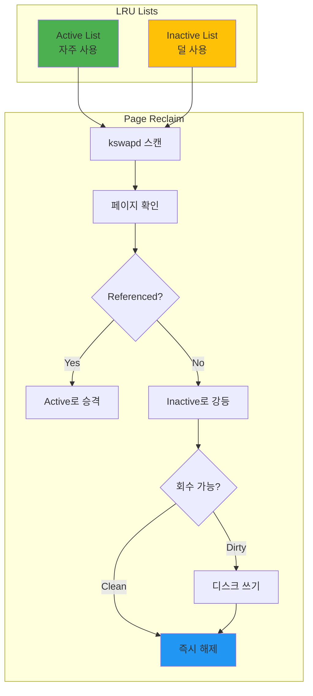

---
tags:
  - LRU
  - balanced
  - intermediate
  - kswapd
  - medium-read
  - memory-pressure
  - page-reclaim
  - swap
  - 시스템프로그래밍
difficulty: INTERMEDIATE
learning_time: "4-6시간"
main_topic: "시스템 프로그래밍"
priority_score: 4
---

# 3.3.2: 스왑과 메모리 압박

## 스왑 메커니즘: 디스크를 메모리처럼 쓰는 절망

여러분 컴퓨터가 갑자기 엄청 느려진 경험 있나요? 마우스도 뚡뚡 끊기고, 프로그램 전환에 몇 초씩 걸리고... 그게 바로 **스왑 지옥**입니다.

스왑은 RAM이 부족할 때 디스크를 메모리처럼 쓰는 최후의 수단입니다. 문제는 디스크가 RAM보다 10,000배 느리다는 겁니다!



## 스왑 구현과 관리: 지옥으로 가는 길

스왑이 실제로 얼마나 끔찍한지 보여드리겠습니다:

```c
// 스왑 지옥 체험: 컴퓨터를 느리게 만드는 방법
#include <sys/sysinfo.h>

void demonstrate_swap_behavior() {
    printf("=== 스왑 지옥 시뮤레이션 ===");
    printf("⚠️  경고: 시스템이 느려질 수 있습니다!\n\n");

    struct sysinfo info;
    sysinfo(&info);

    printf("[현재 시스템 상태]");
    printf("  RAM: %lu / %lu MB (%.1f%% 사용중)",
           (info.totalram - info.freeram) / 1024 / 1024,
           info.totalram / 1024 / 1024,
           (1.0 - (double)info.freeram / info.totalram) * 100);
    printf("  Swap: %lu / %lu MB",
           (info.totalswap - info.freeswap) / 1024 / 1024,
           info.totalswap / 1024 / 1024);

    if (info.totalswap - info.freeswap > 0) {
        printf("\n😱 이미 스왑을 사용 중입니다!");
        printf("   시스템이 느린 이유를 찾았네요...");
    }

    // 메모리 압박 생성
    size_t chunk_size = 100 * 1024 * 1024;  // 100MB
    void **chunks = malloc(100 * sizeof(void*));
    int allocated = 0;

    while (allocated < 100) {
        chunks[allocated] = malloc(chunk_size);
        if (!chunks[allocated]) break;

        // 실제로 메모리 사용 (페이지 폴트 유발)
        memset(chunks[allocated], 'X', chunk_size);
        allocated++;

        sysinfo(&info);

        // 스왑 사용 감지
        if (info.freeswap < info.totalswap * 0.9) {
            printf("\n🚨 스왑 발생! (청크 %d에서)", allocated);
            printf("  스왑 사용량: %lu MB",
                   (info.totalswap - info.freeswap) / 1024 / 1024);
            printf("  시스템 반응 속도: 🐌 (매우 느림)");
            printf("  디스크 LED: 📍 (미친듯이 깜박임)");
            break;  // 더 이상은 위험!
        }
    }

    // 정리
    for (int i = 0; i < allocated; i++) {
        free(chunks[i]);
    }
    free(chunks);
}

// 스왑 성능 영향: RAM vs 디스크의 잔인한 차이
void measure_swap_impact() {
    printf("\n=== 스왑 성능 테스트: 천국 vs 지옥 ===");
    size_t test_size = 10 * 1024 * 1024;  // 10MB
    char *test_memory = malloc(test_size);

    // 1. 메모리에 있을 때 성능
    memset(test_memory, 'A', test_size);

    clock_t start = clock();
    volatile long sum = 0;
    for (size_t i = 0; i < test_size; i++) {
        sum += test_memory[i];
    }
    clock_t memory_time = clock() - start;

    // 2. 스왑 유도 (madvise)
    madvise(test_memory, test_size, MADV_PAGEOUT);  // Linux 5.4+

    // 3. 스왑에서 읽기 성능
    start = clock();
    sum = 0;
    for (size_t i = 0; i < test_size; i++) {
        sum += test_memory[i];  // Major page fault 발생
    }
    clock_t swap_time = clock() - start;

    double mem_ms = (double)memory_time * 1000 / CLOCKS_PER_SEC;
    double swap_ms = (double)swap_time * 1000 / CLOCKS_PER_SEC;

    printf("\n📊 충격적인 결과:");
    printf("  RAM 접근: %.3f ms ⚡", mem_ms);
    printf("  Swap 접근: %.3f ms 🐌", swap_ms);
    printf("  속도 차이: %.1f배 느림!", swap_ms / mem_ms);
    printf("\n💡 교훈: 스왑이 시작되면 RAM을 추가하세요!");

    free(test_memory);
}
```

## Swappiness 제어: 스왑 민감도 조절

Linux는 언제 스왑을 시작할지 결정하는 'swappiness'라는 값이 있습니다. 0부터 100까지, 마치 매운맛 단계처럼:

```c
// 스왑 경향성 제어
void control_swappiness() {
    // 현재 swappiness 확인
    FILE *f = fopen("/proc/sys/vm/swappiness", "r");
    int swappiness;
    fscanf(f, "%d", &swappiness);
    fclose(f);

    printf("Current swappiness: %d", swappiness);
    // 0: 스왑 최소화
    // 60: 기본값
    // 100: 적극적 스왑

    // 프로세스별 스왑 제어 (CAP_SYS_ADMIN 필요)
    size_t critical_size = 50 * 1024 * 1024;
    void *critical_data = malloc(critical_size);

    // 메모리 잠금 - 스왑 방지
    if (mlock(critical_data, critical_size) == 0) {
        printf("Critical data locked in memory");
    } else {
        perror("mlock failed");
    }

    // 사용 후 잠금 해제
    munlock(critical_data, critical_size);
    free(critical_data);
}
```

## 메모리 회수 메커니즘: OS의 청소부

### 페이지 회수 알고리즘: 누구를 쪽아낼 것인가?

메모리가 부족하면 OS는 "청소"를 시작합니다. 하지만 누구를 쪽아내야 할까요? 방금 사용한 Chrome 탭? 아니면 어제 열어둔 메모장?

Linux의 LRU(Least Recently Used) 알고리즘이 이를 결정합니다:



### kswapd 데몬의 일상

kswapd는 Linux의 청소부입니다. 24시간 일하며 메모리를 정리하죠:

```c
// 커널의 메모리 회수 시뮤레이션
typedef struct page {
    unsigned long flags;
    int ref_count;
    struct list_head lru;
    void *data;
} page_t;

#define PG_ACTIVE    (1 << 0)
#define PG_REFERENCED (1 << 1)
#define PG_DIRTY     (1 << 2)
#define PG_LOCKED    (1 << 3)

// LRU 리스트 관리
struct lru_lists {
    struct list_head active;
    struct list_head inactive;
    size_t nr_active;
    size_t nr_inactive;
};

void page_reclaim_scanner(struct lru_lists *lru) {
    struct page *page, *tmp;
    int nr_scanned = 0;
    int nr_reclaimed = 0;

    // Inactive 리스트부터 스캔
    list_for_each_entry_safe(page, tmp, &lru->inactive, lru) {
        nr_scanned++;

        // Referenced 비트 확인
        if (page->flags & PG_REFERENCED) {
            // Active 리스트로 이동
            page->flags &= ~PG_REFERENCED;
            page->flags |= PG_ACTIVE;
            list_move(&page->lru, &lru->active);
            lru->nr_inactive--;
            lru->nr_active++;
            continue;
        }

        // 회수 가능한가?
        if (page->ref_count == 0 && !(page->flags & PG_LOCKED)) {
            if (page->flags & PG_DIRTY) {
                // Dirty 페이지는 디스크에 쓰기
                writeback_page(page);
            }

            // 페이지 해제
            list_del(&page->lru);
            free_page(page);
            nr_reclaimed++;
            lru->nr_inactive--;
        }

        // 충분히 회수했으면 중단
        if (nr_reclaimed >= 32) break;
    }

    printf("Scanned: %d, Reclaimed: %d pages",
           nr_scanned, nr_reclaimed);
}

// 메모리 압박 감지
void memory_pressure_monitor() {
    struct sysinfo info;

    while (1) {
        sysinfo(&info);

        unsigned long total = info.totalram;
        unsigned long free = info.freeram + info.bufferram;
        unsigned long available = free + get_reclaimable();

        double pressure = 1.0 - (double)available / total;

        if (pressure > 0.9) {
            printf("CRITICAL: Memory pressure %.1f%%",
                   pressure * 100);
            // 적극적 회수 시작
            aggressive_reclaim();
        } else if (pressure > 0.75) {
            printf("WARNING: Memory pressure %.1f%%",
                   pressure * 100);
            // 백그라운드 회수
            background_reclaim();
        }

        sleep(1);
    }
}
```

## 스왑 최적화 전략

### 1. 시스템 모니터링

```bash
# 스왑 사용량 확인
$ free -h
$ swapon -s
$ cat /proc/swaps

# 스왑 성능 모니터링
$ sar -W 1
$ iostat -x 1
```

### 2. 스왑 파일 최적화

```bash
# SSD에 스왑 파일 생성
dd if=/dev/zero of=/swapfile bs=1G count=4
chmod 600 /swapfile
mkswap /swapfile
swapon /swapfile

# 스왑 우선순위 설정
swapon -p 10 /swapfile  # 높은 우선순위
```

### 3. zRAM 활용

```bash
# 메모리 압축으로 효율 향상
modprobe zram
echo 2G > /sys/block/zram0/disksize
mkswap /dev/zram0
swapon -p 100 /dev/zram0  # 최고 우선순위
```

---

**이전**: [Demand Paging 메커니즘](./03-02-06-demand-paging.md)에서 게으른 메모리 할당을 학습했습니다.
**다음**: [OOM Killer와 최적화](./03-06-03-oom-optimization.md)에서 메모리 부족 시 시스템의 극단적 선택을 학습합니다.

## 📚 관련 문서

### 📖 현재 문서 정보

- **난이도**: INTERMEDIATE
- **주제**: 시스템 프로그래밍
- **예상 시간**: 4-6시간

### 🎯 학습 경로

- [📚 INTERMEDIATE 레벨 전체 보기](../learning-paths/intermediate/)
- [🏠 메인 학습 경로](../learning-paths/)
- [📋 전체 가이드 목록](../README.md)

### 📂 같은 챕터 (chapter-03-memory-system)

- [Chapter 3-2-1: 주소 변환은 어떻게 동작하는가](./03-02-01-address-translation.md)
- [Chapter 3-2-2: TLB와 캐싱은 어떻게 동작하는가](./03-02-02-tlb-caching.md)
- [Chapter 3-2-3: 페이지 폴트와 메모리 관리 개요](./03-02-03-page-fault.md)
- [Chapter 3-2-4: 페이지 폴트 종류와 처리 메커니즘](./03-02-04-page-fault-handling.md)
- [Chapter 3-2-5: Copy-on-Write (CoW) - fork()가 빠른 이유](./03-02-05-copy-on-write.md)

### 🏷️ 관련 키워드

`swap`, `memory-pressure`, `page-reclaim`, `LRU`, `kswapd`

### ⏭️ 다음 단계 가이드

- 실무 적용을 염두에 두고 프로젝트에 적용해보세요
- 관련 도구들을 직접 사용해보는 것이 중요합니다
