---
tags:
  - badness_function
  - balanced
  - intermediate
  - medium-read
  - memory_management
  - oom_killer
  - oom_score
  - process_protection
  - 시스템프로그래밍
difficulty: INTERMEDIATE
learning_time: "3-5시간"
main_topic: "시스템 프로그래밍"
priority_score: 4
---

# 3.6.2: OOM Killer 메커니즘

Linux OOM Killer는 메모리 부족 상황에서 시스템 안정성을 위해 가장 적절한 프로세스를 선택하여 종료하는 커널의 핵심 메커니즘입니다. badness 함수와 oom_score를 기반으로 한 과학적인 선택 알고리즘을 이해하고 조정하는 방법을 알아봅시다.

## OOM Score 계산 메커니즘

Linux OOM Killer는 각 프로세스에 점수를 매겨 희생양을 선택합니다:

```mermaid
graph LR
    subgraph SCORE_CALC["OOM Score 계산 요소"]
        RSS[RSS 메모리 사용량 기준 1000점]
        RUNTIME[실행 시간 오래실행시 감점]
        ROOT[Root 프로세스 30점 보너스]
        CHILDREN[자식 프로세스 많을수록 가점]
    end

    subgraph SCORE_ADJ["최종 점수 조정"]
        BADNESS[badness함수] --> SCORE[OOM Score]
        ADJ[oom_score_adj 관리자조정값] --> FINAL[최종 점수]
        SCORE --> FINAL
    end

    RSS --> BADNESS
    RUNTIME --> BADNESS
    ROOT --> BADNESS
    CHILDREN --> BADNESS

    style FINAL fill:#ffcccb
```



**OOM Score 확인 방법**:

```bash
# 모든 프로세스의 OOM Score 확인
$ for pid in $(ps -eo pid --no-headers); do
    if [ -f /proc/$pid/oom_score ]; then
        score=$(cat /proc/$pid/oom_score 2>/dev/null || echo "0")
        adj=$(cat /proc/$pid/oom_score_adj 2>/dev/null || echo "0")
        comm=$(cat /proc/$pid/comm 2>/dev/null || echo "unknown")
        echo "$score $adj $pid $comm"
    fi
done | sort -rn | head -10

# 결과 예시:
# 987   0  1234 mysqld        # 높은 점수 = 위험
# 756   0  5678 java
# 543   0  9012 nginx
# 234 -17  1    systemd       # 시스템 프로세스는 보호
```

## 실시간 OOM Score 모니터링

```python
#!/usr/bin/env python3
# oom_score_monitor.py
import os
import time
import psutil
from collections import defaultdict

class OOMScoreMonitor:
    def __init__(self):
        self.previous_scores = {}

    def get_process_oom_info(self, pid):
        try:
            with open(f'/proc/{pid}/oom_score') as f:
                oom_score = int(f.read().strip())

            with open(f'/proc/{pid}/oom_score_adj') as f:
                oom_score_adj = int(f.read().strip())

            proc = psutil.Process(pid)
            return {
                'pid': pid,
                'name': proc.name(),
                'oom_score': oom_score,
                'oom_score_adj': oom_score_adj,
                'memory_mb': proc.memory_info().rss / 1024 / 1024
            }
        except (FileNotFoundError, psutil.NoSuchProcess, ValueError):
            return None

    def get_high_risk_processes(self, threshold=100):
        """OOM 위험이 높은 프로세스 찾기"""
        high_risk = []

        for proc in psutil.process_iter(['pid']):
            try:
                oom_info = self.get_process_oom_info(proc.info['pid'])
                if oom_info and oom_info['oom_score'] > threshold:
                    high_risk.append(oom_info)
            except:
                continue

        return sorted(high_risk, key=lambda x: x['oom_score'], reverse=True)

    def monitor_oom_risk(self, duration=300, interval=10):
        """OOM 위험도 모니터링"""
        print(f"OOM 위험도 모니터링 시작 ({duration}초간, {interval}초 간격)")
        print("=" * 80)

        start_time = time.time()

        while time.time() - start_time < duration:
            print(f"\n[{time.strftime('%H:%M:%S')}] OOM 위험 프로세스 TOP 10:")
            print(f"{'PID':>6} {'Name':15} {'OOM Score':>10} {'Adj':>5} {'Memory(MB)':>12}")
            print("-" * 65)

            high_risk = self.get_high_risk_processes(threshold=50)

            for i, proc in enumerate(high_risk[:10]):
                # 점수 변화 표시
                change = ""
                if proc['pid'] in self.previous_scores:
                    diff = proc['oom_score'] - self.previous_scores[proc['pid']]
                    if diff > 0:
                        change = f" (+{diff})"
                    elif diff < 0:
                        change = f" ({diff})"

                # 위험도에 따른 경고 표시
                warning = ""
                if proc['oom_score'] > 800:
                    warning = " 🚨"
                elif proc['oom_score'] > 500:
                    warning = " ⚠️ "

                print(f"{proc['pid']:6d} {proc['name']:15s} "
                      f"{proc['oom_score']:10d}{change:8s} "
                      f"{proc['oom_score_adj']:5d} "
                      f"{proc['memory_mb']:11.1f}{warning}")

                self.previous_scores[proc['pid']] = proc['oom_score']

            # 시스템 메모리 상태
            mem = psutil.virtual_memory()
            print(f"\n시스템 메모리: {mem.percent:.1f}% 사용 "
                  f"(사용 가능: {mem.available / 1024 / 1024 / 1024:.1f}GB)")

            if mem.percent > 90:
                print("🚨 메모리 부족 위험!")
            elif mem.percent > 80:
                print("⚠️  메모리 사용량 주의")

            time.sleep(interval)

if __name__ == "__main__":
    monitor = OOMScoreMonitor()
    try:
        monitor.monitor_oom_risk(duration=600, interval=15)  # 10분간 모니터링
    except KeyboardInterrupt:
        print("\n모니터링 중단됨")
```

## OOM Score 조정 전략

중요한 프로세스를 OOM으로부터 보호하거나, 우선적으로 종료되도록 설정할 수 있습니다:

```bash
#!/bin/bash
# oom_protection.sh - OOM으로부터 중요한 프로세스 보호 및 위험 프로세스 우선 순위 설정 도구

echo "=== OOM 보호 설정 도구 ==="

# 중요한 시스템 프로세스 보호 - oom_score_adj를 음수로 설정하여 OOM Killer로부터 보호
protect_critical_processes() {
    echo "중요한 프로세스 보호 설정 중..."

    # SSH 데몬 보호 - 시스템 접근을 위해 가장 중요 (-17: 매우 높은 보호 수준)
    for pid in $(pgrep sshd); do
        echo -17 > /proc/$pid/oom_score_adj
        echo "sshd (PID $pid) 보호 설정 완료 (oom_score_adj: -17)"
    done

    # 데이터베이스 보호 - 데이터 무결성을 위해 높은 보호 수준 (-10)
    for service in mysqld postgres mongod; do
        for pid in $(pgrep $service); do
            echo -10 > /proc/$pid/oom_score_adj
            echo "$service (PID $pid) 보호 설정 완료 (oom_score_adj: -10)"
        done
    done

    # 웹 서버 보호 - 서비스 가용성을 위해 중간 보호 수준 (-5)
    for service in nginx apache2 httpd; do
        for pid in $(pgrep $service); do
            echo -5 > /proc/$pid/oom_score_adj
            echo "$service (PID $pid) 보호 설정 완료 (oom_score_adj: -5)"
        done
    done
}

# 메모리 집약적 프로세스를 우선 종료 대상으로 설정
deprioritize_memory_hogs() {
    echo "메모리 집약적 프로세스 우선 종료 설정..."

    # 브라우저 프로세스 - 메모리를 많이 사용하는 비필수 프로세스 (+10)
    for service in chrome firefox; do
        for pid in $(pgrep $service); do
            echo 10 > /proc/$pid/oom_score_adj
            echo "$service (PID $pid) 우선 종료 설정 완료 (oom_score_adj: +10)"
        done
    done

    # 개발 도구 - 메모리 사용량이 높은 개발 환경 도구들 (+5)
    for service in code idea pycharm; do
        for pid in $(pgrep $service); do
            echo 5 > /proc/$pid/oom_score_adj
            echo "$service (PID $pid) 우선 종료 설정 완료 (oom_score_adj: +5)"
        done
    done
}

# systemd 서비스에 대한 OOM 정책 설정
configure_systemd_oom() {
    echo "systemd 서비스 OOM 설정..."

    # systemd override 디렉토리 생성
    mkdir -p /etc/systemd/system/mysql.service.d/

    # MySQL 서비스 OOM 설정 예시
    # OOMScoreAdjust: OOM Score 조정값
    # OOMPolicy: OOM 발생시 정책 (continue: 서비스 유지, stop: 서비스 중단)
    cat > /etc/systemd/system/mysql.service.d/oom.conf << 'EOF'
[Service]
OOMScoreAdjust=-10
OOMPolicy=continue
EOF

    echo "systemd OOM 설정 완료 (서비스 재시작 필요)"
    echo "적용 명령어: systemctl daemon-reload && systemctl restart mysql"
}

# 메뉴
echo "1) 중요 프로세스 보호"
echo "2) 메모리 집약적 프로세스 우선 종료"
echo "3) systemd 서비스 OOM 설정"
echo "4) 전체 적용"
echo "5) 종료"

read -p "선택하세요 (1-5): " choice

case $choice in
    1) protect_critical_processes ;;
    2) deprioritize_memory_hogs ;;
    3) configure_systemd_oom ;;
    4)
        protect_critical_processes
        deprioritize_memory_hogs
        configure_systemd_oom
        ;;
    5) echo "종료합니다." ;;
    *) echo "잘못된 선택입니다." ;;
esac
```

## 핵심 요점

### 1. OOM Score 계산 원리

- RSS 메모리 사용량을 기준으로 1000점 만점으로 계산
- 실행 시간, Root 권한, 자식 프로세스 수 등이 점수에 영향

### 2. oom_score_adj 활용 전략

- 음수 값으로 중요한 프로세스를 보호 (SSH: -17, DB: -10)
- 양수 값으로 메모리 집약적 프로세스의 종료 우선순위 높임

### 3. systemd OOM 정책

- 서비스별로 OOM 동작 방식을 세밀하게 제어 가능
- OOMScoreAdjust와 OOMPolicy를 통한 체계적 관리

---

**이전**: [OOM 디버깅과 예방 개요](./03-07-08-oom-debugging.md)  
**다음**: [dmesg OOM 메시지 분석](./03-07-10-oom-log-analysis.md)에서 실제 OOM 발생 로그를 분석하는 방법을 학습합니다.

## 📚 관련 문서

### 📖 현재 문서 정보

-**난이도**: INTERMEDIATE
-**주제**: 시스템 프로그래밍
-**예상 시간**: 3-5시간

### 🎯 학습 경로

- [📚 INTERMEDIATE 레벨 전체 보기](../learning-paths/intermediate/)
- [🏠 메인 학습 경로](../learning-paths/)
- [📋 전체 가이드 목록](../README.md)

### 📂 같은 챕터 (chapter-03-memory-system)

- [Chapter 3-2-1: 주소 변환은 어떻게 동작하는가](./03-02-01-address-translation.md)
- [Chapter 3-2-2: TLB와 캐싱은 어떻게 동작하는가](./03-02-02-tlb-caching.md)
- [Chapter 3-2-3: 페이지 폴트와 메모리 관리 개요](./03-02-03-page-fault.md)
- [Chapter 3-2-4: 페이지 폴트 종류와 처리 메커니즘](./03-02-04-page-fault-handling.md)
- [Chapter 3-2-5: Copy-on-Write (CoW) - fork()가 빠른 이유](./03-02-05-copy-on-write.md)

### 🏷️ 관련 키워드

`oom_killer`, `oom_score`, `badness_function`, `memory_management`, `process_protection`

### ⏭️ 다음 단계 가이드

- 실무 적용을 염두에 두고 프로젝트에 적용해보세요
- 관련 도구들을 직접 사용해보는 것이 중요합니다
