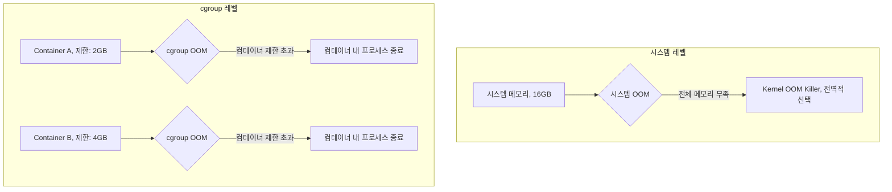

---
tags:
  - cgroup
  - container-debugging
  - docker-oom
  - hands-on
  - intermediate
  - kubernetes-memory
  - medium-read
  - oom-prevention
  - 인프라스트럭처
difficulty: INTERMEDIATE
learning_time: "3-4시간"
main_topic: "인프라스트럭처"
priority_score: 4
---

# 3.6.4: 컨테이너 OOM

## cgroup OOM vs 시스템 OOM

컴테이너 환경에서는 시스템 전체 OOM과 cgroup 제한에 의한 OOM을 구분해야 합니다:



## Docker 컴테이너 OOM 디버깅

```bash
#!/bin/bash
# docker_oom_debug.sh

echo "=== Docker 컴테이너 OOM 디버깅 ==="

# 특정 컴테이너의 메모리 사용량 및 cgroup 설정 상세 분석
check_container_memory() {
    local container_name=$1

    if [ -z "$container_name" ]; then
        echo "사용법: check_container_memory <컴테이너명>"
        return 1
    fi

    # 실행 중인 컴테이너에서 이름으로 컴테이너 ID 찾기
    container_id=$(docker ps -q --filter name=$container_name)
    if [ -z "$container_id" ]; then
        echo "실행 중인 컴테이너를 찾을 수 없습니다: $container_name"
        echo "중단된 컴테이너 포함 검색:"
        docker ps -a --filter name=$container_name
        return 1
    fi

    echo "컴테이너: $container_name (ID: $container_id)"

    # Docker 컴테이너 메모리 제한 설정 확인
    memory_limit=$(docker inspect $container_id | jq -r '.[0].HostConfig.Memory')
    if [ "$memory_limit" = "0" ] || [ "$memory_limit" = "null" ]; then
        echo "메모리 제한: 제한 없음 (위험: 시스템 전체 메모리 사용 가능)"
    else
        echo "메모리 제한: $memory_limit bytes ($(echo "scale=1; $memory_limit / 1024 / 1024 / 1024" | bc) GB)"
    fi

    # 현재 실시간 메모리 사용량 표시
    echo -e ", 현재 메모리 사용량:"
    docker stats $container_name --no-stream --format "table {{.Container}}\t{{.MemUsage}}\t{{.MemPerc}}\t{{.CPUPerc}}"

    # cgroup v1 경로 찾기 (Docker 20.10 이하)
    cgroup_path="/sys/fs/cgroup/memory/docker/$container_id"
    # cgroup v2 경로도 확인
    cgroup_v2_path="/sys/fs/cgroup/system.slice/docker-$container_id.scope"

    if [ -d "$cgroup_path" ]; then
        echo -e ", cgroup v1 메모리 통계 ($cgroup_path):"

        # 메모리 사용 현황
        if [ -f "$cgroup_path/memory.stat" ]; then
            echo "주요 메모리 사용 현황:"
            cat $cgroup_path/memory.stat | grep -E "(cache|rss|swap|mapped_file)" | while read line; do
                key=$(echo $line | awk '{print $1}')
                value=$(echo $line | awk '{print $2}')
                value_mb=$(echo "scale=1; $value / 1024 / 1024" | bc)
                echo "  $key: $value bytes (${value_mb} MB)"
            done
        fi

        # 메모리 사용량 히스토리
        if [ -f "$cgroup_path/memory.usage_in_bytes" ] && [ -f "$cgroup_path/memory.max_usage_in_bytes" ]; then
            current_usage=$(cat $cgroup_path/memory.usage_in_bytes)
            max_usage=$(cat $cgroup_path/memory.max_usage_in_bytes)
            echo -e ", 메모리 사용량:"
            echo "  현재 사용량: $(echo "scale=1; $current_usage / 1024 / 1024" | bc) MB"
            echo "  최대 사용량: $(echo "scale=1; $max_usage / 1024 / 1024" | bc) MB (컴테이너 시작 이후 최대값)"
        fi

        # OOM 제어 및 이벤트 확인
        if [ -f "$cgroup_path/memory.oom_control" ]; then
            oom_control=$(cat $cgroup_path/memory.oom_control)
            echo -e ", OOM 제어 설정:"
            echo "$oom_control" | while read line; do
                echo "  $line"
            done

            if echo "$oom_control" | grep -q "oom_kill_disable 0"; then
                echo "  → OOM Killer 활성화됨 (메모리 부족 시 프로세스 자동 종료)"
            else
                echo "  → OOM Killer 비활성화됨 (메모리 부족 시 블로킹)"
            fi
        fi

    elif [ -d "$cgroup_v2_path" ]; then
        echo -e ", cgroup v2 메모리 통계 ($cgroup_v2_path):"
        if [ -f "$cgroup_v2_path/memory.current" ]; then
            current_usage=$(cat $cgroup_v2_path/memory.current)
            echo "현재 사용량: $(echo "scale=1; $current_usage / 1024 / 1024" | bc) MB"
        fi

    else
        echo "주의: cgroup 경로를 찾을 수 없습니다."
        echo "  예상 경로: $cgroup_path"
        echo "  cgroup v2 경로: $cgroup_v2_path"
        echo "  이는 cgroup 버전이나 Docker 설정에 따라 다를 수 있습니다."
    fi
}

# Docker 이벤트에서 OOM 감지 및 자동 분석
monitor_docker_oom() {
    echo "Docker OOM 이벤트 모니터링 중..."
    echo "Ctrl+C로 중단"
    echo "모니터링할 이벤트: OOM 발생, 컴테이너 종료"
    echo "=" * 50

    # OOM 이벤트뿐만 아니라 die 이벤트도 모니터링 (OOM으로 인한 종료 포함)
    docker events --filter event=oom --filter event=die | while read event; do
        timestamp=$(date '+%Y-%m-%d %H:%M:%S')
        echo "[$timestamp] Docker 이벤트 감지: $event"

        # 컴테이너 ID 추출 (12자리 또는 64자리)
        container_id=$(echo $event | grep -o '[0-9a-f]\{12,64\}')

        if [ -n "$container_id" ]; then
            # 컴테이너 정보 조회
            container_info=$(docker inspect $container_id 2>/dev/null)
            if [ $? -eq 0 ]; then
                container_name=$(echo $container_info | jq -r '.[0].Name' | sed 's/^\///')
                exit_code=$(echo $container_info | jq -r '.[0].State.ExitCode')

                echo "  → 영향받은 컴테이너: $container_name (ID: ${container_id:0:12})"

                # OOM 관련 종료 코드 확인 (Exit Code 137 = SIGKILL, 보통 OOM)
                if [ "$exit_code" = "137" ]; then
                    echo "  ⚠️ 종료 코드 137: OOM Killer에 의한 종료 가능성 높음"
                elif [ "$exit_code" != "null" ] && [ "$exit_code" != "0" ]; then
                    echo "  ℹ️ 종료 코드: $exit_code"
                fi

                # 이벤트가 OOM이면 상세 정보 수집
                if echo "$event" | grep -q "oom"; then
                    echo "  🚨 OOM 이벤트 확인됨! 상세 분석 시작..."
                    echo "  " + "-" * 40
                    check_container_memory $container_name
                    echo "  " + "-" * 40
                fi
            else
                echo "  → 컴테이너 정보를 조회할 수 없음 (이미 제거됨?)"
            fi
        else
            echo "  → 컴테이너 ID를 추출할 수 없음"
        fi

        echo
    done
}

# 컴테이너별 OOM 설정 최적화 및 권장사항 제공
optimize_container_oom() {
    local container_name=$1

    if [ -z "$container_name" ]; then
        echo "사용법: optimize_container_oom <컴테이너명>"
        return 1
    fi

    echo "컴테이너 $container_name OOM 설정 최적화..."

    # 현재 설정 확인
    container_id=$(docker ps -q --filter name=$container_name)
    if [ -z "$container_id" ]; then
        echo "실행 중인 컴테이너를 찾을 수 없습니다: $container_name"
        return 1
    fi

    # 컴테이너 현재 설정 분석
    container_info=$(docker inspect $container_id)
    current_memory=$(echo $container_info | jq -r '.[0].HostConfig.Memory')
    current_swap=$(echo $container_info | jq -r '.[0].HostConfig.MemorySwap')
    current_reservation=$(echo $container_info | jq -r '.[0].HostConfig.MemoryReservation')

    echo "=== 현재 메모리 설정 ==="
    if [ "$current_memory" = "0" ]; then
        echo "메모리 제한: 없음 (위험!)"
    else
        echo "메모리 제한: $current_memory bytes ($(echo "scale=1; $current_memory / 1024 / 1024 / 1024" | bc) GB)"
    fi

    if [ "$current_swap" = "0" ]; then
        echo "스왈 제한: 없음"
    else
        echo "스왈 제한: $current_swap bytes"
    fi

    if [ "$current_reservation" = "0" ]; then
        echo "메모리 예약: 없음"
    else
        echo "메모리 예약: $current_reservation bytes"
    fi

    # 현재 실제 사용량 확인
    echo -e ", === 현재 사용량 ==="
    docker stats $container_name --no-stream --format "table {{.MemUsage}}\t{{.MemPerc}}\t{{.CPUPerc}}"

    # 권장 설정 계산 (현재 사용량 기반)
    current_usage=$(docker stats $container_name --no-stream --format "{{.MemUsage}}" | cut -d'/' -f1 | sed 's/MiB//g' | sed 's/GiB//g')

    echo -e ", === 권장 설정 ==="

    # Docker Compose 파일 생성
    cat > docker-compose.override.yml << EOF
version: '3.8'
services:
  $container_name:
    # 메모리 제한 설정
    mem_limit: 2g              # 최대 사용 가능 메모리
    mem_reservation: 1g        # 최소 보장 메모리 (소프트 제한)

    # OOM 설정
    oom_kill_disable: false    # OOM Killer 활성화 (권장)
    oom_score_adj: 0           # OOM Score 조정 (기본값)

    # 스왈 설정
    memswap_limit: 2g          # 메모리+스왈 총 제한 (mem_limit와 동일하면 스왈 비활성화)

    # 추가 권장 설정
    restart: unless-stopped    # OOM 후 자동 재시작

    # 헬스체크 설정 (애플리케이션에 맞게 조정)
    healthcheck:
      test: ["CMD", "curl", "-f", "http://localhost:8080/health"]
      interval: 30s
      timeout: 10s
      retries: 3
      start_period: 60s
EOF

    echo "docker-compose.override.yml 파일이 생성되었습니다."
    echo
    echo "=== 적용 방법 ==="
    echo "1. docker-compose.yml이 있는 경우:"
    echo "   docker-compose up -d"
    echo
    echo "2. 단일 컴테이너 실행하는 경우:"
    echo "   docker run --memory=2g --memory-reservation=1g --oom-kill-disable=false \\"
    echo "              --memory-swap=2g --restart=unless-stopped [이미지명]"
    echo
    echo "=== 추가 권장사항 ==="
    echo "• 애플리케이션별 메모리 프로파일링 수행"
    echo "• 로그에서 메모리 누수 패턴 확인"
    echo "• 모니터링 시스템(Prometheus, Grafana) 구축"
    echo "• 정기적인 메모리 사용 패턴 분석"
}

# 메뉴
echo "1) 컴테이너 메모리 사용량 확인"
echo "2) Docker OOM 이벤트 모니터링"
echo "3) 컴테이너 OOM 설정 최적화"
echo "4) 종료"

read -p "선택하세요 (1-4): " choice

case $choice in
    1)
        read -p "컴테이너 이름: " container_name
        check_container_memory $container_name
        ;;
    2)
        monitor_docker_oom
        ;;
    3)
        read -p "컴테이너 이름: " container_name
        optimize_container_oom $container_name
        ;;
    4)
        echo "종료합니다."
        ;;
    *)
        echo "잘못된 선택입니다."
        ;;
esac
```

## Kubernetes Pod OOM 분석

```yaml
# pod-oom-monitoring.yaml
apiVersion: v1
kind: Pod
metadata:
  name: oom-protected-app
  annotations:
    prometheus.io/scrape: "true"
spec:
  containers:
  - name: app
    image: myapp:latest
    resources:
      requests:
        memory: 512Mi      # 최소 보장 메모리
      limits:
        memory: 1Gi        # 최대 사용 가능 메모리
    env:
    - name: JAVA_OPTS
      value: "-Xmx800m"    # JVM 힐을 제한보다 작게 설정
    livenessProbe:
      httpGet:
        path: /health
        port: 8080
      initialDelaySeconds: 30
      periodSeconds: 10
    readinessProbe:
      httpGet:
        path: /ready
        port: 8080
      initialDelaySeconds: 5
      periodSeconds: 5
  securityContext:
    runAsNonRoot: true
    runAsUser: 1000
---
apiVersion: v1
kind: ServiceAccount
metadata:
  name: oom-monitor
---
apiVersion: rbac.authorization.k8s.io/v1
kind: ClusterRole
metadata:
  name: oom-monitor
rules:
- apiGroups: [""]
  resources: ["events", "pods"]
  verbs: ["get", "list", "watch"]
---
apiVersion: rbac.authorization.k8s.io/v1
kind: ClusterRoleBinding
metadata:
  name: oom-monitor
roleRef:
  apiGroup: rbac.authorization.k8s.io
  kind: ClusterRole
  name: oom-monitor
subjects:
- kind: ServiceAccount
  name: oom-monitor
  namespace: default
```

**Kubernetes OOM 이벤트 모니터링**:

```bash
#!/bin/bash
# k8s_oom_monitor.sh

echo "=== Kubernetes OOM 모니터링 ==="

# Pod OOM 이벤트 확인
check_oom_events() {
    echo "최근 OOM 이벤트:"
    kubectl get events --all-namespaces \
        --field-selector reason=OOMKilled \
        --sort-by='.firstTimestamp' \
        -o custom-columns=TIME:.firstTimestamp,NAMESPACE:.namespace,POD:.involvedObject.name,REASON:.reason,MESSAGE:.message
}

# Pod 메모리 사용량 실시간 모니터링
monitor_pod_memory() {
    local namespace=${1:-default}
    local pod_name=$2

    if [ -z "$pod_name" ]; then
        echo "전체 Pod 메모리 사용량:"
        kubectl top pods --all-namespaces --sort-by=memory
    else
        echo "Pod $pod_name 모니터링 중..."
        while true; do
            echo -e ", [$(date)] Pod 메모리 사용량:"
            kubectl top pod $pod_name -n $namespace

            # 메모리 제한 대비 사용률 계산
            memory_limit=$(kubectl get pod $pod_name -n $namespace -o jsonpath='{.spec.containers[0].resources.limits.memory}')
            echo "메모리 제한: $memory_limit"

            sleep 10
        done
    fi
}

# Pod 메모리 제한 최적화 권장사항
recommend_memory_limits() {
    echo "=== 메모리 제한 최적화 권장사항 ==="

    # 각 네임스페이스별 Pod 분석
    kubectl get pods --all-namespaces -o json | jq -r '
    .items[] |
    select(.spec.containers[0].resources.limits.memory) |
    [
        .metadata.namespace,
        .metadata.name,
        .spec.containers[0].resources.requests.memory // "없음",
        .spec.containers[0].resources.limits.memory,
        .status.containerStatuses[0].restartCount
    ] | @csv' | while IFS=',' read -r namespace pod_name requests limits restarts; do

        # 따옴표 제거
        namespace=${namespace//\"/}
        pod_name=${pod_name//\"/}
        requests=${requests//\"/}
        limits=${limits//\"/}
        restarts=${restarts//\"/}

        # 재시작이 많은 Pod (OOM 가능성)
        if [ "$restarts" -gt 3 ]; then
            echo "⚠️  $namespace/$pod_name: 재시작 $restarts 회 (OOM 가능성)"
            echo "   현재 제한: requests=$requests, limits=$limits"
        fi
    done
}

# 메뉴
echo "1) OOM 이벤트 확인"
echo "2) Pod 메모리 모니터링"
echo "3) 메모리 제한 최적화 권장사항"
echo "4) 종료"

read -p "선택하세요 (1-4): " choice

case $choice in
    1)
        check_oom_events
        ;;
    2)
        read -p "네임스페이스 (기본값: default): " namespace
        read -p "Pod 이름 (전체 확인시 비워두세요): " pod_name
        monitor_pod_memory ${namespace:-default} $pod_name
        ;;
    3)
        recommend_memory_limits
        ;;
    4)
        echo "종료합니다."
        ;;
    *)
        echo "잘못된 선택입니다."
        ;;
esac
```

## 핵심 요점

### 1. cgroup 별 메모리 제한

컴테이너는 시스템 전체 메모리와 별도로 cgroup 제한을 가지며, 이 제한을 초과하면 컴테이너 내에서 OOM이 발생합니다.

### 2. Docker OOM 디버깅

Docker 이벤트 모니터링과 cgroup 정보 분석을 통해 컴테이너 OOM을 진단할 수 있습니다.

### 3. Kubernetes 리소스 관리

requests와 limits를 적절히 설정하여 Pod OOM을 예방하고, 이벤트 모니터링으로 문제를 조기 발견할 수 있습니다.

---

**이전**: [03-44-dmesg-log-analysis.md](./03-07-09-dmesg-log-analysis.md)  
**다음**: [08d-early-oom-prevention.md](./03-06-05-early-oom-prevention.md)에서 조기 OOM 예방 전략을 학습합니다.

## 📚 관련 문서

### 📖 현재 문서 정보

-**난이도**: INTERMEDIATE
-**주제**: 인프라스트럭처
-**예상 시간**: 3-4시간

### 🎯 학습 경로

- [📚 INTERMEDIATE 레벨 전체 보기](../learning-paths/intermediate/)
- [🏠 메인 학습 경로](../learning-paths/)
- [📋 전체 가이드 목록](../README.md)

### 📂 같은 챕터 (chapter-03-memory-system)

- [Chapter 3-2-1: 주소 변환은 어떻게 동작하는가](./03-02-01-address-translation.md)
- [Chapter 3-2-2: TLB와 캐싱은 어떻게 동작하는가](./03-02-02-tlb-caching.md)
- [Chapter 3-2-3: 페이지 폴트와 메모리 관리 개요](./03-02-03-page-fault.md)
- [Chapter 3-2-4: 페이지 폴트 종류와 처리 메커니즘](./03-02-04-page-fault-handling.md)
- [Chapter 3-2-5: Copy-on-Write (CoW) - fork()가 빠른 이유](./03-02-05-copy-on-write.md)

### 🏷️ 관련 키워드

`cgroup`, `docker-oom`, `kubernetes-memory`, `container-debugging`, `oom-prevention`

### ⏭️ 다음 단계 가이드

- 실무 적용을 염두에 두고 프로젝트에 적용해보세요
- 관련 도구들을 직접 사용해보는 것이 중요합니다
