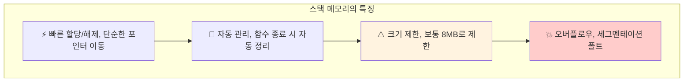
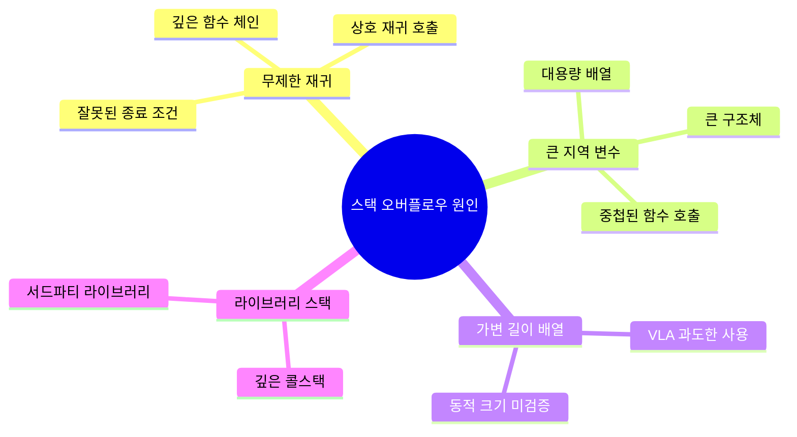
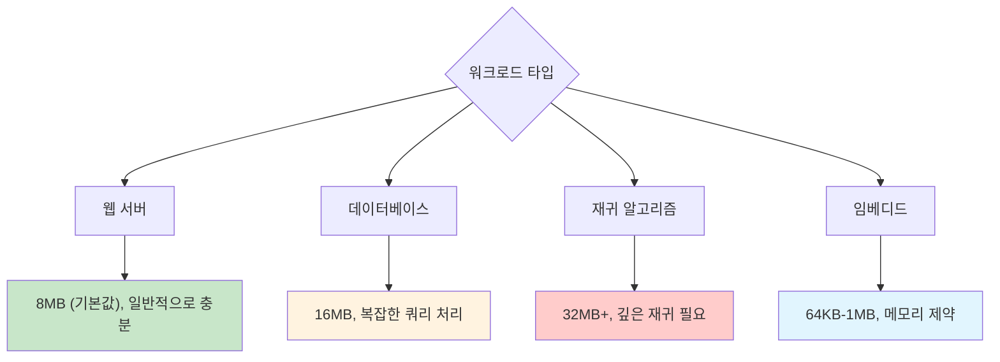
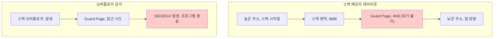
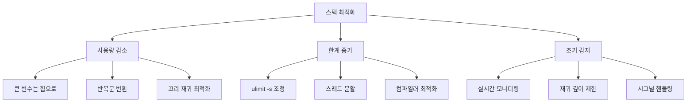

---
tags:
  - deep-study
  - hands-on
  - intermediate
  - memory-protection
  - recursion-safety
  - stack-monitoring
  - stack-overflow-debugging
  - ulimit-optimization
  - 시스템프로그래밍
difficulty: INTERMEDIATE
learning_time: "5-7시간"
main_topic: "시스템 프로그래밍"
priority_score: 4
---

# 3.7.4: 스택 디버깅

## 이 문서를 읽으면 답할 수 있는 질문들

- Stack overflow가 발생하는 근본 원인은 무엇인가요?
- ulimit -s 설정을 어떻게 최적화하나요?
- stack guard page는 어떻게 동작하나요?
- alloca와 VLA의 위험성과 대안은?
- 재귀 깊이를 안전하게 제한하는 방법은?

## 들어가며: 스택의 한계와 현실

"분명히 메모리는 충분한데 왜 stack overflow가 발생하지?"

스택은 프로그램에서 가장 빠르고 간단한 메모리 영역이지만, **크기 제한**이라는 치명적인 약점이 있습니다.



스택 문제는 **예측하기 어렵고**, **디버깅하기 까다로우며**, **보안 취약점**으로 이어질 수 있습니다.

### 스택 오버플로우가 발생하는 주요 원인



각 원인을 체계적으로 진단하고 해결하는 방법을 배워보겠습니다.

## 1. 스택 크기와 ulimit 설정

### 1.1 현재 스택 제한 확인

```bash
# 현재 스택 크기 제한 확인
$ ulimit -s
8192    # 8MB (킬로바이트 단위)

# 모든 리소스 제한 확인
$ ulimit -a
core file size          (blocks, -c) 0
data seg size           (kbytes, -d) unlimited
scheduling priority             (-e) 0
file size               (blocks, -f) unlimited
pending signals                 (-i) 127663
max locked memory       (kbytes, -l) 64
max memory size         (kbytes, -m) unlimited
open files                      (-n) 1024
pipe size            (512 bytes, -p) 8
POSIX message queues     (bytes, -q) 819200
real-time priority              (-r) 0
stack size              (kbytes, -s) 8192      # 여기!
cpu time               (seconds, -t) unlimited
max user processes              (-u) 127663
virtual memory          (kbytes, -v) unlimited
file locks                      (-x) unlimited
```

### 1.2 프로그램별 스택 사용량 측정

```c
// stack_usage_monitor.c
#include <stdio.h>
#include <stdlib.h>
#include <sys/resource.h>
#include <unistd.h>

void print_stack_usage() {
    struct rusage usage;
    getrusage(RUSAGE_SELF, &usage);

    // 스택 관련 정보 출력 (Linux에서는 제한적)
    printf("최대 RSS: %ld KB, ", usage.ru_maxrss);

    // /proc/self/status에서 스택 정보 읽기
    FILE *status = fopen("/proc/self/status", "r");
    char line[256];

    while (fgets(line, sizeof(line), status)) {
        if (strncmp(line, "VmStk:", 6) == 0) {
            printf("현재 스택 크기: %s", line + 6);
        }
        if (strncmp(line, "VmPeak:", 7) == 0) {
            printf("최대 가상 메모리: %s", line + 7);
        }
    }
    fclose(status);
}

// 스택에 큰 변수 할당해보기
void test_large_stack_allocation(int size_kb) {
    char large_array[size_kb * 1024];  // VLA 사용

    printf("스택에 %dKB 할당 시도..., ", size_kb);

    // 배열 초기화 (실제 메모리 사용 확보)
    for (int i = 0; i < size_kb * 1024; i++) {
        large_array[i] = i % 256;
    }

    print_stack_usage();

    printf("%dKB 할당 성공!, ", size_kb);
}

int main() {
    printf("=== 스택 사용량 테스트 ===, ");

    print_stack_usage();

    // 점진적으로 큰 스택 할당 테스트
    for (int size = 1024; size <= 8192; size += 1024) {
        printf(", --- %dKB 테스트 ---, ", size);
        test_large_stack_allocation(size);
    }

    return 0;
}
```

**컴파일 및 실행**:

```bash
$ gcc -O0 -g stack_usage_monitor.c -o stack_test
$ ./stack_test

=== 스택 사용량 테스트 ===
현재 스택 크기:      132 kB
최대 가상 메모리:   2584 kB

--- 1024KB 테스트 ---
스택에 1024KB 할당 시도...
현재 스택 크기:     1156 kB    # 증가!
1024KB 할당 성공!

--- 7168KB 테스트 ---
스택에 7168KB 할당 시도...
Segmentation fault (core dumped)  # 스택 오버플로우!
```

### 1.3 안전한 스택 크기 설정

```bash
# 임시로 스택 크기 증가 (현재 쉘에서만)
$ ulimit -s 16384    # 16MB로 증가

# 시스템 전체 기본값 변경 (/etc/security/limits.conf)
$ sudo vi /etc/security/limits.conf
# 다음 라인 추가:
* soft stack 16384    # 모든 사용자, soft limit 16MB
* hard stack 32768    # hard limit 32MB

# 특정 프로그램만 스택 크기 변경
$ bash -c 'ulimit -s 16384; ./my_program'

# systemd 서비스에서 스택 크기 설정
[Service]
LimitSTACK=16384000    # 16MB (바이트 단위)
```

**적절한 스택 크기 선택 기준**:



## 2. Stack Guard Page 이해

### 2.1 Guard Page 동작 원리

Linux는 스택 오버플로우를 감지하기 위해 **guard page**를 사용합니다:



**Guard Page 확인**:

```bash
# 현재 프로세스의 메모리 맵 확인
$ cat /proc/self/maps | grep stack
7fff12345000-7fff12366000 rw-p 00000000 00:00 0    [stack]

# Guard page는 보통 스택 바로 아래에 위치
# (실제로는 커널이 자동으로 관리하므로 /proc/maps에 직접 표시되지 않음)

# mprotect로 수동 guard page 만들기 예제
```

### 2.2 커스텀 스택 오버플로우 검출

자체적인 스택 사용량 모니터링을 구현할 수 있습니다:

```c
// stack_monitor.c
#include <stdio.h>
#include <stdlib.h>
#include <signal.h>
#include <sys/mman.h>
#include <unistd.h>

static void *stack_start = NULL;
static size_t stack_size = 0;

// 스택 사용량 확인 함수
size_t get_stack_usage() {
    char current_var;
    if (!stack_start) {
        return 0;
    }

    // 스택은 높은 주소에서 낮은 주소로 자라므로
    size_t used = (char*)stack_start - &current_var;
    return used;
}

// 안전한 재귀 함수 (스택 사용량 체크)
int safe_recursive_function(int n, size_t max_stack_usage) {
    size_t current_usage = get_stack_usage();

    printf("재귀 깊이: %d, 스택 사용량: %zu KB, ",
           n, current_usage / 1024);

    if (current_usage > max_stack_usage) {
        printf("스택 사용량이 임계값을 초과했습니다! (%zu KB), ",
               max_stack_usage / 1024);
        return -1;  // 안전한 종료
    }

    if (n <= 0) {
        return 0;
    }

    // 지역 변수로 스택 사용량 증가
    char local_buffer[1024];
    local_buffer[0] = n % 256;

    return safe_recursive_function(n - 1, max_stack_usage);
}

void setup_stack_monitoring() {
    char stack_var;
    stack_start = &stack_var;
    stack_size = 8 * 1024 * 1024;  // 8MB 가정

    printf("스택 모니터링 시작: %p, ", stack_start);
}

int main() {
    setup_stack_monitoring();

    printf("=== 안전한 재귀 함수 테스트 ===, ");

    // 최대 6MB까지만 스택 사용 허용
    size_t max_usage = 6 * 1024 * 1024;

    int result = safe_recursive_function(10000, max_usage);

    if (result == -1) {
        printf("스택 오버플로우 방지를 위해 안전하게 종료되었습니다., ");
    } else {
        printf("재귀 함수가 정상 완료되었습니다., ");
    }

    return 0;
}
```

## 3. 위험한 스택 사용 패턴과 대안

### 3.1 alloca()의 위험성

`alloca()`는 스택에 동적 메모리를 할당하는 함수지만 매우 위험합니다:

```c
// dangerous_alloca.c
#include <stdio.h>
#include <alloca.h>
#include <string.h>

// 위험한 alloca 사용
void dangerous_alloca_usage() {
    int size;
    printf("할당할 크기를 입력하세요 (바이트): ");
    scanf("%d", &size);

    // 사용자 입력을 검증하지 않음! 매우 위험!
    char *buffer = alloca(size);

    printf("%d 바이트 할당 성공, ", size);
    memset(buffer, 'A', size - 1);
    buffer[size - 1] = '\0';

    printf("Buffer: %.100s..., ", buffer);
}

// 안전한 대안
void safe_dynamic_allocation() {
    int size;
    printf("할당할 크기를 입력하세요 (바이트): ");
    scanf("%d", &size);

    // 1. 크기 검증
    if (size <= 0 || size > 1024 * 1024) {  // 1MB 제한
        printf("잘못된 크기입니다: %d, ", size);
        return;
    }

    // 2. 힙에 할당 (안전)
    char *buffer = malloc(size);
    if (!buffer) {
        printf("메모리 할당 실패, ");
        return;
    }

    printf("%d 바이트 할당 성공, ", size);
    memset(buffer, 'A', size - 1);
    buffer[size - 1] = '\0';

    printf("Buffer: %.100s..., ", buffer);

    // 3. 반드시 해제
    free(buffer);
}

int main() {
    printf("=== alloca 위험성 데모 ===, ");
    printf("큰 값(예: 10000000)을 입력하면 스택 오버플로우 발생!, ");

    // dangerous_alloca_usage();  // 위험하므로 주석 처리
    safe_dynamic_allocation();

    return 0;
}
```

### 3.2 Variable Length Arrays (VLA) 문제

C99의 VLA도 비슷한 위험성을 가집니다:

```c
// vla_problems.c
#include <stdio.h>
#include <string.h>

// 위험한 VLA 사용
void dangerous_vla(int n) {
    printf("VLA 크기: %d, ", n);

    // n이 클 경우 스택 오버플로우 발생!
    char vla_array[n];

    // 배열 사용
    for (int i = 0; i < n && i < 100; i++) {
        vla_array[i] = 'A' + (i % 26);
    }

    printf("VLA 할당 성공, ");
}

// 안전한 VLA 사용
void safe_vla(int n) {
    // 1. 크기 제한
    const int MAX_VLA_SIZE = 4096;  // 4KB 제한

    if (n <= 0 || n > MAX_VLA_SIZE) {
        printf("VLA 크기가 허용 범위를 벗어났습니다: %d, ", n);
        return;
    }

    printf("안전한 VLA 크기: %d, ", n);
    char vla_array[n];  // 이제 안전

    // 배열 사용
    for (int i = 0; i < n && i < 100; i++) {
        vla_array[i] = 'A' + (i % 26);
    }

    printf("안전한 VLA 할당 성공, ");
}

// 더 안전한 대안: 고정 크기 + 동적 할당
void safest_alternative(int n) {
    const int STACK_BUFFER_SIZE = 1024;  // 1KB 스택 버퍼

    char stack_buffer[STACK_BUFFER_SIZE];
    char *buffer;

    if (n <= STACK_BUFFER_SIZE) {
        // 작은 크기는 스택 사용
        buffer = stack_buffer;
        printf("스택 버퍼 사용: %d 바이트, ", n);
    } else {
        // 큰 크기는 힙 사용
        buffer = malloc(n);
        if (!buffer) {
            printf("힙 할당 실패: %d 바이트, ", n);
            return;
        }
        printf("힙 버퍼 사용: %d 바이트, ", n);
    }

    // 버퍼 사용
    for (int i = 0; i < n && i < 100; i++) {
        buffer[i] = 'A' + (i % 26);
    }

    // 힙 메모리인 경우만 해제
    if (n > STACK_BUFFER_SIZE) {
        free(buffer);
    }

    printf("하이브리드 할당 성공, ");
}

int main() {
    printf("=== VLA 문제점과 대안 ===, ");

    // 작은 크기 테스트
    printf(", 1. 작은 크기 (1000):, ");
    safe_vla(1000);
    safest_alternative(1000);

    // 큰 크기 테스트
    printf(", 2. 큰 크기 (1000000):, ");
    safe_vla(1000000);    // 실패할 것
    safest_alternative(1000000);  // 힙 사용으로 성공

    return 0;
}
```

## 4. 재귀 함수 스택 오버플로우 방지

### 4.1 재귀 깊이 제한

```c
// recursion_safe.c
#include <stdio.h>
#include <stdlib.h>

// 위험한 무제한 재귀
long dangerous_factorial(int n) {
    if (n <= 1) return 1;
    return n * dangerous_factorial(n - 1);  // 스택 오버플로우 위험
}

// 깊이 제한이 있는 안전한 재귀
long safe_factorial(int n, int depth, int max_depth) {
    if (depth > max_depth) {
        printf("재귀 깊이 제한 초과: %d, ", depth);
        return -1;  // 오류 반환
    }

    if (n <= 1) return 1;

    long result = safe_factorial(n - 1, depth + 1, max_depth);
    if (result == -1) return -1;  // 오류 전파

    return n * result;
}

// 반복문으로 변환 (스택 오버플로우 없음)
long iterative_factorial(int n) {
    long result = 1;
    for (int i = 2; i <= n; i++) {
        result *= i;
    }
    return result;
}

// 꼬리 재귀 최적화 가능 버전
long tail_recursive_factorial(int n, long acc) {
    if (n <= 1) return acc;
    return tail_recursive_factorial(n - 1, n * acc);
}

// 트램펄린 패턴으로 스택 사용량 제한
typedef struct {
    enum { CALL, RETURN } type;
    union {
        struct { int n; long acc; } call;
        long result;
    } data;
} trampoline_t;

trampoline_t factorial_step(int n, long acc) {
    if (n <= 1) {
        return (trampoline_t){ .type = RETURN, .data.result = acc };
    } else {
        return (trampoline_t){
            .type = CALL,
            .data.call = { .n = n - 1, .acc = n * acc }
        };
    }
}

long trampoline_factorial(int n) {
    trampoline_t current = { .type = CALL, .data.call = { .n = n, .acc = 1 }};

    while (current.type == CALL) {
        current = factorial_step(current.data.call.n, current.data.call.acc);
    }

    return current.data.result;
}

int main() {
    printf("=== 재귀 함수 스택 오버플로우 방지 ===, ");

    int n = 20;  // 테스트 값

    printf("1. 위험한 재귀: factorial(%d) = %ld, ",
           n, dangerous_factorial(n));

    printf("2. 안전한 재귀: factorial(%d) = %ld, ",
           n, safe_factorial(n, 0, 1000));

    printf("3. 반복문 버전: factorial(%d) = %ld, ",
           n, iterative_factorial(n));

    printf("4. 꼬리 재귀: factorial(%d) = %ld, ",
           n, tail_recursive_factorial(n, 1));

    printf("5. 트램펄린: factorial(%d) = %ld, ",
           n, trampoline_factorial(n));

    // 큰 값으로 스택 오버플로우 테스트
    printf(", === 큰 값(100000) 테스트 ===, ");
    n = 100000;

    // dangerous_factorial(n);  // 스택 오버플로우로 주석 처리

    printf("안전한 재귀 (실패 예상): factorial(%d) = %ld, ",
           n, safe_factorial(n, 0, 1000));

    // iterative_factorial(n);  // 결과가 너무 커서 주석 처리

    printf("트램펄린: factorial(%d) = %ld, ",
           n, trampoline_factorial(n));  // 성공 (하지만 결과는 오버플로우)

    return 0;
}
```

### 4.2 스택 기반 시뮬레이션

재귀를 명시적 스택으로 변환하는 방법:

```c
// explicit_stack.c
#include <stdio.h>
#include <stdlib.h>

// 재귀적 트리 탐색을 스택으로 변환
typedef struct TreeNode {
    int value;
    struct TreeNode *left;
    struct TreeNode *right;
} TreeNode;

// 위험한 재귀 방식
void recursive_tree_traversal(TreeNode *node) {
    if (!node) return;

    printf("%d ", node->value);
    recursive_tree_traversal(node->left);   // 깊은 트리에서 스택 오버플로우
    recursive_tree_traversal(node->right);
}

// 안전한 스택 기반 방식
void stack_based_tree_traversal(TreeNode *root) {
    if (!root) return;

    // 명시적 스택 생성
    TreeNode **stack = malloc(sizeof(TreeNode*) * 10000);  // 충분히 큰 스택
    int top = 0;

    stack[top++] = root;

    while (top > 0) {
        TreeNode *current = stack[--top];

        if (current) {
            printf("%d ", current->value);

            // 오른쪽 자식을 먼저 푸시 (나중에 처리되도록)
            if (current->right) {
                stack[top++] = current->right;
            }

            if (current->left) {
                stack[top++] = current->left;
            }
        }
    }

    free(stack);
}

// 테스트용 깊은 트리 생성
TreeNode* create_deep_tree(int depth) {
    if (depth <= 0) return NULL;

    TreeNode *node = malloc(sizeof(TreeNode));
    node->value = depth;
    node->left = create_deep_tree(depth - 1);  // 왼쪽으로만 깊게
    node->right = NULL;

    return node;
}

void free_tree(TreeNode *node) {
    if (!node) return;
    free_tree(node->left);
    free_tree(node->right);
    free(node);
}

int main() {
    printf("=== 재귀 vs 명시적 스택 ===, ");

    // 보통 깊이의 트리 (둘 다 성공)
    printf("1. 얕은 트리 (깊이 10):, ");
    TreeNode *shallow_tree = create_deep_tree(10);

    printf("재귀 방식: ");
    recursive_tree_traversal(shallow_tree);
    printf(", ");

    printf("스택 방식: ");
    stack_based_tree_traversal(shallow_tree);
    printf(", ");

    free_tree(shallow_tree);

    // 매우 깊은 트리 (재귀는 스택 오버플로우, 스택 방식은 성공)
    printf(", 2. 깊은 트리 (깊이 100000):, ");
    TreeNode *deep_tree = create_deep_tree(100000);

    printf("재귀 방식: 스택 오버플로우 위험으로 생략, ");
    // recursive_tree_traversal(deep_tree);  // 위험해서 주석 처리

    printf("스택 방식: ");
    stack_based_tree_traversal(deep_tree);
    printf("... (첫 10개만 표시), ");

    // free_tree(deep_tree);  // 이것도 재귀라서 스택 오버플로우 위험

    return 0;
}
```

## 5. 실시간 스택 모니터링

### 5.1 스택 사용량 프로파일러

```python
#!/usr/bin/env python3
# stack_profiler.py
import os
import time
import signal
import sys
from collections import defaultdict

class StackProfiler:
    def __init__(self, pid):
        self.pid = pid
        self.samples = []
        self.running = True

    def get_stack_info(self):
        try:
            with open(f'/proc/{self.pid}/status') as f:
                for line in f:
                    if line.startswith('VmStk:'):
                        # VmStk: 스택 크기 (KB)
                        stack_size = int(line.split()[1])
                        return stack_size
        except:
            return None

        return None

    def profile(self, duration=60, interval=1):
        print(f"스택 프로파일링 시작: PID {self.pid}, {duration}초간 {interval}초 간격")

        start_time = time.time()

        while time.time() - start_time < duration and self.running:
            stack_size = self.get_stack_info()
            if stack_size is not None:
                self.samples.append({
                    'timestamp': time.time(),
                    'stack_kb': stack_size
                })
                print(f"[{len(self.samples):3d}] 스택 사용량: {stack_size:6d} KB")

            time.sleep(interval)

    def analyze(self):
        if not self.samples:
            print("수집된 데이터가 없습니다.")
            return

        stack_sizes = [s['stack_kb'] for s in self.samples]

        print(f", === 스택 사용량 분석 결과 ===")
        print(f"샘플 수: {len(stack_sizes)}")
        print(f"최소값: {min(stack_sizes)} KB")
        print(f"최대값: {max(stack_sizes)} KB")
        print(f"평균값: {sum(stack_sizes)/len(stack_sizes):.1f} KB")

        # 히스토그램 생성
        buckets = defaultdict(int)
        for size in stack_sizes:
            bucket = (size // 100) * 100  # 100KB 단위로 그룹화
            buckets[bucket] += 1

        print(f", 스택 사용량 분포:")
        for bucket in sorted(buckets.keys()):
            bar = '█' * (buckets[bucket] * 50 // len(stack_sizes))
            print(f"{bucket:4d}-{bucket+99:4d}KB: {buckets[bucket]:3d} {bar}")

    def stop(self):
        self.running = False

def signal_handler(signum, frame):
    print(", 프로파일링 중단됨")
    profiler.stop()

if __name__ == '__main__':
    if len(sys.argv) != 2:
        print("사용법: python stack_profiler.py <pid>")
        sys.exit(1)

    pid = int(sys.argv[1])
    profiler = StackProfiler(pid)

    # Ctrl+C 핸들러 등록
    signal.signal(signal.SIGINT, signal_handler)

    try:
        profiler.profile(duration=300, interval=1)  # 5분간 모니터링
    finally:
        profiler.analyze()
```

### 5.2 스택 오버플로우 조기 감지 시스템

```bash
#!/bin/bash
# stack_overflow_detector.sh

THRESHOLD_PERCENT=75  # 스택 사용률 임계값 (75%)

get_stack_limit() {
    ulimit -s  # KB 단위
}

monitor_process() {
    local pid=$1
    local process_name=$(ps -p $pid -o comm --no-headers 2>/dev/null)

    if [ -z "$process_name" ]; then
        echo "프로세스 $pid 를 찾을 수 없습니다."
        return 1
    fi

    local stack_limit=$(get_stack_limit)
    local threshold=$((stack_limit * THRESHOLD_PERCENT / 100))

    echo "스택 모니터링 시작: PID $pid ($process_name)"
    echo "스택 제한: ${stack_limit}KB, 임계값: ${threshold}KB (${THRESHOLD_PERCENT}%)"
    echo ""

    while true; do
        if [ ! -d "/proc/$pid" ]; then
            echo "프로세스 $pid 가 종료되었습니다."
            break
        fi

        local stack_usage=$(grep "^VmStk:" /proc/$pid/status 2>/dev/null | awk '{print $2}')

        if [ -n "$stack_usage" ]; then
            local usage_percent=$((stack_usage * 100 / stack_limit))

            printf "[%s] 스택 사용량: %6d KB / %6d KB (%3d%%)" \
                   "$(date '+%H:%M:%S')" "$stack_usage" "$stack_limit" "$usage_percent"

            if [ $stack_usage -gt $threshold ]; then
                printf " ⚠️  임계값 초과!"

                # 경고 알림 (실제 환경에서는 알림 시스템 연동)
                echo " STACK OVERFLOW WARNING: PID $pid" >> /var/log/stack_warnings.log
            fi

            printf ", "
        fi

        sleep 2
    done
}

if [ $# -ne 1 ]; then
    echo "사용법: $0 <pid>"
    exit 1
fi

monitor_process $1
```

## 6. 정리와 스택 안전 가이드라인

스택 오버플로우는 예방이 최선입니다. 체계적인 접근으로 안전한 스택 사용을 보장할 수 있습니다.

### 6.1 스택 안전 체크리스트

**코딩 단계**:

- [ ] 재귀 함수에 깊이 제한 구현
- [ ] 큰 지역 변수는 힙 할당 고려
- [ ] alloca()와 VLA 사용 시 크기 검증
- [ ] 가능하면 반복문으로 재귀 변환

**설계 단계**:

- [ ] 최대 호출 깊이 계산
- [ ] 스택 사용량 프로파일링
- [ ] 명시적 스택 자료구조 고려
- [ ] 꼬리 재귀 최적화 활용

**운영 단계**:

- [ ] 적절한 스택 크기 설정
- [ ] 스택 사용량 모니터링
- [ ] 스택 오버플로우 조기 감지
- [ ] 코어 덤프 분석 체계 구축

### 6.2 스택 최적화 전략



다음 장에서는 가상 메모리와 페이징 시스템의 고급 기법들을 다뤄보겠습니다.

안전한 스택 관리로 더 안정적인 프로그램을 만들어봅시다! 🛡️

## 📚 관련 문서

### 📖 현재 문서 정보

- **난이도**: INTERMEDIATE
- **주제**: 시스템 프로그래밍
- **예상 시간**: 5-7시간

### 🎯 학습 경로

- [📚 INTERMEDIATE 레벨 전체 보기](../learning-paths/intermediate/)
- [🏠 메인 학습 경로](../learning-paths/)
- [📋 전체 가이드 목록](../README.md)

### 📂 같은 챕터 (chapter-03-memory-system)

- [Chapter 3-1-1: 프로세스 메모리 구조는 어떻게 구성되는가](./03-01-04-process-memory.md)
- [Chapter 3-1-1: 스택과 힙은 어떻게 동작하는가 개요](./03-01-01-stack-fundamentals.md)
- [Chapter 3-1-1: 스택의 상세 동작 - 함수 호출의 발레](./03-01-01-stack-fundamentals.md)
- [Chapter 3-1-2: 힙의 상세 동작 - 도시 계획과 같은 복잡성](./03-01-02-heap-fundamentals.md)
- [Chapter 3-7-1: 성능 비교와 메모리 버그 - 숫자로 보는 차이와 버그 사냥](./03-07-01-performance-debugging.md)

### 🏷️ 관련 키워드

`stack-overflow-debugging`, `recursion-safety`, `memory-protection`, `ulimit-optimization`, `stack-monitoring`

### ⏭️ 다음 단계 가이드

- 실무 적용을 염두에 두고 프로젝트에 적용해보세요
- 관련 도구들을 직접 사용해보는 것이 중요합니다
