---
tags:
  - deep-study
  - hands-on
  - intermediate
  - memory-optimization
  - mlock
  - page-fault
  - perf
  - performance-analysis
  - 시스템프로그래밍
difficulty: INTERMEDIATE
learning_time: "6-8시간"
main_topic: "시스템 프로그래밍"
priority_score: 4
---

# 3.7.5: 페이지 폴트 분석

## 이 문서를 읽으면 답할 수 있는 질문들

- Page fault가 성능에 미치는 실제 영향은?
- major fault와 minor fault의 차이와 원인은?
- /proc/[pid]/stat에서 page fault 정보를 어떻게 해석하나요?
- perf를 사용해 page fault를 정확히 측정하는 방법은?
- mlock/mlockall을 언제, 어떻게 사용해야 하나요?

## 들어가며: 보이지 않는 성능 킬러

"서버가 갑자기 느려졌는데 CPU, 메모리, 디스크 모두 정상이에요..."

이런 미스터리한 성능 저하를 경험해보신 적 있나요? 범인은 종종 **page fault**입니다.

```mermaid
sequenceDiagram
    participant App as 애플리케이션
    participant CPU as CPU
    participant MMU as MMU/TLB
    participant RAM as 물리 메모리
    participant Disk as 스토리지

    App->>CPU: 메모리 주소 0x1000 접근
    CPU->>MMU: 주소 변환 요청
    MMU->>MMU: TLB 검색

    alt TLB Hit (정상)
        MMU-->>CPU: 물리 주소 반환 (빠름)
        CPU->>RAM: 데이터 읽기
        RAM-->>App: 데이터 반환
        Note over App,RAM: 수십 나노초
    else Page Fault (문제!)
        MMU-->>CPU: Page Fault 발생
        CPU->>CPU: 인터럽트 처리
        CPU->>Disk: 페이지 로드
        Disk-->>RAM: 데이터 로드
        RAM-->>App: 데이터 반환
        Note over App,Disk: 수 밀리초 (10만배 느림!)
    end
```



Page fault 하나가 전체 애플리케이션을 수만 배 느리게 만들 수 있습니다.

### Page Fault가 성능에 미치는 파급효과

```mermaid
mindmap
  root((Page Fault 영향))
    직접 영향
      응답시간 증가
      처리량 감소
      CPU 사용률 변화
      컨텍스트 스위치 증가
    간접 영향
      캐시 미스 증가
      TLB 무효화
      다른 프로세스 지연
      시스템 전체 부하
    연쇄 반응
      서비스 타임아웃
      로드밸런서 제외
      사용자 경험 저하
      비즈니스 영향
```



## 1. Page Fault 종류와 원인 분석

### 1.1 Minor vs Major Page Fault

```mermaid
graph TD
    subgraph "Page Fault 분류"
        PF[Page Fault 발생] --> CHECK{페이지가 물리 메모리에?}
        CHECK -->|있음| MINOR[Minor Page Fault, 수 마이크로초]
        CHECK -->|없음| MAJOR[Major Page Fault, 수 밀리초]
    end

    subgraph "Minor Fault 원인"
        MINOR --> COW[Copy-on-Write]
        MINOR --> PERM[권한 변경]
        MINOR --> FIRST[첫 번째 접근]
    end

    subgraph "Major Fault 원인"
        MAJOR --> SWAP[스왑에서 로드]
        MAJOR --> FILE[파일에서 로드]
        MAJOR --> ZERO[Zero 페이지 할당]
    end

    style MINOR fill:#c8e6c9
    style MAJOR fill:#ffcccb
```



**실제 비용 차이**:

- **Minor fault**: 1-10 마이크로초 (메모리 내 작업만)
- **Major fault**: 1-10 밀리초 (디스크 I/O 포함)

**1000배 이상의 성능 차이!**

### 1.2 /proc/[pid]/stat에서 Page Fault 추적

```bash
# 프로세스의 page fault 정보 확인
$ cat /proc/1234/stat | cut -d' ' -f10,12
2340 156    # minor_faults major_faults

# 더 읽기 쉬운 형태로
$ awk '{print "Minor faults: " $10 ", Major faults: " $12}' /proc/1234/stat
Minor faults: 2340
Major faults: 156

# 실시간 page fault 모니터링
$ while true; do
    echo -n "$(date '+%H:%M:%S'): "
    awk '{printf "Minor: %8d, Major: %5d, ", $10, $12}' /proc/1234/stat
    sleep 1
done
```

**Page Fault 급증 감지 스크립트**:

```bash
#!/bin/bash
# pagefault_monitor.sh - Page Fault 실시간 모니터링

PID=$1
THRESHOLD_MINOR=1000  # 초당 minor fault 임계값
THRESHOLD_MAJOR=10    # 초당 major fault 임계값

[ -z "$PID" ] && { echo "Usage: $0 <pid>"; exit 1; }

# 초기값 설정
prev_minor=0; prev_major=0; prev_time=$(date +%s)
echo "Page Fault 모니터링 시작: PID $PID (임계값: Minor $THRESHOLD_MINOR/sec, Major $THRESHOLD_MAJOR/sec)"

while [ -d "/proc/$PID" ]; do
    # /proc/[pid]/stat에서 page fault 정보 추출
    stats=$(cat /proc/$PID/stat 2>/dev/null) || continue
    curr_minor=$(echo $stats | cut -d' ' -f10)    # Minor faults
    curr_major=$(echo $stats | cut -d' ' -f12)    # Major faults
    curr_time=$(date +%s)

    # 초당 page fault 비율 계산
    if [ $prev_minor -ne 0 ]; then
        time_diff=$((curr_time - prev_time))
        [ $time_diff -gt 0 ] && {
            minor_rate=$(((curr_minor - prev_minor) / time_diff))
            major_rate=$(((curr_major - prev_major) / time_diff))

            # 실시간 출력
            printf "[%s] Minor: %8d/sec, Major: %5d/sec" \
                   "$(date '+%H:%M:%S')" "$minor_rate" "$major_rate"

            # 임계값 초과 시 경고
            [ $minor_rate -gt $THRESHOLD_MINOR ] && printf " ⚠️ Minor fault 급증!"
            [ $major_rate -gt $THRESHOLD_MAJOR ] && printf " 🚨 Major fault 급증!"
            printf ", "
        }
    fi

    # 다음 주기를 위한 값 저장
    prev_minor=$curr_minor; prev_major=$curr_major; prev_time=$curr_time
    sleep 1
done

echo "프로세스 $PID 종료됨"
```

**스크립트 주요 기능**:

1. **실시간 모니터링**: `/proc/[pid]/stat`에서 page fault 카운터를 1초마다 읽기
2. **비율 계산**: 이전 값과 비교하여 초당 page fault 발생률 계산
3. **임계값 경고**: 설정한 임계값 초과 시 즉시 알림 표시
4. **프로세스 추적**: 대상 프로세스가 종료될 때까지 지속적 모니터링

## 2. perf를 이용한 정밀 분석

### 2.1 페이지 폴트 성능 측정

```bash
# 기본 page fault 카운팅
$ perf stat -e page-faults,minor-faults,major-faults ./program

Performance counter stats for './program':
         12,543      page-faults
         12,387      minor-faults
            156      major-faults

       2.347821      seconds time elapsed

# CPU별 page fault 분포
$ perf stat -e page-faults -a -A sleep 10
CPU0                     1,234      page-faults
CPU1                     2,456      page-faults
CPU2                       789      page-faults
CPU3                     3,123      page-faults

# cgroup별 page fault 측정 (컨테이너 환경)
$ perf stat -e page-faults -G docker/container_id ./program
```

### 2.2 페이지 폴트 핫스팟 분석

```bash
# page fault 발생 지점 프로파일링
$ perf record -e page-faults -g ./program
$ perf report --stdio

# 출력 예시:
# 45.23%  program  [kernel.kallsyms]  [k] __handle_mm_fault
#         |
#         --- __handle_mm_fault
#             handle_mm_fault
#             __do_page_fault
#             page_fault
#             [...]
#             main (in /path/to/program)

# 특정 함수의 page fault 분석
$ perf annotate --stdio handle_mm_fault

# 메모리 접근 패턴 분석
$ perf c2c record ./program          # Cache-to-Cache 전송 기록
$ perf c2c report --stats            # 분석 결과 출력
```

### 2.3 실시간 페이지 폴트 트레이싱

```bash
# ftrace를 이용한 실시간 추적
$ echo 1 > /sys/kernel/debug/tracing/events/exceptions/page_fault_user/enable
$ echo 1 > /sys/kernel/debug/tracing/events/exceptions/page_fault_kernel/enable

# 특정 프로세스만 추적
$ echo $PID > /sys/kernel/debug/tracing/set_ftrace_pid
$ cat /sys/kernel/debug/tracing/trace_pipe

# bpftrace를 이용한 고급 분석
$ bpftrace -e '
kprobe:__handle_mm_fault {
    @faults[comm] = count();
}

interval:s:5 {
    print(@faults);
    clear(@faults);
}'
```

## 3. 메모리 잠금 (mlock/mlockall) 활용

### 3.1 언제 mlock을 사용해야 하는가?

```mermaid
graph TD
    DECISION{mlock 사용 고려} --> LATENCY[지연시간 중요?]
    DECISION --> SECURITY[보안 중요?]
    DECISION --> REALTIME[실시간 처리?]

    LATENCY -->|Yes| RT[실시간 시스템]
    SECURITY -->|Yes| CRYPTO[암호화 키]
    REALTIME -->|Yes| TRADING[금융 거래]

    RT --> MLOCK[mlock 사용]
    CRYPTO --> MLOCK
    TRADING --> MLOCK

    MLOCK --> CAREFUL[⚠️ 신중한 사용, 시스템 메모리 고갈 위험]

    style MLOCK fill:#c8e6c9
    style CAREFUL fill:#fff3e0
```



**mlock 사용 시나리오**:

1. **고빈도 거래 시스템**: 마이크로초 단위 응답성 필요
2. **실시간 오디오/비디오**: 버퍼 언더런 방지
3. **보안 크리티컬**: 패스워드/키가 스왑으로 유출 방지
4. **게임 엔진**: 프레임 드롭 방지

### 3.2 mlock 구현과 모니터링

```c
// mlock_example.c - 메모리 잠금 예제
#include <stdio.h>
#include <stdlib.h>
#include <sys/mman.h>
#include <unistd.h>
#include <string.h>
#include <errno.h>

#define BUFFER_SIZE (64 * 1024 * 1024)  // 64MB

// mlock 한계 확인
void print_mlock_limits() {
    FILE *limits = fopen("/proc/self/limits", "r");
    char line[256];
    while (fgets(line, sizeof(line), limits)) {
        if (strstr(line, "Max locked memory")) {
            printf("Max locked memory: %s", line);
            break;
        }
    }
    fclose(limits);
}

// 선택적 mlock: 중요한 부분만 잠금
void test_selective_mlock() {
    printf("=== 선택적 mlock 테스트 ===, ");

    void *buffer = malloc(BUFFER_SIZE);
    if (!buffer) {
        perror("malloc failed");
        return;
    }

    // 처음 4KB만 물리 메모리에 고정
    size_t critical_size = 4096;
    if (mlock(buffer, critical_size) == 0) {
        printf("Critical section (%zu bytes) locked 성공, ", critical_size);

        // 전체 버퍼 사용 (mlock된 부분은 page fault 없음)
        memset(buffer, 0xAA, BUFFER_SIZE);

        munlock(buffer, critical_size);
    } else {
        printf("mlock 실패: %s (ulimit -l 확인 필요), ", strerror(errno));
    }

    free(buffer);
}

// mlockall: 전체 프로세스 메모리 잠금
void test_mlockall() {
    printf(", === mlockall 테스트 ===, ");

    // 현재 + 미래 모든 페이지 잠금
    if (mlockall(MCL_CURRENT | MCL_FUTURE) == 0) {
        printf("전체 메모리 잠금 성공 - 새 할당도 자동 잠김, ");

        void *buffer = malloc(1024 * 1024);  // 1MB (자동으로 잠김)
        memset(buffer, 0xBB, 1024 * 1024);

        free(buffer);
        munlockall();
    } else {
        printf("mlockall 실패: %s, ", strerror(errno));
    }
}

int main() {
    print_mlock_limits();
    test_selective_mlock();
    test_mlockall();
    return 0;
}
```

**mlock 사용법 핵심**:

1. **선택적 mlock**: 중요한 메모리 영역만 물리 메모리에 고정
   - 실시간 시스템의 핵심 버퍼
   - 암호화 키나 민감한 데이터
   - 고빈도 거래 시스템의 주요 자료구조

2. **mlockall**: 프로세스 전체 메모리 잠금
   - MCL_CURRENT: 현재 할당된 모든 메모리
   - MCL_FUTURE: 향후 할당될 메모리도 자동 잠금
   - 시스템 메모리 고갈 위험 주의

**컴파일 및 실행**:

```bash
$ gcc -o mlock_test mlock_example.c

# mlock 한계 증가 (root 권한 또는 /etc/security/limits.conf 설정 필요)
$ ulimit -l 131072  # 128MB

$ ./mlock_test
Max locked memory: Max locked memory     131072               bytes
=== 선택적 mlock 테스트 ===
Critical section (4096 bytes) locked 성공
mlock 후 page fault 통계:
grep: /proc/self/stat: No such file or directory

=== mlockall 테스트 ===
모든 메모리 잠금 성공
새 할당 메모리도 자동으로 잠김
```

### 3.3 mlock 사용 시 주의사항과 모니터링

```python
#!/usr/bin/env python3
# mlock_monitor.py - mlock 사용량 모니터링
import os
import time

def get_system_mlock_info():
    """시스템 전체 mlock 정보 수집"""
    info = {'mlocked_kb': 0, 'total_kb': 0}
    try:
        with open('/proc/meminfo') as f:
            for line in f:
                if 'Mlocked:' in line:
                    info['mlocked_kb'] = int(line.split()[1])
                elif 'MemTotal:' in line:
                    info['total_kb'] = int(line.split()[1])
    except:
        pass
    return info

def get_top_mlock_processes():
    """mlock 사용량이 높은 프로세스 찾기"""
    processes = []
    for pid in os.listdir('/proc'):
        if not pid.isdigit():
            continue
        try:
            with open(f'/proc/{pid}/status') as f:
                mlock_kb = 0
                comm = 'unknown'
                for line in f:
                    if 'VmLck:' in line:
                        mlock_kb = int(line.split()[1])
                    elif 'Name:' in line:
                        comm = line.split()[1]

                if mlock_kb > 1024:  # 1MB 이상만
                    processes.append((int(pid), comm, mlock_kb))
        except:
            continue

    return sorted(processes, key=lambda x: x[2], reverse=True)[:5]

def monitor_mlock_usage(duration=300, interval=5):
    """mlock 사용량 실시간 모니터링"""
    print(f"mlock 모니터링 시작 ({duration}초간, {interval}초 간격)")

    start_time = time.time()
    while time.time() - start_time < duration:
        # 시스템 전체 mlock 정보
        sys_info = get_system_mlock_info()
        mlocked_mb = sys_info['mlocked_kb'] // 1024
        total_mb = sys_info['total_kb'] // 1024
        mlock_percent = (mlocked_mb / total_mb * 100) if total_mb > 0 else 0

        print(f", [{time.strftime('%H:%M:%S')}] 시스템 mlock: {mlocked_mb:5d}MB / {total_mb:5d}MB ({mlock_percent:.1f}%)")

        # 위험 수준 경고
        if mlock_percent > 80:
            print("  🚨 mlock 사용량 위험 수준!")
        elif mlock_percent > 50:
            print("  ⚠️ mlock 사용량 주의 (50% 초과)")

        # 상위 mlock 사용 프로세스
        top_processes = get_top_mlock_processes()
        if top_processes:
            print("  상위 mlock 사용 프로세스:")
            for pid, comm, mlock_kb in top_processes:
                print(f"    PID {pid:5d} ({comm:12s}): {mlock_kb//1024:4d}MB")

        time.sleep(interval)

if __name__ == '__main__':
    try:
        monitor_mlock_usage()
    except KeyboardInterrupt:
        print(", 모니터링 종료")
```

**모니터링 핵심 기능**:

1. **시스템 전체 mlock 사용량**: `/proc/meminfo`에서 Mlocked 값 추출
2. **프로세스별 mlock**: `/proc/[pid]/status`의 VmLck 필드 확인
3. **위험 수준 경고**: 시스템 메모리 대비 mlock 비율이 높을 때 알림
4. **상위 사용자**: mlock을 많이 사용하는 프로세스 TOP 5 표시

## 4. Page Fault 최적화 전략

### 4.1 메모리 접근 패턴 최적화

```c
// memory_access_patterns.c
#include <stdio.h>
#include <stdlib.h>
#include <sys/time.h>
#include <string.h>

#define ARRAY_SIZE (64 * 1024 * 1024 / sizeof(int))  // 64MB
#define PAGE_SIZE 4096

double get_time() {
    struct timeval tv;
    gettimeofday(&tv, NULL);
    return tv.tv_sec + tv.tv_usec / 1000000.0;
}

void test_sequential_access() {
    printf("=== 순차 접근 테스트 ===, ");

    int *array = malloc(ARRAY_SIZE * sizeof(int));
    double start = get_time();

    // 순차 접근 - 페이지 폴트 최소화
    for (int i = 0; i < ARRAY_SIZE; i++) {
        array[i] = i;
    }

    double end = get_time();
    printf("순차 접근 시간: %.3f초, ", end - start);

    free(array);
}

void test_random_access() {
    printf(", === 랜덤 접근 테스트 ===, ");

    int *array = malloc(ARRAY_SIZE * sizeof(int));
    double start = get_time();

    // 랜덤 접근 - 페이지 폴트 많이 발생
    for (int i = 0; i < ARRAY_SIZE; i++) {
        int idx = rand() % ARRAY_SIZE;
        array[idx] = i;
    }

    double end = get_time();
    printf("랜덤 접근 시간: %.3f초, ", end - start);

    free(array);
}

void test_page_aligned_access() {
    printf(", === 페이지 정렬 접근 테스트 ===, ");

    // 페이지 경계에 정렬된 메모리 할당
    void *raw_ptr = malloc(ARRAY_SIZE * sizeof(int) + PAGE_SIZE);
    int *array = (int*)(((uintptr_t)raw_ptr + PAGE_SIZE - 1) & ~(PAGE_SIZE - 1));

    double start = get_time();

    // 페이지 단위로 접근
    int pages = (ARRAY_SIZE * sizeof(int)) / PAGE_SIZE;
    for (int page = 0; page < pages; page++) {
        int *page_start = array + (page * PAGE_SIZE / sizeof(int));
        // 각 페이지의 첫 번째 요소만 접근 (페이지 폴트 유발)
        page_start[0] = page;
    }

    double end = get_time();
    printf("페이지별 접근 시간: %.3f초, ", end - start);

    free(raw_ptr);
}

int main() {
    printf("메모리 접근 패턴과 Page Fault 관계 테스트, ");
    printf("Array size: %zu MB, , ", (ARRAY_SIZE * sizeof(int)) / (1024 * 1024));

    test_sequential_access();
    test_random_access();
    test_page_aligned_access();

    return 0;
}
```

### 4.2 Prefault 기법

```c
// prefault_example.c
#include <stdio.h>
#include <stdlib.h>
#include <sys/mman.h>
#include <string.h>
#include <sys/time.h>

#define BUFFER_SIZE (128 * 1024 * 1024)  // 128MB

double get_time() {
    struct timeval tv;
    gettimeofday(&tv, NULL);
    return tv.tv_sec + tv.tv_usec / 1000000.0;
}

void test_without_prefault() {
    printf("=== Prefault 없이 테스트 ===, ");

    // 큰 메모리 할당 (실제로는 가상 메모리만)
    char *buffer = malloc(BUFFER_SIZE);

    double start = get_time();

    // 실제 사용 시점에 page fault 발생
    for (int i = 0; i < BUFFER_SIZE; i += 4096) {  // 페이지 단위로 접근
        buffer[i] = (char)i;
    }

    double end = get_time();
    printf("Page fault 발생 시간: %.3f초, ", end - start);

    free(buffer);
}

void test_with_prefault() {
    printf(", === Prefault 적용 테스트 ===, ");

    char *buffer = malloc(BUFFER_SIZE);

    double start = get_time();

    // Prefault: 미리 모든 페이지에 접근하여 page fault 유발
    printf("Prefaulting..., ");
    for (int i = 0; i < BUFFER_SIZE; i += 4096) {
        buffer[i] = 0;  // 각 페이지의 첫 바이트 접근
    }

    // 실제 작업 (이제 page fault 없음)
    printf("실제 작업 시작..., ");
    double work_start = get_time();

    for (int i = 0; i < BUFFER_SIZE; i += 4096) {
        buffer[i] = (char)i;
    }

    double work_end = get_time();
    double total_end = get_time();

    printf("Prefault + 작업 총시간: %.3f초, ", total_end - start);
    printf("실제 작업 시간: %.3f초, ", work_end - work_start);

    free(buffer);
}

void test_mmap_prefault() {
    printf(", === mmap + MAP_POPULATE 테스트 ===, ");

    double start = get_time();

    // MAP_POPULATE: mmap 시점에 모든 페이지를 물리 메모리에 로드
    char *buffer = mmap(NULL, BUFFER_SIZE, PROT_READ | PROT_WRITE,
                       MAP_PRIVATE | MAP_ANONYMOUS | MAP_POPULATE, -1, 0);

    if (buffer == MAP_FAILED) {
        perror("mmap failed");
        return;
    }

    // 실제 작업 (page fault 없음)
    for (int i = 0; i < BUFFER_SIZE; i += 4096) {
        buffer[i] = (char)i;
    }

    double end = get_time();
    printf("MAP_POPULATE 총시간: %.3f초, ", end - start);

    munmap(buffer, BUFFER_SIZE);
}

int main() {
    printf("Prefault 기법 성능 비교, ");
    printf("Buffer size: %d MB, , ", BUFFER_SIZE / (1024 * 1024));

    test_without_prefault();
    test_with_prefault();
    test_mmap_prefault();

    return 0;
}
```

## 5. 실무 Page Fault 트러블슈팅

### 5.1 성능 저하 진단 워크플로우

```mermaid
flowchart TD
    SLOW[성능 저하 감지] --> CHECK_PF{Page fault 급증?}
    CHECK_PF -->|Yes| MAJOR_MINOR{Major vs Minor?}
    CHECK_PF -->|No| OTHER[다른 원인 조사]

    MAJOR_MINOR -->|Major 많음| SWAP_IO[스왑/디스크 I/O 문제]
    MAJOR_MINOR -->|Minor 많음| MEMORY_PATTERN[메모리 접근 패턴 문제]

    SWAP_IO --> CHECK_SWAP[스왑 사용량 확인]
    SWAP_IO --> CHECK_DISK[디스크 I/O 확인]

    MEMORY_PATTERN --> PROFILE[접근 패턴 프로파일링]
    MEMORY_PATTERN --> OPTIMIZE[메모리 레이아웃 최적화]

    CHECK_SWAP --> INCREASE_RAM[메모리 증설]
    CHECK_SWAP --> TUNE_SWAP[스왑 튜닝]

    PROFILE --> PREFETCH[프리페치 적용]
    PROFILE --> MLOCK[중요 영역 mlock]
```



### 5.2 자동화된 Page Fault 알림 시스템

```python
#!/usr/bin/env python3
# pagefault_alerting.py
import psutil
import time
import smtplib
from datetime import datetime
from email.mime.text import MimeText

class PageFaultAlerting:
    def __init__(self, config):
        self.config = config
        self.alert_history = {}

    def get_process_page_faults(self, pid):
        """프로세스 page fault 정보 수집"""
        try:
            with open(f'/proc/{pid}/stat') as f:
                fields = f.read().split()
                return {
                    'minor_faults': int(fields[9]),
                    'major_faults': int(fields[11]),
                    'child_minor_faults': int(fields[10]),
                    'child_major_faults': int(fields[12])
                }
        except:
            return None

    def check_page_fault_anomaly(self, pid, current_stats, previous_stats, time_diff):
        """Page fault 이상 패턴 감지"""
        if not previous_stats or time_diff <= 0:
            return None

        # 초당 page fault 계산
        minor_rate = (current_stats['minor_faults'] - previous_stats['minor_faults']) / time_diff
        major_rate = (current_stats['major_faults'] - previous_stats['major_faults']) / time_diff

        alerts = []

        # 임계값 체크
        if minor_rate > self.config['minor_fault_threshold']:
            alerts.append({
                'type': 'minor_fault_spike',
                'rate': minor_rate,
                'threshold': self.config['minor_fault_threshold']
            })

        if major_rate > self.config['major_fault_threshold']:
            alerts.append({
                'type': 'major_fault_spike',
                'rate': major_rate,
                'threshold': self.config['major_fault_threshold']
            })

        return alerts if alerts else None

    def send_alert(self, pid, process_name, alerts):
        """알림 전송"""
        alert_key = f"{pid}_{alerts[0]['type']}"
        current_time = time.time()

        # 중복 알림 방지 (5분 내 동일 알림 무시)
        if alert_key in self.alert_history:
            if current_time - self.alert_history[alert_key] < 300:
                return

        self.alert_history[alert_key] = current_time

        # 알림 메시지 구성
        message = f"""
Page Fault Alert - {datetime.now().strftime('%Y-%m-%d %H:%M:%S')}

Process: {process_name} (PID: {pid})
Alerts:
"""

        for alert in alerts:
            message += f"- {alert['type']}: {alert['rate']:.1f}/sec (threshold: {alert['threshold']}/sec), "

        print(f"🚨 ALERT: {message}")

        # 실제 환경에서는 Slack, PagerDuty 등으로 전송
        # self.send_to_slack(message)
        # self.send_email(message)

    def monitor_processes(self, process_patterns, duration=3600, interval=10):
        """프로세스 모니터링"""
        print(f"Page fault 모니터링 시작: {duration}초간 {interval}초 간격")
        print(f"대상 프로세스: {process_patterns}")
        print(f"임계값 - Minor: {self.config['minor_fault_threshold']}/sec, "
              f"Major: {self.config['major_fault_threshold']}/sec")
        print()

        previous_stats = {}
        previous_time = {}

        start_time = time.time()

        while time.time() - start_time < duration:
            current_time = time.time()

            # 모니터링 대상 프로세스 찾기
            for proc in psutil.process_iter(['pid', 'name']):
                try:
                    pid = proc.info['pid']
                    name = proc.info['name']

                    # 패턴 매칭
                    if not any(pattern in name for pattern in process_patterns):
                        continue

                    # Page fault 통계 수집
                    current_stats = self.get_process_page_faults(pid)
                    if not current_stats:
                        continue

                    # 이전 통계와 비교
                    if pid in previous_stats:
                        time_diff = current_time - previous_time[pid]
                        alerts = self.check_page_fault_anomaly(
                            pid, current_stats, previous_stats[pid], time_diff
                        )

                        if alerts:
                            self.send_alert(pid, name, alerts)

                    # 통계 업데이트
                    previous_stats[pid] = current_stats
                    previous_time[pid] = current_time

                except (psutil.NoSuchProcess, psutil.AccessDenied):
                    continue

            time.sleep(interval)

if __name__ == '__main__':
    config = {
        'minor_fault_threshold': 1000,  # 초당 minor fault 임계값
        'major_fault_threshold': 10,    # 초당 major fault 임계값
    }

    alerting = PageFaultAlerting(config)

    # 모니터링할 프로세스 패턴
    process_patterns = ['nginx', 'mysql', 'redis', 'java', 'python']

    try:
        alerting.monitor_processes(process_patterns, duration=3600, interval=5)
    except KeyboardInterrupt:
        print(", 모니터링 종료")
```

## 6. 정리와 Best Practices

Page fault는 성능에 치명적 영향을 줄 수 있는 숨은 병목점입니다. 체계적인 모니터링과 최적화로 예방할 수 있습니다.

### 6.1 Page Fault 최적화 체크리스트

**모니터링**:

- [ ] Major vs Minor fault 비율 추적
- [ ] Page fault 급증 알림 시스템 구축
- [ ] 메모리 접근 패턴 프로파일링
- [ ] 스왑 사용량 정기적 확인

**최적화**:

- [ ] 순차 접근 패턴으로 코드 수정
- [ ] 중요한 메모리 영역 mlock 적용
- [ ] Prefault 기법으로 지연시간 제거
- [ ] 메모리 레이아웃 최적화

**운영**:

- [ ] 적절한 스왑 크기 설정
- [ ] mlock 한계값 조정
- [ ] NUMA 바인딩 고려
- [ ] 메모리 압축 기능 활용

다음 섹션에서는 메모리 매핑과 고급 최적화 기법을 다뤄보겠습니다.

Page fault 없는 빠른 시스템을 만들어봅시다! ⚡

## 📚 관련 문서

### 📖 현재 문서 정보

- **난이도**: INTERMEDIATE
- **주제**: 시스템 프로그래밍
- **예상 시간**: 6-8시간

### 🎯 학습 경로

- [📚 INTERMEDIATE 레벨 전체 보기](../learning-paths/intermediate/)
- [🏠 메인 학습 경로](../learning-paths/)
- [📋 전체 가이드 목록](../README.md)

### 📂 같은 챕터 (chapter-03-memory-system)

- [Chapter 3-1: 주소 변환은 어떻게 동작하는가](./03-02-01-address-translation.md)
- [Chapter 3-2: TLB와 캐싱은 어떻게 동작하는가](./03-02-02-tlb-caching.md)
- [Chapter 3-3: 페이지 폴트와 메모리 관리 개요](./03-02-03-page-fault.md)
- [Chapter 3-2-4: 페이지 폴트 종류와 처리 메커니즘](./03-02-04-page-fault-handling.md)
- [Chapter 3-2-5: Copy-on-Write (CoW) - fork()가 빠른 이유](./03-02-05-copy-on-write.md)

### 🏷️ 관련 키워드

`page-fault`, `performance-analysis`, `mlock`, `perf`, `memory-optimization`

### ⏭️ 다음 단계 가이드

- 실무 적용을 염두에 두고 프로젝트에 적용해보세요
- 관련 도구들을 직접 사용해보는 것이 중요합니다
