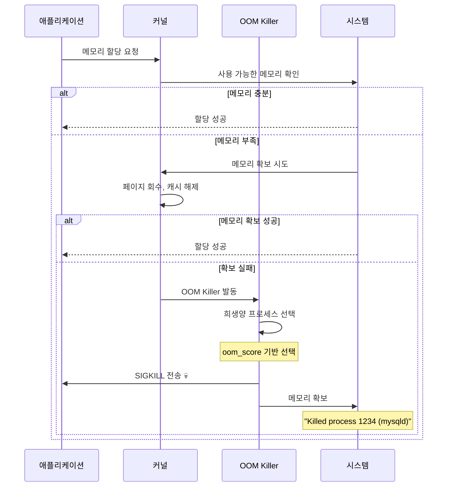
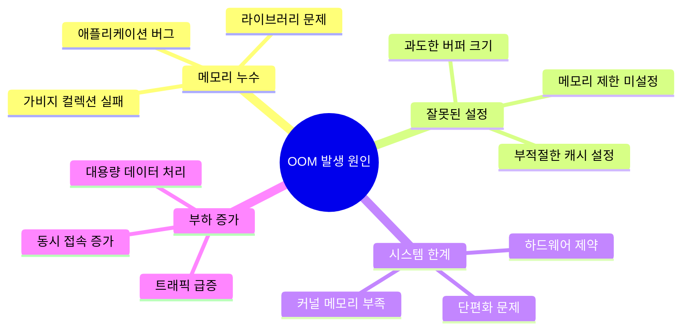

---
tags:
  - balanced
  - container_orchestration
  - intermediate
  - kernel_mechanisms
  - medium-read
  - memory_debugging
  - oom
  - system_monitoring
  - 시스템프로그래밍
difficulty: INTERMEDIATE
learning_time: "4-6시간"
main_topic: "시스템 프로그래밍"
priority_score: 4
---

# 3.7.8: OOM 디버깅

## 🎯 시스템 안정성을 위협하는 OOM 문제 완전 정복

"갑자기 데이터베이스가 죽었는데 로그에는 아무것도 없어요..."

OOM(Out of Memory)는 시스템의**마지막 방어선**이지만, 예측하기 어렵고 치명적인 결과를 낳을 수 있습니다.

### OOM의 근본 원인들

## 📚 학습 로드맵

이 섹션은 5개의 전문화된 문서로 구성되어 있습니다:

### 1️⃣ [OOM Killer 동작 원리](./03-06-01-oom-fundamentals.md)

- OOM Score 계산 메커니즘과 badness 함수 원리
- 실시간 OOM Score 모니터링 도구 구현
- oom_score_adj 조정을 통한 프로세스 보호 전략
- systemd OOM 정책 설정과 중요 프로세스 보호

### 2️⃣ [dmesg OOM 메시지 분석](./03-07-09-dmesg-log-analysis.md)

- dmesg에 기록되는 OOM 로그 메시지 해석법
- 자동 OOM 분석 도구로 패턴 발견하기
- 시스템 OOM 설정 파라미터 분석
- 반복적 OOM 발생 원인 진단과 해결책

### 3️⃣ [컨테이너 환경 OOM 디버깅](./03-06-04-cgroup-container-oom.md)

- cgroup OOM vs 시스템 OOM 차이점 이해
- Docker 컨테이너 메모리 제한과 OOM 대응
- Kubernetes Pod OOM 이벤트 모니터링
- 컨테이너별 메모리 최적화 전략

### 4️⃣ [Early OOM 및 예방 시스템](./03-06-05-early-oom-prevention.md)

- earlyoom과 커스텀 Early OOM 시스템 구축
- 메모리 압박 감지 및 자동 대응 시스템
- 워크로드별 OOM 방지 전략 수립
- 실무 권장사항과 모니터링 시스템 구축

### 5️⃣ [OOM 방지 모범 사례](./03-08-01-oom-best-practices.md)

- 생산 환경 OOM 방지 전략과 체크리스트
- 워크로드별 전문 OOM 대응 전략
- 용량 계획과 장기적 메모리 관리
- 조직 차원의 지속 가능한 OOM 관리 체계

## 🎯 핵심 개념 비교표

| 구분 | 시스템 OOM | cgroup OOM | Early OOM | 예방 전략 | 모범 사례 |
|------|------------|------------|-----------|----------|----------|
|**발생 시점**| 시스템 메모리 고갈 | 컨테이너 제한 초과 | 임계값 도달 | 사전 방지 | 설계 단계 |
|**대상 범위**| 전역 프로세스 | 컨테이너 내부 | 설정 가능 | 애플리케이션별 | 조직 전체 |
|**대응 방법**| Kernel OOM Killer | 컨테이너 재시작 | 조기 정리 | 리소스 제한 | 다층적 방어 |
|**모니터링**| dmesg, oom_score | docker events | 커스텀 스크립트 | Prometheus/Grafana | 용량 계획 |
|**목표**| 시스템 안정성 | 격리된 장애 | 예방적 개입 | 근본적 해결 | 지속 가능성 |

## 🚀 실전 활용 시나리오

### 운영 환경에서의 OOM 대응

- 데이터베이스 서버의 갑작스러운 종료 원인 분석
- 웹 애플리케이션의 메모리 누수 패턴 발견
- 마이크로서비스 환경에서의 컨테이너 OOM 최적화

### 개발 환경에서의 OOM 예방

- 개발 단계에서 메모리 사용 패턴 프로파일링
- 부하 테스트를 통한 메모리 한계점 파악
- CI/CD 파이프라인에서의 메모리 검증 자동화

## 🔗 연관 학습

### 선행 학습

- [메모리 관리 기초](./03-01-04-process-memory.md) - 프로세스 메모리 구조 이해
- [가상 메모리](./03-02-03-page-fault.md) - 페이지 폴트와 메모리 관리
- [메모리 매핑](./03-05-01-memory-mapping-optimization.md) - mmap과 메모리 최적화

### 후속 학습

- [프로세스 관리](../chapter-01-process-thread/01-02-01-process-creation.md) - 프로세스 생명주기
- [시스템 모니터링](../chapter-12-observability-debugging/index.md) - 종합 모니터링
- [성능 최적화](../chapter-11-performance-optimization/index.md) - 시스템 튜닝

---

**다음**: 먼저 [OOM Killer 동작 원리](./03-06-01-oom-fundamentals.md)에서 기본 개념을 학습하세요.

## 📚 관련 문서

### 📖 현재 문서 정보

-**난이도**: INTERMEDIATE
-**주제**: 시스템 프로그래밍
-**예상 시간**: 4-6시간

### 🎯 학습 경로

- [📚 INTERMEDIATE 레벨 전체 보기](../learning-paths/intermediate/)
- [🏠 메인 학습 경로](../learning-paths/)
- [📋 전체 가이드 목록](../README.md)

### 📂 같은 챕터 (chapter-03-memory-system)

- [Chapter 3-2-1: 주소 변환은 어떻게 동작하는가](./03-02-01-address-translation.md)
- [Chapter 3-2-2: TLB와 캐싱은 어떻게 동작하는가](./03-02-02-tlb-caching.md)
- [Chapter 3-2-3: 페이지 폴트와 메모리 관리 개요](./03-02-03-page-fault.md)
- [Chapter 3-2-4: 페이지 폴트 종류와 처리 메커니즘](./03-02-04-page-fault-handling.md)
- [Chapter 3-2-5: Copy-on-Write (CoW) - fork()가 빠른 이유](./03-02-05-copy-on-write.md)

### 🏷️ 관련 키워드

`oom`, `memory_debugging`, `kernel_mechanisms`, `system_monitoring`, `container_orchestration`

### ⏭️ 다음 단계 가이드

- 실무 적용을 염두에 두고 프로젝트에 적용해보세요
- 관련 도구들을 직접 사용해보는 것이 중요합니다
