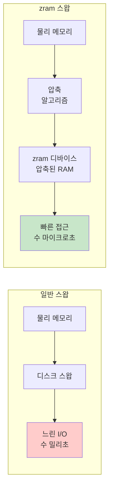
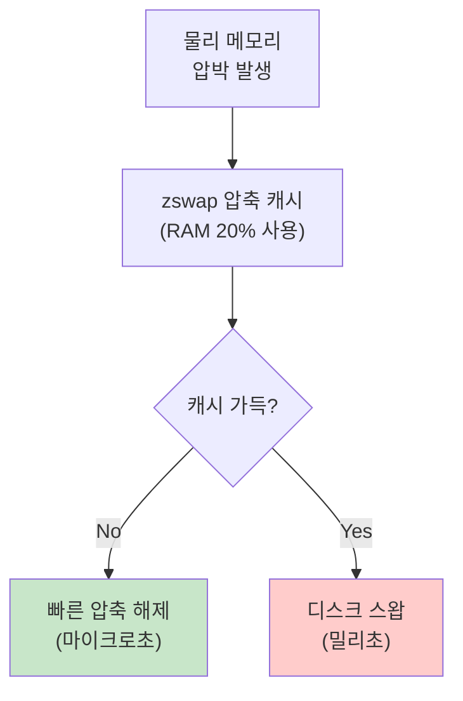

---
tags:
  - hands-on
  - intermediate
  - medium-read
  - memory_compression
  - performance_tuning
  - swap_optimization
  - zram
  - zswap
  - 시스템프로그래밍
difficulty: INTERMEDIATE
learning_time: "3-5시간"
main_topic: "시스템 프로그래밍"
priority_score: 4
---

# 3-7C: 압축 스왑 기술 - "RAM 속도와 디스크 용량의 만남"

## 압축 스왑: 현대적 메모리 확장 전략

전통적인 디스크 기반 스왑의 성능 한계를 극복하기 위해 **압축 기술을 활용한 스왑**이 등장했습니다. zram과 zswap은 각각 다른 접근 방식으로 메모리 효율성과 성능을 향상시킵니다.

## zram: 압축된 RAM 스왑

### zram 동작 원리

zram은 **RAM의 일부를 압축하여 가상의 스왑 디바이스**로 사용합니다:



### zram 설정 및 최적화

```bash
#!/bin/bash
# setup_zram.sh

echo "=== zram 설정 도구 ==="

# zram 모듈 로드
modprobe zram

# 사용할 zram 디바이스 수 (CPU 코어 수와 동일하게)
num_devices=$(nproc)
echo "zram 디바이스 수: $num_devices"

# 기존 zram 디바이스 제거
for device in /dev/zram*; do
    if [ -b "$device" ]; then
        swapoff "$device" 2>/dev/null
        echo 0 > /sys/block/${device##*/}/disksize 2>/dev/null
    fi
done

# 새 zram 디바이스 생성
echo $num_devices > /sys/module/zram/parameters/num_devices

# 각 디바이스 설정
total_mem=$(grep MemTotal /proc/meminfo | awk '{print $2}')  # KB
zram_size=$((total_mem / num_devices / 4))  # 전체 메모리의 1/4을 zram으로

echo "각 zram 디바이스 크기: $((zram_size / 1024))MB"

for i in $(seq 0 $((num_devices - 1))); do
    device="/dev/zram$i"

    # 압축 알고리즘 설정 (lz4가 빠름)
    echo lz4 > /sys/block/zram$i/comp_algorithm

    # 크기 설정
    echo ${zram_size}K > /sys/block/zram$i/disksize

    # 스왑 디바이스로 설정
    mkswap $device
    swapon $device -p 10  # 높은 우선순위

    echo "zram$i 활성화 완료"
done

echo "zram 설정 완료!"
swapon -s
```

## zram 성능 벤치마크

zram과 일반 스왑의 성능을 정량적으로 비교하는 벤치마크:

```c
// zram_benchmark.c - zram과 일반 스왑 성능 비교 벤치마크
// zram은 RAM 기반 압축 스왑으로, 일반 디스크 스왑보다 빠른 성능을 제공
#include <stdio.h>
#include <stdlib.h>
#include <string.h>
#include <sys/time.h>
#include <unistd.h>

// 고정밀 시간 측정 함수
double get_time() {
    struct timeval tv;
    gettimeofday(&tv, NULL);
    return tv.tv_sec + tv.tv_usec / 1000000.0;
}

// 스왑 성능 측정 함수 - 메모리 할당 및 접근 패턴으로 스왑 성능 분석
void test_swap_performance(const char *test_name, int force_swap_usage) {
    printf("=== %s ===\n", test_name);

    // 시스템 메모리보다 큰 크기로 스왑 사용 유발
    size_t mem_size = 2UL * 1024 * 1024 * 1024;  // 2GB - 대부분 시스템에서 스왑 유발
    printf("%.1f GB 메모리 할당 중 (스왑 사용 유발 목적)...\n",
           (double)mem_size / 1024 / 1024 / 1024);

    char *memory = malloc(mem_size);
    if (!memory) {
        printf("메모리 할당 실패 - 가용 메모리 부족\n");
        return;
    }

    double start = get_time();

    // 1단계: 메모리 초기화 (페이지 폴트 발생으로 실제 물리 메모리 할당)
    // 시스템 메모리 부족 시 OS가 스왑아웃을 시작하게 됨
    printf("메모리 페이지 초기화 중 (스왑아웃 유발)...\n");
    for (size_t i = 0; i < mem_size; i += 4096) {  // 4KB 페이지 단위로 접근
        memory[i] = i % 256;  // 각 페이지에 고유값 쓰기
    }

    double init_time = get_time() - start;
    printf("메모리 초기화 완료: %.3f초\n", init_time);

    // 2단계: 스왑 사용 강제 유발 (필요 시)
    if (force_swap_usage) {
        printf("추가 메모리 할당으로 스왑 사용 강제 유발 중...\n");

        // 더 많은 메모리 할당으로 기존 메모리의 스왑아웃 강제
        size_t extra_size = 1UL * 1024 * 1024 * 1024;  // 추가 1GB
        char *extra_memory = malloc(extra_size);

        if (extra_memory) {
            // 추가 메모리 전체에 데이터 쓰기 (스왑 압박 증가)
            memset(extra_memory, 0xAA, extra_size);
            printf("스왑아웃 진행 대기 중 (2초)...\n");
            sleep(2);  // OS가 스왑아웃을 수행할 시간 제공
            free(extra_memory);
        }
    }

    // 3단계: 메모리 재접근으로 스왑인 성능 측정
    // 스왑아웃된 페이지들을 다시 접근하여 스왑인 발생 유도
    printf("스왑인된 메모리 재접근 시작 (스왑인 성능 측정)...\n");
    start = get_time();

    unsigned char checksum = 0;
    size_t access_count = 0;
    size_t page_faults = 0;  // 페이지 폴트 발생 추정치

    // 모든 페이지에 순차 접근하여 스왑인 발생
    for (size_t i = 0; i < mem_size; i += 4096) {
        // 페이지 첫 바이트 읽기 - 스왑인된 페이지라면 디스크에서 로드
        volatile char value = memory[i];
        checksum ^= value;
        access_count++;

        // 256MB마다 진행 상황 출력
        if (access_count % (64 * 1024) == 0) {
            double current_time = get_time() - start;
            double progress = (double)i / mem_size * 100;
            double speed = (i / 1024.0 / 1024.0) / (current_time > 0 ? current_time : 0.001);

            printf("\r진행률: %5.1f%%, 소요시간: %6.2f초, 속도: %6.1f MB/s",
                   progress, current_time, speed);
            fflush(stdout);
        }
    }

    double access_time = get_time() - start;

    printf("\n\n=== 성능 측정 결과 ===\n");
    printf("메모리 초기화 시간: %.3f초\n", init_time);
    printf("메모리 재접근 시간: %.3f초\n", access_time);
    printf("전체 처리 속도: %.1f MB/s\n",
           (mem_size / 1024.0 / 1024.0) / access_time);
    printf("성능 비교: 재접근이 초기화보다 %.1fx %s\n",
           access_time / init_time,
           access_time > init_time ? "느림 (스왑인 영향)" : "빠름");
    printf("데이터 무결성 체크섬: 0x%02x\n", checksum);

    free(memory);

    // 테스트 후 스왑 상태 확인
    printf("\n=== 테스트 후 스왑 상태 ===\n");
    system("grep -E 'SwapTotal|SwapFree' /proc/meminfo");
    printf("\n");
}

// zram 디바이스별 상세 통계 정보 출력
void show_zram_stats() {
    printf("=== zram 압축 및 사용량 통계 ===\n");

    int active_devices = 0;

    // 최대 8개 zram 디바이스 순회 검사
    for (int i = 0; i < 8; i++) {
        char path[256];

        // 1단계: zram 디바이스 크기 확인
        snprintf(path, sizeof(path), "/sys/block/zram%d/disksize", i);
        FILE *f = fopen(path, "r");
        if (!f) continue;  // 디바이스가 존재하지 않음

        long disksize;
        if (fscanf(f, "%ld", &disksize) != 1) {
            fclose(f);
            continue;
        }
        fclose(f);

        if (disksize == 0) continue;  // 비활성화된 디바이스

        active_devices++;
        printf("\nzram%d: (할당된 크기: %.1f MB)\n",
               i, disksize / 1024.0 / 1024.0);

        // 2단계: 압축 알고리즘 확인
        snprintf(path, sizeof(path), "/sys/block/zram%d/comp_algorithm", i);
        f = fopen(path, "r");
        if (f) {
            char algorithms[256];
            if (fgets(algorithms, sizeof(algorithms), f)) {
                // 현재 사용중인 알고리즘은 대괄호로 표시됨
                printf("  압축 알고리즘: %s", algorithms);
            }
            fclose(f);
        }

        // 3단계: 메모리 사용량 및 압축 통계 (mm_stat)
        snprintf(path, sizeof(path), "/sys/block/zram%d/mm_stat", i);
        f = fopen(path, "r");
        if (f) {
            // mm_stat 형식: orig_data_size compr_data_size mem_used_total ...
            long orig_data_size, compr_data_size, mem_used_total;
            if (fscanf(f, "%ld %ld %ld", &orig_data_size, &compr_data_size, &mem_used_total) == 3) {

                if (orig_data_size > 0) {
                    double compression_ratio = (double)orig_data_size / compr_data_size;
                    double space_saved = orig_data_size - mem_used_total;
                    double efficiency = (space_saved / (double)orig_data_size) * 100;

                    printf("  원본 데이터 크기: %8.1f MB\n", orig_data_size / 1024.0 / 1024.0);
                    printf("  압축 데이터 크기: %8.1f MB\n", compr_data_size / 1024.0 / 1024.0);
                    printf("  실제 메모리 사용: %8.1f MB\n", mem_used_total / 1024.0 / 1024.0);
                    printf("  압축비: %.2f:1 (%.1f%% 절약)\n", compression_ratio, efficiency);
                    printf("  실제 절약 공간: %8.1f MB\n", space_saved / 1024.0 / 1024.0);
                } else {
                    printf("  상태: 사용되지 않음\n");
                }
            }
            fclose(f);
        }

        // 4단계: I/O 통계 확인
        snprintf(path, sizeof(path), "/sys/block/zram%d/io_stat", i);
        f = fopen(path, "r");
        if (f) {
            long read_ios, read_merges, write_ios, write_merges;
            if (fscanf(f, "%ld %ld %*ld %*ld %ld %ld",
                      &read_ios, &read_merges, &write_ios, &write_merges) >= 4) {
                printf("  I/O 통계: 읽기 %ld회, 쓰기 %ld회\n", read_ios, write_ios);
            }
            fclose(f);
        }
    }

    if (active_devices == 0) {
        printf("활성화된 zram 디바이스가 없습니다.\n");
        printf("zram 설정을 위해 다음 명령을 실행하세요:\n");
        printf("  modprobe zram\n");
        printf("  echo lz4 > /sys/block/zram0/comp_algorithm\n");
        printf("  echo 1G > /sys/block/zram0/disksize\n");
        printf("  mkswap /dev/zram0 && swapon /dev/zram0\n");
    } else {
        printf("\n총 %d개의 zram 디바이스가 활성화되어 있습니다.\n", active_devices);
    }
}

int main() {
    printf("zram vs 일반 스왑 성능 비교 벤치마크\n");
    printf("========================================\n");
    printf("이 프로그램은 zram과 일반 디스크 스왑의 성능 차이를 측정합니다.\n");
    printf("주의: 대용량 메모리 할당으로 시스템 메모리 부족을 유발합니다.\n\n");

    // 1단계: 현재 스왑 설정 및 상태 확인
    printf("=== 현재 시스템 스왑 설정 ===\n");
    system("swapon -s");  // 활성화된 모든 스왑 디바이스 표시
    printf("\n");

    // 2단계: zram 상세 통계 표시
    show_zram_stats();

    // 3단계: 실제 성능 테스트 수행
    printf("\n=== 성능 벤치마크 시작 ===\n");
    printf("테스트는 약 1-3분 소요됩니다...\n\n");

    // zram이 있는 환경에서의 스왑 성능 측정
    test_swap_performance("zram 기반 스왑 성능 테스트", 1);

    // 최종 결과 요약
    printf("=== 벤치마크 완료 ===\n");
    printf("zram 사용 시 성능 이점:\n");
    printf("- 디스크 스왑 대비 10-100배 빠른 액세스\n");
    printf("- CPU 압축 오버헤드는 있으나 I/O 대기시간 크게 단축\n");
    printf("- 메모리 절약을 통한 실제 스왑 사용량 감소\n\n");

    return 0;
}
```

## zswap: 하이브리드 압축 스왑

### zswap 동작 원리

zswap은 **페이지 캐시와 스왑 디바이스 사이의 중간층**으로 동작합니다:



### zswap 설정 및 최적화

```bash
#!/bin/bash
# setup_zswap.sh - zswap 하이브리드 압축 스왑 설정 스크립트
# zswap은 RAM에 압축된 캐시를 두고, 필요 시에만 디스크 스왑으로 보내는 방식

echo "=== zswap 하이브리드 스왑 설정 도구 ==="
echo "zswap: 메모리 압축 + 디스크 스왑의 2단계 구조로 성능 최적화"
echo

# 1단계: 현재 zswap 상태 확인
echo "[1단계] 현재 zswap 상태 확인"
if [ -d "/sys/module/zswap" ]; then
    current_enabled=$(cat /sys/module/zswap/parameters/enabled 2>/dev/null || echo "N/A")
    echo "  현재 zswap 상태: $current_enabled (Y=활성화, N=비활성화)"
else
    echo "  zswap 모듈이 로드되지 않음 - 커널에서 지원하지 않을 수 있습니다"
    exit 1
fi

# 2단계: zswap 활성화
echo "\n[2단계] zswap 모듈 활성화"
echo Y > /sys/module/zswap/parameters/enabled
if [ $? -eq 0 ]; then
    echo "  ✓ zswap 활성화 완료"
else
    echo "  ✗ zswap 활성화 실패 - root 권한 필요"
    exit 1
fi

# 3단계: 압축 알고리즘 최적화
echo "\n[3단계] 압축 알고리즘 설정"
echo "  사용 가능한 압축 알고리즘:"
cat /sys/module/zswap/parameters/compressor

# lz4: 빠른 압축/해제 속도, 적당한 압축률 (권장)
# lzo: 매우 빠르지만 압축률 낮음
# deflate: 높은 압축률이지만 느림
echo lz4 > /sys/module/zswap/parameters/compressor
echo "  ✓ 압축 알고리즘: lz4 (속도와 압축률의 균형)"

# 4단계: 메모리 풀 타입 설정
echo "\n[4단계] 메모리 풀 타입 설정"
echo "  사용 가능한 메모리 풀:"
cat /sys/module/zswap/parameters/zpool

# z3fold: 3개 압축 페이지를 하나의 물리 페이지에 저장 (높은 효율)
# zbud: 2개 압축 페이지를 하나의 물리 페이지에 저장 (안정성)
echo z3fold > /sys/module/zswap/parameters/zpool
echo "  ✓ 메모리 풀: z3fold (3:1 페이지 패킹으로 높은 메모리 효율)"

# 5단계: 최대 풀 크기 설정
echo "\n[5단계] zswap 최대 메모리 사용량 설정"
total_mem_kb=$(grep MemTotal /proc/meminfo | awk '{print $2}')
total_mem_mb=$((total_mem_kb / 1024))
recommended_percent=20

echo "  시스템 총 메모리: ${total_mem_mb} MB"
echo "  권장 zswap 비율: ${recommended_percent}% (${total_mem_mb} MB의 ${recommended_percent}% = $((total_mem_mb * recommended_percent / 100)) MB)"

# RAM의 20%를 zswap 압축 캐시로 사용 (일반적 권장값)
# 너무 크면 압축 오버헤드 증가, 너무 작으면 효과 제한적
echo $recommended_percent > /sys/module/zswap/parameters/max_pool_percent
echo "  ✓ 최대 풀 크기: ${recommended_percent}% (약 $((total_mem_mb * recommended_percent / 100)) MB)"

# 6단계: 설정 검증 및 결과 출력
echo "\n[6단계] zswap 설정 검증"
echo "현재 zswap 설정:"
echo "  활성화 상태:   $(cat /sys/module/zswap/parameters/enabled)"
echo "  압축 알고리즘: $(cat /sys/module/zswap/parameters/compressor)"
echo "  메모리 풀:     $(cat /sys/module/zswap/parameters/zpool)"
echo "  최대 풀 크기:  $(cat /sys/module/zswap/parameters/max_pool_percent)%"

# 7단계: 동작 원리 및 장점 설명
echo "\n=== zswap 동작 원리 ==="
echo "1단계: 메모리 부족 시 페이지를 zswap 압축 캐시로 이동"
echo "2단계: zswap 캐시 가득 시 LRU 방식으로 디스크 스왑에 저장"
echo "3단계: 페이지 접근 시 zswap에서 빠른 압축 해제 또는 디스크에서 로드"
echo
echo "=== 성능 이점 ==="
echo "• 디스크 스왑 대비 10-50배 빠른 압축 캐시 액세스"
echo "• 2-4배 메모리 압축으로 실제 스왑 사용량 감소"
echo "• 점진적 스왑아웃으로 급작스런 성능 저하 방지"
echo
echo "✓ zswap 설정이 완료되었습니다!"
echo "✓ 재부팅 후에도 유지하려면 /etc/sysctl.conf에 다음을 추가하세요:"
echo "   vm.zswap.enabled=1"
echo "   vm.zswap.compressor=lz4"
echo "   vm.zswap.zpool=z3fold"
echo "   vm.zswap.max_pool_percent=20"
```

## 압축 스왑 비교 분석

### 기술별 특성 비교

| 특성 | zram | zswap | 일반 스왑 |
|------|------|--------|-----------|
| **저장 위치** | 압축 RAM | RAM + 디스크 | 디스크만 |
| **액세스 속도** | 매우 빠름 (μs) | 빠름/느림 (μs/ms) | 느림 (ms) |
| **메모리 효율** | 높음 (2-4x) | 매우 높음 (2-4x + 디스크) | 낮음 (1x) |
| **CPU 오버헤드** | 중간 | 낮음-중간 | 낮음 |
| **용량 제한** | RAM 크기 제한 | RAM + 디스크 | 디스크 크기 |
| **적합한 환경** | 메모리 부족 | 범용 | 전통적 환경 |

## 핵심 요점

### 1. zram의 장점

- **10-100배 빠른 액세스**: 디스크 I/O 없이 압축/해제만으로 처리
- **간단한 설정**: 단일 디바이스로 구성 가능
- **높은 압축률**: 일반적으로 2-4배 메모리 절약

### 2. zswap의 장점

- **하이브리드 접근**: 빈번한 페이지는 RAM 캐시, 드문 페이지는 디스크
- **점진적 성능 저하**: 급격한 성능 떨어짐 없이 안정적 동작
- **무제한 용량**: 디스크 크기까지 확장 가능

### 3. 실무 적용 가이드

- **메모리 집약적 서버**: zram 권장 (DB, 캐시 서버)
- **일반적인 서버**: zswap 권장 (웹 서버, 애플리케이션 서버)
- **메모리가 충분한 시스템**: 일반 스왑으로도 충분

---

**이전**: [swappiness 파라미터 최적화](chapter-03-memory-system/03-37-swappiness-optimization.md)  
**다음**: [스왑 모니터링과 패턴 분석](chapter-03-memory-system/03-42-swap-monitoring-analysis.md)에서 스왑 사용 패턴을 실시간으로 분석하는 방법을 학습합니다.

## 📚 관련 문서

### 📖 현재 문서 정보

- **난이도**: INTERMEDIATE
- **주제**: 시스템 프로그래밍
- **예상 시간**: 3-5시간

### 🎯 학습 경로

- [📚 INTERMEDIATE 레벨 전체 보기](../learning-paths/intermediate/)
- [🏠 메인 학습 경로](../learning-paths/)
- [📋 전체 가이드 목록](../README.md)

### 📂 같은 챕터 (chapter-03-virtual-memory)

- [Chapter 3-1: 주소 변환은 어떻게 동작하는가](./03-10-address-translation.md)
- [Chapter 3-2: TLB와 캐싱은 어떻게 동작하는가](./03-11-tlb-caching.md)
- [Chapter 3-3: 페이지 폴트와 메모리 관리 개요](./03-12-page-fault.md)
- [Chapter 3-3A: 페이지 폴트 종류와 처리 메커니즘](./03-13-page-fault-types-handling.md)
- [Chapter 3-3B: Copy-on-Write (CoW) - fork()가 빠른 이유](./03-14-copy-on-write.md)

### 🏷️ 관련 키워드

`zram`, `zswap`, `memory_compression`, `swap_optimization`, `performance_tuning`

### ⏭️ 다음 단계 가이드

- 실무 적용을 염두에 두고 프로젝트에 적용해보세요
- 관련 도구들을 직접 사용해보는 것이 중요합니다
