---
tags:
  - access-patterns
  - deep-study
  - hands-on
  - intermediate
  - madvise
  - memory-hints
  - memory-optimization
  - prefetch
  - 시스템프로그래밍
difficulty: INTERMEDIATE
learning_time: "5-7시간"
main_topic: "시스템 프로그래밍"
priority_score: 4
---

# 3-6B: madvise 패턴 활용

## 운영체제에게 힌트 제공하기

madvise는 운영체제에게 메모리 사용 패턴을 알려줘서 최적화를 도울 수 있는 강력한 도구입니다. 올바른 힌트 제공은 성능을 20-50% 향상시킬 수 있습니다.

```mermaid
graph LR
    subgraph "madvise 패턴들"
        SEQUENTIAL["MADV_SEQUENTIAL<br/>순차 접근 예정<br/>→ 적극적 prefetch"]
        RANDOM["MADV_RANDOM<br/>랜덤 접근 예정<br/>→ prefetch 비활성화"]
        WILLNEED["MADV_WILLNEED<br/>곧 사용 예정<br/>→ 미리 로드"]
        DONTNEED["MADV_DONTNEED<br/>더 이상 불필요<br/>→ 캐시에서 제거"]
    end

    subgraph "성능 효과"
        SEQUENTIAL --> PREFETCH["읽기 성능 향상<br/>캐시 히트율 증가"]
        RANDOM --> EFFICIENT["불필요한 prefetch 방지<br/>메모리 절약"]
        WILLNEED --> PRELOAD["접근 전 미리 로드<br/>지연시간 단축"]
        DONTNEED --> MEMORY["메모리 확보<br/>다른 프로세스 도움"]
    end
```



## 순차 접근 최적화

순차 접근 패턴에서는 운영체제의 prefetch 메커니즘을 적극 활용할 수 있습니다:

```c
// sequential_optimization.c - 순차 접근 패턴 최적화
#include <stdio.h>
#include <sys/mman.h>
#include <fcntl.h>
#include <sys/stat.h>
#include <sys/time.h>

double get_time() {
    struct timeval tv;
    gettimeofday(&tv, NULL);
    return tv.tv_sec + tv.tv_usec / 1000000.0;
}

// 순차 접근 + madvise 힌트 최적화
void test_sequential_with_hints(const char *filename) {
    printf("=== MADV_SEQUENTIAL + WILLNEED/DONTNEED ===\n");

    int fd = open(filename, O_RDONLY);
    struct stat st;
    fstat(fd, &st);

    char *mapped = mmap(NULL, st.st_size, PROT_READ, MAP_PRIVATE, fd, 0);

    // 핵심: OS에게 순차 접근 패턴 알림 -> 적극적 prefetch
    madvise(mapped, st.st_size, MADV_SEQUENTIAL);

    double start = get_time();
    const size_t chunk_size = 64 * 1024;  // 64KB 청크

    for (size_t offset = 0; offset < st.st_size; offset += chunk_size) {
        size_t size = (offset + chunk_size > st.st_size) ?
                      (st.st_size - offset) : chunk_size;

        // 미리 prefetch 요청 - 지연시간 줄임
        madvise(mapped + offset, size, MADV_WILLNEED);

        // 체크섬 계산 (실제 데이터 처리 시뮬레이션)
        unsigned char checksum = 0;
        for (size_t i = 0; i < size; i++) {
            checksum ^= mapped[offset + i];
        }

        // 처리 완료된 이전 청크는 캐시에서 제거
        if (offset >= chunk_size) {
            madvise(mapped + offset - chunk_size, chunk_size, MADV_DONTNEED);
        }

        printf("\r진행률: %.1f%%", (double)offset / st.st_size * 100);
        fflush(stdout);
    }

    double elapsed = get_time() - start;
    printf("\n순차 처리 완료: %.3f초 (%.1f MB/s)\n",
           elapsed, (st.st_size / 1024.0 / 1024.0) / elapsed);

    munmap(mapped, st.st_size);
    close(fd);
}

// 순차 접근의 성능 향상 측정
void benchmark_sequential_hints(const char *filename) {
    printf("=== 순차 접근 madvise 효과 비교 ===\n");
    
    // 1. 힌트 없이 처리
    double no_hint_time = process_without_hints(filename);
    
    // 2. MADV_SEQUENTIAL 적용
    double sequential_time = process_with_sequential(filename);
    
    // 3. MADV_SEQUENTIAL + WILLNEED/DONTNEED 조합
    double optimized_time = process_fully_optimized(filename);
    
    printf("성능 비교 결과:\n");
    printf("  힌트 없음:     %.3f초 (기준)\n", no_hint_time);
    printf("  SEQUENTIAL:    %.3f초 (%.1f%% 향상)\n", 
           sequential_time, (no_hint_time - sequential_time) / no_hint_time * 100);
    printf("  완전 최적화:   %.3f초 (%.1f%% 향상)\n", 
           optimized_time, (no_hint_time - optimized_time) / no_hint_time * 100);
}
```

## 랜덤 접근 최적화

랜덤 접근 패턴에서는 불필요한 prefetch를 방지하는 것이 핵심입니다:

```c
// random_access_optimization.c - 랜덤 접근 패턴 최적화
void test_random_with_hints(const char *filename) {
    printf("=== MADV_RANDOM - prefetch 비활성화 ===\n");

    int fd = open(filename, O_RDONLY);
    struct stat st;
    fstat(fd, &st);

    char *mapped = mmap(NULL, st.st_size, PROT_READ, MAP_PRIVATE, fd, 0);

    // 핵심: 랜덤 접근 패턴 알림 -> 불필요한 prefetch 비활성화
    madvise(mapped, st.st_size, MADV_RANDOM);

    double start = get_time();
    srand(42);
    const int accesses = 50000;

    for (int i = 0; i < accesses; i++) {
        size_t offset = rand() % (st.st_size - 4096);

        // 해당 페이지만 미리 로드 요청
        madvise(mapped + offset, 4096, MADV_WILLNEED);

        volatile char data = mapped[offset];  // 실제 데이터 접근

        if (i % 10000 == 0) {
            printf("\r랜덤 접근: %d/%d", i, accesses);
            fflush(stdout);
        }
    }

    double elapsed = get_time() - start;
    printf("\n랜덤 접근 완료: %.3f초 (%.0f ops/s)\n",
           elapsed, accesses / elapsed);

    munmap(mapped, st.st_size);
    close(fd);
}

// 지능형 랜덤 접근 최적화
void intelligent_random_access(const char *filename) {
    printf("=== 지능형 랜덤 접근 최적화 ===\n");
    
    int fd = open(filename, O_RDONLY);
    struct stat st;
    fstat(fd, &st);
    
    char *mapped = mmap(NULL, st.st_size, PROT_READ, MAP_PRIVATE, fd, 0);
    madvise(mapped, st.st_size, MADV_RANDOM);
    
    // 접근 패턴 분석을 위한 히트맵
    const size_t page_size = 4096;
    const size_t num_pages = (st.st_size + page_size - 1) / page_size;
    unsigned char *access_count = calloc(num_pages, sizeof(unsigned char));
    
    double start = get_time();
    srand(42);
    const int total_accesses = 100000;
    
    for (int i = 0; i < total_accesses; i++) {
        size_t offset = rand() % (st.st_size - 1024);
        size_t page_idx = offset / page_size;
        
        // 접근 빈도 추적
        if (access_count[page_idx] < 255) {
            access_count[page_idx]++;
        }
        
        // 자주 접근하는 페이지는 미리 로드
        if (access_count[page_idx] > 5) {
            madvise(mapped + (page_idx * page_size), page_size, MADV_WILLNEED);
        }
        
        volatile char data = mapped[offset];
        
        // 진행률 표시
        if (i % 20000 == 0) {
            printf("\r진행률: %.1f%%", (double)i / total_accesses * 100);
            fflush(stdout);
        }
    }
    
    double elapsed = get_time() - start;
    
    // 접근 패턴 분석
    int hot_pages = 0;
    for (size_t i = 0; i < num_pages; i++) {
        if (access_count[i] > 5) hot_pages++;
    }
    
    printf("\n지능형 랜덤 접근 결과:\n");
    printf("  총 처리 시간: %.3f초\n", elapsed);
    printf("  처리 속도: %.0f ops/s\n", total_accesses / elapsed);
    printf("  핫 페이지: %d/%zu (%.1f%%)\n", 
           hot_pages, num_pages, (double)hot_pages / num_pages * 100);
    
    free(access_count);
    munmap(mapped, st.st_size);
    close(fd);
}
```

## 메모리 압박 상황 관리

시스템 메모리가 부족할 때 MADV_DONTNEED를 활용한 적극적인 메모리 관리:

```c
// memory_pressure_management.c - 메모리 압박 상황 관리
void demonstrate_memory_cleanup() {
    printf("=== MADV_DONTNEED - 메모리 정리 ===\n");

    const size_t size = 128 * 1024 * 1024;  // 128MB
    void *memory = malloc(size);

    // 메모리를 채워서 물리 페이지 할당 유도
    memset(memory, 1, size);
    printf("메모리 할당 및 초기화 완료 (128MB)\n");

    // 메모리 사용량 모니터링
    print_memory_stats("할당 후");

    // 잠시 후 이 메모리를 더 이상 사용하지 않음
    sleep(1);

    // OS에게 이 메모리를 스왑/캐시에서 제거해도 된다고 알리기
    if (madvise(memory, size, MADV_DONTNEED) == 0) {
        printf("MADV_DONTNEED 성공 - 물리 메모리 확보\n");
    }

    print_memory_stats("DONTNEED 후");

    free(memory);
    printf("메모리 해제 완료\n");
}

// 동적 메모리 압박 관리자
typedef struct {
    void *memory;
    size_t size;
    time_t last_access;
    int priority;
} memory_region_t;

typedef struct {
    memory_region_t *regions;
    size_t count;
    size_t capacity;
    size_t total_memory;
    size_t memory_limit;
} memory_manager_t;

memory_manager_t* create_memory_manager(size_t limit) {
    memory_manager_t *mgr = malloc(sizeof(memory_manager_t));
    mgr->regions = malloc(sizeof(memory_region_t) * 100);
    mgr->count = 0;
    mgr->capacity = 100;
    mgr->total_memory = 0;
    mgr->memory_limit = limit;
    return mgr;
}

void manage_memory_pressure(memory_manager_t *mgr) {
    if (mgr->total_memory <= mgr->memory_limit) {
        return;  // 메모리 압박 없음
    }
    
    printf("메모리 압박 상황 - 정리 시작 (사용량: %.1f MB / 한계: %.1f MB)\n",
           mgr->total_memory / 1024.0 / 1024.0,
           mgr->memory_limit / 1024.0 / 1024.0);
    
    // 우선순위와 마지막 접근 시간으로 정렬
    qsort(mgr->regions, mgr->count, sizeof(memory_region_t), compare_regions);
    
    size_t freed = 0;
    time_t now = time(NULL);
    
    for (size_t i = 0; i < mgr->count && mgr->total_memory > mgr->memory_limit; i++) {
        memory_region_t *region = &mgr->regions[i];
        
        // 5분 이상 사용하지 않은 낮은 우선순위 메모리 정리
        if (now - region->last_access > 300 && region->priority < 5) {
            madvise(region->memory, region->size, MADV_DONTNEED);
            mgr->total_memory -= region->size;
            freed += region->size;
            
            printf("  메모리 영역 정리: %.1f MB (우선순위: %d)\n",
                   region->size / 1024.0 / 1024.0, region->priority);
        }
    }
    
    printf("메모리 정리 완료: %.1f MB 확보\n", freed / 1024.0 / 1024.0);
}
```

## 실전 madvise 활용 패턴

실무에서 자주 사용되는 madvise 패턴들:

```c
// practical_madvise_patterns.c - 실전 활용 패턴
typedef enum {
    ACCESS_UNKNOWN,
    ACCESS_SEQUENTIAL,
    ACCESS_RANDOM,
    ACCESS_MIXED
} access_pattern_t;

typedef struct {
    char *mapped_memory;
    size_t file_size;
    access_pattern_t pattern;
    size_t window_size;
    size_t current_pos;
    
    // 성능 통계
    size_t prefetch_hits;
    size_t prefetch_misses;
    double total_access_time;
} smart_mmap_t;

smart_mmap_t* create_smart_mmap(const char *filename, size_t window_size) {
    smart_mmap_t *sm = malloc(sizeof(smart_mmap_t));
    
    int fd = open(filename, O_RDONLY);
    struct stat st;
    fstat(fd, &st);
    
    sm->mapped_memory = mmap(NULL, st.st_size, PROT_READ, MAP_PRIVATE, fd, 0);
    sm->file_size = st.st_size;
    sm->window_size = window_size;
    sm->current_pos = 0;
    sm->pattern = ACCESS_UNKNOWN;
    sm->prefetch_hits = 0;
    sm->prefetch_misses = 0;
    sm->total_access_time = 0;
    
    close(fd);
    return sm;
}

void optimize_access_pattern(smart_mmap_t *sm) {
    switch (sm->pattern) {
        case ACCESS_SEQUENTIAL:
            // 순차 접근 최적화
            madvise(sm->mapped_memory, sm->file_size, MADV_SEQUENTIAL);
            
            // 다음 윈도우 prefetch
            if (sm->current_pos + sm->window_size < sm->file_size) {
                madvise(sm->mapped_memory + sm->current_pos + sm->window_size,
                       sm->window_size, MADV_WILLNEED);
            }
            break;
            
        case ACCESS_RANDOM:
            // 랜덤 접근 최적화
            madvise(sm->mapped_memory, sm->file_size, MADV_RANDOM);
            break;
            
        case ACCESS_MIXED:
            // 혼합 패턴: 동적으로 조정
            adapt_to_mixed_pattern(sm);
            break;
            
        default:
            // 패턴 미확인: 학습 모드
            learn_access_pattern(sm);
            break;
    }
}

void adapt_to_mixed_pattern(smart_mmap_t *sm) {
    // 최근 접근 패턴 분석
    static size_t last_positions[10];
    static int pos_index = 0;
    
    last_positions[pos_index % 10] = sm->current_pos;
    pos_index++;
    
    if (pos_index >= 10) {
        // 순차성 측정
        int sequential_count = 0;
        for (int i = 1; i < 10; i++) {
            if (last_positions[i] > last_positions[i-1]) {
                sequential_count++;
            }
        }
        
        if (sequential_count > 7) {
            // 대부분 순차 접근
            madvise(sm->mapped_memory + sm->current_pos, 
                   sm->window_size * 2, MADV_SEQUENTIAL);
        } else {
            // 대부분 랜덤 접근
            madvise(sm->mapped_memory + sm->current_pos, 
                   sm->window_size, MADV_RANDOM);
        }
    }
}

// 접근 패턴 학습
void learn_access_pattern(smart_mmap_t *sm) {
    static size_t access_history[100];
    static int history_count = 0;
    
    access_history[history_count % 100] = sm->current_pos;
    history_count++;
    
    if (history_count >= 20) {
        // 패턴 분석
        int sequential_score = 0;
        int random_score = 0;
        
        for (int i = 1; i < 20; i++) {
            size_t prev = access_history[(history_count - i - 1) % 100];
            size_t curr = access_history[(history_count - i) % 100];
            
            if (abs((int)curr - (int)prev) < sm->window_size) {
                sequential_score++;
            } else {
                random_score++;
            }
        }
        
        if (sequential_score > random_score * 2) {
            sm->pattern = ACCESS_SEQUENTIAL;
            printf("접근 패턴 감지: 순차 접근\n");
        } else if (random_score > sequential_score * 2) {
            sm->pattern = ACCESS_RANDOM;
            printf("접근 패턴 감지: 랜덤 접근\n");
        } else {
            sm->pattern = ACCESS_MIXED;
            printf("접근 패턴 감지: 혼합 접근\n");
        }
    }
}

// 성능 통계 출력
void print_mmap_stats(smart_mmap_t *sm) {
    printf("\n=== Smart mmap 성능 통계 ===\n");
    printf("파일 크기: %.1f MB\n", sm->file_size / 1024.0 / 1024.0);
    printf("접근 패턴: %s\n", 
           sm->pattern == ACCESS_SEQUENTIAL ? "순차" :
           sm->pattern == ACCESS_RANDOM ? "랜덤" :
           sm->pattern == ACCESS_MIXED ? "혼합" : "미확인");
    printf("Prefetch 히트율: %.1f%% (%zu/%zu)\n",
           (double)sm->prefetch_hits / (sm->prefetch_hits + sm->prefetch_misses) * 100,
           sm->prefetch_hits, sm->prefetch_hits + sm->prefetch_misses);
    printf("평균 접근 시간: %.3f ms\n", sm->total_access_time * 1000);
}
```

## 고급 메모리 힌트 전략

복잡한 워크로드를 위한 고급 madvise 전략:

```c
// advanced_memory_hints.c - 고급 메모리 힌트 전략

// 계층적 메모리 관리
typedef struct {
    void *hot_memory;      // 자주 사용되는 메모리
    void *warm_memory;     // 가끔 사용되는 메모리
    void *cold_memory;     // 거의 사용하지 않는 메모리
    size_t hot_size, warm_size, cold_size;
} tiered_memory_t;

void manage_tiered_memory(tiered_memory_t *tm) {
    // Hot memory: 항상 메모리에 유지
    madvise(tm->hot_memory, tm->hot_size, MADV_WILLNEED);
    
    // Warm memory: 필요시 로드
    // (힌트 없음 - OS의 기본 정책 사용)
    
    // Cold memory: 적극적으로 스왑 허용
    madvise(tm->cold_memory, tm->cold_size, MADV_DONTNEED);
}

// 워크로드 기반 자동 최적화
void auto_optimize_workload(const char *filename, workload_type_t type) {
    int fd = open(filename, O_RDONLY);
    struct stat st;
    fstat(fd, &st);
    
    char *mapped = mmap(NULL, st.st_size, PROT_READ, MAP_PRIVATE, fd, 0);
    
    switch (type) {
        case WORKLOAD_LOG_ANALYSIS:
            // 로그 분석: 순차 접근 + 청크 단위 정리
            madvise(mapped, st.st_size, MADV_SEQUENTIAL);
            printf("로그 분석 워크로드 최적화 적용\n");
            break;
            
        case WORKLOAD_DATABASE:
            // 데이터베이스: 랜덤 접근 + 핫 페이지 유지
            madvise(mapped, st.st_size, MADV_RANDOM);
            printf("데이터베이스 워크로드 최적화 적용\n");
            break;
            
        case WORKLOAD_SCIENTIFIC:
            // 과학 계산: 대용량 순차 + 메모리 집약적
            madvise(mapped, st.st_size, MADV_SEQUENTIAL);
            madvise(mapped, st.st_size, MADV_HUGEPAGE);  // Huge pages 요청
            printf("과학 계산 워크로드 최적화 적용\n");
            break;
            
        case WORKLOAD_STREAMING:
            // 스트리밍: 윈도우 기반 + 적극적 정리
            setup_streaming_optimization(mapped, st.st_size);
            printf("스트리밍 워크로드 최적화 적용\n");
            break;
    }
    
    close(fd);
}
```

## 핵심 요점

### madvise 패턴별 효과

- **MADV_SEQUENTIAL**: 순차 접근에서 20-40% 성능 향상
- **MADV_RANDOM**: 랜덤 접근에서 메모리 효율성 15-25% 개선  
- **MADV_WILLNEED**: 지연시간 50-80% 단축 (prefetch 효과)
- **MADV_DONTNEED**: 메모리 압박 상황에서 즉각적인 메모리 확보

### 실무 적용 가이드라인

- **접근 패턴 분석 후 적절한 힌트 선택**
- **동적 패턴 변화에 대응하는 적응형 전략**
- **메모리 압박 상황에서의 적극적인 DONTNEED 활용**
- **워크로드별 맞춤형 최적화 패턴 적용**

---

**이전**: [mmap vs read/write 성능 비교](./03-32-mmap-performance-comparison.md)  
**다음**: [Huge Pages 최적화](./03-34-huge-pages-optimization.md)에서 TLB 효율성 극대화 방법을 학습합니다.

## 📚 관련 문서

### 📖 현재 문서 정보

- **난이도**: INTERMEDIATE
- **주제**: 시스템 프로그래밍
- **예상 시간**: 5-7시간

### 🎯 학습 경로

- [📚 INTERMEDIATE 레벨 전체 보기](../learning-paths/intermediate/)
- [🏠 메인 학습 경로](../learning-paths/)
- [📋 전체 가이드 목록](../README.md)

### 📂 같은 챕터 (chapter-03-memory-system)

- [Chapter 3-1: 주소 변환은 어떻게 동작하는가](./03-10-address-translation.md)
- [Chapter 3-2: TLB와 캐싱은 어떻게 동작하는가](./03-11-tlb-caching.md)
- [Chapter 3-3: 페이지 폴트와 메모리 관리 개요](./03-12-page-fault.md)
- [Chapter 3-3A: 페이지 폴트 종류와 처리 메커니즘](./03-13-page-fault-types-handling.md)
- [Chapter 3-3B: Copy-on-Write (CoW) - fork()가 빠른 이유](./03-14-copy-on-write.md)

### 🏷️ 관련 키워드

`madvise`, `memory-optimization`, `prefetch`, `access-patterns`, `memory-hints`

### ⏭️ 다음 단계 가이드

- 실무 적용을 염두에 두고 프로젝트에 적용해보세요
- 관련 도구들을 직접 사용해보는 것이 중요합니다
