---
tags:
  - advanced
  - deep-study
  - hands-on
  - huge-pages
  - memory-performance
  - numa
  - system-tuning
  - tlb-optimization
  - 시스템프로그래밍
difficulty: ADVANCED
learning_time: "8-12시간"
main_topic: "시스템 프로그래밍"
priority_score: 4
---

# 3-6C: Huge Pages 최적화

## TLB 효율성의 혁명

일반적인 4KB 페이지 대신 2MB 또는 1GB 페이지를 사용하면 TLB(Translation Lookaside Buffer) 효율성이 극적으로 향상됩니다. 메모리 집약적 애플리케이션에서 10-30%의 성능 향상을 기대할 수 있습니다.

```mermaid
graph LR
    subgraph "일반 페이지 (4KB)"
        NORMAL_DATA[1GB 데이터] --> NORMAL_PAGES["256,000개<br/>4KB 페이지"]
        NORMAL_PAGES --> NORMAL_TLB["TLB 엔트리<br/>256,000개 필요"]
        NORMAL_TLB --> NORMAL_MISS["TLB 미스<br/>빈번 발생"]
    end

    subgraph "Huge 페이지 (2MB)"
        HUGE_DATA[1GB 데이터] --> HUGE_PAGES["512개<br/>2MB 페이지"]
        HUGE_PAGES --> HUGE_TLB["TLB 엔트리<br/>512개만 필요"]
        HUGE_TLB --> HUGE_HIT["TLB 히트<br/>성능 향상"]
    end

    style HUGE_HIT fill:#c8e6c9
    style NORMAL_MISS fill:#ffcccb
```



## Huge Pages 설정과 관리

### 시스템 설정

```bash
#!/bin/bash
# hugepages_setup.sh - Huge Pages 설정 스크립트

echo "=== Huge Pages 설정 및 테스트 ==="

# 현재 Huge Pages 상태 확인
echo "1. 현재 Huge Pages 상태:"
grep -E "HugePages|Hugepagesize" /proc/meminfo

# Transparent Huge Pages 상태 확인
echo -e "\n2. THP 상태:"
cat /sys/kernel/mm/transparent_hugepage/enabled
cat /sys/kernel/mm/transparent_hugepage/defrag

# 현재 사용 가능한 메모리 확인
echo -e "\n3. 메모리 상태:"
free -h

# 2MB Huge Pages 예약 (root 권한 필요)
if [ "$EUID" -eq 0 ]; then
    echo -e "\n4. 100개 2MB Huge Pages 예약..."
    echo 100 > /proc/sys/vm/nr_hugepages

    # 결과 확인
    echo "예약 후 상태:"
    grep HugePages_Total /proc/meminfo
    grep HugePages_Free /proc/meminfo

    # Huge Pages 파일시스템 마운트
    if ! mountpoint -q /mnt/hugepages; then
        mkdir -p /mnt/hugepages
        mount -t hugetlbfs none /mnt/hugepages
        echo "Huge Pages 파일시스템 마운트 완료: /mnt/hugepages"
    fi

    # 권한 설정
    chmod 755 /mnt/hugepages
    echo "Huge Pages 설정 완료"
else
    echo "root 권한이 필요합니다 (sudo 사용)"
    echo "다음 명령어를 실행하세요:"
    echo "  sudo echo 100 > /proc/sys/vm/nr_hugepages"
    echo "  sudo mkdir -p /mnt/hugepages"  
    echo "  sudo mount -t hugetlbfs none /mnt/hugepages"
fi

echo -e "\n5. 최종 Huge Pages 상태:"
cat /proc/meminfo | grep -i huge
```

### 영구 설정

```bash
# /etc/sysctl.conf에 추가
vm.nr_hugepages = 100

# 부팅시 자동 마운트 (/etc/fstab에 추가)
none /mnt/hugepages hugetlbfs defaults 0 0

# 애플리케이션 사용자 그룹 설정
sudo groupadd hugepages
sudo usermod -a -G hugepages $USER
```

## Huge Pages 성능 벤치마크

실제 성능 차이를 측정해봅시다:

```c
// hugepages_benchmark.c - Huge Pages 성능 측정
#include <stdio.h>
#include <stdlib.h>
#include <sys/mman.h>
#include <sys/time.h>
#include <fcntl.h>
#include <unistd.h>

#define ARRAY_SIZE (512 * 1024 * 1024)  // 512MB
#define HUGEPAGE_SIZE (2 * 1024 * 1024)  // 2MB

double get_time() {
    struct timeval tv;
    gettimeofday(&tv, NULL);
    return tv.tv_sec + tv.tv_usec / 1000000.0;
}

void test_normal_pages() {
    printf("=== 일반 페이지 (4KB) 테스트 ===\n");

    // 일반 malloc 할당
    char *array = malloc(ARRAY_SIZE);
    if (!array) {
        perror("malloc failed");
        return;
    }

    // 메모리 초기화하여 페이지 할당
    memset(array, 1, ARRAY_SIZE);
    printf("메모리 할당 및 초기화 완료 (512MB)\n");

    double start = get_time();

    // 랜덤 메모리 접근으로 TLB 미스 유발
    srand(42);
    const int accesses = 1000000;

    for (int i = 0; i < accesses; i++) {
        int idx = rand() % (ARRAY_SIZE - 64);
        array[idx] = i % 256;

        // 캐시 라인 전체 접근
        for (int j = 0; j < 64; j += 8) {
            volatile char c = array[idx + j];
        }
    }

    double end = get_time();

    printf("일반 페이지 결과:\n");
    printf("  소요 시간: %.3f 초\n", end - start);
    printf("  초당 접근: %.0f ops/s\n", accesses / (end - start));
    printf("  메모리 처리량: %.1f MB/s\n", 
           (accesses * 64.0 / 1024 / 1024) / (end - start));

    free(array);
}

void test_hugepages() {
    printf("\n=== Huge Pages (2MB) 테스트 ===\n");

    // Huge Pages 파일 생성
    int fd = open("/mnt/hugepages/test", O_CREAT | O_RDWR, 0755);
    if (fd < 0) {
        perror("hugepage file creation failed");
        printf("Huge Pages가 마운트되지 않았을 수 있습니다.\n");
        return;
    }

    // 파일 크기 설정
    if (ftruncate(fd, ARRAY_SIZE) != 0) {
        perror("ftruncate failed");
        close(fd);
        return;
    }

    // Huge Pages로 메모리 매핑
    char *array = mmap(NULL, ARRAY_SIZE, PROT_READ | PROT_WRITE,
                       MAP_SHARED, fd, 0);
    if (array == MAP_FAILED) {
        perror("hugepage mmap failed");
        close(fd);
        return;
    }

    // 메모리 초기화
    memset(array, 1, ARRAY_SIZE);
    printf("Huge Pages 메모리 할당 및 초기화 완료 (512MB)\n");

    double start = get_time();

    // 동일한 랜덤 접근 패턴
    srand(42);
    const int accesses = 1000000;

    for (int i = 0; i < accesses; i++) {
        int idx = rand() % (ARRAY_SIZE - 64);
        array[idx] = i % 256;

        // 캐시 라인 전체 접근
        for (int j = 0; j < 64; j += 8) {
            volatile char c = array[idx + j];
        }
    }

    double end = get_time();

    printf("Huge Pages 결과:\n");
    printf("  소요 시간: %.3f 초\n", end - start);
    printf("  초당 접근: %.0f ops/s\n", accesses / (end - start));
    printf("  메모리 처리량: %.1f MB/s\n", 
           (accesses * 64.0 / 1024 / 1024) / (end - start));

    munmap(array, ARRAY_SIZE);
    close(fd);
    unlink("/mnt/hugepages/test");
}

void test_thp_performance() {
    printf("\n=== Transparent Huge Pages 테스트 ===\n");

    // THP 활성화 후 큰 메모리 할당
    char *array = malloc(ARRAY_SIZE);
    if (!array) {
        perror("malloc failed");
        return;
    }

    // 메모리를 터치하여 THP 생성 유도
    printf("THP 유도를 위한 메모리 초기화 중...\n");
    for (size_t i = 0; i < ARRAY_SIZE; i += 4096) {
        array[i] = 1;
    }

    // THP 사용량 확인
    system("echo 'THP 사용량:'; grep AnonHugePages /proc/meminfo");

    double start = get_time();

    // 순차 접근 테스트
    unsigned char checksum = 0;
    for (size_t i = 0; i < ARRAY_SIZE; i++) {
        checksum ^= array[i];
    }

    double end = get_time();

    printf("THP 순차 접근 결과:\n");
    printf("  소요 시간: %.3f 초\n", end - start);
    printf("  처리 속도: %.1f MB/s\n",
           (ARRAY_SIZE / 1024.0 / 1024.0) / (end - start));
    printf("  체크섬: 0x%02x\n", checksum);

    free(array);
}

int main() {
    printf("Huge Pages 성능 비교 테스트\n");
    printf("=============================\n");

    test_normal_pages();
    test_hugepages();
    test_thp_performance();

    return 0;
}
```

## THP (Transparent Huge Pages) 설정

### THP 활성화 및 구성

```bash
#!/bin/bash
# thp_configuration.sh - THP 설정 스크립트

echo "=== Transparent Huge Pages 구성 ==="

# 현재 THP 상태 확인
echo "1. 현재 THP 설정:"
cat /sys/kernel/mm/transparent_hugepage/enabled
cat /sys/kernel/mm/transparent_hugepage/defrag

# THP 활성화
echo "2. THP 활성화 중..."
echo always > /sys/kernel/mm/transparent_hugepage/enabled
echo defer > /sys/kernel/mm/transparent_hugepage/defrag

echo "설정 후 상태:"
cat /sys/kernel/mm/transparent_hugepage/enabled
cat /sys/kernel/mm/transparent_hugepage/defrag

# THP 통계 확인
echo -e "\n3. THP 사용 통계:"
grep -E "(AnonHugePages|ShmemHugePages)" /proc/meminfo

# THP 스캔 간격 설정 (성능 최적화)
echo 1000 > /sys/kernel/mm/transparent_hugepage/khugepaged/scan_sleep_millisecs
echo "THP 스캔 간격: 1초로 설정"

# 애플리케이션별 THP 설정
echo -e "\n4. 애플리케이션별 THP 힌트:"
echo "  - 데이터베이스: madvise(ptr, size, MADV_HUGEPAGE)"  
echo "  - 과학 계산: madvise(ptr, size, MADV_HUGEPAGE)"
echo "  - 임시 메모리: madvise(ptr, size, MADV_NOHUGEPAGE)"

# 영구 설정을 위한 systemd 서비스 생성
cat << 'EOF' > /etc/systemd/system/thp-setup.service
[Unit]
Description=Configure Transparent Huge Pages
DefaultDependencies=false
After=sysinit.target local-fs.target

[Service]
Type=oneshot
ExecStart=/bin/bash -c 'echo always > /sys/kernel/mm/transparent_hugepage/enabled'
ExecStart=/bin/bash -c 'echo defer > /sys/kernel/mm/transparent_hugepage/defrag'

[Install]
WantedBy=sysinit.target
EOF

systemctl enable thp-setup.service
echo "영구 THP 설정 서비스 활성화 완료"
```

### 애플리케이션에서 THP 활용

```c
// thp_application_example.c - 애플리케이션에서 THP 사용
#include <stdio.h>
#include <sys/mman.h>
#include <stdlib.h>

// THP를 활용한 메모리 할당자
void* allocate_huge_memory(size_t size) {
    // 2MB 정렬된 크기로 조정
    size_t aligned_size = (size + 2*1024*1024 - 1) & ~(2*1024*1024 - 1);
    
    void *ptr = malloc(aligned_size);
    if (ptr) {
        // 메모리 영역을 huge pages로 변환 요청
        if (madvise(ptr, aligned_size, MADV_HUGEPAGE) != 0) {
            perror("madvise MADV_HUGEPAGE failed");
        } else {
            printf("THP 요청 성공: %.1f MB\n", aligned_size / 1024.0 / 1024.0);
        }
        
        // 메모리를 실제로 할당하기 위해 터치
        memset(ptr, 0, aligned_size);
    }
    
    return ptr;
}

// 데이터베이스 버퍼 풀 예제
typedef struct {
    char *buffer;
    size_t size;
    int huge_pages_enabled;
} db_buffer_pool_t;

db_buffer_pool_t* create_db_buffer_pool(size_t size) {
    db_buffer_pool_t *pool = malloc(sizeof(db_buffer_pool_t));
    
    // 큰 메모리 영역에 대해 huge pages 사용
    if (size >= 64 * 1024 * 1024) {  // 64MB 이상
        pool->buffer = allocate_huge_memory(size);
        pool->huge_pages_enabled = 1;
        printf("DB 버퍼 풀: Huge Pages 활성화 (%.1f MB)\n", 
               size / 1024.0 / 1024.0);
    } else {
        pool->buffer = malloc(size);
        pool->huge_pages_enabled = 0;
    }
    
    pool->size = size;
    return pool;
}

void destroy_db_buffer_pool(db_buffer_pool_t *pool) {
    if (pool->huge_pages_enabled) {
        // huge pages 해제 힌트 
        madvise(pool->buffer, pool->size, MADV_NOHUGEPAGE);
    }
    free(pool->buffer);
    free(pool);
}
```

## 고급 Huge Pages 최적화

### NUMA + Huge Pages 조합

```c
// numa_hugepages.c - NUMA 환경에서 Huge Pages 최적화
#include <numa.h>
#include <numaif.h>

typedef struct {
    void *memory;
    size_t size;
    int numa_node;
    int huge_pages;
} numa_huge_memory_t;

numa_huge_memory_t* allocate_numa_huge_memory(size_t size, int numa_node) {
    numa_huge_memory_t *mem = malloc(sizeof(numa_huge_memory_t));
    
    if (numa_available() < 0) {
        printf("NUMA not available\n");
        return NULL;
    }
    
    // 특정 NUMA 노드에서 huge pages 할당
    mem->memory = numa_alloc_onnode(size, numa_node);
    if (!mem->memory) {
        free(mem);
        return NULL;
    }
    
    mem->size = size;
    mem->numa_node = numa_node;
    
    // Huge pages 변환 요청
    if (madvise(mem->memory, size, MADV_HUGEPAGE) == 0) {
        mem->huge_pages = 1;
        printf("NUMA 노드 %d에서 %.1f MB Huge Pages 할당 성공\n",
               numa_node, size / 1024.0 / 1024.0);
    } else {
        mem->huge_pages = 0;
        printf("NUMA 노드 %d에서 일반 메모리 할당\n", numa_node);
    }
    
    // 메모리 초기화
    memset(mem->memory, 0, size);
    
    return mem;
}

// 고성능 매트릭스 곱셈을 위한 메모리 할당
void* allocate_matrix_memory(size_t rows, size_t cols, size_t elem_size) {
    size_t total_size = rows * cols * elem_size;
    
    // 현재 CPU의 NUMA 노드 확인
    int current_node = numa_node_of_cpu(sched_getcpu());
    
    printf("매트릭스 메모리 할당: %zu x %zu = %.1f MB (NUMA 노드: %d)\n",
           rows, cols, total_size / 1024.0 / 1024.0, current_node);
    
    // 대형 매트릭스는 huge pages + NUMA 최적화
    if (total_size >= 128 * 1024 * 1024) {  // 128MB 이상
        return allocate_numa_huge_memory(total_size, current_node);
    } else {
        return malloc(total_size);
    }
}
```

### 동적 Huge Pages 관리

```c
// dynamic_hugepages_manager.c - 동적 Huge Pages 관리
#include <stdio.h>
#include <sys/mman.h>
#include <pthread.h>

typedef struct memory_region {
    void *ptr;
    size_t size;
    time_t last_access;
    int access_count;
    int huge_pages_active;
    struct memory_region *next;
} memory_region_t;

typedef struct {
    memory_region_t *regions;
    pthread_mutex_t lock;
    size_t total_memory;
    size_t huge_memory;
    int monitoring_enabled;
} hugepage_manager_t;

hugepage_manager_t* create_hugepage_manager() {
    hugepage_manager_t *mgr = malloc(sizeof(hugepage_manager_t));
    mgr->regions = NULL;
    pthread_mutex_init(&mgr->lock, NULL);
    mgr->total_memory = 0;
    mgr->huge_memory = 0;
    mgr->monitoring_enabled = 1;
    
    // 백그라운드 모니터링 스레드 시작
    pthread_t monitor_thread;
    pthread_create(&monitor_thread, NULL, hugepage_monitor, mgr);
    pthread_detach(monitor_thread);
    
    return mgr;
}

void* hugepage_monitor(void *arg) {
    hugepage_manager_t *mgr = (hugepage_manager_t*)arg;
    
    while (mgr->monitoring_enabled) {
        pthread_mutex_lock(&mgr->lock);
        
        memory_region_t *region = mgr->regions;
        time_t now = time(NULL);
        
        while (region) {
            // 자주 사용되는 메모리는 huge pages로 전환
            if (!region->huge_pages_active && 
                region->access_count > 100 && 
                region->size >= 2*1024*1024) {
                
                if (madvise(region->ptr, region->size, MADV_HUGEPAGE) == 0) {
                    region->huge_pages_active = 1;
                    mgr->huge_memory += region->size;
                    
                    printf("메모리 영역 %.1f MB를 Huge Pages로 전환\n",
                           region->size / 1024.0 / 1024.0);
                }
            }
            
            // 오랫동안 사용하지 않은 huge pages는 해제
            if (region->huge_pages_active && 
                now - region->last_access > 300) {  // 5분
                
                if (madvise(region->ptr, region->size, MADV_NOHUGEPAGE) == 0) {
                    region->huge_pages_active = 0;
                    mgr->huge_memory -= region->size;
                    
                    printf("메모리 영역 %.1f MB의 Huge Pages 해제\n",
                           region->size / 1024.0 / 1024.0);
                }
            }
            
            region = region->next;
        }
        
        pthread_mutex_unlock(&mgr->lock);
        sleep(30);  // 30초마다 모니터링
    }
    
    return NULL;
}

// 스마트 메모리 할당
void* smart_huge_malloc(hugepage_manager_t *mgr, size_t size) {
    void *ptr = malloc(size);
    if (!ptr) return NULL;
    
    pthread_mutex_lock(&mgr->lock);
    
    // 메모리 영역 등록
    memory_region_t *region = malloc(sizeof(memory_region_t));
    region->ptr = ptr;
    region->size = size;
    region->last_access = time(NULL);
    region->access_count = 0;
    region->huge_pages_active = 0;
    region->next = mgr->regions;
    mgr->regions = region;
    
    mgr->total_memory += size;
    
    // 큰 메모리는 즉시 huge pages 적용
    if (size >= 64 * 1024 * 1024) {
        if (madvise(ptr, size, MADV_HUGEPAGE) == 0) {
            region->huge_pages_active = 1;
            mgr->huge_memory += size;
        }
    }
    
    pthread_mutex_unlock(&mgr->lock);
    
    return ptr;
}

// 메모리 접근 추적
void track_memory_access(hugepage_manager_t *mgr, void *ptr) {
    pthread_mutex_lock(&mgr->lock);
    
    memory_region_t *region = mgr->regions;
    while (region) {
        if (region->ptr <= ptr && 
            ptr < (char*)region->ptr + region->size) {
            region->last_access = time(NULL);
            region->access_count++;
            break;
        }
        region = region->next;
    }
    
    pthread_mutex_unlock(&mgr->lock);
}

// 통계 출력
void print_hugepage_stats(hugepage_manager_t *mgr) {
    pthread_mutex_lock(&mgr->lock);
    
    printf("\n=== Huge Pages 관리 통계 ===\n");
    printf("총 관리 메모리: %.1f MB\n", mgr->total_memory / 1024.0 / 1024.0);
    printf("Huge Pages 메모리: %.1f MB (%.1f%%)\n", 
           mgr->huge_memory / 1024.0 / 1024.0,
           (double)mgr->huge_memory / mgr->total_memory * 100);
    
    // 시스템 huge pages 상태
    system("echo '시스템 Huge Pages:'; cat /proc/meminfo | grep -i huge");
    
    pthread_mutex_unlock(&mgr->lock);
}
```

## 성능 측정 및 모니터링

### Huge Pages 효과 측정

```bash
#!/bin/bash
# hugepages_monitoring.sh - Huge Pages 모니터링

monitor_hugepage_usage() {
    echo "=== Huge Pages 사용량 모니터링 ==="
    
    while true; do
        clear
        echo "$(date): Huge Pages 상태"
        echo "================================"
        
        # 시스템 huge pages 정보
        echo "1. 시스템 Huge Pages:"
        grep -E "HugePages_|Hugepagesize" /proc/meminfo
        
        echo -e "\n2. THP 사용량:"
        grep -E "AnonHugePages|ShmemHugePages" /proc/meminfo
        
        echo -e "\n3. 메모리 압박 상태:"
        grep -E "MemFree|MemAvailable|SwapFree" /proc/meminfo
        
        # THP 통계
        echo -e "\n4. THP 할당/해제 통계:"
        grep -E "thp_" /proc/vmstat | head -5
        
        sleep 5
    done
}

measure_tlb_performance() {
    echo "=== TLB 성능 측정 ==="
    
    # perf를 이용한 TLB 미스 측정
    echo "TLB 미스 측정 중..."
    
    # 일반 페이지 TLB 미스
    perf stat -e dTLB-load-misses,iTLB-load-misses ./normal_page_test 2>&1 | \
        grep -E "(dTLB-load-misses|iTLB-load-misses)"
    
    echo "Huge Pages TLB 미스 측정 중..."
    # Huge pages TLB 미스  
    perf stat -e dTLB-load-misses,iTLB-load-misses ./hugepage_test 2>&1 | \
        grep -E "(dTLB-load-misses|iTLB-load-misses)"
}

# 실시간 모니터링 시작
if [ "$1" = "monitor" ]; then
    monitor_hugepage_usage
elif [ "$1" = "tlb" ]; then
    measure_tlb_performance
else
    echo "사용법: $0 [monitor|tlb]"
    echo "  monitor: 실시간 huge pages 사용량 모니터링"
    echo "  tlb: TLB 성능 측정"
fi
```

## 핵심 요점

### Huge Pages의 실질적 효과

- **TLB 효율성**: 256,000개 → 512개 엔트리로 대폭 감소
- **메모리 집약적 워크로드**: 10-30% 성능 향상
- **지연시간 감소**: 메모리 접근 지연시간 20-40% 단축
- **CPU 오버헤드 감소**: 페이지 테이블 탐색 시간 최소화

### 적용 시나리오

- **데이터베이스**: 버퍼 풀, 인덱스 캐시
- **인메모리 컴퓨팅**: Redis, Memcached 등
- **과학 계산**: 대용량 배열, 매트릭스 연산
- **빅데이터**: Hadoop, Spark 메모리 풀

### 주의사항

- **메모리 단편화**: 작은 할당에는 비효율적
- **스왑 성능**: Huge pages는 스왑되지 않음
- **시스템 자원**: 미리 예약된 메모리 필요

---

**이전**: [madvise 패턴 활용](./03-33-madvise-optimization-patterns.md)  
**다음**: [NUMA 환경 최적화](./03-35-numa-memory-optimization.md)에서 멀티소켓 시스템의 메모리 바인딩을 학습합니다.

## 📚 관련 문서

### 📖 현재 문서 정보

- **난이도**: ADVANCED
- **주제**: 시스템 프로그래밍
- **예상 시간**: 8-12시간

### 🎯 학습 경로

- [📚 ADVANCED 레벨 전체 보기](../learning-paths/advanced/)
- [🏠 메인 학습 경로](../learning-paths/)
- [📋 전체 가이드 목록](../README.md)

### 📂 같은 챕터 (chapter-03-memory-system)

- [Chapter 3-1: 주소 변환은 어떻게 동작하는가](./03-10-address-translation.md)
- [Chapter 3-2: TLB와 캐싱은 어떻게 동작하는가](./03-11-tlb-caching.md)
- [Chapter 3-3: 페이지 폴트와 메모리 관리 개요](./03-12-page-fault.md)
- [Chapter 3-3A: 페이지 폴트 종류와 처리 메커니즘](./03-13-page-fault-types-handling.md)
- [Chapter 3-3B: Copy-on-Write (CoW) - fork()가 빠른 이유](./03-14-copy-on-write.md)

### 🏷️ 관련 키워드

`huge-pages`, `tlb-optimization`, `numa`, `memory-performance`, `system-tuning`

### ⏭️ 다음 단계 가이드

- 시스템 전체의 관점에서 이해하려 노력하세요
- 다른 고급 주제들과의 연관성을 파악해보세요
