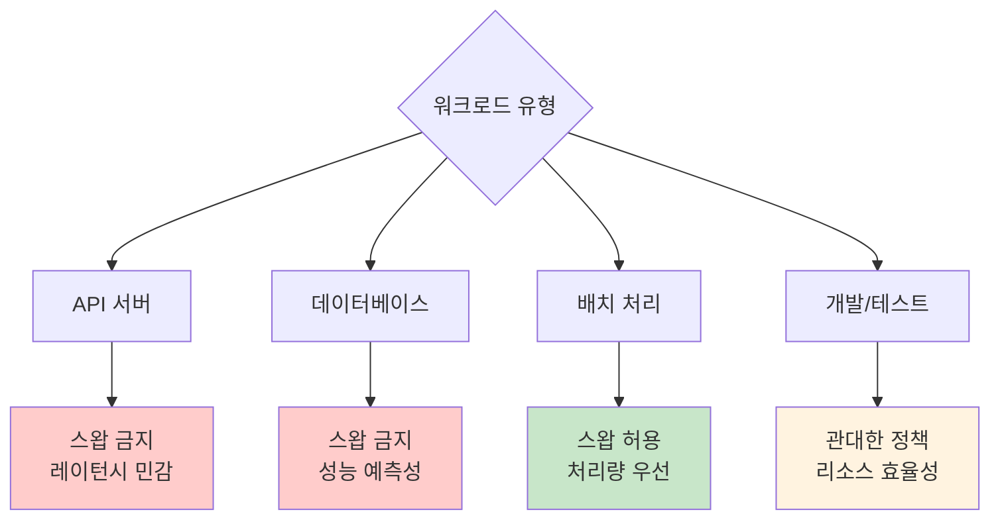

---
tags:
  - cloud_native
  - container_memory
  - docker_swap
  - hands-on
  - intermediate
  - kubernetes_resources
  - medium-read
  - workload_optimization
  - 인프라스트럭처
difficulty: INTERMEDIATE
learning_time: "3-5시간"
main_topic: "인프라스트럭처"
priority_score: 4
---

# 3-7E: 컨테이너 스왑 관리 실무 - "클라우드 네이티브 환경의 스왑 전략"

## 컨테이너 환경에서의 스왑 딜레마

컨테이너 환경에서 스왑 관리는 **전통적인 서버 관리**와는 완전히 다른 접근이 필요합니다. 리소스 격리, 예측 가능성, 그리고 클러스터 안정성이 핵심 고려사항입니다.

## Docker 스왑 관리

### Docker 메모리와 스왑 제한 설정

Docker는 `--memory`와 `--memory-swap` 플래그를 통해 세밀한 메모리 제어를 제공합니다:

```bash
# 기본 스왑 제한 설정
docker run -m 512m --memory-swap 1g myapp
# 결과: 메모리 512MB + 스왑 512MB = 총 1GB

# 스왑 완전 비활성화 (권장)
docker run -m 512m --memory-swap 512m myapp
# 결과: 메모리만 512MB, 스왑 사용 없음

# 무제한 스왑 (위험)
docker run -m 512m --memory-swap -1 myapp
# 결과: 메모리 512MB + 호스트 스왑 전체 사용 가능

# 메모리 제한 없이 스왑만 제한 (특수한 경우)
docker run --memory-swap 1g myapp
# 결과: 메모리 + 스왑 합계 1GB
```

### Docker Compose를 통한 스왑 관리

```yaml
# docker-compose.yml
version: '3.8'
services:
  webapp:
    image: nginx:alpine
    deploy:
      resources:
        limits:
          memory: 512M
        reservations:
          memory: 256M
    # Docker Compose v3.8+에서 스왑 설정
    mem_swappiness: 0  # 스왑 사용 최소화
    
  database:
    image: postgres:13
    environment:
      POSTGRES_PASSWORD: password
    deploy:
      resources:
        limits:
          memory: 1G
        reservations:
          memory: 512M
    # 데이터베이스는 스왑 사용 금지
    mem_swappiness: 0
    
  cache:
    image: redis:alpine
    deploy:
      resources:
        limits:
          memory: 256M
    # 캐시 서버도 스왑 금지
    mem_swappiness: 0
```

### Docker 스왑 모니터링

```bash
#!/bin/bash
# docker_swap_monitor.sh - Docker 컨테이너별 스왑 사용량 모니터링

echo "=== Docker 컨테이너 스왑 모니터링 ==="
echo "Container ID | Name | Memory Limit | Memory Usage | Swap Usage"
echo "-------------|------|--------------|--------------|------------"

# 실행 중인 모든 컨테이너 순회
for container in $(docker ps -q); do
    name=$(docker inspect --format='{{.Name}}' $container | sed 's/\///')
    
    # 메모리 제한 확인
    mem_limit=$(docker inspect --format='{{.HostConfig.Memory}}' $container)
    if [ "$mem_limit" -eq 0 ]; then
        mem_limit="unlimited"
    else
        mem_limit="$((mem_limit / 1024 / 1024))MB"
    fi
    
    # 스왑 제한 확인
    swap_limit=$(docker inspect --format='{{.HostConfig.MemorySwap}}' $container)
    if [ "$swap_limit" -eq -1 ]; then
        swap_setting="unlimited"
    elif [ "$swap_limit" -eq 0 ]; then
        swap_setting="default"
    else
        swap_setting="$((swap_limit / 1024 / 1024))MB"
    fi
    
    # 실제 사용량 확인
    stats=$(docker stats --no-stream --format "table {{.MemUsage}}\t{{.MemPerc}}" $container)
    mem_usage=$(echo $stats | tail -n 1 | awk '{print $1}')
    
    printf "%-12s | %-20s | %-12s | %-12s | %s\n" \
        ${container:0:12} "$name" "$mem_limit" "$mem_usage" "$swap_setting"
done

echo ""
echo "=== 호스트 스왑 상태 ==="
free -h | grep -E "Mem|Swap"

echo ""
echo "=== 컨테이너별 상세 메모리 정보 ==="
docker stats --no-stream
```

## Kubernetes 스왑 관리

### Kubernetes에서의 스왑 정책

Kubernetes는 기본적으로 **스왑을 허용하지 않지만**, v1.22부터 베타 기능으로 제한적 스왑 지원을 제공합니다:

```yaml
# swap-enabled-node.yaml
apiVersion: v1
kind: Node
metadata:
  name: worker-node-1
  labels:
    swap.enabled: "true"
    node.kubernetes.io/swap: "available"
spec:
  # 노드 레벨에서 스왑 사용량 제한
  allocatable:
    memory: "8Gi"
    swap: "2Gi"  # 스왑 리소스 할당
```

### 스왑 인식 파드 배포

```yaml
# swap-aware-workload.yaml
apiVersion: apps/v1
kind: Deployment
metadata:
  name: memory-intensive-app
spec:
  replicas: 2
  selector:
    matchLabels:
      app: memory-app
  template:
    metadata:
      labels:
        app: memory-app
      annotations:
        # 제한된 스왑 사용 허용
        pod.kubernetes.io/swap-usage: "limited"
    spec:
      nodeSelector:
        swap.enabled: "true"  # 스왑 지원 노드에만 배포
      containers:
      - name: app
        image: memory-intensive-app:latest
        resources:
          requests:
            memory: "1Gi"
            # 베타 기능: 스왑 요청
            swap: "500Mi"
          limits:
            memory: "2Gi"
            swap: "1Gi"  # 최대 1GB 스왑 사용
        env:
        - name: SWAP_BEHAVIOR
          value: "conservative"
---
apiVersion: v1
kind: ConfigMap
metadata:
  name: kubelet-config
data:
  kubelet-config.yaml: |
    apiVersion: kubelet.config.k8s.io/v1beta1
    kind: KubeletConfiguration
    # 스왑 동작 모드 설정
    failSwapOn: false  # 스왑이 있어도 kubelet 시작 허용
    memorySwap:
      swapBehavior: LimitedSwap  # 제한된 스왑 사용
```

### Kubernetes 스왑 모니터링

```bash
#!/bin/bash
# k8s_swap_monitor.sh - Kubernetes 클러스터 스왑 모니터링

echo "=== Kubernetes 클러스터 스왑 모니터링 ==="

# 노드별 스왑 상태 확인
echo "1. 노드별 스왑 가용성:"
kubectl get nodes -o custom-columns=\
"NAME:.metadata.name,\
SWAP_LABEL:.metadata.labels['swap\.enabled'],\
ALLOCATABLE_MEMORY:.status.allocatable.memory,\
ALLOCATABLE_SWAP:.status.allocatable.swap"

echo ""
echo "2. 스왑 사용 파드 목록:"
kubectl get pods --all-namespaces -o custom-columns=\
"NAMESPACE:.metadata.namespace,\
NAME:.metadata.name,\
NODE:.spec.nodeName,\
SWAP_ANNOTATION:.metadata.annotations['pod\.kubernetes\.io/swap-usage']" \
--field-selector=status.phase=Running

echo ""
echo "3. 메모리/스왑 리소스 사용률:"
kubectl top nodes

# 파드별 상세 리소스 사용량
echo ""
echo "4. 파드별 메모리 사용량 (상위 10개):"
kubectl top pods --all-namespaces --sort-by=memory | head -11

# 노드별 실제 스왑 사용량 확인
echo ""
echo "5. 노드별 실제 스왑 사용량:"
for node in $(kubectl get nodes --no-headers -o custom-columns=":metadata.name"); do
    echo "Node: $node"
    kubectl debug node/$node -it --image=busybox -- chroot /host sh -c \
        "free -h | grep -E 'Mem|Swap'" 2>/dev/null || echo "  Debug 접근 실패"
done
```

## 컨테이너 스왑 전략별 가이드라인

### 1. 마이크로서비스 아키텍처

```yaml
# microservice-swap-strategy.yaml
apiVersion: v1
kind: ConfigMap
metadata:
  name: swap-policies
data:
  # 서비스 유형별 스왑 정책
  api-gateway: |
    memory_limit: 1Gi
    swap_limit: 0      # 스왑 금지 (레이턴시 민감)
    swappiness: 1
    
  user-service: |
    memory_limit: 512Mi
    swap_limit: 256Mi  # 제한적 스왑 허용
    swappiness: 10
    
  notification-service: |
    memory_limit: 256Mi
    swap_limit: 512Mi  # 더 많은 스왑 허용 (배치 처리)
    swappiness: 30
    
  database: |
    memory_limit: 4Gi
    swap_limit: 0      # 데이터베이스는 스왑 금지
    swappiness: 1
```

### 2. 배치 처리 워크로드

```yaml
# batch-job-with-swap.yaml
apiVersion: batch/v1
kind: Job
metadata:
  name: data-processing-job
spec:
  template:
    metadata:
      annotations:
        pod.kubernetes.io/swap-usage: "unrestricted"
    spec:
      restartPolicy: Never
      nodeSelector:
        workload-type: "batch"
        swap.enabled: "true"
      containers:
      - name: data-processor
        image: data-processing:latest
        resources:
          requests:
            memory: "2Gi"
            swap: "4Gi"    # 배치 작업은 더 많은 스왑 허용
          limits:
            memory: "4Gi"
            swap: "8Gi"
        env:
        - name: MEMORY_AGGRESSIVE
          value: "true"
        - name: SWAP_STRATEGY
          value: "batch_optimized"
```

### 3. 개발/테스트 환경

```yaml
# development-environment.yaml
apiVersion: v1
kind: Namespace
metadata:
  name: development
  annotations:
    swap.policy: "permissive"
---
apiVersion: v1
kind: LimitRange
metadata:
  name: dev-limits
  namespace: development
spec:
  limits:
  - default:
      memory: "1Gi"
      swap: "2Gi"      # 개발 환경은 관대한 스왑 정책
    defaultRequest:
      memory: "256Mi"
      swap: "512Mi"
    type: Container
```

## 실무 Best Practices

### 스왑 사용 결정 매트릭스

| 워크로드 유형 | 스왑 정책 | 이유 | 설정 예시 |
|---------------|-----------|------|-----------|
| **API 서버** | 금지 | 레이턴시 민감 | `--memory-swap=mem_limit` |
| **웹 프런트엔드** | 최소한 | 사용자 경험 중시 | `swap: 0.5x memory` |
| **데이터베이스** | 금지 | 성능 예측성 | `swappiness=1, swap=0` |
| **캐시 서버** | 금지 | 메모리 기반 서비스 | `swap=0` |
| **배치 처리** | 허용 | 처리량 우선 | `swap: 2-4x memory` |
| **개발/테스트** | 관대함 | 리소스 효율성 | `swap: 2x memory` |

### 컨테이너 스왑 모니터링 자동화

```bash
#!/bin/bash
# container_swap_alert.sh - 컨테이너 스왑 사용 알림

SWAP_THRESHOLD=80  # 80% 사용 시 알림
ALERT_LOG="/var/log/container_swap_alerts.log"

check_docker_swap() {
    echo "=== Docker Container Swap Check $(date) ===" >> $ALERT_LOG
    
    for container in $(docker ps -q); do
        name=$(docker inspect --format='{{.Name}}' $container | sed 's/\///')
        
        # 컨테이너 메모리 통계 확인
        stats=$(docker exec $container cat /proc/meminfo 2>/dev/null)
        if [ $? -eq 0 ]; then
            swap_total=$(echo "$stats" | grep SwapTotal | awk '{print $2}')
            swap_free=$(echo "$stats" | grep SwapFree | awk '{print $2}')
            
            if [ "$swap_total" -gt 0 ]; then
                swap_used=$((swap_total - swap_free))
                swap_percent=$((swap_used * 100 / swap_total))
                
                if [ $swap_percent -ge $SWAP_THRESHOLD ]; then
                    alert_msg="ALERT: Container $name swap usage: ${swap_percent}%"
                    echo $alert_msg >> $ALERT_LOG
                    echo $alert_msg
                    
                    # 슬랙이나 다른 알림 시스템으로 전송
                    # send_slack_alert "$alert_msg"
                fi
            fi
        fi
    done
}

# Kubernetes 파드 스왑 체크
check_k8s_swap() {
    echo "=== Kubernetes Pod Swap Check $(date) ===" >> $ALERT_LOG
    
    # 각 노드에서 스왑 사용량이 높은 프로세스 확인
    for node in $(kubectl get nodes --no-headers -o custom-columns=":metadata.name"); do
        kubectl debug node/$node -it --image=busybox -- chroot /host sh -c \
            "ps aux --sort=-%mem | head -20" 2>/dev/null | \
            grep -E "(kubelet|containerd|docker)" >> $ALERT_LOG
    done
}

# 실행
check_docker_swap
check_k8s_swap
```

## 핵심 요점

### 1. 컨테이너 스왑의 핵심 원칙

- **예측 가능성**: 컨테이너 성능의 일관성 보장
- **격리성**: 다른 컨테이너에 영향 최소화
- **관찰 가능성**: 스왑 사용량 모니터링 필수

### 2. 환경별 전략

- **프로덕션**: 엄격한 스왑 제한, 성능 예측성 우선
- **스테이징**: 프로덕션과 유사하지만 약간 관대한 정책
- **개발**: 리소스 효율성을 위한 적극적 스왑 활용

### 3. 모니터링과 알림

정기적인 스왑 사용량 모니터링과 임계값 기반 알림으로 **사전 예방적 관리**

### 워크로드별 스왑 전략 요약



---

**이전**: [스왑 모니터링과 패턴 분석](chapter-03-memory-system/03-42-swap-monitoring-analysis.md)  
**다음**: [스왑 관리와 최적화 개요](chapter-03-memory-system/03-18-swap-management.md)로 돌아가서 전체 학습 로드맵을 확인하거나, [OOM 디버깅](chapter-03-memory-system/03-43-oom-debugging.md)에서 메모리 부족 상황 대응을 학습합니다.

## 📚 관련 문서

### 📖 현재 문서 정보

- **난이도**: INTERMEDIATE
- **주제**: 인프라스트럭처
- **예상 시간**: 3-5시간

### 🎯 학습 경로

- [📚 INTERMEDIATE 레벨 전체 보기](../learning-paths/intermediate/)
- [🏠 메인 학습 경로](../learning-paths/)
- [📋 전체 가이드 목록](../README.md)

### 📂 같은 챕터 (chapter-03-virtual-memory)

- [Chapter 3-1: 주소 변환은 어떻게 동작하는가](./03-10-address-translation.md)
- [Chapter 3-2: TLB와 캐싱은 어떻게 동작하는가](./03-11-tlb-caching.md)
- [Chapter 3-3: 페이지 폴트와 메모리 관리 개요](./03-12-page-fault.md)
- [Chapter 3-3A: 페이지 폴트 종류와 처리 메커니즘](./03-13-page-fault-types-handling.md)
- [Chapter 3-3B: Copy-on-Write (CoW) - fork()가 빠른 이유](./03-14-copy-on-write.md)

### 🏷️ 관련 키워드

`container_memory`, `docker_swap`, `kubernetes_resources`, `workload_optimization`, `cloud_native`

### ⏭️ 다음 단계 가이드

- 실무 적용을 염두에 두고 프로젝트에 적용해보세요
- 관련 도구들을 직접 사용해보는 것이 중요합니다
