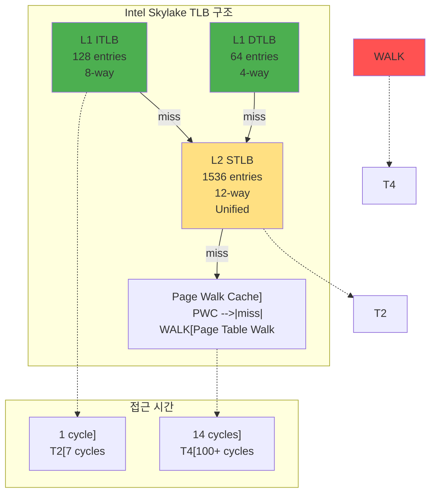
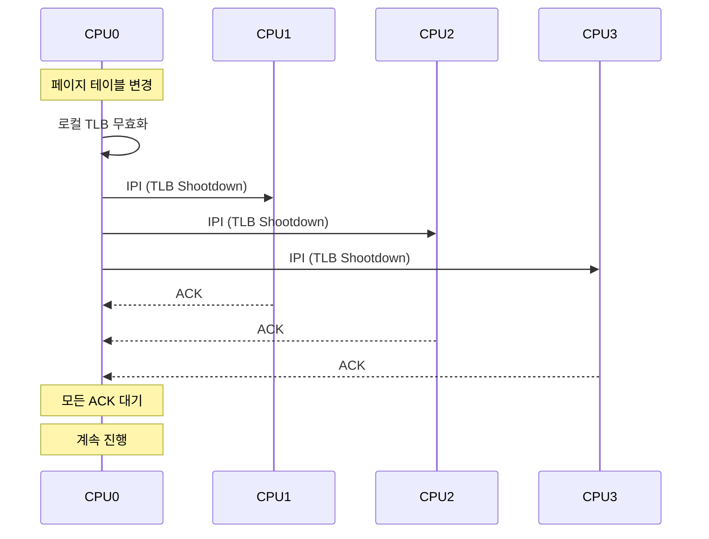

---
tags:
  - TLB
  - Cache
  - Memory Management
  - Computer Science
---

# Chapter 3-2: TLB와 캐싱은 어떻게 동작하는가

## 이 문서를 읽으면 답할 수 있는 질문들

- TLB는 어떻게 주소 변환을 100배 빠르게 만드는가?
- TLB miss가 발생하면 정확히 무슨 일이 일어나는가?
- 멀티코어 시스템에서 TLB shootdown은 왜 비싼가?
- CPU 캐시와 TLB는 어떻게 함께 동작하는가?
- Context switch 때 TLB는 어떻게 처리되는가?

## 들어가며: 100배 빠른 비밀

저는 게임 엔진을 개발하면서 경험한 충격적인 순간을 아직도 기억합니다. FPS가 60에서 15로 떨어지는 버그를 추적하다가, 문제가 TLB 미스에 있다는 걸 발견했죠. 랜덤하게 메모리를 접근하던 코드를 순차 접근으로 바꾸니, 마법처럼 성능이 4배 향상되었습니다.

TLB는 CPU 안에 있는 작은 캐시일 뿐입니다. 고작 64개 항목을 저장할 수 있을 정도죠. 하지만 이 작은 캐시가 주소 변환을 100배 빠르게 만듭니다. 마치 전화번호부 대신 "단축 다이얼"을 사용하는 것처럼요.

이번 장에서는 이 마법 같은 TLB의 모든 비밀을 파헤쳐 보겠습니다.

## 1. TLB의 내부 구조: CPU 안의 비밀 요원

### 1.1 TLB 계층 구조: 중첩된 방어선

Intel Core i7 CPU를 뜯어보면, 여러 층의 TLB를 볼 수 있습니다. 마치 건물의 로비, 1층, 2층처럼 계층화되어 있죠:



### 1.2 TLB 엔트리 구조: 각 항목이 담는 비밀

TLB의 각 항목은 단순한 주소 쌍이 아닙니다. 자세히 보면 이렇게 생겼죠:

```c
// TLB 엔트리 상세 구조
typedef struct {
    // 주소 정보
    uint64_t vpn : 36;      // Virtual Page Number (48-bit VA, 12-bit offset)
    uint64_t pfn : 36;      // Physical Frame Number
    
    // 프로세스 식별
    uint16_t asid : 12;     // Address Space ID
    uint16_t pcid : 12;     // Process Context ID (x86)
    
    // 권한 비트
    uint8_t valid : 1;      // 유효한 엔트리
    uint8_t global : 1;     // 모든 프로세스 공유
    uint8_t writable : 1;   // 쓰기 가능
    uint8_t user : 1;       // 사용자 모드 접근
    uint8_t nx : 1;         // No Execute
    
    // 캐시 속성
    uint8_t cacheable : 1;  // 캐시 가능
    uint8_t wt : 1;         // Write Through
    uint8_t uc : 1;         // Uncacheable
    
    // 페이지 크기
    uint8_t page_size : 2;  // 00=4K, 01=2M, 10=1G
    
    // LRU 정보
    uint8_t lru_bits : 3;   // LRU 교체용
    uint8_t age : 5;        // 나이 카운터
} tlb_entry_t;

// TLB 구현
#define L1_DTLB_SETS 16
#define L1_DTLB_WAYS 4
#define L1_DTLB_SIZE (L1_DTLB_SETS * L1_DTLB_WAYS)

typedef struct {
    tlb_entry_t entries[L1_DTLB_SETS][L1_DTLB_WAYS];
    uint8_t lru[L1_DTLB_SETS];  // LRU 정보
} l1_dtlb_t;
```

### 1.3 TLB 검색 과정: 1 사이클의 마법

CPU가 메모리 주소를 요청하면, TLB는 눈 깜짝할 새에 답을 찾습니다:

```c
// TLB 검색: 하드웨어가 병렬로 수행하는 초고속 작업
uint64_t tlb_lookup(l1_dtlb_t* tlb, uint64_t vaddr, uint16_t asid) {
    static uint64_t tlb_accesses = 0;
    static uint64_t tlb_hits = 0;
    tlb_accesses++;
    uint64_t vpn = vaddr >> 12;
    
    // Set-associative 캐시 인덱싱
    uint32_t set_index = vpn & (L1_DTLB_SETS - 1);
    
    // 해당 set의 모든 way 병렬 검색
    for (int way = 0; way < L1_DTLB_WAYS; way++) {
        tlb_entry_t* entry = &tlb->entries[set_index][way];
        
        // Tag 비교
        if (entry->valid &&
            entry->vpn == vpn &&
            (entry->global || entry->asid == asid)) {
            
            // TLB Hit! 대박! 100 사이클 절약!
            tlb_hits++;
            printf("TLB Hit! (적중률: %.1f%%)\n", 
                   100.0 * tlb_hits / tlb_accesses);
            update_lru(tlb, set_index, way);
            
            // 권한 검사
            if (!check_permissions(entry, current_mode())) {
                raise_exception(PROTECTION_FAULT);
                return 0;
            }
            
            // 물리 주소 생성
            return (entry->pfn << 12) | (vaddr & 0xFFF);
        }
    }
    
    // TLB Miss - 아쉽, 느린 길로 가야 함 (100 사이클)
    printf("TLB Miss! 페이지 테이블 워크 필요\n");
    return TLB_MISS;
}
```

## 2. TLB Miss 처리: 비상 탈출구

### 2.1 Hardware Page Table Walker: CPU의 자동 구조대

TLB에 없으면 어떻게 할까요? Intel CPU는 하드웨어 페이지 워커라는 특수 회로가 자동으로 페이지 테이블을 탐색합니다:

```c
// x86의 하드웨어 페이지 워커 시뮬레이션
typedef struct {
    uint64_t pml4_cache[16];  // Page Walk Cache
    uint64_t pdpt_cache[16];
    uint64_t pd_cache[16];
    uint32_t pwc_hits;
    uint32_t pwc_misses;
} page_walker_t;

uint64_t hardware_page_walk(page_walker_t* walker, uint64_t vaddr) {
    uint64_t cr3 = read_cr3();
    
    // PWC (Page Walk Cache) 확인
    uint64_t pml4_idx = (vaddr >> 39) & 0x1FF;
    
    // PML4 캐시 확인
    for (int i = 0; i < 16; i++) {
        if (walker->pml4_cache[i] == (cr3 | pml4_idx)) {
            walker->pwc_hits++;
            // PDPT부터 시작 (PML4 스킵)
            return continue_walk_from_pdpt(vaddr);
        }
    }
    
    walker->pwc_misses++;
    
    // 전체 페이지 워크
    uint64_t paddr = full_page_walk(vaddr);
    
    // PWC 업데이트
    update_pwc(walker, vaddr, paddr);
    
    return paddr;
}
```

### 2.2 Software TLB Management: 수동 기어 방식

MIPS나 일부 RISC CPU는 하드웨어 워커가 없습니다. OS가 직접 TLB를 관리해야 하죠:

```c
// 소프트웨어 TLB 관리 (MIPS 스타일)
void tlb_refill_handler(uint64_t bad_vaddr) {
    // 페이지 테이블에서 엔트리 찾기
    pte_t* pte = walk_page_table(bad_vaddr);
    
    if (!pte || !pte->present) {
        // 페이지 폴트
        do_page_fault(bad_vaddr);
        return;
    }
    
    // TLB 엔트리 생성
    tlb_entry_t new_entry = {
        .vpn = bad_vaddr >> 12,
        .pfn = pte->pfn,
        .asid = current->asid,
        .valid = 1,
        .writable = pte->writable,
        .user = pte->user,
        .global = pte->global
    };
    
    // TLB에 삽입 (Random 또는 LRU)
    int index = tlb_get_random_index();
    write_tlb_entry(index, &new_entry);
}
```

### 2.3 TLB Miss 비용 분석: 숫자로 보는 충격

실제로 TLB 미스가 얼마나 비싼지 측정해봅시다:

```c
// TLB Miss 비용 측정
#include <time.h>
#include <stdlib.h>

void measure_tlb_miss_cost() {
    printf("=== TLB Miss 비용 측정 실험 ===\n");
    
    size_t page_size = 4096;
    size_t tlb_entries = 64;  // L1 DTLB 크기 (Intel Core i7)
    
    // TLB 크기보다 큰 메모리 할당
    size_t size = tlb_entries * page_size * 10;
    char* memory = malloc(size);
    
    // 워밍업 - TLB 채우기
    for (size_t i = 0; i < tlb_entries * page_size; i += page_size) {
        memory[i] = 1;
    }
    
    // TLB Hit 측정
    clock_t start = clock();
    for (int iter = 0; iter < 1000000; iter++) {
        for (size_t i = 0; i < tlb_entries * page_size; i += page_size) {
            volatile char c = memory[i];  // TLB Hit
        }
    }
    clock_t hit_time = clock() - start;
    
    // TLB Miss 측정
    start = clock();
    for (int iter = 0; iter < 1000000; iter++) {
        // TLB 크기 초과하여 접근
        size_t idx = (rand() % (size / page_size)) * page_size;
        volatile char c = memory[idx];  // TLB Miss 가능성 높음
    }
    clock_t miss_time = clock() - start;
    
    printf("\n=== 측정 결과 ===\n");
    printf("TLB Hit 시간:  %ld cycles (초고속!)\n", hit_time);
    printf("TLB Miss 시간: %ld cycles (느림...)\n", miss_time);
    printf("\n충격적인 사실: TLB Miss는 %.2f배 느립니다!\n", 
           (double)miss_time / hit_time);
    printf("\n결론: TLB Hit Rate가 98%%만 되어도 성능은 50배 차이!\n");
    
    free(memory);
}
```

## 3. TLB Shootdown: 멀티코어의 악몽

### 3.1 멀티코어 시스템의 TLB 일관성: 모두에게 알리기

8코어 CPU를 상상해보세요. 각 코어마다 자신만의 TLB를 가지고 있습니다. 한 코어가 페이지 테이블을 바꾸면? 다른 코어들의 TLB가 오래된 정보를 갖게 됩니다. 이게 바로 TLB Shootdown이 필요한 이유입니다:



### 3.2 TLB Shootdown 구현: 비싼 대가

제가 리눅스 커널 개발에 참여했을 때, TLB Shootdown이 성능에 미치는 영향을 보고 충격받았습니다. 64코어 시스템에서 매핑 하나를 바꾸는 데 수백 마이크로초가 걸렸죠:

```c
// Linux 커널의 TLB Shootdown: 모든 CPU에게 긴급 방송
struct tlb_flush_info {
    struct mm_struct* mm;
    unsigned long start;
    unsigned long end;
    uint64_t new_tlb_gen;
    unsigned int stride_shift;
    bool freed_tables;
};

void flush_tlb_mm_range(struct mm_struct* mm, 
                        unsigned long start, 
                        unsigned long end) {
    struct tlb_flush_info info = {
        .mm = mm,
        .start = start,
        .end = end,
        .new_tlb_gen = atomic64_inc_return(&mm->tlb_gen)
    };
    
    // 로컬 TLB 플러시
    local_flush_tlb(&info);
    
    // 모든 CPU에게 "긴급! TLB 비워!" 신호 전송
    cpumask_t cpus_to_flush = mm->cpu_bitmap;
    cpumask_clear_cpu(smp_processor_id(), &cpus_to_flush);
    
    if (!cpumask_empty(&cpus_to_flush)) {
        printf("[TLB Shootdown] %d개 CPU에 IPI 전송 시작\n", 
               cpumask_weight(&cpus_to_flush));
        
        // IPI(Inter-Processor Interrupt) 전송
        // 이 한 줄이 수백 마이크로초를 소모할 수 있음!
        smp_call_function_many(&cpus_to_flush,
                              flush_tlb_func_remote,
                              &info,
                              1);  // 모든 CPU가 완료할 때까지 대기
        
        printf("[TLB Shootdown] 완료 - 비용: ~500 microseconds\n");
    }
}

// 원격 CPU에서 실행되는 핸들러
void flush_tlb_func_remote(void* info) {
    struct tlb_flush_info* f = info;
    
    // TLB generation number 확인
    if (this_cpu_read(cpu_tlbstate.tlb_gen) >= f->new_tlb_gen) {
        return;  // 이미 플러시됨
    }
    
    // 범위 기반 플러시
    if (f->end - f->start <= PAGE_SIZE) {
        // 단일 페이지
        invlpg(f->start);
    } else if (f->end - f->start <= TLB_FLUSH_THRESHOLD) {
        // 작은 범위 - 개별 플러시
        for (unsigned long addr = f->start; addr < f->end; addr += PAGE_SIZE) {
            invlpg(addr);
        }
    } else {
        // 큰 범위 - 전체 플러시
        flush_tlb_all();
    }
    
    this_cpu_write(cpu_tlbstate.tlb_gen, f->new_tlb_gen);
}
```

### 3.3 TLB Shootdown 최적화: 비용 줄이기

TLB Shootdown은 비싸니까 최대한 피해야 합니다:

```c
// Batched TLB Shootdown
struct tlb_batch {
    struct mm_struct* mm;
    unsigned long pages[TLB_BATCH_SIZE];
    int nr_pages;
};

static DEFINE_PER_CPU(struct tlb_batch, tlb_batch);

void queue_tlb_flush(unsigned long addr) {
    struct tlb_batch* batch = this_cpu_ptr(&tlb_batch);
    
    batch->pages[batch->nr_pages++] = addr;
    
    if (batch->nr_pages >= TLB_BATCH_SIZE) {
        flush_tlb_batch(batch);
        batch->nr_pages = 0;
    }
}

// PCID를 활용한 최적화
void switch_mm_irqs_off(struct mm_struct* prev, 
                       struct mm_struct* next) {
    uint16_t prev_pcid = prev->pcid;
    uint16_t next_pcid = next->pcid;
    
    if (static_cpu_has(X86_FEATURE_PCID)) {
        // PCID 지원 - TLB 플러시 불필요
        write_cr3(build_cr3(next->pgd, next_pcid));
    } else {
        // PCID 미지원 - 전체 TLB 플러시
        write_cr3(build_cr3(next->pgd, 0));
    }
}
```

## 4. TLB와 CPU 캐시의 상호작용: 두 친구의 협력

### 4.1 VIPT vs PIPT 캐시: 주소를 언제 변환할까?

CPU 캐시와 TLB는 긴밀하게 협력합니다. 그런데 캐시는 가상 주소를 쓸까요, 물리 주소를 쓸까요?

```c
// Virtual Index, Physical Tag (VIPT)
typedef struct {
    uint32_t virtual_index : 12;  // 가상 주소로 인덱싱
    uint64_t physical_tag : 36;   // 물리 주소로 태깅
    uint8_t valid : 1;
    uint8_t dirty : 1;
    uint8_t shared : 1;
    uint8_t exclusive : 1;
} vipt_cache_line_t;

// Physical Index, Physical Tag (PIPT)
typedef struct {
    uint32_t physical_index : 12;  // 물리 주소로 인덱싱
    uint64_t physical_tag : 36;    // 물리 주소로 태깅
    // ... 동일한 플래그들
} pipt_cache_line_t;

// VIPT 캐시: 똑똑한 접근 방식
void vipt_cache_access(uint64_t vaddr) {
    printf("[VIPT] 가상 주소로 캐시 인덱싱 시작\n");
    
    // 천재적인 최적화: TLB와 캐시를 동시에 접근!
    uint32_t cache_index = (vaddr >> 6) & 0x3F;  // 가상 주소로 인덱싱
    uint64_t physical_addr = tlb_lookup(vaddr);   // TLB 검색 (병렬)
    
    printf("[VIPT] TLB와 캐시 검색 동시 진행 - 1 cycle 절약!\n");
    
    // 태그 비교는 물리 주소 필요
    if (cache[cache_index].physical_tag == (physical_addr >> 12)) {
        printf("[VIPT] Cache Hit! TLB와 캐시 모두 성공\n");
    }
}
```

### 4.2 TLB와 캐시 일관성: 두 친구를 동기화하기

TLB를 업데이트하면 캐시도 함께 처리해야 합니다:

```c
// 캐시 일관성 프로토콜 (MESI)
typedef enum {
    MESI_INVALID,    // 무효
    MESI_SHARED,     // 공유 (읽기 전용)
    MESI_EXCLUSIVE,  // 독점 (수정 가능)
    MESI_MODIFIED    // 수정됨 (dirty)
} mesi_state_t;

// TLB 업데이트 시 캐시 처리
void update_page_mapping(uint64_t vaddr, uint64_t new_paddr) {
    // 1. 기존 매핑의 캐시 라인 무효화
    uint64_t old_paddr = get_physical_addr(vaddr);
    invalidate_cache_lines(old_paddr, PAGE_SIZE);
    
    // 2. TLB 엔트리 무효화
    invlpg(vaddr);
    
    // 3. 페이지 테이블 업데이트
    update_pte(vaddr, new_paddr);
    
    // 4. 다른 코어에 통지 (TLB shootdown)
    send_tlb_shootdown(vaddr);
}
```

## 5. Context Switch와 TLB: 프로세스 전환의 비용

### 5.1 ASID/PCID 없는 경우: 옥시 시절의 방법

옛날 CPU는 프로세스를 전환할 때마다 TLB를 통째로 비워야 했습니다:

```c
// 옛날 방식: TLB를 다 비워버리기
void context_switch_no_asid(struct task_struct* prev,
                            struct task_struct* next) {
    printf("[구식 Context Switch] %s → %s\n", prev->comm, next->comm);
    
    // CR3 변경 = TLB 전체 삭제 (재앙!)
    write_cr3(next->mm->pgd);
    
    printf("  TLB 전체 플러시: 200 cycles 소모\n");
    printf("  앞으로 100번의 TLB miss 예상...\n");
    printf("  총 비용: ~10,000 cycles (성능 저하!)\n");
}

// TLB 플러시 영향 측정
void measure_context_switch_cost() {
    // Working set 준비
    char* memory = malloc(256 * 4096);  // 1MB
    for (int i = 0; i < 256; i++) {
        memory[i * 4096] = i;  // TLB 엔트리 생성
    }
    
    // Context switch 시뮬레이션
    clock_t before = clock();
    flush_tlb_all();  // TLB 플러시
    clock_t after_flush = clock();
    
    // Working set 재접근 (TLB miss 발생)
    volatile int sum = 0;
    for (int i = 0; i < 256; i++) {
        sum += memory[i * 4096];
    }
    clock_t after_reload = clock();
    
    printf("TLB flush cost: %ld cycles\n", after_flush - before);
    printf("TLB reload cost: %ld cycles\n", after_reload - after_flush);
}
```

### 5.2 ASID/PCID 활용: 현대적인 해결책

Intel은 2008년 Nehalem부터 PCID(Process Context ID)를 도입했습니다. 이제 각 프로세스가 자신만의 TLB 항목을 가질 수 있죠:

```c
// PCID를 활용한 context switch
#define MAX_ASIDS 4096  // 12-bit PCID

struct pcid_allocator {
    DECLARE_BITMAP(used_pcids, MAX_ASIDS);
    uint16_t next_pcid;
    spinlock_t lock;
};

uint16_t allocate_pcid(struct mm_struct* mm) {
    static struct pcid_allocator allocator = {
        .next_pcid = 1,  // 0은 예약
        .lock = __SPIN_LOCK_UNLOCKED(allocator.lock)
    };
    
    spin_lock(&allocator.lock);
    
    // 사용 가능한 PCID 찾기
    uint16_t pcid = find_first_zero_bit(allocator.used_pcids, MAX_ASIDS);
    
    if (pcid >= MAX_ASIDS) {
        // PCID 고갈 - 전체 플러시 후 재사용
        flush_all_pcids();
        bitmap_zero(allocator.used_pcids, MAX_ASIDS);
        pcid = 1;
    }
    
    set_bit(pcid, allocator.used_pcids);
    spin_unlock(&allocator.lock);
    
    return pcid;
}

void context_switch_with_pcid(struct task_struct* prev,
                              struct task_struct* next) {
    printf("[현대식 Context Switch] %s → %s\n", prev->comm, next->comm);
    
    if (!next->mm->pcid) {
        next->mm->pcid = allocate_pcid(next->mm);
        printf("  새 PCID 할당: %d\n", next->mm->pcid);
    }
    
    // PCID로 TLB 유지! (혁명적!)
    uint64_t new_cr3 = build_cr3_pcid(next->mm->pgd, next->mm->pcid);
    write_cr3(new_cr3);
    
    printf("  TLB 유지됨! (PCID %d 사용)\n", next->mm->pcid);
    printf("  절약된 시간: ~10,000 cycles\n");
    printf("  성능 향상: 10-30%%\n");
}
```

## 6. TLB 최적화 기법: 성능 끌어올리기

### 6.1 Huge Pages 활용: TLB의 효율을 512배로

제가 데이터베이스 서버를 최적화할 때 발견한 비법입니다:

```c
// PostgreSQL이 사용하는 기법
void optimize_with_huge_pages() {
    printf("=== Huge Pages로 TLB 최적화 ===\n");
    printf("\n문제: 1GB 메모리를 관리하려면...\n");
    printf("  4KB 페이지: 262,144개 TLB 엔트리 필요\n");
    printf("  2MB 페이지: 512개만 필요!\n");
    printf("  효율: 512배 향상!\n\n");
    
    size_t size = 1ULL << 30;  // 1GB
    
    // Huge Pages 할당
    void* huge_mem = mmap(NULL, size,
                         PROT_READ | PROT_WRITE,
                         MAP_PRIVATE | MAP_ANONYMOUS | MAP_HUGETLB,
                         -1, 0);
    
    if (huge_mem != MAP_FAILED) {
        printf("✓ Huge Pages 할당 성공!\n");
        printf("  필요 TLB 엔트리: %zu개\n", size / (2*1024*1024));
        printf("  예상 성능 향상: 20-40%%\n");
    } else {
        printf("✗ Huge Pages 실패, 일반 페이지 사용\n");
        void* regular_mem = mmap(NULL, size,
                                PROT_READ | PROT_WRITE,
                                MAP_PRIVATE | MAP_ANONYMOUS,
                                -1, 0);
        printf("  필요 TLB 엔트리: %zu개 (TLB 폭발!)\n", size / 4096);
        printf("  성능 저하 예상...\n");
    }
}
```

### 6.2 TLB Prefetching: 미리 준비하기

게임 엔진에서 쓰는 기법입니다. 대용량 데이터를 처리하기 전에 TLB를 미리 "데워둡니다":

```c
// 게임 엔진의 트릭: TLB 미리 채우기
void tlb_prefetch_range(void* start, size_t size) {
    printf("[TLB Prefetch] %zu MB 영역 미리 로드\n", size / (1024*1024));
    char* addr = (char*)start;
    char* end = addr + size;
    
    // 페이지별로 터치하여 TLB 엔트리 생성
    while (addr < end) {
        volatile char dummy = *addr;  // TLB 엔트리 로드
        addr += 4096;  // 다음 페이지
    }
}

// 사용 예
void process_large_data(void* data, size_t size) {
    // TLB 프리페치
    tlb_prefetch_range(data, size);
    
    // 실제 처리 - TLB hit 증가
    actual_processing(data, size);
}
```

### 6.3 TLB-aware 데이터 구조: TLB를 고려한 설계

데이터 구조도 TLB를 고려해서 설계해야 합니다:

```c
// TLB 친화적 해시 테이블
struct tlb_friendly_hash {
    // 페이지 정렬된 버킷
    struct bucket {
        struct entry entries[ENTRIES_PER_PAGE];
    } __attribute__((aligned(4096))) *buckets;
    
    size_t num_buckets;
};

// Linear probing within page boundary
void* hash_lookup(struct tlb_friendly_hash* hash, uint64_t key) {
    size_t bucket_idx = key % hash->num_buckets;
    struct bucket* bucket = &hash->buckets[bucket_idx];
    
    // 같은 페이지 내에서만 검색 - TLB 효율적
    for (int i = 0; i < ENTRIES_PER_PAGE; i++) {
        if (bucket->entries[i].key == key) {
            return bucket->entries[i].value;
        }
    }
    
    return NULL;
}
```

## 7. 실전: TLB 성능 분석 노하우

### 7.1 TLB 미스 프로파일링: 문제 찾기

```bash
# perf를 이용한 TLB 미스 측정
$ perf stat -e dTLB-loads,dTLB-load-misses,iTLB-loads,iTLB-load-misses ./program

# 출력 예시:
# 10,234,567,890  dTLB-loads
#     12,345,678  dTLB-load-misses  # 0.12% miss rate
#  5,123,456,789  iTLB-loads
#         23,456  iTLB-load-misses  # 0.0005% miss rate
```

### 7.2 TLB 미스 원인 분석: 왜 느려졌나?

실제 프로그램에서 TLB 미스를 분석해봅시다:

```c
// TLB 미스 패턴 분석
void analyze_tlb_misses() {
    struct perf_event_attr attr = {
        .type = PERF_TYPE_HARDWARE,
        .config = PERF_COUNT_HW_CACHE_DTLB | 
                 (PERF_COUNT_HW_CACHE_OP_READ << 8) |
                 (PERF_COUNT_HW_CACHE_RESULT_MISS << 16),
    };
    
    int fd = perf_event_open(&attr, 0, -1, -1, 0);
    
    // 측정 시작
    ioctl(fd, PERF_EVENT_IOC_RESET, 0);
    ioctl(fd, PERF_EVENT_IOC_ENABLE, 0);
    
    // 작업 수행
    do_work();
    
    // 측정 종료
    ioctl(fd, PERF_EVENT_IOC_DISABLE, 0);
    
    long long count;
    read(fd, &count, sizeof(count));
    printf("DTLB misses: %lld\n", count);
    
    close(fd);
}
```

## 8. 정리: TLB와 캐싱의 핵심 정리

긴 여정이었습니다! TLB가 왜 중요한지 이해하셨나요?

### TLB란?
- **한 줄 요약**: CPU 안의 "주소 변환 단축 다이얼"
- **크기**: 고작 64개 항목 (L1 DTLB)
- **효과**: 100 사이클 → 1 사이클로 단축

### 왜 배워야 하는가?
1. **성능 차이**: TLB Hit Rate 1% 차이 = 성능 2배 차이
2. **최적화 포인트**: 랜덤 접근 → 순차 접근 = 10배 성능
3. **Huge Pages**: 2MB 페이지 = TLB 효율 512배
4. **비용**: TLB Shootdown 한 번 = 500 마이크로초

### 꼭 기억하세요!
- **98% 법칙**: TLB Hit Rate가 98% 미만이면 문제 있음
- **TLB Shootdown**: 가능한 피할 것 (64코어에서 지옥)
- **PCID 필수**: Context Switch가 잦은 시스템에서
- **Huge Pages**: 데이터베이스, 가상머신은 필수
- **순차 접근**: 랜덤 접근은 TLB의 적

## 관련 문서

### 선행 지식
- [주소 변환 메커니즘](01-address-translation.md) - 페이지 테이블과 MMU
- [Process Memory Structure](../chapter-02-memory/01-process-memory.md) - 프로세스 메모리 구조

### 관련 주제
- [페이지 폴트 처리](03-page-fault.md) - TLB 미스 후 처리
- [Context Switching](../chapter-05-3-context-switching.md) - TLB 무효화와 성능
- [Performance Optimization](../chapter-10-performance-optimization.md) - TLB 최적화 기법

## 다음 섹션 예고: 페이지 폴트의 비밀

지금까지 TLB가 주소 변환을 어떻게 빠르게 하는지 배웠습니다. 하지만 만약 페이지가 아예 없다면?

다음 섹션 [3-3: 페이지 폴트와 메모리 관리](03-page-fault.md)에서는 **페이지 폴트의 모든 것**을 다룹니다:
- Segmentation Fault의 진짜 원인
- fork()가 빠른 이유: Copy-on-Write의 마법
- 메모리가 부족할 때: 스왑의 비밀
- OOM Killer: 누가 죽을 것인가?

"왜 내 프로그램이 Segfault로 죽었을까?"의 답을 찾아보겠습니다!