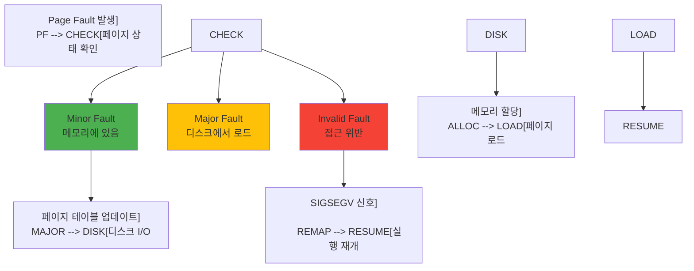
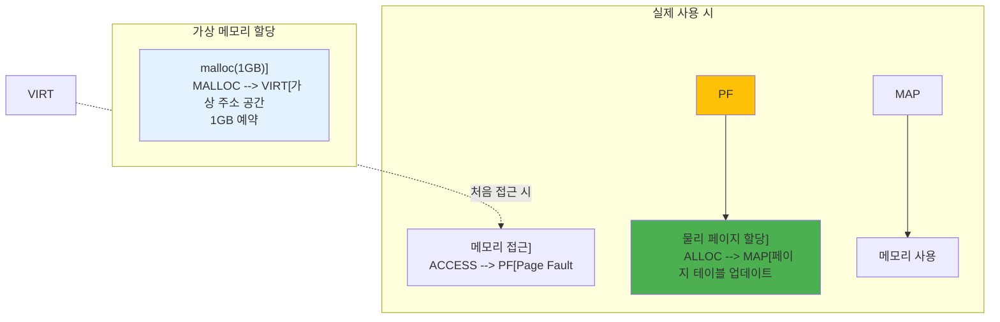
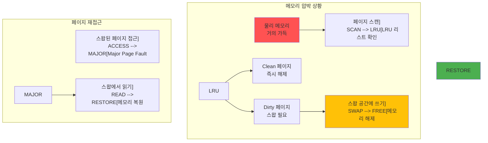
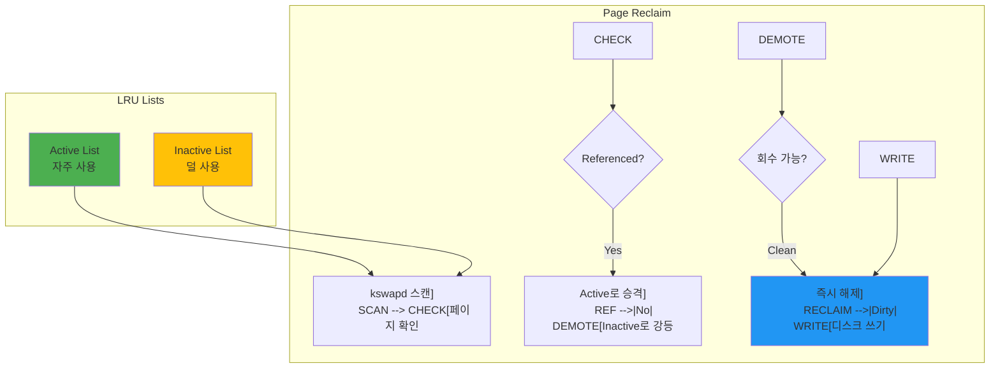

---
tags:
  - Page Fault
  - Memory Management
  - Virtual Memory
  - Computer Science
---

# Chapter 3-3: 페이지 폴트와 메모리 관리는 어떻게 동작하는가

## 이 문서를 읽으면 답할 수 있는 질문들

- Minor fault와 Major fault의 차이는 무엇인가?
- Copy-on-Write는 어떻게 메모리를 절약하는가?
- Demand Paging이 시스템 성능에 미치는 영향은?
- 스왑이 발생하면 왜 시스템이 느려지는가?
- 메모리 압박 상황에서 커널은 어떻게 대응하는가?

## 들어가며: Segmentation Fault의 진실

"Segmentation fault (core dumped)"

개발자라면 누구나 이 메시지를 보고 좌절한 경험이 있을 겁니다. 제가 처음 이 에러를 만났을 때는 막막했습니다. "내 코드가 뭘 잘못했지?" "메모리를 잘못 건드렸나?"

그런데 놀라운 사실을 알게 되었습니다. 프로그램이 정상적으로 실행될 때도 초당 수천 번의 "폴트"가 발생한다는 것을요. 다만 이것들은 **좋은 폴트**입니다. 페이지 폴트는 버그가 아니라, 현대 운영체제의 핵심 메커니즘입니다.

더 충격적인 사실: Chrome이 10GB 메모리를 "사용"한다고 표시되어도, 실제로는 2GB만 쓰고 있을 수 있습니다. 나머지 8GB는 "약속"일 뿐이죠. 이게 가능한 이유가 바로 페이지 폴트입니다.

이번 장에서는 이 마법 같은 메커니즘의 비밀을 파헤쳐보겠습니다.

## 1. 페이지 폴트의 종류와 처리: 좋은 폴트, 나쁜 폴트, 치명적인 폴트

### 1.1 페이지 폴트 분류: 신호등처럼 단순한 분류

페이지 폴트는 신호등과 같습니다:

- 🟢 **Minor Fault**: 초록불 - 빠르게 처리되고 계속 진행
- 🟡 **Major Fault**: 노란불 - 잠시 멈추고 기다림
- 🔴 **Invalid Fault**: 빨간불 - 정지! Segmentation Fault!



### 1.2 페이지 폴트 핸들러: OS의 응급실

페이지 폴트가 발생하면, CPU는 즉시 멈추고 OS의 "응급실"로 달려갑니다:

```c
// Linux 커널의 페이지 폴트 처리: 초당 수천 번 실행되는 코드
void do_page_fault(struct pt_regs *regs, unsigned long error_code) {
    unsigned long address = read_cr2();  // "어디가 아프신가요?"
    struct mm_struct *mm = current->mm;
    struct vm_area_struct *vma;
    unsigned int flags = FAULT_FLAG_DEFAULT;
    
    // 1. 커널 모드에서 발생? (이건 심각한 상황)
    if (error_code & X86_PF_USER) {
        flags |= FAULT_FLAG_USER;  // 사용자 프로그램의 폴트
    } else {
        // 커널이 페이지 폴트? 이건 정말 위험!
        printf("[PANIC] 커널이 잘못된 메모리 접근!\n");
        if (handle_kernel_fault(address, error_code))
            return;
    }
    
    // 2. 이 주소가 프로그램의 영역인가?
    vma = find_vma(mm, address);
    if (!vma || vma->vm_start > address) {
        // 할당받지 않은 메모리 접근!
        printf("[SEGFAULT] 잘못된 포인터: %p\n", address);
        printf("당신이 가장 싫어하는 메시지를 보게 됩니다...\n");
        bad_area(regs, error_code, address);  // → "Segmentation fault"
        return;
    }
    
    // 3. 권한 확인
    if (error_code & X86_PF_WRITE) {
        if (!(vma->vm_flags & VM_WRITE)) {
            bad_area(regs, error_code, address);
            return;
        }
        flags |= FAULT_FLAG_WRITE;
    }
    
    // 4. 실제 폴트 처리
    fault_handler_t handler = get_fault_handler(vma);
    int ret = handler(vma, address, flags);
    
    if (ret & VM_FAULT_MAJOR) {
        current->maj_flt++;  // Major fault: 디스크에서 읽어옴 (느림)
        printf("[MAJOR] 디스크 I/O 발생 - %d ms 소요\n", io_time);
    } else {
        current->min_flt++;  // Minor fault: 메모리만 연결 (빠름)
        // 이건 너무 자주 발생해서 로그도 안 남김
    }
}
```

### 1.3 Minor vs Major Fault: 천국과 지옥의 차이

제가 실제로 경험한 사례입니다. 같은 100MB 파일을 처리하는데:

- 첫 번째 실행: 5초 (Major Fault 다발)
- 두 번째 실행: 0.1초 (Minor Fault만)

50배 차이! 무슨 일이 일어난 걸까요?

```c
#include <sys/time.h>
#include <sys/resource.h>

// Minor Fault: 빠른 폴트의 예
void demonstrate_minor_fault() {
    printf("=== Minor Fault 실험 ===\n");
    
    // 1. 메모리 할당 (이 순간은 '약속'만)
    size_t size = 100 * 1024 * 1024;  // 100MB
    char *memory = malloc(size);
    printf("100MB 할당 완료! (사실 아직 메모리 사용 안 함)\n");
    
    struct rusage before, after;
    getrusage(RUSAGE_SELF, &before);
    
    // 2. 첫 접근 - Minor Fault 폭풍!
    printf("메모리 접근 시작...\n");
    for (size_t i = 0; i < size; i += 4096) {
        memory[i] = 'A';  // 각 페이지 첫 접근 → Minor Fault!
        // 커널: "아, 이제 진짜로 메모리가 필요하구나!"
    }
    
    getrusage(RUSAGE_SELF, &after);
    
    long minor_faults = after.ru_minflt - before.ru_minflt;
    printf("\n결과:\n");
    printf("  Minor faults: %ld회\n", minor_faults);
    printf("  예상: %zu회 (100MB / 4KB 페이지)\n", size / 4096);
    printf("  각 폴트 처리 시간: ~0.001ms\n");
    printf("  총 오버헤드: ~%ldms (거의 무시 가능!)\n", minor_faults / 1000);
    
    free(memory);
}

// Major Fault: 느린 폴트의 악몽
void demonstrate_major_fault() {
    printf("\n=== Major Fault 실험 (커피 한 잔 준비하세요) ===\n");
    // 1. 파일 매핑
    int fd = open("large_file.dat", O_RDONLY);
    struct stat st;
    fstat(fd, &st);
    
    char *file_map = mmap(NULL, st.st_size, PROT_READ,
                         MAP_PRIVATE, fd, 0);
    
    // 2. 최악의 상황 만들기
    printf("페이지 캐시 삭제 중... (메모리를 텅 비웁니다)\n");
    system("echo 3 > /proc/sys/vm/drop_caches");  // 캐시 전부 삭제!
    printf("이제 모든 파일 접근이 디스크를 거쳐야 합니다...\n");
    
    struct rusage before, after;
    getrusage(RUSAGE_SELF, &before);
    
    // 3. 파일 접근 - Major Fault 지옥
    printf("파일 읽기 시작 (SSD라도 느립니다!)\n");
    volatile char sum = 0;
    for (size_t i = 0; i < st.st_size; i += 4096) {
        sum += file_map[i];  // 각 접근마다 디스크 I/O!
        if (i % (10 * 1024 * 1024) == 0) {
            printf("  %zu MB 처리... (디스크가 울고 있어요)\n", i / (1024*1024));
        }
    }
    
    getrusage(RUSAGE_SELF, &after);
    
    long major_faults = after.ru_majflt - before.ru_majflt;
    printf("\n충격적인 결과:\n");
    printf("  Major faults: %ld회\n", major_faults);
    printf("  각 폴트 처리 시간: ~5ms (SSD 기준)\n");
    printf("  총 오버헤드: ~%ldms\n", major_faults * 5);
    printf("  Minor Fault보다 5000배 느림!\n");
    
    munmap(file_map, st.st_size);
    close(fd);
}
```

## 2. Copy-on-Write (CoW): fork()가 빠른 이유

### 2.1 CoW 메커니즘: 게으른 복사의 천재성

fork()는 프로세스를 통째로 복사합니다. 1GB 프로세스를 fork()하면 2GB가 필요할까요? 놀랍게도 아닙니다! 비밀은 Copy-on-Write에 있습니다.

제가 Redis 개발자에게 들은 이야기입니다: "우리는 100GB 데이터베이스를 fork()로 백업하는데 1초도 안 걸려요. CoW가 없었다면 Redis는 존재하지 못했을 거예요."

```mermaid
sequenceDiagram
    participant Parent
    participant Kernel
    participant Child
    
    Parent->>Kernel: fork()
    Kernel->>Kernel: 페이지 테이블 복사
(물리 페이지 공유)
    Kernel->>Kernel: 모든 페이지를
읽기 전용으로 표시
    Kernel->>Child: 자식 프로세스 생성
    
    Note over Parent,Child: 메모리 공유 중
    
    Child->>Kernel: 페이지 쓰기 시도
    Kernel->>Kernel: Page Fault!
    Kernel->>Kernel: 새 페이지 할당
    Kernel->>Kernel: 내용 복사
    Kernel->>Child: 쓰기 허용
    
    Note over Child: 독립된 복사본 소유
```

### 2.2 CoW 구현: 마법이 일어나는 순간

CoW의 천재적인 아이디어: "복사한 척만 하고, 진짜로 수정할 때만 복사하자!"

```c
// Copy-on-Write 실험: fork()의 마법
#include <unistd.h>
#include <sys/wait.h>
#include <sys/mman.h>

void demonstrate_cow() {
    printf("=== Copy-on-Write 마법쇼 ===\n");
    
    // 1. 거대한 메모리 준비
    size_t size = 100 * 1024 * 1024;  // 100MB
    char *shared_memory = mmap(NULL, size,
                              PROT_READ | PROT_WRITE,
                              MAP_PRIVATE | MAP_ANONYMOUS,
                              -1, 0);
    
    // 2. 데이터로 가득 채우기
    memset(shared_memory, 'P', size);
    printf("부모: 100MB 메모리를 'P'로 채웠습니다\n");
    
    printf("부모: 메모리 주소 = %p\n", shared_memory);
    long rss_before = get_rss_kb();
    printf("부모: fork() 전 메모리 사용량 = %ld MB\n\n", rss_before / 1024);
    
    // 3. fork() - 여기서 마법이 시작됩니다!
    printf("🎩 fork() 호출! (100MB를 복사하는 척...)\n");
    pid_t pid = fork();
    
    if (pid == 0) {
        // 자식 프로세스
        printf("자식: 똑같은 주소 = %p (가상 주소는 동일!)\n", shared_memory);
        long child_rss = get_rss_kb();
        printf("자식: fork() 직후 메모리 = %ld MB\n", child_rss / 1024);
        printf("자식: 어? 메모리가 늘지 않았네요? (CoW 덕분!)\n\n");
        
        // 4. 일부만 수정 - 이제 진짜 복사가 일어남!
        printf("자식: 10개 페이지만 수정합니다...\n");
        for (int i = 0; i < 10; i++) {
            shared_memory[i * 4096] = 'C';  // 수정 → Page Fault → 복사!
            printf("  페이지 %d 수정 → CoW 발생!\n", i);
        }
        
        long child_rss_after = get_rss_kb();
        printf("\n자식: 수정 후 메모리 = %ld MB\n", child_rss_after / 1024);
        printf("자식: 증가량 = %ld KB (10 페이지 * 4KB = 40KB)\n", 
               child_rss_after - child_rss);
        printf("자식: 나머지 99.96MB는 여전히 부모와 공유!\n");
        
        exit(0);
    } else {
        // 부모 프로세스
        wait(NULL);
        
        // 부모의 메모리는 그대로!
        printf("\n부모: 첫 글자 확인 = '%c' (여전히 'P'!)\n", shared_memory[0]);
        printf("부모: 자식이 수정했지만 내 메모리는 안전합니다\n");
        printf("부모: 메모리 사용량 = %ld MB (변화 없음)\n", get_rss_kb() / 1024);
        
        printf("\n🎉 CoW 마법 성공!\n");
        printf("fork()로 100MB 복사 → 실제로는 40KB만 복사\n");
        printf("메모리 절약: 99.96%%\n");
    }
    
    munmap(shared_memory, size);
}

// RSS (Resident Set Size) 측정
long get_rss_kb() {
    FILE *f = fopen("/proc/self/status", "r");
    char line[256];
    while (fgets(line, sizeof(line), f)) {
        if (strncmp(line, "VmRSS:", 6) == 0) {
            long rss;
            sscanf(line, "VmRSS: %ld kB", &rss);
            fclose(f);
            return rss;
        }
    }
    fclose(f);
    return 0;
}
```

### 2.3 CoW의 실제 활용: 현업에서의 마법

CoW는 우리가 매일 사용하는 프로그램들의 비밀 무기입니다:

```c
// Redis의 백그라운드 저장: 100GB를 1초 만에 "복사"
void redis_bgsave_example() {
    printf("=== Redis BGSAVE: CoW의 실전 활용 ===\n");
    printf("현재 메모리: 100GB 데이터베이스\n");
    
    // Redis는 fork()를 사용해 스냅샷 생성
    
    pid_t pid = fork();
    
    if (pid == 0) {
        // 자식: 스냅샷 저장 (100GB를 디스크에)
        printf("[자식] 100GB 스냅샷 저장 시작\n");
        printf("[자식] 부모가 데이터를 수정해도 내 스냅샷은 안전!\n");
        save_memory_to_disk();  // 몇 분 걸림
        exit(0);
    } else {
        // 부모: 클라이언트 요청 계속 처리
        printf("[부모] fork() 완료! (1초도 안 걸림)\n");
        printf("[부모] 계속 서비스 중... 수정된 페이지만 복사됨\n");
        printf("[부모] 메모리 오버헤드: 수정된 데이터만큼만 (보통 <10%%)\n");
        continue_serving_requests();
    }
}

// 효율적인 프로세스 생성
void efficient_process_creation() {
    // 대량의 초기화 데이터
    size_t data_size = 500 * 1024 * 1024;  // 500MB
    void *init_data = create_initialization_data(data_size);
    
    // 여러 워커 프로세스 생성
    for (int i = 0; i < 10; i++) {
        if (fork() == 0) {
            // 각 워커는 필요한 부분만 수정
            // 대부분의 데이터는 공유됨
            process_worker(i, init_data);
            exit(0);
        }
    }
    
    // 메모리 사용량: 500MB + α (수정된 부분만)
    // CoW 없이: 500MB * 11 = 5.5GB
}
```

## 3. Demand Paging: 게으른 메모리 할당의 미학

### 3.1 Demand Paging 원리: "필요할 때까지 미루자"

대학생 시절 과제를 마감 직전까지 미뤘던 기억이 있나요? OS도 똑같습니다! malloc(1GB)를 호출해도, OS는 "알았어, 1GB 줄게"라고 거짓말하고 실제로는 한 바이트도 주지 않습니다.

진짜 메모리는 여러분이 실제로 쓸 때만 줍니다. 이게 Demand Paging입니다.



### 3.2 Demand Paging 구현: 거짓말의 현장

malloc()의 거짓말을 직접 확인해봅시다:

```c
// Demand Paging 폭로: malloc()의 거짓말
#include <sys/mman.h>
#include <time.h>

void demonstrate_demand_paging() {
    printf("=== Demand Paging: OS의 거짓말 실험 ===\n\n");
    
    size_t size = 1ULL << 30;  // 1GB (기가바이트!)
    
    // 1. 1GB "할당" (거짓말의 시작)
    printf("[Step 1] 1GB 메모리 할당 요청...\n");
    clock_t start = clock();
    char *huge_array = mmap(NULL, size,
                           PROT_READ | PROT_WRITE,
                           MAP_PRIVATE | MAP_ANONYMOUS,
                           -1, 0);
    clock_t alloc_time = clock() - start;
    
    printf("✓ 할당 완료! 소요 시간: %.3f ms\n",
           (double)alloc_time * 1000 / CLOCKS_PER_SEC);
    printf("😏 OS: \"1GB 드렸습니다\" (사실 0 바이트)\n");
    
    long rss_after_alloc = get_rss_kb();
    printf("실제 메모리 사용량: %ld MB\n", rss_after_alloc / 1024);
    printf("👀 어? 메모리가 늘지 않았네요?\n\n");
    
    // 2. 실제 사용 (진실의 순간)
    printf("[Step 2] 이제 진짜로 메모리를 사용해봅시다...\n");
    start = clock();
    size_t pages_to_touch = 1000;
    
    for (size_t i = 0; i < pages_to_touch; i++) {
        huge_array[i * 4096] = 'A';  // 페이지 터치 → Page Fault → 진짜 할당!
        if (i % 100 == 0) {
            printf("  %zu 페이지 사용 중... (Page Fault 발생!)\n", i);
        }
    }
    clock_t use_time = clock() - start;
    
    printf("\n[Step 3] 결과 분석\n");
    printf("접근한 페이지: %zu개\n", pages_to_touch);
    printf("소요 시간: %.3f ms (Page Fault 처리 포함)\n",
           (double)use_time * 1000 / CLOCKS_PER_SEC);
    
    long rss_after_use = get_rss_kb();
    printf("\n💡 진실이 밝혀졌습니다!\n");
    printf("  할당 요청: 1024 MB\n");
    printf("  실제 사용: %ld MB\n", (rss_after_use - rss_after_alloc) / 1024);
    printf("  OS의 거짓말: %.1f%%\n", 
           (1 - (double)(rss_after_use - rss_after_alloc) / (1024 * 1024)) * 100);
    printf("\n😎 이것이 Demand Paging의 마법입니다!\n");
    
    munmap(huge_array, size);
}

// 페이지 폴트 추적
void trace_page_faults() {
    struct rusage usage_before, usage_after;
    getrusage(RUSAGE_SELF, &usage_before);
    
    // 대량 메모리 할당 및 사용
    size_t size = 100 * 1024 * 1024;
    char *mem = calloc(1, size);  // calloc은 0으로 초기화
    
    getrusage(RUSAGE_SELF, &usage_after);
    
    printf("Page faults for %zu MB:\n", size / (1024*1024));
    printf("  Minor: %ld\n", 
           usage_after.ru_minflt - usage_before.ru_minflt);
    printf("  Major: %ld\n",
           usage_after.ru_majflt - usage_before.ru_majflt);
    
    // calloc은 모든 페이지를 터치함
    // 예상: size / 4096 개의 minor fault
    
    free(mem);
}
```

### 3.3 Prefaulting 최적화: 거짓말 없는 할당

가끔은 진짜로 메모리가 바로 필요할 때가 있습니다. 게임 로딩이나 실시간 시스템처럼요:

```c
// 페이지 프리폴팅으로 성능 향상
void optimize_with_prefaulting() {
    size_t size = 100 * 1024 * 1024;
    
    // 1. 일반적인 할당
    char *normal = malloc(size);
    clock_t start = clock();
    
    // 실제 사용 시 페이지 폴트 발생
    memset(normal, 0, size);
    
    clock_t normal_time = clock() - start;
    printf("Normal allocation + use: %.3f ms\n",
           (double)normal_time * 1000 / CLOCKS_PER_SEC);
    
    // 2. MAP_POPULATE로 프리폴팅
    start = clock();
    char *prefault = mmap(NULL, size,
                         PROT_READ | PROT_WRITE,
                         MAP_PRIVATE | MAP_ANONYMOUS | MAP_POPULATE,
                         -1, 0);
    clock_t prefault_alloc = clock() - start;
    
    // 이미 물리 메모리에 매핑됨
    start = clock();
    memset(prefault, 0, size);
    clock_t prefault_use = clock() - start;
    
    printf("Prefault allocation: %.3f ms\n",
           (double)prefault_alloc * 1000 / CLOCKS_PER_SEC);
    printf("Prefault use: %.3f ms (faster!)\n",
           (double)prefault_use * 1000 / CLOCKS_PER_SEC);
    
    free(normal);
    munmap(prefault, size);
}
```

## 4. 스왑과 메모리 압박: 컴퓨터의 숨막히는 순간

### 4.1 스왑 메커니즘: 디스크를 메모리처럼 쓰는 절망

여러분 컴퓨터가 갑자기 엄청 느려진 경험 있나요? 마우스도 뚝뚝 끊기고, 프로그램 전환에 몇 초씩 걸리고... 그게 바로 **스왑 지옥**입니다.

스왑은 RAM이 부족할 때 디스크를 메모리처럼 쓰는 최후의 수단입니다. 문제는 디스크가 RAM보다 10,000배 느리다는 겁니다!



### 4.2 스왑 구현과 관리: 지옥으로 가는 길

스왑이 실제로 얼마나 끔찍한지 보여드리겠습니다:

```c
// 스왑 지옥 체험: 컴퓨터를 느리게 만드는 방법
#include <sys/sysinfo.h>

void demonstrate_swap_behavior() {
    printf("=== 스왑 지옥 시뮬레이션 ===\n");
    printf("⚠️  경고: 시스템이 느려질 수 있습니다!\n\n");
    
    struct sysinfo info;
    sysinfo(&info);
    
    printf("[현재 시스템 상태]\n");
    printf("  RAM: %lu / %lu MB (%.1f%% 사용중)\n", 
           (info.totalram - info.freeram) / 1024 / 1024,
           info.totalram / 1024 / 1024,
           (1.0 - (double)info.freeram / info.totalram) * 100);
    printf("  Swap: %lu / %lu MB\n", 
           (info.totalswap - info.freeswap) / 1024 / 1024,
           info.totalswap / 1024 / 1024);
    
    if (info.totalswap - info.freeswap > 0) {
        printf("\n😱 이미 스왑을 사용 중입니다!\n");
        printf("   시스템이 느린 이유를 찾았네요...\n");
    }
    
    // 메모리 압박 생성
    size_t chunk_size = 100 * 1024 * 1024;  // 100MB
    void **chunks = malloc(100 * sizeof(void*));
    int allocated = 0;
    
    while (allocated < 100) {
        chunks[allocated] = malloc(chunk_size);
        if (!chunks[allocated]) break;
        
        // 실제로 메모리 사용 (페이지 폴트 유발)
        memset(chunks[allocated], 'X', chunk_size);
        allocated++;
        
        sysinfo(&info);
        
        // 스왑 사용 감지
        if (info.freeswap < info.totalswap * 0.9) {
            printf("\n🚨 스왑 발생! (청크 %d에서)\n", allocated);
            printf("  스왑 사용량: %lu MB\n", 
                   (info.totalswap - info.freeswap) / 1024 / 1024);
            printf("  시스템 반응 속도: 🐌 (매우 느림)\n");
            printf("  디스크 LED: 📍 (미친듯이 깜빡임)\n");
            break;  // 더 이상은 위험!
        }
    }
    
    // 정리
    for (int i = 0; i < allocated; i++) {
        free(chunks[i]);
    }
    free(chunks);
}

// 스왑 성능 영향: RAM vs 디스크의 잔인한 차이
void measure_swap_impact() {
    printf("\n=== 스왑 성능 테스트: 천국 vs 지옥 ===\n");
    size_t test_size = 10 * 1024 * 1024;  // 10MB
    char *test_memory = malloc(test_size);
    
    // 1. 메모리에 있을 때 성능
    memset(test_memory, 'A', test_size);
    
    clock_t start = clock();
    volatile long sum = 0;
    for (size_t i = 0; i < test_size; i++) {
        sum += test_memory[i];
    }
    clock_t memory_time = clock() - start;
    
    // 2. 스왑 유도 (madvise)
    madvise(test_memory, test_size, MADV_PAGEOUT);  // Linux 5.4+
    
    // 3. 스왑에서 읽기 성능
    start = clock();
    sum = 0;
    for (size_t i = 0; i < test_size; i++) {
        sum += test_memory[i];  // Major page fault 발생
    }
    clock_t swap_time = clock() - start;
    
    double mem_ms = (double)memory_time * 1000 / CLOCKS_PER_SEC;
    double swap_ms = (double)swap_time * 1000 / CLOCKS_PER_SEC;
    
    printf("\n📊 충격적인 결과:\n");
    printf("  RAM 접근: %.3f ms ⚡\n", mem_ms);
    printf("  Swap 접근: %.3f ms 🐌\n", swap_ms);
    printf("  속도 차이: %.1f배 느림!\n", swap_ms / mem_ms);
    printf("\n💡 교훈: 스왑이 시작되면 RAM을 추가하세요!\n");
    
    free(test_memory);
}
```

### 4.3 Swappiness 제어: 스왑 민감도 조절

Linux는 언제 스왑을 시작할지 결정하는 'swappiness'라는 값이 있습니다. 0부터 100까지, 마치 매운맛 단계처럼:

```c
// 스왑 경향성 제어
void control_swappiness() {
    // 현재 swappiness 확인
    FILE *f = fopen("/proc/sys/vm/swappiness", "r");
    int swappiness;
    fscanf(f, "%d", &swappiness);
    fclose(f);
    
    printf("Current swappiness: %d\n", swappiness);
    // 0: 스왑 최소화
    // 60: 기본값
    // 100: 적극적 스왑
    
    // 프로세스별 스왑 제어 (CAP_SYS_ADMIN 필요)
    size_t critical_size = 50 * 1024 * 1024;
    void *critical_data = malloc(critical_size);
    
    // 메모리 잠금 - 스왑 방지
    if (mlock(critical_data, critical_size) == 0) {
        printf("Critical data locked in memory\n");
    } else {
        perror("mlock failed");
    }
    
    // 사용 후 잠금 해제
    munlock(critical_data, critical_size);
    free(critical_data);
}
```

## 5. 메모리 회수 메커니즘: OS의 청소부

### 5.1 페이지 회수 알고리즘: 누구를 쫓아낼 것인가?

메모리가 부족하면 OS는 "청소"를 시작합니다. 하지만 누구를 쫓아내야 할까요? 방금 사용한 Chrome 탭? 아니면 어제 열어둔 메모장?

Linux의 LRU(Least Recently Used) 알고리즘이 이를 결정합니다:



### 5.2 메모리 회수 구현: kswapd 데몬의 일상

kswapd는 Linux의 청소부입니다. 24시간 일하며 메모리를 정리하죠:

```c
// 커널의 메모리 회수 시뮬레이션
typedef struct page {
    unsigned long flags;
    int ref_count;
    struct list_head lru;
    void *data;
} page_t;

#define PG_ACTIVE    (1 << 0)
#define PG_REFERENCED (1 << 1)
#define PG_DIRTY     (1 << 2)
#define PG_LOCKED    (1 << 3)

// LRU 리스트 관리
struct lru_lists {
    struct list_head active;
    struct list_head inactive;
    size_t nr_active;
    size_t nr_inactive;
};

void page_reclaim_scanner(struct lru_lists *lru) {
    struct page *page, *tmp;
    int nr_scanned = 0;
    int nr_reclaimed = 0;
    
    // Inactive 리스트부터 스캔
    list_for_each_entry_safe(page, tmp, &lru->inactive, lru) {
        nr_scanned++;
        
        // Referenced 비트 확인
        if (page->flags & PG_REFERENCED) {
            // Active 리스트로 이동
            page->flags &= ~PG_REFERENCED;
            page->flags |= PG_ACTIVE;
            list_move(&page->lru, &lru->active);
            lru->nr_inactive--;
            lru->nr_active++;
            continue;
        }
        
        // 회수 가능한가?
        if (page->ref_count == 0 && !(page->flags & PG_LOCKED)) {
            if (page->flags & PG_DIRTY) {
                // Dirty 페이지는 디스크에 쓰기
                writeback_page(page);
            }
            
            // 페이지 해제
            list_del(&page->lru);
            free_page(page);
            nr_reclaimed++;
            lru->nr_inactive--;
        }
        
        // 충분히 회수했으면 중단
        if (nr_reclaimed >= 32) break;
    }
    
    printf("Scanned: %d, Reclaimed: %d pages\n", 
           nr_scanned, nr_reclaimed);
}

// 메모리 압박 감지
void memory_pressure_monitor() {
    struct sysinfo info;
    
    while (1) {
        sysinfo(&info);
        
        unsigned long total = info.totalram;
        unsigned long free = info.freeram + info.bufferram;
        unsigned long available = free + get_reclaimable();
        
        double pressure = 1.0 - (double)available / total;
        
        if (pressure > 0.9) {
            printf("CRITICAL: Memory pressure %.1f%%\n", 
                   pressure * 100);
            // 적극적 회수 시작
            aggressive_reclaim();
        } else if (pressure > 0.75) {
            printf("WARNING: Memory pressure %.1f%%\n",
                   pressure * 100);
            // 백그라운드 회수
            background_reclaim();
        }
        
        sleep(1);
    }
}
```

## 6. OOM Killer: 누가 죽을 것인가?

### 6.1 OOM Score 계산: 사형수 선정 기준

메모리가 완전히 바닥나면, Linux는 극단적인 선택을 합니다: 프로세스를 죽입니다. 이것이 **OOM(Out Of Memory) Killer**입니다.

"누구를 죽일까?"를 결정하는 잔인한 계산식:

```c
// OOM Score: 프로세스의 "죽을 확률" 계산
int calculate_oom_score(struct task_struct *task) {
    int points = 0;
    
    printf("[OOM Score 계산] %s (PID: %d)\n", task->comm, task->pid);
    
    // 1. 메모리 사용량 (죄목 1: 욕심)
    points = task->mm->total_vm;
    printf("  메모리 사용: %d MB (점수: %d)\n", points / 256, points);
    
    // 2. 조정 요소들
    
    // RSS (실제 사용 메모리)
    points += get_mm_rss(task->mm) * 10;
    
    // 스왑 사용량
    points += get_mm_counter(task->mm, MM_SWAPENTS) * 5;
    
    // 실행 시간 (노인 공경)
    int runtime = (jiffies - task->start_time) / HZ;
    if (runtime > 3600) {  // 1시간 이상
        points /= 2;
        printf("  오래된 프로세스 보호 (-%d점)\n", points);
    }
    
    // Root 프로세스 (VIP 대우)
    if (task->uid == 0) {
        points /= 4;
        printf("  Root 프로세스 특별 보호 (점수 1/4로)\n");
    }
    
    // oom_score_adj (면죄부 또는 사형 선고)
    int adj = task->signal->oom_score_adj;
    if (adj == -1000) {
        printf("  💀 면제! (oom_score_adj = -1000)\n");
        return 0;  // 절대 죽지 않음
    } else if (adj == 1000) {
        printf("  ☠️  첫 번째 희생자 지정됨! (oom_score_adj = 1000)\n");
    }
    points += points * adj / 1000;
    
    return points;
}

// OOM Killer 실행: 생사를 가르는 순간
void oom_killer_select_victim() {
    printf("\n🔪 OOM Killer 가동!\n");
    printf("메모리가 없습니다. 누군가는 죽어야 합니다...\n\n");
    struct task_struct *victim = NULL;
    int max_score = 0;
    
    // 모든 프로세스 검사
    for_each_process(task) {
        if (task->flags & PF_KTHREAD) {
            continue;  // 커널 스레드 제외
        }
        
        int score = calculate_oom_score(task);
        if (score > max_score) {
            max_score = score;
            victim = task;
        }
    }
    
    if (victim) {
        printf("\n⚰️  선택된 희생자:\n");
        printf("  프로세스: %s (PID: %d)\n", victim->comm, victim->pid);
        printf("  죽음의 점수: %d\n", max_score);
        printf("  마지막 메시지: \"Killed\"\n");
        
        send_sig(SIGKILL, victim, 1);  // 즉시 처형
        
        printf("\n시스템이 살아났습니다... %s의 희생으로.\n", victim->comm);
    }
}
```

### 6.2 OOM 방지 전략: 죽음을 피하는 방법

OOM Killer의 표적이 되지 않으려면:

```c
// OOM 방지 설정
void configure_oom_prevention() {
    // 1. 프로세스 보호
    int oom_score_adj = -1000;  // OOM Kill 면제
    FILE *f = fopen("/proc/self/oom_score_adj", "w");
    fprintf(f, "%d\n", oom_score_adj);
    fclose(f);
    
    // 2. 메모리 제한 설정 (cgroup v2)
    FILE *mem_max = fopen("/sys/fs/cgroup/memory.max", "w");
    fprintf(mem_max, "%lu\n", 1ULL << 30);  // 1GB 제한
    fclose(mem_max);
    
    // 3. 메모리 예약
    FILE *mem_min = fopen("/sys/fs/cgroup/memory.min", "w");
    fprintf(mem_min, "%lu\n", 256ULL << 20);  // 256MB 보장
    fclose(mem_min);
}

// 메모리 사용량 모니터링
void monitor_memory_usage() {
    struct rusage usage;
    
    while (1) {
        getrusage(RUSAGE_SELF, &usage);
        
        long rss_mb = usage.ru_maxrss / 1024;  // Linux는 KB 단위
        long limit_mb = get_memory_limit() / 1024 / 1024;
        
        double usage_percent = (double)rss_mb / limit_mb * 100;
        
        if (usage_percent > 90) {
            printf("WARNING: Memory usage critical: %.1f%%\n",
                   usage_percent);
            // 메모리 정리 시도
            malloc_trim(0);
            
            // 캐시 삭제
            clear_internal_caches();
        }
        
        sleep(10);
    }
}
```

## 7. 실전: 페이지 폴트 최적화 노하우

### 7.1 페이지 폴트 프로파일링: 문제 찾기

```bash
# perf를 이용한 페이지 폴트 분석
$ perf record -e page-faults,major-faults ./myapp
$ perf report

# 실시간 페이지 폴트 모니터링
$ perf stat -e page-faults,major-faults -I 1000

# 특정 함수의 페이지 폴트
$ perf probe -a 'do_page_fault'
$ perf record -e probe:do_page_fault ./myapp
```

### 7.2 최적화 기법: 페이지 폴트와의 전쟁

제가 게임 서버를 최적화하면서 배운 기법들:

```c
// 페이지 폴트 최소화 전략
void optimize_page_faults() {
    // 1. 프리폴팅
    void *data = mmap(NULL, size, PROT_READ | PROT_WRITE,
                     MAP_PRIVATE | MAP_ANONYMOUS | MAP_POPULATE,
                     -1, 0);
    
    // 2. Huge Pages 사용
    void *huge = mmap(NULL, size, PROT_READ | PROT_WRITE,
                     MAP_PRIVATE | MAP_ANONYMOUS | MAP_HUGETLB,
                     -1, 0);
    
    // 3. 메모리 잠금
    mlock(critical_data, critical_size);
    
    // 4. 순차 접근 힌트
    madvise(data, size, MADV_SEQUENTIAL);
    
    // 5. 프리페치
    for (size_t i = 0; i < size; i += 4096) {
        __builtin_prefetch(&data[i + 4096], 0, 1);
        process_page(&data[i]);
    }
}

// 페이지 폴트 비용 측정
void measure_fault_cost() {
    struct timespec start, end;
    size_t size = 100 * 1024 * 1024;
    
    // Cold start (페이지 폴트 포함)
    void *mem1 = malloc(size);
    clock_gettime(CLOCK_MONOTONIC, &start);
    memset(mem1, 0, size);
    clock_gettime(CLOCK_MONOTONIC, &end);
    
    double cold_time = (end.tv_sec - start.tv_sec) * 1000.0 +
                      (end.tv_nsec - start.tv_nsec) / 1000000.0;
    
    // Warm start (페이지 폴트 없음)
    clock_gettime(CLOCK_MONOTONIC, &start);
    memset(mem1, 1, size);
    clock_gettime(CLOCK_MONOTONIC, &end);
    
    double warm_time = (end.tv_sec - start.tv_sec) * 1000.0 +
                      (end.tv_nsec - start.tv_nsec) / 1000000.0;
    
    printf("Cold start: %.2f ms\n", cold_time);
    printf("Warm start: %.2f ms\n", warm_time);
    printf("Page fault overhead: %.2f ms\n", cold_time - warm_time);
    
    free(mem1);
}
```

## 8. 정리: 페이지 폴트와 메모리 관리의 핵심 정리

긴 여정이었습니다! 이제 여러분은 "Segmentation Fault"를 보고도 당황하지 않을 겁니다.

### 페이지 폴트란?

- **한 줄 요약**: CPU가 "이 메모리 어디 있어요?"라고 묻는 것
- **좋은 폴트**: Minor Fault - 빠른 처리 (0.001ms)
- **나쁜 폴트**: Major Fault - 디스크 I/O (5ms)
- **치명적 폴트**: Segmentation Fault - 게임 오버

### 왜 배워야 하는가?

1. **malloc()의 거짓말**: 1GB 할당 ≠ 1GB 사용
2. **fork()의 마법**: 100GB 복사가 1초 (CoW)
3. **스왑 지옥**: 왜 컴퓨터가 느려지는지 이해
4. **OOM Killer**: Chrome이 갑자기 죽는 이유

### 꼭 기억하세요

- **Minor Fault**: 초당 수천 번 발생해도 정상 (빠름)
- **Major Fault**: 초당 100번만 넘어도 지옥 (느림)
- **CoW**: Redis가 100GB를 1초에 백업하는 비밀
- **스왑 시작 = RAM 추가 시기**: 늦기 전에!
- **OOM Score -1000**: 불사신 프로세스 만들기

## 관련 문서

### 선행 지식

- [TLB와 캐싱](02-tlb-caching.md) - 주소 변환 성능
- [주소 변환 메커니즘](01-address-translation.md) - MMU와 페이지 테이블

### 관련 주제

- [메모리 압축](04-compression-deduplication.md) - 페이지 폴트 예방
- [Process Creation](../chapter-04-process-thread/01-process-creation.md) - fork()와 CoW
- [Signal & IPC](../chapter-04-process-thread/04-signal-ipc.md) - OOM Killer 시그널

## 다음 섹션 예고: 메모리 압축의 마법

지금까지 페이지 폴트와 메모리 관리의 기본을 배웠습니다. 하지만 더 놀라운 기술들이 있습니다.

다음 섹션 [3-4: 메모리 압축과 중복 제거](04-compression-deduplication.md)에서는 **메모리를 압축하는 마법**을 다룹니다:

- **zRAM**: RAM을 압축해서 2배로 쓰기
- **KSM**: 똑같은 메모리 페이지 합치기
- **Memory Balloon**: 가상머신의 메모리 훔치기
- **Transparent Huge Pages**: 자동 대용량 페이지

"8GB RAM으로 16GB처럼 쓰는 방법"을 알아보겠습니다!
