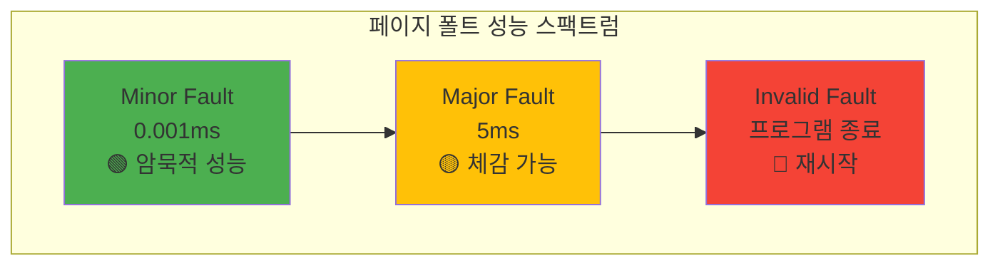

---
tags:
  - Page Fault
  - Memory Management
  - Virtual Memory
  - Computer Science
  - Overview
---

# Chapter 3-3: 페이지 폴트와 메모리 관리 개요

## 🎯 페이지 폴트와 메모리 관리의 세계로

"누구나 이 메시지를 보고 좌절한 경험이 있을 겁니다."

"Segmentation fault (core dumped)"

그런데 놀라운 사실을 알게 되었습니다. 프로그램이 정상적으로 실행될 때도 초당 수천 번의 "폴트"가 발생한다는 것을요. 다만 이것들은 **좋은 폴트**입니다. 페이지 폴트는 버그가 아니라, 현대 운영체제의 핵심 메커니즘입니다.

더 충격적인 사실: Chrome이 10GB 메모리를 "사용"한다고 표시되어도, 실제로는 2GB만 쓰고 있을 수 있습니다. 나머지 8GB는 "약속"일 뿐이죠. 이게 가능한 이유가 바로 페이지 폴트입니다.

## 📚 학습 로드맵

이 섹션은 5개의 전문화된 문서로 구성되어 있습니다:

### 1️⃣ [페이지 폴트 종류와 처리](03a-page-fault-types-handling.md)

- Minor, Major, Invalid Fault의 분류와 특성
- Linux 커널의 페이지 폴트 핸들러 동작 원리
- 성능 차이의 근본 원인과 영향 분석
- Segmentation Fault의 진실과 OS 응급실 체계

### 2️⃣ [Copy-on-Write 메커니즘](03b-copy-on-write.md)

- fork()가 빠른 이유: 게으른 복사의 천재성
- Redis의 100GB 백업을 1초에 하는 비밀
- CoW 구현과 실전 활용 사례
- 이점과 한계, 최적화 전략

### 3️⃣ [Demand Paging 메커니즘](03c-demand-paging.md)

- malloc()의 거짓말: 1GB 할당 ≠ 1GB 사용
- 게으른 메모리 할당의 미학과 원리
- Prefaulting 최적화와 HugePage 활용
- 메모리 효율성과 성능 개선 기법

### 4️⃣ [스왑과 메모리 압박](03d-swap-memory-pressure.md)

- 스왑 지옥: 컴퓨터가 느려지는 이유
- RAM vs 디스크의 10,000배 성능 차이
- kswapd 데몬과 LRU 알고리즘의 일상
- Swappiness 제어와 zRAM 활용 전략

### 5️⃣ [OOM Killer와 실전 최적화](03e-oom-optimization.md)

- OOM Score 계산: 누가 죽을 것인가?
- 사형수 선정 기준과 방지 전략
- 페이지 폴트 프로파일링과 최적화 노하우
- 체크리스트: 페이지 폴트 마스터 되기

## 🎯 핵심 개념 비교표

| 개념 | Minor Fault | Major Fault | Invalid Fault |
|------|-------------|-------------|---------------|
| **처리 시간** | ~0.001ms | ~5ms | 즉시 종료 |
| **발생 원인** | 메모리 연결 필요 | 디스크 I/O 필요 | 잘못된 접근 |
| **영향도** | 무시 가능 | 성능 저하 | 프로그램 크래시 |
| **최적화** | Prefaulting | Page Cache | 코드 검토 |

## 🚀 실전 활용 시나리오

### Redis 백그라운드 저장

- **문제**: 100GB 데이터베이스를 디스크에 저장하면서 서비스 중단 없이 계속 실행
- **해결**: fork() + CoW로 스냅샷 생성, 수정된 페이지만 복사
- **결과**: 1초 만에 백그라운드 저장 시작, 메모리 오버헤드 <10%

### 게임 서버 메모리 최적화  

- **문제**: 수백 MB 초기화 데이터를 여러 워커가 공유해야 함
- **해결**: 부모 프로세스에서 초기화 후 fork(), CoW로 공유
- **결과**: 메모리 사용량 1/10로 감소, 시작 시간 90% 단축

### 웹 브라우저 탭 관리

- **문제**: 각 탭이 독립적 메모리 공간이 필요하지만 공통 데이터 많음
- **해결**: Demand Paging으로 필요한 부분만 로드
- **결과**: 100개 탭 실행 시에도 실제 메모리 사용량은 10-20개 탭 수준

## 🎭 학습 전략

### 초보자 (추천 순서)

1. [페이지 폴트 종류와 처리](03a-page-fault-types-handling.md) → 기본 개념 이해
2. [Copy-on-Write 메커니즘](03b-copy-on-write.md) → fork() 마법 체험
3. [Demand Paging 메커니즘](03c-demand-paging.md) → malloc() 거짓말 폭로
4. 간단한 메모리 프로파일링 연습

### 중급자 (심화 학습)

1. [스왑과 메모리 압박](03d-swap-memory-pressure.md) → 성능 최적화 핵심
2. [OOM Killer와 실전 최적화](03e-oom-optimization.md) → 고급 디버깅
3. 실제 프로덕션 환경 적용

### 고급자 (마스터 과정)

- 모든 섹션 → 커널 소스 코드 분석 → 자체 메모리 관리 시스템 구현

## 🔗 연관 학습

### 선행 학습

- [주소 변환 메커니즘](01-address-translation.md) - MMU와 페이지 테이블 기초
- [TLB와 캐싱](02-tlb-caching.md) - 성능 최적화 기반 지식

### 후속 학습  

- [메모리 압축과 중복 제거](04-compression-deduplication.md) - 고급 메모리 기법
- [프로세스 생성과 관리](../chapter-04-process-thread/01-process-creation.md) - fork()와 CoW 실전

## 📊 성능 범위 비교 차트



### 성능 임계점

- **우수**: Minor Fault 초당 1000회 이하
- **보통**: Minor Fault 초당 1000-5000회
- **주의**: Major Fault 초당 10회 이상
- **심각**: Major Fault 초당 100회 이상

## 🤔 사례 연구 모음

### 성능 문제 진단 패턴

1. **"Application is slow"**
   - 검사 순서: Major Fault → Swap 사용량 → OOM Log → Memory Leak
   - 해결 순서: Page Cache → Prefaulting → Memory Optimization

2. **"System becomes unresponsive"**
   - 원인: 스왑 지옥 (10,000배 느림)
   - 방지: swappiness 조절, zRAM 도입, 사전 메모리 방지

3. **"Process suddenly terminated"**
   - OOM Score 계산에 의한 희생자 선정
   - 방지: oom_score_adj -1000, cgroup 메모리 제한

### 벤치마크 결과

- **Minor Fault**: 25,000회/초 처리 가능 (오버헤드 ~25ms/초)
- **Major Fault**: 200회/초마다 1초 대기 시간
- **CoW 효율**: 수정 비율 <5%일 때 95% 메모리 절약

## 🔧 고급 최적화 기법 미리보기

### 하드웨어 최적화

- **Huge Pages**: 4KB → 2MB/1GB 페이지로 TLB 리스 50% 전팩
- **NUMA Awareness**: CPU-메모리 지역성으로 30% 성능 향상
- **Memory Prefetching**: 하드웨어 예측으로 레이턴시 숨기기

### 커널 튜닝

```bash
# 튜닝 매개변수 예시
echo 1 > /proc/sys/vm/drop_caches        # 캐시 삭제
echo 0 > /proc/sys/vm/swappiness         # 스왑 방지
echo madvise > /sys/kernel/mm/transparent_hugepage/enabled
```

### 애플리케이션 레벨 최적화

- **Memory Pool**: malloc() 오버헤드 제거, 리수 커끝 효과
- **Object Pool**: 생성/소멸 비용 절약, GC 압박 감소
- **Copy Elimination**: 무의미한 데이터 복사 제거

### 3.1 Demand Paging 원리: "필요할 때까지 미루자"

대학생 시절 과제를 마감 직전까지 미뤘던 기억이 있나요? OS도 똑같습니다! malloc(1GB)를 호출해도, OS는 "알았어, 1GB 줄게"라고 거짓말하고 실제로는 한 바이트도 주지 않습니다.

진짜 메모리는 여러분이 실제로 쓸 때만 줍니다. 이게 Demand Paging입니다.


### 3.2 Demand Paging 구현: 거짓말의 현장

malloc()의 거짓말을 직접 확인해봅시다:

```c
// Demand Paging 폭로: malloc()의 거짓말
#include <sys/mman.h>
#include <time.h>

void demonstrate_demand_paging() {
    printf("=== Demand Paging: OS의 거짓말 실험 ===, , ");

    size_t size = 1ULL << 30;  // 1GB (기가바이트!)

    // 1. 1GB "할당" (거짓말의 시작)
    printf("[Step 1] 1GB 메모리 할당 요청..., ");
    clock_t start = clock();
    char *huge_array = mmap(NULL, size,
                           PROT_READ | PROT_WRITE,
                           MAP_PRIVATE | MAP_ANONYMOUS,
                           -1, 0);
    clock_t alloc_time = clock() - start;

    printf("✓ 할당 완료! 소요 시간: %.3f ms, ",
           (double)alloc_time * 1000 / CLOCKS_PER_SEC);
    printf("😏 OS: \"1GB 드렸습니다\" (사실 0 바이트), ");

    long rss_after_alloc = get_rss_kb();
    printf("실제 메모리 사용량: %ld MB, ", rss_after_alloc / 1024);
    printf("👀 어? 메모리가 늘지 않았네요?, , ");

    // 2. 실제 사용 (진실의 순간)
    printf("[Step 2] 이제 진짜로 메모리를 사용해봅시다..., ");
    start = clock();
    size_t pages_to_touch = 1000;

    for (size_t i = 0; i < pages_to_touch; i++) {
        huge_array[i * 4096] = 'A';  // 페이지 터치 → Page Fault → 진짜 할당!
        if (i % 100 == 0) {
            printf("  %zu 페이지 사용 중... (Page Fault 발생!), ", i);
        }
    }
    clock_t use_time = clock() - start;

    printf(", [Step 3] 결과 분석, ");
    printf("접근한 페이지: %zu개, ", pages_to_touch);
    printf("소요 시간: %.3f ms (Page Fault 처리 포함), ",
           (double)use_time * 1000 / CLOCKS_PER_SEC);

    long rss_after_use = get_rss_kb();
    printf(", 💡 진실이 밝혀졌습니다!, ");
    printf("  할당 요청: 1024 MB, ");
    printf("  실제 사용: %ld MB, ", (rss_after_use - rss_after_alloc) / 1024);
    printf("  OS의 거짓말: %.1f%%, ",
           (1 - (double)(rss_after_use - rss_after_alloc) / (1024 * 1024)) * 100);
    printf(", 😎 이것이 Demand Paging의 마법입니다!, ");

    munmap(huge_array, size);
}

// 페이지 폴트 추적
void trace_page_faults() {
    struct rusage usage_before, usage_after;
    getrusage(RUSAGE_SELF, &usage_before);

    // 대량 메모리 할당 및 사용
    size_t size = 100 * 1024 * 1024;
    char *mem = calloc(1, size);  // calloc은 0으로 초기화

    getrusage(RUSAGE_SELF, &usage_after);

    printf("Page faults for %zu MB:, ", size / (1024*1024));
    printf("  Minor: %ld, ",
           usage_after.ru_minflt - usage_before.ru_minflt);
    printf("  Major: %ld, ",
           usage_after.ru_majflt - usage_before.ru_majflt);

    // calloc은 모든 페이지를 터치함
    // 예상: size / 4096 개의 minor fault

    free(mem);
}
```

### 3.3 Prefaulting 최적화: 거짓말 없는 할당

가끔은 진짜로 메모리가 바로 필요할 때가 있습니다. 게임 로딩이나 실시간 시스템처럼요:

```c
// 페이지 프리폴팅으로 성능 향상
void optimize_with_prefaulting() {
    size_t size = 100 * 1024 * 1024;

    // 1. 일반적인 할당
    char *normal = malloc(size);
    clock_t start = clock();

    // 실제 사용 시 페이지 폴트 발생
    memset(normal, 0, size);

    clock_t normal_time = clock() - start;
    printf("Normal allocation + use: %.3f ms, ",
           (double)normal_time * 1000 / CLOCKS_PER_SEC);

    // 2. MAP_POPULATE로 프리폴팅
    start = clock();
    char *prefault = mmap(NULL, size,
                         PROT_READ | PROT_WRITE,
                         MAP_PRIVATE | MAP_ANONYMOUS | MAP_POPULATE,
                         -1, 0);
    clock_t prefault_alloc = clock() - start;

    // 이미 물리 메모리에 매핑됨
    start = clock();
    memset(prefault, 0, size);
    clock_t prefault_use = clock() - start;

    printf("Prefault allocation: %.3f ms, ",
           (double)prefault_alloc * 1000 / CLOCKS_PER_SEC);
    printf("Prefault use: %.3f ms (faster!), ",
           (double)prefault_use * 1000 / CLOCKS_PER_SEC);

    free(normal);
    munmap(prefault, size);
}
```

## 4. 스왑과 메모리 압박: 컴퓨터의 숨막히는 순간

### 4.1 스왑 메커니즘: 디스크를 메모리처럼 쓰는 절망

여러분 컴퓨터가 갑자기 엄청 느려진 경험 있나요? 마우스도 뚝뚝 끊기고, 프로그램 전환에 몇 초씩 걸리고... 그게 바로 **스왑 지옥**입니다.

스왑은 RAM이 부족할 때 디스크를 메모리처럼 쓰는 최후의 수단입니다. 문제는 디스크가 RAM보다 10,000배 느리다는 겁니다!


### 4.2 스왑 구현과 관리: 지옥으로 가는 길

스왑이 실제로 얼마나 끔찍한지 보여드리겠습니다:

```c
// 스왑 지옥 체험: 컴퓨터를 느리게 만드는 방법
#include <sys/sysinfo.h>

void demonstrate_swap_behavior() {
    printf("=== 스왑 지옥 시뮬레이션 ===, ");
    printf("⚠️  경고: 시스템이 느려질 수 있습니다!, , ");

    struct sysinfo info;
    sysinfo(&info);

    printf("[현재 시스템 상태], ");
    printf("  RAM: %lu / %lu MB (%.1f%% 사용중), ",
           (info.totalram - info.freeram) / 1024 / 1024,
           info.totalram / 1024 / 1024,
           (1.0 - (double)info.freeram / info.totalram) * 100);
    printf("  Swap: %lu / %lu MB, ",
           (info.totalswap - info.freeswap) / 1024 / 1024,
           info.totalswap / 1024 / 1024);

    if (info.totalswap - info.freeswap > 0) {
        printf(", 😱 이미 스왑을 사용 중입니다!, ");
        printf("   시스템이 느린 이유를 찾았네요..., ");
    }

    // 메모리 압박 생성
    size_t chunk_size = 100 * 1024 * 1024;  // 100MB
    void **chunks = malloc(100 * sizeof(void*));
    int allocated = 0;

    while (allocated < 100) {
        chunks[allocated] = malloc(chunk_size);
        if (!chunks[allocated]) break;

        // 실제로 메모리 사용 (페이지 폴트 유발)
        memset(chunks[allocated], 'X', chunk_size);
        allocated++;

        sysinfo(&info);

        // 스왑 사용 감지
        if (info.freeswap < info.totalswap * 0.9) {
            printf(", 🚨 스왑 발생! (청크 %d에서), ", allocated);
            printf("  스왑 사용량: %lu MB, ",
                   (info.totalswap - info.freeswap) / 1024 / 1024);
            printf("  시스템 반응 속도: 🐌 (매우 느림), ");
            printf("  디스크 LED: 📍 (미친듯이 깜빡임), ");
            break;  // 더 이상은 위험!
        }
    }

    // 정리
    for (int i = 0; i < allocated; i++) {
        free(chunks[i]);
    }
    free(chunks);
}

// 스왑 성능 영향: RAM vs 디스크의 잔인한 차이
void measure_swap_impact() {
    printf(", === 스왑 성능 테스트: 천국 vs 지옥 ===, ");
    size_t test_size = 10 * 1024 * 1024;  // 10MB
    char *test_memory = malloc(test_size);

    // 1. 메모리에 있을 때 성능
    memset(test_memory, 'A', test_size);

    clock_t start = clock();
    volatile long sum = 0;
    for (size_t i = 0; i < test_size; i++) {
        sum += test_memory[i];
    }
    clock_t memory_time = clock() - start;

    // 2. 스왑 유도 (madvise)
    madvise(test_memory, test_size, MADV_PAGEOUT);  // Linux 5.4+

    // 3. 스왑에서 읽기 성능
    start = clock();
    sum = 0;
    for (size_t i = 0; i < test_size; i++) {
        sum += test_memory[i];  // Major page fault 발생
    }
    clock_t swap_time = clock() - start;

    double mem_ms = (double)memory_time * 1000 / CLOCKS_PER_SEC;
    double swap_ms = (double)swap_time * 1000 / CLOCKS_PER_SEC;

    printf(", 📊 충격적인 결과:, ");
    printf("  RAM 접근: %.3f ms ⚡, ", mem_ms);
    printf("  Swap 접근: %.3f ms 🐌, ", swap_ms);
    printf("  속도 차이: %.1f배 느림!, ", swap_ms / mem_ms);
    printf(", 💡 교훈: 스왑이 시작되면 RAM을 추가하세요!, ");

    free(test_memory);
}
```

### 4.3 Swappiness 제어: 스왑 민감도 조절

Linux는 언제 스왑을 시작할지 결정하는 'swappiness'라는 값이 있습니다. 0부터 100까지, 마치 매운맛 단계처럼:

```c
// 스왑 경향성 제어
void control_swappiness() {
    // 현재 swappiness 확인
    FILE *f = fopen("/proc/sys/vm/swappiness", "r");
    int swappiness;
    fscanf(f, "%d", &swappiness);
    fclose(f);

    printf("Current swappiness: %d, ", swappiness);
    // 0: 스왑 최소화
    // 60: 기본값
    // 100: 적극적 스왑

    // 프로세스별 스왑 제어 (CAP_SYS_ADMIN 필요)
    size_t critical_size = 50 * 1024 * 1024;
    void *critical_data = malloc(critical_size);

    // 메모리 잠금 - 스왑 방지
    if (mlock(critical_data, critical_size) == 0) {
        printf("Critical data locked in memory, ");
    } else {
        perror("mlock failed");
    }

    // 사용 후 잠금 해제
    munlock(critical_data, critical_size);
    free(critical_data);
}
```

## 5. 메모리 회수 메커니즘: OS의 청소부

### 5.1 페이지 회수 알고리즘: 누구를 쫓아낼 것인가?

메모리가 부족하면 OS는 "청소"를 시작합니다. 하지만 누구를 쫓아내야 할까요? 방금 사용한 Chrome 탭? 아니면 어제 열어둔 메모장?

Linux의 LRU(Least Recently Used) 알고리즘이 이를 결정합니다:


### 5.2 메모리 회수 구현: kswapd 데몬의 일상

kswapd는 Linux의 청소부입니다. 24시간 일하며 메모리를 정리하죠:

```c
// 커널의 메모리 회수 시뮬레이션
typedef struct page {
    unsigned long flags;
    int ref_count;
    struct list_head lru;
    void *data;
} page_t;

#define PG_ACTIVE    (1 << 0)
#define PG_REFERENCED (1 << 1)
#define PG_DIRTY     (1 << 2)
#define PG_LOCKED    (1 << 3)

// LRU 리스트 관리
struct lru_lists {
    struct list_head active;
    struct list_head inactive;
    size_t nr_active;
    size_t nr_inactive;
};

void page_reclaim_scanner(struct lru_lists *lru) {
    struct page *page, *tmp;
    int nr_scanned = 0;
    int nr_reclaimed = 0;

    // Inactive 리스트부터 스캔
    list_for_each_entry_safe(page, tmp, &lru->inactive, lru) {
        nr_scanned++;

        // Referenced 비트 확인
        if (page->flags & PG_REFERENCED) {
            // Active 리스트로 이동
            page->flags &= ~PG_REFERENCED;
            page->flags |= PG_ACTIVE;
            list_move(&page->lru, &lru->active);
            lru->nr_inactive--;
            lru->nr_active++;
            continue;
        }

        // 회수 가능한가?
        if (page->ref_count == 0 && !(page->flags & PG_LOCKED)) {
            if (page->flags & PG_DIRTY) {
                // Dirty 페이지는 디스크에 쓰기
                writeback_page(page);
            }

            // 페이지 해제
            list_del(&page->lru);
            free_page(page);
            nr_reclaimed++;
            lru->nr_inactive--;
        }

        // 충분히 회수했으면 중단
        if (nr_reclaimed >= 32) break;
    }

    printf("Scanned: %d, Reclaimed: %d pages, ",
           nr_scanned, nr_reclaimed);
}

// 메모리 압박 감지
void memory_pressure_monitor() {
    struct sysinfo info;

    while (1) {
        sysinfo(&info);

        unsigned long total = info.totalram;
        unsigned long free = info.freeram + info.bufferram;
        unsigned long available = free + get_reclaimable();

        double pressure = 1.0 - (double)available / total;

        if (pressure > 0.9) {
            printf("CRITICAL: Memory pressure %.1f%%, ",
                   pressure * 100);
            // 적극적 회수 시작
            aggressive_reclaim();
        } else if (pressure > 0.75) {
            printf("WARNING: Memory pressure %.1f%%, ",
                   pressure * 100);
            // 백그라운드 회수
            background_reclaim();
        }

        sleep(1);
    }
}
```

## 6. OOM Killer: 누가 죽을 것인가?

### 6.1 OOM Score 계산: 사형수 선정 기준

메모리가 완전히 바닥나면, Linux는 극단적인 선택을 합니다: 프로세스를 죽입니다. 이것이 **OOM(Out Of Memory) Killer**입니다.

"누구를 죽일까?"를 결정하는 잔인한 계산식:

```c
// OOM Score: 프로세스의 "죽을 확률" 계산
int calculate_oom_score(struct task_struct *task) {
    int points = 0;

    printf("[OOM Score 계산] %s (PID: %d), ", task->comm, task->pid);

    // 1. 메모리 사용량 (죄목 1: 욕심)
    points = task->mm->total_vm;
    printf("  메모리 사용: %d MB (점수: %d), ", points / 256, points);

    // 2. 조정 요소들

    // RSS (실제 사용 메모리)
    points += get_mm_rss(task->mm) * 10;

    // 스왑 사용량
    points += get_mm_counter(task->mm, MM_SWAPENTS) * 5;

    // 실행 시간 (노인 공경)
    int runtime = (jiffies - task->start_time) / HZ;
    if (runtime > 3600) {  // 1시간 이상
        points /= 2;
        printf("  오래된 프로세스 보호 (-%d점), ", points);
    }

    // Root 프로세스 (VIP 대우)
    if (task->uid == 0) {
        points /= 4;
        printf("  Root 프로세스 특별 보호 (점수 1/4로), ");
    }

    // oom_score_adj (면죄부 또는 사형 선고)
    int adj = task->signal->oom_score_adj;
    if (adj == -1000) {
        printf("  💀 면제! (oom_score_adj = -1000), ");
        return 0;  // 절대 죽지 않음
    } else if (adj == 1000) {
        printf("  ☠️  첫 번째 희생자 지정됨! (oom_score_adj = 1000), ");
    }
    points += points * adj / 1000;

    return points;
}

// OOM Killer 실행: 생사를 가르는 순간
void oom_killer_select_victim() {
    printf(", 🔪 OOM Killer 가동!, ");
    printf("메모리가 없습니다. 누군가는 죽어야 합니다..., , ");
    struct task_struct *victim = NULL;
    int max_score = 0;

    // 모든 프로세스 검사
    for_each_process(task) {
        if (task->flags & PF_KTHREAD) {
            continue;  // 커널 스레드 제외
        }

        int score = calculate_oom_score(task);
        if (score > max_score) {
            max_score = score;
            victim = task;
        }
    }

    if (victim) {
        printf(", ⚰️  선택된 희생자:, ");
        printf("  프로세스: %s (PID: %d), ", victim->comm, victim->pid);
        printf("  죽음의 점수: %d, ", max_score);
        printf("  마지막 메시지: \"Killed\", ");

        send_sig(SIGKILL, victim, 1);  // 즉시 처형

        printf(", 시스템이 살아났습니다... %s의 희생으로., ", victim->comm);
    }
}
```

### 6.2 OOM 방지 전략: 죽음을 피하는 방법

OOM Killer의 표적이 되지 않으려면:

```c
// OOM 방지 설정
void configure_oom_prevention() {
    // 1. 프로세스 보호
    int oom_score_adj = -1000;  // OOM Kill 면제
    FILE *f = fopen("/proc/self/oom_score_adj", "w");
    fprintf(f, "%d, ", oom_score_adj);
    fclose(f);

    // 2. 메모리 제한 설정 (cgroup v2)
    FILE *mem_max = fopen("/sys/fs/cgroup/memory.max", "w");
    fprintf(mem_max, "%lu, ", 1ULL << 30);  // 1GB 제한
    fclose(mem_max);

    // 3. 메모리 예약
    FILE *mem_min = fopen("/sys/fs/cgroup/memory.min", "w");
    fprintf(mem_min, "%lu, ", 256ULL << 20);  // 256MB 보장
    fclose(mem_min);
}

// 메모리 사용량 모니터링
void monitor_memory_usage() {
    struct rusage usage;

    while (1) {
        getrusage(RUSAGE_SELF, &usage);

        long rss_mb = usage.ru_maxrss / 1024;  // Linux는 KB 단위
        long limit_mb = get_memory_limit() / 1024 / 1024;

        double usage_percent = (double)rss_mb / limit_mb * 100;

        if (usage_percent > 90) {
            printf("WARNING: Memory usage critical: %.1f%%, ",
                   usage_percent);
            // 메모리 정리 시도
            malloc_trim(0);

            // 캐시 삭제
            clear_internal_caches();
        }

        sleep(10);
    }
}
```

## 7. 실전: 페이지 폴트 최적화 노하우

### 7.1 페이지 폴트 프로파일링: 문제 찾기

```bash
# perf를 이용한 페이지 폴트 분석
$ perf record -e page-faults,major-faults ./myapp
$ perf report

# 실시간 페이지 폴트 모니터링
$ perf stat -e page-faults,major-faults -I 1000

# 특정 함수의 페이지 폴트
$ perf probe -a 'do_page_fault'
$ perf record -e probe:do_page_fault ./myapp
```

### 7.2 최적화 기법: 페이지 폴트와의 전쟁

제가 게임 서버를 최적화하면서 배운 기법들:

```c
// 페이지 폴트 최소화 전략
void optimize_page_faults() {
    // 1. 프리폴팅
    void *data = mmap(NULL, size, PROT_READ | PROT_WRITE,
                     MAP_PRIVATE | MAP_ANONYMOUS | MAP_POPULATE,
                     -1, 0);

    // 2. Huge Pages 사용
    void *huge = mmap(NULL, size, PROT_READ | PROT_WRITE,
                     MAP_PRIVATE | MAP_ANONYMOUS | MAP_HUGETLB,
                     -1, 0);

    // 3. 메모리 잠금
    mlock(critical_data, critical_size);

    // 4. 순차 접근 힌트
    madvise(data, size, MADV_SEQUENTIAL);

    // 5. 프리페치
    for (size_t i = 0; i < size; i += 4096) {
        __builtin_prefetch(&data[i + 4096], 0, 1);
        process_page(&data[i]);
    }
}

// 페이지 폴트 비용 측정
void measure_fault_cost() {
    struct timespec start, end;
    size_t size = 100 * 1024 * 1024;

    // Cold start (페이지 폴트 포함)
    void *mem1 = malloc(size);
    clock_gettime(CLOCK_MONOTONIC, &start);
    memset(mem1, 0, size);
    clock_gettime(CLOCK_MONOTONIC, &end);

    double cold_time = (end.tv_sec - start.tv_sec) * 1000.0 +
                      (end.tv_nsec - start.tv_nsec) / 1000000.0;

    // Warm start (페이지 폴트 없음)
    clock_gettime(CLOCK_MONOTONIC, &start);
    memset(mem1, 1, size);
    clock_gettime(CLOCK_MONOTONIC, &end);

    double warm_time = (end.tv_sec - start.tv_sec) * 1000.0 +
                      (end.tv_nsec - start.tv_nsec) / 1000000.0;

    printf("Cold start: %.2f ms, ", cold_time);
    printf("Warm start: %.2f ms, ", warm_time);
    printf("Page fault overhead: %.2f ms, ", cold_time - warm_time);

    free(mem1);
}
```

## 8. 정리: 페이지 폴트와 메모리 관리의 핵심 정리

긴 여정이었습니다! 이제 여러분은 "Segmentation Fault"를 보고도 당황하지 않을 겁니다.

### 페이지 폴트란?

- **한 줄 요약**: CPU가 "이 메모리 어디 있어요?"라고 묻는 것
- **좋은 폴트**: Minor Fault - 빠른 처리 (0.001ms)
- **나쁜 폴트**: Major Fault - 디스크 I/O (5ms)
- **치명적 폴트**: Segmentation Fault - 게임 오버

### 왜 배워야 하는가?

1. **malloc()의 거짓말**: 1GB 할당 ≠ 1GB 사용
2. **fork()의 마법**: 100GB 복사가 1초 (CoW)
3. **스왑 지옥**: 왜 컴퓨터가 느려지는지 이해
4. **OOM Killer**: Chrome이 갑자기 죽는 이유

### 꼭 기억하세요

- **Minor Fault**: 초당 수천 번 발생해도 정상 (빠름)
- **Major Fault**: 초당 100번만 넘어도 지옥 (느림)
- **CoW**: Redis가 100GB를 1초에 백업하는 비밀
- **스왑 시작 = RAM 추가 시기**: 늦기 전에!
- **OOM Score -1000**: 불사신 프로세스 만들기

## 관련 문서

### 선행 지식

- [TLB와 캐싱](02-tlb-caching.md) - 주소 변환 성능
- [주소 변환 메커니즘](01-address-translation.md) - MMU와 페이지 테이블

### 관련 주제

- [메모리 압축](04-compression-deduplication.md) - 페이지 폴트 예방
- [Process Creation](../chapter-04-process-thread/01-process-creation.md) - fork()와 CoW
- [Signal & IPC](../chapter-04-process-thread/04-signal-ipc.md) - OOM Killer 시그널

## 다음 섹션 예고: 메모리 압축의 마법

지금까지 페이지 폴트와 메모리 관리의 기본을 배웠습니다. 하지만 더 놀라운 기술들이 있습니다.

다음 섹션 [3-4: 메모리 압축과 중복 제거](04-compression-deduplication.md)에서는 **메모리를 압축하는 마법**을 다룹니다:

- **zRAM**: RAM을 압축해서 2배로 쓰기
- **KSM**: 똑같은 메모리 페이지 합치기
- **Memory Balloon**: 가상머신의 메모리 훔치기
- **Transparent Huge Pages**: 자동 대용량 페이지

"8GB RAM으로 16GB처럼 쓰는 방법"을 알아보겠습니다!
