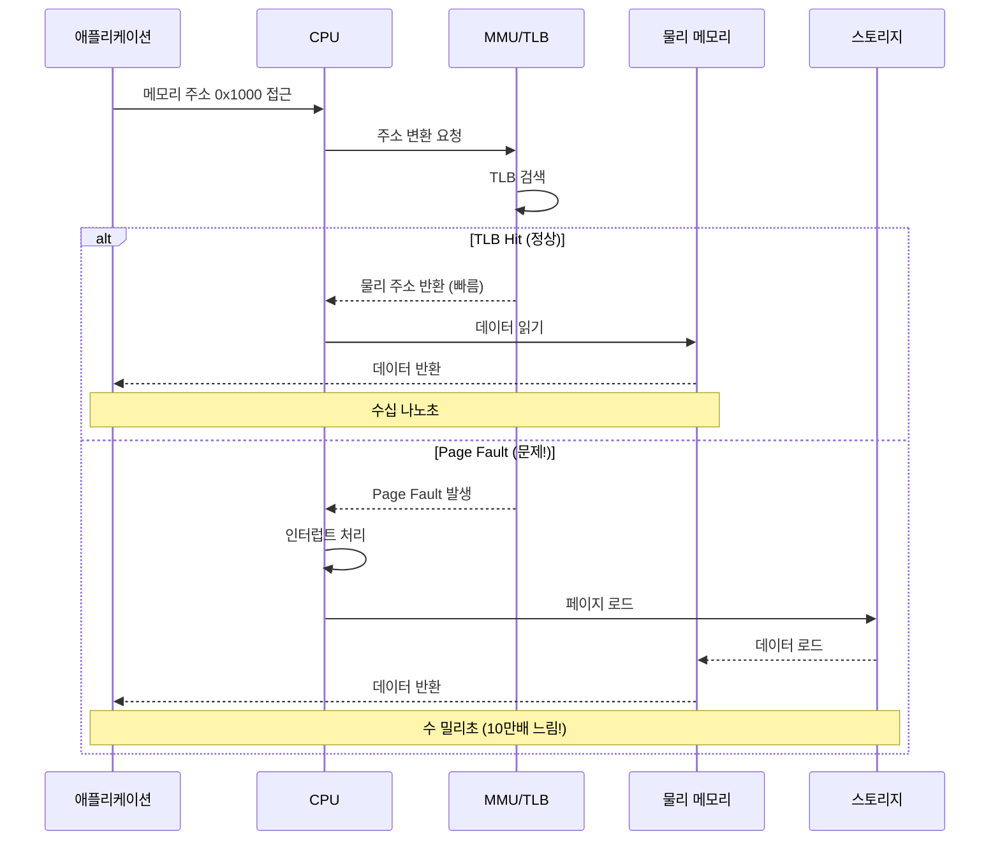
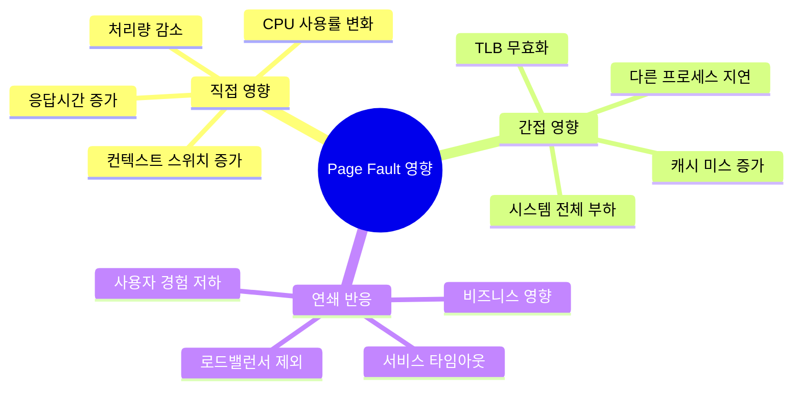
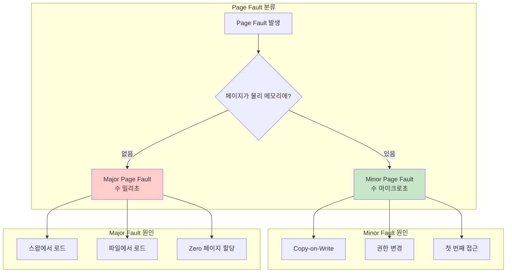
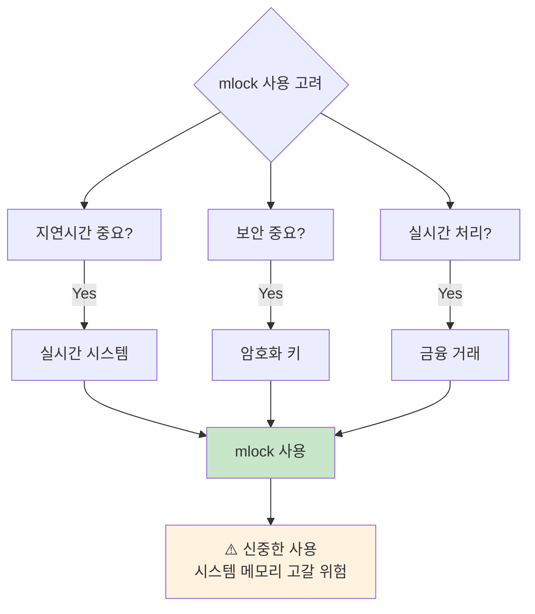
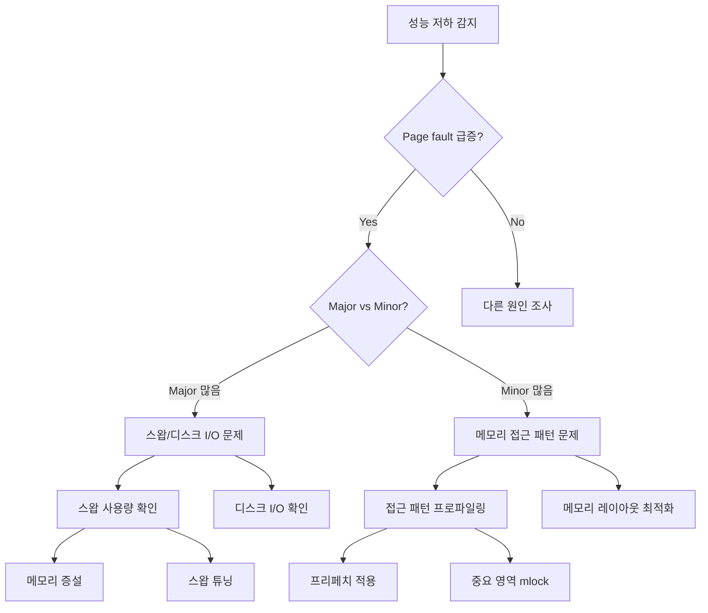

---
tags:
  - VirtualMemory
  - PageFault
  - Performance
  - perf
  - mlock
---

# 3-5: Page Fault 분석 - "갑자기 응답이 느려졌어요"

## 이 문서를 읽으면 답할 수 있는 질문들

- Page fault가 성능에 미치는 실제 영향은?
- major fault와 minor fault의 차이와 원인은?
- /proc/[pid]/stat에서 page fault 정보를 어떻게 해석하나요?
- perf를 사용해 page fault를 정확히 측정하는 방법은?
- mlock/mlockall을 언제, 어떻게 사용해야 하나요?

## 들어가며: 보이지 않는 성능 킬러

"서버가 갑자기 느려졌는데 CPU, 메모리, 디스크 모두 정상이에요..."

이런 미스터리한 성능 저하를 경험해보신 적 있나요? 범인은 종종 **page fault**입니다.



Page fault 하나가 전체 애플리케이션을 수만 배 느리게 만들 수 있습니다.

### Page Fault가 성능에 미치는 파급효과



## 1. Page Fault 종류와 원인 분석

### 1.1 Minor vs Major Page Fault



**실제 비용 차이**:

- **Minor fault**: 1-10 마이크로초 (메모리 내 작업만)
- **Major fault**: 1-10 밀리초 (디스크 I/O 포함)

**1000배 이상의 성능 차이!**

### 1.2 /proc/[pid]/stat에서 Page Fault 추적

```bash
# 프로세스의 page fault 정보 확인
$ cat /proc/1234/stat | cut -d' ' -f10,12
2340 156    # minor_faults major_faults

# 더 읽기 쉬운 형태로
$ awk '{print "Minor faults: " $10 "\nMajor faults: " $12}' /proc/1234/stat
Minor faults: 2340
Major faults: 156

# 실시간 page fault 모니터링
$ while true; do
    echo -n "$(date '+%H:%M:%S'): "
    awk '{printf "Minor: %8d, Major: %5d\n", $10, $12}' /proc/1234/stat
    sleep 1
done
```

**Page Fault 급증 감지 스크립트**:

```bash
#!/bin/bash
# pagefault_monitor.sh

PID=$1
THRESHOLD_MINOR=1000  # 초당 minor fault 임계값
THRESHOLD_MAJOR=10    # 초당 major fault 임계값

if [ -z "$PID" ]; then
    echo "Usage: $0 <pid>"
    exit 1
fi

# 이전 값 초기화
prev_minor=0
prev_major=0
prev_time=$(date +%s)

echo "Page Fault 모니터링 시작: PID $PID"
echo "Minor fault 임계값: $THRESHOLD_MINOR/sec"
echo "Major fault 임계값: $THRESHOLD_MAJOR/sec"
echo ""

while true; do
    if [ ! -d "/proc/$PID" ]; then
        echo "프로세스 $PID 종료됨"
        break
    fi
    
    # 현재 통계 읽기
    stats=$(cat /proc/$PID/stat 2>/dev/null)
    if [ -z "$stats" ]; then
        sleep 1
        continue
    fi
    
    curr_minor=$(echo $stats | cut -d' ' -f10)
    curr_major=$(echo $stats | cut -d' ' -f12)  
    curr_time=$(date +%s)
    
    if [ $prev_minor -ne 0 ]; then
        # 초당 page fault 계산
        time_diff=$((curr_time - prev_time))
        if [ $time_diff -gt 0 ]; then
            minor_rate=$(((curr_minor - prev_minor) / time_diff))
            major_rate=$(((curr_major - prev_major) / time_diff))
            
            printf "[%s] Minor: %8d/sec, Major: %5d/sec" \
                   "$(date '+%H:%M:%S')" "$minor_rate" "$major_rate"
            
            # 임계값 초과 경고
            if [ $minor_rate -gt $THRESHOLD_MINOR ]; then
                printf " ⚠️  Minor fault 급증!"
            fi
            
            if [ $major_rate -gt $THRESHOLD_MAJOR ]; then
                printf " 🚨 Major fault 급증!"
            fi
            
            printf "\n"
        fi
    fi
    
    prev_minor=$curr_minor
    prev_major=$curr_major  
    prev_time=$curr_time
    
    sleep 1
done
```

## 2. perf를 이용한 정밀 분석

### 2.1 페이지 폴트 성능 측정

```bash
# 기본 page fault 카운팅
$ perf stat -e page-faults,minor-faults,major-faults ./program

Performance counter stats for './program':
         12,543      page-faults
         12,387      minor-faults  
            156      major-faults

       2.347821      seconds time elapsed

# CPU별 page fault 분포
$ perf stat -e page-faults -a -A sleep 10
CPU0                     1,234      page-faults
CPU1                     2,456      page-faults  
CPU2                       789      page-faults
CPU3                     3,123      page-faults

# cgroup별 page fault 측정 (컨테이너 환경)
$ perf stat -e page-faults -G docker/container_id ./program
```

### 2.2 페이지 폴트 핫스팟 분석

```bash
# page fault 발생 지점 프로파일링
$ perf record -e page-faults -g ./program
$ perf report --stdio

# 출력 예시:
# 45.23%  program  [kernel.kallsyms]  [k] __handle_mm_fault
#         |
#         --- __handle_mm_fault
#             handle_mm_fault
#             __do_page_fault  
#             page_fault
#             [...]
#             main (in /path/to/program)

# 특정 함수의 page fault 분석
$ perf annotate --stdio handle_mm_fault

# 메모리 접근 패턴 분석
$ perf c2c record ./program          # Cache-to-Cache 전송 기록
$ perf c2c report --stats            # 분석 결과 출력
```

### 2.3 실시간 페이지 폴트 트레이싱

```bash
# ftrace를 이용한 실시간 추적
$ echo 1 > /sys/kernel/debug/tracing/events/exceptions/page_fault_user/enable
$ echo 1 > /sys/kernel/debug/tracing/events/exceptions/page_fault_kernel/enable

# 특정 프로세스만 추적
$ echo $PID > /sys/kernel/debug/tracing/set_ftrace_pid
$ cat /sys/kernel/debug/tracing/trace_pipe

# bpftrace를 이용한 고급 분석
$ bpftrace -e '
kprobe:__handle_mm_fault {
    @faults[comm] = count();
}

interval:s:5 {
    print(@faults);
    clear(@faults);
}'
```

## 3. 메모리 잠금 (mlock/mlockall) 활용

### 3.1 언제 mlock을 사용해야 하는가?



**mlock 사용 시나리오**:

1. **고빈도 거래 시스템**: 마이크로초 단위 응답성 필요
2. **실시간 오디오/비디오**: 버퍼 언더런 방지
3. **보안 크리티컬**: 패스워드/키가 스왑으로 유출 방지
4. **게임 엔진**: 프레임 드롭 방지

### 3.2 mlock 구현과 모니터링

```c
// mlock_example.c
#include <stdio.h>
#include <stdlib.h>
#include <sys/mman.h>
#include <unistd.h>
#include <string.h>
#include <errno.h>

#define BUFFER_SIZE (64 * 1024 * 1024)  // 64MB

void print_mlock_limits() {
    // mlock 가능한 최대 메모리 확인
    FILE *limits = fopen("/proc/self/limits", "r");
    char line[256];
    
    while (fgets(line, sizeof(line), limits)) {
        if (strstr(line, "Max locked memory")) {
            printf("Max locked memory: %s", line);
            break;
        }
    }
    fclose(limits);
}

void test_selective_mlock() {
    printf("=== 선택적 mlock 테스트 ===\n");
    
    // 큰 버퍼 할당
    void *buffer = malloc(BUFFER_SIZE);
    if (!buffer) {
        perror("malloc failed");
        return;
    }
    
    // 중요한 부분만 mlock (처음 4KB)
    size_t critical_size = 4096;
    if (mlock(buffer, critical_size) == -1) {
        printf("mlock 실패: %s\n", strerror(errno));
        printf("ulimit -l로 locked memory 한계 확인 필요\n");
    } else {
        printf("Critical section (%zu bytes) locked 성공\n", critical_size);
    }
    
    // 메모리 사용 (page fault 유발)
    memset(buffer, 0xAA, BUFFER_SIZE);
    
    // 통계 확인
    printf("mlock 후 page fault 통계:\n");
    system("grep -E '(minor|major)_fault' /proc/self/stat");
    
    // 해제
    munlock(buffer, critical_size);
    free(buffer);
}

void test_mlockall() {
    printf("\n=== mlockall 테스트 ===\n");
    
    // 현재 및 미래 모든 페이지 잠금
    if (mlockall(MCL_CURRENT | MCL_FUTURE) == -1) {
        printf("mlockall 실패: %s\n", strerror(errno));
        return;
    }
    
    printf("모든 메모리 잠금 성공\n");
    
    // 새 메모리 할당 (자동으로 잠김)
    void *buffer = malloc(1024 * 1024);  // 1MB
    memset(buffer, 0xBB, 1024 * 1024);
    
    printf("새 할당 메모리도 자동으로 잠김\n");
    
    // 해제
    free(buffer);
    munlockall();
}

int main() {
    print_mlock_limits();
    
    test_selective_mlock();
    test_mlockall();
    
    return 0;
}
```

**컴파일 및 실행**:

```bash
$ gcc -o mlock_test mlock_example.c

# mlock 한계 증가 (root 권한 또는 /etc/security/limits.conf 설정 필요)
$ ulimit -l 131072  # 128MB

$ ./mlock_test
Max locked memory: Max locked memory     131072               bytes
=== 선택적 mlock 테스트 ===
Critical section (4096 bytes) locked 성공
mlock 후 page fault 통계:
grep: /proc/self/stat: No such file or directory

=== mlockall 테스트 ===
모든 메모리 잠금 성공
새 할당 메모리도 자동으로 잠김
```

### 3.3 mlock 사용 시 주의사항과 모니터링

```python
#!/usr/bin/env python3
# mlock_monitor.py
import os
import time
import signal
import sys

class MLockMonitor:
    def __init__(self):
        self.running = True
        
    def get_system_mlock_info(self):
        """시스템 전체 mlock 정보 수집"""
        info = {}
        
        try:
            with open('/proc/meminfo') as f:
                for line in f:
                    if 'Mlocked:' in line:
                        info['mlocked_kb'] = int(line.split()[1])
                    elif 'MemTotal:' in line:
                        info['total_kb'] = int(line.split()[1])
        except:
            pass
            
        return info
    
    def get_process_mlock_info(self, pid):
        """특정 프로세스의 mlock 정보"""
        try:
            with open(f'/proc/{pid}/status') as f:
                for line in f:
                    if 'VmLck:' in line:
                        return int(line.split()[1])  # KB 단위
        except:
            return 0
        
        return 0
    
    def monitor_mlock_usage(self, duration=300, interval=5):
        """mlock 사용량 모니터링"""
        print("mlock 사용량 모니터링 시작...")
        print(f"Duration: {duration}초, Interval: {interval}초")
        print()
        
        start_time = time.time()
        
        while time.time() - start_time < duration and self.running:
            # 시스템 전체 정보
            sys_info = self.get_system_mlock_info()
            
            mlocked_mb = sys_info.get('mlocked_kb', 0) // 1024
            total_mb = sys_info.get('total_kb', 0) // 1024
            mlock_percent = (mlocked_mb / total_mb * 100) if total_mb > 0 else 0
            
            print(f"[{time.strftime('%H:%M:%S')}] "
                  f"System mlock: {mlocked_mb:5d}MB / {total_mb:5d}MB "
                  f"({mlock_percent:.1f}%)")
            
            # 상위 mlock 사용 프로세스들
            mlock_processes = []
            try:
                for pid in os.listdir('/proc'):
                    if pid.isdigit():
                        mlock_kb = self.get_process_mlock_info(int(pid))
                        if mlock_kb > 0:
                            try:
                                with open(f'/proc/{pid}/comm') as f:
                                    comm = f.read().strip()
                                mlock_processes.append((int(pid), comm, mlock_kb))
                            except:
                                continue
            except:
                pass
            
            # 상위 5개 프로세스 출력
            mlock_processes.sort(key=lambda x: x[2], reverse=True)
            for pid, comm, mlock_kb in mlock_processes[:5]:
                if mlock_kb >= 1024:  # 1MB 이상만
                    print(f"  PID {pid:5d} ({comm:15s}): {mlock_kb//1024:4d}MB locked")
            
            # 위험 수준 체크
            if mlock_percent > 50:
                print("  ⚠️  시스템 mlock 사용량이 50% 초과!")
            elif mlock_percent > 80:
                print("  🚨 시스템 mlock 사용량 위험 수준!")
            
            print()
            time.sleep(interval)
    
    def stop(self):
        self.running = False

def signal_handler(signum, frame):
    print("\n모니터링 중단...")
    monitor.stop()

if __name__ == '__main__':
    monitor = MLockMonitor()
    
    signal.signal(signal.SIGINT, signal_handler)
    
    try:
        monitor.monitor_mlock_usage()
    except KeyboardInterrupt:
        print("\n프로그램 종료")
```

## 4. Page Fault 최적화 전략

### 4.1 메모리 접근 패턴 최적화

```c
// memory_access_patterns.c
#include <stdio.h>
#include <stdlib.h>
#include <sys/time.h>
#include <string.h>

#define ARRAY_SIZE (64 * 1024 * 1024 / sizeof(int))  // 64MB
#define PAGE_SIZE 4096

double get_time() {
    struct timeval tv;
    gettimeofday(&tv, NULL);
    return tv.tv_sec + tv.tv_usec / 1000000.0;
}

void test_sequential_access() {
    printf("=== 순차 접근 테스트 ===\n");
    
    int *array = malloc(ARRAY_SIZE * sizeof(int));
    double start = get_time();
    
    // 순차 접근 - 페이지 폴트 최소화
    for (int i = 0; i < ARRAY_SIZE; i++) {
        array[i] = i;
    }
    
    double end = get_time();
    printf("순차 접근 시간: %.3f초\n", end - start);
    
    free(array);
}

void test_random_access() {
    printf("\n=== 랜덤 접근 테스트 ===\n");
    
    int *array = malloc(ARRAY_SIZE * sizeof(int));
    double start = get_time();
    
    // 랜덤 접근 - 페이지 폴트 많이 발생
    for (int i = 0; i < ARRAY_SIZE; i++) {
        int idx = rand() % ARRAY_SIZE;
        array[idx] = i;
    }
    
    double end = get_time();
    printf("랜덤 접근 시간: %.3f초\n", end - start);
    
    free(array);
}

void test_page_aligned_access() {
    printf("\n=== 페이지 정렬 접근 테스트 ===\n");
    
    // 페이지 경계에 정렬된 메모리 할당
    void *raw_ptr = malloc(ARRAY_SIZE * sizeof(int) + PAGE_SIZE);
    int *array = (int*)(((uintptr_t)raw_ptr + PAGE_SIZE - 1) & ~(PAGE_SIZE - 1));
    
    double start = get_time();
    
    // 페이지 단위로 접근
    int pages = (ARRAY_SIZE * sizeof(int)) / PAGE_SIZE;
    for (int page = 0; page < pages; page++) {
        int *page_start = array + (page * PAGE_SIZE / sizeof(int));
        // 각 페이지의 첫 번째 요소만 접근 (페이지 폴트 유발)
        page_start[0] = page;
    }
    
    double end = get_time();
    printf("페이지별 접근 시간: %.3f초\n", end - start);
    
    free(raw_ptr);
}

int main() {
    printf("메모리 접근 패턴과 Page Fault 관계 테스트\n");
    printf("Array size: %zu MB\n\n", (ARRAY_SIZE * sizeof(int)) / (1024 * 1024));
    
    test_sequential_access();
    test_random_access();
    test_page_aligned_access();
    
    return 0;
}
```

### 4.2 Prefault 기법

```c
// prefault_example.c
#include <stdio.h>
#include <stdlib.h>
#include <sys/mman.h>
#include <string.h>
#include <sys/time.h>

#define BUFFER_SIZE (128 * 1024 * 1024)  // 128MB

double get_time() {
    struct timeval tv;
    gettimeofday(&tv, NULL);
    return tv.tv_sec + tv.tv_usec / 1000000.0;
}

void test_without_prefault() {
    printf("=== Prefault 없이 테스트 ===\n");
    
    // 큰 메모리 할당 (실제로는 가상 메모리만)
    char *buffer = malloc(BUFFER_SIZE);
    
    double start = get_time();
    
    // 실제 사용 시점에 page fault 발생
    for (int i = 0; i < BUFFER_SIZE; i += 4096) {  // 페이지 단위로 접근
        buffer[i] = (char)i;
    }
    
    double end = get_time();
    printf("Page fault 발생 시간: %.3f초\n", end - start);
    
    free(buffer);
}

void test_with_prefault() {
    printf("\n=== Prefault 적용 테스트 ===\n");
    
    char *buffer = malloc(BUFFER_SIZE);
    
    double start = get_time();
    
    // Prefault: 미리 모든 페이지에 접근하여 page fault 유발
    printf("Prefaulting...\n");
    for (int i = 0; i < BUFFER_SIZE; i += 4096) {
        buffer[i] = 0;  // 각 페이지의 첫 바이트 접근
    }
    
    // 실제 작업 (이제 page fault 없음)
    printf("실제 작업 시작...\n");
    double work_start = get_time();
    
    for (int i = 0; i < BUFFER_SIZE; i += 4096) {
        buffer[i] = (char)i;
    }
    
    double work_end = get_time();
    double total_end = get_time();
    
    printf("Prefault + 작업 총시간: %.3f초\n", total_end - start);
    printf("실제 작업 시간: %.3f초\n", work_end - work_start);
    
    free(buffer);
}

void test_mmap_prefault() {
    printf("\n=== mmap + MAP_POPULATE 테스트 ===\n");
    
    double start = get_time();
    
    // MAP_POPULATE: mmap 시점에 모든 페이지를 물리 메모리에 로드
    char *buffer = mmap(NULL, BUFFER_SIZE, PROT_READ | PROT_WRITE,
                       MAP_PRIVATE | MAP_ANONYMOUS | MAP_POPULATE, -1, 0);
    
    if (buffer == MAP_FAILED) {
        perror("mmap failed");
        return;
    }
    
    // 실제 작업 (page fault 없음)
    for (int i = 0; i < BUFFER_SIZE; i += 4096) {
        buffer[i] = (char)i;
    }
    
    double end = get_time();
    printf("MAP_POPULATE 총시간: %.3f초\n", end - start);
    
    munmap(buffer, BUFFER_SIZE);
}

int main() {
    printf("Prefault 기법 성능 비교\n");
    printf("Buffer size: %d MB\n\n", BUFFER_SIZE / (1024 * 1024));
    
    test_without_prefault();
    test_with_prefault();
    test_mmap_prefault();
    
    return 0;
}
```

## 5. 실무 Page Fault 트러블슈팅

### 5.1 성능 저하 진단 워크플로우



### 5.2 자동화된 Page Fault 알림 시스템

```python
#!/usr/bin/env python3
# pagefault_alerting.py
import psutil
import time
import smtplib
from datetime import datetime
from email.mime.text import MimeText

class PageFaultAlerting:
    def __init__(self, config):
        self.config = config
        self.alert_history = {}
        
    def get_process_page_faults(self, pid):
        """프로세스 page fault 정보 수집"""
        try:
            with open(f'/proc/{pid}/stat') as f:
                fields = f.read().split()
                return {
                    'minor_faults': int(fields[9]),
                    'major_faults': int(fields[11]),
                    'child_minor_faults': int(fields[10]),
                    'child_major_faults': int(fields[12])
                }
        except:
            return None
    
    def check_page_fault_anomaly(self, pid, current_stats, previous_stats, time_diff):
        """Page fault 이상 패턴 감지"""
        if not previous_stats or time_diff <= 0:
            return None
            
        # 초당 page fault 계산
        minor_rate = (current_stats['minor_faults'] - previous_stats['minor_faults']) / time_diff
        major_rate = (current_stats['major_faults'] - previous_stats['major_faults']) / time_diff
        
        alerts = []
        
        # 임계값 체크
        if minor_rate > self.config['minor_fault_threshold']:
            alerts.append({
                'type': 'minor_fault_spike',
                'rate': minor_rate,
                'threshold': self.config['minor_fault_threshold']
            })
        
        if major_rate > self.config['major_fault_threshold']:
            alerts.append({
                'type': 'major_fault_spike', 
                'rate': major_rate,
                'threshold': self.config['major_fault_threshold']
            })
        
        return alerts if alerts else None
    
    def send_alert(self, pid, process_name, alerts):
        """알림 전송"""
        alert_key = f"{pid}_{alerts[0]['type']}"
        current_time = time.time()
        
        # 중복 알림 방지 (5분 내 동일 알림 무시)
        if alert_key in self.alert_history:
            if current_time - self.alert_history[alert_key] < 300:
                return
        
        self.alert_history[alert_key] = current_time
        
        # 알림 메시지 구성
        message = f"""
Page Fault Alert - {datetime.now().strftime('%Y-%m-%d %H:%M:%S')}

Process: {process_name} (PID: {pid})
Alerts:
"""
        
        for alert in alerts:
            message += f"- {alert['type']}: {alert['rate']:.1f}/sec (threshold: {alert['threshold']}/sec)\n"
        
        print(f"🚨 ALERT: {message}")
        
        # 실제 환경에서는 Slack, PagerDuty 등으로 전송
        # self.send_to_slack(message)
        # self.send_email(message)
    
    def monitor_processes(self, process_patterns, duration=3600, interval=10):
        """프로세스 모니터링"""
        print(f"Page fault 모니터링 시작: {duration}초간 {interval}초 간격")
        print(f"대상 프로세스: {process_patterns}")
        print(f"임계값 - Minor: {self.config['minor_fault_threshold']}/sec, "
              f"Major: {self.config['major_fault_threshold']}/sec")
        print()
        
        previous_stats = {}
        previous_time = {}
        
        start_time = time.time()
        
        while time.time() - start_time < duration:
            current_time = time.time()
            
            # 모니터링 대상 프로세스 찾기
            for proc in psutil.process_iter(['pid', 'name']):
                try:
                    pid = proc.info['pid']
                    name = proc.info['name']
                    
                    # 패턴 매칭
                    if not any(pattern in name for pattern in process_patterns):
                        continue
                    
                    # Page fault 통계 수집
                    current_stats = self.get_process_page_faults(pid)
                    if not current_stats:
                        continue
                    
                    # 이전 통계와 비교
                    if pid in previous_stats:
                        time_diff = current_time - previous_time[pid]
                        alerts = self.check_page_fault_anomaly(
                            pid, current_stats, previous_stats[pid], time_diff
                        )
                        
                        if alerts:
                            self.send_alert(pid, name, alerts)
                    
                    # 통계 업데이트
                    previous_stats[pid] = current_stats
                    previous_time[pid] = current_time
                    
                except (psutil.NoSuchProcess, psutil.AccessDenied):
                    continue
            
            time.sleep(interval)

if __name__ == '__main__':
    config = {
        'minor_fault_threshold': 1000,  # 초당 minor fault 임계값
        'major_fault_threshold': 10,    # 초당 major fault 임계값
    }
    
    alerting = PageFaultAlerting(config)
    
    # 모니터링할 프로세스 패턴
    process_patterns = ['nginx', 'mysql', 'redis', 'java', 'python']
    
    try:
        alerting.monitor_processes(process_patterns, duration=3600, interval=5)
    except KeyboardInterrupt:
        print("\n모니터링 종료")
```

## 6. 정리와 Best Practices

Page fault는 성능에 치명적 영향을 줄 수 있는 숨은 병목점입니다. 체계적인 모니터링과 최적화로 예방할 수 있습니다.

### 6.1 Page Fault 최적화 체크리스트

**모니터링**:

- [ ] Major vs Minor fault 비율 추적
- [ ] Page fault 급증 알림 시스템 구축  
- [ ] 메모리 접근 패턴 프로파일링
- [ ] 스왑 사용량 정기적 확인

**최적화**:

- [ ] 순차 접근 패턴으로 코드 수정
- [ ] 중요한 메모리 영역 mlock 적용
- [ ] Prefault 기법으로 지연시간 제거
- [ ] 메모리 레이아웃 최적화

**운영**:

- [ ] 적절한 스왑 크기 설정
- [ ] mlock 한계값 조정
- [ ] NUMA 바인딩 고려
- [ ] 메모리 압축 기능 활용

다음 섹션에서는 메모리 매핑과 고급 최적화 기법을 다뤄보겠습니다.

Page fault 없는 빠른 시스템을 만들어봅시다! ⚡
