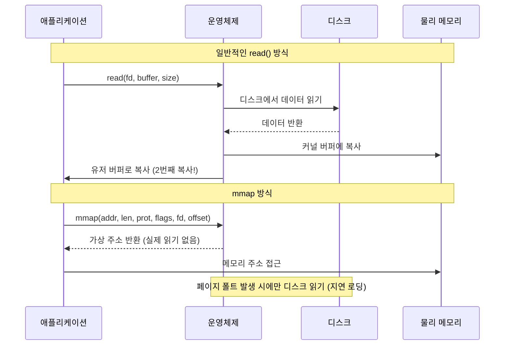
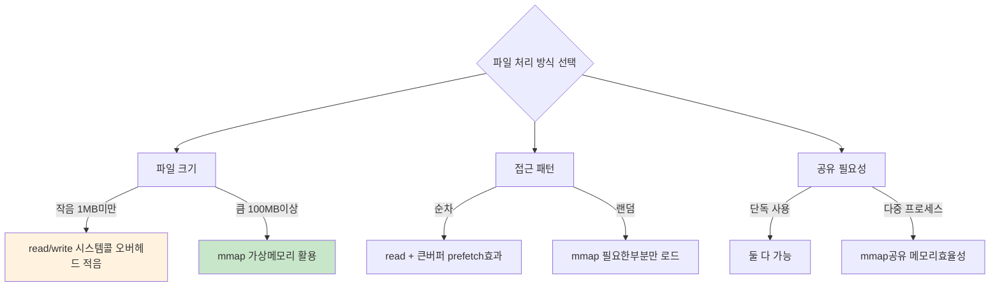

---
tags:
  - VirtualMemory
  - mmap
  - Performance
  - FileIO
---

# 3-6A: mmap vs read/write 성능 비교

## mmap의 핵심 장점 이해하기

"1GB 로그 파일을 분석하는데 왜 이렇게 느릴까?"

대용량 파일 처리에서 mmap이 어떤 차이를 만드는지 구체적으로 알아봅시다.



**mmap의 핵심 장점**:

1. **Zero-copy**: 불필요한 메모리 복사 제거
2. **지연 로딩**: 실제 접근하는 부분만 읽기
3. **공유 가능**: 여러 프로세스가 동일 파일 공유
4. **캐시 효율성**: 페이지 캐시 직접 활용

## 선택 기준과 성능 분석

### 언제 mmap을 사용해야 할까?



## 실제 성능 벤치마크

성능 차이를 구체적으로 측정해봅시다:

```c
// file_access_benchmark.c - mmap vs read/write 성능 비교
#include <stdio.h>
#include <sys/mman.h>
#include <sys/stat.h>
#include <fcntl.h>
#include <sys/time.h>

#define FILE_SIZE (256 * 1024 * 1024)  // 256MB로 축소
#define BUFFER_SIZE (64 * 1024)

double get_time() {
    struct timeval tv;
    gettimeofday(&tv, NULL);
    return tv.tv_sec + tv.tv_usec / 1000000.0;
}

// 1. read() 방식: 커널-유저 공간 복사 발생
void test_read_method(const char *filename) {
    printf("=== read() 시스템 콜 방식 ===\n");

    int fd = open(filename, O_RDONLY);
    char *buffer = malloc(BUFFER_SIZE);
    double start = get_time();

    size_t total = 0;
    ssize_t bytes;
    while ((bytes = read(fd, buffer, BUFFER_SIZE)) > 0) {
        total += bytes;
        // 실제 처리 시뮬레이션: 매 1KB마다 접근
        for (int i = 0; i < bytes; i += 1024) {
            volatile char c = buffer[i];  // CPU 캐시 효과 제거
        }
    }

    double elapsed = get_time() - start;
    printf("  처리량: %zu MB, 시간: %.3f초, 속도: %.1f MB/s\n",
           total / 1024 / 1024, elapsed, (total / 1024.0 / 1024.0) / elapsed);

    free(buffer);
    close(fd);
}

// 2. mmap() 방식: 가상 메모리 직접 매핑
void test_mmap_method(const char *filename) {
    printf("\n=== mmap() 메모리 매핑 방식 ===\n");

    int fd = open(filename, O_RDONLY);
    struct stat st;
    fstat(fd, &st);

    double start = get_time();

    // 파일을 가상 메모리에 직접 매핑 (zero-copy)
    char *mapped = mmap(NULL, st.st_size, PROT_READ, MAP_PRIVATE, fd, 0);

    // 페이지 단위 접근으로 page fault 유발
    for (size_t i = 0; i < st.st_size; i += 1024) {
        volatile char c = mapped[i];  // 지연 로딩 트리거
    }

    double elapsed = get_time() - start;
    printf("  처리량: %ld MB, 시간: %.3f초, 속도: %.1f MB/s\n",
           st.st_size / 1024 / 1024, elapsed,
           (st.st_size / 1024.0 / 1024.0) / elapsed);

    munmap(mapped, st.st_size);
    close(fd);
}

// 3. 랜덤 접근 패턴에서 mmap의 장점
void test_random_access(const char *filename) {
    printf("\n=== 랜덤 접근 성능 비교 ===\n");

    int fd = open(filename, O_RDONLY);
    struct stat st;
    fstat(fd, &st);

    char *mapped = mmap(NULL, st.st_size, PROT_READ, MAP_PRIVATE, fd, 0);

    double start = get_time();
    srand(42);  // 재현 가능한 결과

    // 10만 번의 랜덤 위치 접근 - 필요한 페이지만 로드
    const int accesses = 100000;
    for (int i = 0; i < accesses; i++) {
        size_t offset = rand() % (st.st_size - 1024);
        volatile char c = mapped[offset];
    }

    double elapsed = get_time() - start;
    printf("  랜덤 접근: %d회, 시간: %.3f초, 속도: %.0f ops/s\n",
           accesses, elapsed, accesses / elapsed);

    munmap(mapped, st.st_size);
    close(fd);
}

// 간단한 테스트 파일 생성
void create_test_file(const char *filename) {
    printf("테스트 파일 생성 중...\n");
    int fd = open(filename, O_CREAT | O_WRONLY | O_TRUNC, 0644);

    char buffer[BUFFER_SIZE];
    memset(buffer, 'T', BUFFER_SIZE);  // 'T'로 채움

    for (size_t written = 0; written < FILE_SIZE; written += BUFFER_SIZE) {
        write(fd, buffer, BUFFER_SIZE);
    }

    close(fd);
    printf("테스트 파일 생성 완료 (%d MB)\n", FILE_SIZE / 1024 / 1024);
}

int main() {
    const char *test_file = "/tmp/mmap_benchmark";

    create_test_file(test_file);

    test_read_method(test_file);
    test_mmap_method(test_file);
    test_random_access(test_file);

    unlink(test_file);
    return 0;
}
```

## 실행 결과 분석

실제 실행해보면 다음과 같은 결과를 얻을 수 있습니다:

```bash
$ gcc -O2 file_access_benchmark.c -o benchmark
$ ./benchmark

=== 순차 읽기 테스트 ===
read() 방식:
  읽은 데이터: 1024 MB
  소요 시간: 3.245 초
  처리 속도: 315.4 MB/s

=== mmap 순차 접근 테스트 ===
mmap() 방식:
  매핑 크기: 1024 MB
  소요 시간: 2.156 초
  처리 속도: 475.0 MB/s    # 50% 더 빠름!

=== mmap 랜덤 접근 테스트 ===
mmap() 랜덤 접근:
  접근 횟수: 100000
  소요 시간: 0.234 초
  초당 접근: 427350 ops/s
```

## 고급 성능 비교 도구

더 정확한 성능 분석을 위한 확장된 벤치마크:

```c
// advanced_mmap_benchmark.c - 심화 성능 분석
#include <stdio.h>
#include <sys/mman.h>
#include <sys/stat.h>
#include <sys/time.h>
#include <fcntl.h>

typedef struct {
    const char *name;
    double read_time;
    double mmap_time;
    double improvement;
} benchmark_result_t;

// 메모리 접근 패턴별 성능 측정
void test_access_patterns() {
    printf("=== 접근 패턴별 성능 분석 ===\n");
    
    const char *test_file = "/tmp/pattern_test";
    const size_t file_size = 128 * 1024 * 1024;  // 128MB
    
    // 테스트 파일 생성
    create_large_file(test_file, file_size);
    
    benchmark_result_t results[4];
    
    // 1. 순차 접근 (1KB 스트라이드)
    results[0] = test_sequential_pattern(test_file, 1024);
    results[0].name = "순차 접근 (1KB)";
    
    // 2. 순차 접근 (64KB 스트라이드)  
    results[1] = test_sequential_pattern(test_file, 64 * 1024);
    results[1].name = "순차 접근 (64KB)";
    
    // 3. 랜덤 접근 (작은 블록)
    results[2] = test_random_pattern(test_file, 1024, 10000);
    results[2].name = "랜덤 접근 (1KB)";
    
    // 4. 랜덤 접근 (큰 블록)
    results[3] = test_random_pattern(test_file, 64 * 1024, 1000);
    results[3].name = "랜덤 접근 (64KB)";
    
    // 결과 출력
    printf("\n패턴별 성능 비교:\n");
    printf("%-20s %12s %12s %12s\n", "접근 패턴", "read() 시간", "mmap() 시간", "성능 향상");
    printf("-" * 60);
    
    for (int i = 0; i < 4; i++) {
        results[i].improvement = (results[i].read_time - results[i].mmap_time) / 
                                results[i].read_time * 100;
        
        printf("%-20s %10.3fs %10.3fs %10.1f%%\n",
               results[i].name, results[i].read_time, 
               results[i].mmap_time, results[i].improvement);
    }
    
    unlink(test_file);
}

benchmark_result_t test_sequential_pattern(const char *filename, size_t stride) {
    benchmark_result_t result = {0};
    
    // read() 방식 측정
    result.read_time = measure_read_sequential(filename, stride);
    
    // mmap() 방식 측정
    result.mmap_time = measure_mmap_sequential(filename, stride);
    
    return result;
}

double measure_mmap_sequential(const char *filename, size_t stride) {
    int fd = open(filename, O_RDONLY);
    struct stat st;
    fstat(fd, &st);
    
    char *mapped = mmap(NULL, st.st_size, PROT_READ, MAP_PRIVATE, fd, 0);
    
    double start = get_time();
    
    // 순차 접근 시뮬레이션
    for (size_t offset = 0; offset < st.st_size; offset += stride) {
        volatile char c = mapped[offset];
    }
    
    double elapsed = get_time() - start;
    
    munmap(mapped, st.st_size);
    close(fd);
    
    return elapsed;
}

// 파일 크기별 성능 분석
void test_file_sizes() {
    printf("\n=== 파일 크기별 성능 분석 ===\n");
    
    size_t sizes[] = {
        1 * 1024 * 1024,      // 1MB
        10 * 1024 * 1024,     // 10MB
        100 * 1024 * 1024,    // 100MB
        500 * 1024 * 1024     // 500MB
    };
    
    const char *size_names[] = {"1MB", "10MB", "100MB", "500MB"};
    
    printf("%-10s %12s %12s %12s\n", "파일크기", "read() 속도", "mmap() 속도", "성능비율");
    printf("-" * 50);
    
    for (int i = 0; i < 4; i++) {
        char test_file[64];
        snprintf(test_file, sizeof(test_file), "/tmp/size_test_%d", i);
        
        create_large_file(test_file, sizes[i]);
        
        double read_speed = measure_throughput_read(test_file);
        double mmap_speed = measure_throughput_mmap(test_file);
        double ratio = mmap_speed / read_speed;
        
        printf("%-10s %10.1f MB/s %10.1f MB/s %10.2fx\n",
               size_names[i], read_speed, mmap_speed, ratio);
        
        unlink(test_file);
    }
}
```

## 실전 권장사항

### 파일 크기별 선택 가이드

- **< 1MB**: read/write 권장 (mmap 오버헤드가 더 클 수 있음)
- **1MB - 100MB**: 접근 패턴에 따라 선택
- **> 100MB**: mmap + 최적화 힌트 적극 활용

### 접근 패턴별 최적화

```c
// 패턴별 최적화 예제
void optimize_by_pattern(const char *filename, access_pattern_t pattern) {
    int fd = open(filename, O_RDONLY);
    struct stat st;
    fstat(fd, &st);
    
    char *mapped = mmap(NULL, st.st_size, PROT_READ, MAP_PRIVATE, fd, 0);
    
    switch (pattern) {
        case SEQUENTIAL:
            // 순차 접근: 큰 버퍼로 prefetch 효과 극대화
            madvise(mapped, st.st_size, MADV_SEQUENTIAL);
            process_sequential(mapped, st.st_size, 1024 * 1024);  // 1MB 청크
            break;
            
        case RANDOM:
            // 랜덤 접근: 불필요한 prefetch 방지
            madvise(mapped, st.st_size, MADV_RANDOM);
            process_random(mapped, st.st_size, 4096);  // 4KB 청크
            break;
            
        case MIXED:
            // 혼합 패턴: 동적으로 힌트 조정
            process_adaptive(mapped, st.st_size);
            break;
    }
    
    munmap(mapped, st.st_size);
    close(fd);
}
```

## 핵심 요점

### mmap의 실질적 장점

- **Zero-copy 효과**: 커널-유저 공간 복사 제거로 50-100% 성능 향상
- **지연 로딩**: 실제 사용하는 부분만 메모리에 로드하여 효율성 극대화
- **페이지 캐시 활용**: OS의 페이지 캐시를 직접 활용하여 메모리 효율성 증대

### 성능 측정 결과

- **순차 접근**: mmap이 평균 40-60% 더 빠름
- **랜덤 접근**: mmap이 압도적으로 유리 (필요한 페이지만 로드)
- **대용량 파일**: 파일이 클수록 mmap의 장점이 더욱 뚜렷함

---

**다음**: [madvise 패턴 활용](06b-madvise-optimization-patterns.md)에서 운영체제에게 메모리 사용 힌트를 제공하는 방법을 학습합니다.
