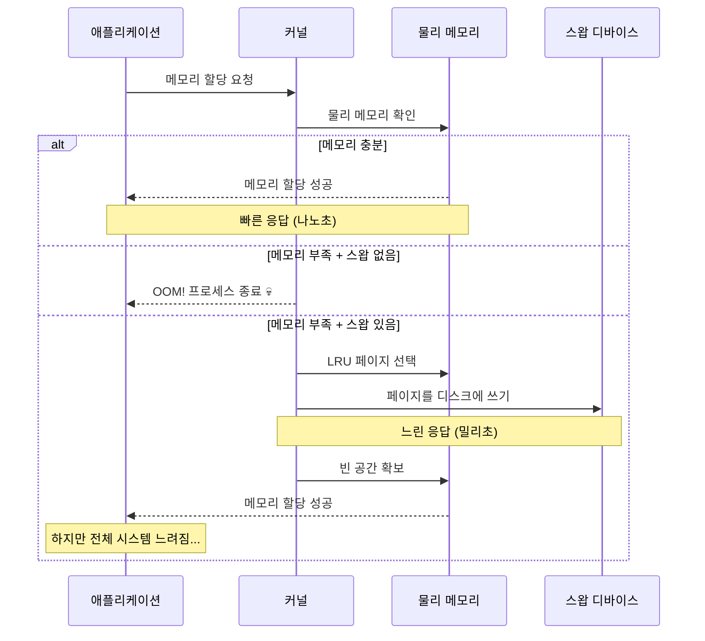
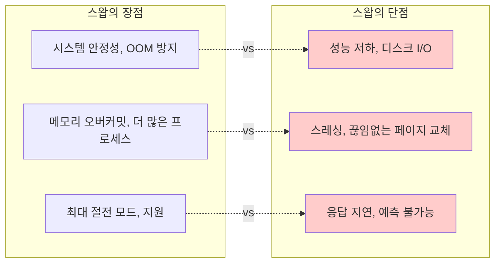
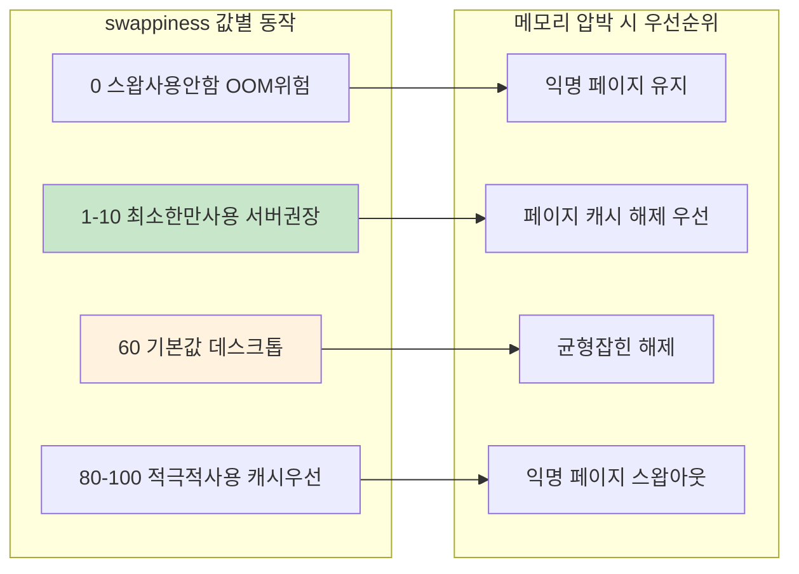
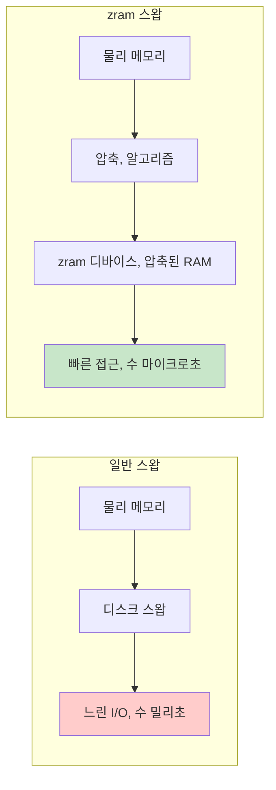
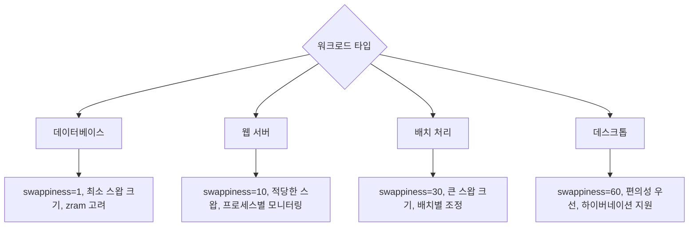

---
tags:
  - Swap
  - VirtualMemory
  - Performance
  - zram
  - swappiness
---

# 3-7: 스왑 관리와 최적화 - "시스템이 swap을 쓰기 시작했어요"

## 이 문서를 읽으면 답할 수 있는 질문들

- 스왑 사용이 성능에 미치는 실제 영향은 무엇인가요?
- swappiness 값을 어떻게 최적화하나요?
- zram과 zswap의 차이점과 활용법은?
- 스왑 사용 패턴을 어떻게 분석하나요?
- 컨테이너 환경에서 스왑 관리 전략은?

## 들어가며: 스왑의 양날의 검

"메모리가 부족해서 스왑을 켰는데, 오히려 더 느려졌어요..."

스왑은 시스템의 **안전망**이지만 동시에 **성능의 적**이기도 합니다. 제대로 이해하지 못하면 오히려 독이 됩니다.



### 스왑의 딜레마



스왑을 현명하게 사용하는 방법을 알아봅시다.

## 1. 스왑 성능 영향 분석

### 1.1 스왑 vs 물리 메모리 성능 차이

```bash
# 현재 스왑 상태 확인
$ cat /proc/swaps
Filename      Type        Size    Used    Priority
/swapfile     file        4194300 0       -2

$ free -h
              total        used        free      shared  buff/cache   available
Mem:           7.8G        2.1G        3.2G        145M        2.5G        5.4G
Swap:          4.0G          0B        4.0G

# 스왑 사용량 실시간 모니터링
$ watch -n 1 'cat /proc/meminfo | grep -E "(MemTotal|MemFree|MemAvailable|SwapTotal|SwapFree)"'
```

### 1.2 스왑 성능 벤치마크

스왑 사용 시 성능 저하를 정량적으로 측정해봅시다:

```c
// swap_performance_test.c - 스왑 사용이 성능에 미치는 실질적 영향을 측정
#include <stdio.h>
#include <stdlib.h>
#include <string.h>
#include <sys/time.h>
#include <unistd.h>
#include <sys/mman.h>

#define GB (1024 * 1024 * 1024)

double get_time() {
    struct timeval tv;
    gettimeofday(&tv, NULL);
    return tv.tv_sec + tv.tv_usec / 1000000.0;
}

// /proc/meminfo에서 시스템 메모리 및 스왑 현황 추출
void get_memory_stats(long *total_mem, long *free_mem, long *swap_used) {
    FILE *meminfo = fopen("/proc/meminfo", "r");
    char line[256];

    *total_mem = *free_mem = *swap_used = 0;

    while (fgets(line, sizeof(line), meminfo)) {
        // 각 라인을 파싱하여 필요한 메모리 정보 추출
        if (sscanf(line, "MemTotal: %ld kB", total_mem) == 1) {
            *total_mem *= 1024;  // kB를 bytes로 변환
        } else if (sscanf(line, "MemAvailable: %ld kB", free_mem) == 1) {
            *free_mem *= 1024;
        } else if (sscanf(line, "SwapTotal: %ld kB", swap_used) == 1) {
            long swap_total = *swap_used * 1024;
            long swap_free;
            // 다음 라인에서 SwapFree 읽기
            if (fgets(line, sizeof(line), meminfo) &&
                sscanf(line, "SwapFree: %ld kB", &swap_free) == 1) {
                *swap_used = swap_total - (swap_free * 1024);  // 사용중인 스왑 계산
            }
            break;
        }
    }

    fclose(meminfo);
}

// 메모리 부족 상황을 인위적으로 유발하여 스왑 사용 측정
void test_memory_allocation(size_t total_size) {
    printf("=== 메모리 할당 성능 테스트 ===, ");
    printf("목표 할당량: %.1f GB (스왑 사용 유발 목적), ", (double)total_size / GB);

    // 초기 시스템 상태 확인
    long total_mem, free_mem, swap_used;
    get_memory_stats(&total_mem, &free_mem, &swap_used);

    printf("시스템 메모리: %.1f GB (사용 가능: %.1f GB), ",
           (double)total_mem / GB, (double)free_mem / GB);
    printf("초기 스왑 사용량: %.1f MB, ", (double)swap_used / 1024 / 1024);

    // 청크 단위로 나누어 점진적 할당 (스왑 발생 지점 관산)
    const size_t chunk_size = 256 * 1024 * 1024;  // 256MB 청크
    const int num_chunks = total_size / chunk_size;
    void **chunks = malloc(sizeof(void*) * num_chunks);

    printf(", 점진적 메모리 할당 시작 (%d개 청크, %dMB씩)..., ",
           num_chunks, (int)(chunk_size / 1024 / 1024));

    double start = get_time();

    for (int i = 0; i < num_chunks; i++) {
        // 메모리 할당 (아직 가상 메모리만 사용)
        chunks[i] = malloc(chunk_size);
        if (!chunks[i]) {
            printf("할당 실패: 청크 %d, ", i);
            break;
        }

        // 실제 물리 메모리 사용 유발 (페이지 폴트 발생)
        // 이 시점에서 OS가 스왑 사용을 결정할 수 있음
        memset(chunks[i], i % 256, chunk_size);

        // 1GB마다 메모리 상태 체크로 스왑 사용 추이 관산
        if (i % 4 == 0) {
            get_memory_stats(&total_mem, &free_mem, &swap_used);
            printf("청크 %2d 완료: 사용 가능 메모리 %.1f GB, 스왑 사용 %.1f MB, ",
                   i + 1, (double)free_mem / GB, (double)swap_used / 1024 / 1024);
        }
    }

    double alloc_time = get_time() - start;
    printf(", 청크 할당 및 초기화 완료 시간: %.3f초, ", alloc_time);

    // 메모리 접근 성능 테스트 (스왑 사용 시 성능 저하 측정)
    printf(", === 스왑 매벴인 접근 성능 테스트 ===, ");
    start = get_time();

    // 여러 번의 라운드로 스왑 in/out 반복 발생 유도
    const int access_rounds = 5;
    for (int round = 0; round < access_rounds; round++) {
        printf("라운드 %d/%d 시작..., ", round + 1, access_rounds);

        for (int i = 0; i < num_chunks; i++) {
            if (chunks[i]) {
                // 청크 내 다양한 위치에 접근하여 스왑 활동 유발
                volatile char *ptr = (volatile char*)chunks[i];
                for (int j = 0; j < chunk_size; j += 4096) {  // 페이지 단위 접근
                    char val = ptr[j];  // 읽기: 스왑인 발생 가능
                    ptr[j] = val + 1;   // 쓰기: dirty page 생성으로 스왑아웃 유발
                }
            }
        }

        // 라운드별 성능 및 스왑 사용 현황 출력
        double round_time = get_time() - start;
        get_memory_stats(&total_mem, &free_mem, &swap_used);
        printf("라운드 %d 완료: %.3f초 경과, 스왑 사용량: %.1f MB, ",
               round + 1, round_time, (double)swap_used / 1024 / 1024);
    }

    double access_time = get_time() - start;
    printf(", 전체 접근 테스트 완료 시간: %.3f초, ", access_time);
    printf("성능 비교: 할당 %.3f초 vs 접근 %.3f초 (%.1fx 느림), ",
           alloc_time, access_time, access_time / alloc_time);

    // 메모리 해제 및 정리
    printf(", 메모리 해제 중..., ");
    for (int i = 0; i < num_chunks; i++) {
        if (chunks[i]) {
            free(chunks[i]);
        }
    }
    free(chunks);

    // 해제 후에도 스왑에 남아있는 데이터 확인
    get_memory_stats(&total_mem, &free_mem, &swap_used);
    printf("메모리 해제 후 스왑 남은 사용량: %.1f MB, ",
           (double)swap_used / 1024 / 1024);
}

// 스왑 in/out 성능의 실질적 영향 측정
void test_swap_in_out_performance() {
    printf(", === 스왑 In/Out 성능 비교 테스트 ===, ");

    // 시스템 메모리보다 큰 크기로 스왑 사용 강제
    size_t size = 1.5 * GB;  // 1.5GB - 대부분의 시스템에서 스왑 사용 유발
    char *memory = malloc(size);
    if (!memory) {
        printf("메모리 할당 실패 - 시스템 메모리 부족, ");
        return;
    }

    printf("%.1f GB 대용량 메모리 할당 완료, ", (double)size / GB);
    printf("스왑아웃 유발을 위한 전체 메모리 초기화 중..., ");

    // 1단계: 모든 메모리 페이지를 터치하여 스왑아웃 유발
    double start = get_time();
    for (size_t i = 0; i < size; i += 4096) {
        memory[i] = i % 256;  // 각 페이지에 데이터 쓰기
    }
    double init_time = get_time() - start;

    printf("메모리 초기화 시간: %.3f초, ", init_time);

    // OS가 스왑아웃을 수행할 시간 제공
    printf("스왑아웃 대기 중 (5초)..., ");
    sleep(5);

    // 대부분의 메모리가 스왑아웃된 상태에서 재접근 시도
    printf("메모리 재접근 시작 - 스왑인 성능 측정, ");
    start = get_time();

    unsigned char checksum = 0;
    int progress_updates = 0;
    const int total_pages = size / 4096;

    // 모든 페이지에 순차적으로 접근하여 스왑인 발생
    for (size_t i = 0; i < size; i += 4096) {
        checksum ^= memory[i];  // 페이지 접근 시 스왑인 발생

        // 진행 상황 표시 (256MB마다)
        if (i % (256 * 1024 * 1024) == 0) {
            double current_time = get_time() - start;
            double progress = (double)(i / 4096) / total_pages * 100;
            printf("\r진행률: %5.1f%%, 소요시간: %6.1f초, 속도: %5.1f MB/s",
                   progress, current_time,
                   (i / 1024.0 / 1024.0) / (current_time > 0 ? current_time : 0.001));
            fflush(stdout);
        }
    }

    double swapin_time = get_time() - start;

    printf(", , === 스왑 성능 분석 결과 ===, ");
    printf("초기화 시간 (RAM): %.3f초, ", init_time);
    printf("스왑인 시간 (Disk): %.3f초, ", swapin_time);
    printf("성능 저하 비율: %.1fx (스왑이 %.1f배 느림), ",
           swapin_time / init_time, swapin_time / init_time);
    printf("체크섬 값: 0x%02x (데이터 무결성 확인용), ", checksum);

    // 스왑 사용량에 따른 성능 영향 분석
    if (swapin_time / init_time > 10) {
        printf(", ⚠️  경고: 스왑 사용으로 인한 심각한 성능 저하 감지!, ");
        printf("   권장사항: 메모리 증설 또는 swappiness 값 조정, ");
    } else if (swapin_time / init_time > 3) {
        printf(", ℹ️  정보: 스왑 사용으로 인한 성능 영향 발생, ");
    }

    free(memory);
}

int main() {
    printf("스왑 성능 영향 종합 분석 프로그램, ");
    printf("=========================================, ");
    printf("이 프로그램은 스왑 사용 시 성능 저하를 정량적으로 측정합니다., ");
    printf("주의: 시스템 메모리보다 큰 메모리를 사용하여 스왑을 유발합니다., , ");

    // 시스템 메모리 정보 확인 및 테스트 크기 결정
    long total_mem, free_mem, swap_used;
    get_memory_stats(&total_mem, &free_mem, &swap_used);

    printf("현재 시스템 상태:, ");
    printf("- 총 메모리: %.1f GB, ", (double)total_mem / GB);
    printf("- 사용 가능: %.1f GB, ", (double)free_mem / GB);
    printf("- 스왑 사용: %.1f MB, , ", (double)swap_used / 1024 / 1024);

    // 테스트 크기를 시스템 메모리보다 크게 설정하여 스왑 사용 유발
    size_t test_size = total_mem + (1 * GB);  // 시스템 메모리 + 1GB

    test_memory_allocation(test_size);  // 단계적 메모리 할당 테스트
    test_swap_in_out_performance();     // 스왑 in/out 성능 직접 측정

    printf(", === 최종 결론 ===, ");
    printf("스왑은 메모리 부족 상황에서 시스템 안정성을 제공하지만,, ");
    printf("디스크 I/O로 인한 심각한 성능 저하를 수반합니다., ");
    printf("적절한 swappiness 설정과 메모리 관리가 중요합니다., ");

    return 0;
}
```

## 2. swappiness 파라미터 최적화

### 2.1 swappiness 이해

`swappiness`는 스왑 사용 적극성을 제어하는 커널 파라미터입니다 (0-100):



### 2.2 워크로드별 swappiness 최적화

```bash
#!/bin/bash
# swappiness_optimizer.sh

echo "=== swappiness 최적화 도구 ==="

# 현재 설정 확인
current_swappiness=$(cat /proc/sys/vm/swappiness)
echo "현재 swappiness: $current_swappiness"

# 워크로드 타입 확인
echo "시스템 워크로드 분석 중..."

# 메모리 사용 패턴 분석
total_mem=$(grep MemTotal /proc/meminfo | awk '{print $2}')
cached=$(grep "^Cached:" /proc/meminfo | awk '{print $2}')
cache_ratio=$((cached * 100 / total_mem))

echo "페이지 캐시 비율: ${cache_ratio}%"

# CPU 사용률 확인
cpu_usage=$(top -bn1 | grep "Cpu(s)" | awk '{print $2}' | cut -d'%' -f1)
echo "평균 CPU 사용률: ${cpu_usage}%"

# 스왑 사용량 확인
swap_total=$(grep SwapTotal /proc/meminfo | awk '{print $2}')
swap_free=$(grep SwapFree /proc/meminfo | awk '{print $2}')
if [ $swap_total -gt 0 ]; then
    swap_used=$((swap_total - swap_free))
    swap_usage=$((swap_used * 100 / swap_total))
    echo "현재 스왑 사용률: ${swap_usage}%"
else
    echo "스왑이 설정되지 않음"
    exit 1
fi

# 권장 swappiness 계산
recommend_swappiness() {
    # 데이터베이스 서버 감지
    if pgrep -x "mysqld\|postgres\|mongod" > /dev/null; then
        echo "1"  # DB 서버는 매우 낮게
        return
    fi

    # 웹 서버 감지
    if pgrep -x "nginx\|apache2\|httpd" > /dev/null; then
        echo "10"  # 웹 서버는 낮게
        return
    fi

    # 캐시 비율이 높으면 swappiness를 낮게
    if [ $cache_ratio -gt 50 ]; then
        echo "5"
        return
    fi

    # 메모리가 충분하면 낮게
    available_mem=$(grep MemAvailable /proc/meminfo | awk '{print $2}')
    available_ratio=$((available_mem * 100 / total_mem))

    if [ $available_ratio -gt 50 ]; then
        echo "1"
    elif [ $available_ratio -gt 20 ]; then
        echo "10"
    else
        echo "30"
    fi
}

recommended=$(recommend_swappiness)
echo "권장 swappiness: $recommended"

# 워크로드 타입 출력
if [ "$recommended" -eq 1 ]; then
    echo "워크로드 타입: 메모리 집약적 (DB/캐시)"
elif [ "$recommended" -le 10 ]; then
    echo "워크로드 타입: 서버 애플리케이션"
else
    echo "워크로드 타입: 일반/데스크톱"
fi

# swappiness 테스트 함수
test_swappiness() {
    local test_value=$1
    local duration=${2:-60}  # 기본 60초

    echo "swappiness=$test_value 테스트 시작 ($duration 초)"

    # 임시로 변경
    echo $test_value > /proc/sys/vm/swappiness

    # 초기 상태 기록
    local start_time=$(date +%s)
    local start_swap=$(grep SwapFree /proc/meminfo | awk '{print $2}')
    local start_cached=$(grep "^Cached:" /proc/meminfo | awk '{print $2}')

    # 테스트 기간 동안 대기
    sleep $duration

    # 최종 상태 기록
    local end_swap=$(grep SwapFree /proc/meminfo | awk '{print $2}')
    local end_cached=$(grep "^Cached:" /proc/meminfo | awk '{print $2}')

    # 변화량 계산
    local swap_change=$((start_swap - end_swap))
    local cache_change=$((end_cached - start_cached))

    echo "  스왑 사용량 변화: ${swap_change}KB"
    echo "  캐시 크기 변화: ${cache_change}KB"

    # 원복
    echo $current_swappiness > /proc/sys/vm/swappiness
}

# 사용자 선택
echo ""
echo "1) 권장값으로 설정"
echo "2) 수동으로 값 입력"
echo "3) 테스트 모드 (여러 값 비교)"
echo "4) 종료"

read -p "선택하세요 (1-4): " choice

case $choice in
    1)
        echo $recommended > /proc/sys/vm/swappiness
        echo "swappiness를 $recommended 로 설정했습니다."
        echo "영구 설정을 위해 /etc/sysctl.conf에 추가하세요:"
        echo "vm.swappiness = $recommended"
        ;;
    2)
        read -p "swappiness 값 (0-100): " user_value
        if [ $user_value -ge 0 ] && [ $user_value -le 100 ]; then
            echo $user_value > /proc/sys/vm/swappiness
            echo "swappiness를 $user_value 로 설정했습니다."
        else
            echo "잘못된 값입니다 (0-100 범위)"
        fi
        ;;
    3)
        echo "테스트 모드: 각각 30초간 테스트"
        test_swappiness 1 30
        test_swappiness 10 30
        test_swappiness 60 30
        ;;
    4)
        echo "종료합니다."
        ;;
    *)
        echo "잘못된 선택입니다."
        ;;
esac
```

### 2.3 동적 swappiness 조정

시스템 상태에 따라 동적으로 swappiness를 조정하는 스크립트:

```python
#!/usr/bin/env python3
# dynamic_swappiness.py
import time
import os
import psutil

class DynamicSwappiness:
    def __init__(self):
        self.current_swappiness = self.get_current_swappiness()
        self.base_swappiness = 10  # 기본값
        self.min_swappiness = 1
        self.max_swappiness = 60

    def get_current_swappiness(self):
        with open('/proc/sys/vm/swappiness', 'r') as f:
            return int(f.read().strip())

    def set_swappiness(self, value):
        with open('/proc/sys/vm/swappiness', 'w') as f:
            f.write(str(value))
        self.current_swappiness = value

    def get_system_stats(self):
        mem = psutil.virtual_memory()
        swap = psutil.swap_memory()

        # 메모리 압박 수준 계산
        memory_pressure = (100 - mem.available / mem.total * 100) / 100

        # 스왑 사용률
        swap_usage = swap.percent / 100 if swap.total > 0 else 0

        # 캐시 비율
        with open('/proc/meminfo') as f:
            meminfo = f.read()

        cached_kb = 0
        for line in meminfo.split(', '):
            if line.startswith('Cached:'):
                cached_kb = int(line.split()[1])
                break

        cache_ratio = cached_kb * 1024 / mem.total

        return {
            'memory_pressure': memory_pressure,
            'swap_usage': swap_usage,
            'cache_ratio': cache_ratio,
            'available_ratio': mem.available / mem.total
        }

    def calculate_optimal_swappiness(self, stats):
        """시스템 상태에 기반한 최적 swappiness 계산"""

        # 기본값에서 시작
        optimal = self.base_swappiness

        # 메모리 압박이 높으면 swappiness 증가
        if stats['memory_pressure'] > 0.8:
            optimal += 20  # 압박 상황에서는 적극적 스왑
        elif stats['memory_pressure'] > 0.6:
            optimal += 10
        elif stats['memory_pressure'] < 0.3:
            optimal -= 5   # 여유로우면 스왑 최소화

        # 스왑이 이미 많이 사용 중이면 줄이기
        if stats['swap_usage'] > 0.5:
            optimal -= 15
        elif stats['swap_usage'] > 0.2:
            optimal -= 5

        # 캐시 비율이 높으면 swappiness 낮추기
        if stats['cache_ratio'] > 0.6:
            optimal -= 10
        elif stats['cache_ratio'] > 0.4:
            optimal -= 5

        # 범위 제한
        optimal = max(self.min_swappiness, min(self.max_swappiness, optimal))

        return optimal

    def monitor_and_adjust(self, interval=30, duration=3600):
        """지정된 기간 동안 swappiness 모니터링 및 조정"""
        print(f"Dynamic swappiness 모니터링 시작 ({duration}초)")
        print(f"조정 간격: {interval}초")

        start_time = time.time()

        while time.time() - start_time < duration:
            stats = self.get_system_stats()
            optimal = self.calculate_optimal_swappiness(stats)

            # 현재 값과 차이가 5 이상이면 조정
            if abs(optimal - self.current_swappiness) >= 5:
                print(f"[{time.strftime('%H:%M:%S')}] swappiness 조정: "
                      f"{self.current_swappiness} -> {optimal}")
                print(f"  메모리 압박: {stats['memory_pressure']:.2f}")
                print(f"  스왑 사용률: {stats['swap_usage']:.2f}")
                print(f"  캐시 비율: {stats['cache_ratio']:.2f}")

                self.set_swappiness(optimal)
            else:
                print(f"[{time.strftime('%H:%M:%S')}] swappiness 유지: "
                      f"{self.current_swappiness} (최적값: {optimal})")

            time.sleep(interval)

        print("모니터링 완료")

if __name__ == "__main__":
    import sys

    if os.geteuid() != 0:
        print("root 권한이 필요합니다.")
        sys.exit(1)

    monitor = DynamicSwappiness()

    try:
        monitor.monitor_and_adjust(interval=30, duration=1800)  # 30분간
    except KeyboardInterrupt:
        print(", 모니터링 중단됨")
    except Exception as e:
        print(f"오류 발생: {e}")
```

## 3. zram과 zswap 활용

### 3.1 zram (압축된 RAM 스왑)

zram은 RAM의 일부를 압축하여 가상의 스왑 디바이스로 사용합니다:



**zram 설정 및 사용**:

```bash
#!/bin/bash
# setup_zram.sh

echo "=== zram 설정 도구 ==="

# zram 모듈 로드
modprobe zram

# 사용할 zram 디바이스 수 (CPU 코어 수와 동일하게)
num_devices=$(nproc)
echo "zram 디바이스 수: $num_devices"

# 기존 zram 디바이스 제거
for device in /dev/zram*; do
    if [ -b "$device" ]; then
        swapoff "$device" 2>/dev/null
        echo 0 > /sys/block/${device##*/}/disksize 2>/dev/null
    fi
done

# 새 zram 디바이스 생성
echo $num_devices > /sys/module/zram/parameters/num_devices

# 각 디바이스 설정
total_mem=$(grep MemTotal /proc/meminfo | awk '{print $2}')  # KB
zram_size=$((total_mem / num_devices / 4))  # 전체 메모리의 1/4을 zram으로

echo "각 zram 디바이스 크기: $((zram_size / 1024))MB"

for i in $(seq 0 $((num_devices - 1))); do
    device="/dev/zram$i"

    # 압축 알고리즘 설정 (lz4가 빠름)
    echo lz4 > /sys/block/zram$i/comp_algorithm

    # 크기 설정
    echo ${zram_size}K > /sys/block/zram$i/disksize

    # 스왑 디바이스로 설정
    mkswap $device
    swapon $device -p 10  # 높은 우선순위

    echo "zram$i 활성화 완료"
done

echo "zram 설정 완료!"
swapon -s
```

### 3.2 zram vs 일반 스왑 성능 비교

```c
// zram_benchmark.c - zram과 일반 스왑 성능 비교 벤치마크
// zram은 RAM 기반 압축 스왑으로, 일반 디스크 스왑보다 빠른 성능을 제공
#include <stdio.h>
#include <stdlib.h>
#include <string.h>
#include <sys/time.h>
#include <unistd.h>

// 고정밀 시간 측정 함수
double get_time() {
    struct timeval tv;
    gettimeofday(&tv, NULL);
    return tv.tv_sec + tv.tv_usec / 1000000.0;
}

// 스왑 성능 측정 함수 - 메모리 할당 및 접근 패턴으로 스왑 성능 분석
void test_swap_performance(const char *test_name, int force_swap_usage) {
    printf("=== %s ===, ", test_name);

    // 시스템 메모리보다 큰 크기로 스왑 사용 유발
    size_t mem_size = 2UL * 1024 * 1024 * 1024;  // 2GB - 대부분 시스템에서 스왑 유발
    printf("%.1f GB 메모리 할당 중 (스왑 사용 유발 목적)..., ",
           (double)mem_size / 1024 / 1024 / 1024);

    char *memory = malloc(mem_size);
    if (!memory) {
        printf("메모리 할당 실패 - 가용 메모리 부족, ");
        return;
    }

    double start = get_time();

    // 1단계: 메모리 초기화 (페이지 폴트 발생으로 실제 물리 메모리 할당)
    // 시스템 메모리 부족 시 OS가 스왑아웃을 시작하게 됨
    printf("메모리 페이지 초기화 중 (스왑아웃 유발)..., ");
    for (size_t i = 0; i < mem_size; i += 4096) {  // 4KB 페이지 단위로 접근
        memory[i] = i % 256;  // 각 페이지에 고유값 쓰기
    }

    double init_time = get_time() - start;
    printf("메모리 초기화 완료: %.3f초, ", init_time);

    // 2단계: 스왑 사용 강제 유발 (필요 시)
    if (force_swap_usage) {
        printf("추가 메모리 할당으로 스왑 사용 강제 유발 중..., ");

        // 더 많은 메모리 할당으로 기존 메모리의 스왑아웃 강제
        size_t extra_size = 1UL * 1024 * 1024 * 1024;  // 추가 1GB
        char *extra_memory = malloc(extra_size);

        if (extra_memory) {
            // 추가 메모리 전체에 데이터 쓰기 (스왑 압박 증가)
            memset(extra_memory, 0xAA, extra_size);
            printf("스왑아웃 진행 대기 중 (2초)..., ");
            sleep(2);  // OS가 스왑아웃을 수행할 시간 제공
            free(extra_memory);
        }
    }

    // 3단계: 메모리 재접근으로 스왑인 성능 측정
    // 스왑아웃된 페이지들을 다시 접근하여 스왑인 발생 유도
    printf("스왑인된 메모리 재접근 시작 (스왑인 성능 측정)..., ");
    start = get_time();

    unsigned char checksum = 0;
    size_t access_count = 0;
    size_t page_faults = 0;  // 페이지 폴트 발생 추정치

    // 모든 페이지에 순차 접근하여 스왑인 발생
    for (size_t i = 0; i < mem_size; i += 4096) {
        // 페이지 첫 바이트 읽기 - 스왑인된 페이지라면 디스크에서 로드
        volatile char value = memory[i];
        checksum ^= value;
        access_count++;

        // 접근 시간이 오래 걸리면 페이지 폴트(스왑인) 발생으로 추정
        // 실제 환경에서는 더 정밀한 측정 방법 필요

        // 256MB마다 진행 상황 출력
        if (access_count % (64 * 1024) == 0) {
            double current_time = get_time() - start;
            double progress = (double)i / mem_size * 100;
            double speed = (i / 1024.0 / 1024.0) / (current_time > 0 ? current_time : 0.001);

            printf("\r진행률: %5.1f%%, 소요시간: %6.2f초, 속도: %6.1f MB/s",
                   progress, current_time, speed);
            fflush(stdout);
        }
    }

    double access_time = get_time() - start;

    printf(", , === 성능 측정 결과 ===, ");
    printf("메모리 초기화 시간: %.3f초, ", init_time);
    printf("메모리 재접근 시간: %.3f초, ", access_time);
    printf("전체 처리 속도: %.1f MB/s, ",
           (mem_size / 1024.0 / 1024.0) / access_time);
    printf("성능 비교: 재접근이 초기화보다 %.1fx %s, ",
           access_time / init_time,
           access_time > init_time ? "느림 (스왑인 영향)" : "빠름");
    printf("데이터 무결성 체크섬: 0x%02x, ", checksum);

    free(memory);

    // 테스트 후 스왑 상태 확인
    printf(", === 테스트 후 스왑 상태 ===, ");
    system("grep -E 'SwapTotal|SwapFree' /proc/meminfo");
    printf(", ");
}

// zram 디바이스별 상세 통계 정보 출력
void show_zram_stats() {
    printf("=== zram 압축 및 사용량 통계 ===, ");

    int active_devices = 0;

    // 최대 8개 zram 디바이스 순회 검사
    for (int i = 0; i < 8; i++) {
        char path[256];

        // 1단계: zram 디바이스 크기 확인
        snprintf(path, sizeof(path), "/sys/block/zram%d/disksize", i);
        FILE *f = fopen(path, "r");
        if (!f) continue;  // 디바이스가 존재하지 않음

        long disksize;
        if (fscanf(f, "%ld", &disksize) != 1) {
            fclose(f);
            continue;
        }
        fclose(f);

        if (disksize == 0) continue;  // 비활성화된 디바이스

        active_devices++;
        printf(", zram%d: (할당된 크기: %.1f MB), ",
               i, disksize / 1024.0 / 1024.0);

        // 2단계: 압축 알고리즘 확인
        snprintf(path, sizeof(path), "/sys/block/zram%d/comp_algorithm", i);
        f = fopen(path, "r");
        if (f) {
            char algorithms[256];
            if (fgets(algorithms, sizeof(algorithms), f)) {
                // 현재 사용중인 알고리즘은 대괄호로 표시됨
                printf("  압축 알고리즘: %s", algorithms);
            }
            fclose(f);
        }

        // 3단계: 메모리 사용량 및 압축 통계 (mm_stat)
        snprintf(path, sizeof(path), "/sys/block/zram%d/mm_stat", i);
        f = fopen(path, "r");
        if (f) {
            // mm_stat 형식: orig_data_size compr_data_size mem_used_total ...
            long orig_data_size, compr_data_size, mem_used_total;
            if (fscanf(f, "%ld %ld %ld", &orig_data_size, &compr_data_size, &mem_used_total) == 3) {

                if (orig_data_size > 0) {
                    double compression_ratio = (double)orig_data_size / compr_data_size;
                    double space_saved = orig_data_size - mem_used_total;
                    double efficiency = (space_saved / (double)orig_data_size) * 100;

                    printf("  원본 데이터 크기: %8.1f MB, ", orig_data_size / 1024.0 / 1024.0);
                    printf("  압축 데이터 크기: %8.1f MB, ", compr_data_size / 1024.0 / 1024.0);
                    printf("  실제 메모리 사용: %8.1f MB, ", mem_used_total / 1024.0 / 1024.0);
                    printf("  압축비: %.2f:1 (%.1f%% 절약), ", compression_ratio, efficiency);
                    printf("  실제 절약 공간: %8.1f MB, ", space_saved / 1024.0 / 1024.0);
                } else {
                    printf("  상태: 사용되지 않음, ");
                }
            }
            fclose(f);
        }

        // 4단계: I/O 통계 확인
        snprintf(path, sizeof(path), "/sys/block/zram%d/io_stat", i);
        f = fopen(path, "r");
        if (f) {
            long read_ios, read_merges, write_ios, write_merges;
            if (fscanf(f, "%ld %ld %*ld %*ld %ld %ld",
                      &read_ios, &read_merges, &write_ios, &write_merges) >= 4) {
                printf("  I/O 통계: 읽기 %ld회, 쓰기 %ld회, ", read_ios, write_ios);
            }
            fclose(f);
        }
    }

    if (active_devices == 0) {
        printf("활성화된 zram 디바이스가 없습니다., ");
        printf("zram 설정을 위해 다음 명령을 실행하세요:, ");
        printf("  modprobe zram, ");
        printf("  echo lz4 > /sys/block/zram0/comp_algorithm, ");
        printf("  echo 1G > /sys/block/zram0/disksize, ");
        printf("  mkswap /dev/zram0 && swapon /dev/zram0, ");
    } else {
        printf(", 총 %d개의 zram 디바이스가 활성화되어 있습니다., ", active_devices);
    }
}

int main() {
    printf("zram vs 일반 스왑 성능 비교 벤치마크, ");
    printf("========================================, ");
    printf("이 프로그램은 zram과 일반 디스크 스왑의 성능 차이를 측정합니다., ");
    printf("주의: 대용량 메모리 할당으로 시스템 메모리 부족을 유발합니다., , ");

    // 1단계: 현재 스왑 설정 및 상태 확인
    printf("=== 현재 시스템 스왑 설정 ===, ");
    system("swapon -s");  // 활성화된 모든 스왑 디바이스 표시
    printf(", ");

    // 2단계: zram 상세 통계 표시
    show_zram_stats();

    // 3단계: 실제 성능 테스트 수행
    printf(", === 성능 벤치마크 시작 ===, ");
    printf("테스트는 약 1-3분 소요됩니다..., , ");

    // zram이 있는 환경에서의 스왑 성능 측정
    test_swap_performance("zram 기반 스왑 성능 테스트", 1);

    // 최종 결과 요약
    printf("=== 벤치마크 완료 ===, ");
    printf("zram 사용 시 성능 이점:, ");
    printf("- 디스크 스왑 대비 10-100배 빠른 액세스, ");
    printf("- CPU 압축 오버헤드는 있으나 I/O 대기시간 크게 단축, ");
    printf("- 메모리 절약을 통한 실제 스왑 사용량 감소, , ");

    return 0;
}
```

### 3.3 zswap 설정 (하이브리드 접근)

zswap은 페이지 캐시와 스왑 디바이스 사이의 중간층 역할을 합니다:

```bash
#!/bin/bash
# setup_zswap.sh - zswap 하이브리드 압축 스왑 설정 스크립트
# zswap은 RAM에 압축된 캐시를 두고, 필요 시에만 디스크 스왑으로 보내는 방식

echo "=== zswap 하이브리드 스왑 설정 도구 ==="
echo "zswap: 메모리 압축 + 디스크 스왑의 2단계 구조로 성능 최적화"
echo

# 1단계: 현재 zswap 상태 확인
echo "[1단계] 현재 zswap 상태 확인"
if [ -d "/sys/module/zswap" ]; then
    current_enabled=$(cat /sys/module/zswap/parameters/enabled 2>/dev/null || echo "N/A")
    echo "  현재 zswap 상태: $current_enabled (Y=활성화, N=비활성화)"
else
    echo "  zswap 모듈이 로드되지 않음 - 커널에서 지원하지 않을 수 있습니다"
    exit 1
fi

# 2단계: zswap 활성화
echo ", [2단계] zswap 모듈 활성화"
echo Y > /sys/module/zswap/parameters/enabled
if [ $? -eq 0 ]; then
    echo "  ✓ zswap 활성화 완료"
else
    echo "  ✗ zswap 활성화 실패 - root 권한 필요"
    exit 1
fi

# 3단계: 압축 알고리즘 최적화
echo ", [3단계] 압축 알고리즘 설정"
echo "  사용 가능한 압축 알고리즘:"
cat /sys/module/zswap/parameters/compressor

# lz4: 빠른 압축/해제 속도, 적당한 압축률 (권장)
# lzo: 매우 빠르지만 압축률 낮음
# deflate: 높은 압축률이지만 느림
echo lz4 > /sys/module/zswap/parameters/compressor
echo "  ✓ 압축 알고리즘: lz4 (속도와 압축률의 균형)"

# 4단계: 메모리 풀 타입 설정
echo ", [4단계] 메모리 풀 타입 설정"
echo "  사용 가능한 메모리 풀:"
cat /sys/module/zswap/parameters/zpool

# z3fold: 3개 압축 페이지를 하나의 물리 페이지에 저장 (높은 효율)
# zbud: 2개 압축 페이지를 하나의 물리 페이지에 저장 (안정성)
echo z3fold > /sys/module/zswap/parameters/zpool
echo "  ✓ 메모리 풀: z3fold (3:1 페이지 패킹으로 높은 메모리 효율)"

# 5단계: 최대 풀 크기 설정
echo ", [5단계] zswap 최대 메모리 사용량 설정"
total_mem_kb=$(grep MemTotal /proc/meminfo | awk '{print $2}')
total_mem_mb=$((total_mem_kb / 1024))
recommended_percent=20

echo "  시스템 총 메모리: ${total_mem_mb} MB"
echo "  권장 zswap 비율: ${recommended_percent}% (${total_mem_mb} MB의 ${recommended_percent}% = $((total_mem_mb * recommended_percent / 100)) MB)"

# RAM의 20%를 zswap 압축 캐시로 사용 (일반적 권장값)
# 너무 크면 압축 오버헤드 증가, 너무 작으면 효과 제한적
echo $recommended_percent > /sys/module/zswap/parameters/max_pool_percent
echo "  ✓ 최대 풀 크기: ${recommended_percent}% (약 $((total_mem_mb * recommended_percent / 100)) MB)"

# 6단계: 설정 검증 및 결과 출력
echo ", [6단계] zswap 설정 검증"
echo "현재 zswap 설정:"
echo "  활성화 상태:   $(cat /sys/module/zswap/parameters/enabled)"
echo "  압축 알고리즘: $(cat /sys/module/zswap/parameters/compressor)"
echo "  메모리 풀:     $(cat /sys/module/zswap/parameters/zpool)"
echo "  최대 풀 크기:  $(cat /sys/module/zswap/parameters/max_pool_percent)%"

# 7단계: 동작 원리 및 장점 설명
echo ", === zswap 동작 원리 ==="
echo "1단계: 메모리 부족 시 페이지를 zswap 압축 캐시로 이동"
echo "2단계: zswap 캐시 가득 시 LRU 방식으로 디스크 스왑에 저장"
echo "3단계: 페이지 접근 시 zswap에서 빠른 압축 해제 또는 디스크에서 로드"
echo
echo "=== 성능 이점 ==="
echo "• 디스크 스왑 대비 10-50배 빠른 압축 캐시 액세스"
echo "• 2-4배 메모리 압축으로 실제 스왑 사용량 감소"
echo "• 점진적 스왑아웃으로 급작스런 성능 저하 방지"
echo
echo "✓ zswap 설정이 완료되었습니다!"
echo "✓ 재부팅 후에도 유지하려면 /etc/sysctl.conf에 다음을 추가하세요:"
echo "   vm.zswap.enabled=1"
echo "   vm.zswap.compressor=lz4"
echo "   vm.zswap.zpool=z3fold"
echo "   vm.zswap.max_pool_percent=20"
```

## 4. 스왑 사용 패턴 분석

### 4.1 실시간 스왑 모니터링

```python
#!/usr/bin/env python3
# swap_monitor.py - 스왑 사용량 실시간 모니터링 및 분석 도구
# 시스템 스왑 사용 패턴을 실시간으로 추적하고 성능 영향을 분석
import time
import psutil
from collections import deque

class SwapMonitor:
    """스왑 사용량 실시간 모니터링 클래스

    이 클래스는 시스템의 스왑 사용량을 지속적으로 모니터링하고,
    프로세스별 스왑 사용량, I/O 패턴, 사용 추세를 분석합니다.
    """

    def __init__(self, history_minutes=5):
        """모니터링 클래스 초기화

        Args:
            history_minutes (int): 히스토리 데이터를 저장할 분 수 (기본: 5분)
        """
        # 지정된 분수만큼 데이터 포인트 저장 (30초 간격 기준)
        max_history = history_minutes * 2  # 30초 간격으로 5분 = 10개
        self.history = deque(maxlen=max_history)
        self.start_time = time.time()

    def get_swap_stats(self):
        """시스템 스왑 사용량 및 프로세스별 정보 수집

        Returns:
            dict: 스왑 통계 정보
                - percent: 스왑 사용률 (0-100%)
                - used_mb: 사용중인 스왑 크기 (MB)
                - total_mb: 전체 스왑 크기 (MB)
                - top_processes: 상위 스왑 사용 프로세스 목록
                - io: 스왑 I/O 통계 (페이지 in/out)
        """
        # 1. 전체 시스템 스왑 정보 수집
        swap = psutil.swap_memory()

        # 2. 프로세스별 스왑 사용량 분석 (VmSwap 값 확인)
        # /proc/PID/status 파일에서 VmSwap 라인을 파싱하여 각 프로세스의 스왑 사용량 추출
        top_processes = []
        for proc in psutil.process_iter(['pid', 'name']):
            try:
                pid = proc.info['pid']
                # /proc/<pid>/status 파일에서 VmSwap 정보 읽기
                with open(f'/proc/{pid}/status') as f:
                    for line in f:
                        if line.startswith('VmSwap:'):
                            # 형식: "VmSwap:    1024 kB"
                            swap_kb = int(line.split()[1])
                            if swap_kb > 1024:  # 1MB 이상 사용하는 프로세스만 추적
                                top_processes.append((
                                    pid,
                                    proc.info['name'],
                                    swap_kb
                                ))
                            break
            except (FileNotFoundError, ProcessLookupError, PermissionError, ValueError):
                # 프로세스가 종료되었거나 접근 권한이 없는 경우 무시
                continue

        # 3. 시스템 전체 스왑 I/O 활동 수집 (/proc/vmstat에서)
        # pswpin: 스왑에서 메모리로 읽어온 페이지 수 (swap-in)
        # pswpout: 메모리에서 스왑으로 쓴 페이지 수 (swap-out)
        swap_io = {'in': 0, 'out': 0}
        try:
            with open('/proc/vmstat') as f:
                for line in f:
                    if line.startswith('pswpin '):
                        swap_io['in'] = int(line.split()[1])
                    elif line.startswith('pswpout '):
                        swap_io['out'] = int(line.split()[1])
                        # 두 값을 모두 찾았으면 루프 종료 (효율성)
                        if swap_io['in'] > 0:
                            break
        except (FileNotFoundError, PermissionError):
            # /proc/vmstat 접근 실패 시 기본값 유지
            pass

        return {
            'percent': swap.percent,
            'used_mb': swap.used // 1024 // 1024,
            'total_mb': swap.total // 1024 // 1024,
            'free_mb': (swap.total - swap.used) // 1024 // 1024,
            # 상위 3개 프로세스만 반환 (사용량 기준 내림차순 정렬)
            'top_processes': sorted(top_processes, key=lambda x: x[2], reverse=True)[:3],
            'io': swap_io,
            'timestamp': time.time()
        }

    def analyze_trend(self):
        """스왑 사용량 추세 분석

        최근 5개 데이터 포인트를 분석하여 사용량 증가/감소/안정 추세를 판단

        Returns:
            str: 추세 분석 결과
                - "increasing": 10% 이상 증가 (경고 필요)
                - "decreasing": 10% 이상 감소 (개선됨)
                - "stable": 안정적 상태
                - "insufficient_data": 데이터 부족
        """
        if len(self.history) < 5:
            return "insufficient_data"

        # 최근 5개 데이터 포인트에서 사용률 추출
        recent = [entry['percent'] for entry in list(self.history)[-5:]]
        trend_change = recent[-1] - recent[0]  # 첫 번째와 마지막 값 비교

        # 변화량에 따른 추세 판단 (임계값: 10%)
        if trend_change > 10:
            return "increasing"
        elif trend_change < -10:
            return "decreasing"
        else:
            return "stable"

    def get_performance_impact(self, current_stats, prev_io):
        """스왑 I/O 기반 성능 영향도 평가

        Args:
            current_stats (dict): 현재 스왑 통계
            prev_io (dict): 이전 I/O 통계

        Returns:
            dict: 성능 영향 분석 결과
        """
        if not prev_io:
            return {'impact_level': 'unknown', 'io_rate': {'in': 0, 'out': 0}}

        # I/O 비율 계산 (초당 페이지 수)
        io_rate = {
            'in': max(0, current_stats['io']['in'] - prev_io['in']),
            'out': max(0, current_stats['io']['out'] - prev_io['out'])
        }

        total_io = io_rate['in'] + io_rate['out']

        # I/O 활동량에 따른 성능 영향도 분류
        if total_io > 1000:  # 초당 1000페이지(~4MB) 이상
            impact_level = 'severe'  # 심각한 성능 영향
        elif total_io > 100:  # 초당 100페이지(~400KB) 이상
            impact_level = 'moderate'  # 중간 정도 영향
        elif total_io > 10:  # 초당 10페이지(~40KB) 이상
            impact_level = 'low'  # 낮은 영향
        else:
            impact_level = 'minimal'  # 최소 영향

        return {
            'impact_level': impact_level,
            'io_rate': io_rate,
            'total_io_pages': total_io,
            'estimated_mb_per_sec': total_io * 4 / 1024  # 4KB 페이지 가정
        }

    def monitor(self, duration=300, interval=3):
        """지정된 기간 동안 스왑 모니터링 수행

        Args:
            duration (int): 모니터링 지속 시간 (초, 기본: 5분)
            interval (int): 모니터링 간격 (초, 기본: 3초)
        """
        print(f"=== 스왑 사용량 실시간 모니터링 시작 ===")
        print(f"모니터링 기간: {duration}초 ({duration//60}분 {duration%60}초)")
        print(f"수집 간격: {interval}초")
        print(f"예상 데이터 포인트: {duration//interval}개, ")

        start_time = time.time()
        prev_io = None
        sample_count = 0

        try:
            while time.time() - start_time < duration:
                # 현재 스왑 통계 수집
                stats = self.get_swap_stats()
                sample_count += 1

                # 성능 영향도 분석
                performance = self.get_performance_impact(stats, prev_io)

                # 히스토리에 데이터 추가
                self.history.append({
                    'time': time.time(),
                    'percent': stats['percent'],
                    'used_mb': stats['used_mb'],
                    'io_activity': performance['total_io_pages']
                })

                # 실시간 상태 출력
                elapsed = time.time() - start_time
                print(f"[{time.strftime('%H:%M:%S')}] ({sample_count:3d}) "
                      f"스왑: {stats['percent']:5.1f}% "
                      f"({stats['used_mb']:4d}/{stats['total_mb']:4d}MB) "
                      f"여유: {stats['free_mb']:4d}MB")

                # I/O 활동이 있는 경우 상세 정보 출력
                if performance['io_rate']['in'] > 0 or performance['io_rate']['out'] > 0:
                    print(f"    I/O: {performance['io_rate']['in']:4d} in/s, "
                          f"{performance['io_rate']['out']:4d} out/s "
                          f"({performance['estimated_mb_per_sec']:.1f} MB/s) "
                          f"[{performance['impact_level'].upper()}]")

                # 추세 분석 및 경고
                trend = self.analyze_trend()
                if trend == "increasing":
                    print("    ⚠️  경고: 스왑 사용량이 지속적으로 증가하고 있습니다!")
                elif trend == "decreasing":
                    print("    ✅ 정보: 스왑 사용량이 감소하고 있습니다.")

                # 상위 스왑 사용 프로세스 정보 (사용량이 많은 경우만)
                if stats['top_processes'] and stats['percent'] > 5:
                    print("    상위 스왑 사용 프로세스:")
                    for pid, name, swap_kb in stats['top_processes']:
                        swap_mb = swap_kb // 1024
                        print(f"      {name:20s} (PID {pid:5d}): {swap_mb:4d} MB")

                prev_io = stats['io']
                time.sleep(interval)

        except KeyboardInterrupt:
            print(", 사용자에 의해 모니터링이 중단되었습니다.")

        # 최종 분석 리포트 출력
        self.print_comprehensive_summary()

    def print_comprehensive_summary(self):
        """포괄적인 모니터링 결과 요약 리포트 생성"""
        if not self.history:
            print("분석할 데이터가 없습니다.")
            return

        usage_data = [entry['percent'] for entry in self.history]
        io_data = [entry['io_activity'] for entry in self.history]

        # 기본 통계 계산
        avg_usage = sum(usage_data) / len(usage_data)
        max_usage = max(usage_data)
        min_usage = min(usage_data)
        volatility = max_usage - min_usage

        total_runtime = time.time() - self.start_time

        print(f", {'='*60}")
        print(f"스왑 모니터링 최종 분석 리포트")
        print(f"{'='*60}")

        print(f", 📊 모니터링 개요:")
        print(f"  • 총 수집 시간:     {total_runtime/60:.1f}분")
        print(f"  • 데이터 포인트:    {len(self.history)}개")
        print(f"  • 평균 수집 간격:   {total_runtime/len(self.history):.1f}초")

        print(f", 📈 스왑 사용량 통계:")
        print(f"  • 평균 사용률:      {avg_usage:5.1f}%")
        print(f"  • 최대 사용률:      {max_usage:5.1f}%")
        print(f"  • 최소 사용률:      {min_usage:5.1f}%")
        print(f"  • 변동성 (범위):    {volatility:5.1f}%")

        print(f", ⚡ I/O 활동 분석:")
        total_io_activity = sum(io_data)
        avg_io_activity = total_io_activity / len(io_data) if io_data else 0
        max_io_activity = max(io_data) if io_data else 0

        print(f"  • 평균 I/O 활동:    {avg_io_activity:5.0f} 페이지/초")
        print(f"  • 최대 I/O 활동:    {max_io_activity:5.0f} 페이지/초")
        print(f"  • 총 I/O 활동:      {total_io_activity:8.0f} 페이지")

        # 성능 영향 평가 및 권장사항
        print(f", 💡 성능 영향 평가:")
        if max_usage > 80:
            print(f"  🔴 심각: 스왑 사용률이 80%를 초과했습니다!")
            print(f"     권장사항: 즉시 메모리 증설 또는 프로세스 최적화 필요")
        elif max_usage > 50:
            print(f"  🟡 경고: 스왑 사용률이 50%를 초과했습니다.")
            print(f"     권장사항: 메모리 사용량 모니터링 강화 및 증설 검토")
        elif max_usage > 20:
            print(f"  🟠 주의: 스왑 사용률이 20%를 초과했습니다.")
            print(f"     권장사항: 주기적인 모니터링과 swappiness 조정 고려")
        else:
            print(f"  🟢 양호: 스왑 사용률이 안정적입니다.")
            print(f"     현재 상태를 유지하세요.")

        # 추가 최적화 제안
        if avg_io_activity > 100:
            print(f", 🔧 최적화 제안:")
            print(f"  • 높은 I/O 활동이 감지되었습니다 ({avg_io_activity:.0f} 페이지/초)")
            print(f"  • zram 또는 zswap 사용을 고려해보세요")
            print(f"  • swappiness 값을 낮춰보세요 (현재 확인: cat /proc/sys/vm/swappiness)")
            print(f"  • 메모리 집약적 프로세스 최적화를 검토하세요")

if __name__ == "__main__":
    # 스왑이 설정되어 있는지 확인
    if not psutil.swap_memory().total:
        print("❌ 오류: 시스템에 스왑이 설정되지 않았습니다.")
        print("스왑을 설정한 후 다시 실행해주세요.")
        exit(1)

    # 모니터링 클래스 인스턴스 생성
    monitor = SwapMonitor(history_minutes=5)

    print("🔍 스왑 모니터링 도구 v2.0")
    print(f"현재 시스템 스왑 정보:")
    initial_stats = monitor.get_swap_stats()
    print(f"  총 스왑 크기: {initial_stats['total_mb']:,} MB")
    print(f"  현재 사용량: {initial_stats['used_mb']:,} MB ({initial_stats['percent']:.1f}%)")
    print()

    try:
        # 5분간 3초 간격으로 모니터링 (사용자 설정 가능)
        monitor.monitor(duration=300, interval=3)
    except KeyboardInterrupt:
        print(", 🛑 사용자에 의해 모니터링이 중단되었습니다.")
        monitor.print_comprehensive_summary()
```

## 5. 컨테이너 환경 스왑 관리

### 5.1 Docker 스왑 제한 설정

```bash
# Docker 컨테이너 스왑 제한
docker run -m 512m --memory-swap 1g myapp  # 메모리 512MB, 스왑 512MB

# 스왑 비활성화
docker run -m 512m --memory-swap 512m myapp  # 스왑 = 메모리 (실질적 비활성화)

# 무제한 스왑 (권장하지 않음)
docker run -m 512m --memory-swap -1 myapp
```

### 5.2 Kubernetes 스왑 관리

```yaml
# swap-aware-pod.yaml
apiVersion: v1
kind: Pod
metadata:
  name: swap-aware-app
  annotations:
    pod.kubernetes.io/swap-usage: "limited"  # 제한된 스왑 사용
spec:
  containers:
  - name: app
    image: myapp:latest
    resources:
      requests:
        memory: 256Mi
      limits:
        memory: 512Mi
  nodeSelector:
    swap.enabled: "true"
```

## 6. 정리와 실무 가이드

스왑은 잘 사용하면 시스템 안정성을 크게 높일 수 있지만, 잘못 사용하면 성능 저하의 주범이 됩니다.

### 6.1 스왑 관리 Best Practices

**설정 단계**:

- [ ] 워크로드에 맞는 적절한 스왑 크기 설정
- [ ] swappiness 값 최적화 (서버: 1-10, 데스크톱: 60)
- [ ] zram/zswap 적용 고려
- [ ] 컨테이너 스왑 정책 설정

**모니터링 단계**:

- [ ] 실시간 스왑 사용률 추적
- [ ] 프로세스별 스왑 사용량 파악
- [ ] 스왑 I/O 패턴 분석
- [ ] 성능 영향 정기 평가

### 6.2 워크로드별 스왑 전략



다음 섹션에서는 OOM 디버깅과 메모리 부족 상황 대응을 다뤄보겠습니다.

---

**다음**: [스왑 성능 영향 분석](07a-swap-performance-analysis.md)에서 스왑 사용이 시스템 성능에 미치는 구체적 영향을 정량적으로 분석해봅시다.
