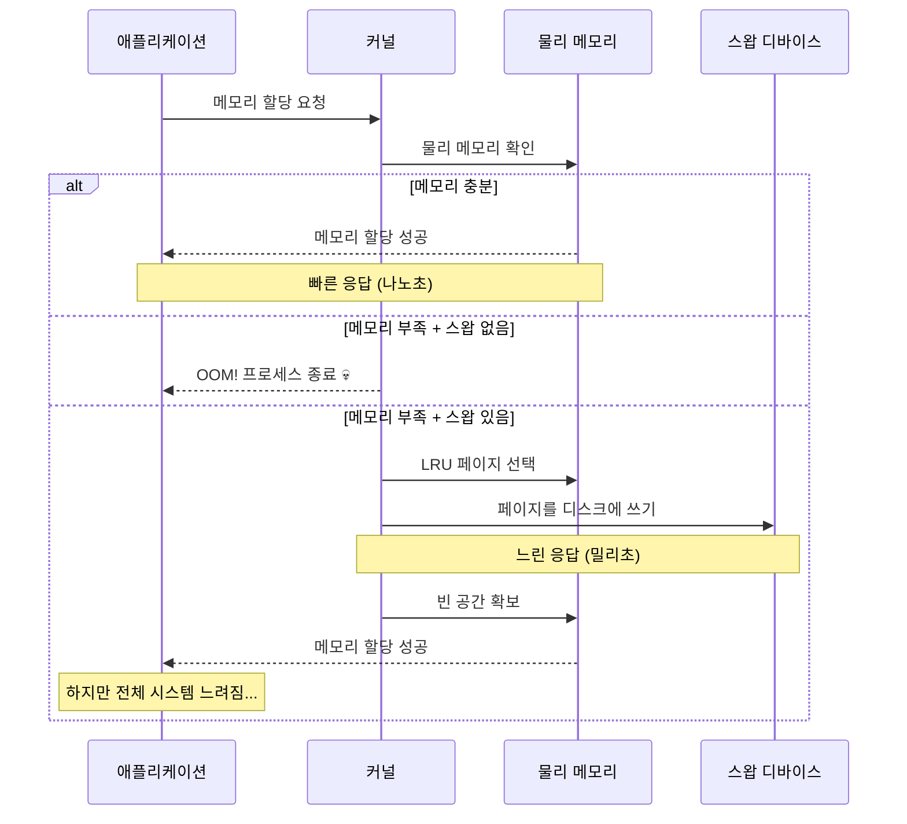
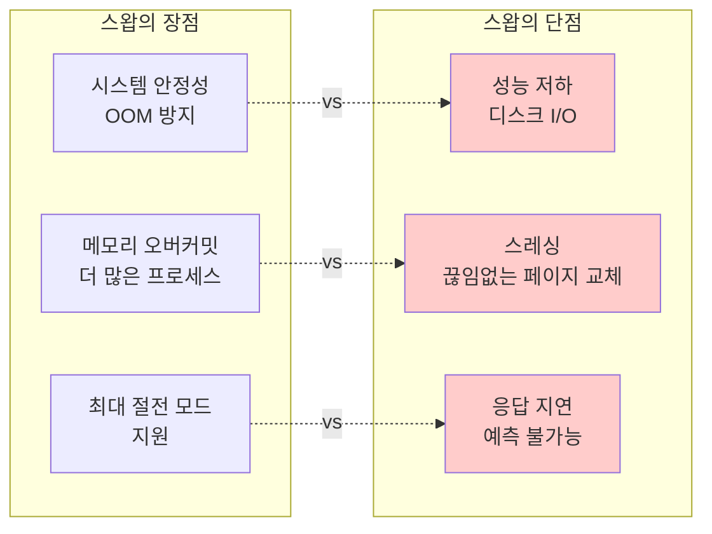
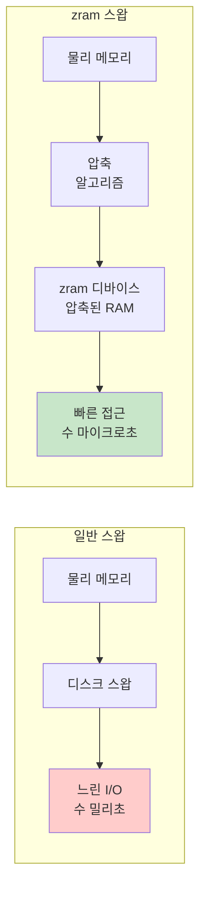
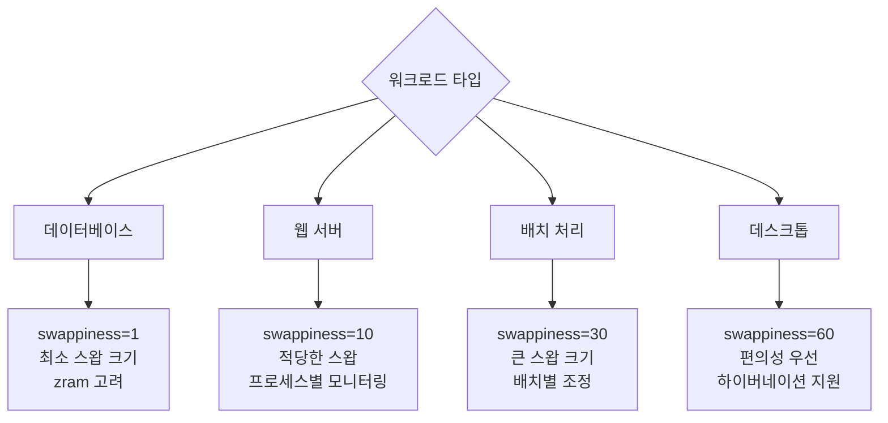

---
tags:
  - Swap
  - VirtualMemory
  - Performance
  - zram
  - swappiness
---

# 3-7: 스왑 관리와 최적화 - "시스템이 swap을 쓰기 시작했어요"

## 이 문서를 읽으면 답할 수 있는 질문들

- 스왑 사용이 성능에 미치는 실제 영향은 무엇인가요?
- swappiness 값을 어떻게 최적화하나요?
- zram과 zswap의 차이점과 활용법은?
- 스왑 사용 패턴을 어떻게 분석하나요?
- 컨테이너 환경에서 스왑 관리 전략은?

## 들어가며: 스왑의 양날의 검

"메모리가 부족해서 스왑을 켰는데, 오히려 더 느려졌어요..."

스왑은 시스템의 **안전망**이지만 동시에 **성능의 적**이기도 합니다. 제대로 이해하지 못하면 오히려 독이 됩니다.



### 스왑의 딜레마



스왑을 현명하게 사용하는 방법을 알아봅시다.

## 1. 스왑 성능 영향 분석

### 1.1 스왑 vs 물리 메모리 성능 차이

```bash
# 현재 스왑 상태 확인
$ cat /proc/swaps
Filename      Type        Size    Used    Priority
/swapfile     file        4194300 0       -2

$ free -h
              total        used        free      shared  buff/cache   available
Mem:           7.8G        2.1G        3.2G        145M        2.5G        5.4G
Swap:          4.0G          0B        4.0G

# 스왑 사용량 실시간 모니터링
$ watch -n 1 'cat /proc/meminfo | grep -E "(MemTotal|MemFree|MemAvailable|SwapTotal|SwapFree)"'
```

### 1.2 스왑 성능 벤치마크

스왑 사용 시 성능 저하를 정량적으로 측정해봅시다:

```c
// swap_performance_test.c
#include <stdio.h>
#include <stdlib.h>
#include <string.h>
#include <sys/time.h>
#include <unistd.h>
#include <sys/mman.h>

#define GB (1024 * 1024 * 1024)

double get_time() {
    struct timeval tv;
    gettimeofday(&tv, NULL);
    return tv.tv_sec + tv.tv_usec / 1000000.0;
}

void get_memory_stats(long *total_mem, long *free_mem, long *swap_used) {
    FILE *meminfo = fopen("/proc/meminfo", "r");
    char line[256];
    
    *total_mem = *free_mem = *swap_used = 0;
    
    while (fgets(line, sizeof(line), meminfo)) {
        if (sscanf(line, "MemTotal: %ld kB", total_mem) == 1) {
            *total_mem *= 1024;  // Convert to bytes
        } else if (sscanf(line, "MemAvailable: %ld kB", free_mem) == 1) {
            *free_mem *= 1024;
        } else if (sscanf(line, "SwapTotal: %ld kB", swap_used) == 1) {
            long swap_total = *swap_used * 1024;
            long swap_free;
            if (fgets(line, sizeof(line), meminfo) && 
                sscanf(line, "SwapFree: %ld kB", &swap_free) == 1) {
                *swap_used = swap_total - (swap_free * 1024);
            }
            break;
        }
    }
    
    fclose(meminfo);
}

void test_memory_allocation(size_t total_size) {
    printf("=== 메모리 할당 성능 테스트 ===\n");
    printf("목표 할당량: %.1f GB\n", (double)total_size / GB);
    
    long total_mem, free_mem, swap_used;
    get_memory_stats(&total_mem, &free_mem, &swap_used);
    
    printf("시스템 메모리: %.1f GB (사용 가능: %.1f GB)\n", 
           (double)total_mem / GB, (double)free_mem / GB);
    
    const size_t chunk_size = 256 * 1024 * 1024;  // 256MB 청크
    const int num_chunks = total_size / chunk_size;
    void **chunks = malloc(sizeof(void*) * num_chunks);
    
    double start = get_time();
    
    // 점진적으로 메모리 할당
    for (int i = 0; i < num_chunks; i++) {
        chunks[i] = malloc(chunk_size);
        if (!chunks[i]) {
            printf("할당 실패: 청크 %d\n", i);
            break;
        }
        
        // 실제 메모리 사용 (페이지 폴트 유발)
        memset(chunks[i], i % 256, chunk_size);
        
        // 메모리 상태 확인
        if (i % 4 == 0) {  // 1GB마다 체크
            get_memory_stats(&total_mem, &free_mem, &swap_used);
            printf("청크 %2d: 사용 가능 메모리 %.1f GB, 스왑 사용 %.1f MB\n",
                   i, (double)free_mem / GB, (double)swap_used / 1024 / 1024);
        }
    }
    
    double alloc_time = get_time() - start;
    printf("할당 완료 시간: %.3f초\n", alloc_time);
    
    // 메모리 접근 성능 테스트
    printf("\n=== 메모리 접근 성능 테스트 ===\n");
    start = get_time();
    
    const int access_rounds = 5;
    for (int round = 0; round < access_rounds; round++) {
        for (int i = 0; i < num_chunks; i++) {
            if (chunks[i]) {
                // 청크의 여러 위치에 접근
                volatile char *ptr = (volatile char*)chunks[i];
                for (int j = 0; j < chunk_size; j += 4096) {
                    char val = ptr[j];  // 페이지 폴트 또는 스왑인 발생 가능
                    ptr[j] = val + 1;   // 쓰기로 dirty page 생성
                }
            }
        }
        
        double round_time = get_time() - start;
        get_memory_stats(&total_mem, &free_mem, &swap_used);
        printf("라운드 %d: %.3f초, 스왑 사용량: %.1f MB\n", 
               round + 1, round_time, (double)swap_used / 1024 / 1024);
    }
    
    double access_time = get_time() - start;
    printf("접근 테스트 완료 시간: %.3f초\n", access_time);
    
    // 메모리 해제
    for (int i = 0; i < num_chunks; i++) {
        if (chunks[i]) {
            free(chunks[i]);
        }
    }
    free(chunks);
    
    get_memory_stats(&total_mem, &free_mem, &swap_used);
    printf("해제 후 스왑 사용량: %.1f MB\n", (double)swap_used / 1024 / 1024);
}

void test_swap_in_out_performance() {
    printf("\n=== 스왑 In/Out 성능 테스트 ===\n");
    
    // 스왑을 강제로 사용하도록 큰 메모리 할당
    size_t size = 1.5 * GB;  // 물리 메모리보다 크게
    char *memory = malloc(size);
    if (!memory) {
        printf("메모리 할당 실패\n");
        return;
    }
    
    printf("%.1f GB 메모리 할당 및 초기화...\n", (double)size / GB);
    
    // 모든 페이지 터치 (스왑아웃 유발)
    double start = get_time();
    for (size_t i = 0; i < size; i += 4096) {
        memory[i] = i % 256;
    }
    double init_time = get_time() - start;
    
    // 잠시 대기 (스왑아웃 유발)
    printf("스왑아웃 대기 중...\n");
    sleep(5);
    
    // 메모리 재접근 (스왑인 유발)
    printf("메모리 재접근 시작 (스왑인 유발)...\n");
    start = get_time();
    
    unsigned char checksum = 0;
    for (size_t i = 0; i < size; i += 4096) {
        checksum ^= memory[i];  // 스왑인 발생
        
        if (i % (256 * 1024 * 1024) == 0) {  // 256MB마다
            double current_time = get_time() - start;
            printf("\r진행률: %.1f%%, 소요시간: %.1f초", 
                   (double)i / size * 100, current_time);
            fflush(stdout);
        }
    }
    
    double swapin_time = get_time() - start;
    
    printf("\n초기화 시간: %.3f초\n", init_time);
    printf("스왑인 시간: %.3f초\n", swapin_time);
    printf("성능 저하: %.1fx\n", swapin_time / init_time);
    printf("체크섬: 0x%02x\n", checksum);
    
    free(memory);
}

int main() {
    printf("Swap Performance Analysis\n");
    printf("========================\n");
    
    // 시스템 메모리보다 큰 크기로 테스트
    long total_mem, free_mem, swap_used;
    get_memory_stats(&total_mem, &free_mem, &swap_used);
    
    size_t test_size = total_mem + (1 * GB);  // 시스템 메모리 + 1GB
    test_memory_allocation(test_size);
    
    test_swap_in_out_performance();
    
    return 0;
}
```

## 2. swappiness 파라미터 최적화

### 2.1 swappiness 이해

`swappiness`는 스왑 사용 적극성을 제어하는 커널 파라미터입니다 (0-100):

```mermaid
graph LR
    subgraph "swappiness 값별 동작"
        ZERO[0<br/>스왑 사용 안 함<br/>(OOM 위험)]
        LOW[1-10<br/>최소한만 사용<br/>(서버 권장)]
        DEFAULT[60<br/>기본값<br/>(데스크톱)]
        HIGH[80-100<br/>적극적 사용<br/>(캐시 우선)]
    end
    
    subgraph "메모리 압박 시 우선순위"
        ZERO --> ANON1[익명 페이지 유지]
        LOW --> CACHE1[페이지 캐시 해제 우선]
        DEFAULT --> BALANCE[균형잡힌 해제]
        HIGH --> ANON2[익명 페이지 스왑아웃]
    end
    
    style LOW fill:#c8e6c9
    style DEFAULT fill:#fff3e0
```

### 2.2 워크로드별 swappiness 최적화

```bash
#!/bin/bash
# swappiness_optimizer.sh

echo "=== swappiness 최적화 도구 ==="

# 현재 설정 확인
current_swappiness=$(cat /proc/sys/vm/swappiness)
echo "현재 swappiness: $current_swappiness"

# 워크로드 타입 확인
echo "시스템 워크로드 분석 중..."

# 메모리 사용 패턴 분석
total_mem=$(grep MemTotal /proc/meminfo | awk '{print $2}')
cached=$(grep "^Cached:" /proc/meminfo | awk '{print $2}')
cache_ratio=$((cached * 100 / total_mem))

echo "페이지 캐시 비율: ${cache_ratio}%"

# CPU 사용률 확인
cpu_usage=$(top -bn1 | grep "Cpu(s)" | awk '{print $2}' | cut -d'%' -f1)
echo "평균 CPU 사용률: ${cpu_usage}%"

# 스왑 사용량 확인
swap_total=$(grep SwapTotal /proc/meminfo | awk '{print $2}')
swap_free=$(grep SwapFree /proc/meminfo | awk '{print $2}')
if [ $swap_total -gt 0 ]; then
    swap_used=$((swap_total - swap_free))
    swap_usage=$((swap_used * 100 / swap_total))
    echo "현재 스왑 사용률: ${swap_usage}%"
else
    echo "스왑이 설정되지 않음"
    exit 1
fi

# 권장 swappiness 계산
recommend_swappiness() {
    # 데이터베이스 서버 감지
    if pgrep -x "mysqld\|postgres\|mongod" > /dev/null; then
        echo "1"  # DB 서버는 매우 낮게
        return
    fi
    
    # 웹 서버 감지
    if pgrep -x "nginx\|apache2\|httpd" > /dev/null; then
        echo "10"  # 웹 서버는 낮게
        return
    fi
    
    # 캐시 비율이 높으면 swappiness를 낮게
    if [ $cache_ratio -gt 50 ]; then
        echo "5"
        return
    fi
    
    # 메모리가 충분하면 낮게
    available_mem=$(grep MemAvailable /proc/meminfo | awk '{print $2}')
    available_ratio=$((available_mem * 100 / total_mem))
    
    if [ $available_ratio -gt 50 ]; then
        echo "1"
    elif [ $available_ratio -gt 20 ]; then
        echo "10"
    else
        echo "30"
    fi
}

recommended=$(recommend_swappiness)
echo "권장 swappiness: $recommended"

# 워크로드 타입 출력
if [ "$recommended" -eq 1 ]; then
    echo "워크로드 타입: 메모리 집약적 (DB/캐시)"
elif [ "$recommended" -le 10 ]; then
    echo "워크로드 타입: 서버 애플리케이션"
else
    echo "워크로드 타입: 일반/데스크톱"
fi

# swappiness 테스트 함수
test_swappiness() {
    local test_value=$1
    local duration=${2:-60}  # 기본 60초
    
    echo "swappiness=$test_value 테스트 시작 ($duration 초)"
    
    # 임시로 변경
    echo $test_value > /proc/sys/vm/swappiness
    
    # 초기 상태 기록
    local start_time=$(date +%s)
    local start_swap=$(grep SwapFree /proc/meminfo | awk '{print $2}')
    local start_cached=$(grep "^Cached:" /proc/meminfo | awk '{print $2}')
    
    # 테스트 기간 동안 대기
    sleep $duration
    
    # 최종 상태 기록
    local end_swap=$(grep SwapFree /proc/meminfo | awk '{print $2}')
    local end_cached=$(grep "^Cached:" /proc/meminfo | awk '{print $2}')
    
    # 변화량 계산
    local swap_change=$((start_swap - end_swap))
    local cache_change=$((end_cached - start_cached))
    
    echo "  스왑 사용량 변화: ${swap_change}KB"
    echo "  캐시 크기 변화: ${cache_change}KB"
    
    # 원복
    echo $current_swappiness > /proc/sys/vm/swappiness
}

# 사용자 선택
echo ""
echo "1) 권장값으로 설정"
echo "2) 수동으로 값 입력"
echo "3) 테스트 모드 (여러 값 비교)"
echo "4) 종료"

read -p "선택하세요 (1-4): " choice

case $choice in
    1)
        echo $recommended > /proc/sys/vm/swappiness
        echo "swappiness를 $recommended 로 설정했습니다."
        echo "영구 설정을 위해 /etc/sysctl.conf에 추가하세요:"
        echo "vm.swappiness = $recommended"
        ;;
    2)
        read -p "swappiness 값 (0-100): " user_value
        if [ $user_value -ge 0 ] && [ $user_value -le 100 ]; then
            echo $user_value > /proc/sys/vm/swappiness
            echo "swappiness를 $user_value 로 설정했습니다."
        else
            echo "잘못된 값입니다 (0-100 범위)"
        fi
        ;;
    3)
        echo "테스트 모드: 각각 30초간 테스트"
        test_swappiness 1 30
        test_swappiness 10 30
        test_swappiness 60 30
        ;;
    4)
        echo "종료합니다."
        ;;
    *)
        echo "잘못된 선택입니다."
        ;;
esac
```

### 2.3 동적 swappiness 조정

시스템 상태에 따라 동적으로 swappiness를 조정하는 스크립트:

```python
#!/usr/bin/env python3
# dynamic_swappiness.py
import time
import os
import psutil

class DynamicSwappiness:
    def __init__(self):
        self.current_swappiness = self.get_current_swappiness()
        self.base_swappiness = 10  # 기본값
        self.min_swappiness = 1
        self.max_swappiness = 60
        
    def get_current_swappiness(self):
        with open('/proc/sys/vm/swappiness', 'r') as f:
            return int(f.read().strip())
    
    def set_swappiness(self, value):
        with open('/proc/sys/vm/swappiness', 'w') as f:
            f.write(str(value))
        self.current_swappiness = value
    
    def get_system_stats(self):
        mem = psutil.virtual_memory()
        swap = psutil.swap_memory()
        
        # 메모리 압박 수준 계산
        memory_pressure = (100 - mem.available / mem.total * 100) / 100
        
        # 스왑 사용률
        swap_usage = swap.percent / 100 if swap.total > 0 else 0
        
        # 캐시 비율
        with open('/proc/meminfo') as f:
            meminfo = f.read()
        
        cached_kb = 0
        for line in meminfo.split('\n'):
            if line.startswith('Cached:'):
                cached_kb = int(line.split()[1])
                break
        
        cache_ratio = cached_kb * 1024 / mem.total
        
        return {
            'memory_pressure': memory_pressure,
            'swap_usage': swap_usage,
            'cache_ratio': cache_ratio,
            'available_ratio': mem.available / mem.total
        }
    
    def calculate_optimal_swappiness(self, stats):
        """시스템 상태에 기반한 최적 swappiness 계산"""
        
        # 기본값에서 시작
        optimal = self.base_swappiness
        
        # 메모리 압박이 높으면 swappiness 증가
        if stats['memory_pressure'] > 0.8:
            optimal += 20  # 압박 상황에서는 적극적 스왑
        elif stats['memory_pressure'] > 0.6:
            optimal += 10
        elif stats['memory_pressure'] < 0.3:
            optimal -= 5   # 여유로우면 스왑 최소화
        
        # 스왑이 이미 많이 사용 중이면 줄이기
        if stats['swap_usage'] > 0.5:
            optimal -= 15
        elif stats['swap_usage'] > 0.2:
            optimal -= 5
        
        # 캐시 비율이 높으면 swappiness 낮추기
        if stats['cache_ratio'] > 0.6:
            optimal -= 10
        elif stats['cache_ratio'] > 0.4:
            optimal -= 5
        
        # 범위 제한
        optimal = max(self.min_swappiness, min(self.max_swappiness, optimal))
        
        return optimal
    
    def monitor_and_adjust(self, interval=30, duration=3600):
        """지정된 기간 동안 swappiness 모니터링 및 조정"""
        print(f"Dynamic swappiness 모니터링 시작 ({duration}초)")
        print(f"조정 간격: {interval}초")
        
        start_time = time.time()
        
        while time.time() - start_time < duration:
            stats = self.get_system_stats()
            optimal = self.calculate_optimal_swappiness(stats)
            
            # 현재 값과 차이가 5 이상이면 조정
            if abs(optimal - self.current_swappiness) >= 5:
                print(f"[{time.strftime('%H:%M:%S')}] swappiness 조정: "
                      f"{self.current_swappiness} -> {optimal}")
                print(f"  메모리 압박: {stats['memory_pressure']:.2f}")
                print(f"  스왑 사용률: {stats['swap_usage']:.2f}")
                print(f"  캐시 비율: {stats['cache_ratio']:.2f}")
                
                self.set_swappiness(optimal)
            else:
                print(f"[{time.strftime('%H:%M:%S')}] swappiness 유지: "
                      f"{self.current_swappiness} (최적값: {optimal})")
            
            time.sleep(interval)
        
        print("모니터링 완료")

if __name__ == "__main__":
    import sys
    
    if os.geteuid() != 0:
        print("root 권한이 필요합니다.")
        sys.exit(1)
    
    monitor = DynamicSwappiness()
    
    try:
        monitor.monitor_and_adjust(interval=30, duration=1800)  # 30분간
    except KeyboardInterrupt:
        print("\n모니터링 중단됨")
    except Exception as e:
        print(f"오류 발생: {e}")
```

## 3. zram과 zswap 활용

### 3.1 zram (압축된 RAM 스왑)

zram은 RAM의 일부를 압축하여 가상의 스왑 디바이스로 사용합니다:



**zram 설정 및 사용**:

```bash
#!/bin/bash
# setup_zram.sh

echo "=== zram 설정 도구 ==="

# zram 모듈 로드
modprobe zram

# 사용할 zram 디바이스 수 (CPU 코어 수와 동일하게)
num_devices=$(nproc)
echo "zram 디바이스 수: $num_devices"

# 기존 zram 디바이스 제거
for device in /dev/zram*; do
    if [ -b "$device" ]; then
        swapoff "$device" 2>/dev/null
        echo 0 > /sys/block/${device##*/}/disksize 2>/dev/null
    fi
done

# 새 zram 디바이스 생성
echo $num_devices > /sys/module/zram/parameters/num_devices

# 각 디바이스 설정
total_mem=$(grep MemTotal /proc/meminfo | awk '{print $2}')  # KB
zram_size=$((total_mem / num_devices / 4))  # 전체 메모리의 1/4을 zram으로

echo "각 zram 디바이스 크기: $((zram_size / 1024))MB"

for i in $(seq 0 $((num_devices - 1))); do
    device="/dev/zram$i"
    
    # 압축 알고리즘 설정 (lz4가 빠름)
    echo lz4 > /sys/block/zram$i/comp_algorithm
    
    # 크기 설정
    echo ${zram_size}K > /sys/block/zram$i/disksize
    
    # 스왑 디바이스로 설정
    mkswap $device
    swapon $device -p 10  # 높은 우선순위
    
    echo "zram$i 활성화 완료"
done

echo "zram 설정 완료!"
swapon -s
```

### 3.2 zram vs 일반 스왑 성능 비교

```c
// zram_benchmark.c
#include <stdio.h>
#include <stdlib.h>
#include <string.h>
#include <sys/time.h>
#include <unistd.h>

double get_time() {
    struct timeval tv;
    gettimeofday(&tv, NULL);
    return tv.tv_sec + tv.tv_usec / 1000000.0;
}

void test_swap_performance(const char *test_name, int force_swap_usage) {
    printf("=== %s ===\n", test_name);
    
    // 메모리 부족 상황 유발
    size_t mem_size = 2UL * 1024 * 1024 * 1024;  // 2GB
    printf("%.1f GB 메모리 할당 중...\n", (double)mem_size / 1024 / 1024 / 1024);
    
    char *memory = malloc(mem_size);
    if (!memory) {
        printf("메모리 할당 실패\n");
        return;
    }
    
    double start = get_time();
    
    // 메모리 초기화 (스왑 사용 유발)
    for (size_t i = 0; i < mem_size; i += 4096) {
        memory[i] = i % 256;
    }
    
    double init_time = get_time() - start;
    printf("초기화 시간: %.3f초\n", init_time);
    
    if (force_swap_usage) {
        printf("스왑 사용 강제 유발 중...\n");
        // 더 많은 메모리 할당으로 스왑 강제 사용
        size_t extra_size = 1UL * 1024 * 1024 * 1024;  // 추가 1GB
        char *extra_memory = malloc(extra_size);
        if (extra_memory) {
            memset(extra_memory, 0xAA, extra_size);
            sleep(2);  // 스왑아웃 대기
            free(extra_memory);
        }
    }
    
    // 메모리 재접근 (스왑인 테스트)
    printf("메모리 재접근 시작...\n");
    start = get_time();
    
    unsigned char checksum = 0;
    size_t access_count = 0;
    
    for (size_t i = 0; i < mem_size; i += 4096) {
        checksum ^= memory[i];
        access_count++;
        
        // 진행 상황 출력
        if (access_count % (64 * 1024) == 0) {  // 256MB마다
            double current_time = get_time() - start;
            printf("\r%.1f%% 완료 (%.2f초)", 
                   (double)i / mem_size * 100, current_time);
            fflush(stdout);
        }
    }
    
    double access_time = get_time() - start;
    
    printf("\n재접근 시간: %.3f초\n", access_time);
    printf("접근 속도: %.1f MB/s\n", 
           (mem_size / 1024.0 / 1024.0) / access_time);
    printf("체크섬: 0x%02x\n", checksum);
    
    free(memory);
    
    // 스왑 상태 확인
    system("grep -E 'SwapTotal|SwapFree' /proc/meminfo");
    printf("\n");
}

void show_zram_stats() {
    printf("=== zram 통계 ===\n");
    
    for (int i = 0; i < 8; i++) {  // 최대 8개 zram 디바이스 체크
        char path[256];
        snprintf(path, sizeof(path), "/sys/block/zram%d/disksize", i);
        
        FILE *f = fopen(path, "r");
        if (!f) continue;
        
        long disksize;
        fscanf(f, "%ld", &disksize);
        fclose(f);
        
        if (disksize == 0) continue;
        
        printf("zram%d:\n", i);
        
        // 압축 통계
        snprintf(path, sizeof(path), "/sys/block/zram%d/mm_stat", i);
        f = fopen(path, "r");
        if (f) {
            long orig_data_size, compr_data_size, mem_used_total;
            fscanf(f, "%ld %ld %ld", &orig_data_size, &compr_data_size, &mem_used_total);
            fclose(f);
            
            if (orig_data_size > 0) {
                double compression_ratio = (double)orig_data_size / compr_data_size;
                printf("  원본 데이터: %.1f MB\n", orig_data_size / 1024.0 / 1024.0);
                printf("  압축 데이터: %.1f MB\n", compr_data_size / 1024.0 / 1024.0);
                printf("  압축비: %.2f:1\n", compression_ratio);
                printf("  메모리 절약: %.1f MB\n", 
                       (orig_data_size - mem_used_total) / 1024.0 / 1024.0);
            }
        }
    }
}

int main() {
    printf("zram vs 일반 스왑 성능 비교\n");
    printf("==========================\n");
    
    // 현재 스왑 설정 확인
    printf("현재 스왑 설정:\n");
    system("swapon -s");
    printf("\n");
    
    // zram 통계 표시
    show_zram_stats();
    
    // 성능 테스트
    test_swap_performance("zram 성능 테스트", 1);
    
    return 0;
}
```

### 3.3 zswap 설정 (하이브리드 접근)

zswap은 페이지 캐시와 스왑 디바이스 사이의 중간층 역할을 합니다:

```bash
#!/bin/bash
# setup_zswap.sh

echo "=== zswap 설정 ==="

# zswap 활성화
echo 1 > /sys/module/zswap/parameters/enabled
echo "zswap 활성화 완료"

# 압축 알고리즘 설정
echo lz4 > /sys/module/zswap/parameters/compressor
echo "압축 알고리즘: lz4"

# 메모리 풀 설정 (zbud 또는 z3fold)
echo z3fold > /sys/module/zswap/parameters/zpool
echo "메모리 풀: z3fold"

# 최대 풀 크기 (RAM의 20%)
echo 20 > /sys/module/zswap/parameters/max_pool_percent
echo "최대 풀 크기: 20%"

# 설정 확인
echo "현재 zswap 설정:"
cat /sys/module/zswap/parameters/enabled
cat /sys/module/zswap/parameters/compressor
cat /sys/module/zswap/parameters/zpool
cat /sys/module/zswap/parameters/max_pool_percent

echo "zswap 설정 완료!"
```

## 4. 스왑 사용 패턴 분석

### 4.1 실시간 스왑 모니터링

```python
#!/usr/bin/env python3
# swap_monitor.py
import time
import psutil
import os
import subprocess
from collections import defaultdict, deque

class SwapMonitor:
    def __init__(self, history_size=300):  # 5분간 히스토리
        self.history_size = history_size
        self.swap_history = deque(maxlen=history_size)
        self.process_swap = defaultdict(lambda: deque(maxlen=history_size))
        
    def get_system_swap_info(self):
        swap = psutil.swap_memory()
        return {
            'total': swap.total,
            'used': swap.used,
            'free': swap.free,
            'percent': swap.percent
        }
    
    def get_process_swap_info(self):
        """프로세스별 스왑 사용량 수집"""
        process_swap = {}
        
        for proc in psutil.process_iter(['pid', 'name', 'memory_info']):
            try:
                pid = proc.info['pid']
                
                # /proc/PID/status에서 VmSwap 읽기
                with open(f'/proc/{pid}/status') as f:
                    for line in f:
                        if line.startswith('VmSwap:'):
                            swap_kb = int(line.split()[1])
                            if swap_kb > 0:
                                process_swap[pid] = {
                                    'name': proc.info['name'],
                                    'swap_kb': swap_kb
                                }
                            break
            except (psutil.NoSuchProcess, FileNotFoundError, ValueError):
                continue
        
        return process_swap
    
    def get_swap_activity(self):
        """스왑 I/O 활동 모니터링"""
        try:
            with open('/proc/vmstat') as f:
                vmstat = f.read()
            
            swap_in = 0
            swap_out = 0
            
            for line in vmstat.split('\n'):
                if line.startswith('pswpin '):
                    swap_in = int(line.split()[1])
                elif line.startswith('pswpout '):
                    swap_out = int(line.split()[1])
            
            return {'swap_in': swap_in, 'swap_out': swap_out}
        except:
            return {'swap_in': 0, 'swap_out': 0}
    
    def analyze_swap_pattern(self):
        """스왑 사용 패턴 분석"""
        if len(self.swap_history) < 10:
            return None
        
        recent_usage = [entry['percent'] for entry in list(self.swap_history)[-10:]]
        trend = recent_usage[-1] - recent_usage[0]
        
        volatility = 0
        for i in range(1, len(recent_usage)):
            volatility += abs(recent_usage[i] - recent_usage[i-1])
        volatility /= len(recent_usage) - 1
        
        return {
            'trend': trend,  # 증가/감소 경향
            'volatility': volatility,  # 변동성
            'current_usage': recent_usage[-1]
        }
    
    def monitor(self, duration=300, interval=1):
        """스왑 모니터링 실행"""
        print(f"스왑 모니터링 시작 ({duration}초간, {interval}초 간격)")
        
        start_time = time.time()
        last_swap_activity = self.get_swap_activity()
        
        while time.time() - start_time < duration:
            # 시스템 전체 스왑 정보
            swap_info = self.get_system_swap_info()
            swap_activity = self.get_swap_activity()
            
            # 스왑 I/O 활동 계산
            swap_in_rate = swap_activity['swap_in'] - last_swap_activity['swap_in']
            swap_out_rate = swap_activity['swap_out'] - last_swap_activity['swap_out']
            
            # 히스토리 업데이트
            self.swap_history.append({
                'timestamp': time.time(),
                'percent': swap_info['percent'],
                'used_mb': swap_info['used'] / 1024 / 1024,
                'swap_in_rate': swap_in_rate,
                'swap_out_rate': swap_out_rate
            })
            
            # 프로세스별 스왑 사용량
            process_swap = self.get_process_swap_info()
            top_processes = sorted(process_swap.items(), 
                                 key=lambda x: x[1]['swap_kb'], 
                                 reverse=True)[:5]
            
            # 현재 상태 출력
            print(f"\n[{time.strftime('%H:%M:%S')}] 스왑 상태:")
            print(f"  사용률: {swap_info['percent']:.1f}% "
                  f"({swap_info['used'] / 1024 / 1024:.1f} MB)")
            print(f"  스왑 I/O: In={swap_in_rate}/s, Out={swap_out_rate}/s")
            
            # 패턴 분석
            pattern = self.analyze_swap_pattern()
            if pattern:
                if pattern['trend'] > 5:
                    print("  ⚠️  스왑 사용량 증가 추세!")
                elif pattern['volatility'] > 10:
                    print("  ⚠️  스왑 사용량 불안정!")
            
            # 상위 스왑 사용 프로세스
            if top_processes:
                print("  상위 스왑 사용 프로세스:")
                for pid, info in top_processes:
                    print(f"    PID {pid:5d} ({info['name']:15s}): "
                          f"{info['swap_kb']:6d} KB")
            
            last_swap_activity = swap_activity
            time.sleep(interval)
        
        self.generate_report()
    
    def generate_report(self):
        """모니터링 결과 리포트 생성"""
        print("\n" + "="*50)
        print("스왑 사용 패턴 분석 리포트")
        print("="*50)
        
        if not self.swap_history:
            print("수집된 데이터가 없습니다.")
            return
        
        usage_data = [entry['percent'] for entry in self.swap_history]
        swap_io_in = [entry['swap_in_rate'] for entry in self.swap_history]
        swap_io_out = [entry['swap_out_rate'] for entry in self.swap_history]
        
        print(f"모니터링 기간: {len(self.swap_history)}초")
        print(f"평균 사용률: {sum(usage_data) / len(usage_data):.1f}%")
        print(f"최대 사용률: {max(usage_data):.1f}%")
        print(f"사용률 변동폭: {max(usage_data) - min(usage_data):.1f}%")
        
        total_swap_in = sum(swap_io_in)
        total_swap_out = sum(swap_io_out)
        
        print(f"총 스왑 인: {total_swap_in:,} 페이지")
        print(f"총 스왑 아웃: {total_swap_out:,} 페이지")
        
        # 경고 및 권장사항
        avg_usage = sum(usage_data) / len(usage_data)
        max_usage = max(usage_data)
        
        print("\n권장사항:")
        if max_usage > 80:
            print("- 메모리 증설을 고려하세요")
        elif avg_usage > 30:
            print("- swappiness 값을 낮춰보세요")
        elif total_swap_out > total_swap_in * 2:
            print("- 메모리 누수 가능성을 확인하세요")
        else:
            print("- 현재 스왑 사용 패턴이 양호합니다")

if __name__ == "__main__":
    if not psutil.swap_memory().total:
        print("스왑이 설정되지 않았습니다.")
        exit(1)
    
    monitor = SwapMonitor()
    
    try:
        monitor.monitor(duration=300, interval=2)  # 5분간 2초 간격
    except KeyboardInterrupt:
        print("\n모니터링 중단됨")
        monitor.generate_report()
```

## 5. 컨테이너 환경 스왑 관리

### 5.1 Docker 스왑 제한 설정

```bash
# Docker 컨테이너 스왑 제한
docker run -m 512m --memory-swap 1g myapp  # 메모리 512MB, 스왑 512MB

# 스왑 비활성화
docker run -m 512m --memory-swap 512m myapp  # 스왑 = 메모리 (실질적 비활성화)

# 무제한 스왑 (권장하지 않음)
docker run -m 512m --memory-swap -1 myapp
```

### 5.2 Kubernetes 스왑 관리

```yaml
# swap-aware-pod.yaml
apiVersion: v1
kind: Pod
metadata:
  name: swap-aware-app
  annotations:
    pod.kubernetes.io/swap-usage: "limited"  # 제한된 스왑 사용
spec:
  containers:
  - name: app
    image: myapp:latest
    resources:
      requests:
        memory: 256Mi
      limits:
        memory: 512Mi
  nodeSelector:
    swap.enabled: "true"
```

## 6. 정리와 실무 가이드

스왑은 잘 사용하면 시스템 안정성을 크게 높일 수 있지만, 잘못 사용하면 성능 저하의 주범이 됩니다.

### 6.1 스왑 관리 Best Practices

**설정 단계**:

- [ ] 워크로드에 맞는 적절한 스왑 크기 설정
- [ ] swappiness 값 최적화 (서버: 1-10, 데스크톱: 60)
- [ ] zram/zswap 적용 고려
- [ ] 컨테이너 스왑 정책 설정

**모니터링 단계**:

- [ ] 실시간 스왑 사용률 추적
- [ ] 프로세스별 스왑 사용량 파악
- [ ] 스왑 I/O 패턴 분석
- [ ] 성능 영향 정기 평가

### 6.2 워크로드별 스왑 전략



다음 섹션에서는 OOM 디버깅과 메모리 부족 상황 대응을 다뤄보겠습니다.

현명한 스왑 관리로 시스템 안정성과 성능을 모두 잡아봅시다! 💪
