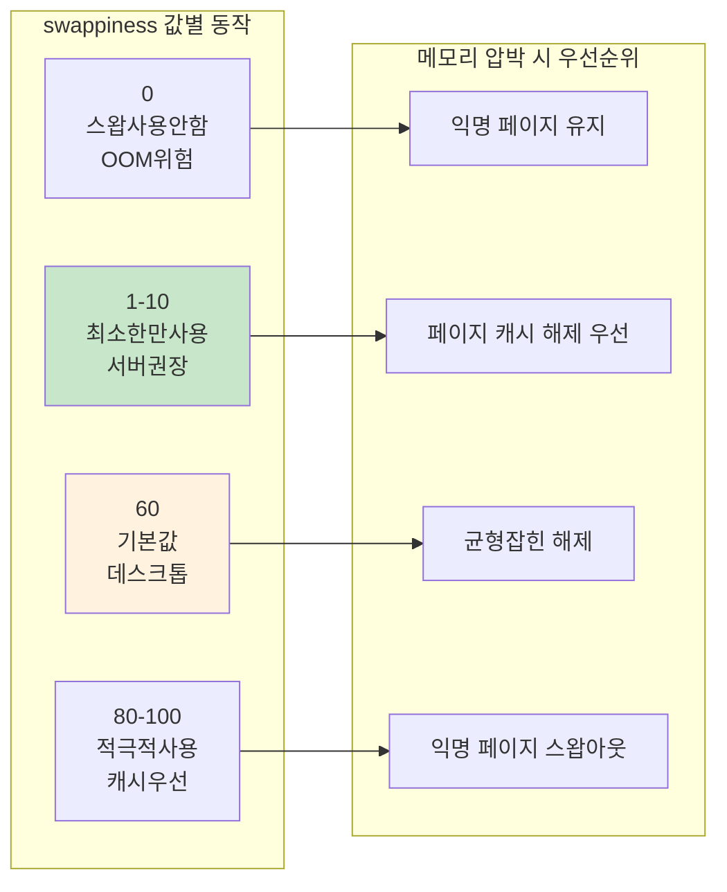

---
tags:
  - Swap
  - swappiness
  - Performance
  - SystemTuning
---

# 3-7B: swappiness 파라미터 최적화 - "스왑의 적극성을 제어하는 핵심 열쇠"

## swappiness: 스왑 사용의 균형추

`swappiness`는 Linux 커널이 메모리 압박 상황에서 **익명 페이지(Anonymous Pages)**와 **페이지 캐시(Page Cache)** 중 어느 것을 먼저 회수할지 결정하는 핵심 파라미터입니다. 0-100 범위의 값으로, 시스템 성능에 직접적인 영향을 미칩니다.

## swappiness 동작 원리

### 값별 동작 특성



### swappiness 계산 공식

커널이 사용하는 실제 계산 공식:

```text
스왑 가능성 = (익명 페이지 압박 * swappiness) / 100
캐시 회수 가능성 = 파일 페이지 압박 * (100 - swappiness) / 100
```

## 워크로드별 swappiness 최적화

### 자동 최적화 도구

```bash
#!/bin/bash
# swappiness_optimizer.sh

echo "=== swappiness 최적화 도구 ==="

# 현재 설정 확인
current_swappiness=$(cat /proc/sys/vm/swappiness)
echo "현재 swappiness: $current_swappiness"

# 워크로드 타입 확인
echo "시스템 워크로드 분석 중..."

# 메모리 사용 패턴 분석
total_mem=$(grep MemTotal /proc/meminfo | awk '{print $2}')
cached=$(grep "^Cached:" /proc/meminfo | awk '{print $2}')
cache_ratio=$((cached * 100 / total_mem))

echo "페이지 캐시 비율: ${cache_ratio}%"

# CPU 사용률 확인
cpu_usage=$(top -bn1 | grep "Cpu(s)" | awk '{print $2}' | cut -d'%' -f1)
echo "평균 CPU 사용률: ${cpu_usage}%"

# 스왑 사용량 확인
swap_total=$(grep SwapTotal /proc/meminfo | awk '{print $2}')
swap_free=$(grep SwapFree /proc/meminfo | awk '{print $2}')
if [ $swap_total -gt 0 ]; then
    swap_used=$((swap_total - swap_free))
    swap_usage=$((swap_used * 100 / swap_total))
    echo "현재 스왑 사용률: ${swap_usage}%"
else
    echo "스왑이 설정되지 않음"
    exit 1
fi

# 권장 swappiness 계산
recommend_swappiness() {
    # 데이터베이스 서버 감지
    if pgrep -x "mysqld\|postgres\|mongod" > /dev/null; then
        echo "1"  # DB 서버는 매우 낮게
        return
    fi

    # 웹 서버 감지
    if pgrep -x "nginx\|apache2\|httpd" > /dev/null; then
        echo "10"  # 웹 서버는 낮게
        return
    fi

    # 캐시 비율이 높으면 swappiness를 낮게
    if [ $cache_ratio -gt 50 ]; then
        echo "5"
        return
    fi

    # 메모리가 충분하면 낮게
    available_mem=$(grep MemAvailable /proc/meminfo | awk '{print $2}')
    available_ratio=$((available_mem * 100 / total_mem))

    if [ $available_ratio -gt 50 ]; then
        echo "1"
    elif [ $available_ratio -gt 20 ]; then
        echo "10"
    else
        echo "30"
    fi
}

recommended=$(recommend_swappiness)
echo "권장 swappiness: $recommended"

# 워크로드 타입 출력
if [ "$recommended" -eq 1 ]; then
    echo "워크로드 타입: 메모리 집약적 (DB/캐시)"
elif [ "$recommended" -le 10 ]; then
    echo "워크로드 타입: 서버 애플리케이션"
else
    echo "워크로드 타입: 일반/데스크톱"
fi

# swappiness 테스트 함수
test_swappiness() {
    local test_value=$1
    local duration=${2:-60}  # 기본 60초

    echo "swappiness=$test_value 테스트 시작 ($duration 초)"

    # 임시로 변경
    echo $test_value > /proc/sys/vm/swappiness

    # 초기 상태 기록
    local start_time=$(date +%s)
    local start_swap=$(grep SwapFree /proc/meminfo | awk '{print $2}')
    local start_cached=$(grep "^Cached:" /proc/meminfo | awk '{print $2}')

    # 테스트 기간 동안 대기
    sleep $duration

    # 최종 상태 기록
    local end_swap=$(grep SwapFree /proc/meminfo | awk '{print $2}')
    local end_cached=$(grep "^Cached:" /proc/meminfo | awk '{print $2}')

    # 변화량 계산
    local swap_change=$((start_swap - end_swap))
    local cache_change=$((end_cached - start_cached))

    echo "  스왑 사용량 변화: ${swap_change}KB"
    echo "  캐시 크기 변화: ${cache_change}KB"

    # 원복
    echo $current_swappiness > /proc/sys/vm/swappiness
}

# 사용자 선택
echo ""
echo "1) 권장값으로 설정"
echo "2) 수동으로 값 입력"
echo "3) 테스트 모드 (여러 값 비교)"
echo "4) 종료"

read -p "선택하세요 (1-4): " choice

case $choice in
    1)
        echo $recommended > /proc/sys/vm/swappiness
        echo "swappiness를 $recommended 로 설정했습니다."
        echo "영구 설정을 위해 /etc/sysctl.conf에 추가하세요:"
        echo "vm.swappiness = $recommended"
        ;;
    2)
        read -p "swappiness 값 (0-100): " user_value
        if [ $user_value -ge 0 ] && [ $user_value -le 100 ]; then
            echo $user_value > /proc/sys/vm/swappiness
            echo "swappiness를 $user_value 로 설정했습니다."
        else
            echo "잘못된 값입니다 (0-100 범위)"
        fi
        ;;
    3)
        echo "테스트 모드: 각각 30초간 테스트"
        test_swappiness 1 30
        test_swappiness 10 30
        test_swappiness 60 30
        ;;
    4)
        echo "종료합니다."
        ;;
    *)
        echo "잘못된 선택입니다."
        ;;
esac
```

## 동적 swappiness 조정

시스템 상태에 따라 실시간으로 swappiness를 조정하는 고급 도구:

```python
#!/usr/bin/env python3
# dynamic_swappiness.py
import time
import os
import psutil

class DynamicSwappiness:
    def __init__(self):
        self.current_swappiness = self.get_current_swappiness()
        self.base_swappiness = 10  # 기본값
        self.min_swappiness = 1
        self.max_swappiness = 60

    def get_current_swappiness(self):
        with open('/proc/sys/vm/swappiness', 'r') as f:
            return int(f.read().strip())

    def set_swappiness(self, value):
        with open('/proc/sys/vm/swappiness', 'w') as f:
            f.write(str(value))
        self.current_swappiness = value

    def get_system_stats(self):
        mem = psutil.virtual_memory()
        swap = psutil.swap_memory()

        # 메모리 압박 수준 계산
        memory_pressure = (100 - mem.available / mem.total * 100) / 100

        # 스왑 사용률
        swap_usage = swap.percent / 100 if swap.total > 0 else 0

        # 캐시 비율
        with open('/proc/meminfo') as f:
            meminfo = f.read()

        cached_kb = 0
        for line in meminfo.split('\n'):
            if line.startswith('Cached:'):
                cached_kb = int(line.split()[1])
                break

        cache_ratio = cached_kb * 1024 / mem.total

        return {
            'memory_pressure': memory_pressure,
            'swap_usage': swap_usage,
            'cache_ratio': cache_ratio,
            'available_ratio': mem.available / mem.total
        }

    def calculate_optimal_swappiness(self, stats):
        """시스템 상태에 기반한 최적 swappiness 계산"""

        # 기본값에서 시작
        optimal = self.base_swappiness

        # 메모리 압박이 높으면 swappiness 증가
        if stats['memory_pressure'] > 0.8:
            optimal += 20  # 압박 상황에서는 적극적 스왑
        elif stats['memory_pressure'] > 0.6:
            optimal += 10
        elif stats['memory_pressure'] < 0.3:
            optimal -= 5   # 여유로우면 스왑 최소화

        # 스왑이 이미 많이 사용 중이면 줄이기
        if stats['swap_usage'] > 0.5:
            optimal -= 15
        elif stats['swap_usage'] > 0.2:
            optimal -= 5

        # 캐시 비율이 높으면 swappiness 낮추기
        if stats['cache_ratio'] > 0.6:
            optimal -= 10
        elif stats['cache_ratio'] > 0.4:
            optimal -= 5

        # 범위 제한
        optimal = max(self.min_swappiness, min(self.max_swappiness, optimal))

        return optimal

    def monitor_and_adjust(self, interval=30, duration=3600):
        """지정된 기간 동안 swappiness 모니터링 및 조정"""
        print(f"Dynamic swappiness 모니터링 시작 ({duration}초)")
        print(f"조정 간격: {interval}초")

        start_time = time.time()

        while time.time() - start_time < duration:
            stats = self.get_system_stats()
            optimal = self.calculate_optimal_swappiness(stats)

            # 현재 값과 차이가 5 이상이면 조정
            if abs(optimal - self.current_swappiness) >= 5:
                print(f"[{time.strftime('%H:%M:%S')}] swappiness 조정: "
                      f"{self.current_swappiness} -> {optimal}")
                print(f"  메모리 압박: {stats['memory_pressure']:.2f}")
                print(f"  스왑 사용률: {stats['swap_usage']:.2f}")
                print(f"  캐시 비율: {stats['cache_ratio']:.2f}")

                self.set_swappiness(optimal)
            else:
                print(f"[{time.strftime('%H:%M:%S')}] swappiness 유지: "
                      f"{self.current_swappiness} (최적값: {optimal})")

            time.sleep(interval)

        print("모니터링 완료")

if __name__ == "__main__":
    import sys

    if os.geteuid() != 0:
        print("root 권한이 필요합니다.")
        sys.exit(1)

    monitor = DynamicSwappiness()

    try:
        monitor.monitor_and_adjust(interval=30, duration=1800)  # 30분간
    except KeyboardInterrupt:
        print("\n모니터링 중단됨")
    except Exception as e:
        print(f"오류 발생: {e}")
```

## 워크로드별 권장 설정

### 데이터베이스 서버

```bash
# MySQL, PostgreSQL, MongoDB 등
echo 1 > /proc/sys/vm/swappiness

# 영구 설정
echo "vm.swappiness = 1" >> /etc/sysctl.conf
```

**이유**: 데이터베이스는 자체적인 버퍼 풀을 관리하므로 OS 스왑 사용을 최소화해야 함

### 웹 서버

```bash
# Nginx, Apache 등
echo 10 > /proc/sys/vm/swappiness

# 영구 설정  
echo "vm.swappiness = 10" >> /etc/sysctl.conf
```

**이유**: 정적 파일 서빙을 위한 페이지 캐시 유지가 더 중요

### 캐시 서버

```bash
# Redis, Memcached 등
echo 1 > /proc/sys/vm/swappiness

# 영구 설정
echo "vm.swappiness = 1" >> /etc/sysctl.conf
```

**이유**: 메모리 기반 캐시의 스왑아웃은 성능에 치명적 영향

## 핵심 요점

### 1. swappiness의 본질

**페이지 캐시 vs 익명 페이지**의 회수 우선순위를 결정하는 매개체

### 2. 값 선택의 핵심 원칙

- **메모리 집약적 애플리케이션**: 낮은 값 (1-10)
- **I/O 집약적 워크로드**: 중간 값 (30-60)  
- **일반 데스크톱**: 기본값 (60)

### 3. 동적 조정의 장점

시스템 상황에 따른 **적응적 최적화**로 일관된 성능 유지

---

**이전**: [스왑 성능 영향 분석](07a-swap-performance-analysis.md)  
**다음**: [압축 스왑 기술](07c-compressed-swap-technologies.md)에서 zram과 zswap의 고급 최적화 기법을 학습합니다.
