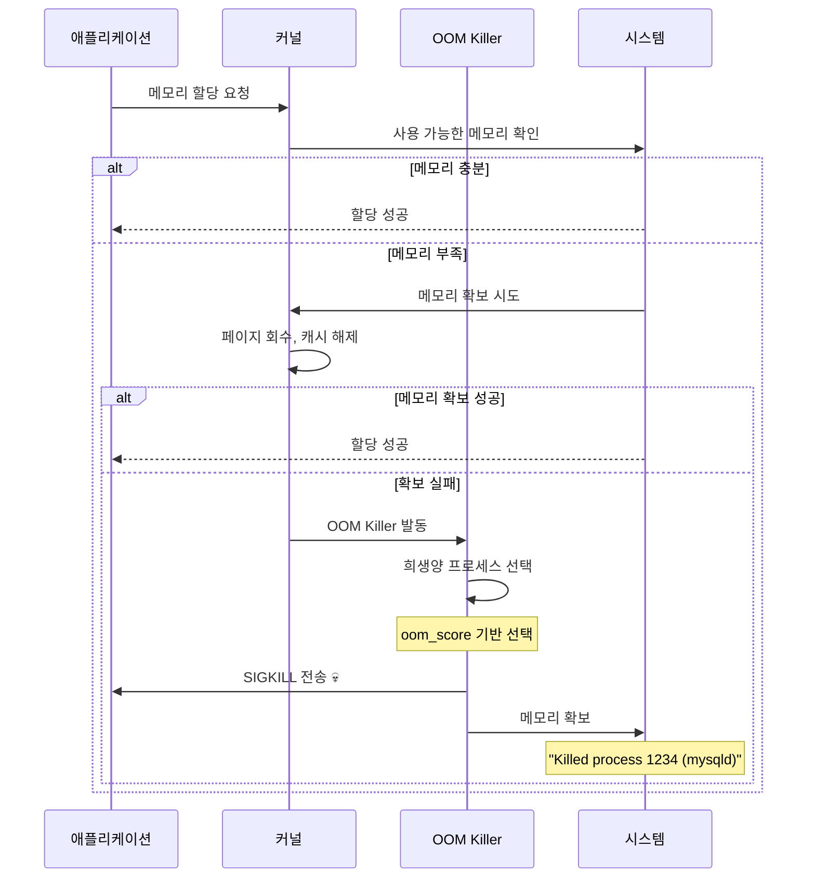
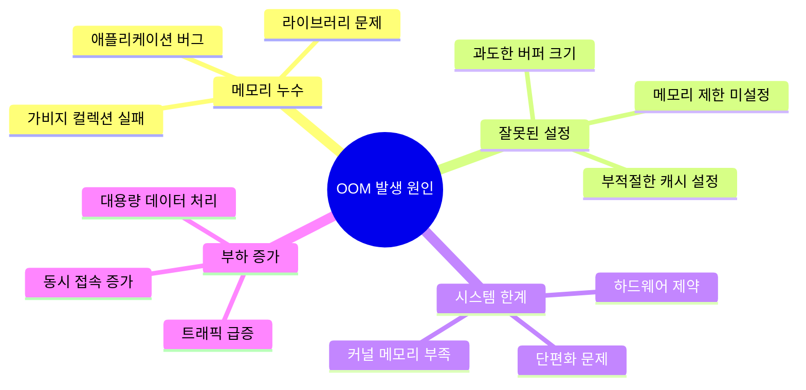

---
tags:
  - OOM
  - OutOfMemory
  - Debugging
  - cgroup
  - oom_score
---

# 3-8: OOM 디버깅과 예방 개요

## 🎯 시스템 안정성을 위협하는 OOM 문제 완전 정복

"갑자기 데이터베이스가 죽었는데 로그에는 아무것도 없어요..."

OOM(Out of Memory)는 시스템의 **마지막 방어선**이지만, 예측하기 어렵고 치명적인 결과를 낳을 수 있습니다.

### OOM의 근본 원인들

## 📚 학습 로드맵

이 섹션은 4개의 전문화된 문서로 구성되어 있습니다:

### 1️⃣ [OOM Killer 동작 원리](08a-oom-killer-fundamentals.md)

- OOM Score 계산 메커니즘과 badness 함수 원리
- 실시간 OOM Score 모니터링 도구 구현
- oom_score_adj 조정을 통한 프로세스 보호 전략
- systemd OOM 정책 설정과 중요 프로세스 보호

### 2️⃣ [dmesg OOM 메시지 분석](08b-oom-log-analysis.md)

- dmesg에 기록되는 OOM 로그 메시지 해석법
- 자동 OOM 분석 도구로 패턴 발견하기
- 시스템 OOM 설정 파라미터 분석
- 반복적 OOM 발생 원인 진단과 해결책

### 3️⃣ [컨테이너 환경 OOM 디버깅](08c-container-oom-debugging.md)

- cgroup OOM vs 시스템 OOM 차이점 이해
- Docker 컨테이너 메모리 제한과 OOM 대응
- Kubernetes Pod OOM 이벤트 모니터링
- 컨테이너별 메모리 최적화 전략

### 4️⃣ [Early OOM 및 예방 시스템](08d-oom-prevention-strategies.md)

- earlyoom과 커스텀 Early OOM 시스템 구축
- 메모리 압박 감지 및 자동 대응 시스템
- 워크로드별 OOM 방지 전략 수립
- 실무 권장사항과 모니터링 시스템 구축

## 🎯 핵심 개념 비교표

| 구분 | 시스템 OOM | cgroup OOM | Early OOM | 예방 전략 |
|------|------------|------------|-----------|----------|
| **발생 시점** | 시스템 메모리 고갈 | 컨테이너 제한 초과 | 임계값 도달 | 사전 방지 |
| **대상 범위** | 전역 프로세스 | 컨테이너 내부 | 설정 가능 | 애플리케이션별 |
| **대응 방법** | Kernel OOM Killer | 컨테이너 재시작 | 조기 정리 | 리소스 제한 |
| **모니터링** | dmesg, oom_score | docker events | 커스텀 스크립트 | Prometheus/Grafana |

## 🚀 실전 활용 시나리오

### 운영 환경에서의 OOM 대응

- 데이터베이스 서버의 갑작스러운 종료 원인 분석
- 웹 애플리케이션의 메모리 누수 패턴 발견
- 마이크로서비스 환경에서의 컨테이너 OOM 최적화

### 개발 환경에서의 OOM 예방

- 개발 단계에서 메모리 사용 패턴 프로파일링
- 부하 테스트를 통한 메모리 한계점 파악
- CI/CD 파이프라인에서의 메모리 검증 자동화

## 🎭 학습 전략

### 초보자 (추천 순서)

1. [OOM Killer 동작 원리](08a-oom-killer-fundamentals.md) → 기본 개념 이해
2. [dmesg 로그 분석](08b-oom-log-analysis.md) → 실제 OOM 사례 분석
3. 간단한 메모리 모니터링 스크립트 작성 연습

### 중급자 (심화 학습)

1. [컨테이너 OOM 디버깅](08c-container-oom-debugging.md) → 현대적 환경 적응
2. [예방 시스템 구축](08d-oom-prevention-strategies.md) → 프로덕션 운영 기법
3. 실제 운영 환경에서의 OOM 모니터링 시스템 구축

### 고급자 (전문가 과정)

1. 커스텀 메모리 압박 감지 알고리즘 개발
2. 대규모 분산 시스템에서의 OOM 예측 모델 구축
3. 애플리케이션별 메모리 사용 패턴 최적화

## 🔗 연관 학습

### 선행 학습

- [메모리 관리 기초](../chapter-02-memory/01-process-memory.md) - 프로세스 메모리 구조 이해
- [가상 메모리](03-page-fault.md) - 페이지 폴트와 메모리 관리
- [메모리 매핑](06-memory-mapping-optimization.md) - mmap과 메모리 최적화

### 후속 학습

- [프로세스 관리](../chapter-04-process-thread/01-process-creation.md) - 프로세스 생명주기
- [시스템 모니터링](../chapter-13-observability-debugging/01-logging-monitoring.md) - 종합 모니터링
- [성능 최적화](../chapter-11-performance-optimization/05-system-tuning.md) - 시스템 튜닝

---

**다음**: 먼저 [OOM Killer 동작 원리](08a-oom-killer-fundamentals.md)에서 기본 개념을 학습하세요.
