---
tags:
  - OOM
  - OutOfMemory
  - Debugging
  - cgroup
  - oom_score
---

# 3-8: OOM 디버깅과 예방 - "OOM Killer가 프로세스를 죽였어요"

## 이 문서를 읽으면 답할 수 있는 질문들

- OOM Killer가 어떤 기준으로 프로세스를 선택하나요?
- oom_score와 oom_score_adj를 어떻게 활용하나요?
- cgroup 메모리 제한에서 OOM이 발생하면 어떻게 디버깅하나요?
- dmesg의 OOM 메시지를 어떻게 해석하나요?
- early OOM 설정으로 시스템을 어떻게 보호하나요?

## 들어가며: 예고 없는 프로세스 종료

"갑자기 데이터베이스가 죽었는데 로그에는 아무것도 없어요..."

OOM(Out of Memory)는 시스템의 **마지막 방어선**이지만, 예측하기 어렵고 치명적인 결과를 낳을 수 있습니다.

```mermaid
sequenceDiagram
    participant App as 애플리케이션
    participant Kernel as 커널
    participant OOM as OOM Killer
    participant System as 시스템
    
    App->>Kernel: 메모리 할당 요청
    Kernel->>System: 사용 가능한 메모리 확인
    
    alt 메모리 충분
        System-->>App: 할당 성공
    else 메모리 부족
        System->>Kernel: 메모리 확보 시도
        Kernel->>Kernel: 페이지 회수, 캐시 해제
        
        alt 메모리 확보 성공
            System-->>App: 할당 성공
        else 확보 실패
            Kernel->>OOM: OOM Killer 발동
            OOM->>OOM: 희생양 프로세스 선택
            Note over OOM: oom_score 기반 선택
            OOM->>App: SIGKILL 전송 💀
            OOM->>System: 메모리 확보
            Note over System: "Killed process 1234 (mysqld)"
        end
    end
```



### OOM의 근본 원인들

```mermaid
mindmap
  root((OOM 발생 원인))
    메모리 누수
      애플리케이션 버그
      라이브러리 문제
      가비지 컬렉션 실패
    잘못된 설정
      과도한 버퍼 크기
      부적절한 캐시 설정
      메모리 제한 미설정
    시스템 한계
      하드웨어 제약
      커널 메모리 부족
      단편화 문제
    부하 증가
      트래픽 급증
      대용량 데이터 처리
      동시 접속 증가
```



## 1. OOM Killer 동작 원리

### 1.1 OOM Score 계산 메커니즘

Linux OOM Killer는 각 프로세스에 점수를 매겨 희생양을 선택합니다:

```mermaid
graph LR
    subgraph "OOM Score 계산 요소"
        RSS[RSS 메모리 사용량<br/>+1000점 기준]
        RUNTIME[실행 시간<br/>오래 실행 = 감점]
        ROOT[Root 프로세스<br/>-30점 보너스]
        CHILDREN[자식 프로세스<br/>자식 많을수록 가점]
    end
    
    subgraph "최종 점수 조정"
        BADNESS[badness() 함수] --> SCORE[OOM Score]
        ADJ[oom_score_adj<br/>관리자 조정값] --> FINAL[최종 점수]
        SCORE --> FINAL
    end
    
    RSS --> BADNESS
    RUNTIME --> BADNESS
    ROOT --> BADNESS
    CHILDREN --> BADNESS
    
    style FINAL fill:#ffcccb
```

**OOM Score 확인 방법**:

```bash
# 모든 프로세스의 OOM Score 확인
$ for pid in $(ps -eo pid --no-headers); do
    if [ -f /proc/$pid/oom_score ]; then
        score=$(cat /proc/$pid/oom_score 2>/dev/null || echo "0")
        adj=$(cat /proc/$pid/oom_score_adj 2>/dev/null || echo "0")
        comm=$(cat /proc/$pid/comm 2>/dev/null || echo "unknown")
        echo "$score $adj $pid $comm"
    fi
done | sort -rn | head -10

# 결과 예시:
# 987   0  1234 mysqld        # 높은 점수 = 위험
# 756   0  5678 java
# 543   0  9012 nginx
# 234 -17  1    systemd       # 시스템 프로세스는 보호
```

### 1.2 실시간 OOM Score 모니터링

```python
#!/usr/bin/env python3
# oom_score_monitor.py
import os
import time
import psutil
from collections import defaultdict

class OOMScoreMonitor:
    def __init__(self):
        self.previous_scores = {}
        
    def get_process_oom_info(self, pid):
        try:
            with open(f'/proc/{pid}/oom_score') as f:
                oom_score = int(f.read().strip())
                
            with open(f'/proc/{pid}/oom_score_adj') as f:
                oom_score_adj = int(f.read().strip())
                
            proc = psutil.Process(pid)
            return {
                'pid': pid,
                'name': proc.name(),
                'oom_score': oom_score,
                'oom_score_adj': oom_score_adj,
                'memory_mb': proc.memory_info().rss / 1024 / 1024
            }
        except (FileNotFoundError, psutil.NoSuchProcess, ValueError):
            return None
    
    def get_high_risk_processes(self, threshold=100):
        """OOM 위험이 높은 프로세스 찾기"""
        high_risk = []
        
        for proc in psutil.process_iter(['pid']):
            try:
                oom_info = self.get_process_oom_info(proc.info['pid'])
                if oom_info and oom_info['oom_score'] > threshold:
                    high_risk.append(oom_info)
            except:
                continue
                
        return sorted(high_risk, key=lambda x: x['oom_score'], reverse=True)
    
    def monitor_oom_risk(self, duration=300, interval=10):
        """OOM 위험도 모니터링"""
        print(f"OOM 위험도 모니터링 시작 ({duration}초간, {interval}초 간격)")
        print("=" * 80)
        
        start_time = time.time()
        
        while time.time() - start_time < duration:
            print(f"\n[{time.strftime('%H:%M:%S')}] OOM 위험 프로세스 TOP 10:")
            print(f"{'PID':>6} {'Name':15} {'OOM Score':>10} {'Adj':>5} {'Memory(MB)':>12}")
            print("-" * 65)
            
            high_risk = self.get_high_risk_processes(threshold=50)
            
            for i, proc in enumerate(high_risk[:10]):
                # 점수 변화 표시
                change = ""
                if proc['pid'] in self.previous_scores:
                    diff = proc['oom_score'] - self.previous_scores[proc['pid']]
                    if diff > 0:
                        change = f" (+{diff})"
                    elif diff < 0:
                        change = f" ({diff})"
                
                # 위험도에 따른 경고 표시
                warning = ""
                if proc['oom_score'] > 800:
                    warning = " 🚨"
                elif proc['oom_score'] > 500:
                    warning = " ⚠️ "
                
                print(f"{proc['pid']:6d} {proc['name']:15s} "
                      f"{proc['oom_score']:10d}{change:8s} "
                      f"{proc['oom_score_adj']:5d} "
                      f"{proc['memory_mb']:11.1f}{warning}")
                
                self.previous_scores[proc['pid']] = proc['oom_score']
            
            # 시스템 메모리 상태
            mem = psutil.virtual_memory()
            print(f"\n시스템 메모리: {mem.percent:.1f}% 사용 "
                  f"(사용 가능: {mem.available / 1024 / 1024 / 1024:.1f}GB)")
            
            if mem.percent > 90:
                print("🚨 메모리 부족 위험!")
            elif mem.percent > 80:
                print("⚠️  메모리 사용량 주의")
            
            time.sleep(interval)

if __name__ == "__main__":
    monitor = OOMScoreMonitor()
    try:
        monitor.monitor_oom_risk(duration=600, interval=15)  # 10분간 모니터링
    except KeyboardInterrupt:
        print("\n모니터링 중단됨")
```

### 1.3 OOM Score 조정 전략

중요한 프로세스를 OOM으로부터 보호하거나, 우선적으로 종료되도록 설정할 수 있습니다:

```bash
#!/bin/bash
# oom_protection.sh

echo "=== OOM 보호 설정 도구 ==="

# 중요한 시스템 프로세스 보호
protect_critical_processes() {
    echo "중요한 프로세스 보호 설정 중..."
    
    # SSH 데몬 보호
    for pid in $(pgrep sshd); do
        echo -17 > /proc/$pid/oom_score_adj
        echo "sshd (PID $pid) 보호 설정 완료"
    done
    
    # 데이터베이스 보호
    for service in mysqld postgres mongod; do
        for pid in $(pgrep $service); do
            echo -10 > /proc/$pid/oom_score_adj
            echo "$service (PID $pid) 보호 설정 완료"
        done
    done
    
    # 웹 서버 보호
    for service in nginx apache2 httpd; do
        for pid in $(pgrep $service); do
            echo -5 > /proc/$pid/oom_score_adj
            echo "$service (PID $pid) 보호 설정 완료"
        done
    done
}

# 메모리 소비 프로세스 우선 종료 설정
deprioritize_memory_hogs() {
    echo "메모리 집약적 프로세스 우선 종료 설정..."
    
    # 브라우저 프로세스
    for service in chrome firefox; do
        for pid in $(pgrep $service); do
            echo 10 > /proc/$pid/oom_score_adj
            echo "$service (PID $pid) 우선 종료 설정 완료"
        done
    done
    
    # 개발 도구
    for service in code idea pycharm; do
        for pid in $(pgrep $service); do
            echo 5 > /proc/$pid/oom_score_adj
            echo "$service (PID $pid) 우선 종료 설정 완료"
        done
    done
}

# systemd 서비스 OOM 설정
configure_systemd_oom() {
    echo "systemd 서비스 OOM 설정..."
    
    # 예시: MySQL 서비스 설정
    cat > /etc/systemd/system/mysql.service.d/oom.conf << 'EOF'
[Service]
OOMScoreAdjust=-10
OOMPolicy=continue
EOF
    
    echo "systemd OOM 설정 완료 (서비스 재시작 필요)"
}

# 메뉴
echo "1) 중요 프로세스 보호"
echo "2) 메모리 집약적 프로세스 우선 종료"
echo "3) systemd 서비스 OOM 설정"
echo "4) 전체 적용"
echo "5) 종료"

read -p "선택하세요 (1-5): " choice

case $choice in
    1) protect_critical_processes ;;
    2) deprioritize_memory_hogs ;;
    3) configure_systemd_oom ;;
    4)
        protect_critical_processes
        deprioritize_memory_hogs
        configure_systemd_oom
        ;;
    5) echo "종료합니다." ;;
    *) echo "잘못된 선택입니다." ;;
esac
```

## 2. dmesg OOM 메시지 분석

### 2.1 OOM 로그 메시지 해석

OOM이 발생하면 dmesg에 상세한 정보가 기록됩니다:

```bash
# OOM 메시지 확인
$ dmesg | grep -A 20 -B 5 "Out of memory"

# 예시 출력:
[12345.678901] Out of memory: Kill process 1234 (mysqld) score 987 or sacrifice child
[12345.678902] Killed process 1234 (mysqld) total-vm:4194304kB, anon-rss:2097152kB, file-rss:0kB, shmem-rss:0kB
[12345.678903] oom_reaper: reaped process 1234 (mysqld), now anon-rss:0kB, file-rss:0kB, shmem-rss:0kB
```

### 2.2 자동 OOM 분석 도구

```python
#!/usr/bin/env python3
# oom_analyzer.py
import re
import subprocess
import datetime
from collections import defaultdict, namedtuple

OOMEvent = namedtuple('OOMEvent', ['timestamp', 'killed_process', 'pid', 'score', 'memory_info'])

class OOMAnalyzer:
    def __init__(self):
        self.oom_events = []
        self.memory_patterns = defaultdict(int)
        
    def parse_dmesg_oom(self):
        """dmesg에서 OOM 이벤트 파싱"""
        try:
            result = subprocess.run(['dmesg'], capture_output=True, text=True)
            dmesg_output = result.stdout
        except Exception as e:
            print(f"dmesg 실행 실패: {e}")
            return
        
        lines = dmesg_output.split('\n')
        current_oom = None
        
        for line in lines:
            # OOM 시작 감지
            oom_match = re.search(r'\[([\d.]+)\].*Out of memory: Kill process (\d+) \(([^)]+)\) score (\d+)', line)
            if oom_match:
                timestamp = float(oom_match.group(1))
                pid = int(oom_match.group(2))
                process_name = oom_match.group(3)
                score = int(oom_match.group(4))
                
                current_oom = {
                    'timestamp': timestamp,
                    'pid': pid,
                    'process_name': process_name,
                    'score': score,
                    'memory_info': {}
                }
                continue
            
            # 메모리 정보 파싱
            if current_oom:
                mem_match = re.search(r'Killed process \d+ \([^)]+\) total-vm:(\d+)kB, anon-rss:(\d+)kB, file-rss:(\d+)kB', line)
                if mem_match:
                    current_oom['memory_info'] = {
                        'total_vm': int(mem_match.group(1)),
                        'anon_rss': int(mem_match.group(2)),
                        'file_rss': int(mem_match.group(3))
                    }
                    
                    # OOM 이벤트 완성
                    event = OOMEvent(
                        timestamp=current_oom['timestamp'],
                        killed_process=current_oom['process_name'],
                        pid=current_oom['pid'],
                        score=current_oom['score'],
                        memory_info=current_oom['memory_info']
                    )
                    
                    self.oom_events.append(event)
                    self.memory_patterns[current_oom['process_name']] += 1
                    current_oom = None
    
    def analyze_oom_patterns(self):
        """OOM 패턴 분석"""
        if not self.oom_events:
            print("OOM 이벤트가 발견되지 않았습니다.")
            return
        
        print(f"=== OOM 분석 결과 ===")
        print(f"총 OOM 이벤트: {len(self.oom_events)}개")
        
        # 시간별 분석
        recent_events = []
        now = datetime.datetime.now().timestamp()
        
        for event in self.oom_events:
            event_time = datetime.datetime.fromtimestamp(event.timestamp)
            time_diff = now - event.timestamp
            
            if time_diff < 86400:  # 24시간 이내
                recent_events.append(event)
            
            print(f"\n[{event_time.strftime('%Y-%m-%d %H:%M:%S')}]")
            print(f"  프로세스: {event.killed_process} (PID: {event.pid})")
            print(f"  OOM Score: {event.score}")
            print(f"  메모리 사용량:")
            print(f"    가상 메모리: {event.memory_info['total_vm'] / 1024:.1f} MB")
            print(f"    익명 RSS: {event.memory_info['anon_rss'] / 1024:.1f} MB")
            print(f"    파일 RSS: {event.memory_info['file_rss'] / 1024:.1f} MB")
        
        # 최근 24시간 이벤트
        if recent_events:
            print(f"\n⚠️  최근 24시간 내 {len(recent_events)}개 OOM 이벤트 발생!")
        
        # 반복적으로 죽는 프로세스
        print(f"\n=== 프로세스별 OOM 빈도 ===")
        for process, count in sorted(self.memory_patterns.items(), key=lambda x: x[1], reverse=True):
            print(f"{process}: {count}회")
            if count > 3:
                print(f"  ⚠️  {process}가 반복적으로 OOM으로 종료됨!")
    
    def generate_recommendations(self):
        """개선 권장사항 생성"""
        print(f"\n=== 권장사항 ===")
        
        # 반복 OOM 프로세스 분석
        frequent_victims = [(proc, count) for proc, count in self.memory_patterns.items() if count > 2]
        
        if frequent_victims:
            print("1. 메모리 누수 조사 필요:")
            for proc, count in frequent_victims:
                print(f"   - {proc}: {count}회 OOM (메모리 누수 가능성 높음)")
        
        # 시스템 리소스 권장사항
        if len(self.oom_events) > 5:
            print("2. 시스템 리소스 부족:")
            print("   - 메모리 증설 고려")
            print("   - 스왑 설정 검토")
            print("   - 애플리케이션 메모리 제한 설정")
        
        # 모니터링 권장사항
        print("3. 모니터링 개선:")
        print("   - OOM Score 실시간 모니터링 설정")
        print("   - 메모리 사용량 알림 설정")
        print("   - 로그 수집 시스템 구축")
        
        # 예방 조치
        print("4. 예방 조치:")
        print("   - 중요 프로세스 oom_score_adj 설정")
        print("   - systemd OOMPolicy 설정")
        print("   - 메모리 제한 (cgroup) 활용")

def parse_system_oom_info():
    """시스템의 OOM 관련 설정 정보 수집"""
    print("=== 시스템 OOM 설정 ===")
    
    # OOM 관련 커널 파라미터
    oom_params = [
        'vm.panic_on_oom',
        'vm.oom_kill_allocating_task', 
        'vm.oom_dump_tasks'
    ]
    
    for param in oom_params:
        try:
            with open(f'/proc/sys/{param.replace(".", "/")}') as f:
                value = f.read().strip()
                print(f"{param}: {value}")
        except FileNotFoundError:
            print(f"{param}: 설정되지 않음")
    
    # 메모리 오버커밋 설정
    try:
        with open('/proc/sys/vm/overcommit_memory') as f:
            overcommit = f.read().strip()
        with open('/proc/sys/vm/overcommit_ratio') as f:
            ratio = f.read().strip()
        
        overcommit_modes = {
            '0': '휴리스틱 (기본값)',
            '1': '항상 허용',
            '2': '엄격한 제한'
        }
        
        print(f"Memory Overcommit: {overcommit_modes.get(overcommit, overcommit)}")
        print(f"Overcommit Ratio: {ratio}%")
    except FileNotFoundError:
        print("Overcommit 정보를 읽을 수 없음")

if __name__ == "__main__":
    analyzer = OOMAnalyzer()
    
    parse_system_oom_info()
    print()
    
    analyzer.parse_dmesg_oom()
    analyzer.analyze_oom_patterns()
    analyzer.generate_recommendations()
```

## 3. cgroup 메모리 제한과 OOM

### 3.1 cgroup OOM vs 시스템 OOM

컨테이너 환경에서는 시스템 전체 OOM과 cgroup 제한에 의한 OOM을 구분해야 합니다:

```mermaid
graph TD
    subgraph "시스템 레벨"
        SYSTEM_MEM[시스템 메모리<br/>16GB] --> SYSTEM_OOM{시스템 OOM}
        SYSTEM_OOM -->|전체 메모리 부족| KERNEL_OOM[Kernel OOM Killer<br/>전역적 선택]
    end
    
    subgraph "cgroup 레벨"
        CGROUP1[Container A<br/>제한: 2GB] --> CGROUP_OOM1{cgroup OOM}
        CGROUP2[Container B<br/>제한: 4GB] --> CGROUP_OOM2{cgroup OOM}
        
        CGROUP_OOM1 -->|컨테이너 제한 초과| LOCAL_OOM1[컨테이너 내 프로세스 종료]
        CGROUP_OOM2 -->|컨테이너 제한 초과| LOCAL_OOM2[컨테이너 내 프로세스 종료]
    end
```



### 3.2 Docker 컨테이너 OOM 디버깅

```bash
#!/bin/bash
# docker_oom_debug.sh

echo "=== Docker 컨테이너 OOM 디버깅 ==="

# 컨테이너 메모리 사용량 확인
check_container_memory() {
    local container_name=$1
    
    if [ -z "$container_name" ]; then
        echo "사용법: check_container_memory <컨테이너명>"
        return 1
    fi
    
    container_id=$(docker ps -q --filter name=$container_name)
    if [ -z "$container_id" ]; then
        echo "컨테이너를 찾을 수 없습니다: $container_name"
        return 1
    fi
    
    echo "컨테이너: $container_name (ID: $container_id)"
    
    # 메모리 제한 확인
    memory_limit=$(docker inspect $container_id | jq -r '.[0].HostConfig.Memory')
    echo "메모리 제한: $memory_limit bytes"
    
    # 현재 사용량
    docker stats $container_name --no-stream
    
    # cgroup 경로 찾기
    cgroup_path="/sys/fs/cgroup/memory/docker/$container_id"
    if [ -d "$cgroup_path" ]; then
        echo -e "\ncgroup 메모리 통계:"
        cat $cgroup_path/memory.stat | grep -E "cache|rss|swap"
        
        echo -e "\n메모리 사용량 히스토리:"
        cat $cgroup_path/memory.usage_in_bytes
        cat $cgroup_path/memory.max_usage_in_bytes
        
        # OOM 이벤트 확인
        oom_control=$(cat $cgroup_path/memory.oom_control)
        echo -e "\nOOM 제어 설정:"
        echo "$oom_control"
        
        if echo "$oom_control" | grep -q "oom_kill_disable 0"; then
            echo "OOM Killer 활성화됨"
        else
            echo "OOM Killer 비활성화됨"
        fi
    else
        echo "cgroup 경로를 찾을 수 없습니다: $cgroup_path"
    fi
}

# Docker 이벤트에서 OOM 감지
monitor_docker_oom() {
    echo "Docker OOM 이벤트 모니터링 중..."
    echo "Ctrl+C로 중단"
    
    docker events --filter event=oom | while read event; do
        echo "[$(date)] OOM 이벤트 감지: $event"
        
        # 컨테이너 ID 추출
        container_id=$(echo $event | grep -o '[0-9a-f]\{64\}')
        if [ -n "$container_id" ]; then
            container_name=$(docker inspect $container_id | jq -r '.[0].Name' | sed 's/^\//')
            echo "영향받은 컨테이너: $container_name"
            
            # 상세 정보 수집
            check_container_memory $container_name
        fi
    done
}

# 컨테이너별 OOM 설정 최적화
optimize_container_oom() {
    local container_name=$1
    
    echo "컨테이너 $container_name OOM 설정 최적화..."
    
    # 현재 설정 확인
    container_id=$(docker ps -q --filter name=$container_name)
    current_memory=$(docker inspect $container_id | jq -r '.[0].HostConfig.Memory')
    
    echo "현재 메모리 제한: $current_memory bytes"
    
    # 권장 설정 생성
    cat > docker-compose.override.yml << EOF
version: '3.8'
services:
  $container_name:
    mem_limit: 2g
    mem_reservation: 1g
    oom_kill_disable: false
    oom_score_adj: 0
    # 메모리 스왑 비활성화 (선택적)
    memswap_limit: 2g
EOF
    
    echo "docker-compose.override.yml 파일이 생성되었습니다."
    echo "다음 명령어로 적용하세요: docker-compose up -d"
}

# 메뉴
echo "1) 컨테이너 메모리 사용량 확인"
echo "2) Docker OOM 이벤트 모니터링"
echo "3) 컨테이너 OOM 설정 최적화"
echo "4) 종료"

read -p "선택하세요 (1-4): " choice

case $choice in
    1)
        read -p "컨테이너 이름: " container_name
        check_container_memory $container_name
        ;;
    2)
        monitor_docker_oom
        ;;
    3)
        read -p "컨테이너 이름: " container_name
        optimize_container_oom $container_name
        ;;
    4)
        echo "종료합니다."
        ;;
    *)
        echo "잘못된 선택입니다."
        ;;
esac
```

### 3.3 Kubernetes Pod OOM 분석

```yaml
# pod-oom-monitoring.yaml
apiVersion: v1
kind: Pod
metadata:
  name: oom-protected-app
  annotations:
    prometheus.io/scrape: "true"
spec:
  containers:
  - name: app
    image: myapp:latest
    resources:
      requests:
        memory: 512Mi      # 최소 보장 메모리
      limits:
        memory: 1Gi        # 최대 사용 가능 메모리
    env:
    - name: JAVA_OPTS
      value: "-Xmx800m"    # JVM 힙을 제한보다 작게 설정
    livenessProbe:
      httpGet:
        path: /health
        port: 8080
      initialDelaySeconds: 30
      periodSeconds: 10
    readinessProbe:
      httpGet:
        path: /ready
        port: 8080
      initialDelaySeconds: 5
      periodSeconds: 5
  securityContext:
    runAsNonRoot: true
    runAsUser: 1000
---
apiVersion: v1
kind: ServiceAccount
metadata:
  name: oom-monitor
---
apiVersion: rbac.authorization.k8s.io/v1
kind: ClusterRole
metadata:
  name: oom-monitor
rules:
- apiGroups: [""]
  resources: ["events", "pods"]
  verbs: ["get", "list", "watch"]
---
apiVersion: rbac.authorization.k8s.io/v1
kind: ClusterRoleBinding
metadata:
  name: oom-monitor
roleRef:
  apiGroup: rbac.authorization.k8s.io
  kind: ClusterRole
  name: oom-monitor
subjects:
- kind: ServiceAccount
  name: oom-monitor
  namespace: default
```

**Kubernetes OOM 이벤트 모니터링**:

```bash
#!/bin/bash
# k8s_oom_monitor.sh

echo "=== Kubernetes OOM 모니터링 ==="

# Pod OOM 이벤트 확인
check_oom_events() {
    echo "최근 OOM 이벤트:"
    kubectl get events --all-namespaces \
        --field-selector reason=OOMKilled \
        --sort-by='.firstTimestamp' \
        -o custom-columns=TIME:.firstTimestamp,NAMESPACE:.namespace,POD:.involvedObject.name,REASON:.reason,MESSAGE:.message
}

# Pod 메모리 사용량 실시간 모니터링
monitor_pod_memory() {
    local namespace=${1:-default}
    local pod_name=$2
    
    if [ -z "$pod_name" ]; then
        echo "전체 Pod 메모리 사용량:"
        kubectl top pods --all-namespaces --sort-by=memory
    else
        echo "Pod $pod_name 모니터링 중..."
        while true; do
            echo -e "\n[$(date)] Pod 메모리 사용량:"
            kubectl top pod $pod_name -n $namespace
            
            # 메모리 제한 대비 사용률 계산
            memory_limit=$(kubectl get pod $pod_name -n $namespace -o jsonpath='{.spec.containers[0].resources.limits.memory}')
            echo "메모리 제한: $memory_limit"
            
            sleep 10
        done
    fi
}

# Pod 메모리 제한 최적화 권장사항
recommend_memory_limits() {
    echo "=== 메모리 제한 최적화 권장사항 ==="
    
    # 각 네임스페이스별 Pod 분석
    kubectl get pods --all-namespaces -o json | jq -r '
    .items[] | 
    select(.spec.containers[0].resources.limits.memory) |
    [
        .metadata.namespace,
        .metadata.name,
        .spec.containers[0].resources.requests.memory // "없음",
        .spec.containers[0].resources.limits.memory,
        .status.containerStatuses[0].restartCount
    ] | @csv' | while IFS=',' read -r namespace pod_name requests limits restarts; do
        
        # 따옴표 제거
        namespace=${namespace//\"/}
        pod_name=${pod_name//\"/}
        requests=${requests//\"/}
        limits=${limits//\"/}
        restarts=${restarts//\"/}
        
        # 재시작이 많은 Pod (OOM 가능성)
        if [ "$restarts" -gt 3 ]; then
            echo "⚠️  $namespace/$pod_name: 재시작 $restarts 회 (OOM 가능성)"
            echo "   현재 제한: requests=$requests, limits=$limits"
        fi
    done
}

# 메뉴
echo "1) OOM 이벤트 확인"
echo "2) Pod 메모리 모니터링"
echo "3) 메모리 제한 최적화 권장사항"
echo "4) 종료"

read -p "선택하세요 (1-4): " choice

case $choice in
    1)
        check_oom_events
        ;;
    2)
        read -p "네임스페이스 (기본값: default): " namespace
        read -p "Pod 이름 (전체 확인시 비워두세요): " pod_name
        monitor_pod_memory ${namespace:-default} $pod_name
        ;;
    3)
        recommend_memory_limits
        ;;
    4)
        echo "종료합니다."
        ;;
    *)
        echo "잘못된 선택입니다."
        ;;
esac
```

## 4. Early OOM 및 예방 전략

### 4.1 Early OOM 설정

시스템 OOM보다 먼저 작동하는 조기 경고 시스템을 구축할 수 있습니다:

```bash
#!/bin/bash
# early_oom_setup.sh

echo "=== Early OOM 설정 ==="

# earlyoom 패키지 설치 및 설정
install_earlyoom() {
    if command -v earlyoom &> /dev/null; then
        echo "earlyoom이 이미 설치되어 있습니다."
    else
        echo "earlyoom 설치 중..."
        apt-get update && apt-get install -y earlyoom
    fi
    
    # earlyoom 설정
    cat > /etc/default/earlyoom << 'EOF'
# earlyoom 설정
EARLYOOM_ARGS="--memory 10 --swap 5 --kill-process-group --prefer '(^|/)Web Content|chromium|firefox' --avoid '(^|/)init|systemd|kernel|ssh'"

# 메모리 사용량이 90%를 넘으면 경고, 95%를 넘으면 프로세스 종료
EARLYOOM_ARGS="$EARLYOOM_ARGS --memory-report-interval 60"
EOF
    
    # 서비스 활성화
    systemctl enable earlyoom
    systemctl start earlyoom
    
    echo "earlyoom 설정 완료"
    systemctl status earlyoom
}

# 커스텀 Early OOM 스크립트
create_custom_early_oom() {
    cat > /usr/local/bin/custom_early_oom.sh << 'EOF'
#!/bin/bash
# custom_early_oom.sh - 커스텀 Early OOM 구현

# 임계값 설정
MEMORY_WARNING_THRESHOLD=85    # 85% 사용시 경고
MEMORY_CRITICAL_THRESHOLD=95   # 95% 사용시 프로세스 종료

# 로그 파일
LOG_FILE="/var/log/early_oom.log"

log_message() {
    echo "[$(date)] $1" | tee -a $LOG_FILE
}

get_memory_usage() {
    local mem_info=$(cat /proc/meminfo)
    local total_kb=$(echo "$mem_info" | grep MemTotal | awk '{print $2}')
    local available_kb=$(echo "$mem_info" | grep MemAvailable | awk '{print $2}')
    local used_kb=$((total_kb - available_kb))
    
    echo $((used_kb * 100 / total_kb))
}

send_alert() {
    local message=$1
    log_message "ALERT: $message"
    
    # 시스템 알림 (선택적)
    # curl -X POST "https://hooks.slack.com/..." -d "{\"text\":\"$message\"}"
    
    # 이메일 알림 (선택적)
    # echo "$message" | mail -s "메모리 경고" admin@company.com
}

kill_memory_hog() {
    local exclude_processes="init|kernel|systemd|sshd|mysqld"
    
    # 높은 OOM Score를 가진 프로세스 중에서 선택
    local target_pid=$(ps -eo pid,oom_score,comm --sort=-oom_score | 
        grep -vE "$exclude_processes" | 
        head -2 | tail -1 | awk '{print $1}')
    
    if [ -n "$target_pid" ] && [ "$target_pid" != "PID" ]; then
        local process_name=$(ps -p $target_pid -o comm --no-headers)
        log_message "메모리 부족으로 프로세스 종료: $process_name (PID: $target_pid)"
        kill -TERM $target_pid
        sleep 5
        kill -KILL $target_pid 2>/dev/null
        return 0
    fi
    
    return 1
}

# 메인 모니터링 루프
monitor_memory() {
    local check_interval=${1:-5}
    log_message "Early OOM 모니터링 시작 (간격: ${check_interval}초)"
    
    while true; do
        local memory_usage=$(get_memory_usage)
        
        if [ $memory_usage -ge $MEMORY_CRITICAL_THRESHOLD ]; then
            log_message "위험: 메모리 사용률 ${memory_usage}%"
            send_alert "메모리 사용률이 위험 수준입니다: ${memory_usage}%"
            
            if kill_memory_hog; then
                log_message "메모리 확보를 위해 프로세스를 종료했습니다"
            else
                log_message "종료할 적절한 프로세스를 찾지 못했습니다"
            fi
            
        elif [ $memory_usage -ge $MEMORY_WARNING_THRESHOLD ]; then
            log_message "경고: 메모리 사용률 ${memory_usage}%"
            send_alert "메모리 사용률이 경고 수준입니다: ${memory_usage}%"
        fi
        
        sleep $check_interval
    done
}

case "${1:-monitor}" in
    monitor)
        monitor_memory ${2:-5}
        ;;
    status)
        echo "메모리 사용률: $(get_memory_usage)%"
        ;;
    *)
        echo "사용법: $0 [monitor|status] [interval]"
        exit 1
        ;;
esac
EOF
    
    chmod +x /usr/local/bin/custom_early_oom.sh
    
    # systemd 서비스 생성
    cat > /etc/systemd/system/custom-early-oom.service << 'EOF'
[Unit]
Description=Custom Early OOM Monitor
After=network.target

[Service]
Type=simple
ExecStart=/usr/local/bin/custom_early_oom.sh monitor 10
Restart=always
RestartSec=5
User=root

[Install]
WantedBy=multi-user.target
EOF
    
    systemctl daemon-reload
    systemctl enable custom-early-oom
    systemctl start custom-early-oom
    
    echo "커스텀 Early OOM 서비스 설정 완료"
}

# 메뉴
echo "1) earlyoom 패키지 설치/설정"
echo "2) 커스텀 Early OOM 스크립트 생성"
echo "3) 모두 설정"
echo "4) 종료"

read -p "선택하세요 (1-4): " choice

case $choice in
    1) install_earlyoom ;;
    2) create_custom_early_oom ;;
    3)
        install_earlyoom
        create_custom_early_oom
        ;;
    4) echo "종료합니다." ;;
    *) echo "잘못된 선택입니다." ;;
esac
```

### 4.2 메모리 압박 감지 시스템

```python
#!/usr/bin/env python3
# memory_pressure_detector.py
import time
import psutil
import subprocess
import threading
from queue import Queue
from dataclasses import dataclass
from typing import List, Optional

@dataclass
class MemoryPressureEvent:
    timestamp: float
    pressure_level: str  # 'low', 'medium', 'critical'
    memory_percent: float
    swap_percent: float
    available_gb: float
    top_processes: List[dict]

class MemoryPressureDetector:
    def __init__(self):
        self.pressure_thresholds = {
            'low': 70,      # 70% 사용
            'medium': 85,   # 85% 사용  
            'critical': 95  # 95% 사용
        }
        self.event_queue = Queue()
        self.monitoring = False
        self.handlers = []
        
    def add_handler(self, handler_func):
        """압박 이벤트 핸들러 추가"""
        self.handlers.append(handler_func)
        
    def get_current_pressure(self):
        """현재 메모리 압박 수준 계산"""
        mem = psutil.virtual_memory()
        swap = psutil.swap_memory()
        
        # 상위 메모리 사용 프로세스
        processes = []
        for proc in psutil.process_iter(['pid', 'name', 'memory_percent']):
            try:
                if proc.info['memory_percent'] > 1.0:  # 1% 이상 사용하는 프로세스
                    processes.append({
                        'pid': proc.info['pid'],
                        'name': proc.info['name'],
                        'memory_percent': proc.info['memory_percent']
                    })
            except (psutil.NoSuchProcess, psutil.AccessDenied):
                continue
        
        processes.sort(key=lambda x: x['memory_percent'], reverse=True)
        
        # 압박 수준 결정
        pressure_level = 'normal'
        if mem.percent >= self.pressure_thresholds['critical']:
            pressure_level = 'critical'
        elif mem.percent >= self.pressure_thresholds['medium']:
            pressure_level = 'medium'
        elif mem.percent >= self.pressure_thresholds['low']:
            pressure_level = 'low'
            
        return MemoryPressureEvent(
            timestamp=time.time(),
            pressure_level=pressure_level,
            memory_percent=mem.percent,
            swap_percent=swap.percent,
            available_gb=mem.available / 1024 / 1024 / 1024,
            top_processes=processes[:5]
        )
    
    def handle_pressure_event(self, event: MemoryPressureEvent):
        """압박 이벤트 처리"""
        for handler in self.handlers:
            try:
                handler(event)
            except Exception as e:
                print(f"Handler 오류: {e}")
    
    def monitor(self, interval=5):
        """메모리 압박 모니터링"""
        self.monitoring = True
        last_pressure_level = 'normal'
        
        print(f"메모리 압박 모니터링 시작 (간격: {interval}초)")
        
        while self.monitoring:
            event = self.get_current_pressure()
            
            # 압박 수준이 변화했거나 critical인 경우 이벤트 발생
            if (event.pressure_level != last_pressure_level or 
                event.pressure_level == 'critical'):
                
                self.event_queue.put(event)
                self.handle_pressure_event(event)
                last_pressure_level = event.pressure_level
            
            time.sleep(interval)
    
    def stop_monitoring(self):
        """모니터링 중단"""
        self.monitoring = False

# 압박 이벤트 핸들러들
def log_pressure_event(event: MemoryPressureEvent):
    """압박 이벤트 로그 기록"""
    timestamp_str = time.strftime('%Y-%m-%d %H:%M:%S', time.localtime(event.timestamp))
    
    print(f"\n[{timestamp_str}] 메모리 압박 감지: {event.pressure_level.upper()}")
    print(f"메모리 사용률: {event.memory_percent:.1f}%")
    print(f"사용 가능: {event.available_gb:.1f}GB")
    print(f"스왑 사용률: {event.swap_percent:.1f}%")
    
    print("상위 메모리 사용 프로세스:")
    for proc in event.top_processes:
        print(f"  PID {proc['pid']:5d} {proc['name']:15s} {proc['memory_percent']:5.1f}%")

def alert_critical_pressure(event: MemoryPressureEvent):
    """위험 수준 압박 시 알림"""
    if event.pressure_level == 'critical':
        message = f"🚨 메모리 위험 수준! 사용률: {event.memory_percent:.1f}%"
        print(message)
        
        # 여기에 실제 알림 로직 추가
        # send_slack_alert(message)
        # send_email_alert(message)

def auto_cleanup_on_pressure(event: MemoryPressureEvent):
    """압박 시 자동 정리 작업"""
    if event.pressure_level in ['medium', 'critical']:
        print(f"메모리 정리 작업 실행...")
        
        # 페이지 캐시 정리
        try:
            subprocess.run(['sync'], check=True)
            subprocess.run(['echo', '1'], 
                         stdout=open('/proc/sys/vm/drop_caches', 'w'), 
                         check=True)
            print("페이지 캐시 정리 완료")
        except subprocess.CalledProcessError as e:
            print(f"캐시 정리 실패: {e}")
        
        # 스왑 사용량이 높으면 스왑 정리 시도
        if event.swap_percent > 50:
            try:
                subprocess.run(['swapoff', '-a'], check=True)
                subprocess.run(['swapon', '-a'], check=True)
                print("스왑 정리 완료")
            except subprocess.CalledProcessError as e:
                print(f"스왑 정리 실패: {e}")

def suggest_process_termination(event: MemoryPressureEvent):
    """프로세스 종료 제안"""
    if event.pressure_level == 'critical' and event.top_processes:
        print("\n프로세스 종료 제안:")
        
        for proc in event.top_processes[:3]:  # 상위 3개 프로세스
            # 중요한 시스템 프로세스는 제외
            if proc['name'] not in ['systemd', 'kernel', 'init', 'sshd']:
                print(f"  제안: {proc['name']} (PID {proc['pid']}) 종료 고려")
                print(f"        메모리 사용률: {proc['memory_percent']:.1f}%")
                print(f"        명령어: kill {proc['pid']}")

if __name__ == "__main__":
    detector = MemoryPressureDetector()
    
    # 핸들러 등록
    detector.add_handler(log_pressure_event)
    detector.add_handler(alert_critical_pressure) 
    detector.add_handler(auto_cleanup_on_pressure)
    detector.add_handler(suggest_process_termination)
    
    try:
        # 모니터링 스레드 시작
        monitor_thread = threading.Thread(
            target=detector.monitor, 
            args=(10,)  # 10초 간격
        )
        monitor_thread.daemon = True
        monitor_thread.start()
        
        print("메모리 압박 감지기 실행 중...")
        print("Ctrl+C로 중단")
        
        # 메인 스레드에서 대기
        monitor_thread.join()
        
    except KeyboardInterrupt:
        print("\n모니터링 중단 중...")
        detector.stop_monitoring()
```

## 5. 정리와 OOM 방지 전략

OOM은 시스템의 마지막 방어선이지만, 예방이 최선의 해결책입니다.

### 5.1 OOM 방지 체크리스트

**설계 단계**:

- [ ] 적절한 메모리 제한 설정
- [ ] 애플리케이션별 메모리 사용 패턴 분석
- [ ] 메모리 누수 방지 코드 작성
- [ ] 백프레셔 메커니즘 구현

**운영 단계**:

- [ ] OOM Score 모니터링 시스템 구축
- [ ] 중요 프로세스 보호 설정
- [ ] Early OOM 시스템 설정
- [ ] 정기적 메모리 사용 패턴 분석

### 5.2 워크로드별 OOM 대응 전략

```mermaid
graph TD
    WORKLOAD{워크로드 타입} --> WEB[웹 애플리케이션]
    WORKLOAD --> DB[데이터베이스]
    WORKLOAD --> BATCH[배치 처리]
    WORKLOAD --> CONTAINER[컨테이너 서비스]
    
    WEB --> WEB_STRATEGY[• 연결 수 제한<br/>• 메모리 기반 로드밸런싱<br/>• graceful shutdown]
    
    DB --> DB_STRATEGY[• 최대 연결 수 제한<br/>• 쿼리 메모리 제한<br/>• 버퍼 풀 최적화]
    
    BATCH --> BATCH_STRATEGY[• 청크 단위 처리<br/>• 메모리 사용량 모니터링<br/>• 백프레셔 적용]
    
    CONTAINER --> CONTAINER_STRATEGY[• 적절한 메모리 제한<br/>• 요청/제한값 설정<br/>• 리소스 쿼터 사용]
```



### 5.3 실무 권장사항

1. **모니터링 우선**: OOM이 발생하기 전에 감지할 수 있는 시스템 구축
2. **점진적 대응**: 경고 → 정리 → 프로세스 제한 → 종료 순서로 대응
3. **근본 원인 해결**: OOM 발생 후 로그 분석을 통한 근본 원인 찾기
4. **테스트**: 부하 테스트를 통한 메모리 사용 패턴 사전 파악

다음 장에서는 프로세스와 스레드 관리를 더 깊이 다뤄보겠습니다.

예방 중심의 OOM 관리로 안정적인 시스템을 구축해봅시다! 🛡️
