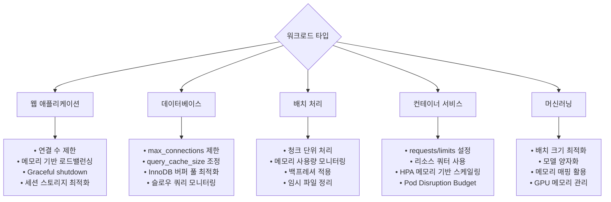
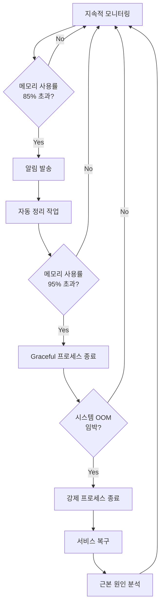
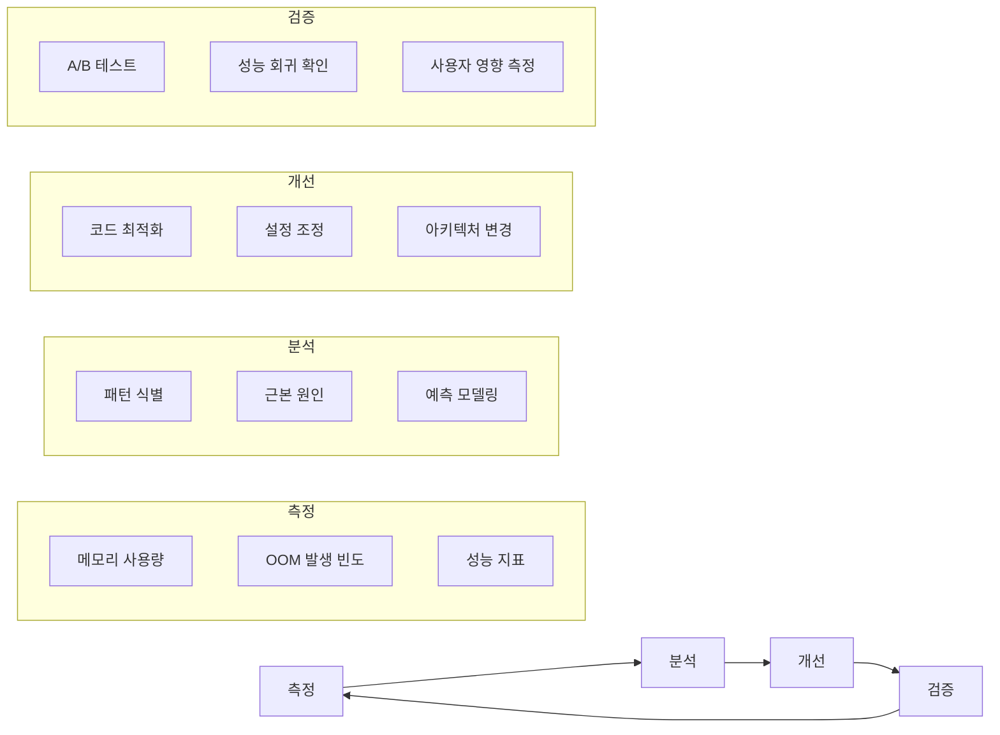

---
tags:
  - OOM
  - OutOfMemory
  - Best Practices
  - Prevention
  - Strategy
  - Production
---

# 3-8E: OOM 방지 모범 사례와 생산 환경 전략

## 들어가며: 예방 중심의 OOM 관리

"OOM이 발생한 후 대응하는 것보다, 발생하지 않도록 예방하는 것이 훨씬 효과적입니다."

OOM은 시스템의 **마지막 방어선**이지만, 예방이 최선의 해결책입니다. 실제 운영 환경에서 검증된 전략과 모범 사례를 통해 안정적인 시스템을 구축해봅시다.

## 포괄적 OOM 방지 전략

### 1. 설계 단계 체크리스트

**메모리 아키텍처 설계**:

- [ ] 애플리케이션별 메모리 사용 패턴 분석 및 문서화
- [ ] 피크 메모리 사용량 예측 및 여유분 확보 (20-30%)
- [ ] 메모리 집약적 작업의 분산 처리 설계
- [ ] 백프레셔(Backpressure) 메커니즘 구현
- [ ] Graceful degradation 전략 수립

**코드 레벨 방지책**:

- [ ] 메모리 누수 방지 코딩 패턴 적용
- [ ] 대용량 데이터 처리 시 스트리밍 방식 사용
- [ ] 적절한 데이터 구조 선택 (메모리 효율성 고려)
- [ ] 객체 풀링 패턴 적용 (필요시)
- [ ] 정기적 메모리 프로파일링 수행

### 2. 배포 및 설정 단계

**시스템 설정 최적화**:

- [ ] 적절한 swap 설정 (vm.swappiness 조정)
- [ ] overcommit 정책 검토 (vm.overcommit_memory)
- [ ] transparent hugepages 설정 최적화
- [ ] 커널 파라미터 튜닝 (vm.min_free_kbytes 등)

**컨테이너 환경 설정**:

- [ ] 적절한 메모리 limits 설정 (실제 사용량의 1.2-1.5배)
- [ ] requests 값 설정으로 리소스 보장
- [ ] OOMKillDisable 설정 신중히 검토
- [ ] 컨테이너별 메모리 모니터링 활성화

### 3. 운영 단계 모니터링

**실시간 모니터링 시스템**:

- [ ] OOM Score 실시간 모니터링 구축
- [ ] 메모리 사용률 임계값 알림 설정 (85%, 95%)
- [ ] 중요 프로세스 보호 설정 (oom_score_adj)
- [ ] Early OOM 시스템 설치 및 설정
- [ ] 로그 기반 OOM 패턴 분석 자동화

## 워크로드별 전문 OOM 대응 전략



### 웹 애플리케이션 OOM 방지 전략

```bash
#!/bin/bash
# web_app_oom_prevention.sh - 웹 애플리케이션 OOM 방지 설정

echo "=== 웹 애플리케이션 OOM 방지 설정 ==="

# Nginx 메모리 최적화
configure_nginx_memory() {
    cat > /etc/nginx/conf.d/memory_optimization.conf << 'EOF'
# 워커 프로세스별 연결 수 제한
worker_connections 1024;

# 클라이언트 요청 크기 제한
client_max_body_size 10m;
client_body_buffer_size 128k;

# 프록시 버퍼 최적화
proxy_buffering on;
proxy_buffer_size 128k;
proxy_buffers 4 256k;
proxy_busy_buffers_size 256k;

# 파일 업로드 임시 경로 설정
client_body_temp_path /tmp/nginx_temp 1 2;
EOF

    echo "Nginx 메모리 최적화 설정 완료"
}

# Apache 메모리 최적화
configure_apache_memory() {
    cat > /etc/apache2/conf-available/memory_optimization.conf << 'EOF'
# MPM Prefork 모드 최적화
<IfModule mpm_prefork_module>
    StartServers 8
    MinSpareServers 5
    MaxSpareServers 20
    ServerLimit 256
    MaxRequestWorkers 256
    MaxConnectionsPerChild 1000
</IfModule>

# 메모리 사용량 제한
RLimitMEM 268435456  # 256MB per process
RLimitVMEM 536870912 # 512MB virtual memory
EOF

    a2enconf memory_optimization
    echo "Apache 메모리 최적화 설정 완료"
}

# PHP-FPM 메모리 최적화
configure_php_fpm_memory() {
    cat > /etc/php/8.1/fpm/pool.d/memory_optimization.conf << 'EOF'
[www]
; 메모리 제한
php_admin_value[memory_limit] = 256M

; 프로세스 관리
pm = dynamic
pm.max_children = 50
pm.start_servers = 10
pm.min_spare_servers = 5
pm.max_spare_servers = 15
pm.max_requests = 1000

; OOM 방지를 위한 추가 설정
php_admin_value[max_execution_time] = 300
php_admin_value[max_input_time] = 300
php_admin_value[post_max_size] = 32M
php_admin_value[upload_max_filesize] = 32M
EOF

    echo "PHP-FPM 메모리 최적화 설정 완료"
}

configure_nginx_memory
configure_apache_memory
configure_php_fpm_memory

echo "웹 서버 메모리 최적화 완료"
```

### 데이터베이스 OOM 방지 전략

```sql
-- MySQL/MariaDB OOM 방지 설정
-- my.cnf 또는 mariadb.conf.d/50-server.cnf에 추가

[mysqld]
# 메모리 관련 핵심 설정
innodb_buffer_pool_size = 70%  # 총 메모리의 70% (전용 DB 서버)
innodb_buffer_pool_instances = 8  # CPU 코어 수에 맞춰 조정

# 연결 관리
max_connections = 200  # 동시 연결 수 제한
max_user_connections = 50  # 사용자별 연결 수 제한

# 쿼리 캐시 (MySQL 5.7까지)
query_cache_type = 1
query_cache_size = 256M
query_cache_limit = 2M

# 임시 테이블 크기 제한
tmp_table_size = 64M
max_heap_table_size = 64M

# 정렬 및 조인 버퍼
sort_buffer_size = 2M
read_buffer_size = 128K
read_rnd_buffer_size = 256K
join_buffer_size = 1M

# 바이너리 로그 설정
binlog_cache_size = 1M
max_binlog_cache_size = 8M

# 스레드 관리
thread_cache_size = 16
thread_stack = 256K
```

### 배치 처리 OOM 방지 전략

```python
#!/usr/bin/env python3
# batch_memory_safe.py - 메모리 안전 배치 처리 패턴

import gc
import sys
import psutil
from typing import Iterator, Any
import logging

class MemorySafeBatchProcessor:
    """메모리 안전 배치 처리기"""
    
    def __init__(self, memory_limit_mb: int = 1024, gc_threshold: float = 0.8):
        self.memory_limit_bytes = memory_limit_mb * 1024 * 1024
        self.gc_threshold = gc_threshold
        self.process = psutil.Process()
        
        # 로깅 설정
        logging.basicConfig(level=logging.INFO)
        self.logger = logging.getLogger(__name__)
    
    def check_memory_usage(self) -> float:
        """현재 메모리 사용률 확인"""
        memory_info = self.process.memory_info()
        usage_ratio = memory_info.rss / self.memory_limit_bytes
        return usage_ratio
    
    def force_garbage_collection(self):
        """강제 가비지 컬렉션 수행"""
        before_mb = self.process.memory_info().rss / 1024 / 1024
        
        # 순환 참조 해제
        gc.collect()
        
        after_mb = self.process.memory_info().rss / 1024 / 1024
        freed_mb = before_mb - after_mb
        
        self.logger.info(f"GC 수행: {freed_mb:.1f}MB 해제 (이전: {before_mb:.1f}MB, 이후: {after_mb:.1f}MB)")
    
    def process_chunk_safely(self, data_chunk: list) -> Any:
        """청크 단위 안전 처리"""
        try:
            # 메모리 사용률 확인
            usage_ratio = self.check_memory_usage()
            
            if usage_ratio > self.gc_threshold:
                self.logger.warning(f"메모리 사용률 높음: {usage_ratio:.1%}")
                self.force_garbage_collection()
                
                # GC 후에도 높으면 청크 크기 줄이기
                if self.check_memory_usage() > self.gc_threshold:
                    raise MemoryError(f"메모리 부족: 청크 크기를 줄여주세요")
            
            # 실제 데이터 처리
            result = self.process_data(data_chunk)
            
            # 처리 후 명시적 메모리 정리
            del data_chunk
            
            return result
            
        except MemoryError as e:
            self.logger.error(f"메모리 오류: {e}")
            self.force_garbage_collection()
            raise
    
    def process_data(self, data_chunk: list) -> Any:
        """실제 데이터 처리 로직 (하위 클래스에서 구현)"""
        # 여기에 실제 비즈니스 로직 구현
        return [item * 2 for item in data_chunk]  # 예시
    
    def process_large_dataset(self, data_iterator: Iterator, chunk_size: int = 1000):
        """대용량 데이터셋 안전 처리"""
        processed_count = 0
        chunk = []
        
        self.logger.info(f"배치 처리 시작 (청크 크기: {chunk_size})")
        
        try:
            for item in data_iterator:
                chunk.append(item)
                
                if len(chunk) >= chunk_size:
                    # 청크 단위 처리
                    self.process_chunk_safely(chunk)
                    processed_count += len(chunk)
                    
                    # 청크 초기화
                    chunk = []
                    
                    # 진행 상황 로깅
                    if processed_count % (chunk_size * 10) == 0:
                        memory_usage = self.check_memory_usage()
                        self.logger.info(f"처리 완료: {processed_count}개, 메모리 사용률: {memory_usage:.1%}")
            
            # 마지막 남은 청크 처리
            if chunk:
                self.process_chunk_safely(chunk)
                processed_count += len(chunk)
            
            self.logger.info(f"배치 처리 완료: 총 {processed_count}개 처리됨")
            
        except Exception as e:
            self.logger.error(f"배치 처리 실패: {e}")
            raise
        finally:
            # 최종 정리
            self.force_garbage_collection()

# 사용 예시
if __name__ == "__main__":
    # 1GB 메모리 제한으로 배치 처리기 생성
    processor = MemorySafeBatchProcessor(memory_limit_mb=1024)
    
    # 대용량 데이터 시뮬레이션
    def large_data_generator():
        for i in range(1000000):  # 100만 개 데이터
            yield f"data_item_{i}"
    
    # 안전한 배치 처리 실행
    processor.process_large_dataset(large_data_generator(), chunk_size=1000)
```

## 생산 환경 실무 권장사항

### 1. 단계별 대응 전략



### 2. 핵심 실무 원칙

**예방 우선 원칙**:

- 🔍 **모니터링 우선**: OOM이 발생하기 전에 감지할 수 있는 시스템 구축
- 📊 **데이터 기반 결정**: 실제 메모리 사용 패턴을 바탕으로 한 설정
- 🔄 **점진적 대응**: 경고 → 정리 → 프로세스 제한 → 종료 순서로 단계적 대응
- 🛠️ **근본 원인 해결**: OOM 발생 후 로그 분석을 통한 근본 원인 찾기

**테스트 및 검증**:

- 🧪 **부하 테스트**: 메모리 사용 패턴 사전 파악 및 임계값 설정
- 🔄 **카나리 배포**: 새로운 설정의 점진적 적용 및 검증
- 📈 **성능 회귀 테스트**: 메모리 관련 변경사항의 영향도 측정

### 3. 운영 환경별 체크리스트

**개발 환경**:

- [ ] 메모리 프로파일링 도구 설정 (Valgrind, AddressSanitizer)
- [ ] 메모리 누수 테스트 자동화
- [ ] 코드 리뷰 시 메모리 사용 패턴 검토
- [ ] 단위 테스트에 메모리 사용량 검증 포함

**스테이징 환경**:

- [ ] 프로덕션과 동일한 메모리 제한 설정
- [ ] 부하 테스트를 통한 메모리 사용 패턴 검증
- [ ] OOM 시나리오 테스트 수행
- [ ] 모니터링 시스템 정확성 검증

**프로덕션 환경**:

- [ ] 24/7 메모리 모니터링 및 알림 시스템
- [ ] 중요 서비스 OOM 보호 설정
- [ ] 자동 복구 메커니즘 구현
- [ ] 정기적 메모리 사용 패턴 분석 및 최적화

### 4. 장기적 메모리 관리 전략

**용량 계획 (Capacity Planning)**:

```python
#!/usr/bin/env python3
# capacity_planning.py - 메모리 용량 계획 도구

import numpy as np
import matplotlib.pyplot as plt
from datetime import datetime, timedelta
from typing import List, Tuple

class MemoryCapacityPlanner:
    """메모리 용량 계획 도구"""
    
    def __init__(self):
        self.historical_data = []  # (timestamp, memory_usage_percent)
    
    def add_historical_data(self, data: List[Tuple[datetime, float]]):
        """과거 메모리 사용 데이터 추가"""
        self.historical_data.extend(data)
    
    def predict_memory_growth(self, days_ahead: int = 30) -> dict:
        """메모리 사용량 증가 예측"""
        if len(self.historical_data) < 7:  # 최소 1주일 데이터 필요
            raise ValueError("예측을 위해 최소 1주일간의 데이터가 필요합니다")
        
        # 시계열 데이터 준비
        timestamps = [item[0] for item in self.historical_data]
        usage_values = [item[1] for item in self.historical_data]
        
        # 선형 회귀를 통한 트렌드 분석
        x = np.arange(len(usage_values))
        z = np.polyfit(x, usage_values, 1)  # 1차 다항식 (선형)
        p = np.poly1d(z)
        
        # 미래 예측
        future_x = np.arange(len(usage_values), len(usage_values) + days_ahead)
        future_usage = p(future_x)
        
        # 예측 결과
        current_avg = np.mean(usage_values[-7:])  # 최근 1주일 평균
        predicted_avg = np.mean(future_usage)
        growth_rate = (predicted_avg - current_avg) / current_avg * 100
        
        return {
            'current_avg_usage': current_avg,
            'predicted_avg_usage': predicted_avg,
            'growth_rate_percent': growth_rate,
            'predicted_max': np.max(future_usage),
            'days_to_80_percent': self._days_to_threshold(p, len(usage_values), 80),
            'days_to_90_percent': self._days_to_threshold(p, len(usage_values), 90),
            'recommendation': self._generate_recommendation(predicted_avg, growth_rate)
        }
    
    def _days_to_threshold(self, poly_func, current_day: int, threshold: float) -> int:
        """임계값 도달까지 예상 일수 계산"""
        for day in range(current_day, current_day + 365):  # 1년 내 예측
            if poly_func(day) >= threshold:
                return day - current_day
        return -1  # 1년 내 도달하지 않음
    
    def _generate_recommendation(self, predicted_usage: float, growth_rate: float) -> str:
        """용량 계획 권장사항 생성"""
        if predicted_usage > 85:
            return "즉시 메모리 증설 또는 애플리케이션 최적화 필요"
        elif predicted_usage > 75:
            return "1-2개월 내 메모리 증설 계획 수립 권장"
        elif growth_rate > 10:
            return "메모리 사용량 증가 추세 모니터링 강화 필요"
        else:
            return "현재 메모리 용량으로 안정적 운영 가능"
    
    def generate_capacity_report(self) -> str:
        """용량 계획 보고서 생성"""
        prediction = self.predict_memory_growth()
        
        report = f"""
=== 메모리 용량 계획 보고서 ===
생성일시: {datetime.now().strftime('%Y-%m-%d %H:%M:%S')}

현재 메모리 사용률:
- 최근 1주일 평균: {prediction['current_avg_usage']:.1f}%

30일 후 예측:
- 예상 평균 사용률: {prediction['predicted_avg_usage']:.1f}%
- 예상 최대 사용률: {prediction['predicted_max']:.1f}%
- 증가율: {prediction['growth_rate_percent']:.1f}%

임계값 도달 예상:
- 80% 도달: {prediction['days_to_80_percent']}일 후
- 90% 도달: {prediction['days_to_90_percent']}일 후

권장사항:
{prediction['recommendation']}

=== 액션 아이템 ===
1. 메모리 사용량 트렌드 지속 모니터링
2. 애플리케이션별 메모리 사용 패턴 분석
3. 필요시 메모리 최적화 또는 하드웨어 증설 계획 수립
"""
        return report

# 사용 예시
if __name__ == "__main__":
    planner = MemoryCapacityPlanner()
    
    # 시뮬레이션 데이터 생성 (실제로는 모니터링 시스템에서 수집)
    base_date = datetime.now() - timedelta(days=30)
    sample_data = []
    
    for i in range(30):
        # 점진적으로 증가하는 메모리 사용률 시뮬레이션
        usage = 45 + (i * 0.5) + np.random.normal(0, 3)  # 기본 45% + 증가 트렌드 + 노이즈
        sample_data.append((base_date + timedelta(days=i), max(0, min(100, usage)))
    
    planner.add_historical_data(sample_data)
    print(planner.generate_capacity_report())
```

## 마무리: 지속 가능한 OOM 관리

OOM 방지는 단순한 기술적 설정을 넘어서 **조직의 문화와 프로세스**가 되어야 합니다:

### 조직 차원의 접근

1. **개발팀**: 메모리 효율적인 코드 작성 및 테스트
2. **운영팀**: 실시간 모니터링 및 용량 계획
3. **아키텍처팀**: 확장 가능한 메모리 관리 설계
4. **경영진**: 충분한 리소스 투자 및 지원

### 지속적 개선 사이클



예방 중심의 OOM 관리로 안정적이고 확장 가능한 시스템을 구축해봅시다! 🛡️

**핵심은 "OOM이 발생하지 않도록 하는 것"이 아니라, "OOM이 발생해도 시스템이 안정적으로 복구되도록 하는 것"입니다.**

## 핵심 요점

### 1. 예방 중심 접근

생산 환경에서는 OOM 발생 후 대응보다 사전 예방이 훨씬 효과적입니다.

### 2. 다층적 방어 전략

설계 단계부터 운영 단계까지 각 층별로 적절한 방어 메커니즘을 구축해야 합니다.

### 3. 지속적 개선

메모리 관리는 일회성 설정이 아닌 지속적인 모니터링과 개선이 필요한 영역입니다.

---

**이전**: [08d-early-oom-prevention.md](08d-early-oom-prevention.md)  
**개요**: [08-oom-debugging.md](08-oom-debugging.md)로 돌아가서 전체 OOM 디버깅 여정을 검토해보세요.
