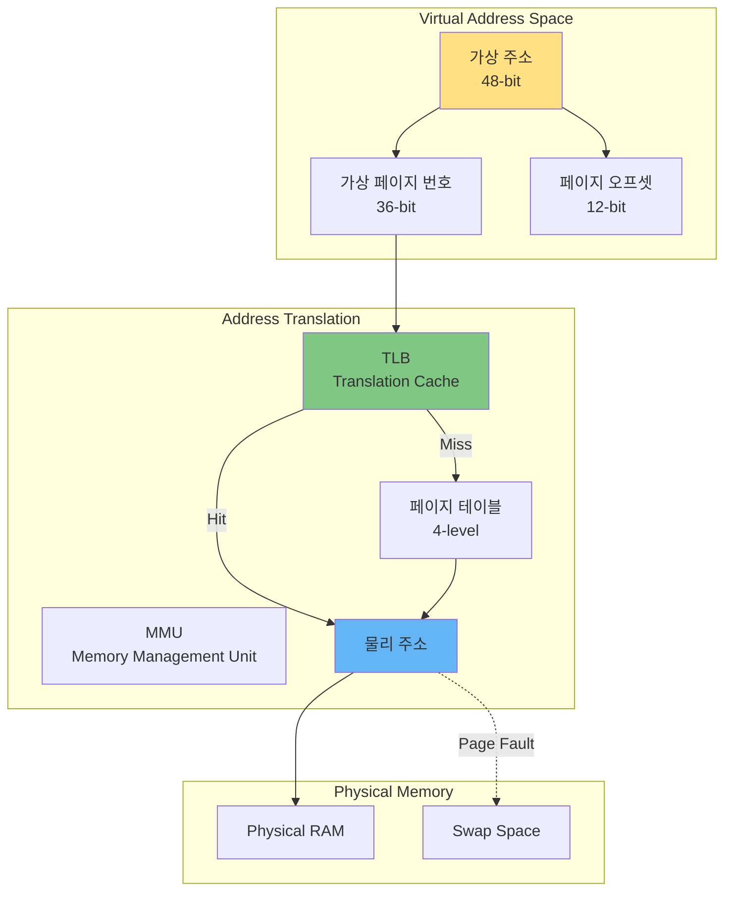
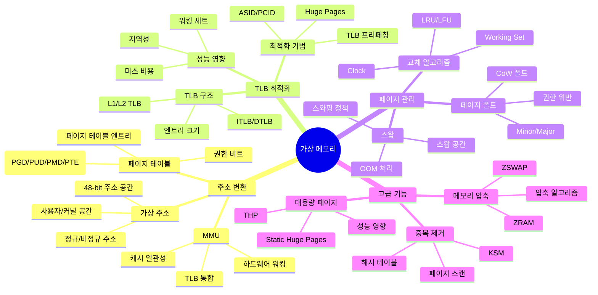
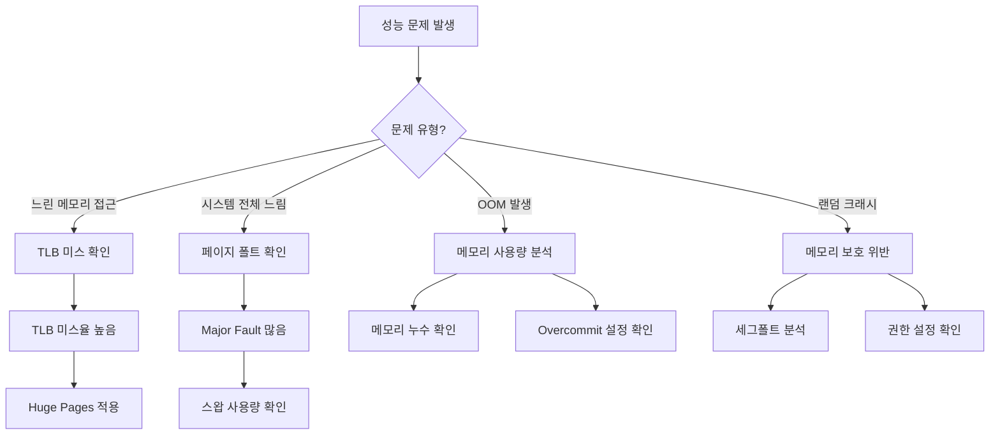

---
tags:
  - VirtualMemory
  - PageTable
  - TLB
  - Guide
  - Memory
  - SystemProgramming
---

# Chapter 3: 가상 메모리 - 물리적 한계를 넘어서

## 이 장에서 다루는 내용

4GB RAM에서 100개의 프로세스가 각각 2GB를 사용할 수 있는 비밀은 무엇일까요?

모든 프로세스가 같은 주소 0x400000을 사용하는데도 충돌하지 않는 이유는? 메모리가 부족한데도 프로그램이 계속 실행되는 마법은?

이 장에서는 현대 컴퓨터의 가장 중요한 추상화 중 하나인 가상 메모리 시스템을 깊이 있게 탐구합니다. 물리 메모리의 한계를 극복하고, 프로세스 간 격리를 보장하며, 효율적인 메모리 활용을 가능하게 하는 가상 메모리의 모든 것을 파헤쳐보겠습니다.

## 왜 이것을 알아야 하는가?

### 실무에서 마주치는 가상 메모리 문제들

다음과 같은 상황을 경험해보셨나요?

- 🔄 **Page Fault Storm**: 갑자기 시스템이 느려지는 스래싱
- 🐢 **TLB Miss**: 같은 연산인데 100배 느린 메모리 접근
- 💾 **OOM Killer**: 메모리가 충분한데도 프로세스가 죽는 상황
- 🚀 **Huge Pages**: 데이터베이스 성능을 10배 향상시키는 비법
- 🔒 **Memory Protection**: 세그폴트가 발생하는 진짜 이유

이런 문제들의 근본 원인은 가상 메모리 시스템에 대한 이해 부족입니다. 이 장을 마스터하면 메모리 관련 성능 문제를 진단하고 최적화할 수 있습니다.

## 가상 메모리 아키텍처 한눈에 보기



## 이 장의 구성

### [3-1: 주소 변환 메커니즘](01-address-translation.md)

**"가상에서 실제로 - 주소 변환의 마법"**

- 🗺️ **가상 주소 공간**: 48비트 주소 체계와 정규 주소
- 🔄 **페이지 테이블 구조**: 4단계 페이지 테이블 워킹
- 🎯 **MMU 동작 원리**: 하드웨어 주소 변환 과정
- 💡 **실전 예제**: /proc/pid/pagemap으로 주소 변환 추적

### [3-2: TLB와 캐싱](02-tlb-caching.md)

**"주소 변환의 속도를 높이는 비밀"**

- ⚡ **TLB 구조**: Translation Lookaside Buffer의 내부
- 📊 **TLB 미스 비용**: 성능에 미치는 영향 분석
- 🔧 **TLB 최적화**: Huge Pages와 TLB 효율성
- 🎮 **ASID와 PCID**: 컨텍스트 스위칭 최적화

### [3-3: 페이지 폴트와 메모리 관리](03-page-fault.md)

**"메모리가 없을 때 일어나는 일"**

- 💥 **페이지 폴트 종류**: Minor vs Major Page Fault
- 🔄 **Demand Paging**: 필요할 때만 메모리 할당
- 💾 **스왑 메커니즘**: 메모리 부족 시 디스크 활용
- 📈 **페이지 교체 알고리즘**: LRU, Clock, LIRS

### [3-4: 메모리 압축과 중복 제거](04-compression-deduplication.md)

**"더 많은 메모리를 만들어내는 기술"**

- 🗜️ **ZRAM/ZSWAP**: 메모리 압축 기술
- 🔗 **KSM**: 동일 페이지 병합 (Kernel Same-page Merging)
- 📦 **Transparent Huge Pages**: 자동 대용량 페이지
- ⚡ **Memory Ballooning**: 가상화 환경의 메모리 최적화

## 실습 환경 준비

이 장의 예제들을 직접 실행해보려면 다음 도구들이 필요합니다:

```bash
# Linux 가상 메모리 분석 도구
$ cat /proc/meminfo          # 시스템 메모리 정보
$ cat /proc/pid/maps         # 프로세스 메모리 맵
$ cat /proc/pid/smaps        # 상세 메모리 사용량
$ cat /proc/pid/pagemap      # 페이지 테이블 정보

# 성능 분석 도구
$ perf stat -e dTLB-misses  # TLB 미스 측정
$ vmstat 1                   # 페이지 폴트 모니터링
$ sar -B 1                   # 페이징 통계

# 메모리 설정
$ sysctl vm.swappiness      # 스왑 성향 조정
$ echo madvise > /sys/kernel/mm/transparent_hugepage/enabled
```

## 이 장을 읽고 나면

✅ **가상 메모리 이해**: 주소 변환 과정을 완벽히 이해  
✅ **성능 최적화**: TLB 미스와 페이지 폴트 최소화  
✅ **메모리 효율성**: Huge Pages, KSM 등 고급 기법 활용  
✅ **문제 해결**: 스래싱, OOM 등 메모리 문제 진단  
✅ **시스템 튜닝**: 워크로드에 맞는 메모리 설정 최적화  

## 핵심 개념 미리보기



## 가상 메모리 문제 진단 플로우차트



## 관련 문서

### 선행 지식

- [Chapter 2: Memory Management](../chapter-02-memory/index.md) - 메모리 관리 기초
- [Process Memory Structure](../chapter-02-memory/01-process-memory.md) - 프로세스 메모리 구조
- [Stack and Heap](../chapter-02-memory/02-stack-heap.md) - 스택과 힙 메모리

### 관련 주제

- [Chapter 4: Process & Thread](../chapter-04-process-thread/index.md) - 프로세스 관리
- [Memory Optimization](../chapter-10-performance-optimization.md) - 메모리 성능 최적화
- [Container Isolation](../chapter-11-container-isolation.md) - 메모리 격리 기술

## 다음 단계

이제 [3-1: 주소 변환 메커니즘](01-address-translation.md)부터 시작하여, 가상 메모리의 핵심인 주소 변환 과정을 깊이 있게 탐구해봅시다.

가상 메모리는 단순한 메모리 관리 기법이 아닙니다. 현대 컴퓨터 시스템의 보안, 성능, 효율성을 결정하는 핵심 기술입니다. 이 여정을 통해 시스템의 깊은 곳에서 일어나는 마법을 이해하게 될 겁니다.
