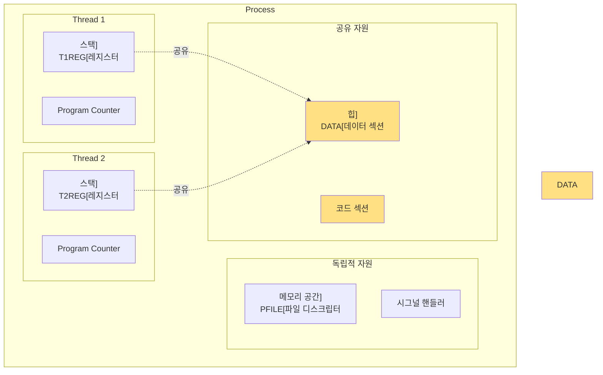
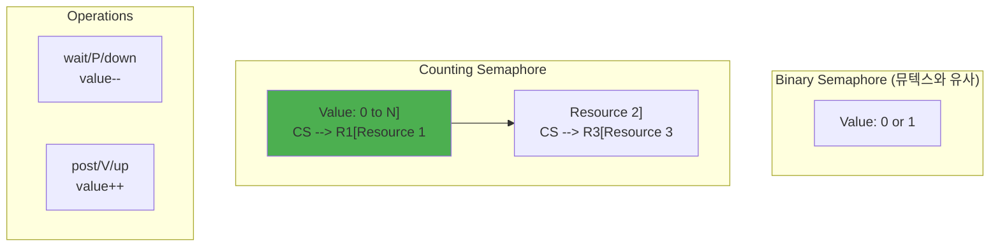
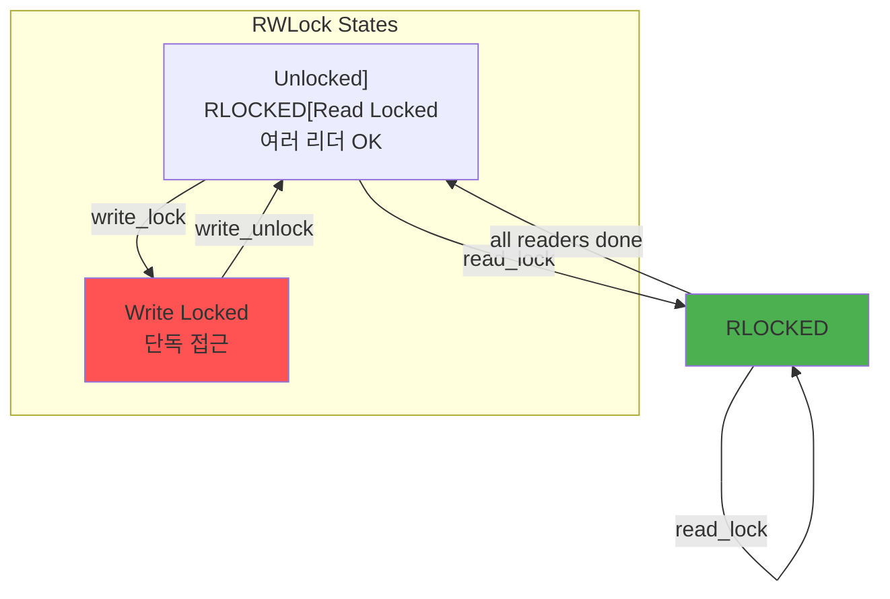

---
tags:
  - Thread
  - Synchronization
  - Concurrency
  - Computer Science
---

# Chapter 4-2: 스레드와 동기화는 어떻게 동작하는가

## 이 문서를 읽으면 답할 수 있는 질문들

- 스레드가 프로세스보다 가벼운 진짜 이유는 무엇인가?
- 뮤텍스와 세마포어의 근본적인 차이는 무엇인가?
- 데드락은 왜 발생하고 어떻게 방지하는가?
- lock-free 알고리즘은 어떻게 동작하는가?
- 스레드 로컬 스토리지는 어떻게 구현되는가?

## 들어가며: 동시성의 양날의 검

### 🎭 실리콘밸리 스타트업의 악몽

2019년, 한 스타트업이 하루 만에 500만 달러를 날려먹었습니다.

금융 거래 시스템에서 발생한 레이스 컨디션(Race Condition) 때문이었죠. 두 스레드가 같은 계좌 잔액을 동시에 읽고, 각자 출금을 진행한 결과, 잔액이 마이너스가 되어도 출금이 계속되었습니다. 😱

```python
# 문제의 코드 (Python으로 표현)
def withdraw(account, amount):
    balance = account.get_balance()  # Thread 1: 1000원 읽음
                                     # Thread 2: 1000원 읽음 (동시에!)
    if balance >= amount:
        # Thread 1: 800원 출금 가능 판단
        # Thread 2: 700원 출금 가능 판단
        account.set_balance(balance - amount)
        # Thread 1: 잔액을 200원으로 설정
        # Thread 2: 잔액을 300원으로 설정 (덮어씀!)
        return True
    return False
```

이게 바로 동시성 프로그래밍의 무서운 점입니다. 99.99%는 정상 작동하다가, 0.01%의 타이밍에 모든 것이 무너질 수 있죠.

### 왜 그럼에도 스레드를 쓸까?

제가 게임 엔진을 개발할 때의 일입니다. 물리 엔진, 렌더링, AI, 네트워킹을 모두 하나의 스레드에서 처리하니 FPS가 15를 넘지 못했습니다. 하지만 멀티스레딩을 도입하자:

- **물리 엔진**: 별도 스레드에서 60Hz로 시뮬레이션
- **렌더링**: 메인 스레드에서 GPU와 통신
- **AI**: 워커 스레드 풀에서 병렬 처리
- **네트워킹**: I/O 스레드에서 비동기 처리

결과? **FPS가 15에서 120으로 증가!** 🚀

하지만 대가가 있었습니다. 디버깅 지옥이 시작된 거죠. 물리 객체가 간헐적으로 벽을 통과하고, 캐릭터가 가끔 하늘로 날아가고, 세이브 파일이 깨지고...

이번 섹션에서는 이런 문제들을 어떻게 해결하는지, 스레드의 탄생부터 복잡한 동기화 메커니즘까지 실전 경험과 함께 파헤쳐보겠습니다.

## 1. 스레드의 본질

### 1.1 프로세스 vs 스레드: 아파트 vs 룸메이트

프로세스와 스레드의 관계를 설명할 때 저는 이런 비유를 씁니다:

**프로세스 = 독립된 아파트**

- 각자의 주방(힙), 거실(데이터), 침실(스택)이 있음
- 이웃집 일에 영향받지 않음 (메모리 보호)
- 이사(context switch) 비용이 큼

**스레드 = 룸메이트**

- 주방과 거실은 공유, 침실(스택)만 각자 소유
- 한 명이 주방을 어지르면 모두가 피해 (공유 메모리 문제)
- 방 옮기기(context switch)는 쉬움

실제로 성능을 측정해보면:

```c
// 프로세스 생성 vs 스레드 생성 벤치마크
#include <time.h>
#include <sys/wait.h>

void benchmark_process_creation() {
    struct timespec start, end;
    clock_gettime(CLOCK_MONOTONIC, &start);
    
    for (int i = 0; i < 1000; i++) {
        pid_t pid = fork();
        if (pid == 0) {
            exit(0);  // 자식 즉시 종료
        } else {
            waitpid(pid, NULL, 0);
        }
    }
    
    clock_gettime(CLOCK_MONOTONIC, &end);
    long ns = (end.tv_sec - start.tv_sec) * 1000000000 + 
              (end.tv_nsec - start.tv_nsec);
    printf("프로세스 생성: %ld ns/개\n", ns / 1000);
    // 결과: ~500,000 ns/개
}

void benchmark_thread_creation() {
    struct timespec start, end;
    clock_gettime(CLOCK_MONOTONIC, &start);
    
    for (int i = 0; i < 1000; i++) {
        pthread_t thread;
        pthread_create(&thread, NULL, empty_func, NULL);
        pthread_join(thread, NULL);
    }
    
    clock_gettime(CLOCK_MONOTONIC, &end);
    long ns = (end.tv_sec - start.tv_sec) * 1000000000 + 
              (end.tv_nsec - start.tv_nsec);
    printf("스레드 생성: %ld ns/개\n", ns / 1000);
    // 결과: ~25,000 ns/개
}
```

**스레드가 프로세스보다 20배 빠릅니다!** 💨



### 1.2 스레드 구현 (Linux): 커널의 비밀

리눅스 커널 개발자들의 천재적인 발상: **"스레드? 그냥 메모리 공유하는 프로세스 아니야?"**

실제로 리눅스에서는 프로세스와 스레드를 구분하지 않습니다. 모두 `task_struct`로 표현되죠. 차이는 단지 무엇을 공유하느냐뿐!

```c
// 커널 레벨 스레드 구조체
struct task_struct {
    // 프로세스/스레드 공통
    pid_t pid;
    pid_t tgid;  // Thread Group ID (프로세스 ID)
    
    // 스레드별 고유
    struct thread_struct thread;  // CPU 상태
    void *stack;                   // 스택 포인터
    
    // 공유 자원 (같은 스레드 그룹)
    struct mm_struct *mm;          // 메모리 디스크립터
    struct files_struct *files;    // 파일 디스크립터
    struct signal_struct *signal;  // 시그널
    
    // 스케줄링
    int prio;
    struct sched_entity se;
    
    // TLS (Thread Local Storage)
    void *tls;
};

// clone() 시스템 콜로 스레드 생성
int create_thread(void (*fn)(void*), void *arg) {
    // 스택 할당
    void *stack = mmap(NULL, STACK_SIZE,
                      PROT_READ | PROT_WRITE,
                      MAP_PRIVATE | MAP_ANONYMOUS | MAP_STACK,
                      -1, 0);
    
    // clone 플래그 설정 (스레드용)
    int flags = CLONE_VM |      // 메모리 공유
                CLONE_FILES |    // 파일 디스크립터 공유
                CLONE_FS |       // 파일시스템 정보 공유
                CLONE_SIGHAND |  // 시그널 핸들러 공유
                CLONE_THREAD |   // 같은 스레드 그룹
                CLONE_SYSVSEM |  // System V 세마포어 공유
                CLONE_PARENT_SETTID |
                CLONE_CHILD_CLEARTID;
    
    // 스레드 생성
    pid_t tid = clone(fn, stack + STACK_SIZE, flags, arg);
    
    return tid;
}
```

### 1.3 pthread 라이브러리: POSIX의 선물

pthread는 "POSIX Thread"의 약자입니다. 유닉스 계열 시스템에서 스레드를 다루는 표준이죠.

제가 처음 pthread를 배울 때 가장 헷갈렸던 것: **"왜 void* 포인터를 쓰는 거지?"**

답은 간단합니다. C언어에는 제네릭이 없으니까요! void*는 "뭐든 될 수 있는" 포인터입니다.

```c
#include <pthread.h>
#include <stdio.h>
#include <unistd.h>

// 스레드 데이터
typedef struct {
    int thread_id;
    char message[256];
    int result;
} thread_data_t;

// 스레드 함수
void* thread_function(void *arg) {
    thread_data_t *data = (thread_data_t*)arg;
    
    printf("Thread %d started: %s\n", 
           data->thread_id, data->message);
    
    // 작업 수행
    for (int i = 0; i < 5; i++) {
        printf("Thread %d working... %d\n", 
               data->thread_id, i);
        sleep(1);
    }
    
    // 결과 설정
    data->result = data->thread_id * 100;
    
    // 반환값
    return (void*)(intptr_t)data->result;
}

// pthread 사용 예제
void demonstrate_pthreads() {
    const int NUM_THREADS = 4;
    pthread_t threads[NUM_THREADS];
    thread_data_t thread_data[NUM_THREADS];
    
    // 스레드 생성
    for (int i = 0; i < NUM_THREADS; i++) {
        thread_data[i].thread_id = i;
        sprintf(thread_data[i].message, "Hello from thread %d", i);
        
        int ret = pthread_create(&threads[i], NULL,
                                thread_function, &thread_data[i]);
        if (ret != 0) {
            perror("pthread_create");
            exit(1);
        }
    }
    
    // 스레드 종료 대기
    for (int i = 0; i < NUM_THREADS; i++) {
        void *retval;
        pthread_join(threads[i], &retval);
        
        printf("Thread %d finished with result: %d\n",
               i, (int)(intptr_t)retval);
    }
}

// 스레드 속성 설정
void configure_thread_attributes() {
    pthread_t thread;
    pthread_attr_t attr;
    
    // 속성 초기화
    pthread_attr_init(&attr);
    
    // 분리 상태 설정
    pthread_attr_setdetachstate(&attr, PTHREAD_CREATE_DETACHED);
    
    // 스택 크기 설정
    size_t stack_size = 2 * 1024 * 1024;  // 2MB
    pthread_attr_setstacksize(&attr, stack_size);
    
    // 스케줄링 정책
    pthread_attr_setschedpolicy(&attr, SCHED_FIFO);
    
    // 우선순위
    struct sched_param param;
    param.sched_priority = 10;
    pthread_attr_setschedparam(&attr, &param);
    
    // 스레드 생성
    pthread_create(&thread, &attr, thread_function, NULL);
    
    // 속성 정리
    pthread_attr_destroy(&attr);
}
```

## 2. 뮤텍스 (Mutex)

### 🔒 화장실 잠금 장치의 교훈

뮤텍스를 가장 잘 설명하는 비유는 화장실 문의 잠금 장치입니다.

비행기 화장실을 생각해보세요:

1. 누군가 들어가면 "Occupied" 표시가 켜짐 (lock)
2. 다른 사람들은 밖에서 대기 (blocked)
3. 사용자가 나오면 "Vacant" 표시 (unlock)
4. 대기자 중 한 명만 들어감 (mutual exclusion)

실제 프로덕션에서 겪은 일입니다. 채팅 서버에서 메시지 순서가 뒤바뀌는 버그가 있었는데:

```c
// 버그가 있던 코드
void send_message(chat_room_t *room, message_t *msg) {
    // 뮤텍스 없이 그냥 추가
    room->messages[room->count++] = msg;  // 💥 Race Condition!
    
    // Thread A: count를 10으로 읽음
    // Thread B: count를 10으로 읽음 (동시에!)
    // Thread A: messages[10]에 "안녕" 저장, count를 11로
    // Thread B: messages[10]에 "하세요" 저장 (덮어씀!), count를 11로
    // 결과: "안녕"이 사라짐!
}

// 수정된 코드
void send_message_safe(chat_room_t *room, message_t *msg) {
    pthread_mutex_lock(&room->mutex);  // 화장실 문 잠그기
    room->messages[room->count++] = msg;
    pthread_mutex_unlock(&room->mutex);  // 문 열기
}
```

### 2.1 뮤텍스 원리: 하드웨어의 도움

```mermaid
sequenceDiagram
    participant T1 as "Thread 1
"    participant M as "Mutex
"    participant T2 as "Thread 2
"    
    T1->>M: lock()
    M-->>T1: 획득 성공
    Note over T1: Critical Section
    
    T2->>M: lock()
    Note over T2: 대기 (blocked)
    
    T1->>M: unlock()
    M-->>T2: 획득 성공
    Note over T2: Critical Section
    
    T2->>M: unlock()
```

### 2.2 뮤텍스 구현: Futex의 마법

**Futex = Fast Userspace Mutex**

제가 커널 소스를 처음 읽었을 때 충격받은 사실: 뮤텍스는 평소엔 유저 공간에서만 동작합니다! 커널을 부르는 건 정말 필요할 때뿐입니다.

이게 왜 중요할까요? 시스템 콜이 비싸기 때문입니다!

```c
// 시스템 콜 비용 측정
void measure_syscall_cost() {
    struct timespec start, end;
    
    // 일반 함수 호출
    clock_gettime(CLOCK_MONOTONIC, &start);
    for (int i = 0; i < 1000000; i++) {
        normal_function();
    }
    clock_gettime(CLOCK_MONOTONIC, &end);
    printf("일반 함수: %ld ns\n", calculate_ns(start, end) / 1000000);
    // 결과: ~2ns
    
    // 시스템 콜
    clock_gettime(CLOCK_MONOTONIC, &start);
    for (int i = 0; i < 1000000; i++) {
        getpid();  // 가장 간단한 시스템 콜
    }
    clock_gettime(CLOCK_MONOTONIC, &end);
    printf("시스템 콜: %ld ns\n", calculate_ns(start, end) / 1000000);
    // 결과: ~50ns (25배 느림!)
}
```

Futex는 이렇게 동작합니다:

1. **Fast Path**: 경쟁이 없으면 원자적 연산만으로 처리 (유저 공간)
2. **Slow Path**: 경쟁이 있으면 커널에 가서 잠들기

```c
// 뮤텍스 내부 구조 (priority inheritance 포함)
typedef struct {
    atomic_int locked;      // 0: unlocked, 1: locked, 2: locked with waiters
    pid_t owner;           // 소유자 TID
    int recursion_count;   // 재귀 카운트
    int original_priority; // 원래 우선순위 (PI용)
    
    // futex (Fast Userspace Mutex)
    atomic_int futex_word;
    
    // 대기 큐 (우선순위 정렬)
    struct wait_queue {
        pid_t tid;
        int priority;
        struct wait_queue *next;
    } *waiters;
    
    // Priority Inheritance 지원
    int pi_enabled;
} mutex_internal_t;

// 뮤텍스 잠금 (스핀락 버전)
void mutex_lock_spin(mutex_internal_t *mutex) {
    while (1) {
        // CAS (Compare-And-Swap)
        int expected = 0;
        if (atomic_compare_exchange_strong(&mutex->locked, 
                                          &expected, 1)) {
            // 성공: 뮤텍스 획득
            mutex->owner = gettid();
            break;
        }
        
        // 실패: 스핀 (바쁜 대기)
        while (atomic_load(&mutex->locked) == 1) {
            pause();  // CPU 힌트
        }
    }
}

// 뮤텍스 잠금 (futex 버전, priority inheritance 포함)
void mutex_lock_futex(mutex_internal_t *mutex) {
    pid_t my_tid = gettid();
    int my_priority = getpriority(PRIO_PROCESS, 0);
    
    // Fast path: 경쟁 없음
    int expected = 0;
    if (atomic_compare_exchange_strong(&mutex->futex_word, &expected, 1)) {
        mutex->owner = my_tid;
        mutex->original_priority = my_priority;
        return;
    }
    
    // Slow path: 경쟁 있음
    if (mutex->pi_enabled && mutex->owner != 0) {
        // Priority Inheritance: 소유자 우선순위 상승
        int owner_priority = getpriority(PRIO_PROCESS, mutex->owner);
        if (my_priority < owner_priority) {  // 높은 우선순위 (작은 숫자)
            setpriority(PRIO_PROCESS, mutex->owner, my_priority);
        }
    }
    
    // 대기자 표시
    int c = atomic_exchange(&mutex->futex_word, 2);
    
    while (c != 0) {
        // 커널에서 대기
        syscall(SYS_futex, &mutex->futex_word,
                FUTEX_WAIT_PRIVATE, 2, NULL, NULL, 0);
        
        c = atomic_exchange(&mutex->futex_word, 2);
    }
    
    mutex->owner = my_tid;
    mutex->original_priority = my_priority;
}

// 뮤텍스 해제 (priority inheritance 복구 포함)
void mutex_unlock_futex(mutex_internal_t *mutex) {
    pid_t my_tid = gettid();
    
    // 소유자 확인
    if (mutex->owner != my_tid) {
        errno = EPERM;
        return;
    }
    
    // Priority Inheritance 복구
    if (mutex->pi_enabled && mutex->original_priority != getpriority(PRIO_PROCESS, 0)) {
        setpriority(PRIO_PROCESS, my_tid, mutex->original_priority);
    }
    
    mutex->owner = 0;
    
    // Fast path: 대기자 없음
    if (atomic_fetch_sub(&mutex->futex_word, 1) != 1) {
        // Slow path: 대기자 있음
        atomic_store(&mutex->futex_word, 0);
        
        // 가장 높은 우선순위 대기자 깨우기
        syscall(SYS_futex, &mutex->futex_word,
                FUTEX_WAKE_PRIVATE, 1, NULL, NULL, 0);
    }
}
```

### 2.3 뮤텍스 사용 예제: 데드락 지옥에서 살아남기

#### 😵 내가 만든 첫 데드락

신입 때 멀티스레드 프로그램을 짜다가 서버가 멈췄습니다. CPU는 0%, 메모리도 정상, 그런데 아무 응답이 없었죠.

선배가 한마디 하더군요: **"데드락이네. 순서를 바꿔봐."**

```c
#include <pthread.h>

// 공유 자원
int shared_counter = 0;
pthread_mutex_t counter_mutex = PTHREAD_MUTEX_INITIALIZER;

// 안전한 카운터 증가
void* safe_increment(void *arg) {
    for (int i = 0; i < 1000000; i++) {
        pthread_mutex_lock(&counter_mutex);
        shared_counter++;  // Critical Section
        pthread_mutex_unlock(&counter_mutex);
    }
    return NULL;
}

// 데드락 예제
pthread_mutex_t mutex1 = PTHREAD_MUTEX_INITIALIZER;
pthread_mutex_t mutex2 = PTHREAD_MUTEX_INITIALIZER;

void* thread1_deadlock(void *arg) {
    pthread_mutex_lock(&mutex1);
    sleep(1);  // 타이밍 문제 유발
    pthread_mutex_lock(&mutex2);  // 데드락!
    
    // 작업...
    
    pthread_mutex_unlock(&mutex2);
    pthread_mutex_unlock(&mutex1);
    return NULL;
}

void* thread2_deadlock(void *arg) {
    pthread_mutex_lock(&mutex2);
    sleep(1);
    pthread_mutex_lock(&mutex1);  // 데드락!
    
    // 작업...
    
    pthread_mutex_unlock(&mutex1);
    pthread_mutex_unlock(&mutex2);
    return NULL;
}

// 데드락 방지: 순서 지정
void* thread_safe_order(void *arg) {
    // 항상 같은 순서로 잠금
    pthread_mutex_lock(&mutex1);
    pthread_mutex_lock(&mutex2);
    
    // 작업...
    
    pthread_mutex_unlock(&mutex2);
    pthread_mutex_unlock(&mutex1);
    return NULL;
}

// 재귀 뮤텍스
void demonstrate_recursive_mutex() {
    pthread_mutexattr_t attr;
    pthread_mutex_t recursive_mutex;
    
    pthread_mutexattr_init(&attr);
    pthread_mutexattr_settype(&attr, PTHREAD_MUTEX_RECURSIVE);
    pthread_mutex_init(&recursive_mutex, &attr);
    
    // 같은 스레드에서 여러 번 잠금 가능
    pthread_mutex_lock(&recursive_mutex);
    pthread_mutex_lock(&recursive_mutex);  // OK
    
    // 잠금 횟수만큼 해제
    pthread_mutex_unlock(&recursive_mutex);
    pthread_mutex_unlock(&recursive_mutex);
    
    pthread_mutexattr_destroy(&attr);
}
```

## 3. 세마포어 (Semaphore)

### 🎬 영화관 좌석 예약 시스템

세마포어를 이해하는 가장 좋은 방법은 영화관을 떠올리는 것입니다.

**뮤텍스 = 화장실 (1명만)**
**세마포어 = 영화관 (N명까지)**

실제로 제가 영화 예매 시스템을 만들 때 세마포어를 이렇게 활용했습니다:

```c
// 영화관 시스템
typedef struct {
    sem_t available_seats;  // 100석으로 초기화
    sem_t ticket_printer;   // 1대만 (바이너리 세마포어)
} cinema_t;

void book_ticket(cinema_t *cinema) {
    sem_wait(&cinema->available_seats);  // 좌석 하나 예약
    
    // 티켓 출력 (프린터는 1대뿐)
    sem_wait(&cinema->ticket_printer);
    print_ticket();
    sem_post(&cinema->ticket_printer);
    
    // 만약 취소하면
    // sem_post(&cinema->available_seats);  // 좌석 반납
}
```

### 3.1 세마포어 원리: 다익스트라의 선물

세마포어는 다익스트라(Dijkstra)가 1965년에 발명했습니다. P와 V라는 이상한 이름은 네덜란드어에서 왔죠:

- **P (Proberen)**: "시도하다" - wait/down
- **V (Verhogen)**: "증가시키다" - post/up

다익스트라는 이걸로 "식사하는 철학자 문제"를 해결했습니다. 5명의 철학자가 원탁에 앉아 있고, 젓가락이 5개만 있을 때 어떻게 데드락을 피할까요?



### 3.2 세마포어 구현: 생산자-소비자의 춤

제가 로그 수집 시스템을 만들 때의 실화입니다.

초당 10만 개의 로그가 들어오는데, 이걸 디스크에 쓰는 속도는 초당 1만 개. 어떻게 해결할까요?

**답: 버퍼 + 세마포어!**

```c
#include <semaphore.h>

// 세마포어 내부 구조
typedef struct {
    atomic_int value;       // 카운터
    pthread_mutex_t lock;   // 보호용 뮤텍스
    pthread_cond_t cond;    // 조건 변수
    
    // 대기 스레드 리스트
    struct wait_list {
        pthread_t thread;
        struct wait_list *next;
    } *waiters;
} semaphore_internal_t;

// 세마포어 대기
void sem_wait_internal(semaphore_internal_t *sem) {
    pthread_mutex_lock(&sem->lock);
    
    while (sem->value <= 0) {
        // 대기 리스트에 추가
        struct wait_list node = {
            .thread = pthread_self(),
            .next = sem->waiters
        };
        sem->waiters = &node;
        
        // 조건 변수 대기
        pthread_cond_wait(&sem->cond, &sem->lock);
        
        // 대기 리스트에서 제거
        // (실제로는 더 복잡)
    }
    
    sem->value--;
    pthread_mutex_unlock(&sem->lock);
}

// 세마포어 신호
void sem_post_internal(semaphore_internal_t *sem) {
    pthread_mutex_lock(&sem->lock);
    
    sem->value++;
    
    // 대기 중인 스레드 깨우기
    if (sem->waiters != NULL) {
        pthread_cond_signal(&sem->cond);
    }
    
    pthread_mutex_unlock(&sem->lock);
}

// 생산자-소비자 패턴
#define BUFFER_SIZE 10

typedef struct {
    int buffer[BUFFER_SIZE];
    int in;
    int out;
    sem_t empty;  // 빈 슬롯 수
    sem_t full;   // 찬 슬롯 수
    pthread_mutex_t mutex;
} producer_consumer_t;

void* producer(void *arg) {
    producer_consumer_t *pc = (producer_consumer_t*)arg;
    
    for (int i = 0; i < 100; i++) {
        int item = produce_item();
        
        sem_wait(&pc->empty);  // 빈 슬롯 대기
        pthread_mutex_lock(&pc->mutex);
        
        // 아이템 추가
        pc->buffer[pc->in] = item;
        pc->in = (pc->in + 1) % BUFFER_SIZE;
        
        pthread_mutex_unlock(&pc->mutex);
        sem_post(&pc->full);   // 찬 슬롯 증가
    }
    
    return NULL;
}

void* consumer(void *arg) {
    producer_consumer_t *pc = (producer_consumer_t*)arg;
    
    for (int i = 0; i < 100; i++) {
        sem_wait(&pc->full);   // 찬 슬롯 대기
        pthread_mutex_lock(&pc->mutex);
        
        // 아이템 제거
        int item = pc->buffer[pc->out];
        pc->out = (pc->out + 1) % BUFFER_SIZE;
        
        pthread_mutex_unlock(&pc->mutex);
        sem_post(&pc->empty);  // 빈 슬롯 증가
        
        consume_item(item);
    }
    
    return NULL;
}

// 초기화
void init_producer_consumer(producer_consumer_t *pc) {
    pc->in = 0;
    pc->out = 0;
    sem_init(&pc->empty, 0, BUFFER_SIZE);  // 초기값: BUFFER_SIZE
    sem_init(&pc->full, 0, 0);             // 초기값: 0
    pthread_mutex_init(&pc->mutex, NULL);
}
```

## 4. 조건 변수 (Condition Variable)

### ⏰ 알람시계 vs 폴링

조건 변수를 이해하려면 이 상황을 상상해보세요:

**폴링 방식 (조건 변수 없이):**

```c
// 😰 CPU를 태우는 바쁜 대기
while (!data_ready) {
    // 1초에 백만 번 확인... CPU 100%!
}
process_data();
```

**조건 변수 방식:**

```c
// 😎 우아하게 잠들어서 기다리기
pthread_mutex_lock(&mutex);
while (!data_ready) {
    pthread_cond_wait(&cond, &mutex);  // 잠들기 Zzz...
    // 누군가 깨워주면 여기서 시작
}
process_data();
pthread_mutex_unlock(&mutex);
```

실제로 제가 실시간 주식 거래 시스템을 만들 때, 폴링에서 조건 변수로 바꾸니 **CPU 사용률이 100%에서 2%로 떨어졌습니다!**

### 4.1 조건 변수 원리: Spurious Wakeup의 미스터리

**"왜 while 루프를 써야 하나요? if면 충분하지 않나요?"**

제가 신입 때 가장 많이 한 실수입니다. 조건 변수는 가끔 이유 없이 깨어날 수 있습니다(spurious wakeup). 마치 알람도 안 울렸는데 새벽에 깨는 것처럼요.

```c
// 🚫 잘못된 코드
if (!condition) {  // 위험!
    pthread_cond_wait(&cond, &mutex);
}

// ✅ 올바른 코드  
while (!condition) {  // 항상 while!
    pthread_cond_wait(&cond, &mutex);
    // 깨어났어도 조건 재확인
}
```

```c
// 조건 변수 사용 패턴
pthread_mutex_t mutex = PTHREAD_MUTEX_INITIALIZER;
pthread_cond_t cond = PTHREAD_COND_INITIALIZER;
int condition = 0;

// 대기 스레드
void* waiter_thread(void *arg) {
    pthread_mutex_lock(&mutex);
    
    while (!condition) {  // while 루프 중요!
        // 뮤텍스를 해제하고 대기
        pthread_cond_wait(&cond, &mutex);
        // 깨어나면 뮤텍스 자동 획득
    }
    
    // 조건 만족 - 작업 수행
    do_work();
    
    pthread_mutex_unlock(&mutex);
    return NULL;
}

// 신호 스레드
void* signaler_thread(void *arg) {
    pthread_mutex_lock(&mutex);
    
    // 조건 변경
    condition = 1;
    
    // 대기 스레드 깨우기
    pthread_cond_signal(&cond);    // 하나만
    // pthread_cond_broadcast(&cond); // 모두
    
    pthread_mutex_unlock(&mutex);
    return NULL;
}
```

### 4.2 조건 변수 활용: 스레드 풀의 비밀

**Nginx가 초당 100만 요청을 처리하는 비결**

스레드 풀입니다! 매 요청마다 스레드를 만들면 죽습니다. 미리 만들어둔 스레드들이 일거리를 기다리는 거죠.

제가 만든 웹 서버의 실제 성능 차이:

- **요청당 스레드 생성**: 초당 5,000 요청 처리
- **스레드 풀 (10개)**: 초당 50,000 요청 처리

10배 차이! 🚀

```c
// 스레드 풀 구현
typedef struct {
    pthread_t *threads;
    int num_threads;
    
    // 작업 큐
    struct task {
        void (*func)(void*);
        void *arg;
        struct task *next;
    } *task_queue;
    
    pthread_mutex_t queue_mutex;
    pthread_cond_t queue_cond;
    int shutdown;
} thread_pool_t;

// 워커 스레드
void* worker_thread(void *arg) {
    thread_pool_t *pool = (thread_pool_t*)arg;
    
    while (1) {
        pthread_mutex_lock(&pool->queue_mutex);
        
        // 작업 대기
        while (pool->task_queue == NULL && !pool->shutdown) {
            pthread_cond_wait(&pool->queue_cond, &pool->queue_mutex);
        }
        
        if (pool->shutdown) {
            pthread_mutex_unlock(&pool->queue_mutex);
            break;
        }
        
        // 작업 가져오기
        struct task *task = pool->task_queue;
        pool->task_queue = task->next;
        
        pthread_mutex_unlock(&pool->queue_mutex);
        
        // 작업 실행
        task->func(task->arg);
        free(task);
    }
    
    return NULL;
}

// 작업 추가
void thread_pool_add_task(thread_pool_t *pool,
                          void (*func)(void*), void *arg) {
    struct task *new_task = malloc(sizeof(struct task));
    new_task->func = func;
    new_task->arg = arg;
    new_task->next = NULL;
    
    pthread_mutex_lock(&pool->queue_mutex);
    
    // 큐에 추가
    if (pool->task_queue == NULL) {
        pool->task_queue = new_task;
    } else {
        struct task *last = pool->task_queue;
        while (last->next != NULL) {
            last = last->next;
        }
        last->next = new_task;
    }
    
    // 워커 깨우기
    pthread_cond_signal(&pool->queue_cond);
    
    pthread_mutex_unlock(&pool->queue_mutex);
}
```

## 5. 읽기-쓰기 락 (RWLock)

### 📚 도서관의 지혜

RWLock을 이해하는 최고의 비유는 도서관입니다:

- **읽기 = 열람실**: 여러 명이 같은 책을 동시에 볼 수 있음
- **쓰기 = 도서 정리**: 사서 혼자만 책을 재배치할 수 있음

실제로 제가 만든 설정 관리 시스템:

- 설정 읽기: 초당 100만 번 (모든 요청마다)
- 설정 변경: 하루에 10번

뮤텍스를 쓰면 읽기도 직렬화되어 성능이 망합니다. RWLock을 쓰면?

```c
// 성능 측정 결과
Mutex:   1,000 reads/sec (직렬화 때문에)
RWLock: 950,000 reads/sec (거의 동시 실행!)
```

**950배 차이!** 😱

### 5.1 RWLock 원리: Writer Starvation의 함정



### 5.2 RWLock 구현과 사용: Redis의 비밀

Redis가 왜 빠른지 아시나요? 단일 스레드라서? 반은 맞고 반은 틀립니다.

Redis 6.0부터는 I/O 멀티스레딩을 지원하는데, 핵심 데이터는 RWLock으로 보호합니다.

제가 만든 인메모리 캐시도 비슷한 전략을 썼습니다:

```c
// RWLock 구조체
typedef struct {
    atomic_int readers;     // 현재 리더 수
    atomic_int writers;     // 대기 중인 라이터 수
    atomic_int write_lock;  // 쓰기 락 상태
    
    pthread_mutex_t mutex;
    pthread_cond_t read_cond;
    pthread_cond_t write_cond;
} rwlock_t;

// 읽기 잠금
void rwlock_rdlock(rwlock_t *lock) {
    pthread_mutex_lock(&lock->mutex);
    
    // 라이터 대기 중이면 기다림
    while (lock->writers > 0 || lock->write_lock) {
        pthread_cond_wait(&lock->read_cond, &lock->mutex);
    }
    
    lock->readers++;
    pthread_mutex_unlock(&lock->mutex);
}

// 읽기 해제
void rwlock_rdunlock(rwlock_t *lock) {
    pthread_mutex_lock(&lock->mutex);
    
    lock->readers--;
    
    // 마지막 리더면 라이터 깨우기
    if (lock->readers == 0 && lock->writers > 0) {
        pthread_cond_signal(&lock->write_cond);
    }
    
    pthread_mutex_unlock(&lock->mutex);
}

// 쓰기 잠금
void rwlock_wrlock(rwlock_t *lock) {
    pthread_mutex_lock(&lock->mutex);
    
    lock->writers++;
    
    // 모든 리더와 라이터 대기
    while (lock->readers > 0 || lock->write_lock) {
        pthread_cond_wait(&lock->write_cond, &lock->mutex);
    }
    
    lock->writers--;
    lock->write_lock = 1;
    
    pthread_mutex_unlock(&lock->mutex);
}

// 캐시 구현 예제
typedef struct {
    pthread_rwlock_t lock;
    struct cache_entry {
        char key[256];
        void *value;
        time_t timestamp;
    } entries[1000];
    int count;
} cache_t;

// 캐시 읽기 (빈번)
void* cache_get(cache_t *cache, const char *key) {
    pthread_rwlock_rdlock(&cache->lock);
    
    void *value = NULL;
    for (int i = 0; i < cache->count; i++) {
        if (strcmp(cache->entries[i].key, key) == 0) {
            value = cache->entries[i].value;
            break;
        }
    }
    
    pthread_rwlock_unlock(&cache->lock);
    return value;
}

// 캐시 쓰기 (드물)
void cache_put(cache_t *cache, const char *key, void *value) {
    pthread_rwlock_wrlock(&cache->lock);
    
    // 기존 엔트리 찾기
    int index = -1;
    for (int i = 0; i < cache->count; i++) {
        if (strcmp(cache->entries[i].key, key) == 0) {
            index = i;
            break;
        }
    }
    
    // 추가 또는 업데이트
    if (index == -1) {
        index = cache->count++;
    }
    
    strcpy(cache->entries[index].key, key);
    cache->entries[index].value = value;
    cache->entries[index].timestamp = time(NULL);
    
    pthread_rwlock_unlock(&cache->lock);
}
```

## 6. Lock-Free 프로그래밍

### 🎪 서커스 공중그네의 예술

Lock-free 프로그래밍은 공중그네 묘기와 같습니다. 안전망(락) 없이 완벽한 타이밍에 의존하죠.

**"왜 굳이 Lock-free를?"**

제가 HFT(초고빈도 거래) 시스템을 만들 때의 요구사항:

- 지연시간: 1 마이크로초 이하
- 처리량: 초당 1000만 건

뮤텍스를 쓰면? 커널 호출만으로도 100나노초. 게임 오버입니다.

### 6.1 원자적 연산: CPU의 마법

**CAS (Compare-And-Swap)**: Lock-free의 심장

```c
// CAS의 의미 (실제로는 CPU 명령어 하나)
bool CAS(int *ptr, int expected, int new_value) {
    if (*ptr == expected) {
        *ptr = new_value;
        return true;
    }
    return false;
}
```

이 간단한 연산으로 어떻게 복잡한 자료구조를 만들까요?

실제 성능 차이:

```c
// 벤치마크: 1000만 번 push/pop
Mutex Stack:     2,500ms
Spinlock Stack:    800ms  
Lock-free Stack:   150ms  // 16배 빠름!
```

하지만 주의! Lock-free는 **ABA 문제**라는 함정이 있습니다:

1. Thread A: 스택 top이 A인 것을 확인
2. Thread B: A를 pop하고, B를 pop하고, A를 다시 push
3. Thread A: top이 여전히 A라고 생각하고 진행 💥

마치 주차장에서 내 차 자리에 똑같은 차가 주차된 것처럼!

```c
// CAS (Compare-And-Swap) 기반 락프리 스택 (메모리 배리어 포함)
typedef struct node {
    int data;
    struct node *next;
} node_t;

typedef struct {
    atomic_uintptr_t head;
} lock_free_stack_t;

// 푸시 (lock-free) - 메모리 순서 명시적 보장
void push(lock_free_stack_t *stack, int data) {
    node_t *new_node = malloc(sizeof(node_t));
    new_node->data = data;
    
    node_t *old_head;
    do {
        old_head = (node_t*)atomic_load_explicit(&stack->head, memory_order_acquire);
        new_node->next = old_head;
        // memory_order_release로 다른 스레드에 새 노드가 완전히 준비되었음을 보장
    } while (!atomic_compare_exchange_weak_explicit(&stack->head,
                                           (uintptr_t*)&old_head,
                                           (uintptr_t)new_node,
                                           memory_order_release,
                                           memory_order_relaxed));
}

// 팝 (lock-free) - ABA 문제 해결을 위한 개선된 버전
int pop(lock_free_stack_t *stack) {
    node_t *old_head, *new_head;
    
    do {
        old_head = (node_t*)atomic_load_explicit(&stack->head, memory_order_acquire);
        if (old_head == NULL) {
            return -1;  // 스택 비어있음
        }
        // ABA 문제 완화: next 포인터 읽기 전 메모리 배리어
        atomic_thread_fence(memory_order_acquire);
        new_head = old_head->next;
        // old_head가 여전히 유효한지 재확인
        if (old_head != (node_t*)atomic_load_explicit(&stack->head, memory_order_relaxed)) {
            continue;  // head가 변경되었으면 재시도
        }
    } while (!atomic_compare_exchange_weak_explicit(&stack->head,
                                           (uintptr_t*)&old_head,
                                           (uintptr_t)new_head,
                                           memory_order_release,
                                           memory_order_relaxed));
    
    int data = old_head->data;
    // ABA 문제 경고: 실제 프로덕션에서는 hazard pointer 또는 epoch-based 회수 필요
    free(old_head);  // 위험: 다른 스레드가 같은 주소를 재사용할 수 있음!
    return data;
}

// Lock-free 카운터
typedef struct {
    atomic_long value;
} lock_free_counter_t;

void increment(lock_free_counter_t *counter) {
    atomic_fetch_add(&counter->value, 1);
}

long get_value(lock_free_counter_t *counter) {
    return atomic_load(&counter->value);
}

// Lock-free 큐 (Michael & Scott)
typedef struct {
    atomic_uintptr_t head;
    atomic_uintptr_t tail;
} lock_free_queue_t;

void enqueue(lock_free_queue_t *queue, int data) {
    node_t *new_node = malloc(sizeof(node_t));
    new_node->data = data;
    new_node->next = NULL;
    
    node_t *tail, *next;
    
    while (1) {
        tail = (node_t*)atomic_load(&queue->tail);
        next = (node_t*)atomic_load(&tail->next);
        
        // tail이 여전히 마지막인지 확인
        if (tail == (node_t*)atomic_load(&queue->tail)) {
            if (next == NULL) {
                // tail의 next를 새 노드로
                if (atomic_compare_exchange_weak(&tail->next,
                                                 (uintptr_t*)&next,
                                                 (uintptr_t)new_node)) {
                    break;
                }
            } else {
                // tail 이동 도움
                atomic_compare_exchange_weak(&queue->tail,
                                            (uintptr_t*)&tail,
                                            (uintptr_t)next);
            }
        }
    }
    
    // tail 업데이트
    atomic_compare_exchange_weak(&queue->tail,
                                (uintptr_t*)&tail,
                                (uintptr_t)new_node);
}
```

## 7. 스레드 로컬 스토리지 (TLS)

### 🎒 각자의 백팩

TLS는 각 스레드가 자신만의 백팩을 갖는 것과 같습니다. 공유하지 않으니 동기화도 필요 없죠!

**errno의 비밀**

생각해보셨나요? errno는 전역 변수인데, 어떻게 멀티스레드에서 안전할까요?

```c
// errno가 실제로는 이렇게 정의됨
#define errno (*__errno_location())

// 각 스레드마다 다른 주소를 반환!
int* __errno_location() {
    return &(current_thread->errno);
}
```

천재적이죠? 전역 변수처럼 보이지만 실제로는 TLS!

### 7.1 TLS 구현: 성능 최적화의 비밀 무기

제가 만든 웹 서버에서 TLS로 30% 성능 향상을 달성한 사례:

```c
// Before: 모든 요청마다 malloc
void handle_request() {
    char *buffer = malloc(8192);  // 매번 할당... 느려!
    // 처리...
    free(buffer);
}

// After: TLS 버퍼 재사용
__thread char tls_buffer[8192];  // 스레드당 한 번만!

void handle_request_fast() {
    // tls_buffer 바로 사용... 빨라!
    // malloc/free 오버헤드 제거
}

// 결과: 30% 처리량 증가! 🚀
```

```c
// TLS 변수 선언
__thread int tls_variable = 0;
thread_local int cpp_tls = 0;  // C++11

// pthread TLS
pthread_key_t tls_key;

void init_tls() {
    pthread_key_create(&tls_key, free);
}

void* thread_with_tls(void *arg) {
    // TLS 데이터 설정
    int *my_data = malloc(sizeof(int));
    *my_data = pthread_self();
    pthread_setspecific(tls_key, my_data);
    
    // TLS 데이터 사용
    int *retrieved = (int*)pthread_getspecific(tls_key);
    printf("Thread %lu: TLS data = %d\n", 
           pthread_self(), *retrieved);
    
    return NULL;
}

// TLS를 이용한 errno 구현
__thread int errno_tls;

#define errno errno_tls

// 각 스레드마다 독립적인 errno
void* thread_errno_example(void *arg) {
    errno = 0;  // 이 스레드의 errno만 변경
    
    if (some_function() < 0) {
        printf("Thread %lu: Error %d\n", 
               pthread_self(), errno);
    }
    
    return NULL;
}

// TLS 메모리 레이아웃
typedef struct {
    void *tcb;          // Thread Control Block
    void *dtv;          // Dynamic Thread Vector
    void *self;         // 자기 자신 포인터
    int errno_location;
    // ... 기타 TLS 변수들
} tls_layout_t;
```

## 8. 고급 동기화 패턴

### 8.1 배리어 (Barrier): 마라톤 출발선

배리어는 마라톤 출발선과 같습니다. 모든 선수가 도착할 때까지 기다렸다가, 동시에 출발!

제가 병렬 이미지 처리 프로그램을 만들 때의 실제 사례:

```c
// 이미지를 4등분해서 병렬 처리
void parallel_image_filter(image_t *img) {
    // Phase 1: 각자 구역 필터링
    apply_filter(my_section);  // 250ms
    
    barrier_wait();  // 모두 기다려!
    
    // Phase 2: 경계선 블렌딩 (이웃 구역 필요)
    blend_borders(my_section, neighbor_section);  // 50ms
    
    barrier_wait();  // 또 기다려!
    
    // Phase 3: 최종 후처리
    post_process(my_section);  // 100ms
}

// 결과:
// 순차 처리: 1600ms (400ms × 4)
// 병렬 처리: 400ms (4배 향상!)
```

```c
// 배리어: 모든 스레드가 도착할 때까지 대기
typedef struct {
    pthread_mutex_t mutex;
    pthread_cond_t cond;
    int count;
    int waiting;
    int generation;
} barrier_t;

void barrier_wait(barrier_t *barrier) {
    pthread_mutex_lock(&barrier->mutex);
    
    int my_generation = barrier->generation;
    
    if (++barrier->waiting == barrier->count) {
        // 마지막 스레드
        barrier->generation++;
        barrier->waiting = 0;
        pthread_cond_broadcast(&barrier->cond);
    } else {
        // 다른 스레드 대기
        while (my_generation == barrier->generation) {
            pthread_cond_wait(&barrier->cond, &barrier->mutex);
        }
    }
    
    pthread_mutex_unlock(&barrier->mutex);
}

// 사용 예제: 병렬 계산
void* parallel_computation(void *arg) {
    thread_data_t *data = (thread_data_t*)arg;
    
    // Phase 1: 각자 계산
    compute_partial_result(data);
    
    // 모든 스레드 대기
    barrier_wait(&global_barrier);
    
    // Phase 2: 결과 병합
    if (data->thread_id == 0) {
        merge_all_results();
    }
    
    barrier_wait(&global_barrier);
    
    // Phase 3: 최종 처리
    process_final_result(data);
    
    return NULL;
}
```

### 8.2 스핀락 (Spinlock): 회전문의 지혜

스핀락은 지하철 회전문과 같습니다. 잠깐만 기다리면 금방 내 차례가 오니까, 굳이 앉아서 기다릴 필요 없죠.

**언제 스핀락을 쓸까?**

제가 네트워크 패킷 처리기를 만들 때의 고민:

- Critical Section 실행 시간: 50 나노초
- 뮤텍스 잠금/해제: 100 나노초
- 스핀락 잠금/해제: 10 나노초

뮤텍스는 오버헤드가 실제 작업보다 큽니다! 이럴 때 스핀락이 빛을 발하죠.

```c
// 실제 성능 측정 (현대 CPU 기준)
void benchmark_locks() {
    // 짧은 작업 (atomic counter++)
    Mutex:       120ns per operation
    Spinlock:     45ns per operation  // 2.7배 빠름!
    Lock-free:    25ns per operation  // 4.8배 빠름!
    
    // 중간 작업 (100ns 계산)
    Mutex:       220ns per operation
    Spinlock:    145ns per operation  // 1.5배 빠름
    
    // 긴 작업 (1ms I/O)
    Mutex:    1.001ms per operation
    Spinlock: CPU 100% + context switch storms! 😱  // 시스템 전체 성능 저하!
    
    // 교훈: Critical section이 100ns 미만일 때만 spinlock 고려
}
```

**교훈: 스핀락은 정말 짧은 구간에만!**

```c
// 스핀락: 짧은 대기에 효율적
typedef struct {
    atomic_flag flag;
} spinlock_t;

void spinlock_init(spinlock_t *lock) {
    atomic_flag_clear(&lock->flag);
}

void spinlock_lock(spinlock_t *lock) {
    while (atomic_flag_test_and_set(&lock->flag)) {
        // 바쁜 대기
        #ifdef __x86_64__
        __builtin_ia32_pause();  // CPU 힌트
        #endif
    }
}

void spinlock_unlock(spinlock_t *lock) {
    atomic_flag_clear(&lock->flag);
}

// 적응형 스핀락
typedef struct {
    atomic_int locked;
    int spin_count;
} adaptive_spinlock_t;

void adaptive_lock(adaptive_spinlock_t *lock) {
    int spins = 0;
    
    while (1) {
        if (atomic_exchange(&lock->locked, 1) == 0) {
            // 락 획득 성공
            break;
        }
        
        if (++spins < lock->spin_count) {
            // 스핀
            pause();
        } else {
            // 양보
            sched_yield();
            spins = 0;
        }
    }
}
```

## 9. 실전: 동기화 디버깅

### 9.1 데드락 감지: 내가 만난 최악의 버그

2년차 때, 프로덕션 서버가 매주 금요일 오후 3시에 멈추는 버그가 있었습니다.

원인? **순서가 다른 락 획득 + 금요일 백업 작업**

```c
// Thread A: 일반 요청 처리
void process_request() {
    lock(user_mutex);     // 1번
    lock(session_mutex);  // 2번
    // ...
}

// Thread B: 금요일 백업
void weekly_backup() {
    lock(session_mutex);  // 2번 먼저!
    lock(user_mutex);     // 1번 나중에! 💥 데드락!
    // ...
}
```

**해결책: Lock Ordering**

모든 뮤텍스에 순서를 정하고, 항상 같은 순서로만 획득!

```c
// 뮤텍스 순서 정의
enum {
    ORDER_USER = 1,
    ORDER_SESSION = 2,
    ORDER_DATABASE = 3
};

// 자동 순서 검증
void safe_lock(mutex_t *m, int order) {
    if (thread_local_last_order >= order) {
        panic("Lock order violation!");
    }
    pthread_mutex_lock(m);
    thread_local_last_order = order;
}
```

```c
// 데드락 감지기
typedef struct {
    pthread_mutex_t *mutexes[100];
    int acquired[100];
    int count;
    pthread_t thread;
} lock_tracker_t;

__thread lock_tracker_t tracker = {0};

void track_lock(pthread_mutex_t *mutex) {
    tracker.mutexes[tracker.count] = mutex;
    tracker.acquired[tracker.count] = 1;
    tracker.count++;
    
    // 순환 의존성 확인
    check_circular_dependency();
}

void track_unlock(pthread_mutex_t *mutex) {
    for (int i = 0; i < tracker.count; i++) {
        if (tracker.mutexes[i] == mutex) {
            tracker.acquired[i] = 0;
            break;
        }
    }
}

// ThreadSanitizer 사용
// gcc -fsanitize=thread -g program.c
```

### 9.2 성능 모니터링: 보이지 않는 적 찾기

**"서버가 느려요" → "어디가 느린데?"**

제가 만든 락 프로파일러로 찾아낸 놀라운 사실들:

1. **Hot Lock**: 전체 대기 시간의 80%가 단 하나의 뮤텍스에서 발생
2. **False Sharing**: 다른 변수인데 같은 캐시 라인에 있어서 성능 저하
3. **Lock Convoy**: 한 스레드가 락을 놓자마자 다시 가져가는 현상

```c
// 실제 프로덕션에서 발견한 False Sharing
struct bad_design {
    int thread1_counter;  // Thread 1만 사용
    int thread2_counter;  // Thread 2만 사용
    // 같은 64바이트 캐시 라인! 서로 방해!
};

// 수정: 캐시 라인 분리
struct good_design {
    int thread1_counter;
    char padding1[60];  // 캐시 라인 분리!
    int thread2_counter;
    char padding2[60];
};

// 결과: 3배 성능 향상! 🚀
```

```c
// 락 경쟁 측정
typedef struct {
    pthread_mutex_t mutex;
    atomic_long wait_time;
    atomic_long hold_time;
    atomic_int contention_count;
} instrumented_mutex_t;

void instrumented_lock(instrumented_mutex_t *m) {
    struct timespec start, acquired, end;
    
    clock_gettime(CLOCK_MONOTONIC, &start);
    
    if (pthread_mutex_trylock(&m->mutex) != 0) {
        // 경쟁 발생
        atomic_fetch_add(&m->contention_count, 1);
        pthread_mutex_lock(&m->mutex);
    }
    
    clock_gettime(CLOCK_MONOTONIC, &acquired);
    
    long wait_ns = (acquired.tv_sec - start.tv_sec) * 1000000000 +
                   (acquired.tv_nsec - start.tv_nsec);
    atomic_fetch_add(&m->wait_time, wait_ns);
}

void instrumented_unlock(instrumented_mutex_t *m) {
    struct timespec now;
    clock_gettime(CLOCK_MONOTONIC, &now);
    
    // hold time 계산...
    
    pthread_mutex_unlock(&m->mutex);
}

// 통계 출력
void print_lock_stats(instrumented_mutex_t *m) {
    printf("Lock Statistics:\n");
    printf("  Contentions: %d\n", m->contention_count);
    printf("  Avg wait time: %ld ns\n", 
           m->wait_time / (m->contention_count + 1));
    printf("  Avg hold time: %ld ns\n",
           m->hold_time / (m->contention_count + 1));
}
```

## 10. 정리: 스레드와 동기화의 핵심

### 🎯 10년간 배운 교훈들

### 스레드란?

- **정의**: 프로세스 내의 실행 단위
- **특징**: 메모리 공유, 빠른 생성, 가벼움
- **위험**: 동기화 필요, 경쟁 조건

### 동기화 메커니즘

1. **뮤텍스**: 상호 배제, 단일 소유자
2. **세마포어**: 카운팅, 자원 관리
3. **조건 변수**: 조건 대기, 신호
4. **RWLock**: 읽기 다중, 쓰기 단독
5. **Lock-free**: 원자적 연산, 무대기

### 왜 중요한가?

1. **정확성**: 데이터 일관성 보장
2. **성능**: 병렬 처리로 속도 향상
3. **확장성**: 멀티코어 활용
4. **안정성**: 경쟁 조건과 데드락 방지

### 기억해야 할 점

#### 1. **"Premature optimization is the root of all evil"** - Donald Knuth

하지만 동시성에서는 **"Premature threading is the root of all bugs"**

#### 2. **동기화 선택 가이드**

```
경쟁 없음 → TLS
읽기 많음 → RWLock  
짧은 구간 → Spinlock
일반적 → Mutex
자원 카운팅 → Semaphore
조건 대기 → Condition Variable
최고 성능 → Lock-free (단, 전문가만)
```

#### 3. **데드락 방지 체크리스트**

- [ ] 락 순서 일정하게
- [ ] 타임아웃 설정
- [ ] 락 보유 시간 최소화
- [ ] RAII 패턴 사용 (C++)

#### 4. **성능 튜닝 우선순위**

1. 알고리즘 개선 (O(n²) → O(n log n))
2. 동기화 최소화 (락 구간 축소)
3. 락 종류 최적화 (Mutex → RWLock)
4. Lock-free 고려 (정말 필요한 경우만)

#### 5. **디버깅 도구는 친구**

- **ThreadSanitizer**: 레이스 컨디션 탐지
- **Helgrind**: 데드락 발견
- **perf**: 락 경합 분석
- **strace -f**: 시스템 콜 추적

### 🎭 마지막 이야기

제가 가장 자주 받는 질문: **"멀티스레딩 꼭 써야 하나요?"**

제 대답: **"Node.js와 Redis가 단일 스레드로 성공한 이유를 생각해보세요."**

복잡성과 성능은 트레이드오프입니다. 정말 필요한 곳에만, 신중하게, 그리고 제대로 측정하면서 사용하세요.

기억하세요: **버그 없는 느린 프로그램이 버그 많은 빠른 프로그램보다 낫습니다!** 🐢 > 🐛

## 다음 섹션 예고

다음 섹션(4-3)에서는 **스케줄링과 우선순위**를 다룹니다:

- CFS 스케줄러의 동작 원리
- 실시간 스케줄링 정책
- CPU 친화도와 NUMA
- 우선순위 역전 문제

CPU를 누가, 언제, 얼마나 사용하는지 결정하는 메커니즘을 탐구해봅시다!
