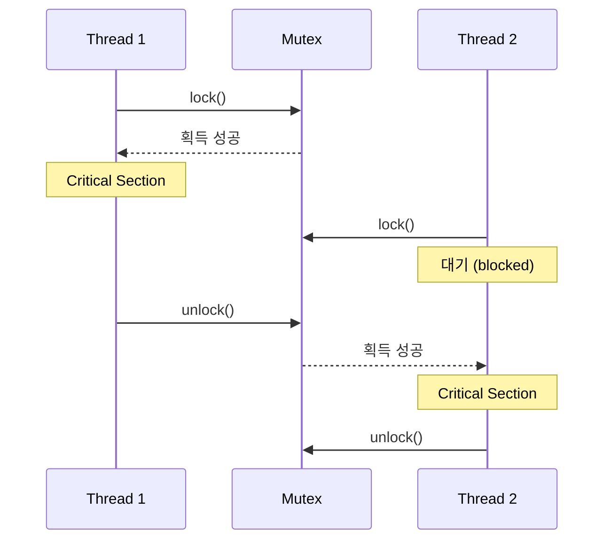

---
tags:
  - Thread
  - Mutex
  - Synchronization
  - Futex
  - Deadlock
  - Critical Section
---

# 4.2b 뮤텍스: 동시성 제어의 기초

## 🔒 화장실 잠금 장치의 교훈

뮤텍스를 가장 잘 설명하는 비유는 화장실 문의 잠금 장치입니다.

비행기 화장실을 생각해보세요:

1. 누군가 들어가면 "Occupied" 표시가 켜짐 (lock)
2. 다른 사람들은 밖에서 대기 (blocked)
3. 사용자가 나오면 "Vacant" 표시 (unlock)
4. 대기자 중 한 명만 들어감 (mutual exclusion)

실제 프로덕션에서 겪은 일입니다. 채팅 서버에서 메시지 순서가 뒤바뀌는 버그가 있었는데:

```c
// 버그가 있던 코드
void send_message(chat_room_t *room, message_t *msg) {
    // 뮤텍스 없이 그냥 추가
    room->messages[room->count++] = msg;  // 💥 Race Condition!
    
    // Thread A: count를 10으로 읽음
    // Thread B: count를 10으로 읽음 (동시에!)
    // Thread A: messages[10]에 "안녕" 저장, count를 11로
    // Thread B: messages[10]에 "하세요" 저장 (덮어씀!), count를 11로
    // 결과: "안녕"이 사라짐!
}

// 수정된 코드
void send_message_safe(chat_room_t *room, message_t *msg) {
    pthread_mutex_lock(&room->mutex);  // 화장실 문 잠그기
    room->messages[room->count++] = msg;
    pthread_mutex_unlock(&room->mutex);  // 문 열기
}
```

## 뮤텍스 동작 원리



## Futex: Fast Userspace Mutex의 마법

**Futex = Fast Userspace Mutex**

제가 커널 소스를 처음 읽었을 때 충격받은 사실: 뮤텍스는 평소엔 유저 공간에서만 동작합니다! 커널을 부르는 건 정말 필요할 때뿐입니다.

이게 왜 중요할까요? 시스템 콜이 비싸기 때문입니다!

```c
// 시스템 콜 비용 측정
void measure_syscall_cost() {
    struct timespec start, end;
    
    // 일반 함수 호출
    clock_gettime(CLOCK_MONOTONIC, &start);
    for (int i = 0; i < 1000000; i++) {
        normal_function();
    }
    clock_gettime(CLOCK_MONOTONIC, &end);
    printf("일반 함수: %ld ns\n", calculate_ns(start, end) / 1000000);
    // 결과: ~2ns
    
    // 시스템 콜
    clock_gettime(CLOCK_MONOTONIC, &start);
    for (int i = 0; i < 1000000; i++) {
        getpid();  // 가장 간단한 시스템 콜
    }
    clock_gettime(CLOCK_MONOTONIC, &end);
    printf("시스템 콜: %ld ns\n", calculate_ns(start, end) / 1000000);
    // 결과: ~50ns (25배 느림!)
}
```

Futex는 이렇게 동작합니다:

1. **Fast Path**: 경쟁이 없으면 원자적 연산만으로 처리 (유저 공간)
2. **Slow Path**: 경쟁이 있으면 커널에 가서 잠들기

### 뮤텍스 내부 구현

```c
// 뮤텍스 내부 구조 (priority inheritance 포함)
typedef struct {
    atomic_int locked;      // 0: unlocked, 1: locked, 2: locked with waiters
    pid_t owner;           // 소유자 TID
    int recursion_count;   // 재귀 카운트
    int original_priority; // 원래 우선순위 (PI용)
    
    // futex (Fast Userspace Mutex)
    atomic_int futex_word;
    
    // 대기 큐 (우선순위 정렬)
    struct wait_queue {
        pid_t tid;
        int priority;
        struct wait_queue *next;
    } *waiters;
    
    // Priority Inheritance 지원
    int pi_enabled;
} mutex_internal_t;

// ⭐ 스핀락 기반 뮤텍스 구현 - 짧은 크리티컬 섹션을 위한 고성능 busy-wait 동기화
// 실제 동작: Compare-And-Swap 원자 연산으로 락 획득, 실패시 CPU 스핀하며 재시도
// 적용 사례: 커널 내부, 실시간 시스템, 짧은 보호 구간, 높은 경합 환경
void mutex_lock_spin(mutex_internal_t *mutex) {
    // ⭐ 1단계: 무한 재시도 루프 - 락을 획득할 때까지 계속 시도
    while (1) {
        // ⭐ 2단계: CAS (Compare-And-Swap) 원자 연산 - lock-free 프로그래밍의 핵심
        int expected = 0;  // 예상값: 0 (unlocked 상태)
        // 원자적 비교-교환: mutex->locked가 0이면 1로 변경, 성공시 true 반환
        if (atomic_compare_exchange_strong(&mutex->locked, 
                                          &expected, 1)) {
            // ⭐ 3단계: 락 획득 성공 - 소유권 설정 및 루프 탈출
            mutex->owner = gettid();  // 현재 스레드를 소유자로 등록
            break;  // 성공적으로 뮤텍스 획득 완료
            // 중요: 이 시점부터 크리티컬 섹션 진입 가능
        }
        
        // ⭐ 4단계: 락 획득 실패시 스핀 대기 - 효율적인 busy-wait 패턴
        while (atomic_load(&mutex->locked) == 1) {
            pause();  // ⭐ CPU 힌트 명령어: 하이퍼스레딩 성능 향상
                      // x86: PAUSE 명령어로 파이프라인 지연 감소
                      // ARM: YIELD 명령어로 코어 간 협력적 스케줄링
                      // 효과: 전력 소모 감소, 메모리 대역폭 절약
        }
        // ⭐ 스핀락의 이중 체크 패턴:
        // 1차: CAS로 실제 획득 시도 (expensive operation)
        // 2차: 단순 읽기로 상태 확인 (cheap operation)
        // → 불필요한 CAS 시도를 줄여 시스템 버스 부하 감소
    }
    
    // ⭐ 실제 production 사용 사례:
    // - Linux 커널: spinlock_t 구조체에서 동일한 패턴 사용
    // - 데이터베이스: InnoDB 버퍼 풀 래치에서 짧은 보호 구간용
    // - 게임 엔진: 물리 시뮬레이션의 shared data 보호
    // - HFT 시스템: 마이크로초 단위 지연이 중요한 거래 로직
    //
    // ⭐ 주의사항:
    // - 긴 크리티컬 섹션에서는 비효율적 (CPU 자원 낭비)
    // - 스레드 수 > CPU 코어 수일 때 성능 저하
    // - 우선순위 역전 문제 발생 가능 (높은 우선순위 스레드가 스핀)
}

// 뮤텍스 잠금 (futex 버전, priority inheritance 포함)
void mutex_lock_futex(mutex_internal_t *mutex) {
    pid_t my_tid = gettid();
    int my_priority = getpriority(PRIO_PROCESS, 0);
    
    // ★ FAST PATH: 경쟁이 없는 경우의 최적화된 경로
    int expected = 0;
    if (atomic_compare_exchange_strong(&mutex->futex_word, &expected, 1)) {
        // 성공! 뮤텍스를 성공적으로 획득
        mutex->owner = my_tid;
        mutex->original_priority = my_priority;
        printf("스레드 %d: Fast Path 성공 - 즉시 획득\n", my_tid);
        return;
    }
    
    printf("스레드 %d: Fast Path 실패 - Slow Path 진입\n", my_tid);
    
    // ★ PRIORITY INHERITANCE: 우선순위 역전 문제 해결
    if (mutex->pi_enabled && mutex->owner != 0) {
        int owner_priority = getpriority(PRIO_PROCESS, mutex->owner);
        
        // 리눅스에서 우선순위는 작은 숫자가 높은 우선순위
        if (my_priority < owner_priority) {
            printf("PI 실행: 소유자 %d 우선순위 %d -> %d\n", 
                   mutex->owner, owner_priority, my_priority);
            setpriority(PRIO_PROCESS, mutex->owner, my_priority);
        }
    }
    
    // ★ SLOW PATH: 경쟁이 있는 경우
    int c = atomic_exchange(&mutex->futex_word, 2);
    
    while (c != 0) {
        printf("스레드 %d: 커널에서 대기...\n", my_tid);
        
        // futex 시스템 콜로 효율적 대기
        int result = syscall(SYS_futex, &mutex->futex_word,
                            FUTEX_WAIT_PRIVATE, 2, NULL, NULL, 0);
        
        if (result == -1 && errno != EAGAIN) {
            printf("스레드 %d: futex 대기 중 오류 (errno: %d)\n", my_tid, errno);
        }
        
        // 깨어난 후 다시 획득 시도
        c = atomic_exchange(&mutex->futex_word, 2);
    }
    
    // 성공: 뮤텍스 획득 완료
    mutex->owner = my_tid;
    mutex->original_priority = my_priority;
    printf("스레드 %d: Slow Path 성공 - 뮤텍스 획득\n", my_tid);
}

// 뮤텍스 해제 (priority inheritance 복구 포함)
void mutex_unlock_futex(mutex_internal_t *mutex) {
    pid_t my_tid = gettid();
    
    // ownership 확인
    if (mutex->owner != my_tid) {
        printf("오류: 스레드 %d가 소유하지 않은 뮤텍스 unlock 시도\n", my_tid);
        errno = EPERM;
        return;
    }
    
    // PRIORITY INHERITANCE 복구
    int current_priority = getpriority(PRIO_PROCESS, 0);
    if (mutex->pi_enabled && mutex->original_priority != current_priority) {
        printf("PI 복구: 스레드 %d 우선순위 %d -> %d\n", 
               my_tid, current_priority, mutex->original_priority);
        setpriority(PRIO_PROCESS, my_tid, mutex->original_priority);
    }
    
    // ownership 해제
    mutex->owner = 0;
    
    // FAST PATH: 대기자가 없는 경우
    int prev_value = atomic_fetch_sub(&mutex->futex_word, 1);
    
    if (prev_value != 1) {
        printf("스레드 %d: Slow Path - 대기자 있음\n", my_tid);
        
        // futex_word를 0으로 설정
        atomic_store(&mutex->futex_word, 0);
        
        // 대기 중인 스레드 중 하나를 깨우기
        int woken = syscall(SYS_futex, &mutex->futex_word,
                           FUTEX_WAKE_PRIVATE, 1, NULL, NULL, 0);
        
        printf("스레드 %d: %d개 스레드 깨우기 완료\n", my_tid, woken);
    } else {
        printf("스레드 %d: Fast Path - 대기자 없음\n", my_tid);
    }
}
```

## 데드락: 동시성의 악몽

### 😵 내가 만든 첫 데드락

신입 때 멀티스레드 프로그램을 짜다가 서버가 멈췄습니다. CPU는 0%, 메모리도 정상, 그런데 아무 응답이 없었죠.

선배가 한마디 하더군요: **"데드락이네. 순서를 바꿔봐."**

```c
#include <pthread.h>

// 공유 자원
int shared_counter = 0;
pthread_mutex_t counter_mutex = PTHREAD_MUTEX_INITIALIZER;

// 안전한 카운터 증가
void* safe_increment(void *arg) {
    for (int i = 0; i < 1000000; i++) {
        pthread_mutex_lock(&counter_mutex);
        shared_counter++;  // Critical Section
        pthread_mutex_unlock(&counter_mutex);
    }
    return NULL;
}

// 데드락 예제
pthread_mutex_t mutex1 = PTHREAD_MUTEX_INITIALIZER;
pthread_mutex_t mutex2 = PTHREAD_MUTEX_INITIALIZER;

void* thread1_deadlock(void *arg) {
    pthread_mutex_lock(&mutex1);
    sleep(1);  // 타이밍 문제 유발
    pthread_mutex_lock(&mutex2);  // 데드락!
    
    // 작업...
    
    pthread_mutex_unlock(&mutex2);
    pthread_mutex_unlock(&mutex1);
    return NULL;
}

void* thread2_deadlock(void *arg) {
    pthread_mutex_lock(&mutex2);
    sleep(1);
    pthread_mutex_lock(&mutex1);  // 데드락!
    
    // 작업...
    
    pthread_mutex_unlock(&mutex1);
    pthread_mutex_unlock(&mutex2);
    return NULL;
}

// 데드락 방지: 순서 지정
void* thread_safe_order(void *arg) {
    // 항상 같은 순서로 잠금
    pthread_mutex_lock(&mutex1);
    pthread_mutex_lock(&mutex2);
    
    // 작업...
    
    pthread_mutex_unlock(&mutex2);
    pthread_mutex_unlock(&mutex1);
    return NULL;
}

// ⭐ 재귀 뮤텍스 시연 - 동일 스레드의 중첩된 락 획득을 허용하는 특수 뮤텍스
// 실제 동작: 내부 카운터로 락 횟수를 추적하여 데드락 없이 재귀 호출 지원
// 활용 사례: 재귀 함수, 라이브러리 함수의 내부 호출, 복잡한 호출 체인
void demonstrate_recursive_mutex() {
    // ⭐ 1단계: 뮤텍스 속성 구조체 초기화 - 표준 뮤텍스와 다른 동작 설정
    pthread_mutexattr_t attr;  // 뮤텍스 속성을 담는 opaque 구조체
    pthread_mutex_t recursive_mutex;  // 실제 뮤텍스 객체
    
    // ⭐ 2단계: 속성 객체 초기화 - 기본값으로 설정 후 수정 가능한 상태로 만들기
    pthread_mutexattr_init(&attr);  // 모든 속성을 시스템 기본값으로 초기화
    // 기본값: PTHREAD_MUTEX_NORMAL (재귀 불가, 빠른 성능)
    
    // ⭐ 3단계: 재귀 타입 설정 - 핵심 속성 변경으로 중첩 락 허용
    pthread_mutexattr_settype(&attr, PTHREAD_MUTEX_RECURSIVE);
    // PTHREAD_MUTEX_RECURSIVE: 동일 스레드에서 중첩 락 허용
    // 내부 구현: 소유자 TID + 락 카운터로 중첩 깊이 추적
    // 성능 비용: 매번 소유자 확인과 카운터 관리로 일반 뮤텍스보다 약간 느림
    
    // ⭐ 4단계: 재귀 뮤텍스 생성 - 설정된 속성으로 실제 뮤텍스 객체 초기화
    pthread_mutex_init(&recursive_mutex, &attr);
    // 이 시점에서 recursive_mutex는 재귀 락을 지원하는 상태로 초기화됨
    
    // ⭐ 5단계: 중첩 락 테스트 - 일반 뮤텍스라면 데드락이 발생할 상황
    pthread_mutex_lock(&recursive_mutex);     // 1차 락: 성공, 내부 카운터 = 1
    pthread_mutex_lock(&recursive_mutex);     // 2차 락: 동일 스레드이므로 성공, 카운터 = 2
    // 일반 뮤텍스였다면 여기서 데드락 발생! (자기 자신을 기다리는 상황)
    // 재귀 뮤텍스는 소유자 TID를 확인하고 카운터만 증가시킴
    
    // ⭐ 6단계: 대칭적 해제 - 락 횟수와 동일한 횟수로 unlock 필요
    pthread_mutex_unlock(&recursive_mutex);   // 1차 해제: 카운터 = 1, 아직 락 유지
    pthread_mutex_unlock(&recursive_mutex);   // 2차 해제: 카운터 = 0, 완전 해제
    // 중요: 마지막 unlock에서만 실제로 다른 스레드가 락을 획득할 수 있음
    
    // ⭐ 7단계: 리소스 정리 - 메모리 누수 방지를 위한 정리 작업
    pthread_mutexattr_destroy(&attr);  // 속성 객체 해제
    // 주의: mutex 자체는 pthread_mutex_destroy()로 따로 정리해야 함
    
    // ⭐ 실제 production 활용 사례:
    // 1. 라이브러리 함수: public API가 내부적으로 다른 public API 호출
    // 2. 재귀 자료구조: 트리 순회 시 각 노드에서 동일한 락 필요
    // 3. 에러 핸들링: 예외 상황에서 정리 함수가 같은 락을 다시 요구
    // 4. 설정 관리: 설정 읽기 함수가 내부적으로 다른 설정 함수 호출
    //
    // ⭐ 성능과 설계 고려사항:
    // - 재귀 뮤텍스는 일반 뮤텍스보다 느림 (오버헤드 약 10-20%)
    // - 설계 관점에서는 재귀가 필요 없도록 리팩토링하는 것이 이상적
    // - 하지만 레거시 코드나 복잡한 호출 체인에서는 실용적인 해결책
    // - 데드락 위험은 줄이지만 다른 동기화 문제는 여전히 존재
}
```

## 핵심 요점

### 1. Futex는 하이브리드 동기화 메커니즘이다

경쟁이 없을 때는 유저 공간에서만, 경쟁이 있을 때만 커널을 사용한다.

### 2. Priority Inheritance로 우선순위 역전을 방지한다

높은 우선순위 스레드가 대기할 때 소유자의 우선순위를 일시적으로 올려준다.

### 3. 데드락은 일관된 락 순서로 방지한다

여러 뮤텍스를 사용할 때는 항상 동일한 순서로 획득하라.

### 4. 재귀 뮤텍스는 신중하게 사용하라

편리하지만 성능 오버헤드와 설계 복잡성을 고려해야 한다.

---

**이전**: [4.2a 스레드 기초](02a-thread-fundamentals.md)  
**다음**: [4.2c 세마포어와 조건 변수](02c-semaphore-condvar.md)에서 더 고급 동기화 메커니즘을 학습합니다.
