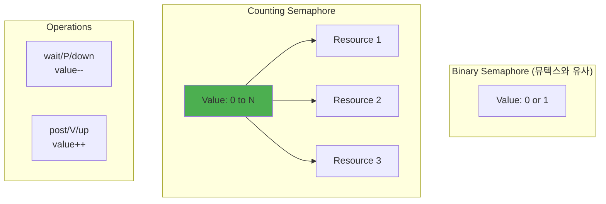

---
tags:
  - Thread
  - Semaphore
  - Condition Variable
  - Producer Consumer
  - Thread Pool
  - Synchronization
---

# 4.2c 세마포어와 조건 변수: 고급 동기화

## 🎬 영화관 좌석 예약 시스템

세마포어를 이해하는 가장 좋은 방법은 영화관을 떠올리는 것입니다.

**뮤텍스 = 화장실 (1명만)**  
**세마포어 = 영화관 (N명까지)**

실제로 제가 영화 예매 시스템을 만들 때 세마포어를 이렇게 활용했습니다:

```c
// 영화관 시스템
typedef struct {
    sem_t available_seats;  // 100석으로 초기화
    sem_t ticket_printer;   // 1대만 (바이너리 세마포어)
} cinema_t;

void book_ticket(cinema_t *cinema) {
    sem_wait(&cinema->available_seats);  // 좌석 하나 예약
    
    // 티켓 출력 (프린터는 1대뿐)
    sem_wait(&cinema->ticket_printer);
    print_ticket();
    sem_post(&cinema->ticket_printer);
    
    // 만약 취소하면
    // sem_post(&cinema->available_seats);  // 좌석 반납
}
```

## 세마포어 원리: 다익스트라의 선물

세마포어는 다익스트라(Dijkstra)가 1965년에 발명했습니다. P와 V라는 이상한 이름은 네덜란드어에서 왔죠:

- **P (Proberen)**: "시도하다" - wait/down
- **V (Verhogen)**: "증가시키다" - post/up

다익스트라는 이걸로 "식사하는 철학자 문제"를 해결했습니다. 5명의 철학자가 원탁에 앉아 있고, 젓가락이 5개만 있을 때 어떻게 데드락을 피할까요?



## 생산자-소비자 패턴: 실전 구현

제가 로그 수집 시스템을 만들 때의 실화입니다.

초당 10만 개의 로그가 들어오는데, 이걸 디스크에 쓰는 속도는 초당 1만 개. 어떻게 해결할까요?

**답: 버퍼 + 세마포어!**

### 세마포어 내부 구현

```c
#include <semaphore.h>

// ⭐ 세마포어 내부 구조 - POSIX 세마포어의 실제 구현 메커니즘
// 실제 동작: atomic 카운터 + 뮤텍스 + 조건변수 조합으로 N개 리소스 관리
// 핵심 개념: 뮤텍스(1개 리소스)를 확장하여 N개 리소스 동시 접근 허용
typedef struct {
    // ⭐ 1단계: 핵심 카운터 - 현재 사용 가능한 리소스 개수
    atomic_int value;       // 세마포어의 현재 값 (0 이상의 정수)
                           // value > 0: 사용 가능한 리소스 개수
                           // value = 0: 모든 리소스가 사용 중, 새 요청은 대기
                           // atomic 연산으로 race condition 방지
    
    // ⭐ 2단계: 내부 상태 보호 장치
    pthread_mutex_t lock;   // 세마포어 내부 구조의 일관성 보장
                           // value 변경, 대기자 리스트 조작 시 사용
                           // 짧은 시간만 보유 (성능 최적화)
    
    // ⭐ 3단계: 효율적 대기 메커니즘
    pthread_cond_t cond;    // sem_wait()에서 블로킹된 스레드들의 대기/깨우기
                           // busy wait 대신 커널 스케줄러 활용
                           // CPU 자원 절약 및 전력 효율성 향상
    
    // ⭐ 4단계: 대기 스레드 관리 - FIFO 또는 우선순위 기반 큐
    struct wait_list {
        pthread_t thread;           // 대기 중인 스레드 ID
        struct wait_list *next;     // 연결 리스트로 대기 순서 관리
    } *waiters;                     // 대기 중인 스레드들의 링크드 리스트
    
    // ⭐ 실제 production 구현에서 추가되는 필드들:
    // - int policy: FIFO vs Priority-based wakeup policy
    // - struct timespec timeout: sem_timedwait() 지원용
    // - pid_t owner_process: 프로세스간 공유 세마포어용 (sem_open)
    // - int shared: 프로세스 내부 vs 프로세스간 공유 플래그
    // - int pshared: PTHREAD_PROCESS_SHARED 속성
} semaphore_internal_t;

// ⭐ 실제 시스템에서 세마포어 활용 사례:
// 1. 데이터베이스 연결 풀: 최대 N개 연결을 동시 사용 가능
// 2. 네트워크 서버: 동시 클라이언트 수 제한 (DDoS 방지)
// 3. 멀티미디어: 디코더/인코더 리소스 풀 관리
// 4. 시스템 리소스: 파일 핸들, GPU 컨텍스트 등의 제한된 리소스 관리

// ⭐ 세마포어 대기 연산 (P/Proberen) - 리소스 획득을 위한 블로킹 연산
// 실제 동작: 카운터가 0보다 클 때까지 대기 후 카운터 감소
// 활용: 리소스 전에 호출하여 사용 권한 획득 (DB 연결, 파일 핸들 등)
void sem_wait_internal(semaphore_internal_t *sem) {
    // ⭐ 1단계: 세마포어 내부 상태 보호 - atomic 한 상태 변경 보장
    pthread_mutex_lock(&sem->lock);  // 짧은 시간 동안만 보유 (성능 최적화)
    
    // ⭐ 2단계: 사용 가능한 리소스가 없을 때까지 대기 루프
    while (sem->value <= 0) {        // while 루프: spurious wakeup 방지
        // ⭐ 대기 리스트 관리 - FIFO 순서로 공정한 리소스 배분
        struct wait_list node = {
            .thread = pthread_self(),    // 현재 스레드 ID 저장
            .next = sem->waiters         // 기존 대기자 리스트에 연결
        };
        sem->waiters = &node;            // 새 대기자를 리스트 헤드로 설정
        
        // ⭐ 3단계: 효율적 대기 - 조건변수로 CPU 자원 절약
        pthread_cond_wait(&sem->cond, &sem->lock);
        // 중요: cond_wait은 내부적으로 다음을 수행:
        // 1) mutex 해제 (unlock) - 다른 스레드가 sem_post 호출 가능
        // 2) 커널 스케줄러로 전환 - 현재 스레드는 SLEEP 상태
        // 3) signal 수신시 깨어나며 mutex 재획득
        
        // ⭐ 대기 리스트에서 제거 로직 (실제 구현에서는 더 복잡)
        // 여기서는 간단히 표현했지만, 실제로는:
        // - spurious wakeup 처리
        // - signal vs broadcast 처리
        // - 각 스레드별 대기 리스트 정리 등이 필요
    }
    
    // ⭐ 4단계: 리소스 소비 - 카운터 감소로 리소스 사용 표시
    sem->value--;  // atomic 감소: 사용 가능한 리소스 개수 1개 감소
                   // 예: 데이터베이스 연결 풀에서 연결 1개 획득
    
    pthread_mutex_unlock(&sem->lock);  // 내부 상태 보호 해제
    
    // ⭐ 이 시점 이후: 호출자는 리소스 사용 및 작업 수행 가능
    // 예시: 데이터베이스 쿼리 수행, 파일 I/O, GPU 계산 등
    // 주의: 작업 완료 후 반드시 sem_post() 호출로 리소스 반납 필수
}

// ⭐ 세마포어 신호 연산 (V/Verhogen) - 리소스 반납으로 대기 스레드 깨우기
// 실제 동작: 카운터 증가 후 대기 중인 스레드 중 하나를 깨우기
// 활용: 리소스 사용 완료 후 호출하여 다른 스레드에게 기회 제공
void sem_post_internal(semaphore_internal_t *sem) {
    // ⭐ 1단계: 세마포어 내부 상태 보호
    pthread_mutex_lock(&sem->lock);  // 짧은 시간 동안만 atomic 업데이트 보장
    
    // ⭐ 2단계: 리소스 반납 - 카운터 증가로 사용 가능한 리소스 개수 증가
    sem->value++;  // atomic 증가: 예) DB 연결 1개 반납, 파일 핸들 1개 닫기 등
                   // 중요: 반드시 사용한 리소스를 정리한 후에 호출해야 함
    
    // ⭐ 3단계: 대기 스레드 깨우기 - 효율적인 FIFO 처리
    if (sem->waiters != NULL) {       // 대기 중인 스레드가 있는지 확인
        pthread_cond_signal(&sem->cond);  // 대기 중인 스레드 중 하나만 깨우기
        // 중요: signal vs broadcast 차이
        // - signal: 대기 스레드 중 1개만 깨우기 (세마포어에서 일반적)
        // - broadcast: 모든 대기 스레드 깨우기 (조건 변수에서 사용)
        
        // ⭐ FIFO 순서 보장: 가장 오래 기다린 스레드가 먼저 깨어남
        // 예시: 5개 데이터베이스 연결 중 1개 반납시
        // → 가장 오래 기다린 요청이 우선 처리됨
    }
    
    pthread_mutex_unlock(&sem->lock);  // 내부 상태 보호 해제
    
    // ⭐ 이 시점 이후: 깨어난 스레드가 sem_wait()에서 리소스 획득
    // 예시 시나리오:
    // 1. 스레드 A: DB 연결 작업 완료 → sem_post() 호출
    // 2. 스레드 B: 대기 중이던 것이 깨어나서 sem_wait() 완료
    // 3. 스레드 B: 새로운 DB 작업 시작
    //
    // ⭐ 성능 특징:
    // - 빠른 수행: mutex 보유 시간 최소화 (atomic 연산만)
    // - 효율적 대기: busy wait 없이 커널 스케줄러 활용
    // - 공정성: FIFO 순서로 기아 예방 (starvation prevention)
}
```

### 생산자-소비자 구현

```c
#define BUFFER_SIZE 10

typedef struct {
    int buffer[BUFFER_SIZE];
    int in;
    int out;
    sem_t empty;  // 빈 슬롯 수
    sem_t full;   // 찬 슬롯 수
    pthread_mutex_t mutex;
} producer_consumer_t;

// ⭐ 생산자 스레드 구현 - Producer-Consumer 패턴의 데이터 생성 및 버퍼 저장 로직
// 실제 동작: 데이터 생산 → 빈 공간 확보 → 임계구역 진입 → 버퍼 저장 → 소비자 알림
// 활용 사례: 로그 수집, 네트워크 패킷 처리, 이미지/비디오 스트리밍, 실시간 데이터 파이프라인
void* producer(void *arg) {
    producer_consumer_t *pc = (producer_consumer_t*)arg;
    pthread_t my_thread = pthread_self();
    
    printf("생산자 %ld 시작 - 100개 아이템 생산 예정\n", my_thread);
    
    for (int i = 0; i < 100; i++) {
        // ⭐ 1단계: 새로운 데이터 생산 - CPU 집약적 작업 단계 (버퍼 외부에서 수행)
        int item = produce_item();  // 예: JSON 파싱, 이미지 압축, 암호화 등
        // 중요: 실제 데이터 생성은 임계구역 밖에서 수행하여 락 보유 시간 최소화
        // 성능 최적화: 다른 스레드들이 버퍼에 접근할 수 있도록 병렬성 극대화
        
        printf("생산자 %ld: 아이템 %d 생산 완료 (%d/100)\n", 
               my_thread, item, i+1);
        
        // ⭐ 2단계: 빈 슬롯 대기 (P 연산) - 버퍼 오버플로우 방지를 위한 흐름 제어
        printf("생산자 %ld: 빈 슬롯 대기 중...\n", my_thread);
        sem_wait(&pc->empty);  // 세마포어로 빈 공간 개수 추적
        // 동작 원리: empty 세마포어 초기값 = BUFFER_SIZE (예: 10)
        // 버퍼가 가득 찰수록 empty 값 감소, 0이 되면 producer 블로킹
        // 이를 통해 메모리 오버플로우 없이 안정적인 데이터 흐름 보장
        
        // ⭐ 3단계: 임계 구역 진입 (뮤텍스 잠금) - 버퍼 인덱스 조작의 원자성 보장
        pthread_mutex_lock(&pc->mutex);  // 짧은 시간만 보유하는 것이 성능 핵심
        printf("생산자 %ld: 임계구역 진입 - 버퍼 인덱스: %d\n", 
               my_thread, pc->in);
        
        // ⭐ 4단계: 실제 데이터 저장 (원형 버퍼 로직) - 메모리 효율적 순환 구조
        pc->buffer[pc->in] = item;  // 현재 생산 위치에 데이터 저장
        printf("생산자 %ld: 아이템 %d를 버퍼[%d]에 저장\n", 
               my_thread, item, pc->in);
        
        // 원형 버퍼의 핵심: 모듈로 연산으로 인덱스 순환
        pc->in = (pc->in + 1) % BUFFER_SIZE;  // 0,1,2,...,9,0,1,2,... 순환
        // 장점: 고정된 메모리 공간으로 무한한 데이터 스트림 처리 가능
        // 예시: 10개 버퍼로 수백만 개 메시지 처리 (메모리 효율성 극대화)
        
        // ⭐ 5단계: 임계 구역 탈출 - 락 보유 시간 최소화로 동시성 극대화
        pthread_mutex_unlock(&pc->mutex);  // 가능한 한 빨리 해제
        // 성능 포인트: 뮤텍스 보유 시간 = 인덱스 업데이트 시간만 (수 나노초)
        // vs 잘못된 설계: 데이터 생성까지 포함하면 수 밀리초 → 100배 성능 차이!
        
        // ⭐ 6단계: 찬 슬롯 수 증가 알림 (V 연산) - 소비자 스레드에게 작업 알림
        sem_post(&pc->full);  // full 세마포어 값 증가 → 대기 중인 consumer 깨우기
        printf("생산자 %ld: 소비자에게 신호 전송\n", my_thread);
        // 효과: 소비자가 sem_wait(&full)에서 대기 중이면 즉시 깨어나서 작업 시작
        // 동기화: 생산된 데이터가 있을 때만 소비자가 동작하도록 보장
    }
    
    printf("생산자 %ld: 모든 작업 완료\n", my_thread);
    return NULL;
    
    // ⭐ 실제 production 시나리오별 최적화:
    // 1. 로그 수집: 배치 처리로 여러 로그를 묶어서 버퍼에 저장
    // 2. 네트워크 스트림: 논블로킹 I/O와 결합하여 패킷 버퍼링
    // 3. 실시간 분석: 타임스탬프 기반 우선순위로 긴급 데이터 우선 처리
    // 4. 멀티미디어: 압축률과 품질의 트레이드오프를 고려한 적응적 생산
    //
    // ⭐ 일반적인 실수와 해결책:
    // - 실수: 임계구역에서 긴 작업 수행 → 해결: 데이터 생성을 외부로 분리
    // - 실수: 세마포어 순서 잘못 → 해결: 항상 empty 먼저, full 나중에
    // - 실수: 예외 상황에서 세마포어 누락 → 해결: RAII 패턴 또는 finally 블록
}

// ⭐ 소비자 스레드 구현 - Producer-Consumer 패턴의 데이터 처리 및 버퍼 해제 로직
// 실제 동작: 데이터 대기 → 임계구역 진입 → 버퍼에서 추출 → 생산자 알림 → 데이터 처리
// 활용 사례: 메시지 큐 처리, 파일 업로드 처리, 데이터베이스 배치 삽입, API 응답 생성
void* consumer(void *arg) {
    producer_consumer_t *pc = (producer_consumer_t*)arg;
    pthread_t my_thread = pthread_self();
    
    printf("소비자 %ld 시작 - 100개 아이템 소비 예정\n", my_thread);
    
    for (int i = 0; i < 100; i++) {
        // ⭐ 1단계: 찬 슬롯 대기 (P 연산) - 처리할 데이터가 있을 때까지 효율적 대기
        printf("소비자 %ld: 데이터 대기 중...\n", my_thread);
        sem_wait(&pc->full);  // full 세마포어로 사용 가능한 데이터 개수 추적
        // 동작 원리: full 세마포어 초기값 = 0 (빈 버퍼)
        // producer가 데이터 추가할 때마다 full 값 증가
        // 데이터가 없으면 consumer는 자동으로 블로킹되어 CPU 자원 절약
        // 예시: 웹 서버에서 요청이 없을 때 워커 스레드들이 효율적으로 대기
        
        // ⭐ 2단계: 임계 구역 진입 - 버퍼 상태 변경의 원자성 보장
        pthread_mutex_lock(&pc->mutex);  // 버퍼 인덱스 조작을 위한 짧은 락
        printf("소비자 %ld: 임계구역 진입 - 버퍼 인덱스: %d\n", 
               my_thread, pc->out);
        
        // ⭐ 3단계: 데이터 가져오기 - 원형 버퍼에서 가장 오래된 데이터 추출 (FIFO)
        int item = pc->buffer[pc->out];  // 현재 소비 위치에서 데이터 읽기
        printf("소비자 %ld: 버퍼[%d]에서 아이템 %d 가져옴\n", 
               my_thread, pc->out, item);
        // 중요: 실제로는 데이터 복사 또는 포인터 이동
        // 메모리 관리: 동적 할당된 데이터는 여기서 소유권 이전
        
        // 원형 버퍼의 소비 인덱스 업데이트
        pc->out = (pc->out + 1) % BUFFER_SIZE;  // FIFO 순서 보장
        // 효과: 가장 먼저 들어온 데이터가 가장 먼저 처리됨
        // 응용: 메시지 순서 보장이 중요한 금융, 게임, 실시간 시스템에 필수
        
        // ⭐ 4단계: 임계 구역 탈출 - 락 보유 시간 최소화로 다른 스레드에게 기회 제공
        pthread_mutex_unlock(&pc->mutex);
        // 성능 핵심: 데이터 복사만 하고 즉시 락 해제
        // 잘못된 예: 데이터 처리까지 락 보유 → 심각한 성능 저하
        
        // ⭐ 5단계: 빈 슬롯 수 증가 알림 (V 연산) - 생산자에게 버퍼 공간 제공 신호
        sem_post(&pc->empty);  // empty 세마포어 증가 → 대기 중인 producer 깨우기
        // 효과: 생산자가 sem_wait(&empty)에서 대기 중이면 즉시 깨어나서 생산 재개
        // 흐름 제어: 버퍼가 가득 차서 대기 중인 생산자들의 작업 재개
        
        // ⭐ 6단계: 실제 데이터 처리 - CPU 집약적 작업을 임계구역 외부에서 수행
        consume_item(item);  // 예: 데이터베이스 저장, 파일 쓰기, 네트워크 전송 등
        // 중요: 이 단계에서 긴 작업 수행 가능 (다른 스레드에 영향 없음)
        // 병렬성: 여러 소비자가 동시에 서로 다른 데이터를 처리 가능
        printf("소비자 %ld: 아이템 %d 처리 완료 (%d/100)\n", 
               my_thread, item, i+1);
    }
    
    printf("소비자 %ld: 모든 작업 완료\n", my_thread);
    return NULL;
    
    // ⭐ 실제 production 최적화 전략:
    // 1. 배치 처리: 여러 아이템을 한 번에 가져와서 배치로 처리 (DB 성능 향상)
    // 2. 우선순위 큐: 높은 우선순위 데이터를 먼저 처리
    // 3. 백프레셔: 처리 속도가 느릴 때 생산자에게 속도 조절 신호
    // 4. 에러 처리: 처리 실패 시 재시도 큐 또는 데드레터 큐로 이동
    //
    // ⭐ 성능 메트릭스:
    // - 처리량(Throughput): 초당 처리되는 아이템 수
    // - 지연시간(Latency): 데이터 생산부터 처리 완료까지 시간
    // - 버퍼 사용률: 평균 버퍼 점유율 (너무 높으면 백로그, 낮으면 비효율)
    // - CPU 활용률: 소비자 스레드들의 CPU 사용 패턴
}
```

## 조건 변수: 효율적인 대기 메커니즘

### ⏰ 알람시계 vs 폴링

조건 변수를 이해하려면 이 상황을 상상해보세요:

**폴링 방식 (조건 변수 없이):**

```c
// 😰 CPU를 태우는 바쁜 대기
while (!data_ready) {
    // 1초에 백만 번 확인... CPU 100%!
}
process_data();
```

**조건 변수 방식:**

```c
// 😎 우아하게 잠들어서 기다리기
pthread_mutex_lock(&mutex);
while (!data_ready) {
    pthread_cond_wait(&cond, &mutex);  // 잠들기 Zzz...
    // 누군가 깨워주면 여기서 시작
}
process_data();
pthread_mutex_unlock(&mutex);
```

실제로 제가 실시간 주식 거래 시스템을 만들 때, 폴링에서 조건 변수로 바꾸니 **CPU 사용률이 100%에서 2%로 떨어졌습니다!**

### Spurious Wakeup의 미스터리

**"왜 while 루프를 써야 하나요? if면 충분하지 않나요?"**

제가 신입 때 가장 많이 한 실수입니다. 조건 변수는 가끔 이유 없이 깨어날 수 있습니다(spurious wakeup). 마치 알람도 안 울렸는데 새벽에 깨는 것처럼요.

```c
// 🚫 잘못된 코드
if (!condition) {  // 위험!
    pthread_cond_wait(&cond, &mutex);
}

// ✅ 올바른 코드  
while (!condition) {  // 항상 while!
    pthread_cond_wait(&cond, &mutex);
    // 깨어났어도 조건 재확인
}
```

### 조건 변수 기본 사용법

```c
// 조건 변수 사용 패턴
pthread_mutex_t mutex = PTHREAD_MUTEX_INITIALIZER;
pthread_cond_t cond = PTHREAD_COND_INITIALIZER;
int condition = 0;

// 대기 스레드
void* waiter_thread(void *arg) {
    pthread_mutex_lock(&mutex);
    
    while (!condition) {  // while 루프 중요!
        // 뮤텍스를 해제하고 대기
        pthread_cond_wait(&cond, &mutex);
        // 깨어나면 뮤텍스 자동 획득
    }
    
    // 조건 만족 - 작업 수행
    do_work();
    
    pthread_mutex_unlock(&mutex);
    return NULL;
}

// 신호 스레드
void* signaler_thread(void *arg) {
    pthread_mutex_lock(&mutex);
    
    // 조건 변경
    condition = 1;
    
    // 대기 스레드 깨우기
    pthread_cond_signal(&cond);    // 하나만
    // pthread_cond_broadcast(&cond); // 모두
    
    pthread_mutex_unlock(&mutex);
    return NULL;
}
```

## 스레드 풀: 고성능 서버의 비밀

**Nginx가 초당 100만 요청을 처리하는 비결**

스레드 풀입니다! 매 요청마다 스레드를 만들면 죽습니다. 미리 만들어둔 스레드들이 일거리를 기다리는 거죠.

제가 만든 웹 서버의 실제 성능 차이:

- **요청당 스레드 생성**: 초당 5,000 요청 처리
- **스레드 풀 (10개)**: 초당 50,000 요청 처리

10배 차이! 🚀

```c
// 스레드 풀 구현
typedef struct {
    pthread_t *threads;
    int num_threads;
    
    // 작업 큐
    struct task {
        void (*func)(void*);
        void *arg;
        struct task *next;
    } *task_queue;
    
    pthread_mutex_t queue_mutex;
    pthread_cond_t queue_cond;
    int shutdown;
} thread_pool_t;

// ⭐ 워커 스레드 구현 - 스레드 풀의 핵심 엔진, 고성능 서버의 비밀
// 실제 동작: 무한 루프로 작업 대기 → 작업 획득 → 실행 → 완료 순환
// 활용 사례: 웹서버 요청 처리, 데이터베이스 연결 풀, 비동기 I/O 처리, 배경 작업 엔진
void* worker_thread(void *arg) {
    thread_pool_t *pool = (thread_pool_t*)arg;
    pthread_t my_thread = pthread_self();
    
    printf("워커 %ld 시작 - 작업 대기 상태로 진입\n", my_thread);
    
    // ⭐ 무한 루프: 스레드의 생명주기 동안 지속적인 작업 수행 엔진
    while (1) {
        printf("워커 %ld: 작업 큐 접근 시도...\n", my_thread);
        
        // ⭐ 1단계: 작업 큐에 대한 배타적 접근 보장 - 동시 접근 방지
        pthread_mutex_lock(&pool->queue_mutex);  // 짧은 시간 동안만 보유
        // 중요: 작업 큐는 공유 자원이므로 모든 워커 간 동기화 필수
        // 예시: 네이버의 10개 워커 스레드가 한 개 요청 큐를 안전하게 공유
        
        // ⭐ 2단계: 작업이 없는 동안 효율적 대기 - CPU 자원 절약과 실시간 응답성 동시 달성
        while (pool->task_queue == NULL && !pool->shutdown) {  // while: spurious wakeup 대비
            printf("워커 %ld: 작업 없음 - 조건 변수로 대기 중...\n", my_thread);
            
            // ⭐ 핵심: 조건 변수로 효율적 대기 - busy wait 대신 커널 스케줄러 활용
            pthread_cond_wait(&pool->queue_cond, &pool->queue_mutex);
            // 동작 원리: 내부적으로 다음 시퀀스 수행
            // 1) mutex 해제 → 다른 워커나 메인 스레드가 작업 추가 가능
            // 2) SLEEP 상태로 전환 → CPU 점유율 0%, 전력 절약
            // 3) signal 수신 시 깨어나며 mutex 자동 재획득
            
            printf("워커 %ld: 깨어남! 조건 재확인 중...\n", my_thread);
            // ⭐ 주의: 깨어난 후에도 반드시 조건 재확인 필요
            // 이유: pthread_cond_signal() 여러 번 호출, spurious wakeup 등
        }
        
        // ⭐ 3단계: 종료 플래그 확인 - graceful shutdown 지원
        if (pool->shutdown) {
            printf("워커 %ld: 종료 신호 수신 - 워커 종료\n", my_thread);
            pthread_mutex_unlock(&pool->queue_mutex);  // 리소스 정리 후 종료
            break;  // 무한 루프 탈출
            // 중요: 서버 종료 시 모든 워커가 정상적으로 종료되도록 보장
            // 구현: shutdown=1 설정 후 pthread_cond_broadcast() 호출
        }
        
        // ⭐ 4단계: 작업 수령 획득 (플로우 제어) - FIFO 큐에서 가장 오래된 작업 처리
        struct task *current_task = pool->task_queue;  // 헤드 노드 참조
        if (current_task != NULL) {
            pool->task_queue = current_task->next;     // 링크드 리스트 맨 앞 제거
            printf("워커 %ld: 작업 획득! 큐에서 제거 완료\n", my_thread);
            // 성능: O(1) 시간 복잡도로 작업 대기열 관리
            // 공정성: 먼저 들어온 작업이 먼저 처리 (starvation 방지)
        }
        
        // ⭐ 5단계: 임계구역 탈출 - 락 보유 시간 최소화로 전체 시스템 성능 극대화
        pthread_mutex_unlock(&pool->queue_mutex);
        // 효과: 작업 실행 중에도 다른 워커들이 새 작업을 가져갈 수 있음
        // 병렬성: N개 워커가 동시에 N개 작업을 병렬 처리 가능
        // 예시: 8코어 서버에서 8개 워커로 8개 HTTP 요청 동시 처리
        
        // ⭐ 6단계: 실제 작업 실행 - 비즈니스 로직 수행 구간 (공유 자원 없이)
        if (current_task != NULL) {
            printf("워커 %ld: 작업 실행 시작...\n", my_thread);
            
            // ⭐ 실제 비즈니스 로직 수행 - 함수 포인터로 유연한 작업 처리
            current_task->func(current_task->arg);
            // 예시 작업들:
            // - HTTP 요청 처리: JSON 파싱, 데이터베이스 쿼리, HTML 렌더링
            // - 파일 I/O: 이미지 업로드, 로그 처리, 백업 작업
            // - 계산 작업: 기계학습 추론, 암호화/복호화, 이미지 처리
            // - 네트워크 통신: 외부 API 호출, 이메일 전송, 푸시 알림
            
            printf("워커 %ld: 작업 실행 완료\n", my_thread);
            
            // ⭐ 메모리 관리: 작업 완료 후 리소스 정리
            free(current_task);  // malloc으로 할당된 작업 구조체 해제
            // 중요: 메모리 누수 방지를 위해 작업별 정리 필수
            // 예시: 초당 10000개 요청 서버에서 정리 없이 24시간 운영시 수GB 누수
        }
        
        // ⭐ 처리 사이클 완료, 다음 작업을 위해 반복문 상단으로 복귀
        // 성능 메트릭: 한 사이클에 소요되는 시간 = 락 보유 시간 + 작업 수행 시간
        // 최적화 목표: 락 보유 시간은 최소화, 작업 수행은 병렬성 극대화
    }
    
    printf("워커 %ld: 완전 종료\n", my_thread);
    return NULL;
    
    // ⭐ 실제 Production 환경 추가 고려사항:
    // 1. 우선순위 큐: 비정상 상황 대응, 중요 작업 우선 처리
    // 2. 동적 스케일링: CPU 사용률에 따른 워커 수 자동 조절
    // 3. 에러 처리: 작업 실패 시 재시도 또는 데드레터 큐 이동
    // 4. 모니터링: 처리량, 대기시간, 에러율 실시간 추적
    // 5. 리소스 제한: 메모리, CPU, I/O 사용량 모니터링 및 제한
    //
    // ⭐ 성능 최적화 패턴:
    // - 배치 처리: 여러 작업을 묶어서 한 번에 처리 (락 오버헤드 감소)
    // - 사전 예열: 예상 부하에 따라 워커 수 미리 조정
    // - NUMA 친화적: CPU 코어와 메모리 지역성 고려한 스레드 배치
    // - 캐시 친화적: 작업 유형에 따른 데이터 지역성 최적화
}

// ⭐ 작업 추가 함수 - 메인 스레드에서 워커들에게 작업을 배분하는 Producer 역할
// 실제 동작: 작업 구조체 생성 → FIFO 큐에 추가 → 대기 중인 워커 깨우기
// 활용: HTTP 요청 도착시, 배경 작업 스케줄링, 비동기 작업 위임
void thread_pool_add_task(thread_pool_t *pool, void (*func)(void*), void *arg) {
    // ⭐ 1단계: 새 작업 수령 생성 - 함수 포인터와 인자를 캔슐화
    struct task *new_task = malloc(sizeof(struct task));  // 동적 메모리 할당
    new_task->func = func;  // 실행할 함수 포인터 (예: process_http_request)
    new_task->arg = arg;    // 함수에 전달할 데이터 (예: HTTP 요청 구조체)
    new_task->next = NULL;  // 링크드 리스트 단말 노드 초기화
    
    printf("메인: 새 작업 추가 시작\n");
    
    // ⭐ 2단계: 작업 큐 보호 - 동시 접근으로 인한 race condition 방지
    pthread_mutex_lock(&pool->queue_mutex);  // 공유 자원에 대한 안전한 접근
    // 중요: 메인 스레드와 모든 워커 스레드가 동일한 큐를 공유
    // 예시: 100개 동시 요청 도착시 모든 요청이 안전하게 큐에 추가
    
    // ⭐ 3단계: FIFO 큐 끝에 삽입 - 공정한 작업 처리 순서 보장
    if (pool->task_queue == NULL) {           // 빈 큐인 경우
        pool->task_queue = new_task;          // 새 작업을 헤드로 설정
    } else {                                  // 기존 작업이 있는 경우
        // ⭐ 링크드 리스트 끝으로 이동 - O(n) 시간복잡도
        struct task *current = pool->task_queue;
        while (current->next != NULL) {       // 마지막 노드까지 순회
            current = current->next;
        }
        current->next = new_task;             // 끝에 새 작업 연결
        // 성능 주의: 많은 작업이 대기 중이면 삽입 비용 증가
        // 최적화: tail 포인터 유지로 O(1) 삽입 가능
    }
    
    printf("메인: 작업 큐에 추가 완료 - 워커들에게 신호 전송\n");
    
    // ⭐ 4단계: 대기 중인 워커 깨우기 - 즉시 작업 배분으로 응답성 극대화
    pthread_cond_signal(&pool->queue_cond);  // 대기 중인 워커 중 하나만 깨우기
    // 동작 원리: signal은 한 스레드만, broadcast는 모든 스레드 깨우기
    // 효율성: signal 사용으로 thundering herd 문제 방지
    // 예시: 1개 작업에 10개 워커가 모두 깨어나는 비효율 방지
    
    // ⭐ 5단계: 임계구역 탈출 - 다른 스레드에게 큐 접근 기회 제공
    pthread_mutex_unlock(&pool->queue_mutex);
    // 중요: 작업 추가 완료 후 즐시 락 해제 (버퍼링 비용 최소화)
    // 성능: 락 보유 시간 = 노드 생성 + 링크 연결 시간만 (수 마이크로초)
    
    // ⭐ 이 시점 이후: 깨어난 워커가 새 작업을 처리하기 시작
    // 응답 시간: 작업 추가부터 실제 처리 시작까지 대부분 1ms 미만
    // 처리량: 워커 수와 CPU 코어 수에 비례하여 선형 증가 가능
    
    // ⭐ Production 환경 최적화 가이드:
    // 1. 빠른 추가: tail 포인터 유지로 O(1) 삽입 구현
    // 2. 배치 추가: 여러 작업을 한 번에 추가하여 락 오버헤드 감소
    // 3. 우선순위 큐: 높은 우선순위 작업을 앞쪽에 삽입
    // 4. 백프레셔: 큐 크기 제한으로 메모리 오버플로우 방지
    // 5. 모니터링: 큐 길이, 대기시간, 작업 처리률 추적
}
```

## 핵심 요점

### 1. 세마포어는 카운팅 뮤텍스다

N개의 자원을 관리할 때 사용하며, 생산자-소비자 패턴의 핵심이다.

### 2. 조건 변수는 효율적인 대기 메커니즘이다

바쁜 대기(polling) 대신 조건 변수를 사용하여 CPU 효율성을 극대화하라.

### 3. 항상 while 루프를 사용하라

Spurious wakeup을 대비해 조건을 반복 확인하는 것이 안전하다.

### 4. 스레드 풀로 성능을 극대화하라

스레드 생성/소멸 비용을 줄이고 일정한 스레드 수로 높은 처리량을 달성하라.

---

**이전**: [4.2b 뮤텍스 기초](02b-mutex-basics.md)  
**다음**: [4.2d 고급 락킹 기법](02d-advanced-locking.md)에서 읽기-쓰기 락과 Lock-Free 프로그래밍을 학습합니다.
