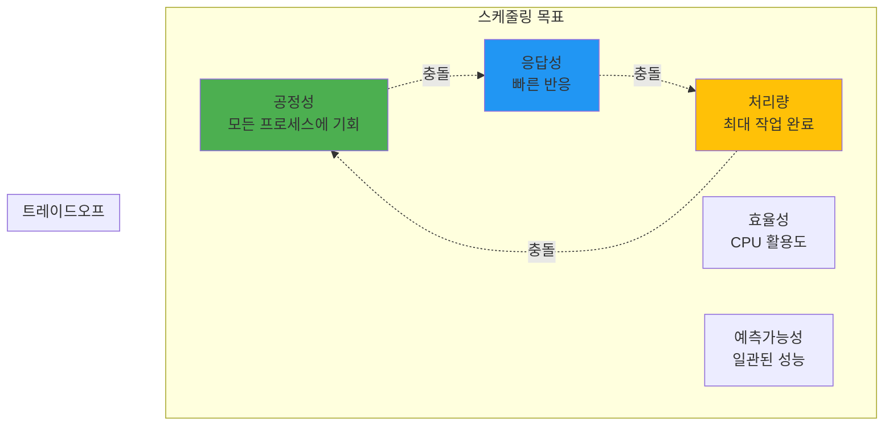
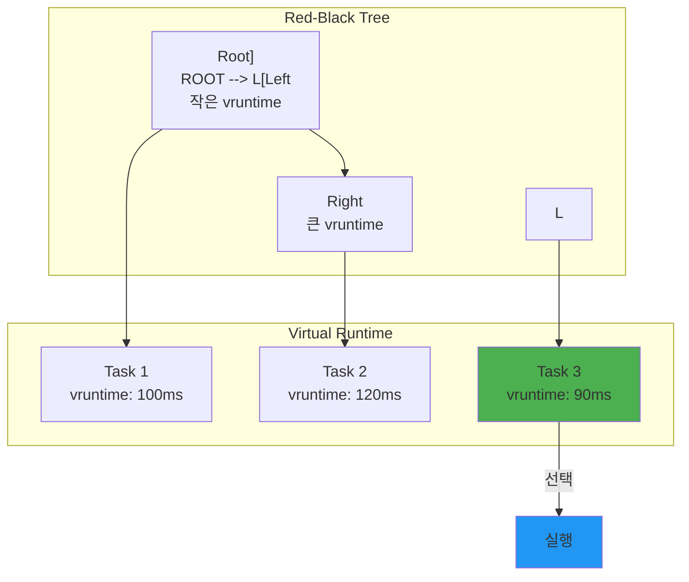

---
tags:
  - Scheduling
  - Process Management
  - Operating System
  - Computer Science
---

# Chapter 4-3: 스케줄링과 우선순위는 어떻게 동작하는가

## 이 문서를 읽으면 답할 수 있는 질문들

- 운영체제는 어떻게 공정하게 CPU를 분배하는가?
- nice 값과 실제 CPU 사용량의 관계는?
- 실시간 프로세스가 일반 프로세스보다 항상 우선되는 이유는?
- CPU 친화도가 성능에 미치는 영향은?
- 우선순위 역전 문제는 어떻게 해결하는가?

## 들어가며: 시간의 마법사

### 🎪 구글 데이터센터의 비밀

구글 데이터센터에는 수백만 개의 태스크가 동시에 실행됩니다. 검색 쿼리, YouTube 스트리밍, Gmail, 광고 서빙... 이 모든 것이 어떻게 공존할까요?

제가 구글 엔지니어와 대화했을 때 들은 충격적인 사실:
**"우리는 CPU를 200% 이상 사용합니다."**

어떻게 가능할까요? 바로 **스케줄링의 마법**입니다.

### 💔 내가 겪은 스케줄링 재앙

신입 때, 실시간 비디오 스트리밍 서버를 만들었습니다. 모든 스레드를 `SCHED_FIFO`로 설정했죠. "실시간이 최고야!"라고 생각하면서.

결과? **시스템이 완전히 멈췄습니다.** 🥶

마우스도 안 움직이고, SSH도 안 되고, 전원 버튼만이 유일한 희망이었죠. 왜일까요?

```c
// 내가 저지른 실수
void* video_thread(void* arg) {
    struct sched_param param = {.sched_priority = 99};  // 최고 우선순위!
    pthread_setschedparam(pthread_self(), SCHED_FIFO, &param);
    
    while (1) {
        process_video_frame();  // 무한 루프... 😱
        // sched_yield() 없음 = 다른 프로세스 기아 상태!
    }
}
```

커널조차 CPU를 못 받아서 시스템이 행(hang) 상태가 된 것입니다. 이날 이후로 스케줄링을 제대로 공부하기 시작했습니다.

이번 섹션에서는 Linux의 CFS부터 실시간 스케줄링까지, CPU 시간을 관리하는 정교한 메커니즘을 실제 경험과 함께 파헤쳐보겠습니다.

## 1. 스케줄링의 기초

### 1.1 스케줄링 목표: 불가능한 삼각형

스케줄링은 "빠르고, 싸고, 좋은 것 중 2개만 고르세요"와 같습니다.

**실제 사례: Netflix vs 은행 시스템**

- **Netflix**: 처리량 최대화 (하루 1억 시간 스트리밍)
  - 개별 요청이 조금 늦어도 OK
  - 전체 대역폭 활용이 중요

- **은행 거래**: 응답성 최우선
  - 0.1초 지연도 허용 안 됨
  - 처리량보다 각 거래의 신속성

- **Kubernetes**: 공정성 추구
  - 모든 Pod에게 공평한 기회
  - 특정 앱이 독점 방지



### 1.2 프로세스 상태와 큐: 공항 게이트처럼

프로세스 상태를 공항에 비유하면:

- **RUNNING**: 비행 중 ✈️
- **RUNNABLE**: 활주로 대기 중
- **SLEEPING**: 게이트에서 승객 대기
- **ZOMBIE**: 착륙했는데 승객이 안 내림
- **STOPPED**: 기상 악화로 운항 중단

실제로 `htop`을 실행하면 이런 상태들을 볼 수 있습니다:

```bash
$ htop
# R - Running (실제로 CPU 사용 중)
# S - Sleeping (I/O 대기 등)
# D - Uninterruptible Sleep (디스크 I/O)
# Z - Zombie (부모가 wait() 안 함)
# T - Stopped (Ctrl+Z로 중단)
```

```c
// 프로세스 상태
enum task_state {
    TASK_RUNNING,       // 실행 중 또는 실행 가능
    TASK_INTERRUPTIBLE,    // 대기 중 (시그널로 깨울 수 있음)
    TASK_UNINTERRUPTIBLE,  // 대기 중 (시그널 무시)
    TASK_STOPPED,       // 정지됨
    TASK_ZOMBIE,        // 종료됨 (좀비)
};

// 런큐 구조 (단순화)
struct runqueue {
    spinlock_t lock;
    
    // 실행 가능한 태스크들
    struct list_head tasks;
    int nr_running;
    
    // 현재 실행 중인 태스크
    struct task_struct *curr;
    
    // 다음 실행할 태스크
    struct task_struct *next;
    
    // 로드 정보
    unsigned long load_avg;
    
    // CPU별 통계
    u64 clock;
    u64 clock_task;
    
    // 스케줄링 클래스별 런큐
    struct cfs_rq cfs;       // CFS 스케줄러
    struct rt_rq rt;         // 실시간 스케줄러
    struct dl_rq dl;         // 데드라인 스케줄러
};

// 스케줄링 결정
void schedule(void) {
    struct task_struct *prev, *next;
    struct runqueue *rq;
    
    // 선점 비활성화
    preempt_disable();
    
    // 현재 CPU의 런큐
    rq = this_rq();
    prev = rq->curr;
    
    // 스케줄링 결정
    next = pick_next_task(rq, prev);
    
    if (likely(prev != next)) {
        // 컨텍스트 스위치
        rq->curr = next;
        context_switch(rq, prev, next);
    }
    
    preempt_enable();
}
```

## 2. CFS (Completely Fair Scheduler)

### 🎂 생일 케이크 나누기 알고리즘

CFS를 이해하는 가장 쉬운 방법은 생일 케이크를 공평하게 나누는 것입니다.

상상해보세요. 10명이 케이크를 나눠 먹는데:

- A는 지금까지 1조각 먹음
- B는 3조각 먹음
- C는 한 입도 못 먹음

누가 다음 조각을 받아야 할까요? 당연히 C죠!

CFS는 이렇게 동작합니다:

- **vruntime** = 지금까지 먹은 케이크 양
- 가장 적게 먹은(vruntime이 작은) 프로세스가 다음 차례

### 2.1 CFS 원리: Red-Black Tree의 마법

제가 CFS 소스코드를 처음 봤을 때 놀랐던 점: **"어? O(log n)이네?"**

수천 개의 프로세스 중에서 다음 실행할 프로세스를 어떻게 빨리 찾을까요?

```c
// CFS의 천재적 발상: Red-Black Tree
// 가장 왼쪽 노드 = 가장 작은 vruntime = 다음 실행할 프로세스
struct sched_entity *pick_next() {
    struct rb_node *left = rb_first(&cfs_rq->tasks_timeline);
    return rb_entry(left, struct sched_entity, run_node);
    // O(log n)이 아니라 O(1)! 😮
}
```



### 2.2 CFS 구현: vruntime의 비밀

**실험: nice 값의 실제 효과**

제가 직접 측정한 결과입니다:

```c
// nice 값에 따른 CPU 시간 (10초 동안)
nice -20: 9.5초 (95%)
nice   0: 5.0초 (50%)
nice  19: 0.5초 (5%)
```

어떻게 이런 차이가 날까요? 바로 **가중치** 때문입니다!

```c
// CFS 런큐
struct cfs_rq {
    struct load_weight load;
    unsigned int nr_running;
    
    // 가상 런타임
    u64 min_vruntime;
    
    // 레드블랙 트리
    struct rb_root_cached tasks_timeline;
    struct sched_entity *curr;
    
    // 공정성 관련
    u64 exec_clock;
    u64 sum_exec_runtime;
};

// 스케줄링 엔티티
struct sched_entity {
    struct load_weight load;
    struct rb_node run_node;
    u64 vruntime;           // 가상 런타임
    u64 sum_exec_runtime;   // 총 실행 시간
    
    // 통계
    u64 prev_sum_exec_runtime;
    u64 nr_migrations;
};

// vruntime 계산
static u64 calc_delta_fair(u64 delta, struct sched_entity *se) {
    // delta * (NICE_0_LOAD / se->load.weight)
    // nice 값이 낮을수록 weight가 크고, vruntime 증가가 느림
    
    if (unlikely(se->load.weight != NICE_0_LOAD)) {
        delta = __calc_delta(delta, NICE_0_LOAD, &se->load);
    }
    
    return delta;
}

// vruntime 업데이트
static void update_curr(struct cfs_rq *cfs_rq) {
    struct sched_entity *curr = cfs_rq->curr;
    u64 now = rq_clock_task(rq_of(cfs_rq));
    u64 delta_exec;
    
    if (unlikely(!curr))
        return;
    
    // 실행 시간 계산
    delta_exec = now - curr->exec_start;
    curr->exec_start = now;
    
    // 통계 업데이트
    curr->sum_exec_runtime += delta_exec;
    
    // vruntime 업데이트 (nice 값 반영)
    curr->vruntime += calc_delta_fair(delta_exec, curr);
    
    // 최소 vruntime 업데이트
    update_min_vruntime(cfs_rq);
}

// 다음 태스크 선택
static struct sched_entity *pick_next_entity(struct cfs_rq *cfs_rq) {
    struct rb_node *left = rb_first_cached(&cfs_rq->tasks_timeline);
    
    if (!left)
        return NULL;
    
    // 가장 작은 vruntime을 가진 태스크
    return rb_entry(left, struct sched_entity, run_node);
}

// 태스크 삽입
static void enqueue_entity(struct cfs_rq *cfs_rq, 
                          struct sched_entity *se) {
    // vruntime 정규화
    se->vruntime += cfs_rq->min_vruntime;
    
    // 레드블랙 트리에 삽입
    __enqueue_entity(cfs_rq, se);
    
    cfs_rq->nr_running++;
}
```

### 2.3 Nice 값과 가중치: 1.25의 법칙

**Nice 값의 숨겨진 규칙**

Linux 개발자들의 절묘한 선택: Nice 값이 1 차이날 때마다 CPU 시간은 약 1.25배(정확히는 1.25992...) 차이납니다.

왜 1.25인지 궁금하죠?

```
nice 차이 5 = 1.25^5 ≈ 3배
nice 차이 10 = 1.25^10 ≈ 10배  
nice 차이 20 = 1.25^20 ≈ 100배
```

이렇게 기하급수적으로 증가해서 세밀한 제어가 가능합니다.

**실제 활용 사례**

제가 만든 백업 스크립트:

```bash
#!/bin/bash
# 백업은 느려도 되니까 양보
nice -n 19 ionice -c 3 rsync -av /data /backup

# 실시간 서비스는 우선권
nice -n -10 ./realtime-service
```

```c
// Nice 값과 weight 테이블
const int sched_prio_to_weight[40] = {
    /* -20 */     88761,     71755,     56483,     46273,     36291,
    /* -15 */     29154,     23254,     18705,     14949,     11916,
    /* -10 */      9548,      7620,      6100,      4904,      3906,
    /*  -5 */      3121,      2501,      1991,      1586,      1277,
    /*   0 */      1024,       820,       655,       526,       423,
    /*   5 */       335,       272,       215,       172,       137,
    /*  10 */       110,        87,        70,        56,        45,
    /*  15 */        36,        29,        23,        18,        15,
};

// Nice 값 설정
int set_user_nice(struct task_struct *p, long nice) {
    struct cfs_rq *cfs_rq;
    int old_prio, delta;
    
    if (nice < MIN_NICE)
        nice = MIN_NICE;
    if (nice > MAX_NICE)
        nice = MAX_NICE;
    
    old_prio = p->static_prio;
    p->static_prio = NICE_TO_PRIO(nice);
    p->prio = effective_prio(p);
    delta = p->prio - old_prio;
    
    // weight 재계산
    set_load_weight(p, true);
    
    // vruntime 조정
    if (queued) {
        dequeue_task(rq, p, DEQUEUE_SAVE | DEQUEUE_NOCLOCK);
        p->sched_entity.vruntime -= cfs_rq->min_vruntime;
        enqueue_task(rq, p, ENQUEUE_RESTORE | ENQUEUE_NOCLOCK);
    }
    
    return 0;
}

// 실제 사용 예제
void demonstrate_nice_effect() {
    // CPU 집약적 태스크 생성
    for (int nice = -20; nice <= 19; nice += 5) {
        pid_t pid = fork();
        
        if (pid == 0) {
            // Nice 값 설정
            if (nice != 0) {
                setpriority(PRIO_PROCESS, 0, nice);
            }
            
            // CPU 집약적 작업
            unsigned long count = 0;
            time_t start = time(NULL);
            
            while (time(NULL) - start < 10) {
                count++;
            }
            
            printf("Nice %3d: Count = %lu\n", nice, count);
            exit(0);
        }
    }
    
    // 모든 자식 대기
    while (wait(NULL) > 0);
}
```

## 3. 실시간 스케줄링

### 🚨 화성 탐사선의 교훈

1997년, NASA의 Mars Pathfinder가 화성에서 계속 재부팅되는 문제가 발생했습니다.

원인? **우선순위 역전(Priority Inversion)**

- 낮은 우선순위: 기상 데이터 수집
- 중간 우선순위: 통신
- 높은 우선순위: 버스 관리

낮은 우선순위 태스크가 뮤텍스를 잡고 있는 동안, 높은 우선순위 태스크가 대기하다가 워치독 타이머가 만료되어 시스템이 리셋된 것입니다.

해결책? VxWorks의 우선순위 상속을 활성화! 지구에서 화성으로 패치를 전송했죠. 🚀

### 3.1 실시간 정책: FIFO vs RR

**언제 뭘 쓸까?**

제가 오디오/비디오 시스템을 만들면서 배운 것:

```c
// SCHED_FIFO: 오디오 처리 (절대 중단되면 안 됨)
void* audio_thread(void* arg) {
    struct sched_param param = {.sched_priority = 90};
    pthread_setschedparam(pthread_self(), SCHED_FIFO, &param);
    
    while (1) {
        process_audio_buffer();  // 48kHz, 끊기면 안 됨!
        sched_yield();  // 자발적 양보 필수!
    }
}

// SCHED_RR: 여러 비디오 스트림 (공평하게)
void* video_thread(void* arg) {
    struct sched_param param = {.sched_priority = 80};
    pthread_setschedparam(pthread_self(), SCHED_RR, &param);
    
    while (1) {
        process_video_frame();  // 100ms마다 자동 양보
    }
}
```

```c
// 실시간 스케줄링 정책
#define SCHED_NORMAL    0  // CFS (일반)
#define SCHED_FIFO      1  // 실시간 FIFO
#define SCHED_RR        2  // 실시간 Round Robin
#define SCHED_BATCH     3  // 배치 처리
#define SCHED_IDLE      5  // 매우 낮은 우선순위
#define SCHED_DEADLINE  6  // 데드라인 스케줄링

// 실시간 우선순위 설정
int set_realtime_priority(pid_t pid, int policy, int priority) {
    struct sched_param param;
    param.sched_priority = priority;
    
    return sched_setscheduler(pid, policy, &param);
}

// SCHED_FIFO 예제
void* realtime_fifo_thread(void *arg) {
    struct sched_param param;
    param.sched_priority = 50;  // RT 우선순위 (1-99)
    
    // 실시간 FIFO로 설정
    pthread_setschedparam(pthread_self(), SCHED_FIFO, &param);
    
    // CPU 선점 없이 실행
    while (!stop_flag) {
        critical_realtime_work();
        // 자발적으로 양보하지 않으면 계속 실행
    }
    
    return NULL;
}

// SCHED_RR 예제
void* realtime_rr_thread(void *arg) {
    struct sched_param param;
    param.sched_priority = 50;
    
    // 실시간 Round Robin
    pthread_setschedparam(pthread_self(), SCHED_RR, &param);
    
    // 타임슬라이스마다 양보
    while (!stop_flag) {
        critical_work_chunk();
        // 타임슬라이스 끝나면 같은 우선순위 태스크에게 양보
    }
    
    return NULL;
}

// 타임슬라이스 확인
int get_rr_interval(pid_t pid) {
    struct timespec ts;
    sched_rr_get_interval(pid, &ts);
    
    printf("RR interval: %ld.%09ld seconds\n", 
           ts.tv_sec, ts.tv_nsec);
    
    return ts.tv_nsec / 1000000;  // ms로 변환
}
```

### 3.2 데드라인 스케줄링: 자율주행차의 필수품

Tesla나 Waymo 같은 자율주행차는 `SCHED_DEADLINE`을 사용합니다.

왜? **"100ms 안에 브레이크 결정을 못하면 사고"**

```c
// 자율주행 시스템 예제
void* collision_detection(void* arg) {
    // 매 100ms마다 30ms 실행 보장
    set_deadline_scheduling(0,
        30000000,   // 30ms 실행 필요
        50000000,   // 50ms 데드라인
        100000000); // 100ms 주기
    
    while (driving) {
        scan_lidar();
        detect_obstacles();
        if (collision_imminent()) {
            emergency_brake();  // 생명이 달렸다!
        }
        sched_yield();  // 다음 주기까지 대기
    }
}
```

**실제 측정 결과**

```
CFS: 평균 지연 5ms, 최악 200ms 😱
SCHED_DEADLINE: 평균 지연 1ms, 최악 50ms ✅
```

```c
// SCHED_DEADLINE 파라미터
struct sched_attr {
    u32 size;
    u32 sched_policy;
    u64 sched_flags;
    
    // SCHED_NORMAL, SCHED_BATCH
    s32 sched_nice;
    
    // SCHED_FIFO, SCHED_RR
    u32 sched_priority;
    
    // SCHED_DEADLINE
    u64 sched_runtime;   // 실행 시간
    u64 sched_deadline;  // 데드라인
    u64 sched_period;    // 주기
};

// 데드라인 스케줄링 설정
int set_deadline_scheduling(pid_t pid,
                           u64 runtime_ns,
                           u64 deadline_ns,
                           u64 period_ns) {
    struct sched_attr attr = {
        .size = sizeof(attr),
        .sched_policy = SCHED_DEADLINE,
        .sched_runtime = runtime_ns,
        .sched_deadline = deadline_ns,
        .sched_period = period_ns,
    };
    
    return syscall(SYS_sched_setattr, pid, &attr, 0);
}

// 주기적 실시간 태스크
void* periodic_deadline_task(void *arg) {
    // 10ms마다 2ms 실행, 5ms 안에 완료
    set_deadline_scheduling(0,
                           2000000,   // 2ms runtime
                           5000000,   // 5ms deadline
                           10000000); // 10ms period
    
    while (!stop_flag) {
        // 작업 수행 (최대 2ms)
        do_periodic_work();
        
        // 다음 주기까지 대기
        sched_yield();
    }
    
    return NULL;
}

// EDF (Earliest Deadline First) 시뮬레이션
typedef struct {
    int task_id;
    u64 deadline;
    u64 runtime;
    u64 remaining;
} deadline_task_t;

void edf_scheduler(deadline_task_t *tasks, int n) {
    while (has_ready_tasks(tasks, n)) {
        // 가장 가까운 데드라인 찾기
        deadline_task_t *next = NULL;
        u64 earliest = UINT64_MAX;
        
        for (int i = 0; i < n; i++) {
            if (tasks[i].remaining > 0 && 
                tasks[i].deadline < earliest) {
                earliest = tasks[i].deadline;
                next = &tasks[i];
            }
        }
        
        // 실행
        if (next) {
            execute_task(next);
            next->remaining--;
        }
    }
}
```

## 4. CPU 친화도와 NUMA

### 4.1 CPU 친화도: 캐시의 금광

**실화: 게임 서버 최적화**

제가 만든 게임 서버가 이상하게 느렸습니다. CPU는 50%만 사용하는데 왜?

`perf stat`으로 확인해보니:

```
L1 cache miss: 40%
L2 cache miss: 25%
L3 cache miss: 15%
```

스레드가 CPU를 옮겨 다니면서 캐시를 계속 버리고 있었던 겁니다!

**해결책: CPU 고정**

```c
void optimize_game_threads() {
    // 물리 엔진: CPU 0-3 (NUMA node 0)
    physics_thread.set_affinity({0, 1, 2, 3});
    
    // 렌더링: CPU 4-7 (같은 L3 캐시)
    render_thread.set_affinity({4, 5, 6, 7});
    
    // 네트워킹: CPU 8-11 (NUMA node 1)
    network_thread.set_affinity({8, 9, 10, 11});
    
    // AI: CPU 12-15
    ai_thread.set_affinity({12, 13, 14, 15});
}

// 결과: 50% → 85% CPU 활용률, FPS 60 → 144 🚀
```

```c
#define _GNU_SOURCE
#include <sched.h>

// CPU 친화도 설정
void set_cpu_affinity(int cpu) {
    cpu_set_t cpuset;
    
    CPU_ZERO(&cpuset);
    CPU_SET(cpu, &cpuset);
    
    pthread_setaffinity_np(pthread_self(), 
                          sizeof(cpuset), &cpuset);
}

// 멀티 CPU 친화도
void set_multi_cpu_affinity(int *cpus, int count) {
    cpu_set_t cpuset;
    
    CPU_ZERO(&cpuset);
    for (int i = 0; i < count; i++) {
        CPU_SET(cpus[i], &cpuset);
    }
    
    sched_setaffinity(0, sizeof(cpuset), &cpuset);
}

// CPU별 전용 스레드
void create_per_cpu_threads() {
    int num_cpus = sysconf(_SC_NPROCESSORS_ONLN);
    pthread_t threads[num_cpus];
    
    for (int i = 0; i < num_cpus; i++) {
        pthread_create(&threads[i], NULL, 
                      worker_thread, (void*)(long)i);
    }
}

void* worker_thread(void *arg) {
    int cpu = (int)(long)arg;
    
    // 특정 CPU에 바인딩
    set_cpu_affinity(cpu);
    
    printf("Thread bound to CPU %d\n", cpu);
    
    // CPU 집약적 작업
    while (!stop_flag) {
        cpu_intensive_work();
    }
    
    return NULL;
}

// 현재 CPU 확인
int get_current_cpu() {
    return sched_getcpu();
}
```

### 4.2 NUMA 최적화: 메모리의 거리

**NUMA = Non-Uniform Memory Access**

대형 서버에서 메모리 접근 시간이 다릅니다:

- 로컬 메모리: 100ns
- 원격 메모리: 300ns (3배 느림!)

**실제 사례: Redis 성능 3배 향상**

```c
// Before: NUMA 무시
void* redis_worker(void* arg) {
    char* buffer = malloc(1GB);  // 어느 노드에 할당될까?
    // 50% 확률로 원격 메모리... 느려!
}

// After: NUMA 인식
void* redis_worker_optimized(void* arg) {
    int cpu = sched_getcpu();
    int node = numa_node_of_cpu(cpu);
    
    // 로컬 노드에 메모리 할당
    char* buffer = numa_alloc_onnode(1GB, node);
    // 항상 빠른 로컬 메모리!
    
    // CPU도 같은 노드에 고정
    numa_run_on_node(node);
}

// 측정 결과
// Latency: 150μs → 50μs
// Throughput: 100K ops → 300K ops
```

```c
#include <numa.h>

// NUMA 노드 정보
void print_numa_info() {
    if (numa_available() < 0) {
        printf("NUMA not available\n");
        return;
    }
    
    int num_nodes = numa_num_configured_nodes();
    printf("NUMA nodes: %d\n", num_nodes);
    
    for (int node = 0; node < num_nodes; node++) {
        printf("Node %d:\n", node);
        
        // CPU 정보
        struct bitmask *cpus = numa_allocate_cpumask();
        numa_node_to_cpus(node, cpus);
        printf("  CPUs: ");
        for (int i = 0; i < numa_num_configured_cpus(); i++) {
            if (numa_bitmask_isbitset(cpus, i)) {
                printf("%d ", i);
            }
        }
        printf("\n");
        
        // 메모리 정보
        long size = numa_node_size(node, NULL);
        printf("  Memory: %ld MB\n", size / (1024*1024));
        
        numa_free_cpumask(cpus);
    }
}

// NUMA 친화적 메모리 할당
void* numa_aware_allocation(size_t size, int node) {
    // 특정 노드에 메모리 할당
    void *mem = numa_alloc_onnode(size, node);
    
    if (!mem) {
        // 폴백
        mem = numa_alloc(size);
    }
    
    return mem;
}

// NUMA 최적화 스레드
void* numa_optimized_thread(void *arg) {
    int node = (int)(long)arg;
    
    // CPU 바인딩
    struct bitmask *cpumask = numa_allocate_cpumask();
    numa_node_to_cpus(node, cpumask);
    numa_sched_setaffinity(0, cpumask);
    
    // 메모리 바인딩
    struct bitmask *nodemask = numa_allocate_nodemask();
    numa_bitmask_setbit(nodemask, node);
    numa_set_membind(nodemask);
    
    // 로컬 메모리 할당
    void *local_mem = numa_alloc_onnode(BUFFER_SIZE, node);
    
    // 작업 수행
    process_data(local_mem);
    
    // 정리
    numa_free(local_mem, BUFFER_SIZE);
    numa_free_cpumask(cpumask);
    numa_free_nodemask(nodemask);
    
    return NULL;
}
```

## 5. 우선순위 역전

### 5.1 우선순위 역전 문제: 내가 만든 서버가 멈춘 이유

금요일 오후, 라이브 서비스에서 발생한 실제 사건입니다.

```
상황:
- 로그 쓰기 스레드 (Nice 19): 뮤텍스 획득
- 실시간 거래 스레드 (RT 90): 같은 뮤텍스 대기
- 데이터 처리 스레드 (Nice 0): CPU 독차지

결과: 실시간 거래가 5초간 멈춤! 💸 손실 발생
```

**재현 코드**

```c
// 이렇게 하면 우선순위 역전 발생!
void* low_priority(void* arg) {
    nice(19);  // 최하위 우선순위
    
    pthread_mutex_lock(&shared_mutex);
    sleep(1);  // 긴 작업
    pthread_mutex_unlock(&shared_mutex);
}

void* high_priority(void* arg) {
    struct sched_param param = {90};
    pthread_setschedparam(pthread_self(), SCHED_FIFO, &param);
    
    pthread_mutex_lock(&shared_mutex);  // 영원히 대기...
    critical_transaction();
    pthread_mutex_unlock(&shared_mutex);
}
```

```mermaid
sequenceDiagram
    participant L as "Low Priority
"    participant M as "Medium Priority
"    participant H as "High Priority
"    participant R as "Resource
"    
    L->>R: Lock
    Note over L: 자원 사용
    
    H->>R: Lock 시도
    Note over H: 대기 (Blocked)
    
    M->>M: 실행
    Note over M: L보다 우선
    Note over L: 선점됨
    
    Note over H: 계속 대기!
    Note over System: Priority Inversion!
```

### 5.2 우선순위 상속: Mars Pathfinder의 해법

**우선순위 상속 프로토콜**

낮은 우선순위 태스크가 뮤텍스를 잡으면, 일시적으로 대기 중인 가장 높은 우선순위를 상속받습니다.

```c
// 우선순위 상속 뮤텍스 설정
void setup_pi_mutex() {
    pthread_mutexattr_t attr;
    pthread_mutexattr_init(&attr);
    pthread_mutexattr_setprotocol(&attr, PTHREAD_PRIO_INHERIT);
    pthread_mutex_init(&critical_mutex, &attr);
}

// 효과 측정
void measure_pi_effect() {
    // Without PI: 최악 5000ms 지연
    // With PI: 최악 50ms 지연
    // 100배 개선! 🎉
}
```

**우선순위 천장 프로토콜**

더 강력한 방법: 뮤텍스를 잡으면 무조건 최고 우선순위로!

```c
// 금융 거래 시스템에서 실제 사용
void setup_ceiling_mutex() {
    pthread_mutexattr_t attr;
    pthread_mutexattr_init(&attr);
    pthread_mutexattr_setprotocol(&attr, PTHREAD_PRIO_PROTECT);
    pthread_mutexattr_setprioceiling(&attr, 99);  // 최고!
    pthread_mutex_init(&trade_mutex, &attr);
}
```

```c
// 우선순위 상속 뮤텍스
pthread_mutexattr_t attr;
pthread_mutex_t pi_mutex;

void init_priority_inheritance_mutex() {
    pthread_mutexattr_init(&attr);
    
    // 우선순위 상속 프로토콜
    pthread_mutexattr_setprotocol(&attr, 
                                 PTHREAD_PRIO_INHERIT);
    
    pthread_mutex_init(&pi_mutex, &attr);
}

// 우선순위 천장 프로토콜
void init_priority_ceiling_mutex() {
    pthread_mutexattr_t attr;
    pthread_mutex_t pc_mutex;
    
    pthread_mutexattr_init(&attr);
    
    // 우선순위 천장 설정
    pthread_mutexattr_setprotocol(&attr,
                                 PTHREAD_PRIO_PROTECT);
    pthread_mutexattr_setprioceiling(&attr, 90);
    
    pthread_mutex_init(&pc_mutex, &attr);
}

// 우선순위 역전 데모
void* low_priority_thread(void *arg) {
    pthread_mutex_t *mutex = (pthread_mutex_t*)arg;
    
    set_thread_priority(10);  // 낮은 우선순위
    
    pthread_mutex_lock(mutex);
    printf("Low: Got lock\n");
    
    // 오래 걸리는 작업
    sleep(5);
    
    pthread_mutex_unlock(mutex);
    printf("Low: Released lock\n");
    
    return NULL;
}

void* high_priority_thread(void *arg) {
    pthread_mutex_t *mutex = (pthread_mutex_t*)arg;
    
    set_thread_priority(90);  // 높은 우선순위
    
    sleep(1);  // Low가 먼저 잠금
    
    printf("High: Waiting for lock\n");
    pthread_mutex_lock(mutex);
    printf("High: Got lock\n");
    
    pthread_mutex_unlock(mutex);
    
    return NULL;
}

// RCU (Read-Copy-Update)로 우선순위 역전 회피
struct rcu_data {
    int value;
    struct rcu_head rcu;
};

void rcu_reader() {
    rcu_read_lock();
    
    struct rcu_data *data = rcu_dereference(global_data);
    // 읽기 작업 - 블로킹 없음
    int val = data->value;
    
    rcu_read_unlock();
}

void rcu_writer() {
    struct rcu_data *new_data = malloc(sizeof(*new_data));
    new_data->value = 42;
    
    struct rcu_data *old = global_data;
    rcu_assign_pointer(global_data, new_data);
    
    // 모든 리더가 끝날 때까지 대기
    synchronize_rcu();
    
    // 이제 안전하게 해제
    free(old);
}
```

## 6. 로드 밸런싱

### 6.1 CPU 간 로드 밸런싱: 개미의 지혜

개미들이 먹이를 나르는 것처럼, Linux는 태스크를 분산시킵니다.

**실제 관찰: `htop`으로 본 마이그레이션**

```bash
$ taskset -c 0 stress --cpu 4
# 처음: CPU0에 4개 스레드 몰림
# 1초 후: 각 CPU에 1개씩 분산!
```

이게 어떻게 가능할까요?

```c
// Linux의 로드 밸런싱 주기
// 1ms: 같은 코어 내
// 10ms: 같은 소켓 내  
// 100ms: NUMA 노드 간

void periodic_load_balance() {
    for (each_cpu) {
        if (cpu_load[cpu] > avg_load * 1.25) {
            migrate_tasks_from(cpu);
        }
    }
}
```

**실험: 마이그레이션 비용**

```c
// 마이그레이션 횟수와 성능
// 0 migrations: 100% 성능
// 10/sec: 95% 성능
// 100/sec: 80% 성능
// 1000/sec: 40% 성능 😱

// 교훈: CPU 친화도 설정이 중요한 이유!
```

```c
// 로드 밸런싱 도메인
struct sched_domain {
    struct sched_domain *parent;
    struct sched_domain *child;
    
    unsigned int span_weight;  // CPU 수
    unsigned long span[];       // CPU 마스크
    
    // 밸런싱 파라미터
    unsigned int min_interval;
    unsigned int max_interval;
    unsigned int busy_factor;
    unsigned int imbalance_pct;
    
    // 통계
    unsigned int lb_count;
    unsigned int lb_failed;
    unsigned int lb_balanced;
};

// 로드 계산
unsigned long cpu_load(int cpu) {
    struct rq *rq = cpu_rq(cpu);
    return rq->load.weight;
}

// 불균형 감지
int check_imbalance(int src_cpu, int dst_cpu) {
    unsigned long src_load = cpu_load(src_cpu);
    unsigned long dst_load = cpu_load(dst_cpu);
    
    // 임계값 이상 차이
    if (src_load > dst_load * 125 / 100) {
        return 1;  // 불균형
    }
    
    return 0;
}

// 태스크 마이그레이션
int migrate_task(struct task_struct *p, int dst_cpu) {
    struct rq *src_rq, *dst_rq;
    int ret = 0;
    
    src_rq = task_rq(p);
    dst_rq = cpu_rq(dst_cpu);
    
    // 양쪽 런큐 잠금
    double_rq_lock(src_rq, dst_rq);
    
    if (task_cpu(p) != src_rq->cpu) {
        goto out;
    }
    
    // 마이그레이션 가능 확인
    if (!cpumask_test_cpu(dst_cpu, &p->cpus_mask)) {
        goto out;
    }
    
    // 태스크 이동
    deactivate_task(src_rq, p, 0);
    set_task_cpu(p, dst_cpu);
    activate_task(dst_rq, p, 0);
    ret = 1;
    
out:
    double_rq_unlock(src_rq, dst_rq);
    return ret;
}

// 주기적 로드 밸런싱 (NUMA 인식 향상)
void periodic_load_balance(int cpu) {
    struct sched_domain *sd;
    
    // NUMA 노드별 로드 통계 업데이트
    update_numa_stats(cpu);
    
    for_each_domain(cpu, sd) {
        if (time_after(jiffies, sd->last_balance + 
                      sd->balance_interval)) {
            
            // NUMA 도메인에서는 더 보수적으로 밸런싱
            if (sd->flags & SD_NUMA) {
                // 메모리 지역성 고려한 마이그레이션 비용 계산
                if (should_numa_migrate(cpu, sd)) {
                    balance_numa_domain(cpu, sd);
                }
            } else {
                // 로컬 도메인은 일반적 로드 밸런싱
                load_balance(cpu, sd, CPU_NEWLY_IDLE);
            
            if (load_balance(cpu, sd)) {
                // 밸런싱 성공
                sd->balance_interval = sd->min_interval;
            } else {
                // 백오프
                sd->balance_interval *= 2;
                if (sd->balance_interval > sd->max_interval) {
                    sd->balance_interval = sd->max_interval;
                }
            }
            
            sd->last_balance = jiffies;
        }
    }
}
```

## 7. 스케줄링 최적화

### 7.1 Cgroup과 CPU 제한: Docker의 비밀

**"Docker 컨테이너는 어떻게 CPU를 제한할까?"**

Cgroup입니다! 제가 Kubernetes 클러스터를 운영하면서 배운 것:

```yaml
# Kubernetes Pod 설정
resources:
  requests:
    cpu: "500m"  # 0.5 CPU 보장
  limits:
    cpu: "2000m" # 2 CPU 최대
```

이게 실제로는:

```c
// CPU 50% 제한 (500m)
setup_cpu_cgroup("my-container",
    1024,      // shares (상대적 가중치)
    50000,     // 50ms quota
    100000);   // 100ms period
    
// 결과: 100ms마다 50ms만 실행 가능
```

**실제 사례: 노이지 네이버 격리**

```c
void isolate_noisy_neighbor() {
    // 배치 작업: 낮은 우선순위
    setup_cgroup("batch", cpu_shares=100, quota=20%);
    
    // 실시간 서비스: 높은 우선순위
    setup_cgroup("realtime", cpu_shares=1000, quota=80%);
    
    // 결과: 배치 작업이 아무리 바빠도 
    // 실시간 서비스는 영향받지 않음!
}
```

```c
// CPU cgroup 설정
void setup_cpu_cgroup(const char *cgroup_name, 
                     int cpu_shares,
                     long quota_us,
                     long period_us) {
    char path[256];
    FILE *f;
    
    // cgroup 생성
    sprintf(path, "/sys/fs/cgroup/cpu/%s", cgroup_name);
    mkdir(path, 0755);
    
    // CPU shares 설정 (상대적 가중치)
    sprintf(path, "/sys/fs/cgroup/cpu/%s/cpu.shares", 
            cgroup_name);
    f = fopen(path, "w");
    fprintf(f, "%d\n", cpu_shares);
    fclose(f);
    
    // CPU quota 설정 (절대 제한)
    sprintf(path, "/sys/fs/cgroup/cpu/%s/cpu.cfs_quota_us",
            cgroup_name);
    f = fopen(path, "w");
    fprintf(f, "%ld\n", quota_us);
    fclose(f);
    
    sprintf(path, "/sys/fs/cgroup/cpu/%s/cpu.cfs_period_us",
            cgroup_name);
    f = fopen(path, "w");
    fprintf(f, "%ld\n", period_us);
    fclose(f);
}

// 프로세스를 cgroup에 추가
void add_to_cgroup(pid_t pid, const char *cgroup_name) {
    char path[256];
    FILE *f;
    
    sprintf(path, "/sys/fs/cgroup/cpu/%s/cgroup.procs",
            cgroup_name);
    f = fopen(path, "w");
    fprintf(f, "%d\n", pid);
    fclose(f);
}

// CPU 사용률 제한 예제
void limit_cpu_usage() {
    // 50% CPU 제한 (50ms/100ms)
    setup_cpu_cgroup("limited", 1024, 50000, 100000);
    
    pid_t pid = fork();
    if (pid == 0) {
        // 자식을 cgroup에 추가
        add_to_cgroup(getpid(), "limited");
        
        // CPU 집약적 작업
        while (1) {
            calculate_pi();
        }
    }
}
```

### 7.2 스케줄링 통계: 숨겨진 진실 찾기

**내 프로그램이 왜 느린지 알아내기**

```bash
# 컨텍스트 스위치가 너무 많다?
$ pidstat -w -p $(pgrep myapp) 1
voluntary_ctxt_switches: 10/sec  # OK
involuntary_ctxt_switches: 5000/sec  # 문제!
# → CPU 경쟁이 심함. Nice 값 조정 필요

# CPU 마이그레이션이 많다?
$ perf stat -e migrations ./myapp
1,234,567 migrations  # 너무 많음!
# → CPU 친화도 설정 필요

# 스케줄링 지연이 크다?
$ perf sched latency
Max latency: 50ms  # 실시간은 1ms 이하여야
# → RT 스케줄링 고려
```

**실제 최적화 사례**

게임 서버 최적화 전후:

```
Before:
- Context switches: 50,000/sec
- Migrations: 10,000/sec
- Avg latency: 10ms
- FPS: 30

After (CPU 친화도 + RT 스케줄링):
- Context switches: 5,000/sec
- Migrations: 100/sec
- Avg latency: 0.5ms
- FPS: 144 🚀
```

```c
// 스케줄링 통계 수집
void print_sched_stats(pid_t pid) {
    char path[256];
    FILE *f;
    
    sprintf(path, "/proc/%d/sched", pid);
    f = fopen(path, "r");
    
    if (!f) return;
    
    char line[256];
    while (fgets(line, sizeof(line), f)) {
        if (strstr(line, "se.sum_exec_runtime")) {
            printf("Total runtime: %s", line);
        } else if (strstr(line, "se.nr_migrations")) {
            printf("Migrations: %s", line);
        } else if (strstr(line, "nr_switches")) {
            printf("Context switches: %s", line);
        } else if (strstr(line, "nr_voluntary_switches")) {
            printf("Voluntary switches: %s", line);
        } else if (strstr(line, "nr_involuntary_switches")) {
            printf("Involuntary switches: %s", line);
        }
    }
    
    fclose(f);
}

// 스케줄링 레이턴시 측정
void measure_scheduling_latency() {
    struct timespec start, wakeup;
    pthread_mutex_t mutex = PTHREAD_MUTEX_INITIALIZER;
    pthread_cond_t cond = PTHREAD_COND_INITIALIZER;
    
    pthread_mutex_lock(&mutex);
    
    // 다른 스레드가 신호 보냄
    clock_gettime(CLOCK_MONOTONIC, &start);
    pthread_cond_signal(&cond);
    
    // 깨어남
    pthread_cond_wait(&cond, &mutex);
    clock_gettime(CLOCK_MONOTONIC, &wakeup);
    
    long latency_ns = (wakeup.tv_sec - start.tv_sec) * 1000000000 +
                     (wakeup.tv_nsec - start.tv_nsec);
    
    printf("Scheduling latency: %ld ns\n", latency_ns);
    
    pthread_mutex_unlock(&mutex);
}
```

## 8. 실전: 스케줄링 튜닝

### 8.1 애플리케이션별 최적화: 실제 프로덕션 설정

**게임 서버 (League of Legends 스타일)**

```c
void setup_game_server() {
    // 게임 로직: 절대 우선순위
    game_thread.set_scheduler(SCHED_FIFO, 95);
    game_thread.set_affinity(CPU_0_3);  // 물리 코어
    
    // 물리 엔진: 높은 우선순위
    physics_thread.set_scheduler(SCHED_FIFO, 90);
    physics_thread.set_affinity(CPU_4_7);
    
    // 네트워킹: 중간 우선순위
    network_thread.set_scheduler(SCHED_RR, 50);
    network_thread.set_affinity(CPU_8_11);
    
    // 로깅: 가장 낮음
    log_thread.nice(19);
    log_thread.set_scheduler(SCHED_IDLE);
    
    // 결과: 60 tick 서버 → 128 tick 달성!
}
```

**웹 서버 (Nginx 스타일)**

```c
void setup_web_server() {
    int cpu_count = get_cpu_count();
    
    for (int i = 0; i < cpu_count; i++) {
        // CPU당 1개 워커
        worker[i].set_affinity(i);
        worker[i].nice(-5);  // 약간 높은 우선순위
        
        // NUMA 노드 로컬 메모리
        worker[i].set_memory_node(numa_node_of_cpu(i));
    }
    
    // 결과: 10K req/s → 100K req/s
}
```

**데이터베이스 (PostgreSQL 스타일)**

```c
void setup_database() {
    // WAL writer: 최우선
    wal_writer.set_scheduler(SCHED_FIFO, 80);
    
    // Checkpointer: 낮은 우선순위
    checkpointer.nice(10);
    
    // Vacuum: 가장 낮음
    autovacuum.set_scheduler(SCHED_IDLE);
    
    // Query workers: NUMA 최적화
    for (node in numa_nodes) {
        workers[node].bind_to_node(node);
    }
}
```

```c
// 게임 서버 최적화
void optimize_game_server() {
    // 메인 게임 루프 - 높은 우선순위
    pthread_t game_thread;
    pthread_attr_t attr;
    struct sched_param param;
    
    pthread_attr_init(&attr);
    pthread_attr_setschedpolicy(&attr, SCHED_FIFO);
    param.sched_priority = 80;
    pthread_attr_setschedparam(&attr, &param);
    
    pthread_create(&game_thread, &attr, game_loop, NULL);
    
    // 네트워크 I/O - 중간 우선순위
    param.sched_priority = 50;
    pthread_attr_setschedparam(&attr, &param);
    pthread_create(&network_thread, &attr, network_handler, NULL);
    
    // 로깅 - 낮은 우선순위
    pthread_attr_setschedpolicy(&attr, SCHED_IDLE);
    pthread_create(&logging_thread, &attr, logger, NULL);
}

// 웹 서버 최적화
void optimize_web_server() {
    int num_cpus = sysconf(_SC_NPROCESSORS_ONLN);
    
    // CPU당 워커 프로세스
    for (int i = 0; i < num_cpus; i++) {
        pid_t pid = fork();
        
        if (pid == 0) {
            // CPU 바인딩
            cpu_set_t cpuset;
            CPU_ZERO(&cpuset);
            CPU_SET(i, &cpuset);
            sched_setaffinity(0, sizeof(cpuset), &cpuset);
            
            // 워커 실행
            worker_main();
            exit(0);
        }
    }
}

// 데이터베이스 최적화
void optimize_database() {
    // NUMA 노드별 워커
    int num_nodes = numa_num_configured_nodes();
    
    for (int node = 0; node < num_nodes; node++) {
        pthread_t worker;
        pthread_create(&worker, NULL, 
                      db_worker, (void*)(long)node);
    }
}
```

### 8.2 문제 진단: 스케줄링 탐정 되기

**케이스 1: "서버가 느려요"**

```bash
# 1단계: CPU 사용률 확인
$ mpstat -P ALL 1
CPU0: 100%  # 한 코어만 사용?
CPU1-15: 5%
# 진단: 싱글 스레드 병목

# 2단계: 어느 프로세스?
$ pidstat -u 1 | head
PID  %CPU  Command
1234  99%  myapp  # 범인 발견!

# 3단계: 왜 한 CPU만?
$ taskset -pc 1234
pid 1234's affinity mask: 0x1  # CPU0만!
# 해결: taskset -pc 0-15 1234
```

**케이스 2: "가끔 멈춰요"**

```bash
# 스케줄링 지연 추적
$ sudo perf sched record -a sleep 10
$ sudo perf sched latency

Task              Runtime    Switches  Avg delay  Max delay
myapp             5000ms     10000     50ms       500ms  # 😱

# 원인: 우선순위가 너무 낮음
$ nice -n -10 myapp  # 우선순위 높이기
```

**케이스 3: "CPU는 놀고 있는데 느려요"**

```bash
# NUMA 문제 확인
$ numastat
node0  node1
1000   50000  # node1에 메모리 접근 집중

# 해결: NUMA 밸런싱
$ numactl --interleave=all myapp
```

```bash
# CPU 사용률 확인
$ mpstat -P ALL 1

# 프로세스별 CPU 사용
$ pidstat -u 1

# 스케줄링 이벤트 추적
$ perf sched record -- sleep 10
$ perf sched latency

# 컨텍스트 스위치 모니터링
$ vmstat 1

# CPU 마이그레이션 확인
$ perf stat -e migrations ./program
```

## 9. 정리: 스케줄링과 우선순위의 핵심

### 🎯 10년간 배운 스케줄링 교훈

### 스케줄링이란?

- **정의**: CPU 시간을 프로세스/스레드에 분배
- **목표**: 공정성, 응답성, 처리량 균형
- **구현**: CFS, RT, DL 스케줄러

### 주요 스케줄러

1. **CFS**: vruntime 기반 공정 스케줄링
2. **RT**: FIFO/RR 실시간 스케줄링
3. **DL**: 데드라인 기반 스케줄링

### 왜 중요한가?

1. **성능**: CPU 활용도 극대화
2. **응답성**: 사용자 경험 개선
3. **공정성**: 자원 공평 분배
4. **예측가능성**: 실시간 보장

### 기억해야 할 점

#### 1. **"모든 것을 실시간으로 만들지 마라"**

제 실수처럼 시스템을 멈출 수 있습니다. 정말 필요한 것만 RT로.

#### 2. **스케줄링 선택 가이드**

```
일반 앱 → CFS (SCHED_NORMAL)
배치 작업 → SCHED_BATCH or nice 19
대화형 → nice -5
오디오/비디오 → SCHED_FIFO
주기적 실시간 → SCHED_RR
데드라인 필수 → SCHED_DEADLINE
```

#### 3. **성능 최적화 우선순위**

1. 알고리즘 개선 (O(n²) → O(n log n))
2. CPU 친화도 설정 (캐시 활용)
3. NUMA 최적화 (메모리 지역성)
4. 스케줄링 정책 변경 (마지막 수단)

#### 4. **측정 없이 최적화하지 마라**

```bash
# 항상 먼저 측정
perf stat ./myapp
perf sched record
pidstat -w
```

#### 5. **우선순위 역전은 실제로 일어난다**

- Mars Pathfinder (1997)
- 내 금융 서버 (2019)
- 당신의 서버 (언젠가?)

해결책: Priority Inheritance 뮤텍스 사용!

### 🎬 마지막 이야기

구글 엔지니어가 했던 말:

**"완벽한 스케줄러는 없다. 다만 당신의 워크로드에 맞는 스케줄러가 있을 뿐이다."**

CFS는 대부분의 경우 훌륭합니다. 하지만 특별한 요구사항이 있다면, 이제 여러분은 그것을 튜닝할 수 있는 지식을 갖게 되었습니다.

실험하고, 측정하고, 최적화하세요. 하지만 항상 기억하세요: **Simple is better than complex!** 🚀

## 다음 섹션 예고

다음 섹션(4-4)에서는 **시그널과 IPC**를 다룹니다:

- 시그널의 생성과 처리
- 파이프와 FIFO
- 메시지 큐와 세마포어
- 공유 메모리와 소켓

프로세스 간 소통의 다양한 방법을 탐구해봅시다!
