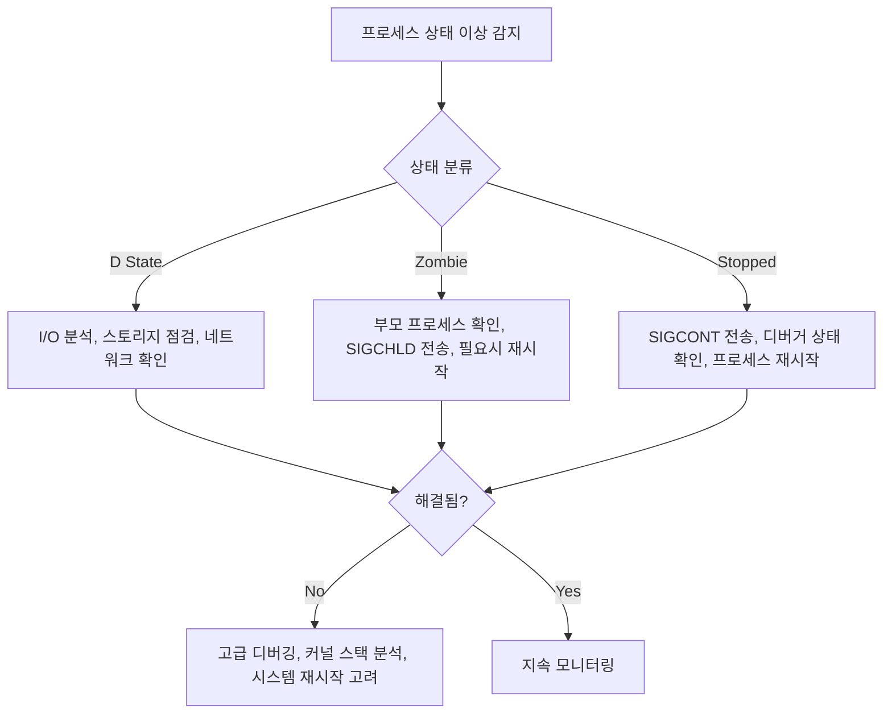

---
tags:
  - Process
  - ProcessState
  - Debugging
  - UninterruptibleSleep
  - Zombie
  - Overview
---

# 4-5: 프로세스 상태 분석 개요

## 🎯 프로세스 상태 분석의 중요성

"시스템이 멈춘 것 같은데 CPU나 메모리는 정상이에요..."

이런 미스터리한 상황의 원인은 종종 **프로세스 상태 이상**입니다. 특히 D state(uninterruptible sleep)는 시스템을 마비시킬 수 있는 위험한 상태이며, zombie 프로세스는 시스템 리소스를 낭비합니다. 체계적인 프로세스 상태 분석 능력은 시스템 안정성 유지의 핵심입니다.

## 📚 학습 로드맵

이 섹션은 4개의 전문화된 문서로 구성되어 있습니다:

### 1️⃣ [프로세스 상태 기초 분석](05a-process-state-fundamentals.md)

- Linux 프로세스 상태 전체 목록과 의미
- /proc/[pid]/stat 파일 파싱과 해석
- /proc/[pid]/status 정보 활용법
- 실시간 프로세스 상태 모니터링 도구

### 2️⃣ [D State 프로세스 디버깅](05b-dstate-debugging.md)

- D state 발생 원인 심층 분석
- I/O 행업 문제 진단 방법
- 커널 스택 추적과 디버깅 기법
- D state 프로세스 해결 전략

### 3️⃣ [Zombie 프로세스 처리](05c-zombie-process-handling.md)

- Zombie 프로세스 발생 메커니즘
- 부모-자식 프로세스 관계 분석
- 자동 Zombie 정리 시스템 구축
- 프로세스 테이블 관리 최적화

### 4️⃣ [Process Accounting 활용](05d-process-accounting.md)

- Process accounting 설정과 활성화
- 프로세스 실행 기록 분석
- 보안 감사와 성능 추적
- 통합 모니터링 시스템 구축

## 🎯 핵심 개념 비교표

| 프로세스 상태 | 특징 | 위험도 | 해결 방법 |
|-------------|------|--------|----------|
| **R (Running)** | CPU 실행 중/대기 | 낮음 | 정상 상태 |
| **S (Sleep)** | 신호로 깨울 수 있음 | 낮음 | 정상 상태 |
| **D (Uninterruptible)** | I/O 대기, kill -9 무효 | 높음 | I/O 문제 해결 |
| **Z (Zombie)** | 정리되지 않은 종료 | 중간 | 부모 프로세스 처리 |
| **T (Stopped)** | 신호로 정지됨 | 중간 | SIGCONT 전송 |

## 🚀 실전 활용 시나리오

### 서버 성능 저하 상황

- **증상**: 시스템이 느려지지만 CPU/메모리는 정상
- **원인**: D state 프로세스가 파일 잠금 보유
- **접근법**: [D State 디버깅](05b-dstate-debugging.md)으로 I/O 병목 해결

### 메모리 누수 의심 상황

- **증상**: 프로세스 수는 증가하지만 실제 작업은 없음
- **원인**: Zombie 프로세스 누적
- **접근법**: [Zombie 처리](05c-zombie-process-handling.md)로 자동 정리 시스템 구축

### 보안 감사 요구 상황

- **증상**: 시스템에서 실행된 프로세스 기록 필요
- **원인**: 감사 로그 부재
- **접근법**: [Process Accounting](05d-process-accounting.md)으로 완전한 추적 시스템

## 🎭 학습 전략

### 초보자 (추천 순서)

1. [프로세스 상태 기초](05a-process-state-fundamentals.md) → /proc 파일시스템 이해
2. [Zombie 처리](05c-zombie-process-handling.md) → 간단한 문제부터 해결
3. 간단한 모니터링 스크립트 작성 연습

### 중급자 (심화 학습)

1. [D State 디버깅](05b-dstate-debugging.md) → 복잡한 I/O 문제 해결
2. [Process Accounting](05d-process-accounting.md) → 시스템 감사 마스터
3. 실제 프로덕션 환경 모니터링 시스템 구축

### 고급자 (실무 전문가)

- 모든 문서를 통합하여 엔터프라이즈급 프로세스 관리 시스템 설계
- 커널 소스 분석을 통한 프로세스 상태 전환 메커니즘 이해
- 성능 최적화와 보안 감사를 위한 맞춤형 도구 개발

## 🔗 연관 학습

### 선행 학습

- [프로세스 생성](01-process-creation.md) - 프로세스 생명주기 이해
- [스레드 동기화](02-thread-sync.md) - 프로세스 간 협력 메커니즘
- [스케줄링](03-scheduling.md) - 프로세스 상태 전환 원리

### 후속 학습

- [스레드 동기화 디버깅](06-thread-synchronization-debugging.md) - 동기화 문제 진단
- [CPU 아키텍처](../chapter-05-cpu-interrupt/01-cpu-architecture.md) - 하드웨어 수준의 프로세스 지원
- [파일 I/O](../chapter-06-file-io/01-file-descriptor.md) - D state의 주요 원인인 I/O 이해

```mermaid
stateDiagram-v2
    [*] --> R : fork/exec
    R --> S : sleep() / wait()
    S --> R : signal / event
    R --> Z : exit()
    S --> D : I/O wait
    D --> R : I/O complete
    D --> [*] : kill -9 fails!
    Z --> [*] : parent wait()

    state R {
        Running
        --
        CPU에서 실행 중이거나
        실행 대기 중
    }

    state S {
        Interruptible_Sleep
        --
        신호로 깨울 수 있음
        일반적인 대기 상태
    }

    state D {
        Uninterruptible_Sleep
        --
        신호로 깨울 수 없음
        I/O 작업 대기 중
        ⚠️ 위험한 상태
    }

    state Z {
        Zombie
        --
        종료됐지만 정리 안됨
        부모 프로세스 대기 중
    }
```

## 상황별 대응 전략

## 📋 프로세스 상태 관리 체크리스트

**모니터링 설정**:

- [ ] 실시간 프로세스 상태 모니터링 시스템 구축
- [ ] D state 프로세스 조기 경고 설정
- [ ] Zombie 프로세스 자동 정리 스크립트 배포
- [ ] Process accounting 활성화

**문제 대응**:

- [ ] D state 프로세스 디버깅 절차 수립
- [ ] I/O 성능 저하 대응 프로세스 정의
- [ ] 부모 프로세스 관리 가이드라인 작성
- [ ] 비상 시 시스템 복구 절차 준비

---

**다음**: [프로세스 상태 기초 분석](05a-process-state-fundamentals.md)에서 /proc 파일시스템과 프로세스 상태 파싱을 마스터해봅시다.
