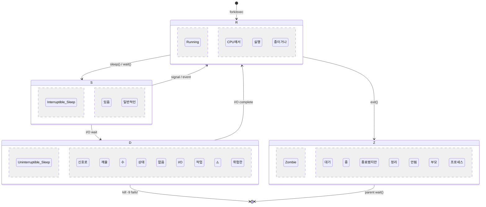
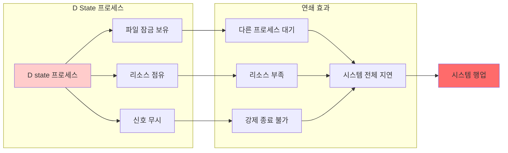
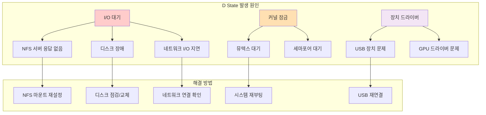
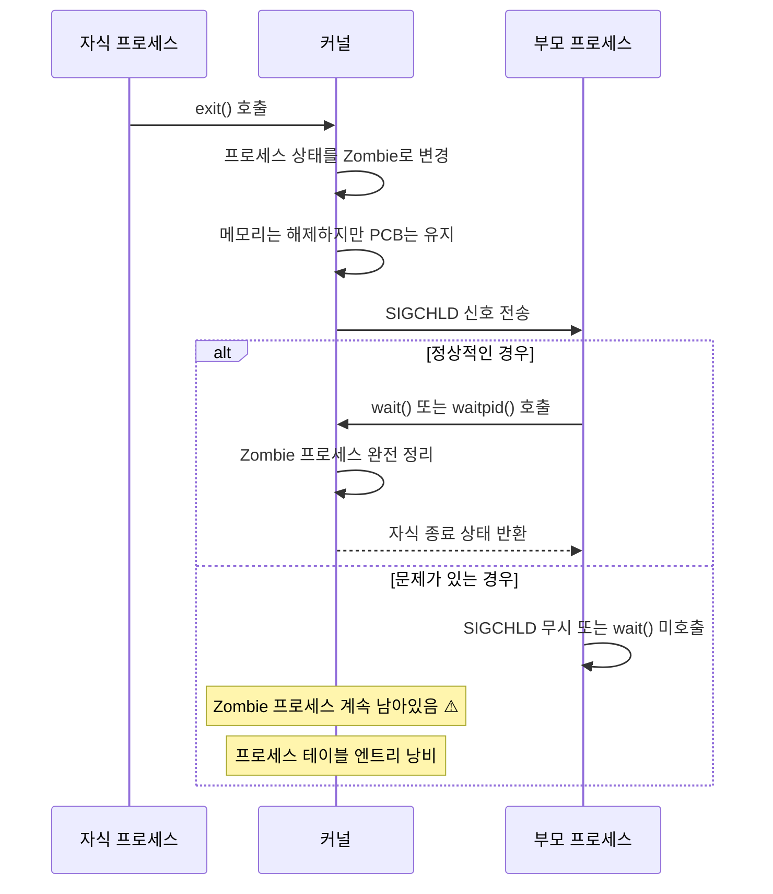
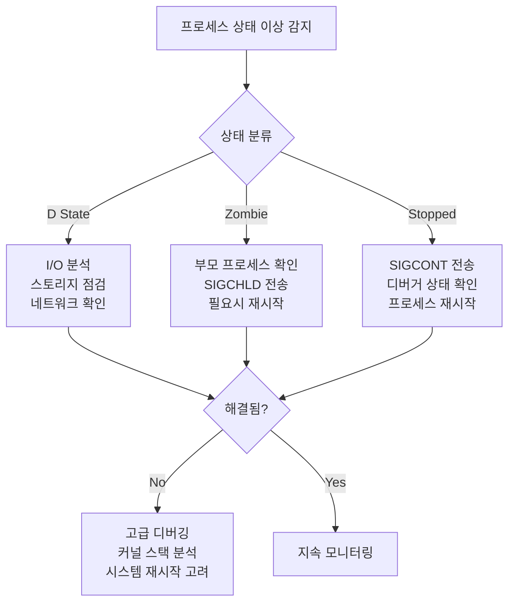

---
tags:
  - Process
  - ProcessState
  - Debugging
  - UninterruptibleSleep
  - Zombie
---

# 4-5: 프로세스 상태 분석 - "프로세스가 D state에 걸렸어요"

## 이 문서를 읽으면 답할 수 있는 질문들

- 프로세스 D state가 무엇이고 왜 위험한가요?
- /proc/[pid]/stat과 status 정보를 어떻게 해석하나요?
- zombie와 defunct 프로세스는 어떻게 처리하나요?
- process accounting으로 무엇을 알 수 있나요?
- 프로세스 상태 이상을 어떻게 조기에 감지하나요?

## 들어가며: 보이지 않는 프로세스 문제들

"시스템이 멈춘 것 같은데 CPU나 메모리는 정상이에요..."

이런 미스터리한 상황의 원인은 종종 **프로세스 상태 이상**입니다. 특히 D state(uninterruptible sleep)는 시스템을 마비시킬 수 있는 위험한 상태입니다.



### 프로세스 상태 이상이 시스템에 미치는 영향



## 1. 프로세스 상태 완전 분석

### 1.1 Linux 프로세스 상태 전체 목록

```bash
# 모든 프로세스 상태 확인
$ ps axo pid,ppid,state,comm | head -20

# 상태별 설명:
# R - Running (실행 중)
# S - Interruptible sleep (인터럽트 가능한 대기)
# D - Uninterruptible sleep (인터럽트 불가능한 대기) ⚠️
# T - Stopped (정지됨, SIGSTOP)
# t - Tracing stop (디버거에 의해 추적 중)
# Z - Zombie (좀비 프로세스) ⚠️
# X - Dead (죽음, ps에서 보이지 않음)
# I - Idle (유휴 상태, 커널 스레드)
```

### 1.2 /proc/[pid]/stat 상세 분석

각 필드가 무엇을 의미하는지 정확히 알아봅시다:

```c
// process_stat_analyzer.c
#include <stdio.h>
#include <stdlib.h>
#include <string.h>
#include <unistd.h>
#include <time.h>

typedef struct {
    int pid;
    char comm[256];
    char state;
    int ppid;
    int pgrp;
    int session;
    int tty_nr;
    int tpgid;
    unsigned long flags;
    unsigned long minflt;      // minor page faults
    unsigned long cminflt;     // children minor faults
    unsigned long majflt;      // major page faults
    unsigned long cmajflt;     // children major faults
    unsigned long utime;       // user mode time
    unsigned long stime;       // kernel mode time
    long cutime;               // children user time
    long cstime;               // children system time
    long priority;
    long nice;
    long num_threads;
    long itrealvalue;
    unsigned long long starttime;
    unsigned long vsize;       // virtual memory size
    long rss;                  // resident set size
    unsigned long rsslim;      // RSS limit
    // ... 더 많은 필드들
} proc_stat_t;

const char* state_description(char state) {
    switch (state) {
        case 'R': return "Running (실행 중)";
        case 'S': return "Interruptible sleep (신호로 깨울 수 있는 대기)";
        case 'D': return "Uninterruptible sleep (⚠️ 위험: 신호로 깨울 수 없음)";
        case 'T': return "Stopped (정지됨)";
        case 't': return "Tracing stop (디버거 추적 중)";
        case 'Z': return "Zombie (⚠️ 정리 필요)";
        case 'X': return "Dead (종료됨)";
        case 'I': return "Idle (유휴 상태)";
        default: return "Unknown";
    }
}

int parse_proc_stat(int pid, proc_stat_t *stat_info) {
    char path[256];
    snprintf(path, sizeof(path), "/proc/%d/stat", pid);
    
    FILE *f = fopen(path, "r");
    if (!f) {
        return -1;
    }
    
    // /proc/pid/stat 파싱 (comm에 공백이 있을 수 있으므로 주의)
    int ret = fscanf(f, "%d (%255[^)]) %c %d %d %d %d %d %lu %lu %lu %lu %lu %lu %lu %ld %ld %ld %ld %ld %ld %llu %lu %ld %lu",
        &stat_info->pid,
        stat_info->comm,
        &stat_info->state,
        &stat_info->ppid,
        &stat_info->pgrp,
        &stat_info->session,
        &stat_info->tty_nr,
        &stat_info->tpgid,
        &stat_info->flags,
        &stat_info->minflt,
        &stat_info->cminflt,
        &stat_info->majflt,
        &stat_info->cmajflt,
        &stat_info->utime,
        &stat_info->stime,
        &stat_info->cutime,
        &stat_info->cstime,
        &stat_info->priority,
        &stat_info->nice,
        &stat_info->num_threads,
        &stat_info->itrealvalue,
        &stat_info->starttime,
        &stat_info->vsize,
        &stat_info->rss,
        &stat_info->rsslim
    );
    
    fclose(f);
    return (ret == 25) ? 0 : -1;
}

void print_process_analysis(const proc_stat_t *stat) {
    printf("=== 프로세스 상태 분석 ===\n");
    printf("PID: %d\n", stat->pid);
    printf("명령어: %s\n", stat->comm);
    printf("상태: %c (%s)\n", stat->state, state_description(stat->state));
    printf("부모 PID: %d\n", stat->ppid);
    printf("스레드 수: %ld\n", stat->num_threads);
    printf("우선순위: %ld (nice: %ld)\n", stat->priority, stat->nice);
    
    // 메모리 정보
    printf("\n=== 메모리 정보 ===\n");
    printf("가상 메모리: %.1f MB\n", stat->vsize / 1024.0 / 1024.0);
    printf("물리 메모리: %.1f MB\n", stat->rss * 4 / 1024.0);  // 페이지 크기 4KB 가정
    
    // 페이지 폴트 정보
    printf("\n=== 페이지 폴트 통계 ===\n");
    printf("Minor faults: %lu\n", stat->minflt);
    printf("Major faults: %lu\n", stat->majflt);
    printf("자식 minor faults: %lu\n", stat->cminflt);
    printf("자식 major faults: %lu\n", stat->cmajflt);
    
    // CPU 시간 정보
    long hz = sysconf(_SC_CLK_TCK);
    printf("\n=== CPU 시간 정보 ===\n");
    printf("사용자 모드: %.2f초\n", (double)stat->utime / hz);
    printf("커널 모드: %.2f초\n", (double)stat->stime / hz);
    printf("총 CPU 시간: %.2f초\n", (double)(stat->utime + stat->stime) / hz);
    
    // 경고 메시지
    if (stat->state == 'D') {
        printf("\n⚠️  경고: 프로세스가 D state입니다!\n");
        printf("   - I/O 작업을 기다리고 있습니다.\n");
        printf("   - 신호로 종료할 수 없습니다.\n");
        printf("   - 시스템 성능에 영향을 줄 수 있습니다.\n");
    } else if (stat->state == 'Z') {
        printf("\n⚠️  경고: 좀비 프로세스입니다!\n");
        printf("   - 부모 프로세스가 wait()를 호출하지 않았습니다.\n");
        printf("   - 프로세스 테이블 엔트리를 차지하고 있습니다.\n");
    }
}

void monitor_process_state(int pid, int duration) {
    printf("프로세스 %d 상태 모니터링 시작 (%d초간)...\n", pid, duration);
    
    time_t start_time = time(NULL);
    char last_state = 0;
    
    while (time(NULL) - start_time < duration) {
        proc_stat_t stat;
        if (parse_proc_stat(pid, &stat) == 0) {
            if (stat.state != last_state) {
                printf("[%s] 상태 변화: %c (%s)\n", 
                       ctime(&(time_t){time(NULL)}),
                       stat.state, 
                       state_description(stat.state));
                last_state = stat.state;
                
                // 위험한 상태 감지
                if (stat.state == 'D') {
                    printf("⚠️  D state 감지! I/O 대기 중...\n");
                }
            }
        } else {
            printf("프로세스 %d가 종료되었습니다.\n", pid);
            break;
        }
        
        sleep(1);
    }
}

int main(int argc, char *argv[]) {
    if (argc < 2) {
        printf("사용법: %s <pid> [monitor_duration]\n", argv[0]);
        printf("예시: %s 1234\n", argv[0]);
        printf("예시: %s 1234 60  # 60초간 모니터링\n", argv[0]);
        return 1;
    }
    
    int pid = atoi(argv[1]);
    
    if (argc == 2) {
        // 한 번만 분석
        proc_stat_t stat;
        if (parse_proc_stat(pid, &stat) == 0) {
            print_process_analysis(&stat);
        } else {
            printf("프로세스 %d의 정보를 읽을 수 없습니다.\n", pid);
            return 1;
        }
    } else {
        // 지속적 모니터링
        int duration = atoi(argv[2]);
        monitor_process_state(pid, duration);
    }
    
    return 0;
}
```

### 1.3 /proc/[pid]/status 정보 활용

status 파일은 stat보다 읽기 쉬운 형태로 정보를 제공합니다:

```bash
#!/bin/bash
# process_status_analyzer.sh

analyze_process_status() {
    local pid=$1
    local status_file="/proc/$pid/status"
    
    if [ ! -f "$status_file" ]; then
        echo "프로세스 $pid를 찾을 수 없습니다."
        return 1
    fi
    
    echo "=== 프로세스 $pid 상세 분석 ==="
    
    # 기본 정보
    echo "== 기본 정보 =="
    grep -E "^(Name|State|Pid|PPid|Tgid|Threads)" "$status_file"
    
    # 메모리 정보
    echo -e "\n== 메모리 정보 =="
    grep -E "^(VmPeak|VmSize|VmLck|VmPin|VmHWM|VmRSS|VmData|VmStk|VmExe|VmLib|VmPTE|VmSwap)" "$status_file"
    
    # 신호 정보
    echo -e "\n== 신호 정보 =="
    grep -E "^(SigQ|SigPnd|ShdPnd|SigBlk|SigIgn|SigCgt)" "$status_file"
    
    # 권한 정보
    echo -e "\n== 권한 정보 =="
    grep -E "^(Uid|Gid|Groups)" "$status_file"
    
    # 상태별 분석
    local state=$(grep "^State:" "$status_file" | awk '{print $2}')
    
    case $state in
        "D")
            echo -e "\n⚠️  D STATE 감지!"
            echo "현재 프로세스가 I/O 작업을 기다리고 있습니다."
            echo "관련 정보를 확인해보겠습니다..."
            
            # 열린 파일 확인
            echo -e "\n열린 파일들:"
            lsof -p "$pid" 2>/dev/null | head -10
            
            # I/O 통계
            if [ -f "/proc/$pid/io" ]; then
                echo -e "\nI/O 통계:"
                cat "/proc/$pid/io"
            fi
            
            # 스택 트레이스 (root 권한 필요)
            if [ -f "/proc/$pid/stack" ] && [ -r "/proc/$pid/stack" ]; then
                echo -e "\n커널 스택 트레이스:"
                cat "/proc/$pid/stack"
            fi
            ;;
            
        "Z")
            echo -e "\n⚠️  ZOMBIE 프로세스 감지!"
            echo "부모 프로세스 정보:"
            local ppid=$(grep "^PPid:" "$status_file" | awk '{print $2}')
            if [ -f "/proc/$ppid/comm" ]; then
                echo "부모 PID $ppid: $(cat /proc/$ppid/comm)"
                echo "부모 프로세스에 SIGCHLD 신호를 보내거나 재시작을 고려하세요."
            fi
            ;;
            
        "T")
            echo -e "\n⚠️  정지된 프로세스 감지!"
            echo "SIGCONT 신호로 재시작할 수 있습니다: kill -CONT $pid"
            ;;
    esac
}

# 시스템 전체 프로세스 상태 요약
system_process_summary() {
    echo "=== 시스템 프로세스 상태 요약 ==="
    
    ps axo state | tail -n +2 | sort | uniq -c | while read count state; do
        echo "$count 개 프로세스: $state ($(
            case $state in
                R*) echo "Running" ;;
                S*) echo "Sleeping" ;;
                D*) echo "⚠️ Uninterruptible Sleep" ;;
                T*) echo "⚠️ Stopped" ;;
                Z*) echo "⚠️ Zombie" ;;
                I*) echo "Idle" ;;
                *) echo "기타" ;;
            esac
        ))"
    done
    
    # 문제가 있는 프로세스들 상세 분석
    echo -e "\n=== 문제 프로세스 분석 ==="
    
    # D state 프로세스들
    local d_processes=$(ps axo pid,state,comm | awk '$2 ~ /^D/ {print $1}')
    if [ -n "$d_processes" ]; then
        echo "⚠️ D state 프로세스들:"
        echo "$d_processes" | while read pid; do
            if [ -n "$pid" ]; then
                echo "  PID $pid: $(cat /proc/$pid/comm 2>/dev/null || echo 'unknown')"
            fi
        done
    fi
    
    # Zombie 프로세스들
    local zombie_processes=$(ps axo pid,state,comm | awk '$2 ~ /^Z/ {print $1}')
    if [ -n "$zombie_processes" ]; then
        echo "⚠️ Zombie 프로세스들:"
        echo "$zombie_processes" | while read pid; do
            if [ -n "$pid" ]; then
                echo "  PID $pid: $(cat /proc/$pid/comm 2>/dev/null || echo 'unknown')"
            fi
        done
    fi
}

# 메뉴
if [ $# -eq 0 ]; then
    echo "프로세스 상태 분석 도구"
    echo "1) 특정 프로세스 분석: $0 <pid>"
    echo "2) 시스템 전체 요약: $0 summary"
    exit 1
fi

if [ "$1" = "summary" ]; then
    system_process_summary
else
    analyze_process_status "$1"
fi
```

## 2. D State 프로세스 심층 분석

### 2.1 D State의 원인과 해결 방법

D state는 보통 다음과 같은 상황에서 발생합니다:



### 2.2 D State 프로세스 디버깅 도구

```python
#!/usr/bin/env python3
# dstate_debugger.py
import os
import time
import subprocess
import psutil
from collections import defaultdict

class DStateDebugger:
    def __init__(self):
        self.dstate_processes = {}
        self.io_patterns = defaultdict(list)
        
    def find_dstate_processes(self):
        """D state 프로세스 찾기"""
        dstate_pids = []
        
        for proc in psutil.process_iter(['pid', 'name', 'status']):
            try:
                if proc.info['status'] == psutil.STATUS_DISK_SLEEP:
                    dstate_pids.append(proc.info['pid'])
            except (psutil.NoSuchProcess, psutil.AccessDenied):
                continue
                
        return dstate_pids
    
    def analyze_dstate_process(self, pid):
        """D state 프로세스 상세 분석"""
        try:
            proc = psutil.Process(pid)
            info = {
                'pid': pid,
                'name': proc.name(),
                'cmdline': ' '.join(proc.cmdline()),
                'create_time': proc.create_time(),
                'open_files': [],
                'connections': [],
                'io_counters': None,
                'kernel_stack': None
            }
            
            # 열린 파일들
            try:
                info['open_files'] = [f.path for f in proc.open_files()]
            except (psutil.AccessDenied, psutil.NoSuchProcess):
                pass
            
            # 네트워크 연결
            try:
                info['connections'] = proc.connections()
            except (psutil.AccessDenied, psutil.NoSuchProcess):
                pass
            
            # I/O 카운터
            try:
                info['io_counters'] = proc.io_counters()
            except (psutil.AccessDenied, psutil.NoSuchProcess):
                pass
            
            # 커널 스택 (root 권한 필요)
            try:
                with open(f'/proc/{pid}/stack', 'r') as f:
                    info['kernel_stack'] = f.read().strip()
            except (PermissionError, FileNotFoundError):
                pass
            
            return info
            
        except psutil.NoSuchProcess:
            return None
    
    def get_io_statistics(self, pid):
        """프로세스 I/O 통계"""
        try:
            with open(f'/proc/{pid}/io', 'r') as f:
                io_stats = {}
                for line in f:
                    key, value = line.strip().split(': ')
                    io_stats[key] = int(value)
                return io_stats
        except (FileNotFoundError, PermissionError, ValueError):
            return None
    
    def detect_io_hang_cause(self, process_info):
        """I/O 행업 원인 추정"""
        causes = []
        
        # NFS 마운트 점검
        nfs_files = [f for f in process_info['open_files'] 
                    if any(nfs_path in f for nfs_path in ['/nfs', '/net', ':'])]
        if nfs_files:
            causes.append(f"NFS 파일 접근: {nfs_files[:3]}")
        
        # 네트워크 I/O 확인
        if process_info['connections']:
            causes.append(f"네트워크 연결: {len(process_info['connections'])}개")
        
        # 디스크 I/O 패턴
        if process_info['io_counters']:
            io = process_info['io_counters']
            if io.read_bytes > 100 * 1024 * 1024:  # 100MB 이상
                causes.append(f"대용량 읽기: {io.read_bytes / 1024 / 1024:.1f}MB")
            if io.write_bytes > 100 * 1024 * 1024:
                causes.append(f"대용량 쓰기: {io.write_bytes / 1024 / 1024:.1f}MB")
        
        # 커널 스택 분석
        if process_info['kernel_stack']:
            stack = process_info['kernel_stack']
            if 'nfs' in stack.lower():
                causes.append("NFS 관련 커널 호출")
            elif 'block' in stack.lower():
                causes.append("블록 I/O 대기")
            elif 'network' in stack.lower() or 'tcp' in stack.lower():
                causes.append("네트워크 I/O 대기")
        
        return causes
    
    def monitor_dstate_processes(self, duration=300, interval=5):
        """D state 프로세스 모니터링"""
        print(f"D state 프로세스 모니터링 시작 ({duration}초간, {interval}초 간격)")
        print("=" * 80)
        
        start_time = time.time()
        
        while time.time() - start_time < duration:
            dstate_pids = self.find_dstate_processes()
            
            if dstate_pids:
                print(f"\n[{time.strftime('%H:%M:%S')}] D state 프로세스 감지: {len(dstate_pids)}개")
                
                for pid in dstate_pids:
                    info = self.analyze_dstate_process(pid)
                    if info:
                        print(f"\n⚠️  PID {pid}: {info['name']}")
                        print(f"   명령어: {info['cmdline'][:80]}...")
                        print(f"   실행 시간: {time.time() - info['create_time']:.1f}초")
                        
                        # I/O 원인 분석
                        causes = self.detect_io_hang_cause(info)
                        if causes:
                            print(f"   추정 원인: {', '.join(causes)}")
                        
                        # 열린 파일 표시
                        if info['open_files']:
                            print(f"   열린 파일: {len(info['open_files'])}개")
                            for f in info['open_files'][:3]:
                                print(f"     - {f}")
                        
                        # 커널 스택 일부 표시
                        if info['kernel_stack']:
                            stack_lines = info['kernel_stack'].split('\n')[:3]
                            print(f"   커널 스택:")
                            for line in stack_lines:
                                print(f"     {line}")
                        
                        # 해결 제안
                        self.suggest_solutions(info)
                        
            else:
                print(f"[{time.strftime('%H:%M:%S')}] D state 프로세스 없음")
            
            time.sleep(interval)
    
    def suggest_solutions(self, process_info):
        """해결 방법 제안"""
        suggestions = []
        
        # NFS 관련
        nfs_files = [f for f in process_info['open_files'] 
                    if any(nfs_path in f for nfs_path in ['/nfs', '/net', ':'])]
        if nfs_files:
            suggestions.append("NFS 서버 연결 상태 확인")
            suggestions.append("NFS 마운트 재설정 고려")
        
        # 디스크 I/O
        if process_info['io_counters']:
            suggestions.append("디스크 상태 점검 (dmesg, smartctl)")
            suggestions.append("I/O 스케줄러 확인")
        
        # 네트워크
        if process_info['connections']:
            suggestions.append("네트워크 연결 상태 확인")
            suggestions.append("방화벽 설정 점검")
        
        if suggestions:
            print(f"   제안 해결책:")
            for suggestion in suggestions[:3]:
                print(f"     • {suggestion}")

def check_system_io_health():
    """시스템 I/O 상태 전반적 점검"""
    print("=== 시스템 I/O 상태 점검 ===")
    
    # 디스크 I/O 통계
    print("\n1. 디스크 I/O 통계:")
    try:
        result = subprocess.run(['iostat', '-x', '1', '1'], 
                              capture_output=True, text=True, timeout=10)
        print(result.stdout)
    except (subprocess.TimeoutExpired, FileNotFoundError):
        print("iostat을 사용할 수 없습니다.")
    
    # NFS 마운트 상태
    print("\n2. NFS 마운트 상태:")
    try:
        with open('/proc/mounts', 'r') as f:
            for line in f:
                if 'nfs' in line:
                    print(f"   {line.strip()}")
    except FileNotFoundError:
        print("NFS 마운트 정보를 읽을 수 없습니다.")
    
    # 메모리 압박 상태
    print("\n3. 메모리 상태:")
    mem = psutil.virtual_memory()
    print(f"   사용률: {mem.percent:.1f}%")
    print(f"   사용 가능: {mem.available / 1024 / 1024 / 1024:.1f}GB")
    
    if mem.percent > 90:
        print("   ⚠️ 메모리 부족으로 인한 스왑 I/O 가능성")

if __name__ == "__main__":
    import sys
    
    debugger = DStateDebugger()
    
    if len(sys.argv) > 1 and sys.argv[1] == "check":
        check_system_io_health()
    else:
        try:
            debugger.monitor_dstate_processes(duration=300, interval=10)
        except KeyboardInterrupt:
            print("\n모니터링 중단됨")
```

## 3. Zombie 프로세스 처리

### 3.1 Zombie 프로세스 발생 원리



### 3.2 Zombie 프로세스 청소 도구

```bash
#!/bin/bash
# zombie_cleaner.sh

echo "=== Zombie 프로세스 청소 도구 ==="

# Zombie 프로세스 찾기
find_zombies() {
    local zombies=$(ps axo pid,ppid,state,comm | awk '$3 ~ /^Z/ {print $1 ":" $2 ":" $4}')
    
    if [ -z "$zombies" ]; then
        echo "Zombie 프로세스가 없습니다."
        return 0
    fi
    
    echo "발견된 Zombie 프로세스들:"
    echo "PID:PPID:명령어"
    echo "==================="
    echo "$zombies"
    
    return 1
}

# 부모 프로세스별 Zombie 그룹화
analyze_zombie_parents() {
    echo -e "\n=== 부모 프로세스별 Zombie 분석 ==="
    
    ps axo pid,ppid,state,comm | awk '$3 ~ /^Z/' | while read pid ppid state comm; do
        echo "Zombie PID $pid (부모: $ppid, 명령어: $comm)"
        
        if [ -f "/proc/$ppid/comm" ]; then
            parent_comm=$(cat "/proc/$ppid/comm" 2>/dev/null)
            echo "  부모 프로세스: $parent_comm"
            
            # 부모 프로세스 상태 확인
            parent_state=$(ps -p "$ppid" -o state --no-headers 2>/dev/null)
            echo "  부모 상태: $parent_state"
            
            # 부모 프로세스의 신호 처리 상태
            if [ -f "/proc/$ppid/status" ]; then
                echo "  부모 신호 처리:"
                grep -E "^Sig(Ign|Cgt):" "/proc/$ppid/status" | head -2
            fi
        else
            echo "  ⚠️ 부모 프로세스를 찾을 수 없습니다 (이미 종료됨?)"
        fi
        echo ""
    done
}

# Zombie 프로세스 청소 시도
cleanup_zombies() {
    echo "=== Zombie 프로세스 청소 시도 ==="
    
    local cleaned=0
    local failed=0
    
    ps axo pid,ppid,state,comm | awk '$3 ~ /^Z/' | while read pid ppid state comm; do
        echo "Zombie 프로세스 정리 시도: PID $pid (부모: $ppid)"
        
        if [ -d "/proc/$ppid" ]; then
            # 부모 프로세스가 살아있는 경우
            echo "  부모 프로세스에 SIGCHLD 전송..."
            kill -CHLD "$ppid" 2>/dev/null
            
            sleep 1
            
            # 정리됐는지 확인
            if [ ! -d "/proc/$pid" ]; then
                echo "  ✅ 정리 완료"
                ((cleaned++))
            else
                echo "  ❌ 정리 실패 - 부모 프로세스 재시작 필요할 수 있음"
                ((failed++))
                
                # 부모 프로세스 정보 표시
                echo "     부모 프로세스 재시작 명령어:"
                parent_cmdline=$(tr '\0' ' ' < "/proc/$ppid/cmdline" 2>/dev/null)
                echo "     $parent_cmdline"
            fi
        else
            # 부모 프로세스가 없는 경우 (고아 프로세스)
            echo "  ⚠️ 부모 프로세스가 없습니다. init이 정리해야 합니다."
            ((failed++))
        fi
    done
    
    echo -e "\n정리 결과: 성공 $cleaned개, 실패 $failed개"
    
    if [ $failed -gt 0 ]; then
        echo "정리되지 않은 Zombie가 있습니다. 다음 방법을 시도해보세요:"
        echo "1. 부모 프로세스 재시작"
        echo "2. 시스템 재부팅 (최후의 수단)"
    fi
}

# 시스템 리소스 영향 분석
analyze_zombie_impact() {
    echo "=== Zombie 프로세스 시스템 영향 분석 ==="
    
    local zombie_count=$(ps axo state | grep -c '^Z')
    local total_processes=$(ps ax | wc -l)
    local max_processes=$(cat /proc/sys/kernel/pid_max)
    
    echo "총 프로세스 수: $total_processes"
    echo "Zombie 프로세스 수: $zombie_count"
    echo "최대 프로세스 수: $max_processes"
    
    if [ $zombie_count -gt 0 ]; then
        local zombie_percent=$((zombie_count * 100 / total_processes))
        echo "Zombie 비율: $zombie_percent%"
        
        if [ $zombie_percent -gt 5 ]; then
            echo "⚠️ Zombie 프로세스 비율이 높습니다!"
        fi
        
        # 프로세스 테이블 사용률
        local usage_percent=$((total_processes * 100 / max_processes))
        echo "프로세스 테이블 사용률: $usage_percent%"
        
        if [ $usage_percent -gt 80 ]; then
            echo "⚠️ 프로세스 테이블 사용률이 높습니다!"
        fi
    fi
}

# 자동 Zombie 모니터링
monitor_zombies() {
    local duration=${1:-300}  # 기본 5분
    local interval=${2:-10}   # 기본 10초
    
    echo "Zombie 프로세스 모니터링 시작 ($duration초간, $interval초 간격)"
    
    local start_time=$(date +%s)
    local end_time=$((start_time + duration))
    
    while [ $(date +%s) -lt $end_time ]; do
        local current_time=$(date "+%H:%M:%S")
        local zombie_count=$(ps axo state | grep -c '^Z')
        
        if [ $zombie_count -gt 0 ]; then
            echo "[$current_time] ⚠️ Zombie 프로세스 $zombie_count개 감지"
            ps axo pid,ppid,comm | grep '^[[:space:]]*[0-9][[:space:]]*[0-9][[:space:]]*Z'
        else
            echo "[$current_time] Zombie 프로세스 없음"
        fi
        
        sleep $interval
    done
}

# 메뉴
echo "1) Zombie 프로세스 찾기"
echo "2) 부모 프로세스별 분석"
echo "3) Zombie 정리 시도"
echo "4) 시스템 영향 분석"
echo "5) 모니터링 시작"
echo "6) 종료"

read -p "선택하세요 (1-6): " choice

case $choice in
    1)
        find_zombies
        ;;
    2)
        analyze_zombie_parents
        ;;
    3)
        cleanup_zombies
        ;;
    4)
        analyze_zombie_impact
        ;;
    5)
        read -p "모니터링 시간 (초, 기본 300): " duration
        read -p "체크 간격 (초, 기본 10): " interval
        monitor_zombies ${duration:-300} ${interval:-10}
        ;;
    6)
        echo "종료합니다."
        ;;
    *)
        echo "잘못된 선택입니다."
        exit 1
        ;;
esac
```

## 4. Process Accounting 활용

### 4.1 Process Accounting 설정

```bash
#!/bin/bash
# setup_process_accounting.sh

echo "=== Process Accounting 설정 ==="

# 패키지 설치 확인
check_packages() {
    if command -v accton >/dev/null 2>&1; then
        echo "✅ acct 패키지가 설치되어 있습니다."
    else
        echo "acct 패키지를 설치합니다..."
        apt-get update && apt-get install -y acct
    fi
}

# Process Accounting 활성화
enable_accounting() {
    local acct_file="/var/log/account/pacct"
    
    # 로그 디렉토리 생성
    mkdir -p "$(dirname "$acct_file")"
    
    # Accounting 활성화
    accton "$acct_file"
    
    if [ $? -eq 0 ]; then
        echo "✅ Process Accounting 활성화 완료"
        echo "로그 파일: $acct_file"
    else
        echo "❌ Process Accounting 활성화 실패"
        return 1
    fi
    
    # 자동 시작 설정
    cat > /etc/systemd/system/process-accounting.service << 'EOF'
[Unit]
Description=Process Accounting
DefaultDependencies=no
After=local-fs.target

[Service]
Type=oneshot
ExecStart=/usr/sbin/accton /var/log/account/pacct
RemainAfterExit=yes

[Install]
WantedBy=sysinit.target
EOF
    
    systemctl enable process-accounting
    echo "✅ 시스템 시작 시 자동 활성화 설정 완료"
}

# Accounting 정보 분석
analyze_accounting() {
    echo "=== Process Accounting 분석 ==="
    
    if [ ! -f "/var/log/account/pacct" ]; then
        echo "❌ Accounting이 활성화되지 않았습니다."
        return 1
    fi
    
    echo "1. 명령어 사용 빈도 (상위 10개):"
    lastcomm | awk '{print $1}' | sort | uniq -c | sort -nr | head -10
    
    echo -e "\n2. 사용자별 프로세스 실행 수:"
    lastcomm | awk '{print $2}' | sort | uniq -c | sort -nr
    
    echo -e "\n3. 최근 종료된 프로세스들:"
    lastcomm | head -20
    
    echo -e "\n4. 시스템 리소스 사용량이 높은 프로세스들:"
    sa -a | head -10
    
    echo -e "\n5. 사용자별 CPU 시간 요약:"
    sa -u | head -10
}

# 특정 프로세스 추적
track_process() {
    local process_name=$1
    
    if [ -z "$process_name" ]; then
        read -p "추적할 프로세스 이름: " process_name
    fi
    
    echo "프로세스 '$process_name' 추적 결과:"
    
    # 실행 빈도
    local count=$(lastcomm "$process_name" | wc -l)
    echo "실행 횟수: $count"
    
    # 최근 실행 기록
    echo -e "\n최근 실행 기록:"
    lastcomm "$process_name" | head -10
    
    # 리소스 사용량
    echo -e "\n리소스 사용량 요약:"
    sa -c | grep "$process_name"
}

# 메뉴
echo "1) 패키지 확인 및 설치"
echo "2) Process Accounting 활성화"
echo "3) Accounting 정보 분석"
echo "4) 특정 프로세스 추적"
echo "5) 전체 설정 (1+2)"
echo "6) 종료"

read -p "선택하세요 (1-6): " choice

case $choice in
    1)
        check_packages
        ;;
    2)
        enable_accounting
        ;;
    3)
        analyze_accounting
        ;;
    4)
        read -p "추적할 프로세스 이름: " process_name
        track_process "$process_name"
        ;;
    5)
        check_packages
        enable_accounting
        ;;
    6)
        echo "종료합니다."
        ;;
    *)
        echo "잘못된 선택입니다."
        ;;
esac
```

## 5. 프로세스 상태 모니터링 시스템

### 5.1 통합 프로세스 모니터링

```python
#!/usr/bin/env python3
# process_state_monitor.py
import time
import psutil
import threading
import logging
from collections import defaultdict, deque
from dataclasses import dataclass
from typing import Dict, List, Optional

@dataclass
class ProcessAlert:
    pid: int
    name: str
    state: str
    duration: float
    alert_type: str
    details: dict

class ProcessStateMonitor:
    def __init__(self):
        self.monitoring = False
        self.alerts = deque(maxlen=1000)
        self.state_history = defaultdict(lambda: deque(maxlen=100))
        self.alert_thresholds = {
            'dstate_duration': 30,      # D state 30초 이상
            'zombie_count': 10,         # Zombie 10개 이상
            'stopped_duration': 300,    # T state 5분 이상
        }
        self.setup_logging()
        
    def setup_logging(self):
        logging.basicConfig(
            level=logging.INFO,
            format='%(asctime)s - %(levelname)s - %(message)s',
            handlers=[
                logging.FileHandler('/var/log/process_monitor.log'),
                logging.StreamHandler()
            ]
        )
        self.logger = logging.getLogger(__name__)
        
    def get_process_state_info(self, proc):
        """프로세스 상태 정보 수집"""
        try:
            info = {
                'pid': proc.pid,
                'name': proc.name(),
                'status': proc.status(),
                'create_time': proc.create_time(),
                'cpu_percent': proc.cpu_percent(),
                'memory_percent': proc.memory_percent(),
                'num_threads': proc.num_threads(),
                'open_files_count': 0,
                'connections_count': 0
            }
            
            # 추가 정보 (권한 허용 시)
            try:
                info['open_files_count'] = len(proc.open_files())
            except (psutil.AccessDenied, psutil.NoSuchProcess):
                pass
                
            try:
                info['connections_count'] = len(proc.connections())
            except (psutil.AccessDenied, psutil.NoSuchProcess):
                pass
                
            return info
            
        except (psutil.NoSuchProcess, psutil.AccessDenied):
            return None
    
    def detect_anomalies(self, processes_info):
        """프로세스 상태 이상 감지"""
        current_time = time.time()
        alerts = []
        
        # 상태별 프로세스 분류
        by_state = defaultdict(list)
        for info in processes_info:
            by_state[info['status']].append(info)
        
        # D state 프로세스 검사
        for proc_info in by_state[psutil.STATUS_DISK_SLEEP]:
            pid = proc_info['pid']
            
            # 상태 히스토리 업데이트
            self.state_history[pid].append((current_time, 'D'))
            
            # D state 지속 시간 계산
            dstate_start = None
            for timestamp, state in reversed(self.state_history[pid]):
                if state != 'D':
                    break
                dstate_start = timestamp
            
            if dstate_start:
                duration = current_time - dstate_start
                if duration > self.alert_thresholds['dstate_duration']:
                    alerts.append(ProcessAlert(
                        pid=pid,
                        name=proc_info['name'],
                        state='D',
                        duration=duration,
                        alert_type='dstate_duration',
                        details={
                            'open_files': proc_info['open_files_count'],
                            'connections': proc_info['connections_count']
                        }
                    ))
        
        # Zombie 프로세스 수 검사
        zombie_count = len(by_state[psutil.STATUS_ZOMBIE])
        if zombie_count > self.alert_thresholds['zombie_count']:
            for proc_info in by_state[psutil.STATUS_ZOMBIE]:
                alerts.append(ProcessAlert(
                    pid=proc_info['pid'],
                    name=proc_info['name'],
                    state='Z',
                    duration=current_time - proc_info['create_time'],
                    alert_type='zombie_count',
                    details={'total_zombies': zombie_count}
                ))
        
        # 정지된 프로세스 검사
        for proc_info in by_state[psutil.STATUS_STOPPED]:
            pid = proc_info['pid']
            stopped_duration = current_time - proc_info['create_time']
            
            if stopped_duration > self.alert_thresholds['stopped_duration']:
                alerts.append(ProcessAlert(
                    pid=pid,
                    name=proc_info['name'],
                    state='T',
                    duration=stopped_duration,
                    alert_type='stopped_duration',
                    details={}
                ))
        
        return alerts
    
    def handle_alerts(self, alerts):
        """알림 처리"""
        for alert in alerts:
            self.alerts.append(alert)
            
            # 로그 기록
            self.logger.warning(
                f"프로세스 이상 감지: PID {alert.pid} ({alert.name}) "
                f"상태 {alert.state}, 지속시간 {alert.duration:.1f}초"
            )
            
            # 실시간 출력
            print(f"⚠️  [{time.strftime('%H:%M:%S')}] {alert.alert_type}: "
                  f"PID {alert.pid} ({alert.name}) - {alert.duration:.1f}초")
            
            # 상세 정보 출력
            if alert.details:
                for key, value in alert.details.items():
                    print(f"     {key}: {value}")
    
    def generate_report(self):
        """모니터링 리포트 생성"""
        if not self.alerts:
            print("수집된 알림이 없습니다.")
            return
        
        print("\n" + "="*60)
        print("프로세스 상태 모니터링 리포트")
        print("="*60)
        
        # 알림 타입별 집계
        alert_counts = defaultdict(int)
        for alert in self.alerts:
            alert_counts[alert.alert_type] += 1
        
        print("알림 타입별 발생 횟수:")
        for alert_type, count in alert_counts.items():
            print(f"  {alert_type}: {count}회")
        
        # 최근 알림들
        print(f"\n최근 알림 {min(10, len(self.alerts))}개:")
        for alert in list(self.alerts)[-10:]:
            print(f"  {alert.alert_type}: PID {alert.pid} ({alert.name}) "
                  f"- {alert.duration:.1f}초")
        
        # 권장사항
        print("\n권장사항:")
        if alert_counts['dstate_duration'] > 0:
            print("  • D state 프로세스: I/O 성능 및 스토리지 상태 점검")
        if alert_counts['zombie_count'] > 0:
            print("  • Zombie 프로세스: 부모 프로세스 재시작 고려")
        if alert_counts['stopped_duration'] > 0:
            print("  • 정지 프로세스: SIGCONT로 재개 또는 프로세스 재시작")
    
    def monitor(self, duration=3600, interval=10):
        """프로세스 상태 모니터링 실행"""
        self.monitoring = True
        self.logger.info(f"프로세스 상태 모니터링 시작 ({duration}초간, {interval}초 간격)")
        
        start_time = time.time()
        
        while self.monitoring and (time.time() - start_time < duration):
            try:
                # 모든 프로세스 정보 수집
                processes_info = []
                for proc in psutil.process_iter():
                    info = self.get_process_state_info(proc)
                    if info:
                        processes_info.append(info)
                
                # 이상 상태 감지
                alerts = self.detect_anomalies(processes_info)
                
                # 알림 처리
                if alerts:
                    self.handle_alerts(alerts)
                
                # 상태 요약 출력
                state_counts = defaultdict(int)
                for info in processes_info:
                    state_counts[info['status']] += 1
                
                status_summary = ", ".join([
                    f"{state.name}: {count}" 
                    for state, count in state_counts.items()
                ])
                
                print(f"[{time.strftime('%H:%M:%S')}] 프로세스 상태: {status_summary}")
                
                time.sleep(interval)
                
            except KeyboardInterrupt:
                break
            except Exception as e:
                self.logger.error(f"모니터링 중 오류: {e}")
                time.sleep(interval)
        
        self.monitoring = False
        self.generate_report()
    
    def stop(self):
        """모니터링 중단"""
        self.monitoring = False

if __name__ == "__main__":
    import sys
    
    monitor = ProcessStateMonitor()
    
    # 임계값 조정 옵션
    if len(sys.argv) > 1:
        if sys.argv[1] == "--strict":
            monitor.alert_thresholds.update({
                'dstate_duration': 10,   # 더 엄격하게
                'zombie_count': 5,
                'stopped_duration': 60,
            })
            print("엄격 모드로 실행")
        elif sys.argv[1] == "--relaxed":
            monitor.alert_thresholds.update({
                'dstate_duration': 60,   # 더 관대하게
                'zombie_count': 20,
                'stopped_duration': 600,
            })
            print("관대 모드로 실행")
    
    try:
        monitor.monitor(duration=1800, interval=15)  # 30분간 15초 간격
    except KeyboardInterrupt:
        print("\n모니터링 중단됨")
        monitor.stop()
```

## 6. 정리와 실무 가이드

프로세스 상태 분석은 시스템 안정성 진단의 핵심입니다. 특히 D state와 Zombie 프로세스는 조기 발견과 신속한 대응이 중요합니다.

### 6.1 프로세스 상태 관리 체크리스트

**모니터링 설정**:

- [ ] 실시간 프로세스 상태 모니터링 시스템 구축
- [ ] D state 프로세스 조기 경고 설정
- [ ] Zombie 프로세스 자동 정리 스크립트 배포
- [ ] Process accounting 활성화

**문제 대응**:

- [ ] D state 프로세스 디버깅 절차 수립
- [ ] I/O 성능 저하 대응 프로세스 정의
- [ ] 부모 프로세스 관리 가이드라인 작성
- [ ] 비상 시 시스템 복구 절차 준비

### 6.2 상황별 대응 전략



다음 섹션에서는 스레드 동기화 디버깅을 다뤄보겠습니다.

체계적인 프로세스 상태 관리로 안정적인 시스템을 구축해봅시다! 🔍
