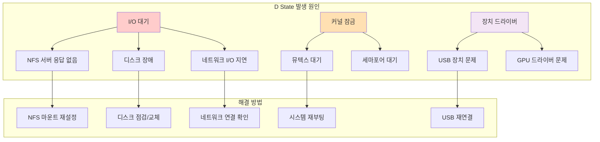

---
tags:
  - Process
  - UninterruptibleSleep
  - Debugging
  - IOAnalysis
---

# 4-5B: D State 프로세스 디버깅

## 시스템을 마비시키는 D State 완전 정복

D state(Uninterruptible Sleep)는 시스템 관리자가 가장 두려워하는 프로세스 상태입니다. kill -9로도 제거할 수 없고, 시스템 전체 성능에 치명적인 영향을 줄 수 있기 때문입니다.



## 2. D State 프로세스 심층 분석

### 2.1 D State의 원인과 해결 방법

D state는 보통 다음과 같은 상황에서 발생합니다:

### 2.2 D State 프로세스 디버깅 도구

```python
#!/usr/bin/env python3
# dstate_debugger.py
import os
import time
import subprocess
import psutil
from collections import defaultdict

class DStateDebugger:
    def __init__(self):
        self.dstate_processes = {}
        self.io_patterns = defaultdict(list)

    def find_dstate_processes(self):
        """D state 프로세스 찾기"""
        dstate_pids = []

        for proc in psutil.process_iter(['pid', 'name', 'status']):
            try:
                if proc.info['status'] == psutil.STATUS_DISK_SLEEP:
                    dstate_pids.append(proc.info['pid'])
            except (psutil.NoSuchProcess, psutil.AccessDenied):
                continue

        return dstate_pids

    def analyze_dstate_process(self, pid):
        """D state 프로세스 상세 분석"""
        try:
            proc = psutil.Process(pid)
            info = {
                'pid': pid,
                'name': proc.name(),
                'cmdline': ' '.join(proc.cmdline()),
                'create_time': proc.create_time(),
                'open_files': [],
                'connections': [],
                'io_counters': None,
                'kernel_stack': None
            }

            # 열린 파일들
            try:
                info['open_files'] = [f.path for f in proc.open_files()]
            except (psutil.AccessDenied, psutil.NoSuchProcess):
                pass

            # 네트워크 연결
            try:
                info['connections'] = proc.connections()
            except (psutil.AccessDenied, psutil.NoSuchProcess):
                pass

            # I/O 카운터
            try:
                info['io_counters'] = proc.io_counters()
            except (psutil.AccessDenied, psutil.NoSuchProcess):
                pass

            # 커널 스택 (root 권한 필요)
            try:
                with open(f'/proc/{pid}/stack', 'r') as f:
                    info['kernel_stack'] = f.read().strip()
            except (PermissionError, FileNotFoundError):
                pass

            return info

        except psutil.NoSuchProcess:
            return None

    def get_io_statistics(self, pid):
        """프로세스 I/O 통계"""
        try:
            with open(f'/proc/{pid}/io', 'r') as f:
                io_stats = {}
                for line in f:
                    key, value = line.strip().split(': ')
                    io_stats[key] = int(value)
                return io_stats
        except (FileNotFoundError, PermissionError, ValueError):
            return None

    def detect_io_hang_cause(self, process_info):
        """I/O 행업 원인 추정"""
        causes = []

        # NFS 마운트 점검
        nfs_files = [f for f in process_info['open_files']
                    if any(nfs_path in f for nfs_path in ['/nfs', '/net', ':'])]
        if nfs_files:
            causes.append(f"NFS 파일 접근: {nfs_files[:3]}")

        # 네트워크 I/O 확인
        if process_info['connections']:
            causes.append(f"네트워크 연결: {len(process_info['connections'])}개")

        # 디스크 I/O 패턴
        if process_info['io_counters']:
            io = process_info['io_counters']
            if io.read_bytes > 100 * 1024 * 1024:  # 100MB 이상
                causes.append(f"대용량 읽기: {io.read_bytes / 1024 / 1024:.1f}MB")
            if io.write_bytes > 100 * 1024 * 1024:
                causes.append(f"대용량 쓰기: {io.write_bytes / 1024 / 1024:.1f}MB")

        # 커널 스택 분석
        if process_info['kernel_stack']:
            stack = process_info['kernel_stack']
            if 'nfs' in stack.lower():
                causes.append("NFS 관련 커널 호출")
            elif 'block' in stack.lower():
                causes.append("블록 I/O 대기")
            elif 'network' in stack.lower() or 'tcp' in stack.lower():
                causes.append("네트워크 I/O 대기")

        return causes

    def monitor_dstate_processes(self, duration=300, interval=5):
        """D state 프로세스 모니터링"""
        print(f"D state 프로세스 모니터링 시작 ({duration}초간, {interval}초 간격)")
        print("=" * 80)

        start_time = time.time()

        while time.time() - start_time < duration:
            dstate_pids = self.find_dstate_processes()

            if dstate_pids:
                print(f"\n[{time.strftime('%H:%M:%S')}] D state 프로세스 감지: {len(dstate_pids)}개")

                for pid in dstate_pids:
                    info = self.analyze_dstate_process(pid)
                    if info:
                        print(f"\n⚠️  PID {pid}: {info['name']}")
                        print(f"   명령어: {info['cmdline'][:80]}...")
                        print(f"   실행 시간: {time.time() - info['create_time']:.1f}초")

                        # I/O 원인 분석
                        causes = self.detect_io_hang_cause(info)
                        if causes:
                            print(f"   추정 원인: {', '.join(causes)}")

                        # 열린 파일 표시
                        if info['open_files']:
                            print(f"   열린 파일: {len(info['open_files'])}개")
                            for f in info['open_files'][:3]:
                                print(f"     - {f}")

                        # 커널 스택 일부 표시
                        if info['kernel_stack']:
                            stack_lines = info['kernel_stack'].split('\n')[:3]
                            print(f"   커널 스택:")
                            for line in stack_lines:
                                print(f"     {line}")

                        # 해결 제안
                        self.suggest_solutions(info)

            else:
                print(f"[{time.strftime('%H:%M:%S')}] D state 프로세스 없음")

            time.sleep(interval)

    def suggest_solutions(self, process_info):
        """해결 방법 제안"""
        suggestions = []

        # NFS 관련
        nfs_files = [f for f in process_info['open_files']
                    if any(nfs_path in f for nfs_path in ['/nfs', '/net', ':'])]
        if nfs_files:
            suggestions.append("NFS 서버 연결 상태 확인")
            suggestions.append("NFS 마운트 재설정 고려")

        # 디스크 I/O
        if process_info['io_counters']:
            suggestions.append("디스크 상태 점검 (dmesg, smartctl)")
            suggestions.append("I/O 스케줄러 확인")

        # 네트워크
        if process_info['connections']:
            suggestions.append("네트워크 연결 상태 확인")
            suggestions.append("방화벽 설정 점검")

        if suggestions:
            print(f"   제안 해결책:")
            for suggestion in suggestions[:3]:
                print(f"     • {suggestion}")

def check_system_io_health():
    """시스템 I/O 상태 전반적 점검"""
    print("=== 시스템 I/O 상태 점검 ===")

    # 디스크 I/O 통계
    print("\n1. 디스크 I/O 통계:")
    try:
        result = subprocess.run(['iostat', '-x', '1', '1'],
                              capture_output=True, text=True, timeout=10)
        print(result.stdout)
    except (subprocess.TimeoutExpired, FileNotFoundError):
        print("iostat을 사용할 수 없습니다.")

    # NFS 마운트 상태
    print("\n2. NFS 마운트 상태:")
    try:
        with open('/proc/mounts', 'r') as f:
            for line in f:
                if 'nfs' in line:
                    print(f"   {line.strip()}")
    except FileNotFoundError:
        print("NFS 마운트 정보를 읽을 수 없습니다.")

    # 메모리 압박 상태
    print("\n3. 메모리 상태:")
    mem = psutil.virtual_memory()
    print(f"   사용률: {mem.percent:.1f}%")
    print(f"   사용 가능: {mem.available / 1024 / 1024 / 1024:.1f}GB")

    if mem.percent > 90:
        print("   ⚠️ 메모리 부족으로 인한 스왑 I/O 가능성")

if __name__ == "__main__":
    import sys

    debugger = DStateDebugger()

    if len(sys.argv) > 1 and sys.argv[1] == "check":
        check_system_io_health()
    else:
        try:
            debugger.monitor_dstate_processes(duration=300, interval=10)
        except KeyboardInterrupt:
            print("\n모니터링 중단됨")
```

## D State 디버깅 실전 가이드

### 1. D State 감지 즉시 행동 절차

1. **즉시 확인**: `ps aux | grep " D "`로 D state 프로세스 식별
2. **원인 분석**: 위 Python 스크립트 실행하여 상세 분석
3. **I/O 상태 점검**: `iostat -x 1`로 디스크 I/O 모니터링
4. **네트워크 확인**: 네트워크 마운트 및 연결 상태 점검

### 2. D State 해결 우선순위

**1순위: I/O 원인 제거**

- NFS 서버 재시작 또는 언마운트
- 문제가 있는 디스크/USB 연결 해제
- 네트워크 문제 해결

**2순위: 시스템 레벨 대응**

- I/O 스케줄러 변경 (`echo deadline > /sys/block/sda/queue/scheduler`)
- 메모리 압박 완화 (캐시 정리)
- 불필요한 I/O 작업 중단

**3순위: 최후의 수단**

- 시스템 재부팅 (프로덕션 환경에서는 신중히 결정)

### 3. D State 예방 전략

```bash
# D State 모니터링 스크립트
#!/bin/bash
# dstate_monitor.sh

WARN_THRESHOLD=5  # 5초 이상 D state 시 경고
CRIT_THRESHOLD=30 # 30초 이상 D state 시 위험 알림

check_dstate() {
    local dstate_processes=$(ps axo pid,etime,comm | awk '$2 ~ /D/ {print $1 ":" $2 ":" $3}')
    
    if [ -n "$dstate_processes" ]; then
        echo "⚠️ D state 프로세스 감지:"
        echo "$dstate_processes"
        
        # 시스템 관리자에게 알림 (실제 운영 환경에서는 적절한 알림 시스템 사용)
        logger "D state processes detected: $dstate_processes"
        
        # 자동 진단 실행
        python3 /path/to/dstate_debugger.py check
    fi
}

# 주기적 실행
while true; do
    check_dstate
    sleep 10
done
```

---

**이전**: [05a-process-state-fundamentals.md](05a-process-state-fundamentals.md)  
**다음**: [05c-zombie-process-handling.md](05c-zombie-process-handling.md)에서 Zombie 프로세스 처리 방법을 학습합니다.
