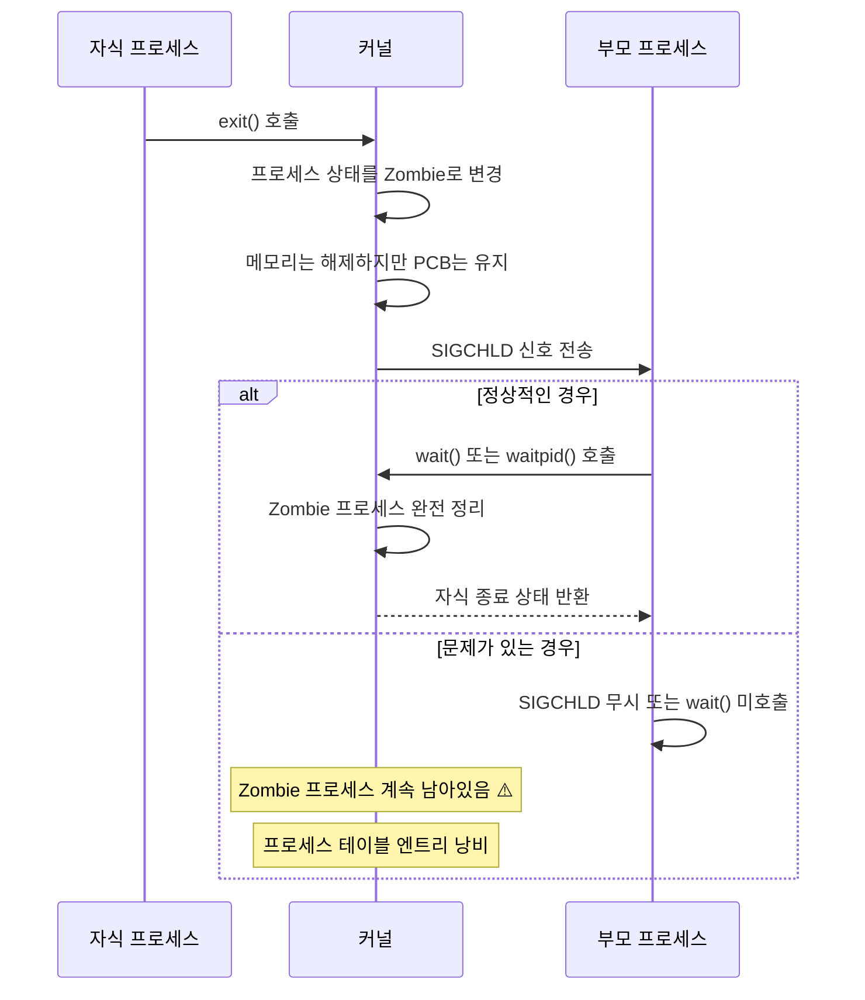

---
tags:
  - Process
  - Zombie
  - Debugging
  - ProcessCleanup
---

# 4-5C: Zombie 프로세스 처리

## 죽지 못하는 프로세스의 비밀

Zombie 프로세스는 이미 종료되었지만 부모 프로세스가 wait()를 호출하지 않아 완전히 정리되지 못한 상태입니다. 시스템 리소스를 소모하고 프로세스 테이블을 낭비할 수 있어 주의 깊은 관리가 필요합니다.

## 3. Zombie 프로세스 처리

### 3.1 Zombie 프로세스 발생 원리



### 3.2 Zombie 프로세스 청소 도구

```bash
#!/bin/bash
# zombie_cleaner.sh

echo "=== Zombie 프로세스 청소 도구 ==="

# Zombie 프로세스 찾기
find_zombies() {
    local zombies=$(ps axo pid,ppid,state,comm | awk '$3 ~ /^Z/ {print $1 ":" $2 ":" $4}')

    if [ -z "$zombies" ]; then
        echo "Zombie 프로세스가 없습니다."
        return 0
    fi

    echo "발견된 Zombie 프로세스들:"
    echo "PID:PPID:명령어"
    echo "==================="
    echo "$zombies"

    return 1
}

# 부모 프로세스별 Zombie 그룹화
analyze_zombie_parents() {
    echo -e "\n=== 부모 프로세스별 Zombie 분석 ==="

    ps axo pid,ppid,state,comm | awk '$3 ~ /^Z/' | while read pid ppid state comm; do
        echo "Zombie PID $pid (부모: $ppid, 명령어: $comm)"

        if [ -f "/proc/$ppid/comm" ]; then
            parent_comm=$(cat "/proc/$ppid/comm" 2>/dev/null)
            echo "  부모 프로세스: $parent_comm"

            # 부모 프로세스 상태 확인
            parent_state=$(ps -p "$ppid" -o state --no-headers 2>/dev/null)
            echo "  부모 상태: $parent_state"

            # 부모 프로세스의 신호 처리 상태
            if [ -f "/proc/$ppid/status" ]; then
                echo "  부모 신호 처리:"
                grep -E "^Sig(Ign|Cgt):" "/proc/$ppid/status" | head -2
            fi
        else
            echo "  ⚠️ 부모 프로세스를 찾을 수 없습니다 (이미 종료됨?)"
        fi
        echo ""
    done
}

# Zombie 프로세스 청소 시도
cleanup_zombies() {
    echo "=== Zombie 프로세스 청소 시도 ==="

    local cleaned=0
    local failed=0

    ps axo pid,ppid,state,comm | awk '$3 ~ /^Z/' | while read pid ppid state comm; do
        echo "Zombie 프로세스 정리 시도: PID $pid (부모: $ppid)"

        if [ -d "/proc/$ppid" ]; then
            # 부모 프로세스가 살아있는 경우
            echo "  부모 프로세스에 SIGCHLD 전송..."
            kill -CHLD "$ppid" 2>/dev/null

            sleep 1

            # 정리됐는지 확인
            if [ ! -d "/proc/$pid" ]; then
                echo "  ✅ 정리 완료"
                ((cleaned++))
            else
                echo "  ❌ 정리 실패 - 부모 프로세스 재시작 필요할 수 있음"
                ((failed++))

                # 부모 프로세스 정보 표시
                echo "     부모 프로세스 재시작 명령어:"
                parent_cmdline=$(tr '\0' ' ' < "/proc/$ppid/cmdline" 2>/dev/null)
                echo "     $parent_cmdline"
            fi
        else
            # 부모 프로세스가 없는 경우 (고아 프로세스)
            echo "  ⚠️ 부모 프로세스가 없습니다. init이 정리해야 합니다."
            ((failed++))
        fi
    done

    echo -e "\n정리 결과: 성공 $cleaned개, 실패 $failed개"

    if [ $failed -gt 0 ]; then
        echo "정리되지 않은 Zombie가 있습니다. 다음 방법을 시도해보세요:"
        echo "1. 부모 프로세스 재시작"
        echo "2. 시스템 재부팅 (최후의 수단)"
    fi
}

# 시스템 리소스 영향 분석
analyze_zombie_impact() {
    echo "=== Zombie 프로세스 시스템 영향 분석 ==="

    local zombie_count=$(ps axo state | grep -c '^Z')
    local total_processes=$(ps ax | wc -l)
    local max_processes=$(cat /proc/sys/kernel/pid_max)

    echo "총 프로세스 수: $total_processes"
    echo "Zombie 프로세스 수: $zombie_count"
    echo "최대 프로세스 수: $max_processes"

    if [ $zombie_count -gt 0 ]; then
        local zombie_percent=$((zombie_count * 100 / total_processes))
        echo "Zombie 비율: $zombie_percent%"

        if [ $zombie_percent -gt 5 ]; then
            echo "⚠️ Zombie 프로세스 비율이 높습니다!"
        fi

        # 프로세스 테이블 사용률
        local usage_percent=$((total_processes * 100 / max_processes))
        echo "프로세스 테이블 사용률: $usage_percent%"

        if [ $usage_percent -gt 80 ]; then
            echo "⚠️ 프로세스 테이블 사용률이 높습니다!"
        fi
    fi
}

# 자동 Zombie 모니터링
monitor_zombies() {
    local duration=${1:-300}  # 기본 5분
    local interval=${2:-10}   # 기본 10초

    echo "Zombie 프로세스 모니터링 시작 ($duration초간, $interval초 간격)"

    local start_time=$(date +%s)
    local end_time=$((start_time + duration))

    while [ $(date +%s) -lt $end_time ]; do
        local current_time=$(date "+%H:%M:%S")
        local zombie_count=$(ps axo state | grep -c '^Z')

        if [ $zombie_count -gt 0 ]; then
            echo "[$current_time] ⚠️ Zombie 프로세스 $zombie_count개 감지"
            ps axo pid,ppid,comm | grep '^[[:space:]]*[0-9][[:space:]]*[0-9][[:space:]]*Z'
        else
            echo "[$current_time] Zombie 프로세스 없음"
        fi

        sleep $interval
    done
}

# 메뉴
echo "1) Zombie 프로세스 찾기"
echo "2) 부모 프로세스별 분석"
echo "3) Zombie 정리 시도"
echo "4) 시스템 영향 분석"
echo "5) 모니터링 시작"
echo "6) 종료"

read -p "선택하세요 (1-6): " choice

case $choice in
    1)
        find_zombies
        ;;
    2)
        analyze_zombie_parents
        ;;
    3)
        cleanup_zombies
        ;;
    4)
        analyze_zombie_impact
        ;;
    5)
        read -p "모니터링 시간 (초, 기본 300): " duration
        read -p "체크 간격 (초, 기본 10): " interval
        monitor_zombies ${duration:-300} ${interval:-10}
        ;;
    6)
        echo "종료합니다."
        ;;
    *)
        echo "잘못된 선택입니다."
        exit 1
        ;;
esac
```

## Zombie 프로세스 실전 대응 가이드

### 1. Zombie 프로세스 예방 전략

**코드 레벨 예방**:

```c
// 올바른 SIGCHLD 처리
#include <signal.h>
#include <sys/wait.h>

void sigchld_handler(int sig) {
    pid_t pid;
    int status;
    
    // 모든 종료된 자식 프로세스 수거
    while ((pid = waitpid(-1, &status, WNOHANG)) > 0) {
        printf("Child %d terminated\n", pid);
    }
}

int main() {
    // SIGCHLD 신호 핸들러 등록
    signal(SIGCHLD, sigchld_handler);
    
    // 또는 SIG_IGN으로 자동 정리 설정
    signal(SIGCHLD, SIG_IGN);
    
    return 0;
}
```

### 2. 시스템 레벨 모니터링

**Zombie 자동 정리 스크립트**:

```bash
#!/bin/bash
# auto_zombie_cleanup.sh

ZOMBIE_THRESHOLD=10  # 10개 이상의 zombie에서 알림
CLEANUP_LOG="/var/log/zombie_cleanup.log"

log_message() {
    echo "$(date '+%Y-%m-%d %H:%M:%S'): $1" >> "$CLEANUP_LOG"
}

check_and_cleanup() {
    local zombie_count=$(ps axo state | grep -c '^Z')
    
    if [ $zombie_count -gt $ZOMBIE_THRESHOLD ]; then
        log_message "WARNING: $zombie_count zombie processes detected"
        
        # 부모 프로세스에 SIGCHLD 전송
        ps axo pid,ppid,state | awk '$3 == "Z" {print $2}' | sort -u | while read ppid; do
            if [ -d "/proc/$ppid" ]; then
                kill -CHLD "$ppid" 2>/dev/null
                log_message "Sent SIGCHLD to parent PID $ppid"
            fi
        done
        
        # 5초 후 재확인
        sleep 5
        local remaining=$(ps axo state | grep -c '^Z')
        log_message "After cleanup: $remaining zombie processes remaining"
        
        if [ $remaining -gt $((ZOMBIE_THRESHOLD / 2)) ]; then
            log_message "CRITICAL: Zombie cleanup partially failed"
            # 시스템 관리자에게 알림 (예: 메일, Slack 등)
        fi
    fi
}

# cron으로 주기적 실행: */5 * * * * /path/to/auto_zombie_cleanup.sh
check_and_cleanup
```

### 3. Zombie 프로세스 예방 체크리스트

**개발 단계**:

- [ ] 모든 fork() 후 SIGCHLD 핸들링 구현
- [ ] wait() 또는 waitpid() 적절한 호출
- [ ] 비동기 프로세스 생성 시 signalfd() 사용 고려

**운영 단계**:

- [ ] Zombie 모니터링 스크립트 배포
- [ ] 리소스 제한 설정 (ulimit -u)
- [ ] 주기적 시스템 점검 프로세스 구축

**비상 대응**:

- [ ] Zombie 대량 발생 시 대응 절차
- [ ] 부모 프로세스 재시작 가이드라인
- [ ] 시스템 재부팅 결정 기준

---

**이전**: [05b-dstate-debugging.md](05b-dstate-debugging.md)  
**다음**: [05d-process-accounting.md](05d-process-accounting.md)에서 Process Accounting 활용법을 학습합니다.
