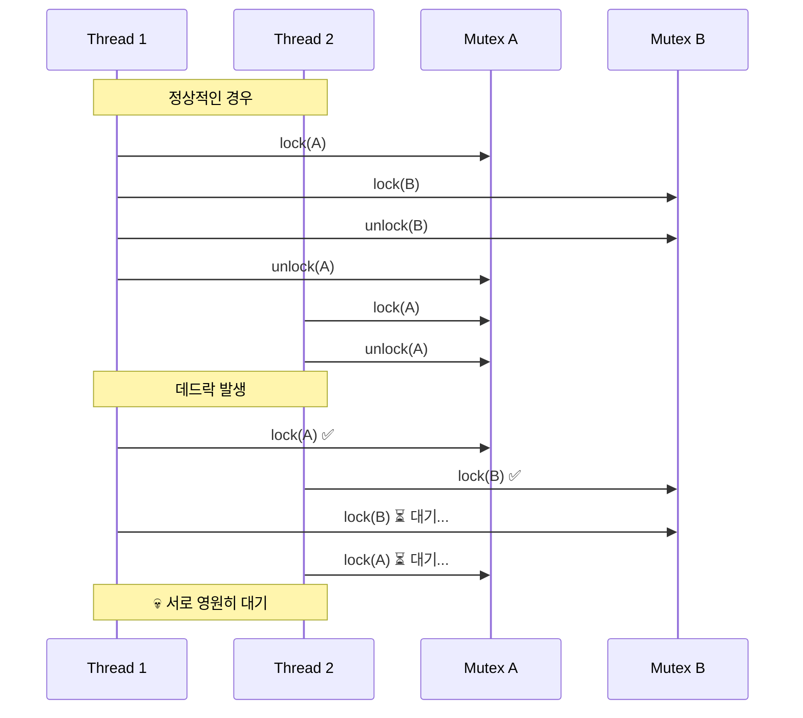
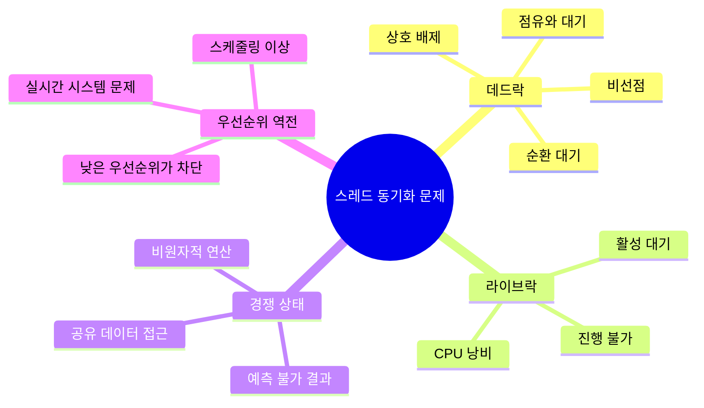
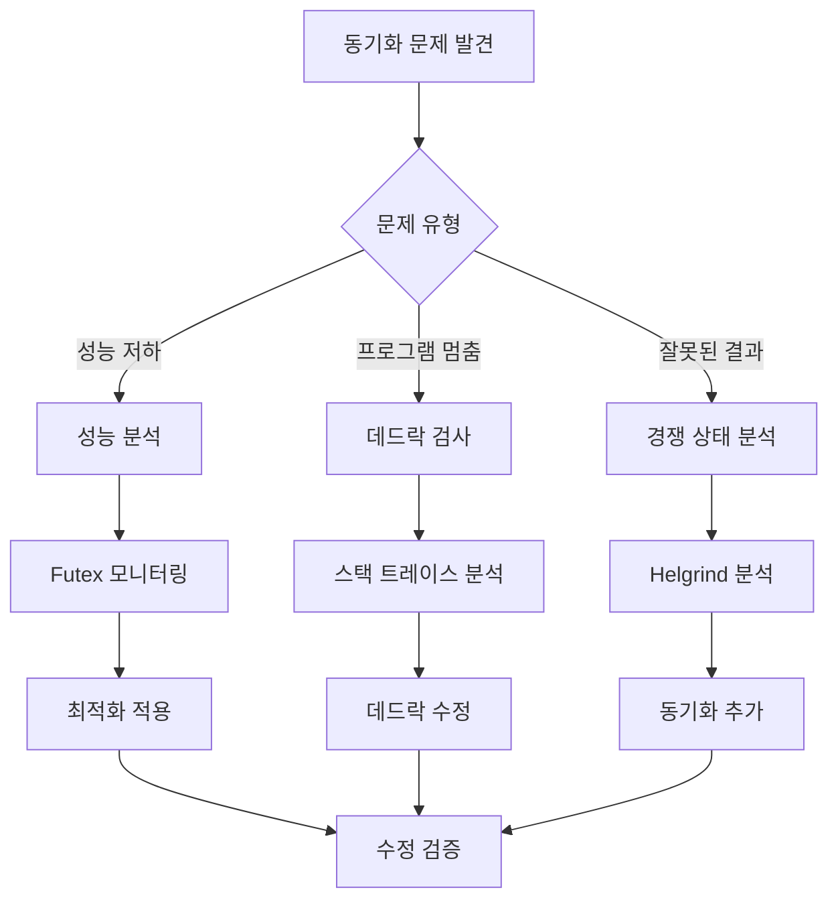
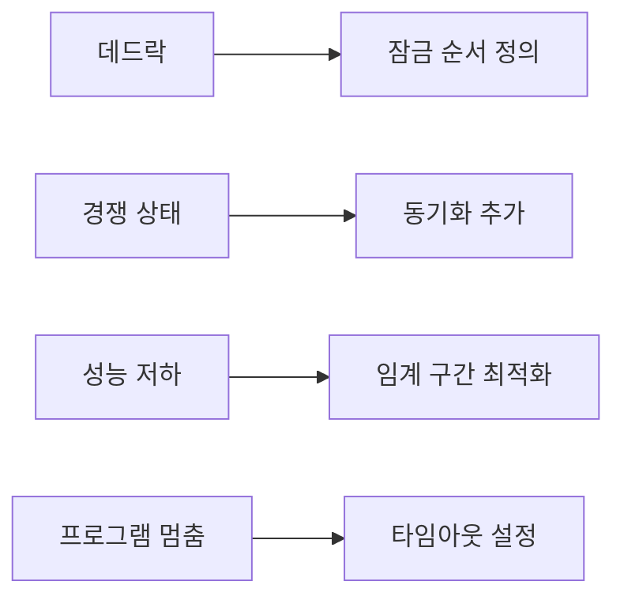

---
tags:
  - Thread
  - Synchronization
  - Deadlock
  - Mutex
  - Debugging
  - Helgrind
---

# 4-6: 스레드 동기화 디버깅 - "Deadlock이 발생한 것 같아요"

## 이 문서를 읽으면 답할 수 있는 질문들

- 데드락을 어떻게 감지하고 디버깅하나요?
- pthread_mutex_lock에서 무한 대기가 발생하면 어떻게 해결하나요?
- helgrind로 경쟁 상태를 어떻게 찾아내나요?
- futex 성능 문제는 어떻게 분석하나요?
- priority inversion을 어떻게 해결하나요?

## 들어가며: 보이지 않는 스레드 전쟁

"멀티스레드로 성능을 높이려 했는데 오히려 더 느려졌어요..."

스레드 동기화 문제는 **재현하기 어렵고**, **디버깅하기 까다로우며**, **성능에 치명적**입니다. 하지만 체계적인 접근으로 해결할 수 있습니다.

### 데드락 시나리오 이해하기



Page fault 하나가 전체 애플리케이션을 수만 배 느리게 만들 수 있습니다.

### 스레드 동기화 문제 분류



## 1. 데드락 진단과 해결

### 1.1 간단한 데드락 감지 스크립트

복잡한 도구 전에 기본적인 진단부터 시작해봅시다:

```bash
#!/bin/bash
# deadlock_check.sh - 간단한 데드락 감지

check_hanging_processes() {
    echo "=== 행잉(Hanging) 프로세스 검사 ==="
    
    # D state 프로세스들 찾기 (잠재적 데드락)
    echo "D state 프로세스들:"
    ps -eo pid,state,comm | awk '$2 == "D" {print "  PID " $1 ": " $3}'
    
    # 높은 CPU 사용 스레드들 (라이브락 가능성)
    echo -e "\n높은 CPU 사용 스레드들 (라이브락 의심):"
    ps -eLo pid,tid,pcpu,comm --sort=-pcpu | head -6 | tail -5
}

analyze_specific_process() {
    local pid=$1
    
    if [ -z "$pid" ]; then
        echo "사용법: analyze_specific_process <pid>"
        return 1
    fi
    
    echo "=== 프로세스 $pid 분석 ==="
    
    # 기본 정보
    if [ -f "/proc/$pid/comm" ]; then
        echo "프로세스명: $(cat /proc/$pid/comm)"
    else
        echo "프로세스 $pid를 찾을 수 없습니다."
        return 1
    fi
    
    # 스레드 목록과 상태
    echo -e "\n스레드 목록:"
    ls /proc/$pid/task/ | while read tid; do
        if [ -f "/proc/$pid/task/$tid/stat" ]; then
            thread_state=$(awk '{print $3}' "/proc/$pid/task/$tid/stat" 2>/dev/null)
            echo "  TID $tid: 상태 $thread_state"
        fi
    done
    
    # 각 스레드의 스택 정보 (중요한 부분만)
    echo -e "\n주요 스레드 스택 정보:"
    ls /proc/$pid/task/ | head -3 | while read tid; do
        echo "--- TID $tid ---"
        if [ -f "/proc/$pid/task/$tid/stack" ]; then
            head -5 "/proc/$pid/task/$tid/stack" 2>/dev/null || echo "스택 정보 읽기 실패"
        fi
    done
}

# 메뉴
echo "데드락 간단 진단 도구"
echo "1) 시스템 전체 검사"
echo "2) 특정 프로세스 분석"
echo "3) 종료"

read -p "선택하세요 (1-3): " choice

case $choice in
    1) check_hanging_processes ;;
    2) 
        read -p "분석할 프로세스 PID: " pid
        analyze_specific_process "$pid"
        ;;
    3) echo "종료합니다." ;;
    *) echo "잘못된 선택입니다." ;;
esac
```

**사용법**:

```bash
chmod +x deadlock_check.sh
./deadlock_check.sh
```

### 1.2 핵심 데드락 감지 로직

```c
// 간소화된 데드락 감지기
#include <stdio.h>
#include <pthread.h>
#include <unistd.h>

typedef struct {
    pthread_t thread_id;
    char name[32];
    int waiting_for_mutex;
    int holding_mutex;
} thread_info_t;

static thread_info_t threads[10];
static int num_threads = 0;

// 스레드 등록
void register_thread(const char *name) {
    threads[num_threads].thread_id = pthread_self();
    snprintf(threads[num_threads].name, sizeof(threads[num_threads].name), "%s", name);
    threads[num_threads].waiting_for_mutex = -1;
    threads[num_threads].holding_mutex = -1;
    num_threads++;
}

// 간단한 사이클 감지
int detect_deadlock_cycle() {
    for (int i = 0; i < num_threads; i++) {
        if (threads[i].waiting_for_mutex == -1) continue;
        
        // A가 B를 기다리고, B가 A가 가진 것을 기다리는지 확인
        for (int j = 0; j < num_threads; j++) {
            if (i == j) continue;
            
            if (threads[j].holding_mutex == threads[i].waiting_for_mutex &&
                threads[j].waiting_for_mutex == threads[i].holding_mutex) {
                
                printf("🚨 데드락 감지!\n");
                printf("  %s ↔ %s\n", threads[i].name, threads[j].name);
                return 1;
            }
        }
    }
    return 0;
}

// ... (추가 구현 생략)
```

**핵심 아이디어**:

- **Wait-for 그래프**: 누가 무엇을 기다리는지 추적
- **사이클 감지**: 순환 대기 상황 발견
- **실시간 모니터링**: 주기적 검사로 조기 발견

## 2. Valgrind Helgrind로 경쟁 상태 찾기

### 2.1 Helgrind 기본 사용법

Helgrind는 멀티스레드 프로그램의 **경쟁 상태**와 **잠금 문제**를 찾아주는 강력한 도구입니다:

```bash
# 기본 경쟁 상태 검사
$ valgrind --tool=helgrind ./your_program

# 상세 분석 옵션
$ valgrind --tool=helgrind \
    --read-var-info=yes \
    --track-lockorders=yes \
    --check-stack-refs=yes \
    ./your_program
```

### 2.2 경쟁 상태 샘플 코드와 분석

**문제가 있는 코드**:

```c
// race_condition_sample.c
#include <stdio.h>
#include <pthread.h>

int shared_counter = 0;  // 공유 변수

void* unsafe_increment(void* arg) {
    for (int i = 0; i < 1000; i++) {
        shared_counter++;  // ⚠️ 경쟁 상태!
    }
    return NULL;
}

void* safe_increment(void* arg) {
    static pthread_mutex_t mutex = PTHREAD_MUTEX_INITIALIZER;
    
    for (int i = 0; i < 1000; i++) {
        pthread_mutex_lock(&mutex);
        shared_counter++;  // ✅ 안전함
        pthread_mutex_unlock(&mutex);
    }
    return NULL;
}

int main() {
    pthread_t t1, t2;
    
    // 안전하지 않은 버전 테스트
    pthread_create(&t1, NULL, unsafe_increment, NULL);
    pthread_create(&t2, NULL, unsafe_increment, NULL);
    
    pthread_join(t1, NULL);
    pthread_join(t2, NULL);
    
    printf("최종 카운터: %d (예상: 2000)\n", shared_counter);
    return 0;
}
```

**컴파일 및 분석**:

```bash
$ gcc -g -pthread race_condition_sample.c -o race_test
$ valgrind --tool=helgrind ./race_test
```bash

**Helgrind 출력 해석**:
```bash
==1234== Possible data race during write of size 4 at 0x601040 by thread #2
==1234== Locks held: none
==1234==    at 0x4007A3: unsafe_increment (race_condition_sample.c:8)
==1234==    by 0x4E3AE99: start_thread (pthread_create.c:308)
==1234==
==1234== This conflicts with a previous write of size 4 by thread #1
==1234== Locks held: none
==1234==    at 0x4007A3: unsafe_increment (race_condition_sample.c:8)
```

**💡 핵심 정보**:

- **data race**: `shared_counter++` 에서 경쟁 상태 발생
- **Locks held: none**: 어떤 잠금도 보유하지 않은 상태
- **해결책**: 해당 변수 접근을 뮤텍스로 보호

### 2.3 자동화된 분석 스크립트

```bash
#!/bin/bash
# helgrind_analyzer.sh

analyze_with_helgrind() {
    local program=$1
    
    echo "Helgrind로 '$program' 분석 중..."
    
    # 분석 실행
    local output_file="/tmp/helgrind_$$.txt"
    valgrind --tool=helgrind \
             --log-file="$output_file" \
             --track-lockorders=yes \
             "$program"
    
    # 결과 요약
    echo "=== 분석 결과 요약 ==="
    
    local data_race_count=$(grep -c "Possible data race" "$output_file")
    local lock_order_count=$(grep -c "lock order" "$output_file")
    
    echo "데이터 경쟁: $data_race_count개"
    echo "잠금 순서 위반: $lock_order_count개"
    
    if [ $data_race_count -gt 0 ]; then
        echo -e "\n상세 분석 (처음 3개):"
        grep -A 3 "Possible data race" "$output_file" | head -12
    fi
    
    # 권장사항
    echo -e "\n권장사항:"
    if [ $data_race_count -gt 0 ]; then
        echo "• 공유 변수에 뮤텍스 또는 원자적 연산 추가"
    fi
    if [ $lock_order_count -gt 0 ]; then
        echo "• 일관된 잠금 순서 정의로 데드락 방지"
    fi
    
    rm -f "$output_file"
}

read -p "분석할 프로그램 경로: " program
analyze_with_helgrind "$program"
```

## 3. 시스템 레벨 동기화 분석

### 3.1 Futex 성능 모니터링

Futex(Fast Userspace Mutex)는 Linux의 동기화 기본 메커니즘입니다:

```bash
#!/bin/bash
# futex_monitor.sh

monitor_futex_performance() {
    local pid=$1
    local duration=${2:-10}
    
    echo "PID $pid의 futex 성능 모니터링 ($duration초간)"
    
    # strace로 futex 시스템 콜 추적
    timeout "$duration" strace -p "$pid" -e futex -c 2>&1 | \
    tail -10 | head -5
    
    echo -e "\n해석:"
    echo "• calls: futex 호출 횟수"
    echo "• time: 총 소요 시간"
    echo "• avg: 평균 호출 시간"
    echo "• 높은 avg 값 = 경합 발생"
}

read -p "모니터링할 프로세스 PID: " pid
read -p "모니터링 시간 (초, 기본 10): " duration
monitor_futex_performance "$pid" "${duration:-10}"
```

### 3.2 뮤텍스 타입별 성능 비교

```c
// mutex_performance_test.c
#include <stdio.h>
#include <pthread.h>
#include <sys/time.h>

#define ITERATIONS 100000

double get_time() {
    struct timeval tv;
    gettimeofday(&tv, NULL);
    return tv.tv_sec + tv.tv_usec / 1000000.0;
}

void test_mutex_type(int type, const char* name) {
    pthread_mutex_t mutex;
    pthread_mutexattr_t attr;
    
    pthread_mutexattr_init(&attr);
    pthread_mutexattr_settype(&attr, type);
    pthread_mutex_init(&mutex, &attr);
    
    double start = get_time();
    
    for (int i = 0; i < ITERATIONS; i++) {
        pthread_mutex_lock(&mutex);
        pthread_mutex_unlock(&mutex);
    }
    
    double end = get_time();
    
    printf("%s: %.3f초 (%.1f ns/op)\n", 
           name, end - start, (end - start) * 1000000000 / ITERATIONS);
    
    pthread_mutex_destroy(&mutex);
    pthread_mutexattr_destroy(&attr);
}

int main() {
    printf("뮤텍스 타입별 성능 테스트 (%d회 반복)\n", ITERATIONS);
    
    test_mutex_type(PTHREAD_MUTEX_NORMAL, "NORMAL");
    test_mutex_type(PTHREAD_MUTEX_RECURSIVE, "RECURSIVE");
    test_mutex_type(PTHREAD_MUTEX_ERRORCHECK, "ERRORCHECK");
    
    return 0;
}
```

**실행 결과 예시**:

```bash
$ gcc -O2 -pthread mutex_performance_test.c -o mutex_test
$ ./mutex_test

뮤텍스 타입별 성능 테스트 (100000회 반복)
NORMAL: 0.018초 (180.0 ns/op)
RECURSIVE: 0.024초 (240.0 ns/op)
ERRORCHECK: 0.031초 (310.0 ns/op)
```

**💡 성능 팁**:

- **NORMAL**: 가장 빠름, 기본 선택
- **RECURSIVE**: 재귀적 잠금 가능하지만 느림
- **ERRORCHECK**: 디버깅용, 운영에서는 피하기

## 4. 실무 동기화 최적화 전략

### 4.1 단계적 접근법



### 4.2 동기화 최적화 체크리스트

**설계 단계**:

- [ ] **임계 구간 최소화**: 잠금 범위를 가능한 한 좁게
- [ ] **잠금 순서 정의**: 항상 같은 순서로 여러 뮤텍스 획득
- [ ] **Lock-free 고려**: 가능한 경우 원자적 연산 사용
- [ ] **Reader-Writer 락**: 읽기가 많은 경우 활용

**구현 단계**:

- [ ] **RAII 패턴**: C++에서 자동 잠금 해제
- [ ] **타임아웃 설정**: 무한 대기 방지
- [ ] **에러 처리**: 잠금 실패 시나리오 고려
- [ ] **스레드 풀**: 스레드 생성/소멸 오버헤드 제거

**테스트 단계**:

- [ ] **Helgrind 정기 실행**: CI/CD에 통합
- [ ] **스트레스 테스트**: 높은 동시성 환경에서 테스트
- [ ] **장기 실행 테스트**: 메모리 누수와 데드락 확인
- [ ] **성능 벤치마크**: 동기화 오버헤드 측정

### 4.3 일반적인 동기화 안티패턴과 해결책

**❌ 안티패턴 1: 너무 넓은 임계 구간**

```c
// 나쁜 예
pthread_mutex_lock(&mutex);
read_file();           // 긴 I/O 작업
process_data();        // 긴 CPU 작업  
write_result();        // 또 다른 I/O 작업
pthread_mutex_unlock(&mutex);
```

**✅ 해결책: 임계 구간 분할**

```c
// 좋은 예
read_file();           // I/O는 잠금 외부에서

pthread_mutex_lock(&mutex);
process_shared_data(); // 공유 데이터만 보호
pthread_mutex_unlock(&mutex);

write_result();        // I/O는 다시 외부에서
```

**❌ 안티패턴 2: 일관되지 않은 잠금 순서**

```c
// Thread 1: A → B 순서
pthread_mutex_lock(&mutex_a);
pthread_mutex_lock(&mutex_b);

// Thread 2: B → A 순서 (데드락 위험!)
pthread_mutex_lock(&mutex_b);  
pthread_mutex_lock(&mutex_a);
```

**✅ 해결책: 전역 잠금 순서**

```c
// 모든 스레드가 같은 순서 사용
void acquire_both_locks() {
    // 항상 A 먼저, 그 다음 B
    pthread_mutex_lock(&mutex_a);
    pthread_mutex_lock(&mutex_b);
}
```

## 5. 성능 모니터링과 알림

### 5.1 동기화 성능 지표

```bash
#!/bin/bash
# sync_performance_monitor.sh

monitor_sync_performance() {
    local pid=$1
    echo "동기화 성능 모니터링: PID $pid"
    
    # 1. Context switch 모니터링
    echo "=== Context Switch 통계 ==="
    grep "ctxt" /proc/stat
    
    # 2. 프로세스별 context switch
    if [ -f "/proc/$pid/status" ]; then
        grep -E "voluntary_ctxt_switches|nonvoluntary_ctxt_switches" "/proc/$pid/status"
    fi
    
    # 3. 시스템 전체 동기화 관련 통계
    echo -e "\n=== 시스템 동기화 부하 ==="
    vmstat 1 3 | tail -2
    
    echo -e "\n해석:"
    echo "• voluntary_ctxt_switches: 자발적 컨텍스트 스위치 (정상)"
    echo "• nonvoluntary_ctxt_switches: 비자발적 스위치 (경합 의심)"  
    echo "• 높은 비자발적 스위치 = 동기화 문제 가능성"
}

read -p "모니터링할 프로세스 PID: " pid
monitor_sync_performance "$pid"
```

### 5.2 자동 경고 시스템

```python
#!/usr/bin/env python3
# sync_alerting.py
import time
import subprocess

def check_sync_issues():
    """동기화 문제 자동 감지"""
    issues = []
    
    # D state 프로세스 확인
    result = subprocess.run(['ps', 'axo', 'pid,state,comm'], 
                          capture_output=True, text=True)
    
    d_state_count = 0
    for line in result.stdout.split('\n'):
        if ' D ' in line:
            d_state_count += 1
            issues.append(f"D state 프로세스 감지: {line.strip()}")
    
    # 높은 context switch 확인
    with open('/proc/stat') as f:
        for line in f:
            if line.startswith('ctxt'):
                ctxt_switches = int(line.split()[1])
                # 임계값은 시스템에 따라 조정 필요
                if ctxt_switches > 1000000:  # 예시 임계값
                    issues.append(f"높은 context switch: {ctxt_switches}")
                break
    
    return issues

def main():
    print("동기화 문제 자동 감지 시작...")
    
    while True:
        issues = check_sync_issues()
        
        if issues:
            print(f"🚨 경고 - {time.strftime('%H:%M:%S')}")
            for issue in issues:
                print(f"  • {issue}")
            print()
        
        time.sleep(10)  # 10초마다 검사

if __name__ == "__main__":
    try:
        main()
    except KeyboardInterrupt:
        print("\n모니터링 종료")
```

## 6. 정리와 Best Practices

스레드 동기화는 멀티스레드 프로그래밍의 핵심이지만, 잘못 사용하면 성능 저하와 안정성 문제를 야기할 수 있습니다.

### 핵심 원칙

1. **🔒 최소한의 잠금**: 꼭 필요한 경우에만 사용
2. **⏱️ 짧은 임계 구간**: 잠금 시간을 최소화
3. **📏 일관된 순서**: 데드락 방지를 위한 잠금 순서
4. **🛠️ 적절한 도구**: Helgrind, strace 등 활용

### 문제별 해결 가이드



### 다음 단계

다음 섹션 [4-7: CPU 친화도 설정과 최적화](07-cpu-affinity-optimization.md)에서는 스레드를 특정 CPU 코어에 바인딩하여 성능을 최적화하는 방법을 다룹니다.

안전하고 효율적인 스레드 동기화로 견고한 멀티스레드 애플리케이션을 구축해봅시다! 🧵
