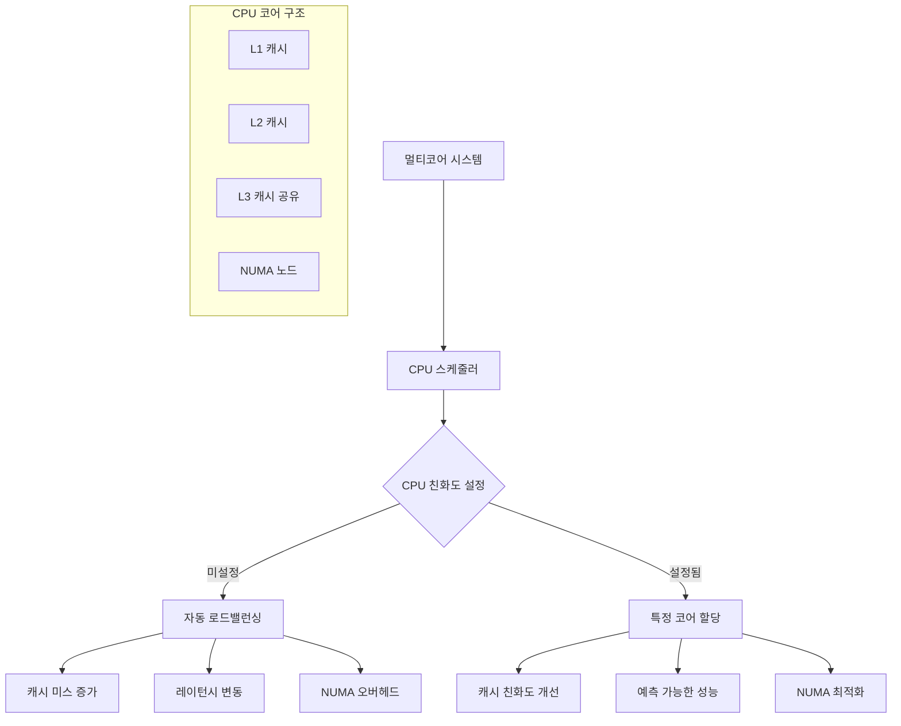
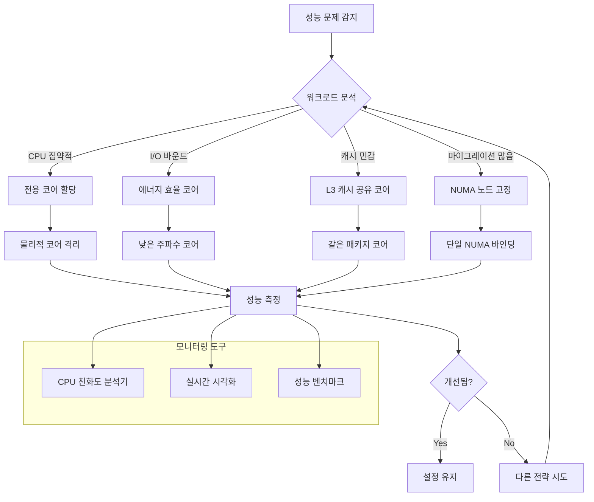

---
tags:
  - Process
  - Thread
  - CPU
  - Performance
  - Linux
  - Debugging
---

# CPU 친화도 최적화: "특정 CPU에서만 실행하고 싶어요"

## 상황: 게임 서버의 레이턴시 문제

"안녕하세요, 게임 서버를 운영하고 있는데 레이턴시가 일정하지 않아서 문제가 되고 있어요. 특히 멀티코어 환경에서 프로세스가 여러 CPU 코어 사이를 옮겨다니면서 캐시 미스가 발생하는 것 같습니다. 특정 CPU 코어에 프로세스를 고정할 수 있을까요?"

이런 상황은 고성능 애플리케이션에서 흔히 발생합니다. CPU 친화도(CPU Affinity) 설정을 통해 프로세스나 스레드를 특정 CPU 코어에 바인딩하여 성능을 최적화할 수 있습니다.

## CPU 친화도의 이해



## 1. CPU 친화도 분석 도구

먼저 현재 프로세스의 CPU 친화도를 분석하는 도구를 만들어보겠습니다.

```c
// cpu_affinity_analyzer.c
#define _GNU_SOURCE
#include <stdio.h>
#include <stdlib.h>
#include <unistd.h>
#include <sched.h>
#include <errno.h>
#include <string.h>
#include <sys/time.h>
#include <pthread.h>
#include <numa.h>
#include <sys/syscall.h>

typedef struct {
    int cpu_count;
    int numa_nodes;
    cpu_set_t original_affinity;
    cpu_set_t current_affinity;
} cpu_topology_t;

typedef struct {
    int cpu_id;
    unsigned long migrations;
    unsigned long cache_misses;
    double avg_latency;
    int numa_node;
} cpu_stats_t;

// CPU 토폴로지 정보 수집
cpu_topology_t* get_cpu_topology() {
    cpu_topology_t* topo = malloc(sizeof(cpu_topology_t));
    
    // CPU 개수 확인
    topo->cpu_count = sysconf(_SC_NPROCESSORS_ONLN);
    
    // NUMA 노드 개수 확인
    if (numa_available() >= 0) {
        topo->numa_nodes = numa_max_node() + 1;
    } else {
        topo->numa_nodes = 1;
    }
    
    // 현재 프로세스의 CPU 친화도 확인
    if (sched_getaffinity(0, sizeof(cpu_set_t), &topo->original_affinity) == -1) {
        perror("sched_getaffinity");
        free(topo);
        return NULL;
    }
    
    topo->current_affinity = topo->original_affinity;
    
    return topo;
}

// CPU 마이그레이션 통계 수집
void collect_migration_stats(int pid, cpu_stats_t* stats, int cpu_count) {
    char stat_path[256];
    FILE* fp;
    
    snprintf(stat_path, sizeof(stat_path), "/proc/%d/stat", pid);
    fp = fopen(stat_path, "r");
    
    if (fp) {
        // /proc/[pid]/stat에서 CPU 관련 정보 파싱
        long processor, voluntary_ctxt_switches, nonvoluntary_ctxt_switches;
        
        // stat 파일의 39번째 필드가 현재 CPU
        for (int i = 0; i < 38; i++) {
            fscanf(fp, "%*s");
        }
        fscanf(fp, "%ld", &processor);
        
        stats[processor].cpu_id = processor;
        
        fclose(fp);
    }
    
    // /proc/[pid]/status에서 컨텍스트 스위치 정보
    snprintf(stat_path, sizeof(stat_path), "/proc/%d/status", pid);
    fp = fopen(stat_path, "r");
    
    if (fp) {
        char line[256];
        while (fgets(line, sizeof(line), fp)) {
            if (strncmp(line, "voluntary_ctxt_switches:", 24) == 0) {
                sscanf(line + 24, "%lu", &stats[processor].migrations);
            }
        }
        fclose(fp);
    }
}

// 캐시 미스 측정 (perf events 사용)
void measure_cache_performance(int cpu_id, cpu_stats_t* stats) {
    // 간단한 캐시 친화도 테스트
    struct timeval start, end;
    const int iterations = 1000000;
    volatile int sum = 0;
    
    // CPU에 바인딩
    cpu_set_t cpuset;
    CPU_ZERO(&cpuset);
    CPU_SET(cpu_id, &cpuset);
    sched_setaffinity(0, sizeof(cpu_set_t), &cpuset);
    
    gettimeofday(&start, NULL);
    
    // 메모리 접근 패턴 테스트
    int* data = malloc(1024 * 1024 * sizeof(int)); // 4MB 배열
    for (int i = 0; i < iterations; i++) {
        sum += data[i % (1024 * 1024)];
    }
    
    gettimeofday(&end, NULL);
    
    double latency = (end.tv_sec - start.tv_sec) * 1000000.0 + 
                    (end.tv_usec - start.tv_usec);
    stats[cpu_id].avg_latency = latency / iterations;
    
    free(data);
}

// NUMA 노드 정보 수집
void collect_numa_info(cpu_stats_t* stats, int cpu_count) {
    if (numa_available() < 0) {
        for (int i = 0; i < cpu_count; i++) {
            stats[i].numa_node = 0;
        }
        return;
    }
    
    for (int i = 0; i < cpu_count; i++) {
        stats[i].numa_node = numa_node_of_cpu(i);
    }
}

// CPU 친화도 최적화 추천
void recommend_cpu_affinity(cpu_topology_t* topo, cpu_stats_t* stats) {
    printf("\n=== CPU 친화도 최적화 추천 ===\n");
    
    // 가장 성능이 좋은 CPU 찾기
    int best_cpu = 0;
    double best_latency = stats[0].avg_latency;
    
    for (int i = 1; i < topo->cpu_count; i++) {
        if (stats[i].avg_latency < best_latency) {
            best_latency = stats[i].avg_latency;
            best_cpu = i;
        }
    }
    
    printf("최적 CPU: %d (평균 레이턴시: %.2f μs)\n", 
           best_cpu, best_latency);
    printf("NUMA 노드: %d\n", stats[best_cpu].numa_node);
    
    // CPU 세트 추천
    printf("\n추천 CPU 세트:\n");
    
    // 같은 NUMA 노드의 CPU들
    printf("같은 NUMA 노드 CPU들: ");
    for (int i = 0; i < topo->cpu_count; i++) {
        if (stats[i].numa_node == stats[best_cpu].numa_node) {
            printf("%d ", i);
        }
    }
    printf("\n");
    
    // taskset 명령어 생성
    printf("\ntaskset 명령어:\n");
    printf("taskset -c %d your_program\n", best_cpu);
    printf("taskset -c %d-%d your_program  # NUMA 노드 전체\n", 
           best_cpu, best_cpu + (topo->cpu_count / topo->numa_nodes) - 1);
}

// 실시간 CPU 사용률 모니터링
void monitor_cpu_usage(int target_pid, int duration) {
    printf("\n=== 실시간 CPU 사용률 모니터링 ===\n");
    
    for (int i = 0; i < duration; i++) {
        char stat_path[256];
        FILE* fp;
        long processor;
        
        snprintf(stat_path, sizeof(stat_path), "/proc/%d/stat", target_pid);
        fp = fopen(stat_path, "r");
        
        if (fp) {
            // 현재 실행 중인 CPU 확인
            for (int j = 0; j < 38; j++) {
                fscanf(fp, "%*s");
            }
            fscanf(fp, "%ld", &processor);
            
            printf("시간 %d초: CPU %ld에서 실행 중\n", i + 1, processor);
            fclose(fp);
        }
        
        sleep(1);
    }
}

int main(int argc, char* argv[]) {
    if (argc < 2) {
        printf("사용법: %s <PID> [모니터링_시간]\n", argv[0]);
        return 1;
    }
    
    int target_pid = atoi(argv[1]);
    int monitor_duration = (argc > 2) ? atoi(argv[2]) : 10;
    
    printf("=== CPU 친화도 분석기 ===\n");
    printf("대상 PID: %d\n", target_pid);
    
    // CPU 토폴로지 정보 수집
    cpu_topology_t* topo = get_cpu_topology();
    if (!topo) {
        return 1;
    }
    
    printf("CPU 코어 수: %d\n", topo->cpu_count);
    printf("NUMA 노드 수: %d\n", topo->numa_nodes);
    
    // CPU 통계 초기화
    cpu_stats_t* stats = calloc(topo->cpu_count, sizeof(cpu_stats_t));
    
    // 현재 친화도 출력
    printf("\n현재 CPU 친화도: ");
    for (int i = 0; i < topo->cpu_count; i++) {
        if (CPU_ISSET(i, &topo->current_affinity)) {
            printf("%d ", i);
        }
    }
    printf("\n");
    
    // NUMA 정보 수집
    collect_numa_info(stats, topo->cpu_count);
    
    // 각 CPU에서 성능 측정
    printf("\n=== CPU 성능 측정 중 ===\n");
    for (int i = 0; i < topo->cpu_count; i++) {
        if (CPU_ISSET(i, &topo->current_affinity)) {
            printf("CPU %d 측정 중...\n", i);
            measure_cache_performance(i, stats);
            printf("CPU %d: 평균 레이턴시 %.2f μs, NUMA 노드 %d\n", 
                   i, stats[i].avg_latency, stats[i].numa_node);
        }
    }
    
    // 마이그레이션 통계 수집
    collect_migration_stats(target_pid, stats, topo->cpu_count);
    
    // 최적화 추천
    recommend_cpu_affinity(topo, stats);
    
    // 실시간 모니터링
    if (monitor_duration > 0) {
        monitor_cpu_usage(target_pid, monitor_duration);
    }
    
    free(stats);
    free(topo);
    
    return 0;
}
```

## 2. CPU 친화도 설정 스크립트

다양한 시나리오에 대한 CPU 친화도 설정 스크립트입니다.

```bash
#!/bin/bash
# cpu_affinity_optimizer.sh

set -euo pipefail

# 색상 정의
RED='\033[0;31m'
GREEN='\033[0;32m'
YELLOW='\033[1;33m'
BLUE='\033[0;34m'
NC='\033[0m' # No Color

# 로깅 함수
log_info() {
    echo -e "${GREEN}[INFO]${NC} $1"
}

log_warn() {
    echo -e "${YELLOW}[WARN]${NC} $1"
}

log_error() {
    echo -e "${RED}[ERROR]${NC} $1"
}

# CPU 토폴로지 정보 표시
show_cpu_topology() {
    log_info "=== CPU 토폴로지 정보 ==="
    
    # CPU 정보
    echo "총 CPU 코어 수: $(nproc)"
    echo "온라인 CPU: $(cat /sys/devices/system/cpu/online)"
    echo "오프라인 CPU: $(cat /sys/devices/system/cpu/offline 2>/dev/null || echo 'None')"
    
    # NUMA 정보
    if command -v numactl &> /dev/null; then
        echo -e "\n=== NUMA 토폴로지 ==="
        numactl --hardware
    fi
    
    # CPU 캐시 정보
    echo -e "\n=== CPU 캐시 정보 ==="
    for cpu in /sys/devices/system/cpu/cpu*/cache/index*; do
        if [[ -d "$cpu" ]]; then
            cpu_num=$(echo "$cpu" | grep -o 'cpu[0-9]*' | head -1)
            cache_level=$(basename "$cpu" | grep -o '[0-9]*')
            cache_type=$(cat "$cpu/type" 2>/dev/null || echo "Unknown")
            cache_size=$(cat "$cpu/size" 2>/dev/null || echo "Unknown")
            
            echo "$cpu_num Cache L$cache_level ($cache_type): $cache_size"
        fi
    done | sort -u
}

# 현재 프로세스의 CPU 친화도 확인
check_current_affinity() {
    local pid=$1
    
    if [[ ! -d "/proc/$pid" ]]; then
        log_error "프로세스 $pid가 존재하지 않습니다."
        return 1
    fi
    
    log_info "=== 프로세스 $pid CPU 친화도 정보 ==="
    
    # taskset으로 현재 친화도 확인
    local current_affinity
    current_affinity=$(taskset -p "$pid" 2>/dev/null | awk '{print $NF}')
    echo "현재 CPU 마스크: $current_affinity"
    
    # 실제 실행 중인 CPU 확인
    local current_cpu
    current_cpu=$(awk '{print $39}' "/proc/$pid/stat" 2>/dev/null || echo "Unknown")
    echo "현재 실행 CPU: $current_cpu"
    
    # 프로세스 통계
    if [[ -f "/proc/$pid/status" ]]; then
        echo -e "\n=== 프로세스 통계 ==="
        grep -E "(voluntary_ctxt_switches|nonvoluntary_ctxt_switches)" "/proc/$pid/status"
    fi
    
    # 스레드별 친화도 (멀티스레드 프로세스의 경우)
    if [[ -d "/proc/$pid/task" ]]; then
        echo -e "\n=== 스레드별 CPU 친화도 ==="
        for task in /proc/"$pid"/task/*; do
            local tid
            tid=$(basename "$task")
            if [[ "$tid" != "$pid" ]]; then
                local thread_affinity
                thread_affinity=$(taskset -p "$tid" 2>/dev/null | awk '{print $NF}' || echo "Error")
                echo "스레드 $tid: $thread_affinity"
            fi
        done
    fi
}

# CPU 친화도 설정
set_cpu_affinity() {
    local pid=$1
    local cpu_list=$2
    local apply_to_threads=${3:-false}
    
    log_info "프로세스 $pid를 CPU $cpu_list에 바인딩 중..."
    
    # 메인 프로세스 바인딩
    if taskset -p -c "$cpu_list" "$pid"; then
        log_info "프로세스 $pid 바인딩 완료"
    else
        log_error "프로세스 $pid 바인딩 실패"
        return 1
    fi
    
    # 스레드도 바인딩할 경우
    if [[ "$apply_to_threads" == "true" && -d "/proc/$pid/task" ]]; then
        log_info "스레드들도 바인딩 중..."
        for task in /proc/"$pid"/task/*; do
            local tid
            tid=$(basename "$task")
            if [[ "$tid" != "$pid" ]]; then
                if taskset -p -c "$cpu_list" "$tid" 2>/dev/null; then
                    echo "스레드 $tid 바인딩 완료"
                else
                    log_warn "스레드 $tid 바인딩 실패"
                fi
            fi
        done
    fi
}

# 성능 기반 최적 CPU 찾기
find_optimal_cpu() {
    local workload_type=${1:-"general"}
    
    log_info "워크로드 타입 '$workload_type'에 최적화된 CPU 찾는 중..."
    
    case "$workload_type" in
        "latency")
            # 레이턴시 중심: 높은 주파수, 적은 공유 캐시
            log_info "레이턴시 최적화: CPU 0-1 (물리적 첫 번째 코어) 추천"
            echo "0-1"
            ;;
        "throughput")
            # 처리량 중심: 모든 코어 활용
            local max_cpu=$(($(nproc) - 1))
            log_info "처리량 최적화: 모든 CPU 0-$max_cpu 추천"
            echo "0-$max_cpu"
            ;;
        "cache")
            # 캐시 친화도: 같은 물리적 코어 또는 NUMA 노드
            if command -v numactl &> /dev/null; then
                local numa_cpus
                numa_cpus=$(numactl --hardware | grep "node 0 cpus" | cut -d: -f2 | tr -d ' ')
                log_info "캐시 최적화: NUMA 노드 0의 CPU $numa_cpus 추천"
                echo "$numa_cpus"
            else
                log_info "캐시 최적화: CPU 0-3 (첫 번째 NUMA 노드 추정) 추천"
                echo "0-3"
            fi
            ;;
        "isolation")
            # CPU 격리: 마지막 코어들 사용
            local max_cpu=$(($(nproc) - 1))
            local isolated_start=$((max_cpu - 1))
            log_info "CPU 격리: CPU $isolated_start-$max_cpu 추천"
            echo "$isolated_start-$max_cpu"
            ;;
        *)
            # 기본값: 절반의 코어 사용
            local half_cpu=$(($(nproc) / 2 - 1))
            log_info "일반 워크로드: CPU 0-$half_cpu 추천"
            echo "0-$half_cpu"
            ;;
    esac
}

# 실시간 CPU 마이그레이션 모니터링
monitor_cpu_migration() {
    local pid=$1
    local duration=${2:-30}
    local interval=${3:-1}
    
    log_info "프로세스 $pid의 CPU 마이그레이션을 ${duration}초간 모니터링..."
    
    local prev_cpu=""
    local migration_count=0
    local start_time
    start_time=$(date +%s)
    
    echo "시간,CPU,마이그레이션수"
    
    for ((i=0; i<duration; i++)); do
        if [[ ! -d "/proc/$pid" ]]; then
            log_warn "프로세스 $pid가 종료되었습니다."
            break
        fi
        
        local current_cpu
        current_cpu=$(awk '{print $39}' "/proc/$pid/stat" 2>/dev/null || echo "-1")
        local current_time
        current_time=$(date '+%H:%M:%S')
        
        if [[ -n "$prev_cpu" && "$prev_cpu" != "$current_cpu" ]]; then
            ((migration_count++))
        fi
        
        echo "$current_time,$current_cpu,$migration_count"
        prev_cpu=$current_cpu
        
        sleep "$interval"
    done
    
    local end_time
    end_time=$(date +%s)
    local total_time=$((end_time - start_time))
    
    echo -e "\n=== 마이그레이션 통계 ==="
    echo "총 모니터링 시간: ${total_time}초"
    echo "총 마이그레이션 횟수: $migration_count"
    echo "평균 마이그레이션/초: $(echo "scale=2; $migration_count / $total_time" | bc -l 2>/dev/null || echo "N/A")"
}

# 성능 테스트
run_performance_test() {
    local cpu_list=$1
    local test_type=${2:-"memory"}
    local iterations=${3:-1000000}
    
    log_info "CPU $cpu_list에서 성능 테스트 실행 중..."
    
    case "$test_type" in
        "memory")
            # 메모리 집약적 테스트
            taskset -c "$cpu_list" dd if=/dev/zero of=/dev/null bs=1M count=1000 2>&1 | \
                grep -E "(copied|MB/s)"
            ;;
        "cpu")
            # CPU 집약적 테스트
            taskset -c "$cpu_list" timeout 10s yes > /dev/null
            echo "CPU 테스트 완료 (10초)"
            ;;
        "cache")
            # 캐시 테스트 (간단한 배열 접근)
            taskset -c "$cpu_list" bash -c "
                declare -a arr
                for ((i=0; i<$iterations; i++)); do
                    arr[\$((i % 10000))]=\"\$i\"
                done
                echo '캐시 테스트 완료: $iterations 반복'
            "
            ;;
    esac
}

# 시스템 권장사항 생성
generate_recommendations() {
    local pid=$1
    
    log_info "=== 시스템 권장사항 ==="
    
    # 프로세스 타입 추정
    local comm
    comm=$(cat "/proc/$pid/comm" 2>/dev/null || echo "unknown")
    
    echo "프로세스: $comm (PID: $pid)"
    
    # 메모리 사용량 확인
    local mem_kb
    mem_kb=$(awk '/VmRSS/ {print $2}' "/proc/$pid/status" 2>/dev/null || echo "0")
    local mem_mb=$((mem_kb / 1024))
    
    echo "메모리 사용량: ${mem_mb}MB"
    
    # 권장사항 생성
    if [[ $mem_mb -gt 1000 ]]; then
        echo "🔍 대용량 메모리 사용: NUMA 노드별 바인딩 권장"
        echo "   numactl --membind=0 --cpunodebind=0 your_program"
    fi
    
    if [[ "$comm" =~ (nginx|apache|httpd) ]]; then
        echo "🌐 웹 서버 감지: 레이턴시 최적화 권장"
        echo "   권장 CPU: $(find_optimal_cpu "latency")"
    elif [[ "$comm" =~ (mysql|postgres|mongo) ]]; then
        echo "🗄️ 데이터베이스 감지: 캐시 친화도 최적화 권장"
        echo "   권장 CPU: $(find_optimal_cpu "cache")"
    elif [[ "$comm" =~ (java|python|node) ]]; then
        echo "⚡ 고급 언어 런타임 감지: 처리량 최적화 권장"
        echo "   권장 CPU: $(find_optimal_cpu "throughput")"
    else
        echo "📊 일반 프로세스: 기본 최적화 적용"
        echo "   권장 CPU: $(find_optimal_cpu "general")"
    fi
    
    # IRQ 밸런싱 확인
    echo -e "\n🔧 추가 최적화 옵션:"
    echo "- IRQ 밸런싱 비활성화: echo 0 > /proc/sys/kernel/numa_balancing"
    echo "- CPU 거버너 변경: cpupower frequency-set -g performance"
    echo "- 스케줄러 튜닝: echo 1 > /proc/sys/kernel/sched_migration_cost_ns"
}

# 메인 함수
main() {
    local action=${1:-"help"}
    
    case "$action" in
        "show")
            show_cpu_topology
            ;;
        "check")
            if [[ -z ${2:-} ]]; then
                log_error "PID를 입력해주세요."
                exit 1
            fi
            check_current_affinity "$2"
            ;;
        "set")
            if [[ -z ${2:-} || -z ${3:-} ]]; then
                log_error "PID와 CPU 리스트를 입력해주세요."
                exit 1
            fi
            set_cpu_affinity "$2" "$3" "${4:-false}"
            ;;
        "optimize")
            if [[ -z ${2:-} ]]; then
                log_error "PID를 입력해주세요."
                exit 1
            fi
            local optimal_cpus
            optimal_cpus=$(find_optimal_cpu "${3:-general}")
            set_cpu_affinity "$2" "$optimal_cpus"
            ;;
        "monitor")
            if [[ -z ${2:-} ]]; then
                log_error "PID를 입력해주세요."
                exit 1
            fi
            monitor_cpu_migration "$2" "${3:-30}" "${4:-1}"
            ;;
        "test")
            if [[ -z ${2:-} ]]; then
                log_error "CPU 리스트를 입력해주세요."
                exit 1
            fi
            run_performance_test "$2" "${3:-memory}" "${4:-1000000}"
            ;;
        "recommend")
            if [[ -z ${2:-} ]]; then
                log_error "PID를 입력해주세요."
                exit 1
            fi
            generate_recommendations "$2"
            ;;
        "help"|*)
            echo "CPU 친화도 최적화 도구"
            echo ""
            echo "사용법:"
            echo "  $0 show                          # CPU 토폴로지 표시"
            echo "  $0 check <PID>                   # 현재 친화도 확인"
            echo "  $0 set <PID> <CPU_LIST> [threads] # CPU 친화도 설정"
            echo "  $0 optimize <PID> [workload_type] # 자동 최적화"
            echo "  $0 monitor <PID> [duration] [interval] # 마이그레이션 모니터링"
            echo "  $0 test <CPU_LIST> [test_type]   # 성능 테스트"
            echo "  $0 recommend <PID>               # 권장사항 생성"
            echo ""
            echo "워크로드 타입: latency, throughput, cache, isolation, general"
            echo "테스트 타입: memory, cpu, cache"
            echo ""
            echo "예시:"
            echo "  $0 check 1234                    # PID 1234의 친화도 확인"
            echo "  $0 set 1234 0-3                  # CPU 0-3에 바인딩"
            echo "  $0 optimize 1234 latency         # 레이턴시 최적화"
            echo "  $0 monitor 1234 60 2             # 60초간 2초 간격으로 모니터링"
            ;;
    esac
}

# 스크립트 실행
main "$@"
```

## 3. Python 기반 고급 CPU 친화도 관리자

더 정교한 분석과 자동화를 위한 Python 도구입니다.

```python
#!/usr/bin/env python3
# advanced_cpu_affinity_manager.py

import os
import sys
import time
import psutil
import threading
import subprocess
import json
from collections import defaultdict, namedtuple
from dataclasses import dataclass
from typing import List, Dict, Optional, Tuple
import numpy as np

@dataclass
class CPUInfo:
    id: int
    physical_id: int
    core_id: int
    numa_node: int
    frequency: float
    cache_size: Dict[str, int]
    siblings: List[int]

@dataclass
class ProcessStats:
    pid: int
    name: str
    cpu_percent: float
    memory_percent: float
    num_threads: int
    cpu_affinity: List[int]
    current_cpu: int
    migrations: int
    context_switches: int

class CPUAffinityManager:
    def __init__(self):
        self.cpu_info = self._collect_cpu_info()
        self.numa_topology = self._get_numa_topology()
        self.performance_history = defaultdict(list)
        
    def _collect_cpu_info(self) -> List[CPUInfo]:
        """CPU 정보 수집"""
        cpus = []
        cpu_count = psutil.cpu_count(logical=True)
        
        for cpu_id in range(cpu_count):
            # /sys/devices/system/cpu에서 정보 수집
            cpu_path = f"/sys/devices/system/cpu/cpu{cpu_id}"
            
            # 물리적 ID와 코어 ID
            try:
                with open(f"{cpu_path}/topology/physical_package_id") as f:
                    physical_id = int(f.read().strip())
                with open(f"{cpu_path}/topology/core_id") as f:
                    core_id = int(f.read().strip())
                with open(f"{cpu_path}/topology/thread_siblings_list") as f:
                    siblings = [int(x) for x in f.read().strip().split(',')]
            except (FileNotFoundError, ValueError):
                physical_id = core_id = 0
                siblings = [cpu_id]
            
            # NUMA 노드
            numa_node = self._get_cpu_numa_node(cpu_id)
            
            # 주파수 정보
            try:
                with open(f"{cpu_path}/cpufreq/scaling_cur_freq") as f:
                    frequency = float(f.read().strip()) / 1000  # MHz
            except (FileNotFoundError, ValueError):
                frequency = 0.0
            
            # 캐시 정보
            cache_info = self._get_cache_info(cpu_id)
            
            cpus.append(CPUInfo(
                id=cpu_id,
                physical_id=physical_id,
                core_id=core_id,
                numa_node=numa_node,
                frequency=frequency,
                cache_size=cache_info,
                siblings=siblings
            ))
        
        return cpus
    
    def _get_cpu_numa_node(self, cpu_id: int) -> int:
        """CPU의 NUMA 노드 확인"""
        try:
            with open(f"/sys/devices/system/cpu/cpu{cpu_id}/node") as f:
                return int(f.read().strip())
        except (FileNotFoundError, ValueError):
            return 0
    
    def _get_cache_info(self, cpu_id: int) -> Dict[str, int]:
        """CPU 캐시 정보 수집"""
        cache_info = {}
        cache_path = f"/sys/devices/system/cpu/cpu{cpu_id}/cache"
        
        try:
            for index_dir in os.listdir(cache_path):
                if index_dir.startswith('index'):
                    level_file = f"{cache_path}/{index_dir}/level"
                    size_file = f"{cache_path}/{index_dir}/size"
                    type_file = f"{cache_path}/{index_dir}/type"
                    
                    try:
                        with open(level_file) as f:
                            level = f.read().strip()
                        with open(size_file) as f:
                            size_str = f.read().strip()
                        with open(type_file) as f:
                            cache_type = f.read().strip()
                        
                        # 크기를 바이트로 변환
                        size_bytes = self._parse_size(size_str)
                        cache_key = f"L{level}_{cache_type}"
                        cache_info[cache_key] = size_bytes
                    except (FileNotFoundError, ValueError):
                        continue
        except FileNotFoundError:
            pass
        
        return cache_info
    
    def _parse_size(self, size_str: str) -> int:
        """크기 문자열을 바이트로 변환"""
        size_str = size_str.upper()
        if 'K' in size_str:
            return int(size_str.replace('K', '')) * 1024
        elif 'M' in size_str:
            return int(size_str.replace('M', '')) * 1024 * 1024
        else:
            return int(size_str)
    
    def _get_numa_topology(self) -> Dict[int, List[int]]:
        """NUMA 토폴로지 정보 수집"""
        numa_topology = defaultdict(list)
        
        for cpu in self.cpu_info:
            numa_topology[cpu.numa_node].append(cpu.id)
        
        return dict(numa_topology)
    
    def get_process_stats(self, pid: int) -> Optional[ProcessStats]:
        """프로세스 통계 수집"""
        try:
            process = psutil.Process(pid)
            
            # 현재 실행 중인 CPU 확인
            current_cpu = self._get_current_cpu(pid)
            
            # 마이그레이션 횟수 (컨텍스트 스위치로 추정)
            ctx_switches = process.num_ctx_switches()
            migrations = ctx_switches.voluntary + ctx_switches.involuntary
            
            return ProcessStats(
                pid=pid,
                name=process.name(),
                cpu_percent=process.cpu_percent(),
                memory_percent=process.memory_percent(),
                num_threads=process.num_threads(),
                cpu_affinity=process.cpu_affinity(),
                current_cpu=current_cpu,
                migrations=migrations,
                context_switches=ctx_switches.voluntary + ctx_switches.involuntary
            )
        except (psutil.NoSuchProcess, psutil.AccessDenied):
            return None
    
    def _get_current_cpu(self, pid: int) -> int:
        """현재 실행 중인 CPU 확인"""
        try:
            with open(f"/proc/{pid}/stat") as f:
                fields = f.read().split()
                return int(fields[38])  # processor field
        except (FileNotFoundError, ValueError, IndexError):
            return -1
    
    def analyze_workload_pattern(self, pid: int, duration: int = 60) -> Dict:
        """워크로드 패턴 분석"""
        print(f"프로세스 {pid}의 워크로드 패턴을 {duration}초간 분석 중...")
        
        cpu_usage_history = []
        memory_usage_history = []
        migration_history = []
        cache_miss_indicators = []
        
        start_time = time.time()
        prev_migrations = 0
        
        while time.time() - start_time < duration:
            stats = self.get_process_stats(pid)
            if not stats:
                print("프로세스가 종료되었습니다.")
                break
            
            cpu_usage_history.append(stats.cpu_percent)
            memory_usage_history.append(stats.memory_percent)
            
            # 마이그레이션 델타 계산
            migration_delta = stats.migrations - prev_migrations
            migration_history.append(migration_delta)
            prev_migrations = stats.migrations
            
            # 캐시 미스 추정 (높은 마이그레이션 + 낮은 CPU 사용률)
            if migration_delta > 0 and stats.cpu_percent < 50:
                cache_miss_indicators.append(1)
            else:
                cache_miss_indicators.append(0)
            
            time.sleep(1)
        
        # 분석 결과
        analysis = {
            'avg_cpu_usage': np.mean(cpu_usage_history) if cpu_usage_history else 0,
            'max_cpu_usage': np.max(cpu_usage_history) if cpu_usage_history else 0,
            'cpu_variance': np.var(cpu_usage_history) if cpu_usage_history else 0,
            'avg_memory_usage': np.mean(memory_usage_history) if memory_usage_history else 0,
            'total_migrations': sum(migration_history),
            'migration_rate': sum(migration_history) / duration,
            'cache_miss_ratio': np.mean(cache_miss_indicators) if cache_miss_indicators else 0,
            'workload_type': self._classify_workload(
                np.mean(cpu_usage_history) if cpu_usage_history else 0,
                np.var(cpu_usage_history) if cpu_usage_history else 0,
                sum(migration_history) / duration,
                np.mean(cache_miss_indicators) if cache_miss_indicators else 0
            )
        }
        
        return analysis
    
    def _classify_workload(self, avg_cpu: float, cpu_variance: float, 
                          migration_rate: float, cache_miss_ratio: float) -> str:
        """워크로드 타입 분류"""
        if avg_cpu > 80:
            if cpu_variance < 100:
                return "cpu_intensive_steady"  # CPU 집약적, 안정적
            else:
                return "cpu_intensive_bursty"  # CPU 집약적, 버스트
        elif migration_rate > 5:
            return "migration_heavy"  # 마이그레이션 많음
        elif cache_miss_ratio > 0.3:
            return "cache_sensitive"  # 캐시 민감
        elif avg_cpu < 20:
            return "io_bound"  # I/O 바운드
        else:
            return "balanced"  # 균형잡힌 워크로드
    
    def recommend_cpu_affinity(self, pid: int, workload_analysis: Dict) -> List[int]:
        """워크로드 분석 기반 CPU 친화도 추천"""
        workload_type = workload_analysis['workload_type']
        
        if workload_type == "cpu_intensive_steady":
            # 전용 물리적 코어 할당
            return self._get_dedicated_physical_cores(1)
        
        elif workload_type == "cpu_intensive_bursty":
            # 하이퍼스레딩 코어 포함 할당
            return self._get_physical_cores_with_siblings(1)
        
        elif workload_type == "migration_heavy":
            # 단일 NUMA 노드에 고정
            return self.numa_topology[0][:2]  # 첫 번째 NUMA 노드의 처음 2개 코어
        
        elif workload_type == "cache_sensitive":
            # 같은 L3 캐시를 공유하는 코어들
            return self._get_cache_sharing_cores()
        
        elif workload_type == "io_bound":
            # 에너지 효율적인 코어 (낮은 주파수)
            return self._get_low_frequency_cores()
        
        else:  # balanced
            # 기본 할당: 첫 번째 NUMA 노드의 절반
            numa0_cpus = self.numa_topology[0]
            return numa0_cpus[:len(numa0_cpus)//2]
    
    def _get_dedicated_physical_cores(self, count: int) -> List[int]:
        """전용 물리적 코어 반환"""
        physical_cores = {}
        for cpu in self.cpu_info:
            if cpu.physical_id not in physical_cores:
                physical_cores[cpu.physical_id] = []
            physical_cores[cpu.physical_id].append(cpu.id)
        
        result = []
        for cores in list(physical_cores.values())[:count]:
            result.append(min(cores))  # 각 물리적 코어의 첫 번째 논리적 코어
        
        return result
    
    def _get_physical_cores_with_siblings(self, count: int) -> List[int]:
        """하이퍼스레딩 포함 물리적 코어 반환"""
        physical_cores = {}
        for cpu in self.cpu_info:
            if cpu.physical_id not in physical_cores:
                physical_cores[cpu.physical_id] = []
            physical_cores[cpu.physical_id].extend(cpu.siblings)
        
        result = []
        for cores in list(physical_cores.values())[:count]:
            result.extend(cores)
        
        return sorted(list(set(result)))
    
    def _get_cache_sharing_cores(self) -> List[int]:
        """L3 캐시를 공유하는 코어들 반환"""
        # 간단히 같은 물리적 패키지의 처음 4개 코어 반환
        return [cpu.id for cpu in self.cpu_info if cpu.physical_id == 0][:4]
    
    def _get_low_frequency_cores(self) -> List[int]:
        """낮은 주파수 코어들 반환"""
        sorted_cpus = sorted(self.cpu_info, key=lambda x: x.frequency)
        return [cpu.id for cpu in sorted_cpus[:2]]
    
    def apply_cpu_affinity(self, pid: int, cpu_list: List[int], 
                          apply_to_threads: bool = False) -> bool:
        """CPU 친화도 적용"""
        try:
            process = psutil.Process(pid)
            process.cpu_affinity(cpu_list)
            
            if apply_to_threads:
                # 각 스레드에도 적용
                for thread in process.threads():
                    try:
                        thread_process = psutil.Process(thread.id)
                        thread_process.cpu_affinity(cpu_list)
                    except (psutil.NoSuchProcess, psutil.AccessDenied):
                        continue
            
            print(f"프로세스 {pid}를 CPU {cpu_list}에 바인딩했습니다.")
            return True
            
        except (psutil.NoSuchProcess, psutil.AccessDenied) as e:
            print(f"CPU 친화도 설정 실패: {e}")
            return False
    
    def monitor_performance(self, pid: int, duration: int = 300) -> Dict:
        """성능 모니터링"""
        print(f"프로세스 {pid}의 성능을 {duration}초간 모니터링...")
        
        metrics = {
            'timestamps': [],
            'cpu_usage': [],
            'memory_usage': [],
            'current_cpu': [],
            'migrations': [],
            'context_switches': []
        }
        
        start_time = time.time()
        prev_migrations = 0
        prev_ctx_switches = 0
        
        while time.time() - start_time < duration:
            stats = self.get_process_stats(pid)
            if not stats:
                break
            
            current_time = time.time() - start_time
            metrics['timestamps'].append(current_time)
            metrics['cpu_usage'].append(stats.cpu_percent)
            metrics['memory_usage'].append(stats.memory_percent)
            metrics['current_cpu'].append(stats.current_cpu)
            metrics['migrations'].append(stats.migrations - prev_migrations)
            metrics['context_switches'].append(stats.context_switches - prev_ctx_switches)
            
            prev_migrations = stats.migrations
            prev_ctx_switches = stats.context_switches
            
            time.sleep(1)
        
        return metrics
    
    def generate_report(self, pid: int, workload_analysis: Dict, 
                       performance_metrics: Dict) -> str:
        """성능 리포트 생성"""
        stats = self.get_process_stats(pid)
        if not stats:
            return "프로세스 정보를 가져올 수 없습니다."
        
        report = f"""
=== CPU 친화도 최적화 리포트 ===

프로세스 정보:
- PID: {stats.pid}
- 이름: {stats.name}
- 스레드 수: {stats.num_threads}
- 현재 CPU 친화도: {stats.cpu_affinity}
- 현재 실행 CPU: {stats.current_cpu}

워크로드 분석:
- 평균 CPU 사용률: {workload_analysis['avg_cpu_usage']:.1f}%
- 최대 CPU 사용률: {workload_analysis['max_cpu_usage']:.1f}%
- CPU 사용률 변동: {workload_analysis['cpu_variance']:.1f}
- 평균 메모리 사용률: {workload_analysis['avg_memory_usage']:.1f}%
- 마이그레이션 횟수: {workload_analysis['total_migrations']}
- 마이그레이션 비율: {workload_analysis['migration_rate']:.2f}/초
- 캐시 미스 비율: {workload_analysis['cache_miss_ratio']:.2f}
- 워크로드 타입: {workload_analysis['workload_type']}

시스템 정보:
- 총 CPU 코어: {len(self.cpu_info)}
- NUMA 노드: {len(self.numa_topology)}
- NUMA 토폴로지: {dict(self.numa_topology)}

성능 통계:
- 모니터링 시간: {len(performance_metrics['timestamps'])}초
- 평균 CPU 사용률: {np.mean(performance_metrics['cpu_usage']):.1f}%
- 총 마이그레이션: {sum(performance_metrics['migrations'])}
- 총 컨텍스트 스위치: {sum(performance_metrics['context_switches'])}

권장사항:
"""
        
        recommended_cpus = self.recommend_cpu_affinity(pid, workload_analysis)
        report += f"- 권장 CPU 친화도: {recommended_cpus}\n"
        
        if workload_analysis['migration_rate'] > 5:
            report += "- 높은 마이그레이션 감지: CPU 친화도 고정 권장\n"
        
        if workload_analysis['cache_miss_ratio'] > 0.3:
            report += "- 캐시 미스 많음: 같은 L3 캐시 공유 코어 사용 권장\n"
        
        if workload_analysis['avg_cpu_usage'] > 80:
            report += "- CPU 집약적 워크로드: 전용 물리적 코어 할당 권장\n"
        
        return report

def main():
    if len(sys.argv) < 2:
        print("사용법: python3 advanced_cpu_affinity_manager.py <PID> [action]")
        print("Actions: analyze, optimize, monitor, report")
        sys.exit(1)
    
    pid = int(sys.argv[1])
    action = sys.argv[2] if len(sys.argv) > 2 else "analyze"
    
    manager = CPUAffinityManager()
    
    if action == "analyze":
        # 워크로드 분석
        analysis = manager.analyze_workload_pattern(pid, 30)
        print(json.dumps(analysis, indent=2))
        
    elif action == "optimize":
        # 자동 최적화
        analysis = manager.analyze_workload_pattern(pid, 30)
        recommended_cpus = manager.recommend_cpu_affinity(pid, analysis)
        manager.apply_cpu_affinity(pid, recommended_cpus, True)
        
    elif action == "monitor":
        # 성능 모니터링
        metrics = manager.monitor_performance(pid, 60)
        print("모니터링 완료. 데이터 포인트:", len(metrics['timestamps']))
        
    elif action == "report":
        # 종합 리포트
        print("워크로드 분석 중...")
        analysis = manager.analyze_workload_pattern(pid, 30)
        print("성능 모니터링 중...")
        metrics = manager.monitor_performance(pid, 60)
        
        report = manager.generate_report(pid, analysis, metrics)
        print(report)
        
        # 최적화 적용
        recommended_cpus = manager.recommend_cpu_affinity(pid, analysis)
        apply = input(f"권장 CPU 친화도 {recommended_cpus}를 적용하시겠습니까? (y/n): ")
        if apply.lower() == 'y':
            manager.apply_cpu_affinity(pid, recommended_cpus, True)
    
    else:
        print(f"알 수 없는 액션: {action}")

if __name__ == "__main__":
    main()
```

## 4. 실시간 성능 시각화

CPU 친화도 변경의 효과를 실시간으로 확인할 수 있는 시각화 도구입니다.

```python
#!/usr/bin/env python3
# cpu_affinity_visualizer.py

import matplotlib.pyplot as plt
import matplotlib.animation as animation
import psutil
import numpy as np
from collections import deque
import time
import threading
import argparse

class CPUAffinityVisualizer:
    def __init__(self, pid, window_size=60):
        self.pid = pid
        self.window_size = window_size
        
        # 데이터 저장을 위한 deque
        self.timestamps = deque(maxlen=window_size)
        self.cpu_usage = deque(maxlen=window_size)
        self.memory_usage = deque(maxlen=window_size)
        self.current_cpu = deque(maxlen=window_size)
        self.migrations = deque(maxlen=window_size)
        
        # 통계
        self.total_migrations = 0
        self.prev_migrations = 0
        
        # 프로세스 정보
        try:
            self.process = psutil.Process(pid)
            self.process_name = self.process.name()
        except psutil.NoSuchProcess:
            raise ValueError(f"프로세스 {pid}를 찾을 수 없습니다.")
        
        # 데이터 수집 스레드
        self.data_thread = None
        self.running = False
        
        # matplotlib 설정
        plt.style.use('dark_background')
        self.fig, ((self.ax1, self.ax2), (self.ax3, self.ax4)) = plt.subplots(2, 2, figsize=(15, 10))
        self.fig.suptitle(f'CPU 친화도 모니터링 - PID {pid} ({self.process_name})', 
                         fontsize=16, color='white')
    
    def collect_data(self):
        """데이터 수집 스레드"""
        start_time = time.time()
        
        while self.running:
            try:
                current_time = time.time() - start_time
                
                # 프로세스 통계 수집
                cpu_percent = self.process.cpu_percent(interval=0.1)
                memory_percent = self.process.memory_percent()
                
                # 현재 실행 중인 CPU
                try:
                    with open(f"/proc/{self.pid}/stat") as f:
                        fields = f.read().split()
                        current_cpu_id = int(fields[38])
                except (FileNotFoundError, ValueError, IndexError):
                    current_cpu_id = -1
                
                # 컨텍스트 스위치 (마이그레이션 추정)
                ctx_switches = self.process.num_ctx_switches()
                total_switches = ctx_switches.voluntary + ctx_switches.involuntary
                migration_delta = total_switches - self.prev_migrations
                self.prev_migrations = total_switches
                
                # 데이터 저장
                self.timestamps.append(current_time)
                self.cpu_usage.append(cpu_percent)
                self.memory_usage.append(memory_percent)
                self.current_cpu.append(current_cpu_id)
                self.migrations.append(migration_delta)
                
                time.sleep(1)
                
            except psutil.NoSuchProcess:
                print("프로세스가 종료되었습니다.")
                self.running = False
                break
            except Exception as e:
                print(f"데이터 수집 오류: {e}")
                time.sleep(1)
    
    def animate(self, frame):
        """애니메이션 업데이트 함수"""
        if len(self.timestamps) == 0:
            return
        
        # 데이터 준비
        x = list(self.timestamps)
        
        # 1. CPU 사용률 그래프
        self.ax1.clear()
        if len(self.cpu_usage) > 0:
            self.ax1.plot(x, list(self.cpu_usage), 'g-', linewidth=2, label='CPU 사용률')
            self.ax1.fill_between(x, list(self.cpu_usage), alpha=0.3, color='green')
        
        self.ax1.set_title('CPU 사용률 (%)', color='white')
        self.ax1.set_ylim(0, 100)
        self.ax1.grid(True, alpha=0.3)
        self.ax1.set_ylabel('사용률 (%)', color='white')
        
        # 2. 메모리 사용률 그래프
        self.ax2.clear()
        if len(self.memory_usage) > 0:
            self.ax2.plot(x, list(self.memory_usage), 'b-', linewidth=2, label='메모리 사용률')
            self.ax2.fill_between(x, list(self.memory_usage), alpha=0.3, color='blue')
        
        self.ax2.set_title('메모리 사용률 (%)', color='white')
        self.ax2.set_ylim(0, max(100, max(self.memory_usage) if self.memory_usage else 100))
        self.ax2.grid(True, alpha=0.3)
        self.ax2.set_ylabel('사용률 (%)', color='white')
        
        # 3. 현재 실행 CPU
        self.ax3.clear()
        if len(self.current_cpu) > 0:
            cpu_counts = {}
            cpu_list = list(self.current_cpu)
            
            # CPU 사용 빈도 계산
            for cpu_id in cpu_list:
                if cpu_id >= 0:
                    cpu_counts[cpu_id] = cpu_counts.get(cpu_id, 0) + 1
            
            if cpu_counts:
                cpus = list(cpu_counts.keys())
                counts = list(cpu_counts.values())
                colors = plt.cm.viridis(np.linspace(0, 1, len(cpus)))
                
                bars = self.ax3.bar(cpus, counts, color=colors)
                self.ax3.set_title('CPU 사용 분포', color='white')
                self.ax3.set_xlabel('CPU ID', color='white')
                self.ax3.set_ylabel('사용 횟수', color='white')
                
                # 현재 CPU 강조
                if cpu_list:
                    current = cpu_list[-1]
                    if current in cpus:
                        idx = cpus.index(current)
                        bars[idx].set_color('red')
                        bars[idx].set_alpha(0.8)
        
        # 4. 마이그레이션 횟수
        self.ax4.clear()
        if len(self.migrations) > 0:
            # 누적 마이그레이션
            cumulative_migrations = np.cumsum(list(self.migrations))
            self.ax4.plot(x, cumulative_migrations, 'r-', linewidth=2, label='누적 마이그레이션')
            
            # 최근 마이그레이션 (막대 그래프)
            recent_migrations = list(self.migrations)[-20:]  # 최근 20개
            recent_x = x[-20:] if len(x) >= 20 else x
            
            if len(recent_migrations) == len(recent_x):
                self.ax4.bar(recent_x, recent_migrations, alpha=0.5, color='orange', 
                           width=0.8, label='최근 마이그레이션')
        
        self.ax4.set_title('CPU 마이그레이션', color='white')
        self.ax4.set_xlabel('시간 (초)', color='white')
        self.ax4.set_ylabel('횟수', color='white')
        self.ax4.legend()
        self.ax4.grid(True, alpha=0.3)
        
        # 공통 X축 설정
        for ax in [self.ax1, self.ax2, self.ax3, self.ax4]:
            ax.tick_params(colors='white')
            for spine in ax.spines.values():
                spine.set_color('white')
        
        # 현재 통계 표시
        if len(self.timestamps) > 0:
            stats_text = f"""
현재 통계:
• CPU 사용률: {self.cpu_usage[-1]:.1f}% (평균: {np.mean(self.cpu_usage):.1f}%)
• 메모리 사용률: {self.memory_usage[-1]:.1f}%
• 현재 CPU: {self.current_cpu[-1]}
• 총 마이그레이션: {sum(self.migrations)}
• 마이그레이션 비율: {sum(self.migrations)/len(self.timestamps):.2f}/초
"""
            self.fig.text(0.02, 0.02, stats_text, fontsize=10, color='white', 
                         verticalalignment='bottom', bbox=dict(boxstyle="round,pad=0.3", 
                         facecolor='black', alpha=0.7))
    
    def start_monitoring(self):
        """모니터링 시작"""
        self.running = True
        
        # 데이터 수집 스레드 시작
        self.data_thread = threading.Thread(target=self.collect_data)
        self.data_thread.daemon = True
        self.data_thread.start()
        
        # 애니메이션 시작
        ani = animation.FuncAnimation(self.fig, self.animate, interval=1000, 
                                    cache_frame_data=False)
        
        plt.tight_layout()
        plt.show()
        
        # 종료 처리
        self.running = False
        if self.data_thread and self.data_thread.is_alive():
            self.data_thread.join(timeout=2)

def main():
    parser = argparse.ArgumentParser(description='CPU 친화도 실시간 시각화')
    parser.add_argument('pid', type=int, help='모니터링할 프로세스 PID')
    parser.add_argument('--window', type=int, default=60, 
                       help='데이터 윈도우 크기 (기본: 60초)')
    
    args = parser.parse_args()
    
    try:
        visualizer = CPUAffinityVisualizer(args.pid, args.window)
        print(f"프로세스 {args.pid} 모니터링 시작...")
        print("그래프 창을 닫으면 모니터링이 종료됩니다.")
        
        visualizer.start_monitoring()
        
    except ValueError as e:
        print(f"오류: {e}")
    except KeyboardInterrupt:
        print("\n모니터링을 중단합니다.")

if __name__ == "__main__":
    main()
```

## 5. 사용 시나리오와 최적화 전략



## 결론

CPU 친화도 최적화는 고성능 애플리케이션에서 중요한 최적화 기법입니다. 특히 다음과 같은 상황에서 효과적입니다:

### 적용 시점

- **레이턴시 민감 애플리케이션**: 게임 서버, 실시간 시스템
- **CPU 집약적 워크로드**: 과학 계산, 이미지 처리
- **캐시 친화도가 중요한 경우**: 데이터베이스, 인메모리 캐시
- **NUMA 시스템**: 대규모 서버에서 메모리 접근 최적화

### 주의사항

- **로드밸런싱 저해**: 시스템 전체 성능에 영향
- **하드웨어 의존성**: CPU 아키텍처별 최적화 필요
- **동적 워크로드**: 부하 패턴 변화에 대한 적응성 고려

적절한 모니터링과 분석을 통해 워크로드 특성에 맞는 최적화 전략을 수립하는 것이 핵심입니다.
