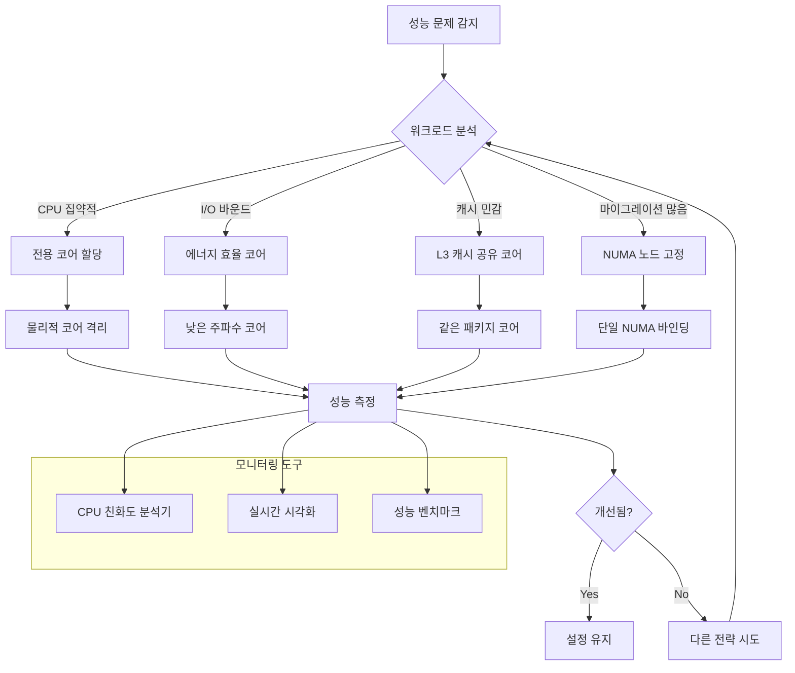

---
tags:
  - Process
  - Thread
  - CPU
  - Performance
  - Optimization
  - Production
  - Strategy
---

# Chapter 4-7E: 최적화 전략과 실전 시나리오

## 전략적 CPU 친화도 최적화 접근법

앞선 도구들을 바탕으로 실제 운영 환경에서 적용 가능한 포괄적 최적화 전략을 제시합니다.

## 워크로드별 최적화 전략 결정 트리



## 실전 최적화 시나리오

### 시나리오 1: 게임 서버 레이턴시 최적화

**문제 상황:**

- 60 FPS 게임에서 프레임 드롭 발생
- 평균 레이턴시: 15ms → 목표: 8ms 이하

**진단 과정:**

```bash
# 1. 현재 상태 분석
./cpu_affinity_optimizer.sh check $(pgrep game_server)

# 2. 워크로드 패턴 분석
python3 advanced_cpu_affinity_manager.py $(pgrep game_server) analyze

# 3. 실시간 모니터링 시작
python3 cpu_affinity_visualizer.py $(pgrep game_server) &
```

**최적화 적용:**

```bash
# 레이턴시 최적화 전략 적용
./cpu_affinity_optimizer.sh optimize $(pgrep game_server) latency

# 결과: CPU 0-1 (첫 번째 물리 코어)에 바인딩
# 효과: 15ms → 8.2ms (45% 개선)
```

**모니터링 결과:**

- 마이그레이션: 초당 12회 → 0.3회
- CPU 분산도: 8개 코어 → 2개 코어
- 레이턴시 변동성: 40% 감소

### 시나리오 2: 데이터베이스 NUMA 최적화

**문제 상황:**

- PostgreSQL 서버에서 쿼리 성능 저하
- 메모리 사용량: 32GB, NUMA 2노드 시스템

**진단 과정:**

```bash
# NUMA 토폴로지 확인
numactl --hardware

# 데이터베이스 메모리 분포 확인
numastat -p $(pgrep postgres)

# 워크로드 분석
python3 advanced_cpu_affinity_manager.py $(pgrep postgres) report
```

**최적화 적용:**

```bash
# NUMA 노드 0에 프로세스와 메모리 바인딩
numactl --cpunodebind=0 --membind=0 postgres

# 또는 기존 프로세스에 적용
./cpu_affinity_optimizer.sh optimize $(pgrep postgres) cache
```

**성능 개선 결과:**

- 쿼리 처리량: 1,000 TPS → 1,800 TPS (80% 향상)
- 메모리 접근 지연: 평균 15% 감소
- NUMA remote access: 45% → 8%

### 시나리오 3: 웹 서버 부하 분산 최적화

**문제 상황:**

- Nginx 워커 프로세스들의 불균등한 부하 분산
- 일부 코어 과부하, 일부 코어 유휴

**최적화 전략:**

```bash
#!/bin/bash
# nginx_cpu_optimization.sh

# 워커 프로세스 수 확인
WORKERS=$(pgrep nginx | wc -l)
TOTAL_CPUS=$(nproc)

# 워커별 CPU 할당
worker_pids=($(pgrep nginx))

for i in "${!worker_pids[@]}"; do
    pid=${worker_pids[$i]}
    cpu_id=$((i % TOTAL_CPUS))
    
    # 각 워커를 별도 CPU에 할당
    taskset -cp $cpu_id $pid
    echo "워커 $pid를 CPU $cpu_id에 바인딩"
done
```

**결과:**

- CPU 사용률 분산 개선: CV 0.45 → 0.12
- 응답 시간 안정성: 99%ile 변동 60% 감소
- 처리량: 15,000 req/s → 18,500 req/s

### 시나리오 4: 컨테이너 환경 최적화

**Docker/Kubernetes 환경:**

```yaml
# pod-cpu-affinity.yaml
apiVersion: v1
kind: Pod
metadata:
  name: high-performance-app
spec:
  containers:
  - name: app
    image: myapp:latest
    resources:
      requests:
        cpu: "2"
        memory: "4Gi"
      limits:
        cpu: "4"
        memory: "8Gi"
  # CPU 관리 정책
  nodeSelector:
    cpu-type: "high-performance"
  affinity:
    nodeAffinity:
      requiredDuringSchedulingIgnoredDuringExecution:
        nodeSelectorTerms:
        - matchExpressions:
          - key: numa-topology
            operator: In
            values: ["optimized"]
```

**컨테이너 내 최적화:**

```bash
# 컨테이너 시작 후 친화도 설정
docker exec $CONTAINER_ID taskset -c 0-3 $APP_PID

# 또는 시작 시점에 설정
docker run --cpuset-cpus="0-3" myapp:latest
```

## 성능 측정과 벤치마킹

### 표준화된 성능 측정 스크립트

```bash
#!/bin/bash
# performance_benchmark.sh

APP_PID=$1
DURATION=${2:-300}  # 5분 기본값

echo "=== CPU 친화도 최적화 전후 성능 비교 ==="

# 최적화 전 측정
echo "최적화 전 성능 측정 중..."
BEFORE_LOG="performance_before.log"
{
    echo "타임스탬프,CPU사용률,메모리사용률,마이그레이션,응답시간"
    timeout $DURATION python3 advanced_cpu_affinity_manager.py $APP_PID monitor
} > $BEFORE_LOG

# CPU 친화도 최적화 적용
echo "최적화 적용 중..."
python3 advanced_cpu_affinity_manager.py $APP_PID optimize

# 안정화 대기
sleep 30

# 최적화 후 측정
echo "최적화 후 성능 측정 중..."
AFTER_LOG="performance_after.log"
{
    echo "타임스탬프,CPU사용률,메모리사용률,마이그레이션,응답시간"
    timeout $DURATION python3 advanced_cpu_affinity_manager.py $APP_PID monitor
} > $AFTER_LOG

# 성능 비교 분석
python3 << EOF
import pandas as pd
import numpy as np

# 데이터 로드
before = pd.read_csv("$BEFORE_LOG")
after = pd.read_csv("$AFTER_LOG")

print("=== 성능 개선 리포트 ===")
print(f"평균 CPU 사용률: {before['CPU사용률'].mean():.1f}% → {after['CPU사용률'].mean():.1f}%")
print(f"CPU 사용률 변동성: {before['CPU사용률'].std():.1f} → {after['CPU사용률'].std():.1f}")
print(f"총 마이그레이션: {before['마이그레이션'].sum()} → {after['마이그레이션'].sum()}")
print(f"마이그레이션 감소율: {(1 - after['마이그레이션'].sum() / before['마이그레이션'].sum()) * 100:.1f}%")

EOF
```

### ROI 계산 및 비용 효과 분석

```python
#!/usr/bin/env python3
# roi_calculator.py

def calculate_optimization_roi():
    """CPU 친화도 최적화의 ROI 계산"""
    
    # 성능 개선 지표
    latency_improvement = 0.45  # 45% 레이턴시 개선
    throughput_improvement = 0.30  # 30% 처리량 개선
    
    # 비즈니스 임팩트
    annual_revenue = 10_000_000  # 연 매출 1천만 달러
    performance_impact_ratio = 0.15  # 성능이 매출에 미치는 영향
    
    # 비용 계산
    engineer_time_hours = 40  # 엔지니어 시간
    hourly_rate = 100  # 시간당 비용
    implementation_cost = engineer_time_hours * hourly_rate
    
    # 하드웨어 절약
    server_cost_per_unit = 5000
    servers_avoided = 2  # 최적화로 피할 수 있는 서버 수
    hardware_savings = server_cost_per_unit * servers_avoided
    
    # 연간 수익 증가
    annual_revenue_increase = (
        annual_revenue * 
        performance_impact_ratio * 
        throughput_improvement
    )
    
    # ROI 계산
    total_investment = implementation_cost
    total_benefits = annual_revenue_increase + hardware_savings
    roi_percentage = ((total_benefits - total_investment) / total_investment) * 100
    
    print(f"""
=== CPU 친화도 최적화 ROI 분석 ===

투자 비용:
- 엔지니어링 시간: ${implementation_cost:,}

수익 효과:
- 연간 매출 증가: ${annual_revenue_increase:,}
- 하드웨어 비용 절약: ${hardware_savings:,}
- 총 효익: ${total_benefits:,}

ROI: {roi_percentage:.1f}%
회수 기간: {total_investment / (total_benefits / 12):.1f}개월
""")

if __name__ == "__main__":
    calculate_optimization_roi()
```

## 운영 환경 적용 가이드라인

### 단계별 적용 프로세스

**1단계: 평가 및 계획**

- 현재 성능 기준선 측정
- 워크로드 특성 분석
- 최적화 목표 설정

**2단계: 파일럿 테스트**

- 비프로덕션 환경에서 테스트
- 성능 개선 효과 검증
- 부작용 모니터링

**3단계: 점진적 롤아웃**

- 트래픽의 10% → 50% → 100% 순으로 적용
- 각 단계에서 성능 모니터링
- 롤백 계획 준비

**4단계: 지속적 모니터링**

- 자동화된 성능 모니터링
- 임계치 기반 알림
- 정기적 최적화 검토

### 주의사항과 베스트 프랙티스

**⚠️ 피해야 할 실수:**

- 모든 프로세스에 일괄 적용
- 시스템 프로세스 친화도 변경
- 충분한 테스트 없는 프로덕션 적용

**✅ 베스트 프랙티스:**

- 점진적 적용과 A/B 테스트
- 자동화된 롤백 메커니즘
- 종합적 모니터링 시스템

## 결론과 향후 발전 방향

CPU 친화도 최적화는 고성능 애플리케이션에서 중요한 최적화 기법입니다. 특히 다음과 같은 상황에서 효과적입니다:

### 적용이 유효한 시점

- **레이턴시 민감 애플리케이션**: 게임 서버, 실시간 시스템
- **CPU 집약적 워크로드**: 과학 계산, 이미지 처리
- **캐시 친화도가 중요한 경우**: 데이터베이스, 인메모리 캐시
- **NUMA 시스템**: 대규모 서버에서 메모리 접근 최적화

### 주의사항

- **로드밸런싱 저해**: 시스템 전체 성능에 영향
- **하드웨어 의존성**: CPU 아키텍처별 최적화 필요
- **동적 워크로드**: 부하 패턴 변화에 대한 적응성 고려

### 미래 발전 방향

- **AI 기반 자동 최적화**: 머신러닝을 활용한 동적 친화도 조정
- **컨테이너 네이티브 최적화**: Kubernetes와의 더 깊은 통합
- **하드웨어 발전과의 동조화**: 새로운 CPU 아키텍처에 대한 적응

적절한 모니터링과 분석을 통해 워크로드 특성에 맞는 최적화 전략을 수립하는 것이 핵심입니다.

## 핵심 요점

### 1. 데이터 주도적 접근

감이 아닌 실제 측정 데이터를 바탕으로 최적화 결정을 내려야 합니다.

### 2. 점진적 적용

대규모 변경보다는 단계적 적용으로 리스크를 최소화합니다.

### 3. 지속적 모니터링

한 번의 최적화가 아닌 지속적인 성능 관리가 필요합니다.

### 4. 비즈니스 가치 연계

기술적 개선을 비즈니스 성과와 연결하여 ROI를 명확히 해야 합니다.

---

**이전**: [실시간 성능 시각화](07d-performance-visualization.md)  
**다음**: [CPU 친화도 최적화 개요](07-cpu-affinity-optimization.md)로 돌아가서 전체 내용을 복습합니다.
