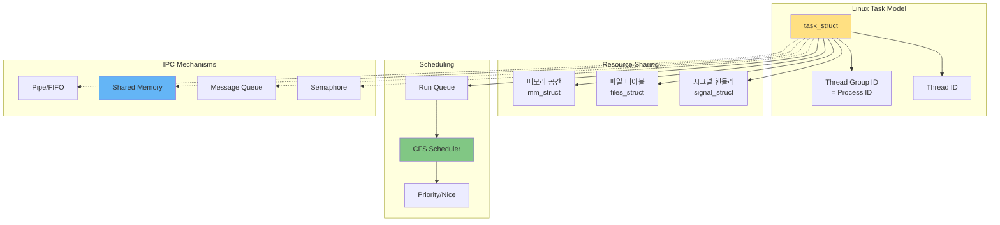

---
tags:
  - Process
  - Thread
  - Scheduling
  - Guide
  - Concurrency
  - SystemProgramming
---

# Chapter 4: 프로세스와 스레드 - 동시성의 기초

## 이 장에서 다루는 내용

"프로세스를 쓸까, 스레드를 쓸까?"

이 질문은 모든 시스템 프로그래머가 고민하는 영원한 숙제입니다. 교과서는 "프로세스는 무겁고 스레드는 가볍다"고 말하지만, Linux 커널 개발자 Linus Torvalds는 "프로세스와 스레드는 본질적으로 같다"고 말합니다. 

이 장에서는 프로세스와 스레드의 진짜 차이, Linux의 독특한 task 모델, 스케줄링 메커니즘, 그리고 프로세스 간 통신 방법까지 동시성 프로그래밍의 모든 것을 깊이 탐구합니다.

## 왜 이것을 알아야 하는가?

### 실무에서 마주치는 동시성 문제들

다음과 같은 상황을 경험해보셨나요?

- 🍴 **Fork Bomb**: 시스템이 프로세스 생성으로 마비되는 상황
- 🔒 **Deadlock**: 프로그램이 영원히 멈춰버리는 교착 상태
- 🏃 **Race Condition**: 간헐적으로 발생하는 이상한 버그
- ⚡ **Context Switching**: CPU는 놀고 있는데 성능이 나쁜 이유
- 🎯 **CPU Affinity**: 멀티코어를 제대로 활용하지 못하는 문제

이런 문제들의 근본 원인은 프로세스와 스레드의 동작 원리를 제대로 이해하지 못했기 때문입니다. 이 장을 완전히 이해하면, 효율적이고 안정적인 동시성 프로그램을 작성할 수 있습니다.

## 프로세스/스레드 아키텍처 한눈에 보기



## 이 장의 구성

### [4-1: 프로세스 생성과 종료](01-process-creation.md)

**"생명의 시작과 끝 - fork에서 exit까지"**

- 🍴 **fork() 메커니즘**: 프로세스 복제의 내부 동작
- 🚀 **exec() 계열**: 새로운 프로그램으로 변신
- ⚡ **vfork()와 clone()**: 특수한 프로세스 생성
- 💀 **좀비와 고아**: 프로세스 종료의 함정

### [4-2: 스레드와 동기화](02-thread-sync.md)

**"협력과 경쟁 - 스레드 프로그래밍의 정수"**

- 🧵 **pthread 라이브러리**: POSIX 스레드 프로그래밍
- 🔒 **뮤텍스와 세마포어**: 임계 영역 보호
- 🔄 **조건 변수**: 스레드 간 협업
- ⚠️ **데드락 방지**: 교착 상태 예방과 해결

### [4-3: 스케줄링과 우선순위](03-scheduling.md)

**"CPU를 누가 쓸 것인가 - 스케줄러의 결정"**

- ⚖️ **CFS 스케줄러**: 완전 공정 스케줄러의 원리
- 🎯 **실시간 스케줄링**: FIFO와 RR 정책
- 📊 **Nice와 Priority**: 우선순위 조정
- 🔧 **CPU Affinity**: 코어 바인딩과 NUMA

### [4-4: 시그널과 IPC](04-signal-ipc.md)

**"프로세스 간 대화 - 통신과 동기화"**

- 📡 **시그널 메커니즘**: 비동기 이벤트 처리
- 🚰 **파이프와 FIFO**: 단방향 통신
- 💾 **공유 메모리**: 고속 데이터 공유
- 📬 **메시지 큐**: 구조화된 메시지 전달

## 실습 환경 준비

이 장의 예제들을 직접 실행해보려면 다음 도구들이 필요합니다:

```bash
# 프로세스/스레드 분석 도구
$ ps aux                     # 프로세스 목록
$ top -H                     # 스레드별 CPU 사용량
$ pstree -p                  # 프로세스 트리
$ cat /proc/pid/status       # 프로세스 상태 정보

# 스케줄링 분석
$ chrt -p <pid>             # 스케줄링 정책 확인
$ taskset -p <pid>          # CPU 어피니티 확인
$ schedtool <pid>           # 스케줄링 파라미터

# IPC 모니터링
$ ipcs                      # IPC 자원 목록
$ lsof -p <pid>            # 열린 파일과 소켓
$ strace -p <pid>          # 시스템 콜 추적

# 성능 분석
$ perf sched               # 스케줄링 이벤트 분석
$ perf lock                # 락 경합 분석
```

## 이 장을 읽고 나면

✅ **프로세스/스레드 이해**: Linux task 모델을 완벽히 이해  
✅ **동시성 프로그래밍**: 안전하고 효율적인 멀티스레드 코드 작성  
✅ **스케줄링 최적화**: 워크로드에 맞는 스케줄링 정책 선택  
✅ **IPC 활용**: 적절한 프로세스 간 통신 방법 선택  
✅ **성능 튜닝**: 컨텍스트 스위칭 최소화와 CPU 활용 최적화  

## 핵심 개념 미리보기

```mermaid
mindmap
  root((프로세스와 스레드))
    프로세스 관리
      생성
        fork()
        vfork()
        clone()
        exec()
      종료
        exit()
        wait()
        좀비 프로세스
        고아 프로세스
      자원
        메모리 공간
        파일 디스크립터
        시그널 핸들러
    스레드
      pthread
        pthread_create()
        pthread_join()
        pthread_detach()
      동기화
        뮤텍스
        세마포어
        조건 변수
        배리어
      TLS
        Thread Local Storage
        __thread 키워드
    스케줄링
      정책
        SCHED_NORMAL (CFS)
        SCHED_FIFO
        SCHED_RR
        SCHED_BATCH
        SCHED_IDLE
      우선순위
        Nice 값
        실시간 우선순위
        CPU 어피니티
      성능
        컨텍스트 스위칭
        캐시 친화성
        NUMA 최적화
    IPC
      시그널
        표준 시그널
        실시간 시그널
        시그널 핸들러
      파이프
        익명 파이프
        명명된 파이프 (FIFO)
      System V IPC
        공유 메모리
        메시지 큐
        세마포어
      POSIX IPC
        mmap
        POSIX 메시지 큐
        POSIX 세마포어
```

## 프로세스/스레드 선택 플로우차트

```mermaid
graph TD
    Start[동시성 필요] --> Isolation{격리 필요?}
    
    Isolation -->|Yes| Process[프로세스 사용]
    Process --> Fork[fork() 또는 spawn]
    
    Isolation -->|No| Share{데이터 공유?}
    Share -->|많음| Thread[스레드 사용]
    Thread --> Pthread[pthread 라이브러리]
    
    Share -->|적음| Overhead{오버헤드 민감?}
    Overhead -->|Yes| Thread
    Overhead -->|No| Process
    
    Thread --> Sync{동기화 복잡도?}
    Sync -->|높음| Careful[신중한 설계 필요]
    Sync -->|낮음| Simple[간단한 뮤텍스]
    
    Process --> IPC{통신 필요?}
    IPC -->|Yes| IPCMethod[IPC 방법 선택]
    IPC -->|No| Independent[독립 실행]
```

## 관련 문서

### 선행 지식
- [Chapter 3: Virtual Memory](../chapter-03-virtual-memory/index.md) - 가상 메모리와 주소 공간
- [Memory Management](../chapter-02-memory/index.md) - 메모리 관리 기초
- [CPU Architecture](../chapter-05-1-cpu-architecture-and-execution.md) - CPU 실행 모델

### 관련 주제
- [Context Switching](../chapter-05-3-context-switching.md) - 프로세스 전환 메커니즘
- [Async Programming](../chapter-08-async-event-programming.md) - 비동기 프로그래밍 패턴
- [Performance Optimization](../chapter-10-performance-optimization.md) - 동시성 최적화

## 다음 단계

이제 [4-1: 프로세스 생성과 종료](01-process-creation.md)부터 시작하여, Unix의 가장 우아한 설계 중 하나인 fork 메커니즘을 깊이 있게 탐구해봅시다.

프로세스와 스레드는 단순한 실행 단위가 아닙니다. 현대 컴퓨터 시스템의 동시성, 병렬성, 효율성을 결정하는 핵심 개념입니다. 이 여정을 통해 진정한 시스템 프로그래머로 거듭나게 될 것입니다.