---
tags:
  - balanced
  - intermediate
  - kernel_interface
  - medium-read
  - privilege_level
  - ptrace
  - system_call
  - user_space
  - 시스템프로그래밍
difficulty: INTERMEDIATE
learning_time: "4-6시간"
main_topic: "시스템 프로그래밍"
priority_score: 4
---

# 4.1.1: 시스템 호출 기초와 인터페이스

## 이 문서를 읽으면 답할 수 있는 질문들

- 시스템 호출이란 정확히 무엇인가?
- 사용자 공간과 커널 공간은 어떻게 구분되는가?
- printf()를 호출하면 내부에서 어떤 일이 일어나는가?
- 왜 시스템 호출은 일반 함수 호출보다 비용이 클까?
- 직접 시스템 호출을 할 수 있는 방법은?

## 들어가며: 운영체제와의 대화

여러분이 파일을 열고, 네트워크 연결을 만들고, 새로운 프로세스를 생성할 때, 프로그램은 운영체제에게 도움을 요청해야 합니다. 하지만 운영체제의 핵심 부분(커널)은 보안상의 이유로 일반 프로그램이 직접 접근할 수 없는 보호된 영역에 있습니다.

이것은 마치 은행과 같습니다. 고객(사용자 프로그램)이 금고(커널)에 직접 들어갈 수는 없고, 반드시 창구 직원(시스템 호출)을 통해서만 업무를 처리할 수 있습니다.

```mermaid
graph TB
    subgraph "사용자 공간 (User Space)"
        APP[애플리케이션 프로그램]
        LIB[표준 라이브러리, glibc, musl]
    end
    
    subgraph "커널 공간 (Kernel Space)"
        SYSCALL[시스템 호출 인터페이스]
        FS[파일시스템]
        NET[네트워크 스택]
        MEM[메모리 관리]
        PROC[프로세스 관리]
    end
    
    subgraph "하드웨어"
        CPU[CPU]
        RAM[메모리]
        DISK[디스크]
        NIC[네트워크 인터페이스]
    end
    
    APP --> LIB
    LIB --> SYSCALL
    SYSCALL --> FS
    SYSCALL --> NET
    SYSCALL --> MEM
    SYSCALL --> PROC
    
    FS --> DISK
    NET --> NIC
    MEM --> RAM
    PROC --> CPU
    
    style APP fill:#E3F2FD
    style SYSCALL fill:#FFE082
    style FS fill:#E8F5E9
    style CPU fill:#FFEBEE
```



이 장에서는 프로그램과 운영체제 사이의 이 중요한 인터페이스를 깊이 있게 탐구해보겠습니다.

## 1. 시스템 호출의 본질: 특권 레벨의 경계

### 1.1 왜 두 개의 세계가 필요한가?

현대 프로세서는 보안과 안정성을 위해**특권 레벨(Privilege Level)**이라는 개념을 제공합니다. x86-64 아키텍처에서는 4개의 링(Ring 0-3)이 있지만, 실제로는 주로 두 개만 사용됩니다:

```mermaid
graph TB
    subgraph "CPU 특권 레벨"
        R0["Ring 0 (커널 모드)
모든 CPU 명령어 사용 가능
물리 메모리 직접 접근
하드웨어 제어
인터럽트 처리"]
        
        R3["Ring 3 (사용자 모드)
제한된 명령어만 사용
가상 메모리만 접근
하드웨어 직접 제어 불가
시스템 호출로만 커널 요청"]
    end
    
    R3 -."시스템 호출".-> R0
    R0 -."결과 반환".-> R3
    
    style R0 fill:#FFCDD2
    style R3 fill:#C8E6C9
```



이런 분리가 없다면 어떤 일이 일어날까요?

```c
// 만약 보호 메커니즘이 없다면...
void malicious_program() {
    // 다른 프로세스의 메모리 읽기
    char* secret = (char*)0x12345678;
    printf("Secret: %s, ", secret);
    
    // 시스템을 멈추기
    asm volatile("cli; hlt");  // 인터럽트 비활성화 후 정지
    
    // 디스크 직접 제어
    outb(0x1F6, 0xA0);  // 하드디스크 컨트롤러 조작
}
```

이런 코드가 실행된다면 시스템은 즉시 다운되거나 보안이 완전히 뚫릴 것입니다.

### 1.2 시스템 호출: 안전한 통로

시스템 호출은 사용자 프로그램이 커널의 서비스를 안전하게 이용할 수 있는**유일한 정당한 방법**입니다.

```c
// system_call_demo.c
#include <stdio.h>
#include <unistd.h>
#include <sys/types.h>
#include <fcntl.h>

int main() {
    // 각 함수 호출이 어떤 시스템 호출을 사용하는지 관찰
    printf("=== 시스템 호출 데모 ===, ");
    
    // 1. 파일 열기 (open 시스템 호출)
    int fd = open("/etc/passwd", O_RDONLY);
    printf("파일 디스크립터: %d, ", fd);
    
    // 2. 파일 읽기 (read 시스템 호출)
    char buffer[100];
    ssize_t bytes_read = read(fd, buffer, sizeof(buffer) - 1);
    buffer[bytes_read] = '\0';
    
    // 3. 화면에 출력 (write 시스템 호출)
    write(STDOUT_FILENO, buffer, bytes_read);
    
    // 4. 파일 닫기 (close 시스템 호출)
    close(fd);
    
    // 5. 프로세스 ID 가져오기 (getpid 시스템 호출)
    pid_t pid = getpid();
    printf(", 현재 프로세스 ID: %d, ", pid);
    
    return 0;  // 프로그램 종료 (exit_group 시스템 호출)
}
```

이 간단한 프로그램에서만도 7개의 서로 다른 시스템 호출이 사용됩니다!

### 1.3 시스템 호출 번호: 커널의 전화번호부

각 시스템 호출은 고유한 번호를 가집니다. 이는 커널이 어떤 서비스를 제공해야 하는지 식별하는 방법입니다.

```c
// syscall_numbers.c - 시스템 호출 번호 확인
#include <stdio.h>
#include <sys/syscall.h>
#include <unistd.h>

int main() {
    printf("=== 주요 시스템 호출 번호 (x86-64) ===, ");
    printf("SYS_read:     %3ld, ", SYS_read);      // 0
    printf("SYS_write:    %3ld, ", SYS_write);     // 1  
    printf("SYS_open:     %3ld, ", SYS_open);      // 2
    printf("SYS_close:    %3ld, ", SYS_close);     // 3
    printf("SYS_stat:     %3ld, ", SYS_stat);      // 4
    printf("SYS_fstat:    %3ld, ", SYS_fstat);     // 5
    printf("SYS_mmap:     %3ld, ", SYS_mmap);      // 9
    printf("SYS_brk:      %3ld, ", SYS_brk);       // 12
    printf("SYS_clone:    %3ld, ", SYS_clone);     // 56
    printf("SYS_fork:     %3ld, ", SYS_fork);      // 57
    printf("SYS_execve:   %3ld, ", SYS_execve);    // 59
    printf("SYS_exit:     %3ld, ", SYS_exit);      // 60
    printf("SYS_getpid:   %3ld, ", SYS_getpid);    // 39
    
    // 직접 시스템 호출 사용해보기
    long pid = syscall(SYS_getpid);
    printf(", 직접 시스템 호출로 얻은 PID: %ld, ", pid);
    printf("getpid()로 얻은 PID: %d, ", getpid());
    
    return 0;
}
```

## 2. 시스템 호출의 메커니즘: 어떻게 동작하는가?

### 2.1 x86-64에서의 시스템 호출 과정

시스템 호출이 실행되는 전체 과정을 단계별로 살펴봅시다:

```mermaid
sequenceDiagram
    participant App as 사용자 프로그램
    participant Lib as glibc
    participant CPU as CPU
    participant Kernel as 커널
    
    App->>Lib: printf("Hello")
    Lib->>Lib: 시스템 호출 번호 설정 (rax = 1)
    Lib->>Lib: 매개변수 설정 (rdi, rsi, rdx)
    Lib->>CPU: syscall 명령어 실행
    
    Note over CPU: 사용자 모드 → 커널 모드 전환
    CPU->>Kernel: 시스템 호출 핸들러 호출
    Kernel->>Kernel: sys_write() 실행
    Kernel->>Kernel: 파일 디스크립터 검증
    Kernel->>Kernel: 버퍼 데이터 커널로 복사
    Kernel->>Kernel: 실제 출력 수행
    
    Note over CPU: 커널 모드 → 사용자 모드 전환
    Kernel->>CPU: 결과 반환 (rax)
    CPU->>Lib: 시스템 호출 완료
    Lib->>App: printf() 반환
```



### 2.2 레지스터를 통한 매개변수 전달

x86-64에서 시스템 호출은 특정 레지스터를 통해 매개변수를 전달합니다:

```c
// direct_syscall.c - 직접 시스템 호출 구현
#include <stdio.h>
#include <sys/syscall.h>

// 직접 write 시스템 호출 구현
long direct_write(int fd, const void *buf, size_t count) {
    long result;
    
    asm volatile (
        "movl %1, %%edi, \t"        // fd → rdi
        "movq %2, %%rsi, \t"        // buf → rsi  
        "movq %3, %%rdx, \t"        // count → rdx
        "movl $1, %%eax, \t"        // SYS_write (1) → rax
        "syscall, \t"               // 시스템 호출 실행
        "movq %%rax, %0"            // 결과 → result
        : "=r" (result)
        : "r" (fd), "r" (buf), "r" (count)
        : "rax", "rdi", "rsi", "rdx", "rcx", "r11", "memory"
    );
    
    return result;
}

int main() {
    const char *msg = "직접 시스템 호출로 출력, ";
    
    // 직접 구현한 시스템 호출 사용
    direct_write(1, msg, 26);
    
    // 비교: 표준 라이브러리 사용
    printf("표준 라이브러리로 출력, ");
    
    return 0;
}
```

### 2.3 시스템 호출의 비용: 왜 느릴까?

시스템 호출이 일반 함수 호출보다 비싼 이유를 실제로 측정해봅시다:

```c
// syscall_benchmark.c
#include <stdio.h>
#include <time.h>
#include <unistd.h>
#include <sys/syscall.h>

// 빈 함수 (일반 함수 호출 비용)
int empty_function() {
    return 42;
}

// 시간 측정 매크로
#define MEASURE_TIME(label, iterations, code) do { \
    struct timespec start, end; \
    clock_gettime(CLOCK_MONOTONIC, &start); \
    for (int i = 0; i < iterations; i++) { \
        code; \
    } \
    clock_gettime(CLOCK_MONOTONIC, &end); \
    long nanos = (end.tv_sec - start.tv_sec) * 1000000000L + \
                 (end.tv_nsec - start.tv_nsec); \
    printf("%s: %ld iterations in %ld ns (%.2f ns per call), ", \
           label, (long)iterations, nanos, (double)nanos / iterations); \
} while(0)

int main() {
    const int iterations = 1000000;
    
    printf("=== 함수 호출 vs 시스템 호출 성능 비교 ===, ");
    
    // 1. 일반 함수 호출
    MEASURE_TIME("일반 함수 호출", iterations, 
                 empty_function());
    
    // 2. 시스템 호출 (getpid - 가장 빠른 시스템 호출 중 하나)
    MEASURE_TIME("getpid() 시스템 호출", iterations/1000,  // 1000배 적게
                 getpid());
    
    // 3. 직접 시스템 호출
    MEASURE_TIME("직접 syscall", iterations/1000,
                 syscall(SYS_getpid));
    
    printf(", === 시스템 호출이 느린 이유 ===, ");
    printf("1. 커널 모드로 전환하는 오버헤드, ");
    printf("2. 레지스터 상태 저장/복원, "); 
    printf("3. 매개변수 검증 및 복사, ");
    printf("4. 커널 내부 함수 호출, ");
    printf("5. 사용자 모드로 복귀, ");
    
    return 0;
}
```

일반적인 결과:

- 일반 함수 호출: ~1-2ns
- 시스템 호출: ~100-300ns (100-300배 더 느림!)

## 3. 시스템 호출의 분류: 서비스별 카테고리

시스템 호출은 제공하는 서비스에 따라 여러 카테고리로 나눌 수 있습니다:

### 3.1 파일 및 I/O 관련

```c
// file_syscalls_demo.c
#include <stdio.h>
#include <fcntl.h>
#include <unistd.h>
#include <sys/stat.h>

void demonstrate_file_syscalls() {
    printf("=== 파일 관련 시스템 호출 ===, ");
    
    // 1. open - 파일 열기
    int fd = open("test.txt", O_CREAT | O_WRONLY | O_TRUNC, 0644);
    if (fd == -1) {
        perror("open");
        return;
    }
    printf("파일 열기 성공: fd=%d, ", fd);
    
    // 2. write - 파일 쓰기
    const char *data = "Hello, System Call!, ";
    ssize_t written = write(fd, data, 20);
    printf("쓰기 완료: %zd bytes, ", written);
    
    // 3. close - 파일 닫기
    close(fd);
    
    // 4. stat - 파일 정보 확인
    struct stat file_stat;
    if (stat("test.txt", &file_stat) == 0) {
        printf("파일 크기: %ld bytes, ", file_stat.st_size);
        printf("수정 시간: %ld, ", file_stat.st_mtime);
    }
    
    // 5. unlink - 파일 삭제
    unlink("test.txt");
    printf("파일 삭제 완료, ");
}
```

### 3.2 프로세스 및 스레드 관리

```c
// process_syscalls_demo.c
#include <stdio.h>
#include <unistd.h>
#include <sys/wait.h>
#include <sys/types.h>

void demonstrate_process_syscalls() {
    printf("=== 프로세스 관련 시스템 호출 ===, ");
    
    // 1. getpid - 현재 프로세스 ID
    pid_t current_pid = getpid();
    printf("현재 프로세스 ID: %d, ", current_pid);
    
    // 2. getppid - 부모 프로세스 ID  
    pid_t parent_pid = getppid();
    printf("부모 프로세스 ID: %d, ", parent_pid);
    
    // 3. fork - 새 프로세스 생성
    pid_t child_pid = fork();
    
    if (child_pid == 0) {
        // 자식 프로세스
        printf("자식 프로세스: PID=%d, PPID=%d, ", getpid(), getppid());
        
        // 4. execve - 다른 프로그램 실행
        // execl("/bin/echo", "echo", "Hello from child!", NULL);
    } else if (child_pid > 0) {
        // 부모 프로세스
        printf("부모 프로세스: 자식 PID=%d, ", child_pid);
        
        // 5. wait - 자식 프로세스 대기
        int status;
        wait(&status);
        printf("자식 프로세스 종료됨, ");
    } else {
        perror("fork 실패");
    }
}
```

### 3.3 메모리 관리

```c
// memory_syscalls_demo.c
#include <stdio.h>
#include <sys/mman.h>
#include <unistd.h>
#include <string.h>

void demonstrate_memory_syscalls() {
    printf("=== 메모리 관련 시스템 호출 ===, ");
    
    // 1. brk/sbrk - 힙 크기 조정
    void *current_brk = sbrk(0);
    printf("현재 brk 위치: %p, ", current_brk);
    
    // 힙 확장
    void *new_brk = sbrk(4096);  // 4KB 확장
    printf("확장 후 brk: %p, ", sbrk(0));
    
    // 2. mmap - 메모리 매핑
    void *mapped = mmap(NULL, 4096, PROT_READ | PROT_WRITE,
                       MAP_PRIVATE | MAP_ANONYMOUS, -1, 0);
    if (mapped != MAP_FAILED) {
        printf("mmap 성공: %p, ", mapped);
        
        // 매핑된 메모리 사용
        strcpy(mapped, "Hello, mmap!");
        printf("매핑된 메모리 내용: %s, ", (char*)mapped);
        
        // 3. munmap - 메모리 매핑 해제
        munmap(mapped, 4096);
        printf("메모리 매핑 해제됨, ");
    }
    
    // 원래 힙 크기로 복원
    brk(current_brk);
}
```

### 3.4 네트워크 통신

```c
// network_syscalls_demo.c  
#include <stdio.h>
#include <sys/socket.h>
#include <netinet/in.h>
#include <arpa/inet.h>
#include <unistd.h>

void demonstrate_network_syscalls() {
    printf("=== 네트워크 관련 시스템 호출 ===, ");
    
    // 1. socket - 소켓 생성
    int sockfd = socket(AF_INET, SOCK_STREAM, 0);
    if (sockfd == -1) {
        perror("socket");
        return;
    }
    printf("소켓 생성 성공: fd=%d, ", sockfd);
    
    // 2. bind - 주소 바인딩 (서버의 경우)
    struct sockaddr_in addr;
    addr.sin_family = AF_INET;
    addr.sin_port = htons(8080);
    addr.sin_addr.s_addr = INADDR_ANY;
    
    if (bind(sockfd, (struct sockaddr*)&addr, sizeof(addr)) == -1) {
        printf("bind 실패 (포트가 사용 중일 수 있음), ");
    } else {
        printf("포트 8080에 바인딩 성공, ");
    }
    
    // 3. listen - 연결 대기 (서버의 경우)
    if (listen(sockfd, 5) == -1) {
        printf("listen 설정 실패, ");
    } else {
        printf("연결 대기 상태로 전환, ");
    }
    
    // 4. close - 소켓 닫기
    close(sockfd);
    printf("소켓 닫기 완료, ");
}
```

## 4. glibc vs 직접 시스템 호출

### 4.1 glibc 래퍼 함수의 역할

대부분의 시스템 호출은 glibc가 제공하는 래퍼 함수를 통해 사용됩니다:

```mermaid
graph TD
    subgraph USER_PROG["사용자 프로그램"]
        CALL["printf 함수 호출"]
    end
    
    subgraph GLIBC["glibc 라이브러리"]
        PRINTF["printf 함수"]
        WRITE["write 함수"]
        SYSCALL["syscall stub"]
    end
    
    subgraph KERNEL["커널"]
        HANDLER["sys_write 함수"]
        VFS["VFS 레이어"]
        TTY["TTY 드라이버"]
    end
    
    CALL --> PRINTF
    PRINTF --> WRITE
    WRITE --> SYSCALL
    SYSCALL --> HANDLER
    HANDLER --> VFS
    VFS --> TTY
    
    style PRINTF fill:#E3F2FD
    style WRITE fill:#FFF3E0
    style SYSCALL fill:#FFE082
    style HANDLER fill:#E8F5E9
```



### 4.2 래퍼 함수가 제공하는 가치

```c
// wrapper_comparison.c
#include <stdio.h>
#include <errno.h>
#include <string.h>
#include <sys/syscall.h>
#include <unistd.h>

int main() {
    printf("=== glibc 래퍼 vs 직접 시스템 호출 ===, ");
    
    // 1. glibc 래퍼 사용
    printf("== glibc 래퍼 사용 ==, ");
    int fd1 = open("/nonexistent/file", O_RDONLY);
    if (fd1 == -1) {
        printf("오류 발생: %s, ", strerror(errno));
    }
    
    // 2. 직접 시스템 호출 사용
    printf(", == 직접 시스템 호출 사용 ==, ");
    long fd2 = syscall(SYS_open, "/nonexistent/file", O_RDONLY);
    if (fd2 == -1) {
        printf("오류 코드: %ld, ", fd2);
        printf("errno: %d (%s), ", errno, strerror(errno));
    }
    
    printf(", == 래퍼 함수의 장점 ==, ");
    printf("1. 에러 처리 자동화 (errno 설정), ");
    printf("2. 타입 안전성 (int vs long), ");
    printf("3. 포팅 가능성 (아키텍처 독립적), ");
    printf("4. 추가 기능 (버퍼링, 포맷팅 등), ");
    printf("5. 디버깅 편의성, ");
    
    return 0;
}
```

### 4.3 언제 직접 시스템 호출을 사용할까?

직접 시스템 호출이 필요한 경우들:

```c
// direct_syscall_cases.c
#include <stdio.h>
#include <sys/syscall.h>
#include <unistd.h>
#include <linux/perf_event.h>

void case1_new_syscalls() {
    printf("=== 케이스 1: 새로운 시스템 호출 ===, ");
    
    // gettid() - glibc 2.30 이전에는 래퍼가 없었음
    pid_t tid = syscall(SYS_gettid);
    printf("스레드 ID: %d, ", tid);
    
    // getrandom() - 비교적 최근 추가된 시스템 호출
    char random_bytes[16];
    long ret = syscall(SYS_getrandom, random_bytes, sizeof(random_bytes), 0);
    if (ret > 0) {
        printf("랜덤 바이트 생성 성공: %ld bytes, ", ret);
    }
}

void case2_performance_critical() {
    printf(", === 케이스 2: 성능이 중요한 경우 ===, ");
    
    // 고성능이 필요할 때 래퍼 함수의 오버헤드 제거
    struct timespec start, end;
    clock_gettime(CLOCK_MONOTONIC, &start);
    
    for (int i = 0; i < 100000; i++) {
        syscall(SYS_getpid);  // 직접 호출
    }
    
    clock_gettime(CLOCK_MONOTONIC, &end);
    long nanos = (end.tv_sec - start.tv_sec) * 1000000000L + 
                 (end.tv_nsec - start.tv_nsec);
    printf("100000번 직접 시스템 호출: %ld ns, ", nanos);
}

void case3_special_parameters() {
    printf(", === 케이스 3: 특수한 매개변수 ===, ");
    
    // clone() 시스템 호출 - 복잡한 플래그 조합
    // glibc의 fork()보다 더 세밀한 제어 가능
    printf("clone() 시스템 호출로 세밀한 프로세스 제어 가능, ");
}
```

## 5. 시스템 호출 테이블: 커널의 전화번호부

### 5.1 시스템 호출 테이블의 구조

커널은 시스템 호출 번호를 함수 포인터로 매핑하는 테이블을 유지합니다:

```c
// 커널 내부 구조 (실제 커널 코드의 단순화된 버전)
/*
// arch/x86/entry/syscalls/syscall_64.tbl에서 정의
0   common  read            sys_read
1   common  write           sys_write  
2   common  open            sys_open
3   common  close           sys_close
...
*/

// 시스템 호출 핸들러 함수들
asmlinkage long sys_read(unsigned int fd, char __user *buf, size_t count);
asmlinkage long sys_write(unsigned int fd, const char __user *buf, size_t count);
asmlinkage long sys_open(const char __user *filename, int flags, umode_t mode);

// 시스템 호출 테이블
const sys_call_ptr_t sys_call_table[__NR_syscall_max+1] = {
    [0] = sys_read,
    [1] = sys_write,
    [2] = sys_open,
    [3] = sys_close,
    // ... 수백 개의 시스템 호출
};
```

### 5.2 시스템 호출 탐색 도구

실제 시스템에서 지원하는 시스템 호출을 확인해봅시다:

```c
// syscall_explorer.c
#include <stdio.h>
#include <sys/syscall.h>
#include <unistd.h>
#include <errno.h>

void explore_syscalls() {
    printf("=== 시스템 호출 탐색 ===, ");
    
    struct syscall_info {
        int number;
        const char* name;
        const char* description;
    } syscalls[] = {
        {SYS_read, "read", "파일/소켓에서 데이터 읽기"},
        {SYS_write, "write", "파일/소켓에 데이터 쓰기"},
        {SYS_open, "open", "파일 열기"},
        {SYS_close, "close", "파일 닫기"},
        {SYS_mmap, "mmap", "메모리 매핑"},
        {SYS_fork, "fork", "프로세스 복제"},
        {SYS_execve, "execve", "프로그램 실행"},
        {SYS_socket, "socket", "소켓 생성"},
        {SYS_bind, "bind", "소켓 주소 바인딩"},
        {SYS_listen, "listen", "연결 대기"},
        {0, NULL, NULL}
    };
    
    for (int i = 0; syscalls[i].name; i++) {
        printf("%3d: %-10s - %s, ", 
               syscalls[i].number, 
               syscalls[i].name, 
               syscalls[i].description);
    }
    
    // 현재 시스템의 최대 시스템 호출 번호 추정
    printf(", === 시스템 호출 범위 탐색 ===, ");
    int max_valid = 0;
    
    for (int i = 0; i < 1000; i++) {  // 0-999 범위 탐색
        long ret = syscall(i);
        if (errno != ENOSYS) {  // 시스템 호출이 존재함
            max_valid = i;
        }
        errno = 0;  // errno 리셋
    }
    
    printf("탐지된 최대 시스템 호출 번호: %d, ", max_valid);
}

int main() {
    explore_syscalls();
    return 0;
}
```

## 6. 아키텍처별 차이점

### 6.1 x86-64 vs ARM64 비교

서로 다른 아키텍처는 다른 시스템 호출 메커니즘을 사용합니다:

```c
// arch_specific_syscalls.c
#include <stdio.h>

void show_architecture_differences() {
    printf("=== 아키텍처별 시스템 호출 차이점 ===, , ");
    
    printf("**x86-64 (Intel/AMD)**, ");
    printf("- 시스템 호출 명령어: syscall, ");
    printf("- 매개변수 레지스터: rdi, rsi, rdx, r10, r8, r9, ");
    printf("- 반환값 레지스터: rax, ");
    printf("- 최대 매개변수: 6개, , ");
    
    printf("**ARM64 (AArch64)**, ");
    printf("- 시스템 호출 명령어: svc #0, ");
    printf("- 매개변수 레지스터: x0, x1, x2, x3, x4, x5, ");
    printf("- 반환값 레지스터: x0, ");
    printf("- 최대 매개변수: 6개, , ");
    
    printf("**32비트 x86 (i386)**, ");
    printf("- 시스템 호출 명령어: int 0x80 또는 sysenter, ");
    printf("- 매개변수 레지스터: ebx, ecx, edx, esi, edi, ebp, ");
    printf("- 반환값 레지스터: eax, ");
    printf("- 최대 매개변수: 6개, , ");
    
    // 현재 아키텍처 확인
    #ifdef __x86_64__
        printf("현재 컴파일된 아키텍처: x86-64, ");
    #elif __aarch64__
        printf("현재 컴파일된 아키텍처: ARM64, ");
    #elif __i386__
        printf("현재 컴파일된 아키텍처: x86 (32-bit), ");
    #else
        printf("현재 컴파일된 아키텍처: 알 수 없음, ");
    #endif
}

int main() {
    show_architecture_differences();
    return 0;
}
```

### 6.2 VDSO: 시스템 호출 최적화

VDSO(Virtual Dynamic Shared Object)는 자주 사용되는 시스템 호출을 최적화합니다:

```c
// vdso_demo.c
#include <stdio.h>
#include <time.h>
#include <sys/time.h>
#include <unistd.h>

void demonstrate_vdso() {
    printf("=== VDSO (Virtual Dynamic Shared Object) ===, ");
    
    struct timespec start, end;
    const int iterations = 1000000;
    
    // 1. gettimeofday() - VDSO로 최적화됨
    clock_gettime(CLOCK_MONOTONIC, &start);
    for (int i = 0; i < iterations; i++) {
        struct timeval tv;
        gettimeofday(&tv, NULL);
    }
    clock_gettime(CLOCK_MONOTONIC, &end);
    
    long vdso_time = (end.tv_sec - start.tv_sec) * 1000000000L + 
                     (end.tv_nsec - start.tv_nsec);
    
    // 2. getpid() - 일반 시스템 호출
    clock_gettime(CLOCK_MONOTONIC, &start);
    for (int i = 0; i < iterations; i++) {
        getpid();
    }
    clock_gettime(CLOCK_MONOTONIC, &end);
    
    long syscall_time = (end.tv_sec - start.tv_sec) * 1000000000L + 
                        (end.tv_nsec - start.tv_nsec);
    
    printf("VDSO 최적화된 gettimeofday(): %.2f ns/call, ", 
           (double)vdso_time / iterations);
    printf("일반 시스템 호출 getpid(): %.2f ns/call, ", 
           (double)syscall_time / iterations);
    printf("성능 차이: %.1fx, ", (double)syscall_time / vdso_time);
    
    // VDSO 매핑 확인
    printf(", === 현재 프로세스의 VDSO 매핑 ===, ");
    char command[100];
    sprintf(command, "cat /proc/%d/maps | grep vdso", getpid());
    system(command);
}

int main() {
    demonstrate_vdso();
    return 0;
}
```

## 7. 실습: 시스템 호출 모니터링

### 7.1 strace로 시스템 호출 추적

```bash
# 간단한 프로그램의 시스템 호출 추적
$ strace -c ./syscall_demo

# 파일 관련 시스템 호출만 추적
$ strace -e trace=file ./syscall_demo

# 네트워크 관련 시스템 호출만 추적
$ strace -e trace=network ./server

# 시간 측정과 함께
$ strace -T ./syscall_demo
```

### 7.2 간단한 시스템 호출 추적기 구현

```c
// simple_tracer.c - ptrace 시스템 호출을 활용한 프로세스 추적기
// 실제 응용: strace, gdb, perf, valgrind 등의 핵심 메커니즘
// 동작 원리: 부모 프로세스가 자식의 모든 시스템 호출을 중간에 가로채서 모니터링
#include <stdio.h>
#include <sys/ptrace.h>
#include <sys/wait.h>
#include <unistd.h>
#include <sys/user.h>

// ptrace 기반 시스템 호출 추적기의 핵심 구현
// 실제 사용: strace, gdb, perf, SystemTap 등에서 유사한 메커니즘 활용
void trace_child(pid_t child_pid) {
    int status;                        // 자식 프로세스 상태 저장
    struct user_regs_struct regs;      // CPU 레지스터 상태 저장 구조체
    
    // ⭐ 1단계: 자식 프로세스 초기 정지 상태 대기
    // PTRACE_TRACEME로 인해 자식이 execvp() 직후 자동으로 SIGSTOP 상태가 됨
    // 이는 프로세스 시작 전에 추적 준비를 완료하기 위한 동기화 메커니즘
    waitpid(child_pid, &status, 0);   // 첫 번째 SIGSTOP 신호 대기
    
    // ⭐ 2단계: 시스템 호출 추적 루프 - 프로세스가 정지 상태인 동안 계속 실행
    while (WIFSTOPPED(status)) {
        // ⭐ 3단계: 시스템 호출 진입점에서 CPU 레지스터 상태 읽기
        // orig_rax: 시스템 호출 번호 (syscall 명령어 실행 전 rax 값 보존)
        // rdi, rsi, rdx, r10, r8, r9: 시스템 호출 매개변수 1-6번째
        ptrace(PTRACE_GETREGS, child_pid, NULL, &regs);
        
        // 시스템 호출 번호 출력 (예: 1=write, 2=open, 3=close, 9=mmap 등)
        printf("시스템 호출 %lld 호출됨, ", regs.orig_rax);
        
        // ⭐ 4단계: 시스템 호출 완료까지 자식 프로세스 실행 허용
        // PTRACE_SYSCALL: 다음 시스템 호출 진입/종료 지점에서 자동 정지
        // 이는 커널 모드 진입과 사용자 모드 복귀를 모두 추적하는 핵심 메커니즘
        ptrace(PTRACE_SYSCALL, child_pid, NULL, NULL);
        waitpid(child_pid, &status, 0);   // 시스템 호출 종료 시점까지 대기
        
        // ⭐ 5단계: 시스템 호출 완료 후 상태 확인 및 결과 추출
        if (WIFSTOPPED(status)) {
            // 시스템 호출 완료 후 레지스터 상태 다시 읽기
            // rax: 시스템 호출 반환값 (성공시 양수/0, 실패시 -errno)
            ptrace(PTRACE_GETREGS, child_pid, NULL, &regs);
            printf("  -> 반환값: %lld, ", regs.rax);
            
            // ⭐ 6단계: 다음 시스템 호출까지 프로세스 계속 실행
            // 이 패턴이 프로세스 종료까지 반복되어 모든 시스템 호출을 추적
            ptrace(PTRACE_SYSCALL, child_pid, NULL, NULL);
            waitpid(child_pid, &status, 0);   // 다음 시스템 호출 진입 대기
        }
    }
    
    // 루프 종료 = 자식 프로세스가 정상 종료되었음 (WIFEXITED(status) == true)
    // 이때 모든 시스템 호출 추적이 완료됨
}

int main(int argc, char *argv[]) {
    if (argc < 2) {
        printf("사용법: %s <명령어>, ", argv[0]);
        return 1;
    }
    
    pid_t child_pid = fork();
    
    if (child_pid == 0) {
        // 자식 프로세스: 추적 당하는 프로그램
        ptrace(PTRACE_TRACEME, 0, NULL, NULL);
        execvp(argv[1], &argv[1]);
    } else {
        // 부모 프로세스: 추적자
        printf("프로세스 %d의 시스템 호출 추적 시작, ", child_pid);
        trace_child(child_pid);
    }
    
    return 0;
}
```

## 8. 정리: 시스템 호출의 핵심 개념

이 장에서 다룬 핵심 내용들을 정리하면:

### 8.1 시스템 호출의 본질

```mermaid
mindmap
  root((시스템 호출))
    보안 경계
      사용자 모드
      커널 모드  
      특권 레벨
      보호 메커니즘
    인터페이스
      시스템 호출 번호
      매개변수 전달
      반환값 처리
      에러 처리
    성능
      모드 전환 비용
      레지스터 조작
      VDSO 최적화
      캐싱 전략
    분류
      파일 I/O
      프로세스 관리
      메모리 관리
      네트워크 통신
      시간/신호
```



### 8.2 실무에서 기억해야 할 것들

1.**시스템 호출은 비용이 크다**

- 가능하면 배치(batch) 처리
- 버퍼링 활용
- 불필요한 호출 최소화

2.**glibc 래퍼 함수 활용**

- 대부분의 경우 래퍼 함수 사용 권장
- 직접 시스템 호출은 특수한 경우에만

3.**아키텍처 독립적 코딩**

- 시스템 호출 번호는 아키텍처마다 다름
- 표준 라이브러리 함수 사용 권장

4.**에러 처리 중요성**

- 모든 시스템 호출은 실패할 수 있음
- errno를 통한 적절한 에러 처리 필수

## 다음 단계

다음 섹션([Chapter 4.1.2: 리눅스 커널 아키텍처](./04-01-02-kernel-architecture.md))에서는 시스템 호출이 처리되는**커널의 내부 구조**를 탐구합니다:

- 커널의 전체 아키텍처와 서브시스템
- 모놀리식 vs 마이크로커널 설계 철학  
- 인터럽트와 예외 처리 메커니즘
- 커널 모듈과 디바이스 드라이버
- 커널 공간에서의 메모리 관리

시스템 호출의 요청자(사용자 프로그램) 관점을 이해했으니, 이제 요청을 처리하는 커널의 관점에서 시스템을 바라보겠습니다.

## 📚 관련 문서

### 📖 현재 문서 정보

-**난이도**: INTERMEDIATE
-**주제**: 시스템 프로그래밍
-**예상 시간**: 4-6시간

### 🎯 학습 경로

- [📚 INTERMEDIATE 레벨 전체 보기](../learning-paths/intermediate/)
- [🏠 메인 학습 경로](../learning-paths/)
- [📋 전체 가이드 목록](../README.md)

### 📂 같은 챕터 (chapter-04-syscall-kernel)

- [Chapter 4-1-2: 리눅스 커널 아키텍처 개요](./04-01-02-kernel-architecture.md)
- [Chapter 4-1-3: 커널 설계 철학과 아키텍처 기초](./04-01-03-kernel-design-philosophy.md)
- [Chapter 4-1-3: 커널 설계 철학과 전체 구조](./04-01-04-kernel-design-structure.md)
- [Chapter 4-1-5: 핵심 서브시스템 탐구](./04-01-05-core-subsystems.md)
- [Chapter 4-1-6: 인터럽트 처리와 모듈 시스템](./04-01-06-interrupt-module-system.md)

### 🏷️ 관련 키워드

`system_call`, `kernel_interface`, `user_space`, `privilege_level`, `ptrace`

### ⏭️ 다음 단계 가이드

- 실무 적용을 염두에 두고 프로젝트에 적용해보세요
- 관련 도구들을 직접 사용해보는 것이 중요합니다
